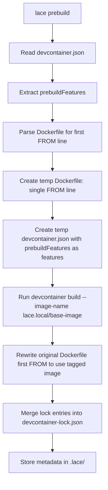

---
first_authored:
  by: "@claude-opus-4-5-20251101"
  at: 2026-01-30T18:30:00-08:00
task_list: lace/packages-lace-cli
type: proposal
state: live
status: implementation_ready
last_reviewed:
  status: accepted
  by: "@claude-opus-4-5-20251101"
  at: 2026-01-30T19:00:00-08:00
  round: 2
tags: [devcontainer, cli, prebuild, npm, architecture]
---

# packages/lace: Devcontainer Wrapper and Image Prepper

> BLUF: The `lace` CLI tool pre-bakes devcontainer features onto base images at build time, eliminating cold-start installation delays during `devcontainer up`.
> It reads a `customizations.lace.prebuildFeatures` block from devcontainer.json, runs `devcontainer build --image-name` against a temporary config with those features to produce a `lace.local/<base-image>` tagged image, and rewrites the Dockerfile's first `FROM` line to use it.
> The rewritten Dockerfile is a local-only modification (gitignored via `.lace/` metadata tracking); the original Dockerfile remains the committed source of truth.
> Lock file entries from the prebuild step are merged into the project's `devcontainer-lock.json` for reproducibility.
> The package lives at `packages/lace/` as a pnpm workspace member, published to npm as a TypeScript CLI.
> Both Dockerfile-based and `image`-based devcontainer configurations are supported.

## Objective

Provide a CLI tool that reduces devcontainer startup time by pre-building feature layers onto base images.
Devcontainer features are installed at container creation time by the devcontainer CLI, which can add minutes to every `devcontainer up` invocation.
The lace CLI shifts this work to a build step whose output is cached as a local Docker image, so subsequent container creations skip feature installation entirely.

## Background

### The cold-start problem

The devcontainer spec installs features at container creation time.
Each feature runs its own install script (apt packages, binary downloads, configuration).
For the current lace devcontainer, features like `sshd` and `git` add modest overhead, but heavier features (claude-code, wezterm-server, neovim) would add significant time.
The existing Dockerfile works around this by manually installing these tools inline, which defeats the composability benefits of devcontainer features.

### Devcontainer features as composable units

The devcontainer features ecosystem (`ghcr.io/devcontainers/features/*`, `ghcr.io/anthropics/devcontainer-features/*`) provides versioned, parameterized installation scripts.
Using features instead of Dockerfile `RUN` commands means:

- Version pinning via feature tags and lock files.
- Parameterization via feature options (no Dockerfile `ARG` boilerplate).
- Reuse across projects without copying Dockerfile snippets.

The tradeoff is installation speed, which this proposal eliminates.

### The devcontainer CLI's build command

`devcontainer build` accepts a workspace folder with a devcontainer.json and produces a Docker image with all specified features installed.
It also generates `devcontainer-lock.json` with resolved digests for each feature.
The lace CLI leverages this existing machinery rather than reimplementing feature installation.

### Project structure

The lace repository already declares `packages/lace/` in its README project structure.
The package will be a pnpm workspace member, consistent with the repository's existing use of pnpm.

## Proposed Solution

### Configuration: `customizations.lace.prebuildFeatures`

Features that should be pre-baked are declared in devcontainer.json under the `customizations.lace` namespace:

```jsonc
{
  "build": { "dockerfile": "Dockerfile" },
  "customizations": {
    "lace": {
      "prebuildFeatures": {
        "ghcr.io/anthropics/devcontainer-features/claude-code:1": {},
        "ghcr.io/weft/devcontainer-features/wezterm-server:1": {
          "version": "20240203-110809-5046fc22"
        }
      }
    }
  },
  "features": {
    "ghcr.io/devcontainers/features/git:1": {},
    "ghcr.io/devcontainers/features/sshd:1": {}
  }
}
```
> TOOD(mjr): We should add a feature for exploding on pre-conditions, first one being "detect host wezterm version and complain to user"

Features under `prebuildFeatures` are baked into the base image at build time.
Features under `features` continue to install at container creation time (appropriate for lightweight features or features that need runtime context).

### The prebuild pipeline



Step by step:

1. **Read configuration**: Parse `.devcontainer/devcontainer.json`, extract `customizations.lace.prebuildFeatures`.
2. **Parse Dockerfile**: Find the first `FROM` line (e.g., `FROM node:24-bookworm`). Handle `FROM ... AS stage` syntax; only the first stage's base image is relevant.
3. **Generate temporary workspace**: Create a temp directory containing:
   - A minimal Dockerfile with only the extracted `FROM` line.
   - A devcontainer.json with `prebuildFeatures` entries as its `features` block.
4. **Build and tag**: Run `devcontainer build --workspace-folder <temp-dir> --image-name lace.local/<original-from-image>`. The `--image-name` flag combines the build and tag steps into a single operation.
5. **Rewrite Dockerfile**: Replace the first `FROM` line with `FROM lace.local/<original-from-image>`.
6. **Merge lock file**: Capture the `devcontainer-lock.json` produced by the build step and merge its feature entries into the project's lock file.
7. **Record metadata**: Write prebuild state to `.lace/prebuild.json` (original FROM, config hash, timestamp).

### CLI commands

| Command | Description |
|---|---|
| `lace prebuild` | Run the full prebuild pipeline |
| `lace prebuild --dry-run` | Display planned actions without executing |
| `lace restore` | Undo the FROM rewrite, restoring the original Dockerfile |
| `lace status` | Show current prebuild state (original image, prebuild image, staleness) |

### Package structure

```
packages/lace/
  package.json          # name: "lace", bin: { lace: "./dist/index.js" }
  tsconfig.json
  src/
    index.ts            # CLI entry point (argument parsing, command dispatch)
    commands/
      prebuild.ts       # Prebuild pipeline orchestration
      restore.ts        # Dockerfile restoration
      status.ts         # Prebuild state inspection
    lib/
      dockerfile.ts     # Dockerfile parsing and rewriting
      devcontainer.ts   # devcontainer.json reading, temp workspace generation, CLI invocation
      lockfile.ts       # Lock file merging
      metadata.ts       # .lace/ directory management
```

## Important Design Decisions

### Decision: Pre-bake features into the base image, not into the final image

**Why:** Modifying the base image (the first `FROM` target) means all subsequent Dockerfile layers (apt installs, COPY, RUN) build on top of the pre-baked features.
This preserves the existing Dockerfile's layer structure and cache behavior.
If features were baked into the final image instead, it would require either a multi-stage build modification or a post-build feature injection, both of which are more complex and fragile.

### Decision: Use `customizations.lace` namespace instead of a separate config file

**Why:** The devcontainer spec explicitly provides `customizations.<tool>` for tool-specific configuration.
Keeping prebuild configuration in devcontainer.json keeps all container configuration in one file and follows the established convention (VSCode uses `customizations.vscode`, GitHub Codespaces uses `customizations.codespaces`).

### Decision: Tag pre-baked images as `lace.local/<original-image>` rather than content-addressed hashes

**Why:** Human-readable tags make debugging easier: `docker images | grep lace.local` immediately shows what was pre-baked and from which base.
Content-addressed hashes provide stronger guarantees but are harder to inspect.
The lock file provides the reproducibility guarantee; the tag provides the human interface.

### Decision: Only rewrite the first `FROM` line (with future `--target-stage` option)

**Why:** For single-stage Dockerfiles (the common case for devcontainers, including the current lace Dockerfile), the first `FROM` is the only base image and the correct target for pre-baking features.
For multi-stage Dockerfiles, the first FROM is chosen as a simple default.
In multi-stage builds, the first FROM is typically the build stage (not the runtime stage), so this default may not always be correct.
Users with multi-stage Dockerfiles who need features in a different stage can be supported by a future `--target-stage` flag.
Starting with the simple default covers the primary use case and avoids the complexity of analyzing multi-stage dependency graphs.

### Decision: Shell out to `devcontainer` CLI rather than using `@devcontainers/cli` as a library

**Why:** The devcontainer CLI handles feature resolution, download, and installation with significant internal complexity.
Shelling out treats it as a stable interface, avoids coupling to internal APIs, and allows users to use any devcontainer CLI version they have installed.
The library API is less documented and subject to breaking changes.
The `--image-name` flag on `devcontainer build` allows specifying the output image name directly, combining the build and tag steps.

### Decision: Rewritten Dockerfile is a local-only modification, not committed

**Why:** The Dockerfile rewrite replaces the first `FROM` line with a reference to a `lace.local/*` image that only exists on the machine where `lace prebuild` was run.
Committing this rewrite would break `devcontainer up` for anyone who has not run `lace prebuild` (the `lace.local/*` image would not exist on their machine).
Instead, the original Dockerfile remains the committed source of truth.
The `.lace/` directory (which tracks the original FROM and prebuild metadata) is gitignored.
New team members who clone the repo can either:
- Run `lace prebuild` before `devcontainer up` to get the prebaked image benefit.
- Run `devcontainer up` directly, which works because the committed Dockerfile uses the original base image (features install at creation time, slower but functional).
This approach means prebuild is a purely local optimization with zero impact on the committed codebase.

The same principle applies to the `image`-based variant: when devcontainer.json uses `image` instead of a Dockerfile, the original `image` value is stored in `.lace/prebuild.json` and the devcontainer.json rewrite is a local-only change managed by `lace restore`.
Projects using this variant should add `devcontainer.json` changes from lace to their gitignore or use a `.lace/devcontainer.override.json` pattern (future enhancement).

### Decision: Store metadata in `.lace/` rather than in devcontainer.json

**Why:** Prebuild state (original FROM, timestamps, hashes) is ephemeral build metadata, not configuration.
Storing it in devcontainer.json would mix configuration with state.
The `.lace/` directory is gitignored (it contains local build state), while devcontainer.json is committed.
Phase 1 of implementation adds `.lace/` to the project's `.gitignore`.

## Stories

### Developer adds a heavy feature to an existing project

A developer wants to add claude-code as a devcontainer feature.
Installing it at creation time adds 90 seconds to every `devcontainer up`.
They add it under `customizations.lace.prebuildFeatures`, run `lace prebuild`, and subsequent container creations start in seconds.
The Dockerfile's FROM line now points to a local image with claude-code pre-installed.

### CI rebuilds the pre-baked image on feature version bumps

A CI pipeline runs `lace prebuild` after changes to devcontainer.json.
The lock file is committed, ensuring all developers get the same feature versions.
If the prebuild config has not changed (detected via config hash), the pipeline skips the build.

### New team member onboards without lace installed

A new developer clones the repository and runs `devcontainer up` directly.
The committed Dockerfile uses the original base image (`node:24-bookworm`), so the container builds successfully.
Features listed under `prebuildFeatures` are not installed (they are not in the `features` block), but the container is functional.
When the developer installs lace and runs `lace prebuild`, the features are baked in and subsequent container rebuilds are faster.
This graceful degradation means lace is an optimization, not a hard dependency.

### Developer switches branches with different feature sets

Branch A uses claude-code + wezterm features; branch B uses only claude-code.
Each branch's devcontainer.json declares its own `prebuildFeatures`.
Running `lace prebuild` on each branch produces branch-specific local images.
`lace restore` on either branch returns the Dockerfile to its original state.

## Edge Cases / Challenging Scenarios

### Dockerfile has no FROM line

The Dockerfile parser should fail with a clear error message: "No FROM instruction found in Dockerfile."
This is already an invalid Dockerfile, so the error surfaces an existing problem.

### Base image uses a digest instead of a tag

`FROM node@sha256:abc123...` should be handled.
The `lace.local/` tag would use the digest: `lace.local/node@sha256:abc123...`.
Docker tag syntax does not support `@` in tags, so the tag should substitute it: `lace.local/node__sha256__abc123`.

### `devcontainer build` fails

Failures from the devcontainer CLI should be surfaced clearly with the full stderr output.
The original Dockerfile must not be modified if the build fails.
The pipeline should be atomic: either all steps succeed or none take effect.

### Dockerfile has already been rewritten by a previous prebuild

The metadata in `.lace/prebuild.json` tracks whether a rewrite is active.
If the current FROM already points to `lace.local/*`, the tool should compare the config hash.
If the config matches, it is a no-op.
If the config has changed, it should restore the original FROM first, then re-run the prebuild.

### No `customizations.lace.prebuildFeatures` in devcontainer.json

The tool should exit with a helpful message: "No prebuildFeatures configured in devcontainer.json. Nothing to prebuild."
Exit code 0 (not an error, just nothing to do).

### The devcontainer.json uses `image` instead of `build.dockerfile`

When devcontainer.json specifies `"image": "node:24-bookworm"` instead of a Dockerfile, the prebuild pipeline generates a temporary Dockerfile with `FROM <image>`, runs the prebuild, and stores the result.
The original `image` value is saved in `.lace/prebuild.json`.
The devcontainer.json's `image` field is then updated to point to the `lace.local/` tagged image.
This is a local-only modification, consistent with the Dockerfile rewrite strategy: `lace restore` reverts the `image` field to its original value.
Since devcontainer.json is typically committed, projects using this variant should consider using a local override mechanism or adding the `image` field change to a local gitignore pattern.

### Lock file conflicts during merge

If `devcontainer-lock.json` already contains entries for features that the prebuild also resolves, the prebuild entries take precedence.
The merge strategy is: prebuild lock entries overwrite matching keys; non-matching keys are preserved.

## Test Plan

### Unit tests

- Dockerfile parsing: various FROM formats (simple, with tag, with digest, with `AS` alias, multi-stage, commented-out FROM lines, ARG before FROM).
- Config extraction: reading `customizations.lace.prebuildFeatures` from devcontainer.json, handling missing or empty blocks.
- Tag generation: converting image references to valid `lace.local/` tags.
- Lock file merging: overwrite, preserve, and conflict scenarios.
- Metadata reading/writing: round-trip `.lace/prebuild.json`.

### Integration tests

- Full prebuild pipeline against a minimal Dockerfile and devcontainer.json with a lightweight feature.
- Idempotency: running prebuild twice produces the same result.
- Restore: verify Dockerfile returns to original state.
- Dry-run: verify no filesystem or Docker changes occur.

### Manual verification

- Run against the actual lace `.devcontainer/Dockerfile` and verify the rewritten image works with `devcontainer up`.

## Implementation Phases

### Phase 1: Package scaffold

Set up the `packages/lace/` directory as a pnpm workspace member.

- Initialize `package.json` with name, version, bin field, TypeScript dependencies.
- Configure `tsconfig.json` for Node.js CLI output.
- Create `src/index.ts` entry point with argument parsing (consider `commander` or `yargs`).
- Wire up build script (`tsc` or `tsup`) to produce `dist/`.
- Add `.lace/` to the project's `.gitignore`.
- Verify `pnpm build` and `pnpm --filter lace exec lace --help` work.

**Success criteria:** `lace --help` prints usage information. `.lace/` is gitignored.

### Phase 2: Dockerfile FROM parsing and rewriting

Implement `src/lib/dockerfile.ts`.

- Parse a Dockerfile to extract the first `FROM` instruction, handling:
  - `FROM image`
  - `FROM image:tag`
  - `FROM image:tag AS name`
  - `FROM image@sha256:digest`
  - `ARG` instructions before FROM (Docker supports this).
  - Comments and blank lines.
- Rewrite the first FROM line to a new image reference while preserving the rest of the Dockerfile exactly.
- Restore a rewritten FROM line given the original value.

**Success criteria:** Unit tests pass for all FROM format variants. A round-trip parse/rewrite/restore produces an identical file.

### Phase 3: devcontainer.json reading and temp workspace generation

Implement `src/lib/devcontainer.ts`.

- Read and parse devcontainer.json (handle JSONC: comments and trailing commas). Use the `jsonc-parser` npm package (the same parser used by the devcontainer CLI and VS Code).
- Extract `customizations.lace.prebuildFeatures`.
- Generate a temporary directory with:
  - A minimal Dockerfile containing only the extracted FROM line.
  - A devcontainer.json with `prebuildFeatures` entries as its `features` block.
- Handle the `image` variant (no Dockerfile): generate a FROM line from the image field.

**Success criteria:** Generated temp workspace files are valid inputs to `devcontainer build`.

### Phase 4: Image tagging and prebuild pipeline orchestration

Implement `src/commands/prebuild.ts` and `src/lib/metadata.ts`.

- Shell out to `devcontainer build --image-name lace.local/<base-image>` with the temp workspace.
- Rewrite the original Dockerfile's first FROM line.
- Write metadata to `.lace/prebuild.json`.
- Implement `--dry-run` flag (log planned actions, skip execution).
- Implement idempotency check (compare config hash, skip if unchanged).

**Success criteria:** Running `lace prebuild` against a test devcontainer.json produces a tagged Docker image and a rewritten Dockerfile. Running it again is a no-op.

### Phase 5: Lock file merging

Implement `src/lib/lockfile.ts`.

- Read the `devcontainer-lock.json` generated by the prebuild's `devcontainer build`.
- Merge its entries into the project's existing `devcontainer-lock.json`.
- Write the merged result.

**Success criteria:** After prebuild, the project's lock file contains resolved digests for all prebuild features. Existing entries for non-prebuild features are preserved.

### Phase 6: restore, status commands, and metadata tracking

Implement `src/commands/restore.ts` and `src/commands/status.ts`.

- `lace restore`: Read `.lace/prebuild.json`, restore the original FROM line in the Dockerfile, clean up metadata.
- `lace status`: Display current prebuild state: whether a prebuild is active, original vs. current FROM, config hash, timestamp, staleness (config changed since last prebuild).
- Handle edge case: restore when no prebuild is active (no-op with message).
- Handle edge case: status when `.lace/` does not exist (report "no prebuild active").

**Success criteria:** After `lace prebuild && lace restore`, the Dockerfile matches its original content exactly. `lace status` accurately reflects prebuild state.
