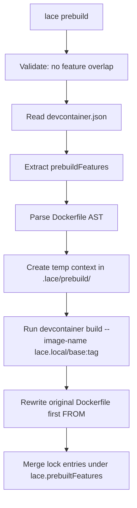

---
first_authored:
  by: "@claude-opus-4-5-20251101"
  at: 2026-01-30T18:30:00-08:00
task_list: lace/packages-lace-cli
type: proposal
state: live
status: implementation_wip
last_reviewed:
  status: accepted
  by: "@claude-opus-4-5-20251101"
  at: 2026-01-31T12:30:00-08:00
  round: 3
revised:
  by: "@claude-opus-4-5-20251101"
  at: 2026-01-31T12:00:00-08:00
  reason: "Integrating mjr feedback from round 2 review"
tags: [devcontainer, cli, prebuild, npm, architecture]
---

# packages/lace: Devcontainer Wrapper and Image Prepper

> BLUF: The `lace` CLI is a devcontainer orchestration tool focused on QoL and performance.
> Its first major capability is pre-baking devcontainer features onto base images at build time, eliminating cold-start installation delays during `devcontainer up`.
> It reads a `customizations.lace.prebuildFeatures` block from devcontainer.json, runs `devcontainer build --image-name` against a temporary context cached in `.lace/prebuild/` to produce a `lace.local/<base-image>` tagged image, and rewrites the Dockerfile's first `FROM` line to use it.
> The rewritten Dockerfile is a local-only modification (`.lace/` is gitignored); the original Dockerfile remains the committed source of truth.
> Lock file entries from the prebuild are namespaced under `lace.prebuiltFeatures` in `devcontainer-lock.json` to avoid confusing the wrapped devcontainer CLI.
> The package lives at `packages/lace/` as a pnpm workspace member, published to npm as a TypeScript CLI.

## Objective

Provide a CLI tool that reduces devcontainer startup time by pre-building feature layers onto base images.
Devcontainer features are installed at container creation time by the devcontainer CLI, which can add minutes to every `devcontainer up` invocation.
The lace CLI shifts this work to a build step whose output is cached as a local Docker image, so subsequent container creations skip feature installation entirely.

The prebuild capability is the first of several planned devcontainer orchestration features in the lace CLI.
Future capabilities will include host precondition checks (e.g., detecting host wezterm version mismatches before container build), smart cache invalidation (see followup RFP: `cdocs/rfps/`), and other devcontainer workflow automation.

## Background

### The cold-start problem

The devcontainer spec installs features at container creation time.
Each feature runs its own install script (apt packages, binary downloads, configuration).
For the current lace devcontainer, features like `sshd` and `git` add modest overhead, but heavier features (claude-code, wezterm-server, neovim) would add significant time.
The existing Dockerfile works around this by manually installing these tools inline, which defeats the composability benefits of devcontainer features.

### Devcontainer features as composable units

The devcontainer features ecosystem (`ghcr.io/devcontainers/features/*`, `ghcr.io/anthropics/devcontainer-features/*`) provides versioned, parameterized installation scripts.
Using features instead of Dockerfile `RUN` commands means:

- Version pinning via feature tags and lock files.
- Parameterization via feature options (no Dockerfile `ARG` boilerplate).
- Reuse across projects without copying Dockerfile snippets.

The tradeoff is installation speed, which this proposal eliminates.

### The devcontainer CLI's build command

`devcontainer build` accepts a workspace folder with a devcontainer.json and produces a Docker image with all specified features installed.
It also generates `devcontainer-lock.json` with resolved digests for each feature.
The lace CLI leverages this existing machinery rather than reimplementing feature installation.

### Project structure

The lace repository already declares `packages/lace/` in its README project structure.
The package will be a pnpm workspace member, consistent with the repository's existing use of pnpm.

## Proposed Solution

### Configuration: `customizations.lace.prebuildFeatures`

Features that should be pre-baked are declared in devcontainer.json under the `customizations.lace` namespace:

```jsonc
{
  "build": { "dockerfile": "Dockerfile" },
  "customizations": {
    "lace": {
      "prebuildFeatures": {
        "ghcr.io/anthropics/devcontainer-features/claude-code:1": {},
        "ghcr.io/weft/devcontainer-features/wezterm-server:1": {
          "version": "20240203-110809-5046fc22"
        }
      }
    }
  },
  "features": {
    "ghcr.io/devcontainers/features/git:1": {},
    "ghcr.io/devcontainers/features/sshd:1": {}
  }
}
```

Features under `prebuildFeatures` are baked into the base image at build time.
Features under `features` install at container creation time.
The majority of features do not require runtime context and are good candidates for prebuild; the `features` block is appropriate for features that genuinely need container-creation-time information (e.g., features that inspect mounted volumes or runtime environment variables).

Setting `"prebuildFeatures": null` explicitly disables prebuild without triggering an informational message from `lace prebuild`, which is useful when the lace CLI is installed for its other capabilities.

### Upfront validation

Before running the prebuild pipeline, lace validates:

1. **No feature overlap**: `prebuildFeatures` and `features` must not contain the same feature (compared version-insensitively by feature identifier, ignoring version tags).
   Overlapping entries would cause the feature to be installed twice (once in the pre-baked image, once at creation time), wasting time and potentially causing conflicts.
   If overlap is detected, lace exits with an error listing the duplicates.

2. **Dockerfile parsability**: The Dockerfile is parsed using an npm Dockerfile parsing library (e.g., `dockerfile-ast`) rather than ad-hoc regex.
   This gives proper syntax validation and structured access to instructions, catching malformed Dockerfiles early with clear error messages rather than failing in obscure ways during the pipeline.

### The prebuild pipeline



The temporary build context is cached in `.lace/prebuild/` (Dockerfile, devcontainer.json, and metadata) so that subsequent runs can diff the cached context against the newly generated one to determine if a rebuild is needed.

Step by step:

1. **Validate**: Check for feature overlap between `prebuildFeatures` and `features`.
   Parse the Dockerfile using a Dockerfile AST library to validate syntax and extract structure.
2. **Read configuration**: Parse `.devcontainer/devcontainer.json` (JSONC), extract `customizations.lace.prebuildFeatures`.
3. **Parse Dockerfile**: Extract the first `FROM` instruction and any preceding `ARG` instructions (Docker permits `ARG` before `FROM` for build-time variable substitution in the base image reference).
   Detect and warn about any other unsupported prelude instructions.
4. **Generate temporary context in `.lace/prebuild/`**: Create:
   - A Dockerfile containing the `ARG` prelude (if any) and the first `FROM` line.
   - A devcontainer.json with `prebuildFeatures` promoted to the `features` key.
     The original `features` entries are excluded from this context (they are not part of the prebuild).
5. **Build and tag**: Run `devcontainer build --workspace-folder .lace/prebuild/ --image-name lace.local/<image>:<tag>`.
   The image name preserves the original image reference's tag or version (e.g., `FROM node:24-bookworm` produces `lace.local/node:24-bookworm`).
6. **Rewrite Dockerfile**: Replace the first `FROM` line with `FROM lace.local/<image>:<tag>`.
7. **Merge lock file**: Capture the `devcontainer-lock.json` produced by the build step and merge its feature entries into the project's lock file under a `lace.prebuiltFeatures` namespace key.
   This prevents the entries from confusing the devcontainer CLI (which reads the top-level lock entries for its own features).
   During prebuild, lace pulls these namespaced entries back into the temp context's lock file.
8. **Rebuild detection**: Compare the cached `.lace/prebuild/devcontainer.json` against the freshly generated one.
   Because the cached file contains only prebuild features (not the full devcontainer config), this comparison naturally ignores changes to non-prebuild fields (vscode extensions, mounts, postCreateCommand, etc.).
   If the cached context matches, skip the rebuild.
A future enhancement (see RFP: smart prebuild cache busting) will add field-level diffing for even finer granularity.

### CLI commands

| Command | Description |
|---|---|
| `lace prebuild` | Run the full prebuild pipeline |
| `lace prebuild --dry-run` | Display planned actions without executing |
| `lace prebuild --force` | Bypass cache check and force a rebuild |
| `lace restore` | Undo the FROM rewrite, restoring the original Dockerfile |
| `lace status` | Show current prebuild state (original image, prebuild image, staleness) |

### Package structure

```
packages/lace/
  package.json          # name: "lace", bin: { lace: "./dist/index.js" }
  tsconfig.json
  vite.config.ts        # Vite for building
  src/
    index.ts            # CLI entry point (argument parsing, command dispatch)
    commands/
      prebuild.ts       # Prebuild pipeline orchestration
      restore.ts        # Dockerfile restoration
      status.ts         # Prebuild state inspection
    lib/
      dockerfile.ts     # Dockerfile parsing (via dockerfile-ast) and rewriting
      devcontainer.ts   # devcontainer.json reading (jsonc-parser), temp context generation, CLI invocation
      lockfile.ts       # Lock file merging with lace.prebuiltFeatures namespacing
      metadata.ts       # .lace/prebuild/ directory management
      validation.ts     # Upfront checks (feature overlap, Dockerfile syntax)
```

## Design Requirements

> Full rationale for each decision: `cdocs/reports/2026-01-31-packages-lace-design-decisions.md`

1. **Pre-bake into the base image** (first `FROM`), not the final image.
   Preserves Dockerfile layer structure and cache.
2. **`customizations.lace` namespace** in devcontainer.json.
   No separate config file.
3. **Image tags**: `lace.local/<image>:<tag>` preserving the original version.
   Digests use `lace.local/<image>:from_sha256__<hash>`.
4. **First `FROM` only**.
   Multi-stage support via future `--target-stage` flag.
5. **Shell out to `devcontainer` CLI** (stable interface, no library coupling).
   Use `--image-name` to combine build+tag.
   Document minimum CLI version requirements during implementation.
6. **Local-only modification**.
   `.lace/` is gitignored; original Dockerfile is committed source of truth.
   Prebuild is a local optimization, not a hard dependency.
7. **Cache full context in `.lace/prebuild/`** (Dockerfile + devcontainer.json + metadata).
   Cached devcontainer.json contains only prebuild features, so context comparison naturally ignores non-prebuild config changes.
8. **Namespace lock entries** under `lace.prebuiltFeatures` in `devcontainer-lock.json`.
   Prevents devcontainer CLI from seeing pre-baked feature entries.
9. **Dockerfile AST parser** (`dockerfile-ast` or similar) instead of regex.
   Handles heredoc, continuation, parser directives, `ARG` before `FROM`.
   Verify heredoc support during Phase 2; if unsupported, detect and error clearly.
10. **`image`-based devcontainer configs unsupported for v1**.
    Devcontainer CLI behavior with a generated Dockerfile alongside an `image` field is unclear.
    Error with a clear message; revisit as future enhancement if needed.

## Edge Cases / Challenging Scenarios

### Dockerfile has unsupported prelude instructions

The Dockerfile spec permits `ARG` before the first `FROM` (for variable substitution in the image reference).
These `ARG` instructions must be included in the temp Dockerfile.
Other instructions before `FROM` are not valid per the Dockerfile spec except for parser directives (`# syntax=`, `# escape=`).
If the AST parser finds unexpected instructions before `FROM`, lace should report them clearly and abort rather than producing a potentially incorrect prebuild.

### Base image uses a digest instead of a tag

`FROM node@sha256:abc123...` should be handled.
Docker tag syntax does not support `@` in image tags, so the prebuild image uses a colon-separated format: `lace.local/node:from_sha256__abc123...`.
The `from_` prefix makes the provenance clear (this tag was derived from a digest reference), and `__` substitutes for `:` in the digest.
`lace restore` maps this tag back to the original `@sha256:` reference using the metadata stored in `.lace/prebuild/`.

### `devcontainer build` fails

Failures from the devcontainer CLI should be surfaced clearly with the full stderr output.
The original Dockerfile must not be modified if the build fails.
The pipeline should be atomic: either all steps succeed or none take effect.

### Dockerfile has already been rewritten by a previous prebuild

The cached context in `.lace/prebuild/` tracks the previous prebuild state.
If the current FROM already points to `lace.local/*`, the tool compares the cached context against a freshly generated one.
If they match, it is a no-op.
If the config has changed, it restores the original FROM first, then re-runs the prebuild.

For the initial implementation, any change to the generated context triggers a rebuild.
A future enhancement (see RFP: smart prebuild cache busting) will diff individual fields to determine whether changes actually impact the prebuild result, skipping rebuilds when only non-impactful fields changed (e.g., vscode extensions, mount configuration).

### No `customizations.lace` or no `prebuildFeatures` in devcontainer.json

If `prebuildFeatures` is absent, lace exits with an informational message: "No prebuildFeatures configured in devcontainer.json. Nothing to prebuild."
Exit code 0.

If `prebuildFeatures` is explicitly set to `null`, lace treats this as an intentional opt-out and exits silently with code 0.
This allows projects to use the lace CLI for its other capabilities without prebuild triggering messages.

### The devcontainer.json uses `image` instead of `build.dockerfile`

Unsupported for v1.
Lace exits with a clear error: "Prebuild requires a Dockerfile-based devcontainer configuration. `image`-based configs are not yet supported."
The devcontainer CLI's behavior when a generated Dockerfile coexists with an `image` field is ambiguous, and introducing a second rewrite path (mutating devcontainer.json) adds complexity without clear benefit for the initial release.

### Lock file conflicts during merge

Prebuild lock entries are namespaced under `lace.prebuiltFeatures` in `devcontainer-lock.json`, so they do not conflict with the devcontainer CLI's own lock entries at the top level.
The upfront validation (no feature overlap between `prebuildFeatures` and `features`) prevents the scenario where the same feature appears in both namespaces.

## Test Plan

All tests in phases 2+ should be marked with a `// IMPLEMENTATION_VALIDATION` comment by default.
This signals that the test was written during initial implementation to validate correctness.
Later, the test suite should be refined for maintainability and semantic coverage, avoiding the trap of equating test volume with quality.
Tests that survive refinement have their marker removed; tests that are redundant or overly specific are consolidated or removed.

### Test infrastructure

Tests use vitest.
Each `src/lib/*.ts` module has a corresponding `src/lib/__tests__/*.test.ts` file.
Each `src/commands/*.ts` module has a corresponding `src/commands/__tests__/*.test.ts` file.

**Fixtures directory**: `src/__fixtures__/` contains static test inputs shared across test suites.
Fixture subdirectories mirror the domain:

```
src/__fixtures__/
  dockerfiles/             # Static Dockerfile inputs for parsing tests
    simple.Dockerfile
    tagged.Dockerfile
    digest.Dockerfile
    alias.Dockerfile
    multi-stage.Dockerfile
    arg-prelude.Dockerfile
    arg-substitution.Dockerfile
    parser-directive.Dockerfile
    heredoc.Dockerfile
    commented-from.Dockerfile
    platform.Dockerfile
    registry-port.Dockerfile
    empty.Dockerfile
    no-from.Dockerfile
    run-before-from.Dockerfile
  devcontainers/           # Static devcontainer.json inputs
    standard.jsonc
    null-prebuild.jsonc
    absent-prebuild.jsonc
    empty-prebuild.jsonc
    image-based.jsonc
    overlap.jsonc
    comments-and-trailing-commas.jsonc
    legacy-dockerfile-field.jsonc
    nested-build-path.jsonc
  lockfiles/               # Static devcontainer-lock.json inputs
    empty.json
    with-features.json
    with-namespaced.json
    with-both.json
```

**Temp directory helper**: Tests that write to disk use `vitest`'s `beforeEach`/`afterEach` to create and clean up isolated temp directories.
No test should depend on another test's side effects.

### Unit tests: Dockerfile parsing (`src/lib/__tests__/dockerfile.test.ts`)

**FROM instruction extraction** — extract the first FROM and its components (image, tag/digest, alias):

| Input | Expected image | Expected tag | Expected alias |
|---|---|---|---|
| `FROM node` | `node` | `latest` (implicit) | `null` |
| `FROM node:24-bookworm` | `node` | `24-bookworm` | `null` |
| `FROM node:24 AS builder` | `node` | `24` | `builder` |
| `FROM node@sha256:abc123def456` | `node` | `null` (digest) | `null` |
| `FROM --platform=linux/amd64 node:24` | `node` | `24` | `null` |
| `FROM registry.example.com/myorg/node:24` | `registry.example.com/myorg/node` | `24` | `null` |
| `FROM registry:5000/node:24` | `registry:5000/node` | `24` | `null` |
| `FROM ghcr.io/owner/image@sha256:abc` | `ghcr.io/owner/image` | `null` (digest) | `null` |

**Multi-stage handling** — only the first FROM is extracted:

- Two-stage (`FROM node:24 AS build` then `FROM debian:bookworm`): extracts `node:24`, ignores `debian:bookworm`.
- Three-stage: same behavior.

**ARG prelude extraction**:

- Single ARG before FROM: extracted into prelude.
- Multiple ARGs before FROM: all extracted in order.
- ARG with default value (`ARG VERSION=24`): preserved exactly.
- ARG without default (`ARG VERSION`): preserved exactly.
- ARG with substitution in FROM (`ARG TAG=24\nFROM node:${TAG}`): both ARG and FROM extracted; substitution is not resolved (that is Docker's job).
- Non-ARG instruction before FROM (e.g., `RUN echo hi\nFROM node`): error with clear message identifying the offending instruction and line number.

**Parser directives**:

- `# syntax=docker/dockerfile:1` followed by FROM: directive preserved, FROM extracted normally.
- `# escape=\` followed by FROM: directive preserved.
- Parser directive after a non-comment line: treated as regular comment (per Dockerfile spec), no error.

**Comments and whitespace**:

- Commented-out FROM (`# FROM old:image`): ignored; real FROM extracted.
- Blank lines between ARG and FROM: handled.
- Inline comments after FROM (`FROM node:24 # my base`): image extracted without comment.

**Heredoc syntax**:

- If `dockerfile-ast` supports heredocs: parse correctly, extract FROM.
- If `dockerfile-ast` does not support heredocs: lace detects the unparseable syntax and produces a clear error message naming the construct and line number, rather than silently misinterpreting the file.
- Test with `COPY <<EOF /etc/config\n...\nEOF` before FROM to verify detection.

**Error cases**:

- Empty file: error.
- File with no FROM instruction: error with message.
- Malformed FROM (e.g., `FROM`): error surfacing the AST library's parse error.

### Unit tests: tag generation (`src/lib/__tests__/dockerfile.test.ts`)

| Input reference | Expected `lace.local` tag |
|---|---|
| `node` | `lace.local/node:latest` |
| `node:24-bookworm` | `lace.local/node:24-bookworm` |
| `node:24` | `lace.local/node:24` |
| `ubuntu:22.04` | `lace.local/ubuntu:22.04` |
| `node@sha256:abc123def456` | `lace.local/node:from_sha256__abc123def456` |
| `ghcr.io/owner/image:v2` | `lace.local/ghcr.io/owner/image:v2` |
| `ghcr.io/owner/image@sha256:abc` | `lace.local/ghcr.io/owner/image:from_sha256__abc` |
| `registry:5000/myimage:latest` | `lace.local/registry:5000/myimage:latest` |

Verify tags conform to Docker tag constraints (max 128 chars, `[a-zA-Z0-9_.-]`).
For digests that would produce tags exceeding 128 chars, define and test the truncation strategy.

### Unit tests: Dockerfile rewriting (`src/lib/__tests__/dockerfile.test.ts`)

**Rewrite**:

- Simple FROM → rewritten FROM: only the first FROM line changes; all other lines byte-identical.
- Multi-stage: only first FROM rewritten; subsequent FROM lines untouched.
- FROM with alias: alias preserved (`FROM lace.local/node:24 AS builder`).
- FROM with `--platform`: platform flag preserved.
- Whitespace and comments outside FROM: preserved exactly (no reformatting).

**Round-trip (rewrite then restore)**:

- For each fixture Dockerfile: `parse → rewrite → restore` produces byte-identical output to the original.
- This is the core correctness invariant.
- Test with every fixture in `src/__fixtures__/dockerfiles/` that represents a valid, supported Dockerfile.

### Unit tests: devcontainer.json reading (`src/lib/__tests__/devcontainer.test.ts`)

**Configuration extraction**:

| Scenario | Expected behavior |
|---|---|
| Standard config with `prebuildFeatures` | Returns feature map |
| `prebuildFeatures` absent | Returns `"absent"` sentinel (triggers info message) |
| `prebuildFeatures: null` | Returns `"null"` sentinel (triggers silent exit) |
| `prebuildFeatures: {}` | Returns empty map (triggers info message: nothing to prebuild) |
| `customizations` absent | Returns `"absent"` |
| `customizations.lace` absent | Returns `"absent"` |
| JSONC with comments | Parses correctly |
| JSONC with trailing commas | Parses correctly |
| Invalid JSON | Error with parse position |

**Build config detection**:

| Scenario | Expected behavior |
|---|---|
| `"build": { "dockerfile": "Dockerfile" }` | Resolved Dockerfile path |
| `"build": { "dockerfile": "../Dockerfile" }` | Resolved relative path |
| `"dockerfile": "Dockerfile"` (legacy field) | Resolved Dockerfile path |
| `"image": "node:24"` (no Dockerfile) | Error: unsupported `image`-based config |
| Both `image` and `build.dockerfile` | Dockerfile takes precedence (matches devcontainer CLI behavior) |
| Neither `image` nor `build` | Error: cannot determine Dockerfile |

**Feature options preservation**:

- Features with options (`{ "version": "1.2.3" }`) retain those options when promoted to the temp context's `features` key.
- Features with empty options (`{}`) promoted correctly.

### Unit tests: feature overlap validation (`src/lib/__tests__/validation.test.ts`)

| `prebuildFeatures` | `features` | Expected |
|---|---|---|
| `ghcr.io/foo/bar:1` | `ghcr.io/baz/qux:1` | Pass (no overlap) |
| `ghcr.io/foo/bar:1` | `ghcr.io/foo/bar:1` | Fail: lists `ghcr.io/foo/bar` |
| `ghcr.io/foo/bar:1` | `ghcr.io/foo/bar:2` | Fail: version-insensitive match |
| `ghcr.io/foo/bar:1`, `ghcr.io/a/b:1` | `ghcr.io/foo/bar:2`, `ghcr.io/a/b:3` | Fail: lists both overlaps |
| (empty) | `ghcr.io/foo/bar:1` | Pass |
| `ghcr.io/foo/bar:1` | (empty) | Pass |
| (empty) | (empty) | Pass |

**Version-insensitive comparison**: The identifier is everything before the last `:` segment.
`ghcr.io/devcontainers/features/git:1` and `ghcr.io/devcontainers/features/git:2` share identifier `ghcr.io/devcontainers/features/git`.

### Unit tests: temp context generation (`src/lib/__tests__/devcontainer.test.ts`)

**Generated Dockerfile**:

- Contains only the ARG prelude (if any) and the first FROM line from the original.
- No other instructions from the original Dockerfile.
- Byte-level comparison against expected output.

**Generated devcontainer.json**:

- `features` key contains exactly the entries from `prebuildFeatures` (with options).
- Original `features` entries are absent.
- `build.dockerfile` points to the generated Dockerfile.
- No `customizations.lace.prebuildFeatures` key (these have been promoted).
- Other devcontainer.json fields (e.g., `forwardPorts`, `remoteUser`) are absent: the temp context is minimal.

### Unit tests: lock file merging (`src/lib/__tests__/lockfile.test.ts`)

**Namespaced write (after prebuild)**:

| Scenario | Expected |
|---|---|
| No existing project lock file | Creates file with `lace.prebuiltFeatures` containing entries |
| Existing lock file with top-level entries only | Top-level entries preserved; `lace.prebuiltFeatures` added |
| Existing lock file with stale `lace.prebuiltFeatures` | Old namespaced entries replaced with new ones |
| Existing lock file with both top-level and namespaced | Top-level preserved; namespaced replaced |

**Namespaced read (for temp context generation)**:

- Extracts `lace.prebuiltFeatures` entries and returns them as top-level entries.
- Missing `lace.prebuiltFeatures` key returns empty object.
- Top-level entries not included in extraction.

**Round-trip**:

- Write namespaced entries → read them back → entries match original prebuild output.
- Run two prebuild cycles with different feature sets: second cycle's namespaced entries fully replace the first's.

**Structural preservation**:

- JSON formatting (indentation) of the lock file is preserved or normalized consistently.
- Non-lace keys at any level are never modified or removed.

### Unit tests: metadata (`src/lib/__tests__/metadata.test.ts`)

**Write and read**:

- Write metadata (original FROM reference, prebuild timestamp, original Dockerfile content hash): read back matches.
- Metadata directory created if absent.
- Overwrite existing metadata: new values replace old.

**Missing state**:

- Read from nonexistent `.lace/prebuild/` directory: returns `null` (no active prebuild).
- Read from directory with missing metadata file: returns `null`.

**Cache comparison**:

- Identical cached vs. generated context: reports no change.
- Different `devcontainer.json` content: reports change.
- Different Dockerfile content: reports change.
- Same content, different whitespace: define behavior (recommend: normalize before comparison so insignificant whitespace does not trigger rebuilds).

### Integration tests (`src/commands/__tests__/prebuild.integration.test.ts`)

Integration tests operate against real filesystem state but mock the `devcontainer build` subprocess.
The mock captures the arguments passed and writes predictable outputs (tagged image confirmation, lock file).

> NOTE: Tests requiring actual Docker/devcontainer CLI execution should be tagged `// REQUIRES_DOCKER` and excluded from CI by default.
> They can be run manually or in environments with Docker available.

**Happy path**:

1. Set up: fixture Dockerfile + devcontainer.json with one `prebuildFeature` in a temp directory.
2. Run prebuild (with mocked `devcontainer build`).
3. Assert: `.lace/prebuild/` contains generated Dockerfile, devcontainer.json, metadata.
4. Assert: original Dockerfile's first FROM line is rewritten to `lace.local/*`.
5. Assert: project lock file has `lace.prebuiltFeatures` entries.
6. Assert: `devcontainer build` was called with `--workspace-folder .lace/prebuild/ --image-name lace.local/<image>:<tag>`.

**Idempotency**:

1. Run prebuild.
2. Run prebuild again without changing anything.
3. Assert: `devcontainer build` was called once (second run is a no-op).
4. Assert: Dockerfile unchanged from first run.

**Rebuild on config change**:

1. Run prebuild with feature A.
2. Change `prebuildFeatures` to feature B.
3. Run prebuild again.
4. Assert: `devcontainer build` called again with new context.
5. Assert: Dockerfile FROM points to new image.
6. Assert: lock file `lace.prebuiltFeatures` reflects feature B.

**`--force` flag**:

1. Run prebuild.
2. Run prebuild again with `--force`, no config changes.
3. Assert: `devcontainer build` called again despite matching cache.

**`--dry-run` flag**:

1. Run prebuild with `--dry-run`.
2. Assert: no `.lace/prebuild/` directory created.
3. Assert: Dockerfile unchanged.
4. Assert: no `devcontainer build` subprocess spawned.
5. Assert: stdout contains planned actions (image name, features to prebuild).

**Pipeline atomicity on failure**:

1. Set up: valid config.
2. Mock `devcontainer build` to exit with nonzero code and stderr.
3. Run prebuild.
4. Assert: original Dockerfile unchanged.
5. Assert: no `.lace/prebuild/` context written (or rolled back).
6. Assert: exit code nonzero.
7. Assert: stderr output from `devcontainer build` surfaced in lace's error output.

**Rebuild after previous prebuild with different config**:

1. Run prebuild (FROM rewritten to `lace.local/node:24`).
2. Change `prebuildFeatures`.
3. Run prebuild again.
4. Assert: original FROM is restored before re-prebuild (not `lace.local/node:24`).
5. Assert: new prebuild uses the original base image, not the previously pre-baked one.

### Integration tests: restore (`src/commands/__tests__/restore.integration.test.ts`)

**Restore after prebuild**:

1. Run prebuild.
2. Run restore.
3. Assert: Dockerfile byte-identical to original.
4. Assert: `.lace/prebuild/` cleaned up.

**Restore when no prebuild active**:

1. Run restore without prior prebuild.
2. Assert: exit code 0, informational message.
3. Assert: Dockerfile unchanged.

**Restore preserves non-prebuild state**:

1. Modify Dockerfile (add a comment line after FROM).
2. Run prebuild.
3. Run restore.
4. Assert: Dockerfile matches the modified version (with comment), not the pre-modification version.
   Restore undoes only the FROM rewrite, not other edits.

### Integration tests: status (`src/commands/__tests__/status.integration.test.ts`)

**No prebuild active**: Output includes "no prebuild active".

**Prebuild active, config fresh**: Output includes original FROM, current FROM (`lace.local/*`), "up to date".

**Prebuild active, config stale**: Output includes original FROM, current FROM, "config changed since last prebuild".

**`.lace/` directory missing**: Output includes "no prebuild active" (same as no prebuild).

### Error message tests

Across all modules, verify that error paths produce messages that:

- Name the specific problem (not generic "an error occurred").
- Include the relevant file path and line number where applicable.
- Suggest a corrective action where possible.
- Exit with nonzero code.

Specific error messages to test:

| Trigger | Expected message substring |
|---|---|
| Feature overlap detected | Feature identifier(s) listed |
| `image`-based config | "Prebuild requires a Dockerfile-based devcontainer configuration" |
| No FROM in Dockerfile | "No FROM instruction found" |
| Unsupported instruction before FROM | Instruction name and line number |
| `devcontainer build` failure | Full stderr from subprocess |
| Malformed devcontainer.json | Parse error position |
| Heredoc in Dockerfile (if AST unsupported) | "unsupported Dockerfile syntax" with line reference |

### Manual verification

Run against the actual lace `.devcontainer/Dockerfile` and verify the rewritten image works with `devcontainer up`.
This is not automatable in CI and serves as the final smoke test.

## Implementation Phases

Tooling: arktype for runtime type validation, TypeScript, vite for building, vitest for testing.
For CLI argument parsing, evaluate options compatible with these priors (e.g., `citty`, `cleye`, or `commander`).

This is an extremely testable domain.
Phases 2+ should have comprehensive test plans written before implementation code, following test-first methodology.

### Phase 1: Package scaffold

Set up the `packages/lace/` directory as a pnpm workspace member.

- Initialize `package.json` with name, version, bin field, dependencies: `typescript`, `arktype`, `vitest`, `vite`.
- Configure `tsconfig.json` for Node.js CLI output (ESM, `node16` module resolution, strict mode).
- Configure `vite.config.ts` for library/CLI building (Node.js target, ESM output, `src/index.ts` entry).
- Create `src/index.ts` entry point with argument parsing and command dispatch skeleton (`prebuild`, `restore`, `status`).
- Wire up `package.json` scripts: `build`, `dev`, `test`, `typecheck`.
- Add `.lace/` to the project's `.gitignore`.
- Create `src/__fixtures__/` directory structure with initial fixture files (at minimum: `simple.Dockerfile`, `standard.jsonc`).
- Verify: `pnpm build` produces `dist/index.js`, `pnpm --filter lace exec lace --help` prints usage.

**Success criteria:**
- `lace --help` prints usage with `prebuild`, `restore`, `status` commands listed.
- `lace prebuild` exits with a stub message ("not yet implemented").
- `.lace/` is in `.gitignore`.
- `pnpm test` runs vitest (passes with zero tests).
- `pnpm run typecheck` passes.

**Constraints:**
- Do not implement any business logic in this phase.
- Do not add runtime dependencies beyond the CLI framework and arktype.

### Phase 2: Dockerfile parsing and rewriting

Implement `src/lib/dockerfile.ts`.
Test file: `src/lib/__tests__/dockerfile.test.ts`.

Write all tests first as failing, then implement to green.

**Implementation:**

- `parseDockerfile(content: string)`: Parse Dockerfile content via `dockerfile-ast`, return structured representation of the first FROM (image, tag, digest, alias, platform flag) and the ARG prelude.
- `generateTag(image: string, tagOrDigest: string | null, digest: string | null)`: Produce `lace.local/<image>:<tag>` string.
  Handle the `from_sha256__` format for digest references.
- `rewriteFrom(content: string, newImageRef: string)`: Replace the first FROM line in the Dockerfile string, preserving everything else byte-identical.
  Preserve alias and platform flag.
- `restoreFrom(content: string, originalImageRef: string)`: Inverse of `rewriteFrom`.

**Test cases:** All cases enumerated above in the unit test sections for FROM extraction, tag generation, rewriting, and round-trip.
Add all Dockerfile fixtures to `src/__fixtures__/dockerfiles/`.

**Dependencies:** `dockerfile-ast` (add to `package.json`).

**Success criteria:**
- All unit tests pass (marked `// IMPLEMENTATION_VALIDATION`).
- Round-trip invariant holds for every valid fixture.
- Unsupported syntax (heredoc if applicable, non-ARG prelude instructions) produces clear errors.
- No filesystem side effects: this module operates on strings, not files.

**Constraints:**
- This module is pure: no file I/O, no subprocess calls.
- The AST library is the only Dockerfile parser; no regex fallbacks.

### Phase 3: devcontainer.json reading, validation, and temp context generation

Implement `src/lib/devcontainer.ts` and `src/lib/validation.ts`.
Test files: `src/lib/__tests__/devcontainer.test.ts`, `src/lib/__tests__/validation.test.ts`.

Write all tests first as failing, then implement to green.

**Implementation:**

- `readDevcontainerConfig(filePath: string)`: Read and parse JSONC file via `jsonc-parser`.
  Return typed structure (use arktype for runtime validation of the expected shape).
- `extractPrebuildFeatures(config)`: Extract `customizations.lace.prebuildFeatures`.
  Return discriminated result: `{ kind: "features", features: Record<string, object> }` | `{ kind: "absent" }` | `{ kind: "null" }` | `{ kind: "empty" }`.
- `resolveDockerfilePath(config, configDir: string)`: Resolve the Dockerfile path from `build.dockerfile`, legacy `dockerfile` field, or error on `image`-based config.
- `validateNoOverlap(prebuildFeatures, features)`: Compare feature identifiers version-insensitively.
  Return list of overlapping identifiers (empty = valid).
- `generateTempContext(config, dockerfileContent: string, outputDir: string)`: Write the `.lace/prebuild/` directory with generated Dockerfile and devcontainer.json.

**Test cases:** All cases enumerated above for config extraction, build config detection, feature overlap, feature options preservation, and temp context generation.
Add all devcontainer.json fixtures to `src/__fixtures__/devcontainers/`.

**Dependencies:** `jsonc-parser` (add to `package.json`).

**Success criteria:**
- All unit tests pass.
- Config extraction handles all JSONC edge cases (comments, trailing commas, absent keys, null values).
- Feature overlap detection is version-insensitive and reports all overlaps.
- Generated temp context is minimal: only ARG prelude + FROM in Dockerfile, only promoted features in devcontainer.json.
- `image`-based config produces clear error.

**Constraints:**
- `validation.ts` is pure (no I/O).
- `devcontainer.ts` reads files but does not invoke subprocesses.

### Phase 4: Prebuild pipeline orchestration

Implement `src/commands/prebuild.ts` and `src/lib/metadata.ts`.
Test files: `src/commands/__tests__/prebuild.integration.test.ts`, `src/lib/__tests__/metadata.test.ts`.

Write all tests first as failing, then implement to green.

**Implementation:**

- `src/lib/metadata.ts`:
  - `writeMetadata(dir, data: { originalFrom, timestamp, contextHash })`: Write JSON metadata to `.lace/prebuild/metadata.json`.
  - `readMetadata(dir)`: Read and parse, returning `null` if absent.
  - `compareContexts(cachedDir, newDir)`: Compare cached Dockerfile + devcontainer.json against new ones.
    Return `{ changed: boolean, diff?: string }`.
- `src/commands/prebuild.ts`: Orchestrate the full pipeline:
  1. Read devcontainer.json → extract prebuild features (exit on absent/null/empty).
  2. Validate no overlap.
  3. Parse Dockerfile → extract FROM + prelude.
  4. Generate temp context in `.lace/prebuild/`.
  5. Compare against cached context (skip rebuild if unchanged, unless `--force`).
  6. Shell out to `devcontainer build`.
  7. Rewrite Dockerfile FROM.
  8. Merge lock file (Phase 5, stubbed here).
  9. Write metadata.
- Implement `--dry-run`: perform steps 1-5, log planned actions, skip 6-9.
- Implement `--force`: skip step 5 comparison.

**Subprocess interface**: Extract `devcontainer build` invocation into a thin wrapper (`src/lib/subprocess.ts`) that is easily mockable.
The wrapper takes args and returns `{ exitCode, stdout, stderr }`.
Integration tests inject a mock that captures calls and returns canned responses.

**Test cases:** All integration test cases enumerated above (happy path, idempotency, rebuild on config change, `--force`, `--dry-run`, atomicity on failure, rebuild after previous prebuild).

**Success criteria:**
- Full pipeline produces a rewritten Dockerfile and cached context.
- Idempotency: second run without changes is a no-op.
- `--force` bypasses cache.
- `--dry-run` has zero side effects.
- Build failure leaves no partial state.
- `devcontainer build` called with correct `--workspace-folder` and `--image-name`.

**Constraints:**
- Lock file merging is stubbed (Phase 5); the pipeline logs a placeholder message.
- Tests mock the subprocess layer, not the filesystem.

### Phase 5: Lock file merging

Implement `src/lib/lockfile.ts`.
Test file: `src/lib/__tests__/lockfile.test.ts`.

Write all tests first as failing, then implement to green.

**Implementation:**

- `readLockFile(filePath: string)`: Read and parse `devcontainer-lock.json`.
  Return parsed object or empty structure if absent.
- `mergePrebuiltEntries(projectLock, prebuildLock)`: Take the project's existing lock file and the prebuild-generated lock file.
  Place prebuild entries under `lace.prebuiltFeatures`.
  Replace any prior namespaced entries.
  Preserve all top-level entries.
- `extractPrebuiltEntries(projectLock)`: Extract `lace.prebuiltFeatures` entries for use in temp context generation.
  Return as top-level entries.
- `writeLockFile(filePath, lock)`: Write with consistent JSON formatting (2-space indent).

Wire into the pipeline: replace Phase 4's stub with the real lock file merge after `devcontainer build`.

**Test cases:** All lock file test cases enumerated above (namespaced write, namespaced read, round-trip, structural preservation).
Add lock file fixtures to `src/__fixtures__/lockfiles/`.

**Success criteria:**
- After prebuild, project lock file has correct `lace.prebuiltFeatures` entries.
- Top-level entries untouched.
- Namespaced entries round-trip through multiple prebuild cycles.
- Missing lock file is handled (created from scratch).

**Constraints:**
- Lock file format must remain valid JSON readable by the devcontainer CLI (the `lace.prebuiltFeatures` key is ignored by the CLI as an unknown key).

### Phase 6: restore, status, and end-to-end polish

Implement `src/commands/restore.ts` and `src/commands/status.ts`.
Test files: `src/commands/__tests__/restore.integration.test.ts`, `src/commands/__tests__/status.integration.test.ts`.

**Implementation:**

- `lace restore`:
  1. Read `.lace/prebuild/metadata.json` to get the original FROM reference.
  2. Read the current Dockerfile, verify its FROM points to `lace.local/*`.
  3. Restore the original FROM line using `restoreFrom()`.
  4. Optionally clean up `.lace/prebuild/` (or leave for re-prebuild; decide during implementation).
  5. Exit 0 with confirmation message.
  6. If no prebuild active: exit 0 with "no prebuild active" message.

- `lace status`:
  1. Check for `.lace/prebuild/metadata.json`.
  2. If absent: print "no prebuild active", exit 0.
  3. If present: print original FROM, current FROM, prebuild timestamp.
  4. Compare cached context against freshly generated context: report "up to date" or "config changed since last prebuild".

**Test cases:** All restore and status integration test cases enumerated above.

**End-to-end tests** (`src/__tests__/e2e.test.ts`):

These tests chain multiple commands and verify the full lifecycle:

1. **Full lifecycle**: `prebuild → status (active) → restore → status (inactive)`.
2. **Prebuild → modify config → prebuild again → restore**: Verify each intermediate state.
3. **Prebuild → restore → prebuild**: Re-prebuild after restore works cleanly.

**Error message audit**: Verify all error messages listed in the error message test table above.
Each error path should have at least one test.

**Success criteria:**
- `lace prebuild && lace restore` produces a byte-identical Dockerfile.
- `lace status` accurately reflects all states (no prebuild, active and fresh, active and stale).
- All error paths produce actionable messages with file paths and line numbers.
- Full lifecycle e2e tests pass.

**Constraints:**
- Restore only undoes the FROM rewrite; it does not undo lock file changes (the namespaced entries are harmless and useful for re-prebuild).
