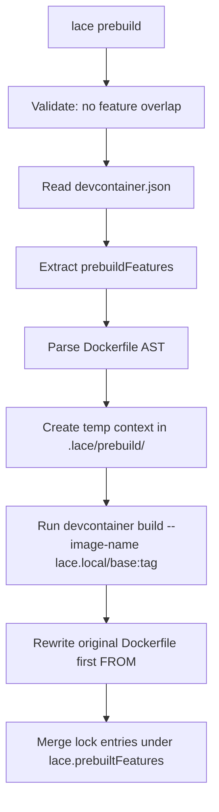

---
first_authored:
  by: "@claude-opus-4-5-20251101"
  at: 2026-01-30T18:30:00-08:00
task_list: lace/packages-lace-cli
type: proposal
state: live
status: implementation_ready
last_reviewed:
  status: accepted
  by: "@claude-opus-4-5-20251101"
  at: 2026-01-31T12:30:00-08:00
  round: 3
revised:
  by: "@claude-opus-4-5-20251101"
  at: 2026-01-31T12:00:00-08:00
  reason: "Integrating mjr feedback from round 2 review"
tags: [devcontainer, cli, prebuild, npm, architecture]
---

# packages/lace: Devcontainer Wrapper and Image Prepper

> BLUF: The `lace` CLI is a devcontainer orchestration tool focused on QoL and performance.
> Its first major capability is pre-baking devcontainer features onto base images at build time, eliminating cold-start installation delays during `devcontainer up`.
> It reads a `customizations.lace.prebuildFeatures` block from devcontainer.json, runs `devcontainer build --image-name` against a temporary context cached in `.lace/prebuild/` to produce a `lace.local/<base-image>` tagged image, and rewrites the Dockerfile's first `FROM` line to use it.
> The rewritten Dockerfile is a local-only modification (`.lace/` is gitignored); the original Dockerfile remains the committed source of truth.
> Lock file entries from the prebuild are namespaced under `lace.prebuiltFeatures` in `devcontainer-lock.json` to avoid confusing the wrapped devcontainer CLI.
> The package lives at `packages/lace/` as a pnpm workspace member, published to npm as a TypeScript CLI.

## Objective

Provide a CLI tool that reduces devcontainer startup time by pre-building feature layers onto base images.
Devcontainer features are installed at container creation time by the devcontainer CLI, which can add minutes to every `devcontainer up` invocation.
The lace CLI shifts this work to a build step whose output is cached as a local Docker image, so subsequent container creations skip feature installation entirely.

The prebuild capability is the first of several planned devcontainer orchestration features in the lace CLI.
Future capabilities will include host precondition checks (e.g., detecting host wezterm version mismatches before container build), smart cache invalidation (see followup RFP: `cdocs/rfps/`), and other devcontainer workflow automation.

## Background

### The cold-start problem

The devcontainer spec installs features at container creation time.
Each feature runs its own install script (apt packages, binary downloads, configuration).
For the current lace devcontainer, features like `sshd` and `git` add modest overhead, but heavier features (claude-code, wezterm-server, neovim) would add significant time.
The existing Dockerfile works around this by manually installing these tools inline, which defeats the composability benefits of devcontainer features.

### Devcontainer features as composable units

The devcontainer features ecosystem (`ghcr.io/devcontainers/features/*`, `ghcr.io/anthropics/devcontainer-features/*`) provides versioned, parameterized installation scripts.
Using features instead of Dockerfile `RUN` commands means:

- Version pinning via feature tags and lock files.
- Parameterization via feature options (no Dockerfile `ARG` boilerplate).
- Reuse across projects without copying Dockerfile snippets.

The tradeoff is installation speed, which this proposal eliminates.

### The devcontainer CLI's build command

`devcontainer build` accepts a workspace folder with a devcontainer.json and produces a Docker image with all specified features installed.
It also generates `devcontainer-lock.json` with resolved digests for each feature.
The lace CLI leverages this existing machinery rather than reimplementing feature installation.

### Project structure

The lace repository already declares `packages/lace/` in its README project structure.
The package will be a pnpm workspace member, consistent with the repository's existing use of pnpm.

## Proposed Solution

### Configuration: `customizations.lace.prebuildFeatures`

Features that should be pre-baked are declared in devcontainer.json under the `customizations.lace` namespace:

```jsonc
{
  "build": { "dockerfile": "Dockerfile" },
  "customizations": {
    "lace": {
      "prebuildFeatures": {
        "ghcr.io/anthropics/devcontainer-features/claude-code:1": {},
        "ghcr.io/weft/devcontainer-features/wezterm-server:1": {
          "version": "20240203-110809-5046fc22"
        }
      }
    }
  },
  "features": {
    "ghcr.io/devcontainers/features/git:1": {},
    "ghcr.io/devcontainers/features/sshd:1": {}
  }
}
```

Features under `prebuildFeatures` are baked into the base image at build time.
Features under `features` install at container creation time.
The majority of features do not require runtime context and are good candidates for prebuild; the `features` block is appropriate for features that genuinely need container-creation-time information (e.g., features that inspect mounted volumes or runtime environment variables).

Setting `"prebuildFeatures": null` explicitly disables prebuild without triggering an informational message from `lace prebuild`, which is useful when the lace CLI is installed for its other capabilities.

### Upfront validation

Before running the prebuild pipeline, lace validates:

1. **No feature overlap**: `prebuildFeatures` and `features` must not contain the same feature (compared version-insensitively by feature identifier, ignoring version tags). Overlapping entries would cause the feature to be installed twice (once in the pre-baked image, once at creation time), wasting time and potentially causing conflicts. If overlap is detected, lace exits with an error listing the duplicates.

2. **Dockerfile parsability**: The Dockerfile is parsed using an npm Dockerfile parsing library (e.g., `dockerfile-ast`) rather than ad-hoc regex. This gives proper syntax validation and structured access to instructions, catching malformed Dockerfiles early with clear error messages rather than failing in obscure ways during the pipeline.

### The prebuild pipeline



The temporary build context is cached in `.lace/prebuild/` (Dockerfile, devcontainer.json, and metadata) so that subsequent runs can diff the cached context against the newly generated one to determine if a rebuild is needed.

Step by step:

1. **Validate**: Check for feature overlap between `prebuildFeatures` and `features`. Parse the Dockerfile using a Dockerfile AST library to validate syntax and extract structure.
2. **Read configuration**: Parse `.devcontainer/devcontainer.json` (JSONC), extract `customizations.lace.prebuildFeatures`.
3. **Parse Dockerfile**: Extract the first `FROM` instruction and any preceding `ARG` instructions (Docker permits `ARG` before `FROM` for build-time variable substitution in the base image reference). Detect and warn about any other unsupported prelude instructions.
4. **Generate temporary context in `.lace/prebuild/`**: Create:
   - A Dockerfile containing the `ARG` prelude (if any) and the first `FROM` line.
   - A devcontainer.json with `prebuildFeatures` promoted to the `features` key. The original `features` entries are excluded from this context (they are not part of the prebuild).
5. **Build and tag**: Run `devcontainer build --workspace-folder .lace/prebuild/ --image-name lace.local/<image>:<tag>`. The image name preserves the original image reference's tag or version (e.g., `FROM node:24-bookworm` produces `lace.local/node:24-bookworm`).
6. **Rewrite Dockerfile**: Replace the first `FROM` line with `FROM lace.local/<image>:<tag>`.
7. **Merge lock file**: Capture the `devcontainer-lock.json` produced by the build step and merge its feature entries into the project's lock file under a `lace.prebuiltFeatures` namespace key. This prevents the entries from confusing the devcontainer CLI (which reads the top-level lock entries for its own features). During prebuild, lace pulls these namespaced entries back into the temp context's lock file.
8. **Rebuild detection**: Compare the cached `.lace/prebuild/devcontainer.json` against the freshly generated one. Because the cached file contains only prebuild features (not the full devcontainer config), this comparison naturally ignores changes to non-prebuild fields (vscode extensions, mounts, postCreateCommand, etc.). If the cached context matches, skip the rebuild. A future enhancement (see RFP: smart prebuild cache busting) will add field-level diffing for even finer granularity.

### CLI commands

| Command | Description |
|---|---|
| `lace prebuild` | Run the full prebuild pipeline |
| `lace prebuild --dry-run` | Display planned actions without executing |
| `lace restore` | Undo the FROM rewrite, restoring the original Dockerfile |
| `lace status` | Show current prebuild state (original image, prebuild image, staleness) |

### Package structure

```
packages/lace/
  package.json          # name: "lace", bin: { lace: "./dist/index.js" }
  tsconfig.json
  vite.config.ts        # Vite for building
  src/
    index.ts            # CLI entry point (argument parsing, command dispatch)
    commands/
      prebuild.ts       # Prebuild pipeline orchestration
      restore.ts        # Dockerfile restoration
      status.ts         # Prebuild state inspection
    lib/
      dockerfile.ts     # Dockerfile parsing (via dockerfile-ast) and rewriting
      devcontainer.ts   # devcontainer.json reading (jsonc-parser), temp context generation, CLI invocation
      lockfile.ts       # Lock file merging with lace.prebuiltFeatures namespacing
      metadata.ts       # .lace/prebuild/ directory management
      validation.ts     # Upfront checks (feature overlap, Dockerfile syntax)
```

## Design Requirements

> Full rationale for each decision: `cdocs/reports/2026-01-31-packages-lace-design-decisions.md`

1. **Pre-bake into the base image** (first `FROM`), not the final image. Preserves Dockerfile layer structure and cache.
2. **`customizations.lace` namespace** in devcontainer.json. No separate config file.
3. **Image tags**: `lace.local/<image>:<tag>` preserving the original version. Digests use `lace.local/<image>:from_sha256__<hash>`.
4. **First `FROM` only**. Multi-stage support via future `--target-stage` flag.
5. **Shell out to `devcontainer` CLI** (stable interface, no library coupling). Use `--image-name` to combine build+tag. Document minimum CLI version requirements during implementation.
6. **Local-only modification**. `.lace/` is gitignored; original Dockerfile is committed source of truth. Prebuild is a local optimization, not a hard dependency.
7. **Cache full context in `.lace/prebuild/`** (Dockerfile + devcontainer.json + metadata). Cached devcontainer.json contains only prebuild features, so context comparison naturally ignores non-prebuild config changes.
8. **Namespace lock entries** under `lace.prebuiltFeatures` in `devcontainer-lock.json`. Prevents devcontainer CLI from seeing pre-baked feature entries.
9. **Dockerfile AST parser** (`dockerfile-ast` or similar) instead of regex. Handles heredoc, continuation, parser directives, `ARG` before `FROM`. Verify heredoc support during Phase 2; if unsupported, detect and error clearly.
10. **`image`-based devcontainer configs unsupported for v1**. Devcontainer CLI behavior with a generated Dockerfile alongside an `image` field is unclear. Error with a clear message; revisit as future enhancement if needed.

## Stories

### Developer adds a heavy feature to an existing project

A developer wants to add claude-code as a devcontainer feature.
Installing it at creation time adds 90 seconds to every `devcontainer up`.
They add it under `customizations.lace.prebuildFeatures`, run `lace prebuild`, and subsequent container creations start in seconds.
The Dockerfile's FROM line now points to a local image with claude-code pre-installed.

### CI rebuilds the pre-baked image on feature version bumps

A CI pipeline runs `lace prebuild` after changes to devcontainer.json.
The lock file is committed, ensuring all developers get the same feature versions.
If the prebuild config has not changed (detected via cached context comparison), the pipeline skips the build.

### New team member onboards without lace installed

A new developer clones the repository and runs `devcontainer up` directly.
The committed Dockerfile uses the original base image (`node:24-bookworm`), so the container builds successfully.
Features listed under `prebuildFeatures` are not installed (they are not in the `features` block), but the container is functional.
When the developer installs lace and runs `lace prebuild`, the features are baked in and subsequent container rebuilds are faster.
This graceful degradation means lace is an optimization, not a hard dependency.

### Developer switches branches with different feature sets

Branch A uses claude-code + wezterm features; branch B uses only claude-code.
Each branch's devcontainer.json declares its own `prebuildFeatures`.
Running `lace prebuild` on each branch produces branch-specific local images.
`lace restore` on either branch returns the Dockerfile to its original state.

## Edge Cases / Challenging Scenarios

### Dockerfile has unsupported prelude instructions

The Dockerfile spec permits `ARG` before the first `FROM` (for variable substitution in the image reference).
These `ARG` instructions must be included in the temp Dockerfile.
Other instructions before `FROM` are not valid per the Dockerfile spec except for parser directives (`# syntax=`, `# escape=`).
If the AST parser finds unexpected instructions before `FROM`, lace should report them clearly and abort rather than producing a potentially incorrect prebuild.

### Base image uses a digest instead of a tag

`FROM node@sha256:abc123...` should be handled.
Docker tag syntax does not support `@` in image tags, so the prebuild image uses a colon-separated format: `lace.local/node:from_sha256__abc123...`.
The `from_` prefix makes the provenance clear (this tag was derived from a digest reference), and `__` substitutes for `:` in the digest.
`lace restore` maps this tag back to the original `@sha256:` reference using the metadata stored in `.lace/prebuild/`.

### `devcontainer build` fails

Failures from the devcontainer CLI should be surfaced clearly with the full stderr output.
The original Dockerfile must not be modified if the build fails.
The pipeline should be atomic: either all steps succeed or none take effect.

### Dockerfile has already been rewritten by a previous prebuild

The cached context in `.lace/prebuild/` tracks the previous prebuild state.
If the current FROM already points to `lace.local/*`, the tool compares the cached context against a freshly generated one.
If they match, it is a no-op.
If the config has changed, it restores the original FROM first, then re-runs the prebuild.

For the initial implementation, any change to the generated context triggers a rebuild.
A future enhancement (see RFP: smart prebuild cache busting) will diff individual fields to determine whether changes actually impact the prebuild result, skipping rebuilds when only non-impactful fields changed (e.g., vscode extensions, mount configuration).

### No `customizations.lace` or no `prebuildFeatures` in devcontainer.json

If `prebuildFeatures` is absent, lace exits with an informational message: "No prebuildFeatures configured in devcontainer.json. Nothing to prebuild." Exit code 0.

If `prebuildFeatures` is explicitly set to `null`, lace treats this as an intentional opt-out and exits silently with code 0.
This allows projects to use the lace CLI for its other capabilities without prebuild triggering messages.

### The devcontainer.json uses `image` instead of `build.dockerfile`

When devcontainer.json specifies `"image": "node:24-bookworm"` instead of a Dockerfile, the prebuild pipeline generates a Dockerfile with `FROM <image>` in `.lace/prebuild/Dockerfile` and proceeds with the same pipeline.
The `image` field in devcontainer.json is rewritten to the `lace.local/` equivalent, and `lace restore` reverts it, identically to how the Dockerfile `FROM` rewrite works.

If the devcontainer CLI ignores the generated FROM in favor of the `image` field during a regular `devcontainer up`, then lace's prebuild is not effective for this configuration variant and lace should detect and report this rather than silently producing a non-functional prebuild.
Declaring `image`-based configs as unsupported for prebuild is an acceptable outcome for the initial implementation.

### Lock file conflicts during merge

Prebuild lock entries are namespaced under `lace.prebuiltFeatures` in `devcontainer-lock.json`, so they do not conflict with the devcontainer CLI's own lock entries at the top level.
The upfront validation (no feature overlap between `prebuildFeatures` and `features`) prevents the scenario where the same feature appears in both namespaces.

## Test Plan

All tests in phases 2+ should be marked with a `// IMPLEMENTATION_VALIDATION` comment by default.
This signals that the test was written during initial implementation to validate correctness.
Later, the test suite should be refined for maintainability and semantic coverage, avoiding the trap of equating test volume with quality.
Tests that survive refinement have their marker removed; tests that are redundant or overly specific are consolidated or removed.

### Unit tests

- Dockerfile parsing (via AST library): various FROM formats (simple, with tag, with digest, with `AS` alias, multi-stage, commented-out FROM lines, ARG before FROM, parser directives, heredoc syntax).
- ARG prelude extraction: ARGs before FROM are included in temp Dockerfile; other instructions trigger errors.
- Config extraction: reading `customizations.lace.prebuildFeatures` from devcontainer.json (JSONC), handling missing, empty, and `null` blocks.
- Feature overlap validation: detecting duplicate features between `prebuildFeatures` and `features` (version-insensitive comparison).
- Tag generation: converting image references to valid `lace.local/<image>:<tag>` tags, including digest-to-tag conversion.
- Lock file merging: namespaced write, namespaced read, preservation of non-lace entries.
- Metadata reading/writing: round-trip `.lace/prebuild/` directory contents.

### Integration tests

- Full prebuild pipeline against a minimal Dockerfile and devcontainer.json with a lightweight feature.
- Idempotency: running prebuild twice produces the same result.
- Restore: verify Dockerfile returns to original state.
- Dry-run: verify no filesystem or Docker changes occur.
- Rebuild detection: modify devcontainer.json, verify rebuild triggers.

### Manual verification

- Run against the actual lace `.devcontainer/Dockerfile` and verify the rewritten image works with `devcontainer up`.

## Implementation Phases

Tooling: arktype for runtime type validation, TypeScript, vite for building, vitest for testing.
For CLI argument parsing, evaluate options compatible with these priors (e.g., `citty`, `cleye`, or `commander`).

This is an extremely testable domain.
Phases 2+ should have comprehensive test plans written before implementation code, following test-first methodology.

### Phase 1: Package scaffold

Set up the `packages/lace/` directory as a pnpm workspace member.

- Initialize `package.json` with name, version, bin field, TypeScript + arktype + vitest dependencies.
- Configure `tsconfig.json` for Node.js CLI output.
- Configure `vite.config.ts` for library/CLI building.
- Create `src/index.ts` entry point with argument parsing.
- Wire up build and test scripts.
- Add `.lace/` to the project's `.gitignore`.
- Verify `pnpm build` and `pnpm --filter lace exec lace --help` work.

**Success criteria:** `lace --help` prints usage information. `.lace/` is gitignored. `vitest` runs (even with no tests yet).

### Phase 2: Dockerfile parsing and rewriting

Implement `src/lib/dockerfile.ts` and `src/lib/validation.ts`.

Write the test plan first, then implement.

- Use `dockerfile-ast` (or similar npm package) to parse Dockerfiles into a structured AST.
- Extract the first `FROM` instruction and any preceding `ARG` instructions.
- Detect and error on unsupported prelude instructions.
- Rewrite the first FROM line to a new image reference while preserving the rest of the Dockerfile exactly.
- Generate `lace.local/<image>:<tag>` names, including the `from_sha256__` format for digest references.
- Restore a rewritten FROM line given the original value.

**Success criteria:** Unit tests (marked `// IMPLEMENTATION_VALIDATION`) pass for all FROM format variants. A round-trip parse/rewrite/restore produces an identical file.

### Phase 3: devcontainer.json reading and temp context generation

Implement `src/lib/devcontainer.ts`.

Write the test plan first, then implement.

- Read and parse devcontainer.json using `jsonc-parser` (the same parser used by the devcontainer CLI and VS Code) for JSONC support (comments, trailing commas).
- Extract `customizations.lace.prebuildFeatures`, handling absent, empty, and `null` cases.
- Validate no feature overlap between `prebuildFeatures` and `features`.
- Generate `.lace/prebuild/` directory containing:
  - A Dockerfile with `ARG` prelude (if any) and the first `FROM` line.
  - A devcontainer.json with `prebuildFeatures` promoted to `features` (original `features` excluded).
- Handle the `image` variant (no Dockerfile): generate a FROM line from the image field, or report as unsupported if the devcontainer CLI would ignore the generated Dockerfile.

**Success criteria:** Generated context files are valid inputs to `devcontainer build`. Feature overlap detection works correctly.

### Phase 4: Image tagging and prebuild pipeline orchestration

Implement `src/commands/prebuild.ts` and `src/lib/metadata.ts`.

Write the test plan first, then implement.

- Shell out to `devcontainer build --workspace-folder .lace/prebuild/ --image-name lace.local/<image>:<tag>`.
- Rewrite the original Dockerfile's first FROM line.
- Cache the full generated context in `.lace/prebuild/` for future comparison.
- Implement `--dry-run` flag (log planned actions, skip execution).
- Implement rebuild detection: compare cached `.lace/prebuild/` context against freshly generated context. If unchanged, skip rebuild.
- Default to rebuilding when devcontainer.json has changed (smart field-level diffing is a future enhancement per the RFP).

**Success criteria:** Running `lace prebuild` against a test devcontainer.json produces a tagged Docker image and a rewritten Dockerfile. Running it again is a no-op. Changing prebuildFeatures triggers a rebuild.

### Phase 5: Lock file merging

Implement `src/lib/lockfile.ts`.

Write the test plan first, then implement.

- Read the `devcontainer-lock.json` generated by the prebuild's `devcontainer build` in `.lace/prebuild/`.
- Merge its entries into the project's existing `devcontainer-lock.json` under a `lace.prebuiltFeatures` namespace key.
- When generating the temp context for a prebuild, extract the namespaced entries from the project lock file and place them as top-level entries in the temp context's lock file.
- Write the merged result.

**Success criteria:** After prebuild, the project's lock file contains namespaced resolved digests for all prebuild features. Existing top-level entries for non-prebuild features are preserved. The namespaced entries round-trip correctly through prebuild cycles.

### Phase 6: restore, status commands, and metadata tracking

Implement `src/commands/restore.ts` and `src/commands/status.ts`.

- `lace restore`: Read `.lace/prebuild/`, restore the original FROM line in the Dockerfile (or `image` field in devcontainer.json), clean up the cached context.
- `lace status`: Display current prebuild state: whether a prebuild is active, original vs. current FROM, config staleness (has devcontainer.json changed since last prebuild).
- Handle edge case: restore when no prebuild is active (no-op with message).
- Handle edge case: status when `.lace/` does not exist (report "no prebuild active").

**Success criteria:** After `lace prebuild && lace restore`, the Dockerfile matches its original content exactly. `lace status` accurately reflects prebuild state.
