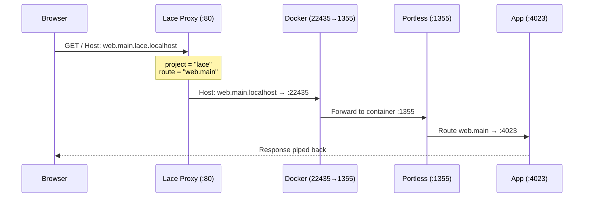

---
first_authored:
  by: "@claude-opus-4-6"
  at: 2026-02-26T22:00:00-06:00
task_list: lace/portless
type: proposal
state: live
status: review_ready
tags: [proxy, host-side, domain-routing, portless, networking, lace-core]
last_reviewed:
  status: accepted
  by: "@claude-opus-4-6"
  at: 2026-02-26T23:15:00-06:00
  round: 1
related_to:
  - cdocs/proposals/2026-02-26-portless-devcontainer-feature.md
  - cdocs/reports/2026-02-25-worktree-domain-routing-architecture.md
  - cdocs/reports/2026-02-26-portless-integration-design-rationale.md
---

# Host-Side Lace Proxy for Port-Free Project Domain Routing

> **BLUF:** Add a host-side HTTP reverse proxy to lace that routes `{route}.{project}.localhost` on port 80 to the correct container's portless proxy, eliminating port numbers from developer URLs.
> The proxy is a lightweight Node.js daemon (~200-300 lines) auto-managed by `lace up`, reading project-to-port mappings from `~/.config/lace/proxy-state.json`.
> One-time `lace setup` enables unprivileged port 80 binding (single sysctl).
> Zero changes to the portless devcontainer feature.
> Graceful degradation: without the proxy, portless URLs work with explicit ports (`web.main.localhost:22435`).
> Builds on the accepted portless feature (`cdocs/proposals/2026-02-26-portless-devcontainer-feature.md`) and the two-tier architecture in `cdocs/reports/2026-02-25-worktree-domain-routing-architecture.md`.

## Objective

Eliminate port numbers from developer URLs when accessing services in lace-managed devcontainers.

With the portless devcontainer feature, developers access services via `web.main.localhost:22435`, where `22435` is a lace-allocated host port.
The port number is project-specific, opaque, and provides no semantic context.
This proposal adds a host-side proxy on port 80 that routes by project name embedded in the hostname:

```
Before:  http://web.main.localhost:22435
After:   http://web.main.lace.localhost
```

Where `lace` is the project name (derived from the bare repo root directory) and `web.main` is the portless service route.

## Background

### Prerequisite: portless devcontainer feature

This proposal depends on `cdocs/proposals/2026-02-26-portless-devcontainer-feature.md` (accepted, round 4).
That feature installs portless inside the container, with lace mapping the proxy port asymmetrically (e.g., `22435:1355`).
Services register as `{name}.localhost` routes within the container.
The host-side proxy proposed here adds the project dimension, routing across multiple containers.

### Architecture context

The two-tier proxy architecture is described in `cdocs/reports/2026-02-25-worktree-domain-routing-architecture.md`:

1. **Container-side portless**: service/worktree routing within a single container (the accepted feature)
2. **Host-side lace proxy**: cross-project routing across containers on port 80 (this proposal)

Each tier is independently useful.
The host-side proxy depends on the container feature existing, not vice versa.

### DNS resolution

`*.localhost` resolves to `127.0.0.1` natively on Linux (nss-myhostname/systemd-resolved) and macOS, and independently by browsers per RFC 6761.
Multi-level subdomains like `web.main.lace.localhost` resolve identically: no DNS configuration is needed at any nesting depth.

## Proposed Solution

### Architecture



The proxy parses each request's `Host` header, extracts the project name, looks up the project's portless host port, rewrites the Host header to strip the project segment, and forwards the request.

### Hostname parsing

Pattern: `{route}.{project}.localhost`

- `localhost`: TLD (stripped)
- `{project}`: last segment before `.localhost`, looked up in proxy state
- `{route}`: everything to the left of `{project}`, forwarded to portless as `{route}.localhost`

| Incoming Host | Project | Forwarded Host | Destination |
|---|---|---|---|
| `web.main.lace.localhost` | `lace` | `web.main.localhost` | `:22435` |
| `api.main.lace.localhost` | `lace` | `api.main.localhost` | `:22435` |
| `web.feat-x.weft-app.localhost` | `weft-app` | `web.feat-x.localhost` | `:22436` |
| `main.lace.localhost` | `lace` | `main.localhost` | `:22435` |
| `lace.localhost` | `lace` | `localhost` | `:22435` |
| `localhost` | (none) | — | proxy landing page |

The parsing is unambiguous because lace project names are derived from directory basenames (`deriveProjectName()` in `project-name.ts`), which do not contain dots.

Two useful cascading behaviors emerge:

- `{project}.localhost` (no route) forwards `Host: localhost` to portless, which serves its route listing page: a per-project service discovery dashboard
- `localhost` alone (no project) hits the proxy itself, which serves a landing page listing all active projects

> NOTE(opus/portless): Portless's behavior with bare `Host: localhost` (no subdomain) is implementation-dependent.
> If portless does not match routes without a subdomain, it serves its 404 page, which lists all registered routes: the same discovery function, just via a different code path.
> Verify during implementation; either outcome is acceptable.

### Proxy state

`~/.config/lace/proxy-state.json`:

```jsonc
{
  "projects": {
    "lace": {
      "portlessPort": 22435,
      "workspaceFolder": "/var/home/mjr/code/weft/lace",
      "updatedAt": "2026-02-26T22:00:00Z"
    },
    "weft-app": {
      "portlessPort": 22436,
      "workspaceFolder": "/var/home/mjr/code/weft/app",
      "updatedAt": "2026-02-26T22:05:00Z"
    }
  }
}
```

Written atomically by `lace up` (write to temp file, rename).
Read by the proxy via `fs.watch()` with 100ms debounce, matching portless's own file-watching pattern.
`workspaceFolder` is included for the landing page and diagnostics, not used for routing.

### `lace up` integration

After `devcontainer up` succeeds, `lace up` checks whether a `portless/proxyPort` allocation exists in the current run's port assignments.
If found:

1. Read the resolved host port for `portless/proxyPort`
2. Write/update the project's entry in `proxy-state.json`
3. If `lace setup` has been completed and no proxy daemon is running, auto-start one

This is a single post-start phase appended to the `lace up` pipeline, after `devcontainerUp` (around line 624 of `up.ts`).
If no `portless/proxyPort` allocation exists, the phase is skipped entirely.

### `lace proxy` command

Manual daemon control:

```sh
lace proxy start              # Start the proxy daemon (detached)
lace proxy start --foreground # Run in foreground (for debugging)
lace proxy stop               # Stop the running daemon
lace proxy status             # Show state and registered projects
```

Example status output:

```
$ lace proxy status
Proxy: running (PID 12345, port 80)
Projects:
  lace          → :22435 (updated 2m ago)
  weft-app      → :22436 (updated 15m ago)
```

The daemon writes its PID to `~/.config/lace/proxy.pid`.
`start` without `--foreground` spawns `lace proxy start --foreground` as a detached child process, avoiding the need for a separate entry point.
After spawning, `start` briefly probes the listen port (TCP connect with timeout) to confirm the daemon bound successfully before returning.
If the probe fails, `start` reports the error (typically `EADDRINUSE`).

### `lace setup` command

One-time system configuration:

```sh
$ lace setup
lace: Configuring unprivileged port 80 binding for host-side proxy.
lace: This enables URLs like http://web.main.lace.localhost
lace:
lace: Required: sysctl net.ipv4.ip_unprivileged_port_start=80
lace: This is a one-time system-wide change. Continue? [Y/n]
lace:
lace: Running: sudo tee /etc/sysctl.d/90-lace-unprivileged-ports.conf
lace: Running: sudo sysctl --system
lace: Done. Run `lace up` to start the proxy.
```

Idempotent: detects if the sysctl is already configured (checks both the config file and the live sysctl value via `sysctl -n net.ipv4.ip_unprivileged_port_start`).
Non-interactive mode: `lace setup --yes`.

### Proxy daemon

The proxy (~200-300 lines) is a Node.js HTTP server using `node:http`:

1. **Listen** on port 80 (configurable via settings)
2. **Parse** the `Host` header to extract project name and route
3. **Lookup** project in the in-memory state (refreshed on file change)
4. **Forward** the request to `127.0.0.1:{portlessPort}` with rewritten Host header
5. **Pipe** the response back (headers, status code, body)
6. **Upgrade** WebSocket connections via raw TCP socket piping

Additional behaviors:

- **Landing page**: when the project isn't found, serve an HTML page listing active projects with their URLs
- **Optimistic forwarding**: forward the request without pre-probing; if the connection is refused (`ECONNREFUSED`), serve a "project not running" page with guidance to run `lace up`. This avoids per-request latency from health probes.
- **Graceful shutdown**: SIGTERM handler closes the HTTP server, removes the PID file

### URL access patterns

| Setup level | URL pattern | Requirements |
|---|---|---|
| Full (proxy + portless) | `http://web.main.lace.localhost` | `lace setup` (one-time) |
| Partial (portless, no proxy) | `http://web.main.localhost:22435` | Portless feature only |
| Feature only (no lace) | `http://web.main.localhost:1355` | Manual port forwarding |
| No feature | `http://localhost:3000` | Raw dev server |

### Settings integration

Optional `proxy` key in `~/.config/lace/settings.json`:

```jsonc
{
  "proxy": {
    "port": 80,
    "autoStart": true
  }
}
```

Both fields are optional; defaults apply when absent.
A non-80 port avoids the need for `lace setup` but produces URLs with a port number (`web.main.lace.localhost:8080`).

## Important Design Decisions

### Decision 1: Proxy lives in the lace package

**Decision:** The host-side proxy is part of the `lace` npm package.

**Why:** The proxy reads lace-specific state (`proxy-state.json`, port allocations) and is managed by lace commands.
A separate package would duplicate project name derivation and require its own install.
The proxy is ~200-300 lines: negligible weight.

### Decision 2: Fixed hostname segment parsing

**Decision:** The project name is always the last segment before `.localhost`.
Everything to its left is the portless route.

**Why:** Unambiguous because lace project names come from directory basenames, which do not contain dots.
The portless route (which may contain dots per the `{service}.{worktree}` convention) occupies all left-of-project segments.
No configuration or delimiter escaping needed.

**Constraint:** Projects whose bare repo root directory contains a literal dot break the parsing.
Documented as a known limitation (rare in practice).

### Decision 3: Post-start registration

**Decision:** Proxy state registration happens after `devcontainer up` succeeds.

**Why:** Registering before the container starts creates a window where the proxy routes to a non-existent container.
Post-start registration ensures the Docker port mapping is active.
If `devcontainer up` fails, no stale entry is created.

### Decision 4: File-watching over IPC

**Decision:** The proxy reads project state from a JSON file, not via socket-based IPC.

**Why:** File-based state is simpler, debuggable (`cat proxy-state.json`), and survives daemon restarts.
Updates propagate via `fs.watch()` near-instantly.
This matches portless's own `routes.json` pattern.

### Decision 5: Auto-start gated on setup completion

**Decision:** `lace up` only auto-starts the proxy when port 80 binding is available, detected by: (1) the lace sysctl config file at `/etc/sysctl.d/90-lace-unprivileged-ports.conf`, or (2) probing the live sysctl value (`sysctl -n net.ipv4.ip_unprivileged_port_start` <= 80), for cases where the sysctl was set by another mechanism.

**Why:** Without the sysctl, binding port 80 fails.
Gating on setup completion makes the feature invisible until the user opts in.
The fallback sysctl probe handles environments where the port was already unlocked (e.g., rootless Podman setups).

> NOTE(opus/portless): When a non-80 port is configured in settings.json, the sysctl check is skipped.

### Decision 6: No `lace down` for cleanup

**Decision:** No `lace down` command is introduced.
Stale proxy-state entries are harmless.

**Why:** When a container goes down, the proxy's optimistic forwarding gets `ECONNREFUSED` and serves a "not running" page.
The next `lace up` refreshes the entry.
No active cleanup is needed.
`lace down` can be added later without changing the proxy's design.

### Decision 7: Host-header rewriting

**Decision:** The proxy rewrites the Host header before forwarding: `web.main.lace.localhost` becomes `web.main.localhost`.

**Why:** Portless routes on exact Host header matching.
Inside the container, routes are registered as `web.main.localhost`, not `web.main.lace.localhost`.
The proxy must strip the project segment to match.

## Edge Cases / Challenging Scenarios

### Project name collision

Two bare repos with the same basename (e.g., `/code/a/myapp` and `/code/b/myapp`).
The second `lace up` overwrites the first's entry.

**Mitigation:** Documented as a known limitation.
A future enhancement could qualify with a namespace, but that changes the URL scheme and should be a separate decision.

### Port 80 already in use

Another service is bound to port 80.

**Mitigation:** `lace proxy start` fails with a clear error: "Port 80 is in use. Stop the other service or configure `proxy.port` in settings.json."

### Container stops unexpectedly

The proxy-state entry persists, but the port becomes unreachable.

**Mitigation:** The proxy forwards optimistically; `ECONNREFUSED` triggers a "project not running" page with guidance to run `lace up`.
No active state cleanup required.

### WebSocket connections

WebSocket upgrades require raw TCP socket piping.

**Mitigation:** The proxy handles the HTTP server's `upgrade` event, establishes a TCP connection to the target, and pipes both sockets bidirectionally (~30 lines, same pattern portless uses).

### Host reboot

The proxy daemon is not managed by systemd or an init system.
After a reboot, it requires `lace up` (or `lace proxy start`) to restart.
URLs that worked before the reboot fail with connection refused until the proxy starts.

**Mitigation:** Acceptable for the current design: the proxy is an enhancement, not infrastructure.
A future `systemd --user` service file could provide boot-time persistence.

### Dots in project names

A directory named `my.project` would break hostname parsing.

**Mitigation:** Documented as a constraint.
Directory names with dots are rare for git repositories.
If needed, a future `projectAlias` setting could override the derived name.

## Test Plan

### Unit Tests

1. **Hostname parsing**: `parseProxyHostname("web.main.lace.localhost")` returns `{ project: "lace", route: "web.main" }`.
2. **Edge hostnames**: single-segment route (`main.lace.localhost`), deep route (`a.b.c.lace.localhost`), bare project (`lace.localhost` returns empty route).
3. **Invalid hostnames**: missing project segment, missing `.localhost` suffix, empty string: all return parse errors.
4. **Proxy state read/write**: write an entry, read it back, verify fields.
5. **Atomic state update**: verify write-to-temp-then-rename does not corrupt on concurrent calls.

### Daemon Lifecycle Tests

6. **Start and PID file**: `lace proxy start` creates `~/.config/lace/proxy.pid` with a valid PID.
7. **Stop**: `lace proxy stop` sends SIGTERM, daemon exits, PID file is removed.
8. **Status**: `lace proxy status` reports running/stopped, registered projects, listen port.
9. **Auto-start from `lace up`**: with setup completed and no daemon running, `lace up` starts the proxy.
10. **No auto-start without setup**: without `lace setup`, `lace up` does not attempt to start the proxy.

### Integration Tests

11. **End-to-end routing**: start container with portless, `lace up`, start proxy, register a service, verify `curl http://test.svc.lace.localhost` returns the service response.
12. **Host header rewriting**: verify the container receives `Host: test.svc.localhost` (project segment stripped).
13. **Multi-project routing**: two projects running, verify each routes to its own container.
14. **WebSocket upgrade**: establish a WebSocket connection through the proxy, verify bidirectional messages.
15. **File-watch update**: while proxy is running, update `proxy-state.json` via atomic rename (write temp + rename, matching the production write path); verify new project is routable within 1 second.

### Error Handling Tests

16. **Unknown project**: request for unregistered project returns the landing page listing active projects.
17. **Dead container**: request for registered project with unreachable port returns "not running" page.
18. **Port conflict**: `lace proxy start` when port 80 is occupied returns a clear error message.

### `lace setup` Tests

19. **Fresh setup**: `lace setup` creates the sysctl config file, runs `sysctl --system`.
20. **Idempotent**: running `lace setup` twice is safe (detects existing config).
21. **Verification**: after setup, a non-root process can bind port 80.

## Implementation Phases

### Phase 1: Proxy state management

**Files to create:**
- `packages/lace/src/lib/proxy-state.ts`

**Scope:**
- `readProxyState()`: read and parse `~/.config/lace/proxy-state.json`
- `writeProjectEntry(name, port, workspaceFolder)`: atomic add/update
- `removeProjectEntry(name)`: atomic removal
- Auto-create the file and parent directory on first write

**Verification gate:** Tests 4-5.

### Phase 2: `lace up` post-start registration

**Files to modify:**
- `packages/lace/src/lib/up.ts`: add a post-start phase after `devcontainerUp`

**Scope:**
- Guard on `templateResult.allocations` being non-null (null when no template resolution occurred)
- Scan allocations for a label matching `portless/proxyPort`
- If found, call `writeProjectEntry()` with the project name and allocated port
- Skip silently if no portless allocation exists or allocations is null

**Verification:** `lace up` with portless feature produces expected `proxy-state.json` entry.

### Phase 3: Host-side proxy daemon

**Files to create:**
- `packages/lace/src/lib/proxy-daemon.ts`

**Scope:**
- `node:http` server with hostname parsing and request forwarding
- `node:http` `request()` for proxying (preserves streaming, not `fetch`)
- `upgrade` event handler for WebSocket passthrough
- `fs.watch()` on `proxy-state.json` with 100ms debounce
- HTML landing page for unknown projects
- "Not running" page for unreachable targets
- SIGTERM handler, PID file cleanup

**Verification gate:** Tests 1-3, 11-18.

### Phase 4: `lace proxy` command

**Files to create:**
- `packages/lace/src/commands/proxy.ts`

**Files to modify:**
- `packages/lace/src/index.ts`: register the `proxy` subcommand

**Scope:**
- `start`: spawn `lace proxy start --foreground` as detached child, write PID file
- `start --foreground`: import and run the daemon in-process
- `stop`: read PID file, send SIGTERM, remove PID file
- `status`: check PID liveness, read proxy state, print summary

**Verification gate:** Tests 6-8.

### Phase 5: `lace setup` command

**Files to create:**
- `packages/lace/src/commands/setup.ts`

**Files to modify:**
- `packages/lace/src/index.ts`: register the `setup` subcommand

**Scope:**
- Detect existing sysctl config (`/etc/sysctl.d/90-lace-unprivileged-ports.conf`)
- Interactive confirmation (skipped with `--yes`)
- Write sysctl config via `sudo tee`
- Run `sudo sysctl --system`
- Verify port 80 is bindable

**Verification gate:** Tests 19-21.

### Phase 6: Auto-start integration

**Files to modify:**
- `packages/lace/src/lib/up.ts`: auto-start logic after proxy-state registration
- `packages/lace/src/lib/settings.ts`: add `proxy` settings schema (`port`, `autoStart`)

**Scope:**
- After writing proxy state, check if sysctl file exists (or non-80 port configured)
- Check daemon liveness via PID file
- If not running and auto-start enabled, start the proxy
- Log the proxy URL for the project

**Verification gate:** Tests 9-10.

### Phase 7: Documentation

Update `packages/lace/README.md` with:

- Host-side proxy overview and URL patterns
- `lace setup` instructions
- `lace proxy` command reference
- Settings (`proxy.port`, `proxy.autoStart`)
- Troubleshooting (port conflicts, stale state, DNS)
- Graceful degradation table

### Future scope (not this proposal)

- **`lace dev` wrapper**: worktree-aware naming (`lace dev web next dev` auto-derives `portless web.main next dev`)
- **`lace down`**: explicit container teardown with proxy-state cleanup
- **macOS port 80**: PF firewall rules or launchd
- **HTTPS/TLS**: TLS termination at the host proxy
- **Project namespacing**: disambiguate same-named projects in different directories
