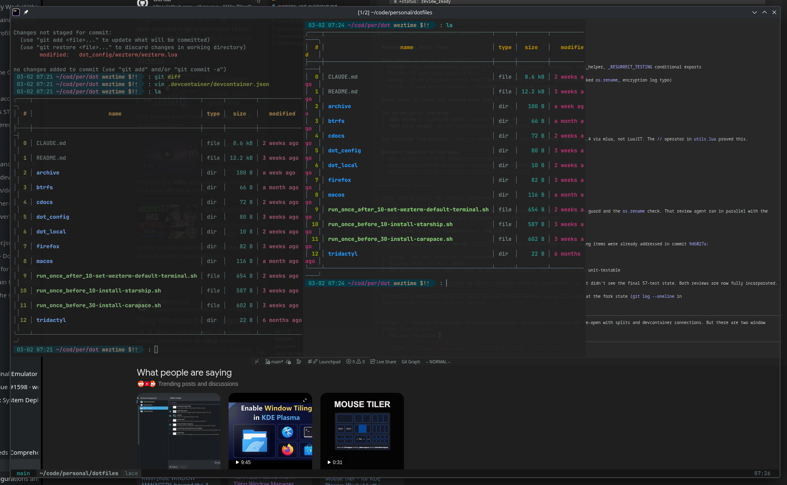

---
first_authored:
  by: "@claude-opus-4-6"
  at: 2026-03-02T07:35:00-06:00
task_list: wezterm/window-fixes
type: proposal
state: live
status: request_for_proposal
tags: [wezterm, dotfiles, rendering, wayland, window-sizing, resize]
---

# WezTerm Window Sizing and Rendering Fixes

> BLUF(opus/wezterm): Two window-level UX issues remain after session restore and general use: flickery rendering artifacts on resize, and windows reopening at a tiny default size instead of retaining prior dimensions.
>
> - **Motivated By:** `cdocs/reports/2026-03-01-wezterm-config-and-plugin-state.md`, `cdocs/devlogs/2026-03-01-resurrect-test-suite.md`

## Objective

After resolving the ghost tab crash loop and hardening the resurrect plugin, two window-level issues remain that impact daily usability:

### 1. Resize rendering artifacts

Resizing the WezTerm window produces flickery rendering artifacts. Large transparent/stale regions appear during and after resize, as if the pane content is rendered with the prior window dimensions. The window eventually settles in an incorrect visual state where part of the frame is transparent or shows stale content.

**Environment:**
- Fedora Aurora 43 (Kinoite), Wayland session (KDE Plasma)
- Kernel 6.17.12-300.fc43.x86_64
- WezTerm config has `window_background_opacity = 0.95` and `window_decorations = "TITLE | RESIZE"`
- No explicit `front_end`, `enable_wayland`, or `max_fps` settings in config

### 2. Windows reopen at tiny size

Windows restored by the resurrect plugin (or newly spawned) open at a much smaller size than expected, despite `initial_cols = 200` and `initial_rows = 100` in the config. Current `wezterm cli list` shows panes at 88x45 and 85x45 in the main tab, far below the configured 200x100.

The resurrect plugin saves and restores window size via `set_inner_size(pixel_width, pixel_height)` and `spawn_window({width=cols, height=rows})`. Possible causes:
- Saved state may contain stale/small pixel dimensions from a previous session
- The `initial_cols`/`initial_rows` config may be overridden by the restore path
- DPI/scaling mismatch between saved pixel dimensions and current display

## Scope

The full proposal should explore:

- Whether `front_end = "WebGpu"` or `enable_wayland_dlopen = true` settings affect resize rendering on Wayland/KDE
- Whether `max_fps` or `animation_fps` settings help with resize flicker
- Whether the transparent regions are caused by the compositor (KDE) or WezTerm's rendering pipeline
- Whether `window_background_opacity < 1.0` interacts badly with resize on Wayland
- How the resurrect plugin's `set_inner_size` interacts with `initial_cols`/`initial_rows` and whether saved pixel dimensions are stale
- Whether we should save/restore in cell dimensions rather than pixels to avoid DPI mismatch
- Whether `config.adjust_window_size_when_changing_font_size = false` or similar settings affect initial sizing
- Upstream WezTerm issues related to Wayland resize artifacts (there are several)

## Known Requirements

- Window size should persist across session save/restore cycles at the correct dimensions
- Default window size for new windows (without saved state) should be 200x100 cells or equivalent
- Resize should not produce visible rendering artifacts or transparent regions
- Solution must work on Wayland (KDE Plasma) — X11 compatibility is not required

## Prior Art

- `cdocs/reports/2026-03-01-wezterm-config-and-plugin-state.md` — documents the full wezterm config architecture
- `cdocs/proposals/2026-03-01-resurrect-session-safeguards.md` — hardening proposal that led to the fork
- `cdocs/devlogs/2026-03-01-resurrect-test-suite.md` — test suite implementation with review-driven fixes
- Resurrect plugin fork at `/home/mjr/code/libraries/resurrect.wezterm` — `workspace_state.lua` lines 29-30 handle `set_inner_size`
- WezTerm config at `dot_config/wezterm/wezterm.lua` lines 102-111 — current window settings

## Open Questions

1. Is the resize flicker a WezTerm bug (upstream), a Wayland compositor issue (KDE-specific), or a config issue (opacity, front_end)?
2. Does the resurrect plugin's `set_inner_size` call actually fire on restore, or is it being skipped/overridden?
3. Should we save window geometry in the wezterm config directly (via `wezterm.on("gui-startup")`) instead of relying on the resurrect plugin for sizing?
4. Are there known WezTerm issues with fractional scaling on Wayland that affect both rendering and sizing?
