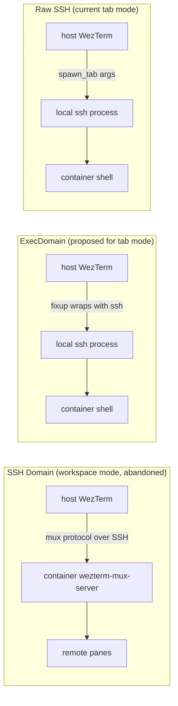

---
first_authored:
  by: "@claude-opus-4-6-20250515"
  at: 2026-03-20T12:30:00-07:00
task_list: wezterm/split-pane-regression
type: proposal
state: live
status: implementation_accepted
last_reviewed:
  status: accepted
  by: "@claude-opus-4-6-20250515"
  at: 2026-03-20T19:00:00-07:00
  round: 2
tags: [wezterm, lace.wezterm, regression, architecture]
---

# Container-Aware Split Panes via ExecDomain

> BLUF: Alt-H/J/K/L splits in lace container tabs open host shells because tab mode uses raw SSH subprocesses on the local mux domain.
> Fix: register ExecDomains for the lace port range, where each domain's fixup wraps spawned commands with SSH.
> Panes in an ExecDomain inherit it on split, so splits automatically SSH into the container with no callback logic.
> Alt+Shift+H/J/K/L added as bypass bindings for local splits.

## Summary

The regression was introduced in commit `0477744` (Feb 28, 2026) when the plugin switched from workspace mode (SSH domain-attached panes) to tab mode (raw SSH subprocess panes).
Tab mode was adopted because WezTerm's SSH domain implementation does not reliably pick up key/config changes after hot-reload.
Tab mode already bypasses the container-side WezTerm mux server entirely: the mux server is installed and running but unused.

ExecDomain is a fundamentally different mechanism from the SSH domains that were abandoned.
SSH domains use `multiplexing = "WezTerm"` to run a remote mux protocol over SSH (requiring a WezTerm mux server in the container).
ExecDomains run a local process (which happens to be `ssh`) with a named domain label.
No remote mux server is involved.
The pane is still a local SSH subprocess, identical to current tab mode, but with domain identity that propagates to splits.

References:
- Investigation report: `cdocs/reports/2026-03-20-wez-into-split-pane-regression.md`
- Prior tab-mode proposal: `cdocs/proposals/2026-02-28-tab-oriented-lace-wezterm.md`

## Objective

Make split panes in lace container tabs open container shells instead of host shells, using WezTerm's ExecDomain mechanism for automatic domain inheritance on splits.
Add bypass bindings for explicit local splits.
Document the connection mode architecture and rationale in the plugin.

## Background

### Three domain types in play



ExecDomain and raw SSH produce identical panes (local process running `ssh`).
The difference: ExecDomain panes have a named domain (`lace:22425`) that propagates to splits via `CurrentPaneDomain` inheritance.
Raw SSH panes are on the `unix` domain, so splits produce local shells.

### What the mux server provides (but tab mode doesn't use)

Session persistence (detach/reattach), remote tab fan-out, and server-side scrollback are mux-protocol features.
Tab mode bypasses the mux protocol entirely: the container's `wezterm-mux-server` is running but never contacted.
ExecDomain does not change this: it is the same local SSH subprocess, just with a domain label.

> NOTE(opus/split-pane-regression): The wezterm-server feature still provides the `hostSshPort` metadata that drives lace's port allocation.
> Removing the feature would break SSH port mapping, even though the mux server itself is unused in tab mode.
> Restoring session persistence (via mux protocol or an alternative like tmux) is a separate concern.

### Source locations

| Component | Path |
|-----------|------|
| lace.wezterm plugin | `~/code/weft/lace.wezterm/plugin/init.lua` |
| WezTerm config (chezmoi source) | `~/code/personal/dotfiles/dot_config/wezterm/wezterm.lua` |
| wez-into CLI | `~/code/weft/lace/main/bin/wez-into` |

## Proposed Solution

### 1. ExecDomain registration

Register ExecDomains for the lace port range alongside existing SSH domains.
Each ExecDomain's fixup wraps the spawn command with SSH args.

```lua
--- Build the SSH argument table for a given port, user, and optional workspace.
-- Reads ssh_key and known_hosts from wezterm.GLOBAL.lace_plugin_opts.
-- When workspace is provided, the remote command cd's to it before starting
-- a login shell. Without workspace, starts a plain login shell.
-- @param port number
-- @param user string
-- @param workspace string|nil  Container workspace path
-- @return table of SSH args, or nil if plugin opts unavailable
local function build_ssh_args(port, user, workspace)
  local opts = wezterm.GLOBAL.lace_plugin_opts or {}
  if not opts.ssh_key then
    wezterm.log_warn("lace: ssh_key not in GLOBAL, cannot build SSH args")
    return nil
  end
  local args = {
    "ssh",
    "-o", "IdentityFile=" .. opts.ssh_key,
    "-o", "IdentitiesOnly=yes",
    "-o", "UserKnownHostsFile=" .. opts.known_hosts,
    "-o", "StrictHostKeyChecking=no",
    "-t",
    "-p", tostring(port),
    user .. "@localhost",
  }
  if workspace then
    table.insert(args, "cd " .. shell_escape(workspace) .. " 2>/dev/null || cd; exec $SHELL -l")
  end
  return args
end

--- Create an ExecDomain fixup function for a given port.
-- The fixup replaces the spawn command's args with SSH into the container.
-- User and workspace are resolved at spawn time from GLOBAL (populated at
-- config load and picker invocation), falling back to defaults.
-- @param port number
-- @param default_user string
-- @return fixup function(cmd) -> cmd
local function make_exec_fixup(port, default_user)
  return function(cmd)
    local port_users = wezterm.GLOBAL.lace_port_users or {}
    local port_workspaces = wezterm.GLOBAL.lace_port_workspaces or {}
    local user = port_users[port] or default_user
    local workspace = port_workspaces[port]
    local ssh_args = build_ssh_args(port, user, workspace)
    if ssh_args then
      cmd.args = ssh_args
    end
    return cmd
  end
end

--- Register ExecDomains for the lace port range.
-- Each domain wraps command execution with SSH to the container on that port.
-- Splits inherit the ExecDomain via CurrentPaneDomain, so splits automatically
-- SSH into the same container.
-- @param config WezTerm config object
-- @param opts Plugin options
local function setup_exec_domains(config, opts)
  config.exec_domains = config.exec_domains or {}
  for port = M.PORT_MIN, M.PORT_MAX do
    table.insert(config.exec_domains,
      wezterm.exec_domain(
        "lace:" .. port,
        make_exec_fixup(port, opts.username)
      )
    )
  end
end
```

> NOTE(opus/split-pane-regression): This replaces the SSH domain names `lace:22425` with ExecDomain names.
> The SSH domains (for workspace mode and cold-start fallback) are renamed to `lace-mux:22425`.
> Alternatively, keep both under different prefixes if backward compatibility with `wezterm connect lace:<port>` is needed.
> See Design Decisions below.

### 2. Connection metadata in GLOBAL

Store per-port user resolution and plugin opts for runtime use by the ExecDomain fixups.

```lua
--- Resolve project names for active container ports.
-- Queries Docker for lace.project_name labels, falling back to
-- devcontainer.local_folder basename.
-- @return table mapping port -> project_name
local function resolve_port_names()
  local port_names = {}
  local success, stdout = wezterm.run_child_process({
    "docker", "ps",
    "--filter", "label=devcontainer.local_folder",
    "--format",
    '{{.ID}}\t{{.Ports}}\t{{.Label "lace.project_name"}}\t{{.Label "devcontainer.local_folder"}}',
  })
  if not success or not stdout then return port_names end

  for line in stdout:gmatch("[^\n]+") do
    local _id, ports, proj_name, local_folder = line:match("^(%S+)\t(.-)\t(.-)\t(.-)$")
    if ports then
      local port = extract_lace_port(ports)
      if port then
        local name = nonempty(proj_name) or basename(local_folder)
        if name then port_names[port] = name end
      end
    end
  end
  return port_names
end

--- Resolve workspace paths for active container ports.
-- Queries Docker inspect for CONTAINER_WORKSPACE_FOLDER env var,
-- falling back to the container's WorkingDir.
-- Mirrors wez-into's resolve_workspace_folder logic.
-- @param port_containers table mapping port -> container_id
-- @return table mapping port -> workspace_path
local function resolve_port_workspaces(port_containers)
  local workspaces = {}
  for port, container_id in pairs(port_containers) do
    -- Try CONTAINER_WORKSPACE_FOLDER env var first
    local env_ok, env_out = wezterm.run_child_process({
      "docker", "inspect", container_id,
      "--format", '{{range .Config.Env}}{{println .}}{{end}}',
    })
    if env_ok and env_out then
      local ws = env_out:match("CONTAINER_WORKSPACE_FOLDER=([^\n]+)")
      if ws and ws ~= "" then
        workspaces[port] = ws
      end
    end
    -- Fall back to WorkingDir
    if not workspaces[port] then
      local wd_ok, wd_out = wezterm.run_child_process({
        "docker", "inspect", container_id, "--format", "{{.Config.WorkingDir}}",
      })
      if wd_ok and wd_out then
        local wd = wd_out:gsub("%s+", "")
        if wd ~= "" then workspaces[port] = wd end
      end
    end
  end
  return workspaces
end
```

> NOTE(opus/split-pane-regression): `extract_lace_port`, `basename`, `nonempty`, and `shell_escape` are small helpers factored out for legibility.
> `extract_lace_port(ports_str)` finds the first port in `M.PORT_MIN..M.PORT_MAX` matching `(%d+)->2222/tcp`.
> `basename(path)` returns the last path component.
> `nonempty(s)` returns `s` if it is a non-empty string, else `nil`.
> `shell_escape(s)` wraps a string for safe use in a shell command (single-quoting).

In `apply_to_config`:

```lua
-- Store plugin opts in GLOBAL for runtime use by ExecDomain fixups
-- and the public API. Overwritten on every config eval (fresh opts).
wezterm.GLOBAL.lace_plugin_opts = {
  ssh_key = opts.ssh_key,
  known_hosts = M.KNOWN_HOSTS_FILE,
}

-- Store port -> user map for ExecDomain fixups
wezterm.GLOBAL.lace_port_users = port_users

-- Store port -> workspace path map for ExecDomain fixups.
-- Resolved via docker inspect (CONTAINER_WORKSPACE_FOLDER or WorkingDir).
local port_containers = resolve_port_containers()  -- port -> container_id
wezterm.GLOBAL.lace_port_workspaces = resolve_port_workspaces(port_containers)
```

### 3. Picker and wez-into changes

**Picker tab mode** changes from raw SSH args to ExecDomain spawn:

```lua
-- Before (raw SSH):
local ssh_args = { "ssh", "-o", "IdentityFile=...", "-p", port, user.."@localhost" }
local new_tab = mux_win:spawn_tab({ args = ssh_args })

-- After (ExecDomain):
local new_tab = mux_win:spawn_tab({
  domain = { DomainName = "lace:" .. project.port },
})
```

**wez-into** changes from raw SSH to ExecDomain spawn:

```bash
# Before:
pane_id=$(wezterm cli spawn -- ssh -o "IdentityFile=$KEY" -p "$port" "$user@localhost" ...)

# After:
pane_id=$(wezterm cli spawn --domain-name "lace:$port")
```

This simplifies wez-into's `do_connect` significantly: no SSH arg construction, no key path passing, no user resolution at the CLI level.

The ExecDomain fixup includes `cd <workspace> && exec $SHELL -l` in the SSH args, with workspace paths resolved at config load from `CONTAINER_WORKSPACE_FOLDER` (or `WorkingDir` fallback) via `docker inspect`.
This preserves the current wez-into behavior where shells start in the workspace directory.

### 4. Public connection metadata API

Retained as a general-purpose enrichment for other consumers (status bar, MCP tools, scripts):

```lua
--- Look up connection info for a lace container by project name or domain.
-- @param key Project name (tab title) or domain name ("lace:22425")
-- @return { port, user } or nil
function M.get_connection_info(key)
  -- Try as project name first
  local conn_info = wezterm.GLOBAL.lace_connection_info or {}
  if conn_info[key] then return conn_info[key] end
  -- Try as domain name (extract port)
  local port = tonumber(key:match("^lace:(%d+)$"))
  if port then
    local user = (wezterm.GLOBAL.lace_port_users or {})[port]
    if user then return { port = port, user = user } end
  end
  return nil
end
```

### 5. wezterm.lua config changes

The existing split bindings (`act.SplitPane`) work unchanged: in an ExecDomain pane, splits inherit the domain and run the fixup.
No `action_callback`, no `split_pane` helper needed.

Add bypass bindings for explicit local splits:

```lua
-- Local split bypass: Alt+Shift+H/J/K/L
-- Forces DefaultDomain (local unix mux) regardless of current pane's domain.
{ key = "l", mods = "ALT|SHIFT", action = act.SplitPane({ direction = "Right", size = { Percent = 50 }, domain = "DefaultDomain" }) },
{ key = "h", mods = "ALT|SHIFT", action = act.SplitPane({ direction = "Left",  size = { Percent = 50 }, domain = "DefaultDomain" }) },
{ key = "j", mods = "ALT|SHIFT", action = act.SplitPane({ direction = "Down",  size = { Percent = 50 }, domain = "DefaultDomain" }) },
{ key = "k", mods = "ALT|SHIFT", action = act.SplitPane({ direction = "Up",    size = { Percent = 50 }, domain = "DefaultDomain" }) },
```

Update `format_tab_title` to recognize the `lace:` ExecDomain pattern (which matches the existing pattern check):

```lua
-- In M.format_tab_title: the domain check for "lace:%d+" already works
-- because ExecDomains use the same "lace:<port>" naming.
local port = tonumber(domain:match("^lace:(%d+)$"))
```

### 6. SSH domain naming and cold-start fallback

Rename the existing SSH domains from `lace:<port>` to `lace-mux:<port>` to avoid collision with ExecDomain names.

```lua
-- SSH domains (for workspace mode and cold-start fallback)
table.insert(config.ssh_domains, {
  name = "lace-mux:" .. port,
  remote_address = "localhost:" .. port,
  -- ... same config as before
})
```

**Critical: update all references to the old SSH domain name.**
`wezterm connect` is for mux domains; using it with an ExecDomain name would fail.
Three locations in wez-into require updates:

1. Cold-start fallback (current line 576):
```bash
# Before: wezterm connect "lace:$port" --workspace main &>/dev/null &
# After:
wezterm connect "lace-mux:$port" --workspace main &>/dev/null &
```

2. Help text (current line 624): update documented command to show `lace-mux:<port>`.

3. Workspace mode picker path in `plugin/init.lua`: update `DomainName = "lace:" .. port` to `"lace-mux:" .. port`.

## Important Design Decisions

### ExecDomain over action_callback

ExecDomain makes splits work via native WezTerm domain inheritance.
No `action_callback` needed: the existing `act.SplitPane` bindings inherit `CurrentPaneDomain`, which re-runs the ExecDomain fixup for the new pane.
This is simpler, more idiomatic, and provides pane-level domain identity (`pane:get_domain_name()` returns `"lace:22425"`).

### ExecDomain is NOT SSH domain with `multiplexing = "WezTerm"`

SSH domains run a remote mux protocol (requiring a WezTerm mux server in the container).
ExecDomains run a local command: the pane is a local SSH subprocess, identical to current tab mode.
No remote mux server involvement, no session persistence, no remote tab fan-out.
The only difference from current tab mode: the pane has a named domain that propagates to splits.

### Keep SSH domains for backward compatibility

SSH domains are renamed to `lace-mux:<port>` but retained for:
- Workspace mode (if re-enabled in the future)
- Cold-start fallback in wez-into (`wezterm connect lace-mux:<port>`)
- Future session persistence restoration

### DefaultDomain for bypass splits

`domain = "DefaultDomain"` in the bypass bindings uses whatever domain WezTerm considers default (the unix mux in the current config).
This is more resilient than hardcoding `"unix"`: if the default domain changes, the bypass follows.

### Workspace CWD in the fixup

The ExecDomain fixup includes `cd <workspace> && exec $SHELL -l` using workspace paths stored in `lace_port_workspaces` (resolved at config load via `docker inspect`).
This mirrors wez-into's `resolve_workspace_folder` logic.
Both initial tabs and splits start in the workspace directory.

## Edge Cases

### Stale port_users after container restart

If a container restarts on a new port, `lace_port_users` has stale data until config reload.
The ExecDomain fixup uses the stale user; SSH may fail if the user changed.
Config reload (Leader+R) or picker invocation refreshes the cache.

### ExecDomain name collision with SSH domains

Addressed by renaming SSH domains to `lace-mux:<port>`.
Both domain types coexist in the config without collision.

### 75 ExecDomain registrations

Matches the existing pattern of 75 SSH domain registrations.
ExecDomains are lightweight (just a name + Lua function reference, no network connection).
Config load time impact is negligible.

### Workspace path stale after container rebuild

If a container is rebuilt and its workspace path changes, `lace_port_workspaces` has stale data until config reload.
The `cd <workspace> 2>/dev/null || cd` pattern handles this gracefully: if the path doesn't exist, the shell falls back to the home directory.

### Plugin not loaded

If the plugin fails to load, ExecDomains are not registered.
`wezterm cli spawn --domain-name lace:$port` fails with "domain not found."
wez-into should fall back to raw SSH args (preserving current behavior as a fallback).

### Bypass split in a local tab

Alt+Shift+HJKL with `domain = "DefaultDomain"` in a local tab produces the same result as Alt+HJKL.
No harm, just redundant.

## Test Plan

### Core: splits in container tabs

1. Start a lace devcontainer.
2. Open picker (Leader+W), select project (creates tab in ExecDomain).
3. Verify: `pane:get_domain_name()` shows `lace:<port>` (check via tab title resolution or log).
4. Press Alt-J.
5. **Verify**: new split pane shows container prompt (`hostname` or `whoami`).
6. **Verify**: `pwd` shows the workspace directory (not home).
7. Press Alt-L.
8. **Verify**: horizontal split also lands in container, also at workspace CWD.
9. Navigate between splits with Ctrl-H/J/K/L.
10. **Verify**: smart-splits navigation works as before.

### Bypass: local splits in container tabs

1. In a container tab, press Alt+Shift+J.
2. **Verify**: split opens a local nushell session (host shell, not container).
3. **Verify**: the container tab still shows the project name title.

### wez-into path

1. Run `wez-into <project>`.
2. Press Alt-J in that tab.
3. **Verify**: split lands in the container.
4. **Verify**: `wez-into` dry-run shows `wezterm cli spawn --domain-name lace:<port>`.

### Fallback (local tabs)

1. Open a local tab (Alt+Shift+N).
2. Press Alt-J.
3. **Verify**: split opens a local nushell session.

### Config reload resilience

1. Connect to a container via picker.
2. Config reload (Leader+R).
3. Press Alt-J.
4. **Verify**: split still lands in container (GLOBAL persists, ExecDomains re-registered).

### Multi-container routing

1. Start two lace devcontainers (different projects).
2. Open picker, connect to both (two tabs).
3. In project A tab, press Alt-J.
4. **Verify**: split lands in project A's container (check `hostname`).
5. Switch to project B tab, press Alt-J.
6. **Verify**: split lands in project B's container (different hostname).

### Cold-start fallback

1. Kill WezTerm entirely.
2. Run `wez-into <project>`.
3. **Verify**: falls back to `wezterm connect lace-mux:<port>`, opens new window.

## Verification Methodology

The WezTerm config validation workflow from CLAUDE.md applies for wezterm.lua changes.
For plugin changes, verify ExecDomain registration via the wezterm log.

For ExecDomain specifically:
1. After config load, check `$XDG_RUNTIME_DIR/wezterm/log` for the domain registration log message.
2. Spawn a pane in the ExecDomain: `wezterm cli spawn --domain-name lace:<port>`.
3. Verify the pane's domain: in the debug overlay or via a temporary `wezterm.on("format-tab-title", ...)` that logs `tab.active_pane.domain_name`.

For wezterm.lua:
1. Capture baseline: `wezterm show-keys --lua > /tmp/wez_keys_before.lua`
2. Apply changes, parse check via `ls-fonts`, diff key tables.
3. The Alt+Shift+HJKL bypass bindings should appear as new `SplitPane` entries with `domain = "DefaultDomain"`.
4. The Alt+HJKL bindings should remain unchanged (still plain `SplitPane`, no callback).

## Implementation Phases

### Phase 1: ExecDomain registration in lace.wezterm plugin

**Files**: `~/code/weft/lace.wezterm/plugin/init.lua`

1. Add helper functions: `build_ssh_args(port, user, workspace)`, `make_exec_fixup(port, default_user)`, `extract_lace_port(ports_str)`, `nonempty(s)`, `basename(path)`, `shell_escape(s)`.
2. Add `setup_exec_domains(config, opts)`: registers ExecDomains for `M.PORT_MIN..M.PORT_MAX`.
3. Add `resolve_port_names()`: queries Docker for project name -> port mapping.
4. Add `resolve_port_workspaces(port_containers)`: queries Docker inspect for `CONTAINER_WORKSPACE_FOLDER` / `WorkingDir`.
5. In `apply_to_config`: call `setup_exec_domains`, store `lace_plugin_opts`, `lace_port_users`, and `lace_port_workspaces` in GLOBAL.
5. Rename SSH domains from `lace:<port>` to `lace-mux:<port>`.
6. Update workspace mode path to use `lace-mux:` prefix.

**Verify**: Check wezterm log for ExecDomain registration. Run `wezterm cli spawn --domain-name lace:<port>` and confirm it SSH's into the container.

### Phase 2: Picker and wez-into to use ExecDomains

**Files**: `plugin/init.lua`, `bin/wez-into`

1. Plugin picker tab mode: change `mux_win:spawn_tab({ args = ssh_args })` to `mux_win:spawn_tab({ domain = { DomainName = "lace:" .. port } })`.
2. wez-into `do_connect`: change `wezterm cli spawn -- ssh ...` to `wezterm cli spawn --domain-name "lace:$port"`.
3. **Critical**: Update wez-into cold-start fallback (line 576) from `wezterm connect "lace:$port"` to `wezterm connect "lace-mux:$port"`. Also update help text (line 624).
4. Add fallback in wez-into: if `--domain-name` fails (domain not registered), fall back to raw SSH args.
5. Update picker `lace_connection_info` cache alongside existing `lace_discovery_cache`.
6. Export `M.get_connection_info(key)` public API.

**Verify**: Picker creates tabs with ExecDomain panes. wez-into creates tabs with ExecDomain panes. Splits in both land in the container.

### Phase 3: Bypass bindings and format_tab_title in wezterm.lua

**Files**: `~/code/personal/dotfiles/dot_config/wezterm/wezterm.lua`

1. Add Alt+Shift+HJKL bypass bindings with `domain = "DefaultDomain"`.
2. Verify `format_tab_title` works with ExecDomain names (the existing `lace:%d+` pattern should match).
3. Run config validation workflow (ls-fonts, show-keys diff).
4. `chezmoi apply`, verify hot-reload.

**Verify**: Alt+HJKL splits land in container. Alt+Shift+HJKL splits land in local shell. Tab titles display correctly.

### Phase 4: Documentation of connection modes and rationale

**Files**: `~/code/weft/lace.wezterm/README.md` (or equivalent plugin docs), plugin source comments

1. Document the three connection domain types (SSH/mux, ExecDomain, raw SSH) and when each is used.
2. Document why workspace mode was abandoned (SSH key hot-reload bug) and what was lost (session persistence, remote tab fan-out).
3. Document that the wezterm-server feature is still needed for `hostSshPort` metadata even though the mux server is unused in tab mode.
4. Document the ExecDomain split inheritance mechanism and bypass bindings.
5. Add inline comments in `setup_exec_domains` and `setup_port_domains` explaining the relationship between the two domain types.

**Verify**: Documentation is accurate against the implemented code. A reader unfamiliar with the history can understand why both domain types exist.

### Phase 5: End-to-end testing

No code changes.
Execute the full test plan: picker path, wez-into path, bypass bindings, fallback, config reload, cold start.
