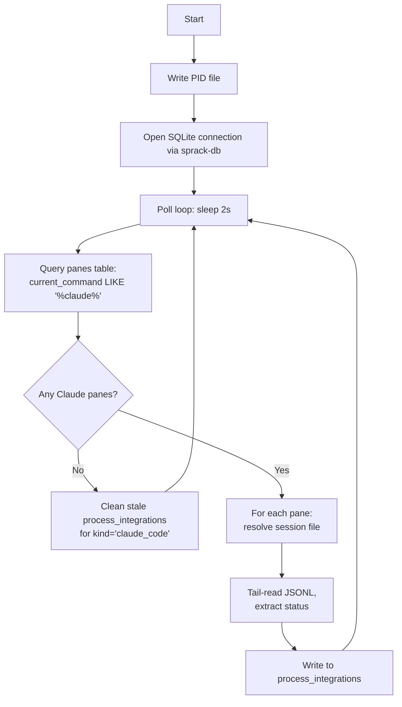
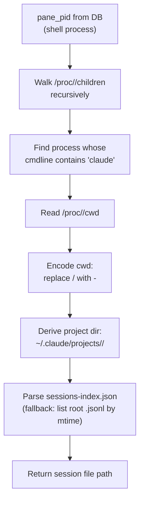

---
first_authored:
  by: "@claude-opus-4-6-20250605"
  at: 2026-03-21T19:50:00-07:00
task_list: terminal-management/sprack-tui
type: proposal
state: live
status: implementation_ready
tags: [sprack, claude_code, summarizer, session_files, rust, process_integration]
last_reviewed:
  status: accepted
  by: "@claude-opus-4-6-20250605"
  at: 2026-03-21T22:15:00-07:00
  round: 2
---

# sprack-claude: Claude Code Summarizer

> BLUF: sprack-claude is a standalone Rust daemon that detects Claude Code instances running in tmux panes, reads their JSONL session files via efficient tail-seeking, and writes structured status (thinking/idle/tool use, subagent count, context usage, model) to the shared SQLite `process_integrations` table.
> It resolves pane-to-session-file mappings by walking the Linux `/proc` filesystem from pane PIDs, and polls on a 2-second interval independent of sprack-poll.
> The binary is stateless: it can crash and restart without coordination.

> WARN(opus/sprack-claude): The `/proc`-based process tree walk is Linux-specific.
> macOS support requires `libproc`/`sysctl` and is deferred.
> This is acceptable because the primary target is lace devcontainers (Linux).

## Binary Structure

sprack-claude is a binary crate at `packages/sprack/crates/sprack-claude/`.
It depends on `sprack-db` (path dependency) for schema access and query helpers.

### Crate Dependencies

| Crate | Purpose |
|-------|---------|
| `sprack-db` (path) | SQLite schema, connection setup, `process_integrations` write helpers |
| `serde_json` | JSONL line parsing |
| `serde` (with derive) | Deserialization of session file entries |
| `std::fs` / `std::io` | File seeking, `/proc` reads |
| `nix` | Signal handling (SIGTERM for clean shutdown) |
| `log` + `env_logger` | Structured logging |

> NOTE(opus/sprack-claude): No async runtime: the poll loop is synchronous with `std::thread::sleep`.
> The workload is I/O-bound on local files, and the 2-second poll interval makes async unnecessary.

### Main Loop



On startup:
1. Write PID to `~/.local/share/sprack/claude.pid`.
2. Open SQLite connection via `sprack-db` (WAL mode, shared with poller and TUI).
3. Register SIGTERM handler for clean shutdown (remove PID file, close DB).
4. Enter poll loop.

On each poll cycle:
1. Query `panes` for rows where `current_command LIKE '%claude%'`.
2. For each matched pane, resolve its Claude Code session file (see below).
3. Tail-read the session file, extract status metrics.
4. Upsert into `process_integrations` with `kind = "claude_code"`.
5. Clean stale entries: delete `process_integrations` rows for pane IDs that no longer run Claude.

## Pane-to-Session-File Resolution

The core challenge: given a tmux pane's PID from the database, find the corresponding Claude Code JSONL session file.

### Resolution Chain



### Step 1: Process Tree Walk

The `pane_pid` stored by sprack-poll is the shell process (e.g., nushell, bash).
Claude Code runs as a child (or grandchild) of this shell.

```
pane_pid (shell)
  └── node (Claude Code launcher)
       └── node (Claude Code main process)
```

Walk the process tree via `/proc`:
1. Read `/proc/<pane_pid>/children` to get direct child PIDs (space-separated).
2. For each child, read `/proc/<child_pid>/cmdline` (null-separated args).
3. If cmdline contains `claude`, this is the Claude process. Record its PID.
4. If not, recurse into that child's `/proc/<child_pid>/children`.
5. Limit recursion depth to 5 to avoid runaway traversal.

> NOTE(opus/sprack-claude): `/proc/<pid>/children` requires `CONFIG_PROC_CHILDREN` in the kernel; most modern Linux kernels (5.x+) include this.
> Fallback: parse `/proc/<pid>/stat` for ppid and scan all PIDs, which is slower but universally available.

### Step 2: Read Working Directory

Read `/proc/<claude_pid>/cwd` (a symlink to the process's current working directory).
This gives the project root that Claude Code is operating in.

### Step 3: Encode Project Path

Claude Code encodes the project path by replacing all `/` with `-`.
The leading `/` becomes a leading `-`.
For example:
- `/workspaces/lace/main` becomes `-workspaces-lace-main`
- `/home/user/projects/foo` becomes `-home-user-projects-foo`

The session directory is then `~/.claude/projects/<encoded-path>/`.

### Step 4: Find Active Session File

The project directory has the following structure:

```
~/.claude/projects/<encoded-path>/
  sessions-index.json              # index of all sessions
  <session-uuid>.jsonl             # main session files (at root level)
  <session-uuid>/
    subagents/
      agent-*.jsonl                # subagent session files
    tool-results/
      *.txt
```

> WARN(opus/sprack-claude): Subagent files (`<uuid>/subagents/agent-*.jsonl`) must not be matched as session files.
> Only root-level `.jsonl` files represent main sessions.

Use a two-tier strategy for session file discovery:

**Primary: Parse `sessions-index.json`.**
This file contains structured metadata per session: `sessionId`, `fullPath`, `fileMtime`, `modified`, `isSidechain`, `gitBranch`, `projectPath`.
Filter out entries where `isSidechain` is true.
Among remaining entries, select the one with the most recent `fileMtime` (or `modified`).
Use `fullPath` to get the absolute path to the active session file.

**Fallback: Non-recursive `.jsonl` listing.**
If `sessions-index.json` is missing, corrupt, or unparseable, list `.jsonl` files at the project directory root (non-recursive, to avoid matching subagent files in subdirectories), sorted by modification time descending.
The most recently modified root-level `.jsonl` file is the active session.

### Caching the Resolution

The pane-to-session-file mapping is cached in a `HashMap<String, SessionFileState>` keyed by pane ID.
The cache is invalidated when:
- The pane's `pane_pid` changes (detected by comparing against the DB value each cycle).
- The session file no longer exists.
- The Claude process PID is no longer alive (checked via `/proc/<pid>` existence).

This avoids repeating the `/proc` walk every 2 seconds for stable sessions.

```rust
struct SessionFileState {
    claude_pid: u32,
    session_file: PathBuf,
    file_position: u64,  // last read position for incremental reads
    last_assistant_entry: Option<AssistantEntry>,
}
```

## JSONL Tail-Reading Algorithm

Session files can be thousands of lines.
sprack-claude never parses the entire file.

### Initial Read (First Encounter)

1. Open the file, seek to end, record file size as `file_position`.
2. Seek backward in 8KB chunks, reading each chunk.
3. Split chunks on newlines, parse each line as JSON.
4. Stop seeking backward when enough context is gathered: the last `assistant` entry and any `progress` entries after it.
5. Typically requires reading the last 10-50 lines (under 1KB of the final chunk).

### Incremental Read (Subsequent Polls)

1. Check file size. If unchanged from `file_position`, skip (no new data).
2. If file size decreased, the file was rotated: treat as a new file (initial read).
3. If file size increased, seek to `file_position`, read new bytes to EOF.
4. Parse new lines, update cached state.
5. Record new `file_position`.

This makes steady-state polling nearly free: a single `stat()` call when Claude is idle, or a small read of new lines when active.

### Backward Read Detail

Reading backward through a file to find the last meaningful entries:

```rust
fn tail_read(file: &mut File, max_bytes: u64) -> Vec<JsonlEntry> {
    let file_len = file.metadata()?.len();
    let start = file_len.saturating_sub(max_bytes);
    file.seek(SeekFrom::Start(start))?;

    let mut buf = String::new();
    file.read_to_string(&mut buf)?;

    // If we started mid-file, discard the first partial line
    if start > 0 {
        if let Some(newline_pos) = buf.find('\n') {
            buf = buf[newline_pos + 1..].to_string();
        }
    }

    buf.lines()
        .filter_map(|line| serde_json::from_str::<JsonlEntry>(line).ok())
        .collect()
}
```

The `max_bytes` parameter defaults to 32KB, which covers hundreds of JSONL entries.
If the last assistant entry is not found within 32KB, double the read window up to 256KB.

## Status Extraction

### JSONL Entry Types

```rust
#[derive(Deserialize)]
struct JsonlEntry {
    #[serde(rename = "type")]
    entry_type: String,          // "user", "assistant", "progress", "system", etc.
    #[serde(rename = "sessionId")]
    session_id: Option<String>,
    timestamp: Option<String>,
    #[serde(rename = "isSidechain")]
    is_sidechain: Option<bool>,
    #[serde(rename = "parentToolUseID")]
    parent_tool_use_id: Option<String>,
    message: Option<AssistantMessage>,
    data: Option<ProgressData>,
}

#[derive(Deserialize)]
struct AssistantMessage {
    model: Option<String>,
    usage: Option<TokenUsage>,
    stop_reason: Option<String>,  // null, "end_turn", "tool_use"
    content: Option<Vec<ContentBlock>>,
}

#[derive(Deserialize)]
struct TokenUsage {
    input_tokens: u64,
    output_tokens: u64,
    cache_read_input_tokens: Option<u64>,
    cache_creation_input_tokens: Option<u64>,
}

#[derive(Deserialize)]
struct ContentBlock {
    #[serde(rename = "type")]
    block_type: String,  // "text", "tool_use", "thinking"
    name: Option<String>,  // tool name, for tool_use blocks
}

#[derive(Deserialize)]
struct ProgressData {
    #[serde(rename = "type")]
    data_type: Option<String>,  // "agent_progress"
    #[serde(rename = "toolUseID")]
    tool_use_id: Option<String>,
}
```

> NOTE(opus/sprack-claude): Use `#[serde(default)]` liberally: session file entries vary in structure, and sprack-claude must tolerate missing or unexpected fields gracefully.

### Activity State

Derived from the last meaningful entry in the session file:

| Condition | State |
|-----------|-------|
| Last entry is `assistant` with `stop_reason: null` (JSON null) | **thinking** |
| Last entry is `assistant` with `stop_reason: "tool_use"` | **tool_use** |
| Last entry is `assistant` with `stop_reason: "end_turn"` | **idle** |
| Last entry is `user` | **waiting** |
| Unable to read file or parse entries | **error** |

The "last meaningful entry" skips `system`, `last-prompt`, `agent-name`, `file-history-snapshot`, `hook_progress`, and meta `user` entries, focusing on `assistant`, `user` (with actual prompts), and `progress`.

> NOTE(opus/sprack-claude): Sidechain entries (`isSidechain: true`) represent subagent activity; for determining the main session's activity state, filter to entries where `isSidechain` is false or absent.
> Sidechain entries still contribute to the subagent count metric.

### Subagent Count

Count active subagents by tracking `progress` entries with `data.type == "agent_progress"`:

1. Collect all unique `toolUseID` values from recent `progress` entries (within the tail-read window).
2. For each `toolUseID`, check if there is a corresponding `assistant` entry with a `tool_use` content block whose `id` matches, and `stop_reason == "end_turn"`. This indicates the subagent completed.
3. Active subagent count = total unique `toolUseID`s minus completed ones.

In practice, a simpler heuristic works: count distinct `toolUseID` values in the last N `progress` entries (e.g., last 50 entries).
Subagents that finished appear less frequently in the tail than active ones.

> TODO(opus/sprack-claude): The precise completion detection for subagents needs validation against real session files.
> The heuristic approach is the pragmatic starting point.

An alternative approach to subagent detection: check for a `<session-uuid>/subagents/` directory on the filesystem.
If the directory exists, count `agent-*.jsonl` files within it.
Files with recent modification times indicate active subagents.
This avoids parsing progress entries entirely and provides a more direct signal.

### Context Usage

From the most recent `assistant` entry's `message.usage`:

```
context_tokens = input_tokens + cache_read_input_tokens + cache_creation_input_tokens
context_percent = context_tokens / model_context_window * 100
```

> NOTE(opus/sprack-claude): `cache_creation_input_tokens` represents tokens written to the prompt cache on this request.
> These tokens consume context capacity and should be included in the usage calculation.

Model context windows (hardcoded, updated as models change):

| Model Pattern | Context Window |
|--------------|---------------|
| `*opus*` | 1,000,000 |
| `*sonnet*` | 200,000 |
| `*haiku*` | 200,000 |
| default | 200,000 |

The model name comes from `message.model` (e.g., `"claude-opus-4-6"`, `"claude-sonnet-4-20250514"`).
Pattern matching on substrings determines the context window size.

### Last Tool

Extract from the most recent `assistant` entry's `message.content` array:
1. Find the last element where `block_type == "tool_use"`.
2. Return its `name` field (e.g., `"Read"`, `"Edit"`, `"Bash"`).
3. If no tool_use blocks exist, return `None`.

### Model

Direct read of `message.model` from the most recent `assistant` entry.
Displayed as-is in wide layouts (e.g., `opus-4-6`), or abbreviated in narrower ones.

## Summary Format

sprack-claude writes a structured JSON string to the `summary` column of `process_integrations`.
The TUI parses this to render at different widths.

```rust
#[derive(Serialize)]
struct ClaudeSummary {
    state: String,           // "thinking", "tool_use", "idle", "waiting", "error"
    model: Option<String>,   // "claude-opus-4-6"
    subagent_count: u32,
    context_percent: u8,     // 0-100
    last_tool: Option<String>,
    error_message: Option<String>,
    last_activity: Option<String>,  // ISO 8601 timestamp of last assistant entry
}
```

The `status` column (separate from `summary`) uses a normalized enum:

| `ClaudeSummary.state` | `process_integrations.status` |
|-----------------------|-------------------------------|
| thinking | running |
| tool_use | running |
| idle | idle |
| waiting | idle |
| error | error |

### Rendering Guidance

The TUI interprets the structured summary for width-adaptive display.
sprack-claude writes the data; the TUI owns rendering.

| State | Color | Compact (<30) | Standard (30-60) | Wide (60+) |
|-------|-------|---------------|------------------|------------|
| thinking | Bold yellow | `*` | `[thinking]` | `thinking... (3 agents, 42% ctx)` |
| tool_use | Bold cyan | `T` | `[tool: Read]` | `tool: Read file.rs (3 agents, 42% ctx)` |
| idle | Dim green | `.` | `[idle]` | `idle (last: 2m ago)` |
| error | Bold red | `!` | `[error]` | `error: <message>` |
| waiting | Dim white | `?` | `[waiting]` | `waiting for input` |

> NOTE(opus/sprack-claude): The rendering table is guidance for the sprack-tui component proposal; sprack-claude is only responsible for writing the structured data.
> Color and layout are TUI concerns.

## Process Tree Walking Detail

### `/proc` Filesystem Reads

All `/proc` reads are fallible: processes can exit between discovery and read, and permission may be restricted.
Every read is wrapped in `Result` handling.

```rust
fn find_claude_pid(shell_pid: u32) -> Option<u32> {
    find_claude_pid_recursive(shell_pid, 0)
}

fn find_claude_pid_recursive(pid: u32, depth: u32) -> Option<u32> {
    if depth > 5 { return None; }

    let children_path = format!("/proc/{}/children", pid);
    let children_str = std::fs::read_to_string(&children_path).ok()?;

    for child_str in children_str.split_whitespace() {
        let Some(child_pid) = child_str.parse::<u32>().ok() else { continue };

        // Check if this child is Claude
        let cmdline_path = format!("/proc/{}/cmdline", child_pid);
        if let Ok(cmdline) = std::fs::read_to_string(&cmdline_path) {
            if cmdline.contains("claude") {
                return Some(child_pid);
            }
        }

        // Recurse into child's children
        if let Some(found) = find_claude_pid_recursive(child_pid, depth + 1) {
            return Some(found);
        }
    }

    None
}

fn read_process_cwd(pid: u32) -> Option<PathBuf> {
    let link_path = format!("/proc/{}/cwd", pid);
    std::fs::read_link(&link_path).ok()
}

fn encode_project_path(cwd: &Path) -> String {
    let path_str = cwd.to_string_lossy();
    path_str.replace('/', "-")
}
```

### Edge Case: Multiple Claude Instances

A single pane could theoretically have multiple Claude processes (e.g., a script launching Claude Code programmatically).
sprack-claude takes the first match in depth-first traversal; if this proves insufficient, the resolution can be refined to prefer the process with the largest session file.

## Error Handling

### Missing or Unreadable Session Files

If the session file cannot be found or read, write `status: "error"` and `summary.error_message` to `process_integrations`.
Log at `warn` level.
Continue to next pane (do not abort the poll cycle).

### Dead Processes

If `/proc/<pid>` does not exist, invalidate the cached `SessionFileState` for that pane.
Attempt re-resolution on the next cycle (the shell may have restarted Claude).
If the pane itself is gone from the DB, the stale cleanup removes its `process_integrations` entry.

### `/proc` Access Failures

Permissions, kernel config, or container restrictions may prevent reading `/proc`.
Log at `error` level on first failure, `debug` on subsequent (avoid log spam).
Set the pane's status to `error` with a descriptive message.
Do not retry within the same poll cycle.

### Malformed JSONL

Individual lines that fail to parse are silently skipped: sprack-claude uses `serde_json::from_str` with permissive deserialization (`#[serde(default)]` on all optional fields).
A session file with no parseable entries results in `error` status.

### DB Write Failures

SQLite write failures (lock contention, disk full): retry once after 100ms.
If retry fails, log at `error` and continue to next pane.
Do not crash: the next poll cycle will attempt the write again.

## Stale Entry Cleanup

Each poll cycle, sprack-claude maintains consistency:

1. Read all `process_integrations` rows where `kind = "claude_code"`.
2. Compare against the current set of Claude-running panes from the `panes` table.
3. Delete rows for pane IDs that no longer appear in the Claude pane set.

This handles panes that closed, processes that changed from Claude to something else, and sessions that ended.

## Daemon Behavior

### PID File

Written to `~/.local/share/sprack/claude.pid` on startup.
Contains the process PID as a decimal string.

On startup, if the PID file exists:
1. Read the PID.
2. Check if `/proc/<pid>` exists.
3. If alive, exit: another instance is running.
4. If dead, remove stale PID file and continue startup.

### Signal Handling

| Signal | Behavior |
|--------|----------|
| SIGTERM | Clean shutdown: remove PID file, close DB, exit 0 |
| SIGINT | Same as SIGTERM |
| SIGHUP | Ignored (daemon convention) |

### Auto-Start

The `sprack` TUI binary launches sprack-claude on startup if configured in `~/.config/sprack/config.toml`:

```toml
[summarizers]
enabled = ["claude"]

[claude]
poll_interval_ms = 2000
session_dir = "~/.claude/projects"
```

sprack-claude reads these values from the same config file (see `Auto-Start` section).

### Lifecycle Independence

sprack-claude has no coordination protocol with sprack-poll or the TUI.
It reads from the `panes` table (written by sprack-poll) and writes to `process_integrations` (read by the TUI).
The SQLite DB is the sole integration surface.

This means sprack-claude can start before or after sprack-poll.
If sprack-poll is not running, the `panes` table is empty, and sprack-claude does nothing.
sprack-claude continues running after the TUI exits, keeping the DB warm.

## Test Plan

### Unit Tests

| Test | What It Validates |
|------|------------------|
| `test_encode_project_path` | Path encoding: `/workspaces/lace/main` produces `-workspaces-lace-main` |
| `test_encode_root_path` | Edge case: `/` produces `-` |
| `test_encode_home_path` | `/home/user/project` produces `-home-user-project` |
| `test_parse_assistant_entry` | Deserialize a full assistant JSONL line with usage, content, stop_reason |
| `test_parse_progress_entry` | Deserialize an `agent_progress` entry, extract `toolUseID` |
| `test_parse_user_entry` | Deserialize a user entry |
| `test_parse_malformed_line` | Malformed JSON returns `None`, does not panic |
| `test_parse_missing_fields` | Entry with missing optional fields deserializes with defaults |
| `test_activity_state_thinking` | `stop_reason: null` on last assistant yields `thinking` |
| `test_activity_state_idle` | `stop_reason: "end_turn"` yields `idle` |
| `test_activity_state_tool_use` | `stop_reason: "tool_use"` yields `tool_use` |
| `test_activity_state_waiting` | Last entry is `user` type yields `waiting` |
| `test_context_percent_opus` | 500k tokens on opus model yields 50% |
| `test_context_percent_sonnet` | 100k tokens on sonnet model yields 50% |
| `test_subagent_count` | Given N `agent_progress` entries with distinct IDs, count is N |
| `test_last_tool_extraction` | Extract tool name from content blocks |
| `test_summary_serialization` | `ClaudeSummary` round-trips through JSON |
| `test_parse_sessions_index` | Parse `sessions-index.json`, filter sidechains, select most recent session |
| `test_sessions_index_missing` | Missing `sessions-index.json` falls back to non-recursive `.jsonl` listing |
| `test_sessions_index_corrupt` | Corrupt `sessions-index.json` falls back gracefully |
| `test_session_discovery_ignores_subagents` | Subagent files in `<uuid>/subagents/` are not matched as session files |

### Integration Tests

| Test | What It Validates |
|------|------------------|
| `test_tail_read_small_file` | Tail-read a file under 32KB reads entire content |
| `test_tail_read_large_file` | Tail-read a file over 32KB reads only the tail |
| `test_incremental_read` | Append lines to a file, incremental read picks up only new lines |
| `test_file_rotation` | File shrinks (rotation), triggers full re-read |
| `test_db_write_cycle` | Write status to `process_integrations`, read it back, verify fields |
| `test_stale_cleanup` | Remove a pane from mock data, verify its `process_integrations` row is deleted |

### Manual Testing

- Run sprack-claude against a live Claude Code session, verify DB contents with `sqlite3`.
- Start and stop Claude Code in a pane, observe status transitions in the DB.
- Run two Claude Code instances in different panes, verify independent tracking.

## Edge Cases

### Session File Rotation

Claude Code may create a new session file (new conversation) while sprack-claude is tracking the old one.
Detection: the cached `session_file` path is no longer the most recently modified `.jsonl` in the project directory.
Resolution: on each poll cycle, re-check modification times; if a newer file exists, switch to it and reset `file_position`.

### Stale PIDs

The shell PID in the `panes` table may be stale (process exited but sprack-poll has not yet updated): `/proc/<pid>` will not exist, and the resolution chain returns `None`.
sprack-claude writes `error` status for that pane.
On the next poll cycle, either sprack-poll updates the pane or removes it, and the stale entry is cleaned up.

### Multiple Claude Instances per Pane

Unlikely in normal usage, but possible if a shell script launches multiple Claude processes.
sprack-claude takes the first match in depth-first order: the process tree walk stops at the first `cmdline` containing `"claude"`.

### Container Filesystem Isolation

In devcontainers, `/proc` is the container's `/proc`, not the host's.
Claude Code runs inside the container, so `/proc/<pid>/cwd` returns the container-local path.
The `~/.claude/projects/` directory is also container-local; this is the expected behavior: sprack-claude runs inside the same container as Claude Code.

> WARN(opus/sprack-claude): If sprack-claude runs on the host but Claude Code runs in a container, `/proc` PIDs will not match: sprack-claude must run in the same PID namespace as Claude Code.
> For lace devcontainers, all sprack components run inside the container.

### Empty Session Directory

If `~/.claude/projects/<encoded-path>/` exists but contains no `.jsonl` files, or the directory does not exist, write `error` status with message "no session file found".
Do not cache this result: re-check on the next cycle (Claude may create a file shortly after starting).

## Future Considerations

### `@claude_status` tmux User Option

If Claude Code sets a tmux user option (e.g., `@claude_status`) with its current state, sprack-claude becomes trivial: read the option from the `sessions` or `panes` table (no `/proc` walk or JSONL parsing needed).
This would be an upstream feature request to the Claude Code team.
sprack-claude's current design is the "work without upstream cooperation" approach.

> TODO(opus/sprack-claude): File a feature request for Claude Code to expose status via tmux user options; if adopted, sprack-claude simplifies to a thin DB bridge, or the TUI reads the option directly from sprack-poll's data.

### macOS Support

macOS lacks `/proc`; process tree walking requires `libproc::proc_listchildpids` for child PID enumeration, `libproc::proc_pidpath` for the executable path, and `libproc::proc_pidinfo` with `PROC_PIDVNODEPATHINFO` for the cwd.
This is feasible but deferred.
The abstraction boundary is clear: a `ProcessResolver` trait with Linux and macOS implementations.

### Additional Summarizers

The `process_integrations` schema supports multiple `kind` values per pane.
Future summarizers (nvim buffer info, cargo build status, test runner state) follow the same pattern: standalone binary, `/proc` walk or alternative resolution, DB writes; sprack-claude validates this architecture.

## Related Documents

| Document | Relationship |
|----------|-------------|
| [sprack Roadmap](2026-03-21-sprack-tmux-sidecar-tui.md) | Parent - high-level architecture and phase plan |
| [Design Refinements](2026-03-21-sprack-design-refinements.md) | Supplemental - Claude integration overview, polling strategy, daemon behavior |
| [Design Overview Report](../reports/2026-03-21-sprack-design-overview.md) | Familiarization walkthrough of the full sprack architecture |
| [sprack-db](2026-03-21-sprack-db.md) | Sibling component - schema definition, `process_integrations` table spec |
| [sprack-tui](2026-03-21-sprack-tui-component.md) | Sibling component - consumes `process_integrations` for rendering |
