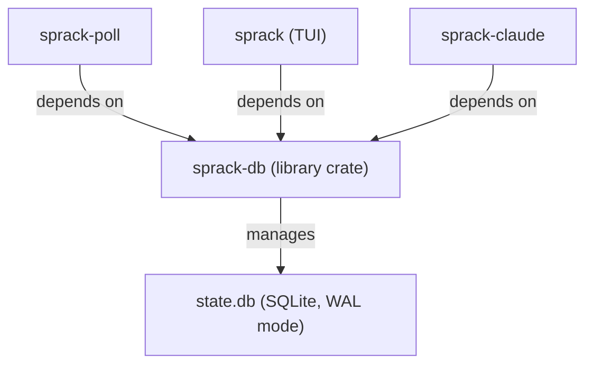

---
first_authored:
  by: "@claude-opus-4-6-20250605"
  at: 2026-03-21T19:50:00-07:00
task_list: terminal-management/sprack-tui
type: proposal
state: live
status: implementation_ready
last_reviewed:
  status: accepted
  by: "@claude-opus-4-6-20250605"
  at: 2026-03-21T20:45:00-07:00
  round: 2
tags: [sprack, sqlite, rust, schema, library]
---

# sprack-db: Shared SQLite Library Crate

> BLUF: sprack-db is a Rust library crate providing the SQLite schema, connection management, typed query helpers, and shared data types for the sprack ecosystem.
> All three sprack binaries (sprack TUI, sprack-poll, sprack-claude) depend on this crate.
> The crate owns the five-table schema (sessions, windows, panes, process_integrations, poller_heartbeat), WAL mode configuration, and all database I/O.
> Callers never write raw SQL: sprack-db exposes typed Rust functions for every operation.

## Crate Structure

sprack-db lives at `packages/sprack/crates/sprack-db/` within the Cargo workspace.
It is a library crate (`lib.rs`) with no binary targets.

```
packages/sprack/crates/sprack-db/
  Cargo.toml
  src/
    lib.rs          # re-exports, open_db()
    schema.rs       # CREATE TABLE statements, init_schema()
    types.rs        # Session, Window, Pane, Integration, ProcessStatus, DbSnapshot
    write.rs        # write_tmux_state(), write_heartbeat(), write_integration()
    read.rs         # read_full_state(), read_heartbeat(), read_integrations(), check_data_version()
    error.rs        # SprackDbError enum
```

The public API surface is flat: `sprack_db::{open_db, open_db_readonly, types::*, write::*, read::*}`.
Internal modules are not re-exported.

## Dependencies

```toml
[dependencies]
rusqlite = { version = "0.32", features = ["bundled"] }
thiserror = "2"
```

`bundled` compiles SQLite from source, ensuring a consistent version (3.46+) with WAL support across all environments.
This avoids runtime dependency on system SQLite and guarantees `PRAGMA data_version` availability.

> NOTE(opus/sprack-db): `bundled` adds ~30s to first compile but eliminates all system SQLite version concerns.
> The devcontainer environment has no system SQLite.

No async runtime: all operations are synchronous.
SQLite operations are fast enough that async adds complexity without benefit.

## Connection Management

### `open_db(path: Option<&Path>) -> Result<Connection>`

Opens a SQLite connection with the following configuration:

1. **Default path**: `~/.local/share/sprack/state.db`.
   Creates parent directories if needed.
2. **WAL mode**: `PRAGMA journal_mode = WAL` enables concurrent readers with a single writer.
3. **Busy timeout**: `PRAGMA busy_timeout = 5000` (5 seconds).
   Handles brief write contention between sprack-poll and summarizers without failing.
4. **Foreign keys**: `PRAGMA foreign_keys = ON` enforces CASCADE constraints.
5. **Schema initialization**: calls `init_schema()` to run `CREATE TABLE IF NOT EXISTS` for all five tables.

```rust
pub fn open_db(path: Option<&Path>) -> Result<Connection, SprackDbError> {
    let db_path = match path {
        Some(p) => p.to_path_buf(),
        None => default_db_path()?,
    };
    if let Some(parent) = db_path.parent() {
        std::fs::create_dir_all(parent)?;
    }
    let conn = Connection::open(&db_path)?;
    let mode: String = conn.pragma_update_and_check(None, "journal_mode", "wal", |row| row.get(0))?;
    if mode != "wal" {
        return Err(SprackDbError::WalActivationFailed(mode));
    }
    conn.pragma_update(None, "busy_timeout", 5000)?;
    conn.pragma_update(None, "foreign_keys", "on")?;
    init_schema(&conn)?;
    Ok(conn)
}
```

### `open_db_readonly(path: Option<&Path>) -> Result<Connection>`

Opens a read-only SQLite connection with the same pragmas as `open_db` but using `SQLITE_OPEN_READ_ONLY`.
Used by the TUI, which never writes to the database.

```rust
pub fn open_db_readonly(path: Option<&Path>) -> Result<Connection, SprackDbError> {
    let db_path = match path {
        Some(p) => p.to_path_buf(),
        None => default_db_path()?,
    };
    let conn = Connection::open_with_flags(
        &db_path,
        OpenFlags::SQLITE_OPEN_READ_ONLY | OpenFlags::SQLITE_OPEN_NO_MUTEX,
    )?;
    let mode: String = conn.pragma_query_value(None, "journal_mode", |row| row.get(0))?;
    if mode != "wal" {
        return Err(SprackDbError::WalActivationFailed(mode));
    }
    conn.pragma_update(None, "busy_timeout", 5000)?;
    conn.pragma_update(None, "foreign_keys", "on")?;
    Ok(conn)
}
```

> NOTE(opus/sprack-db): `open_db_readonly` does not call `init_schema()`.
> Schema creation is the responsibility of the writer (sprack-poll via `open_db`).
> The TUI should handle the case where the DB does not yet exist (poller not yet started).

### Why WAL Mode

WAL (Write-Ahead Logging) allows the TUI to read while sprack-poll or summarizers write.
Without WAL, readers block writers and vice versa.
With WAL, readers see a consistent snapshot while writers append to the WAL file.
The only constraint is single-writer: concurrent writes serialize via the busy timeout.

In practice, write contention is minimal: sprack-poll writes once per second, and summarizers write every 2+ seconds.
The 5-second busy timeout is generous headroom.

## SQL Schema

```sql
-- Sessions: one row per tmux session.
-- lace_* fields are NULL for sessions not created by lace-into.
CREATE TABLE IF NOT EXISTS sessions (
    name           TEXT PRIMARY KEY,
    attached       INTEGER NOT NULL DEFAULT 0,  -- boolean: 1 if a client is attached
    lace_port      INTEGER,                     -- @lace_port tmux option (SSH port)
    lace_user      TEXT,                        -- @lace_user tmux option
    lace_workspace TEXT,                        -- @lace_workspace tmux option
    updated_at     TEXT NOT NULL                -- ISO 8601 timestamp
);

-- Windows: one row per tmux window.
-- Composite PK ties a window to its session.
-- CASCADE: deleting a session removes its windows.
CREATE TABLE IF NOT EXISTS windows (
    session_name   TEXT NOT NULL,
    window_index   INTEGER NOT NULL,
    name           TEXT NOT NULL,
    active         INTEGER NOT NULL DEFAULT 0,  -- boolean: 1 if this is the active window
    PRIMARY KEY (session_name, window_index),
    FOREIGN KEY (session_name) REFERENCES sessions(name) ON DELETE CASCADE
);

-- Panes: one row per tmux pane.
-- pane_id is tmux's unique identifier (e.g., "%42").
-- CASCADE: deleting a window removes its panes.
CREATE TABLE IF NOT EXISTS panes (
    pane_id        TEXT PRIMARY KEY,            -- tmux unique pane ID (e.g., "%42")
    session_name   TEXT NOT NULL,
    window_index   INTEGER NOT NULL,
    title          TEXT NOT NULL DEFAULT '',
    current_command TEXT NOT NULL DEFAULT '',    -- process running in the pane
    current_path   TEXT NOT NULL DEFAULT '',     -- pane's working directory
    pane_pid       INTEGER,                     -- PID of the pane's shell process
    active         INTEGER NOT NULL DEFAULT 0,  -- boolean: 1 if this is the active pane
    dead           INTEGER NOT NULL DEFAULT 0,  -- boolean: 1 if the pane's process exited
    FOREIGN KEY (session_name, window_index)
        REFERENCES windows(session_name, window_index) ON DELETE CASCADE
);

-- Process integrations: enrichments written by summarizers.
-- Composite PK allows multiple integration kinds per pane (e.g., "claude_code", "nvim").
-- CASCADE: deleting a pane removes its integrations.
CREATE TABLE IF NOT EXISTS process_integrations (
    pane_id        TEXT NOT NULL,
    kind           TEXT NOT NULL,               -- integration type (e.g., "claude_code")
    summary        TEXT NOT NULL DEFAULT '',     -- human-readable status string
    status         TEXT NOT NULL DEFAULT 'idle', -- ProcessStatus enum value
    updated_at     TEXT NOT NULL,               -- ISO 8601 timestamp
    PRIMARY KEY (pane_id, kind),
    FOREIGN KEY (pane_id) REFERENCES panes(pane_id) ON DELETE CASCADE
);

-- Poller heartbeat: singleton row for staleness detection.
-- The TUI checks this to warn if the poller has crashed.
CREATE TABLE IF NOT EXISTS poller_heartbeat (
    id             INTEGER PRIMARY KEY CHECK (id = 1),  -- singleton constraint
    updated_at     TEXT NOT NULL                         -- ISO 8601 timestamp
);
```

### Schema Design Rationale

**CASCADE deletes**: when sprack-poll replaces state, it can delete stale sessions and CASCADE handles cleanup through windows, panes, and integrations.
This avoids orphaned rows without requiring multi-table delete logic in callers.

**TEXT timestamps**: ISO 8601 strings are human-readable in `sqlite3` debugging sessions, sortable as text, and trivially parseable in Rust.
SQLite has no native timestamp type, so TEXT with a consistent format is the pragmatic choice.

**TEXT for ProcessStatus**: storing the enum as a text value (`"thinking"`, `"tool_use"`, `"idle"`, `"error"`, `"waiting"`, `"complete"`) keeps the DB self-describing.
Any tool that reads `process_integrations` can understand the status without importing Rust types.

**Singleton heartbeat**: the `CHECK (id = 1)` constraint prevents accidental multiple rows.
`INSERT OR REPLACE` on `id = 1` makes heartbeat writes idempotent.

## Data Types

```rust
/// A tmux session with optional lace metadata.
pub struct Session {
    pub name: String,
    pub attached: bool,
    pub lace_port: Option<u16>,
    pub lace_user: Option<String>,
    pub lace_workspace: Option<String>,
    pub updated_at: String,
}

/// A tmux window within a session.
pub struct Window {
    pub session_name: String,
    pub window_index: i32,
    pub name: String,
    pub active: bool,
}

/// A tmux pane within a window.
pub struct Pane {
    pub pane_id: String,
    pub session_name: String,
    pub window_index: i32,
    pub title: String,
    pub current_command: String,
    pub current_path: String,
    pub pane_pid: Option<u32>,
    pub active: bool,
    pub dead: bool,
}

/// A process enrichment written by a summarizer.
pub struct Integration {
    pub pane_id: String,
    pub kind: String,
    pub summary: String,
    pub status: ProcessStatus,
    pub updated_at: String,
}

/// Status of a monitored process.
/// These map to specific visual treatments in the TUI (colors, icons).
pub enum ProcessStatus {
    Thinking,   // actively generating (yellow)
    ToolUse,    // executing a tool call (cyan)
    Idle,       // waiting for input (green)
    Error,      // something went wrong (red)
    Waiting,    // user message sent, awaiting response (white)
    Complete,   // task finished (dim)
}

/// Complete database state for tree rendering.
/// Named DbSnapshot to avoid collision with tui-tree-widget's TreeState.
pub struct DbSnapshot {
    pub sessions: Vec<Session>,
    pub windows: Vec<Window>,
    pub panes: Vec<Pane>,
    pub integrations: Vec<Integration>,
}
```

`ProcessStatus` implements `Display` and `FromStr` for round-tripping to/from the TEXT column (stored as `"thinking"`, `"tool_use"`, `"idle"`, `"error"`, `"waiting"`, `"complete"`).
All structs derive `Debug`, `Clone`, `PartialEq`, and `Eq`.
`Session`, `Window`, and `Pane` also derive `Hash` to support sprack-poll's hash-based diff at the type level.

## Query Helpers

### Write Operations

**`write_tmux_state(conn, sessions, windows, panes) -> Result<()>`**

Full state replacement in a single transaction.
Called by sprack-poll on each poll cycle that detects changes (hash-based diff).

1. Begin transaction.
2. Delete all rows from `sessions` (CASCADE handles windows, panes, integrations).
3. `INSERT` all sessions.
4. `INSERT` all windows.
5. `INSERT` all panes.
6. Commit.

> NOTE(opus/sprack-db): Full replacement (DELETE + INSERT) is simpler than computing diffs.
> The dataset is small (tens of sessions, dozens of panes) so the performance cost is negligible.
> CASCADE delete on sessions cleans up orphaned integrations, which summarizers re-write on their next cycle.

> WARN(opus/sprack-db): The CASCADE delete creates a brief flicker window: between the DELETE and the next summarizer write, the TUI may read a state with no integrations.
> This is an accepted trade-off for Phase 1.
> Mitigation for later: preserve integration rows for still-valid pane_ids within the transaction, or use a two-phase write (insert new, then delete stale).

The caller (sprack-poll) is responsible for populating `updated_at` timestamps on `Session` structs before passing them to `write_tmux_state`.
`write_tmux_state` writes whatever timestamps are in the structs.

**`write_heartbeat(conn) -> Result<()>`**

Upserts the singleton heartbeat row with the current timestamp:
```sql
INSERT OR REPLACE INTO poller_heartbeat (id, updated_at) VALUES (1, ?);
```

**`write_integration(conn, pane_id, kind, summary, status) -> Result<()>`**

Upserts a single integration row:
```sql
INSERT OR REPLACE INTO process_integrations (pane_id, kind, summary, status, updated_at)
VALUES (?, ?, ?, ?, ?);
```

Called by summarizers (e.g., sprack-claude) after computing process status.

### Read Operations

**`read_full_state(conn) -> Result<DbSnapshot>`**

Reads all five tables into a `DbSnapshot` struct.
Called by the TUI when `data_version` changes.

Four queries, each mapping rows to the corresponding struct:
```sql
SELECT * FROM sessions ORDER BY name;
SELECT * FROM windows ORDER BY session_name, window_index;
SELECT * FROM panes ORDER BY session_name, window_index, pane_id;
SELECT * FROM process_integrations ORDER BY pane_id, kind;
```

**`check_data_version(conn) -> Result<u64>`**

Reads SQLite's built-in change counter:
```sql
PRAGMA data_version;
```

Returns an integer that increments whenever any other connection commits.
The TUI polls this at 50-100ms intervals: if the value is unchanged, no further work is needed.
This is the core cross-process reactivity mechanism.

> NOTE(opus/sprack-db): `data_version` reads from the WAL-index shared memory region.
> It does not touch the database file and is effectively free.
> See the [sqlite-watcher report](../reports/2026-03-21-sqlite-watcher-cross-process-reactivity.md) for why this approach was chosen over sqlite-watcher.

**`read_heartbeat(conn) -> Result<Option<String>>`**

Reads the heartbeat timestamp.
Returns `None` if the heartbeat row does not exist (poller never started).
The TUI compares this against the current time to detect poller staleness (e.g., >5 seconds old).

**`read_integrations(conn, pane_id) -> Result<Vec<Integration>>`**

Reads all integrations for a specific pane:
```sql
SELECT * FROM process_integrations WHERE pane_id = ? ORDER BY kind;
```

Useful for detail panel rendering where the TUI needs integrations for a single selected pane.

## Error Handling

```rust
#[derive(Debug, thiserror::Error)]
pub enum SprackDbError {
    #[error("SQLite error: {0}")]
    Sqlite(#[from] rusqlite::Error),

    #[error("IO error: {0}")]
    Io(#[from] std::io::Error),

    #[error("Invalid process status: {0}")]
    InvalidStatus(String),

    #[error("WAL mode activation failed, got: {0}")]
    WalActivationFailed(String),
}
```

All public functions return `Result<T, SprackDbError>`.
Callers (sprack-poll, sprack TUI, sprack-claude) handle errors according to their own needs:
- sprack-poll: logs and retries on next cycle.
- sprack TUI: displays a status bar warning.
- sprack-claude: logs and retries on next poll interval.

The error type is intentionally simple.
Schema validation errors (malformed data) surface as `Sqlite` variants from rusqlite's row mapping.

## Idempotent Schema Creation

`init_schema()` uses `CREATE TABLE IF NOT EXISTS` for all tables.
This means:
- First run creates the schema from scratch.
- Subsequent runs are no-ops.
- Multiple processes calling `open_db()` concurrently is safe.

There is no migration system.
The schema is simple enough that breaking changes (if ever needed) can be handled by deleting and recreating the database file.
The data is ephemeral: sprack-poll rebuilds it from tmux state on each cycle.

> TODO(opus/sprack-db): If schema evolution becomes necessary (new columns, renamed tables), consider `user_version` PRAGMA for versioned migrations.
> For now, delete-and-recreate is sufficient given the ephemeral nature of the data.

## Relationship to Other Components



| Component | Uses | Key Functions |
|-----------|------|---------------|
| sprack-poll | Write path | `open_db`, `write_tmux_state`, `write_heartbeat` |
| sprack (TUI) | Read path | `open_db_readonly`, `check_data_version`, `read_full_state`, `read_heartbeat` |
| sprack-claude | Read + write | `open_db`, `read_integrations`, `write_integration` |
| Future summarizers | Read + write | `open_db`, `write_integration` |

sprack-db is the only crate that contains SQL.
All database interaction is mediated through its typed API.
This ensures schema consistency and makes it possible to change the schema in one place.

## Test Plan

### Unit Tests (in-crate)

1. **Schema creation**: `open_db` with a temporary file creates all five tables.
   Verify with `SELECT name FROM sqlite_master`.
2. **Idempotent schema**: call `init_schema` twice on the same connection without error.
3. **Round-trip sessions**: write sessions via `write_tmux_state`, read via `read_full_state`, assert equality.
4. **Round-trip windows and panes**: write a full state tree, read back, verify parent-child relationships match.
5. **CASCADE delete**: write state, delete a session, verify its windows, panes, and integrations are gone.
6. **Integration upsert**: write an integration, write again with updated summary, verify only one row exists with the new value.
7. **ProcessStatus round-trip**: verify `Display`/`FromStr` for all six variants.
8. **data_version detection**: open two connections to the same file, write via one, verify `check_data_version` returns a different value on the other.
9. **Heartbeat**: write heartbeat, read it back, verify timestamp is present and parseable.
10. **Empty state**: `read_full_state` on a fresh DB returns empty vectors.
11. **Foreign key enforcement**: attempt to insert a pane referencing a nonexistent window, verify it fails.
12. **WAL mode concurrent read/write**: open two connections, start a read on one, write on the other concurrently, verify both succeed without blocking.
13. **Integration FK enforcement**: attempt `write_integration` with a nonexistent `pane_id`, verify it fails with a foreign key violation.
14. **WAL verification**: verify `open_db` returns `WalActivationFailed` when WAL mode cannot be activated (e.g., in-memory DB with incompatible config).

All tests use `rusqlite::Connection::open_in_memory()` or `tempfile` for isolation.
No tests depend on a running tmux server or filesystem state.

### Integration Points

Integration testing with sprack-poll and sprack TUI is handled by those components.
sprack-db's tests verify the contract (schema + query correctness) in isolation.

## Related Documents

| Document | Relationship |
|----------|-------------|
| [sprack Roadmap](2026-03-21-sprack-tmux-sidecar-tui.md) | Parent: overall architecture and phasing |
| [Design Refinements](2026-03-21-sprack-design-refinements.md) | Supplemental: DB path, PID file conventions |
| [Design Overview Report](../reports/2026-03-21-sprack-design-overview.md) | Familiarization: mid-level architecture walkthrough |
| [sqlite-watcher Report](../reports/2026-03-21-sqlite-watcher-cross-process-reactivity.md) | Research: validates `PRAGMA data_version` over sqlite-watcher |
| [sprack-poll](2026-03-21-sprack-poll.md) | Consumer: primary writer of sessions/windows/panes |
| [sprack-tui](2026-03-21-sprack-tui-component.md) | Consumer: primary reader via `check_data_version` + `read_full_state` |
| [sprack-claude](2026-03-21-sprack-claude.md) | Consumer: reads panes, writes integrations |
