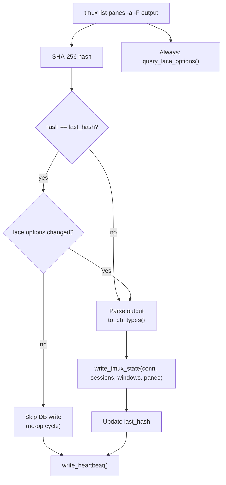
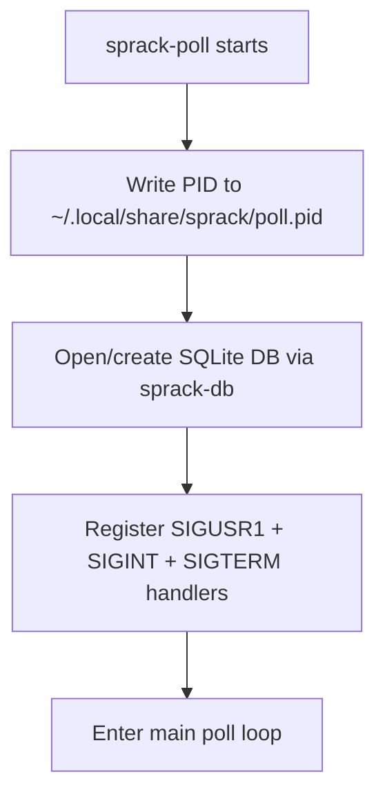

---
first_authored:
  by: "@claude-opus-4-6-20250605"
  at: 2026-03-21T19:50:00-07:00
task_list: terminal-management/sprack-tui
type: proposal
state: live
status: implementation_ready
last_reviewed:
  status: accepted
  by: "@claude-opus-4-6-20250605"
  at: 2026-03-21T21:00:00-07:00
  round: 2
tags: [sprack, tmux, polling, daemon, rust, signal_handling]
---

# sprack-poll: tmux State Poller Daemon

> BLUF: sprack-poll is a Rust daemon that queries tmux state via CLI, writes it to a shared SQLite database, and keeps the DB fresh for the sprack TUI.
> It uses a single `tmux list-panes -a -F` call with unit-separator-delimited format strings to fetch all panes across all sessions, plus per-session `tmux show-options` for lace metadata.
> A hash-based diff skips DB writes when state is unchanged, and SIGUSR1 signals from tmux hooks trigger immediate poll cycles for <50ms structural update latency.
> The binary lives at `packages/sprack/crates/sprack-poll/` and depends on `sprack-db` (path dependency) and `signal-hook` (for portable signal handling).

## Binary Structure

sprack-poll is a single-threaded synchronous Rust binary.
The workload is a simple poll loop with blocking `Command` calls and SQLite writes: no async runtime.

### Crate Location

```
packages/sprack/crates/sprack-poll/
  Cargo.toml
  src/
    main.rs       # entry point, daemon lifecycle, main loop
    tmux.rs       # tmux CLI interaction, format string, parsing
    diff.rs       # hash-based change detection
```

### Dependencies

| Crate | Purpose |
|-------|---------|
| `sprack-db` | Path dependency. Schema, migrations, `write_tmux_state()`, `write_heartbeat()` |
| `signal-hook` | SIGUSR1/SIGINT/SIGTERM handling via `signal_hook::iterator::Signals` |
| `sha2` | SHA-256 hash of raw tmux output for diff detection |

> NOTE(opus/sprack-poll): `signal-hook` is chosen over tokio signals because sprack-poll is synchronous.
> `signal-hook` provides a blocking iterator that integrates cleanly with `std::thread::sleep` loops.

### Main Loop Pseudocode

```rust
fn main() {
    write_pid_file();
    let db = sprack_db::open_or_create();

    let mut signals = Signals::new(&[SIGUSR1, SIGINT, SIGTERM]).unwrap();
    let mut last_hash: Option<[u8; 32]> = None;
    let poll_interval = Duration::from_millis(1000);

    loop {
        // Query tmux
        let raw_output = match query_tmux_state() {
            Ok(output) => output,
            Err(TmuxError::ServerNotRunning) => {
                write_heartbeat(&db);  // still alive, just no tmux
                wait_for_signal(&signals, poll_interval);
                continue;
            }
            Err(e) => {
                eprintln!("tmux query failed: {e}");
                wait_for_signal(&signals, poll_interval);
                continue;
            }
        };

        // Always read lace options (cheap: 3-5 show-options calls)
        let snapshot = parse_tmux_output(&raw_output);
        let lace_meta = query_lace_options(&snapshot.session_names());

        // Hash-based diff on main tmux state
        let current_hash = sha256(&raw_output);
        let main_state_changed = last_hash.as_ref() != Some(&current_hash);

        // Write to DB if main state changed OR lace options changed
        if main_state_changed || lace_options_changed(&db, &lace_meta) {
            let (sessions, windows, panes) = to_db_types(&snapshot, &lace_meta);
            sprack_db::write_tmux_state(&db, &sessions, &windows, &panes);
            last_hash = Some(current_hash);
        }

        // Heartbeat on every cycle (including no-op)
        sprack_db::write_heartbeat(&db);

        // Wait for interval or SIGUSR1
        wait_for_signal(&signals, poll_interval);
    }
}
```

The `wait_for_signal` function uses `signal-hook`'s blocking iterator with a timeout.
On SIGUSR1, it returns immediately (triggering the next poll cycle).
On SIGINT or SIGTERM, the loop exits and the process cleans up.

## tmux CLI Interaction

### State Query: `list-panes -a -F`

A single command returns every pane across all sessions:

```bash
tmux list-panes -a -F \
  "#{session_name}\x1f#{session_attached}\x1f#{window_index}\x1f#{window_name}\x1f#{window_active}\x1f#{pane_id}\x1f#{pane_title}\x1f#{pane_current_command}\x1f#{pane_current_path}\x1f#{pane_pid}\x1f#{pane_active}\x1f#{pane_dead}"
```

The `-a` flag (all sessions) avoids the N+1 query problem identified in the [tabby analysis](../reports/2026-03-21-tabby-tmux-plugin-analysis.md): one command instead of per-session calls.

### Format Variables

| Variable | Maps To | Notes |
|----------|---------|-------|
| `session_name` | `sessions.name` | Also used as FK for windows |
| `session_attached` | `sessions.attached` | `1` or `0` |
| `window_index` | `windows.window_index` | Integer, unique within session |
| `window_name` | `windows.name` | User-facing label |
| `window_active` | `windows.active` | `1` if focused in session |
| `pane_id` | `panes.pane_id` | tmux-assigned `%N` identifier (PK) |
| `pane_title` | `panes.title` | Process-set title string |
| `pane_current_command` | `panes.current_command` | Foreground process name |
| `pane_current_path` | `panes.current_path` | Working directory |
| `pane_pid` | `panes.pane_pid` | Shell PID (for process tree walking) |
| `pane_active` | `panes.active` | `1` if focused in window |
| `pane_dead` | `panes.dead` | `1` if process exited |

### Field Delimiter

Fields use `\x1f` (ASCII unit separator) as the delimiter.
This avoids conflicts with spaces, tabs, colons, and other characters that appear in session names, window names, paths, and pane titles.
Each line of output represents one pane, adopted from [tabby](../reports/2026-03-21-tabby-tmux-plugin-analysis.md).

### Lace Metadata: Per-Session Options

After the main query, sprack-poll reads lace-specific tmux user options for each unique session:

```bash
tmux show-options -qvt "$session" @lace_port
tmux show-options -qvt "$session" @lace_user
tmux show-options -qvt "$session" @lace_workspace
```

These values are set by `lace-into` and enable the TUI's container grouping.
Sessions without `@lace_port` are grouped under a "local" host group.

> NOTE(opus/sprack-poll): The per-session `show-options` calls are the one place where N+1 queries remain.
> Typical session counts are small (3-10), so this is acceptable.
> tmux does not support batch-reading user options across sessions in a single command.

### Parsing

The parser splits each line by `\x1f`, maps positional fields to struct fields, and aggregates into a hierarchical structure:

```rust
struct TmuxSnapshot {
    sessions: Vec<Session>,
}

struct Session {
    name: String,
    attached: bool,
    windows: Vec<Window>,
}

struct Window {
    window_index: u32,
    name: String,
    active: bool,
    panes: Vec<Pane>,
}

struct Pane {
    pane_id: String,    // e.g., "%5"
    title: String,
    current_command: String,
    current_path: String,
    pane_pid: u32,
    active: bool,
    dead: bool,
}
```

The aggregation deduplicates sessions and windows, since `list-panes -a` returns one row per pane with repeating session/window fields.
Session names serve as natural keys for grouping.

### Type Mapping: sprack-poll to sprack-db

sprack-poll's internal structs map to `sprack_db::types` via `to_db_types()`.
The function flattens the hierarchical `TmuxSnapshot` into three separate vectors and converts field types to match sprack-db's schema.

```rust
fn to_db_types(
    snapshot: &TmuxSnapshot,
    lace_meta: &HashMap<String, LaceMeta>,
) -> (Vec<sprack_db::Session>, Vec<sprack_db::Window>, Vec<sprack_db::Pane>) {
    let mut sessions = Vec::new();
    let mut windows = Vec::new();
    let mut panes = Vec::new();

    for s in &snapshot.sessions {
        let meta = lace_meta.get(&s.name);
        sessions.push(sprack_db::Session {
            name: s.name.clone(),
            attached: s.attached,
            lace_port: meta.and_then(|m| m.port),  // Option<u16>
            lace_user: meta.and_then(|m| m.user.clone()),
            lace_workspace: meta.and_then(|m| m.workspace.clone()),
            updated_at: now_iso8601(),
        });

        for w in &s.windows {
            windows.push(sprack_db::Window {
                session_name: s.name.clone(),
                window_index: w.window_index as i32,  // u32 -> i32
                name: w.name.clone(),
                active: w.active,
            });

            for p in &w.panes {
                panes.push(sprack_db::Pane {
                    pane_id: p.pane_id.clone(),
                    session_name: s.name.clone(),
                    window_index: w.window_index as i32,  // u32 -> i32
                    title: p.title.clone(),
                    current_command: p.current_command.clone(),
                    current_path: p.current_path.clone(),
                    pane_pid: Some(p.pane_pid),  // u32 -> Option<u32>
                    active: p.active,
                    dead: p.dead,
                });
            }
        }
    }

    (sessions, windows, panes)
}
```

Field-level mapping:

| sprack-poll field | sprack-db field | Conversion |
|-------------------|-----------------|------------|
| `Window.window_index: u32` | `Window.window_index: i32` | `as i32` (tmux indices are small positive integers) |
| `Pane.pane_pid: u32` | `Pane.pane_pid: Option<u32>` | Wrapped in `Some()` (dead panes could have no PID in edge cases) |
| `Pane.pane_id: String` | `Pane.pane_id: String` | Direct (both use tmux's `%N` format) |
| `Session.name` | `Session.name` | Direct |
| (not in snapshot) | `Session.lace_port` | From `LaceMeta` HashMap lookup |
| (not in snapshot) | `Session.lace_user` | From `LaceMeta` HashMap lookup |
| (not in snapshot) | `Session.lace_workspace` | From `LaceMeta` HashMap lookup |
| (not in snapshot) | `Session.updated_at` | Generated at write time |

> NOTE(opus/sprack-poll): Internal struct field names (`pane_id`, `pane_pid`, `window_index`) are aligned with sprack-db's naming to reduce mapping friction.
> The remaining type differences (`u32` vs `i32`, `u32` vs `Option<u32>`) are inherent: tmux reports unsigned values, but SQLite INTEGER is signed, and the DB must represent panes with no PID.

### Command Execution

All tmux commands run through a wrapper with a 5-second timeout (pattern from tabby):

```rust
fn tmux_command(args: &[&str]) -> Result<String, TmuxError> {
    let output = Command::new("tmux")
        .args(args)
        .output()
        .map_err(|_| TmuxError::NotFound)?;

    if !output.status.success() {
        let stderr = String::from_utf8_lossy(&output.stderr);
        if stderr.contains("no server running") || stderr.contains("no current client") {
            return Err(TmuxError::ServerNotRunning);
        }
        return Err(TmuxError::CommandFailed(stderr.to_string()));
    }

    Ok(String::from_utf8_lossy(&output.stdout).to_string())
}
```

> TODO(opus/sprack-poll): The 5-second timeout is not implemented in the pseudocode above.
> Use `std::process::Command` with a spawned child and `wait_timeout` (from the `wait-timeout` crate), or accept the risk that tmux hangs are rare in practice and handle it in a later phase.

## Hash-Based Diff Algorithm

sprack-poll avoids unnecessary DB writes by hashing the raw tmux CLI output before parsing.
Lace options are always re-read on every poll cycle regardless of hash, ensuring that metadata changes (e.g., `lace-into` setting `@lace_port` on an existing session) are never missed.



Key properties:

1. **Hash guards parsing, not lace options**: the hash determines whether the main tmux structural state changed. Lace options are always read (3-5 `show-options` calls per cycle, negligible cost).
2. **Raw output hash**: includes all fields, so any change (command, title, path, active pane) triggers a write.
3. **Lace options always refreshed**: if `lace-into` sets `@lace_port` on an existing session without structural changes, the lace options diff catches it and triggers a DB write even when the main hash is unchanged. This prevents the DB from going stale on metadata-only changes.
4. **Full replacement writes**: when state changes, `write_tmux_state()` replaces all rows in `sessions`, `windows`, and `panes` within a single transaction. This is simpler than computing per-row diffs and produces correct results for deletions (closed panes/windows/sessions).
5. **Heartbeat always writes**: even on no-op cycles, the heartbeat timestamp updates so the TUI can detect poller liveness.

The hash avoids unnecessary `data_version` bumps in SQLite: if neither the main state hash nor the lace options changed, the TUI's `PRAGMA data_version` check returns the same value, and it skips re-reading the DB entirely.

## SIGUSR1 Signal Handling

### Signal Architecture

sprack-poll uses the `signal-hook` crate for signal handling.
`signal-hook` is the standard Rust approach for synchronous signal handling: it writes to a self-pipe that can be polled alongside other I/O or timers.

```rust
use signal_hook::consts::{SIGUSR1, SIGINT, SIGTERM};
use signal_hook::iterator::Signals;

let mut signals = Signals::new(&[SIGUSR1, SIGINT, SIGTERM])?;

// In the main loop:
fn wait_for_signal(signals: &mut Signals, timeout: Duration) {
    let deadline = Instant::now() + timeout;
    for sig in signals.pending() {
        match sig {
            SIGINT | SIGTERM => std::process::exit(0),
            SIGUSR1 => return,  // immediate poll
            _ => {}
        }
    }
    // No pending signal: sleep for remaining time, checking periodically
    while Instant::now() < deadline {
        std::thread::sleep(Duration::from_millis(50));
        for sig in signals.pending() {
            match sig {
                SIGINT | SIGTERM => std::process::exit(0),
                SIGUSR1 => return,
                _ => {}
            }
        }
    }
}
```

> NOTE(opus/sprack-poll): The 50ms sleep granularity in the wait loop means SIGUSR1 response latency is at most 50ms.
> Combined with the tmux command execution time (~5-10ms), total latency from hook fire to DB write is <60ms.
> An alternative is `signal_hook::iterator::Signals::wait()` with a timeout, which would be cleaner if the API supports it.

### tmux Hook Configuration

Six tmux hooks trigger SIGUSR1 on structural and focus changes:

```tmux
set-hook -g after-new-session    "run-shell 'pkill -USR1 sprack-poll 2>/dev/null || true'"
set-hook -g after-new-window     "run-shell 'pkill -USR1 sprack-poll 2>/dev/null || true'"
set-hook -g pane-exited          "run-shell 'pkill -USR1 sprack-poll 2>/dev/null || true'"
set-hook -g session-closed       "run-shell 'pkill -USR1 sprack-poll 2>/dev/null || true'"
set-hook -g after-select-window  "run-shell 'pkill -USR1 sprack-poll 2>/dev/null || true'"
set-hook -g after-select-pane    "run-shell 'pkill -USR1 sprack-poll 2>/dev/null || true'"
```

These hooks are global (`-g`), so they apply to all sessions.
`pkill -USR1 sprack-poll` finds the process by name.
The `2>/dev/null || true` suffix prevents tmux from displaying errors when sprack-poll is not running.

> WARN(opus/sprack-poll): `pkill` matches by process name substring.
> If the binary is named something other than `sprack-poll` (e.g., due to cargo's binary naming), the signal will not arrive.
> The binary name in `Cargo.toml` must match exactly: `[[bin]] name = "sprack-poll"`.

### Hooks Not Covered

The following state changes are not covered by hooks and rely on the 1-second fallback poll:

| Change Type | Why No Hook |
|-------------|-------------|
| `pane_current_command` changes | tmux has no hook for foreground process changes |
| `pane_title` changes | tmux has no hook for title updates |
| `pane_current_path` changes | tmux has no hook for directory changes |
| Session attach/detach from other clients | Could use `client-session-changed` but adds complexity |

The fallback poll catches these within 1 second, which is acceptable for non-structural changes.

## Daemon Lifecycle

### Startup



1. Write PID file to `~/.local/share/sprack/poll.pid`.
2. Open (or create) the SQLite database via `sprack_db::open_or_create()`. Schema creation is idempotent (`CREATE TABLE IF NOT EXISTS`).
3. Register signal handlers for SIGUSR1, SIGINT, and SIGTERM via `signal-hook`.
4. Enter the main poll loop.

The PID file enables two things:
- The TUI checks if sprack-poll is running before attempting to auto-start it.
- tmux hooks use `pkill` by process name, but the PID file serves as a backup mechanism and stale-process detection.

### Shutdown

sprack-poll exits on:

1. **SIGINT/SIGTERM**: clean shutdown via PID file removal, DB closure, and exit.
2. **tmux server exit**: detected when `tmux list-panes -a` returns `TmuxError::ServerNotRunning`. The poller enters a retry loop (checking every 5 seconds) in case the server restarts. After 60 seconds without a tmux server, it self-terminates.

> NOTE(opus/sprack-poll): The 60-second timeout for tmux server absence is a conservative default.
> If the user restarts tmux within that window, sprack-poll resumes without manual intervention.
> If it times out, the next `sprack` TUI launch auto-starts a fresh sprack-poll.

### PID File Management

```rust
fn write_pid_file() -> std::io::Result<()> {
    let dir = dirs::data_local_dir()
        .unwrap()
        .join("sprack");
    std::fs::create_dir_all(&dir)?;
    let pid_path = dir.join("poll.pid");
    std::fs::write(&pid_path, std::process::id().to_string())?;
    Ok(())
}

fn remove_pid_file() {
    let pid_path = dirs::data_local_dir()
        .unwrap()
        .join("sprack/poll.pid");
    let _ = std::fs::remove_file(pid_path);
}
```

On startup, if the PID file exists, sprack-poll checks if the PID refers to a live process (`kill(pid, 0)` or `/proc/<pid>/exe` check).
If the process is dead, the stale PID file is removed and startup continues.
If the process is alive, sprack-poll exits with a message ("already running").

## Error Handling

| Error Condition | Behavior |
|----------------|----------|
| tmux not installed / not on PATH | Exit with error message |
| tmux server not running | Write heartbeat, retry every 5s, self-terminate after 60s |
| `list-panes` returns unexpected format | Log parse error, skip cycle, continue |
| `show-options` fails for a session | Use empty lace metadata for that session, continue |
| SQLite DB write fails | Log error, retry next cycle |
| SQLite DB locked (WAL contention) | Retry with `busy_timeout` (configured in sprack-db, default 5000ms) |
| PID file write fails | Log warning, continue without PID file |
| SIGUSR1 arrives during DB write | Queued by signal-hook, processed after current cycle completes |

The general principle is resilience: sprack-poll is resilient and keeps running through parse errors and transient failures (skipping one cycle rather than crashing).
Only "tmux not found" and "already running" cause an immediate exit.

## DB Write Strategy

sprack-poll writes the full state on every changed cycle using `sprack_db::write_tmux_state()`.
This function performs a complete replacement within a single transaction:

```sql
BEGIN IMMEDIATE;
DELETE FROM sessions;  -- CASCADE removes windows, panes, and integrations
INSERT INTO sessions (name, attached, lace_port, lace_user, lace_workspace, updated_at) VALUES ...;
INSERT INTO windows (session_name, window_index, name, active) VALUES ...;
INSERT INTO panes (pane_id, session_name, window_index, title, current_command, current_path, pane_pid, active, dead) VALUES ...;
COMMIT;
```

Full replacement is chosen over incremental updates for simplicity.
With typical session counts (3-10 sessions, 10-30 panes), the write completes in <5ms.
The `BEGIN IMMEDIATE` ensures the writer does not conflict with TUI reads in WAL mode.

## Test Plan

### Unit Tests

| Test | Description |
|------|-------------|
| `test_parse_single_pane` | Parse one line of `\x1f`-delimited tmux output into a `Pane` struct |
| `test_parse_multi_session` | Parse output with multiple sessions, windows, and panes; verify correct hierarchical grouping |
| `test_parse_empty_output` | Empty string (no tmux sessions) produces empty `TmuxSnapshot` |
| `test_parse_malformed_line` | Line with wrong field count is skipped, others still parse |
| `test_parse_special_characters` | Session names, paths, and titles with spaces, colons, and unicode parse correctly |
| `test_hash_diff_detects_change` | Different tmux output produces different hashes |
| `test_hash_diff_detects_no_change` | Identical tmux output produces identical hashes |
| `test_hash_diff_whitespace_sensitive` | Trailing newline differences are detected (prevents false cache hits) |
| `test_lace_options_parsing` | Parse `show-options` output for `@lace_port`, `@lace_user`, `@lace_workspace` |
| `test_lace_options_missing` | Missing options produce `None` values, not errors |

### Integration Tests

| Test | Description |
|------|-------------|
| `test_full_cycle_writes_db` | Provide mock tmux output, run one poll cycle, verify DB contains expected sessions/windows/panes |
| `test_noop_cycle_skips_write` | Run two cycles with identical mock output; verify DB `data_version` does not increment on the second |
| `test_heartbeat_always_written` | Verify heartbeat timestamp updates on both changed and no-op cycles |
| `test_state_replacement` | Write state, then write different state; verify old panes/windows/sessions are gone |

> NOTE(opus/sprack-poll): Integration tests mock the tmux CLI by injecting a command executor trait, not by running an actual tmux server.
> This keeps tests fast and deterministic.
> A small number of end-to-end tests with a real tmux server are valuable but belong in a separate test suite.

### Manual Verification

- Start sprack-poll, open `sqlite3 ~/.local/share/sprack/state.db`, verify tables populate.
- Create/destroy tmux sessions and windows, observe DB updates within 1 second.
- Kill the tmux server, verify sprack-poll retries and resumes when tmux restarts.
- Send `pkill -USR1 sprack-poll`, verify immediate DB update via `PRAGMA data_version` change.

## Implementation Phases

### Phase 1: Basic Polling

Scope:
- Crate scaffolding (`packages/sprack/crates/sprack-poll/`)
- tmux format string and parser
- Main poll loop with configurable interval
- Full state write to SQLite via `sprack-db`
- Hash-based diff
- PID file management
- Heartbeat writes
- Unit tests for parsing and diff
- Integration tests with mock tmux output

Deliverable: `sprack-poll` runs, queries tmux, and writes to SQLite for the TUI to read and render.

### Phase 2: SIGUSR1 + Hooks

Scope:
- `signal-hook` integration for SIGUSR1, SIGINT, and SIGTERM
- `wait_for_signal` loop with timeout
- tmux hook configuration (documented, not auto-installed)
- tmux server exit detection and retry logic
- Graceful SIGTERM shutdown with PID file cleanup

Deliverable: structural updates arrive in <60ms when hooks are configured, and the poller handles tmux server restarts gracefully.

> NOTE(opus/sprack-poll): tmux hook installation belongs in the user's `tmux.conf`, not auto-configured by sprack-poll.
> The proposal documents the hook lines; the user adds them.
> A future `sprack setup` command could automate this.

## Related Documents

| Document | Relationship |
|----------|-------------|
| [sprack roadmap](2026-03-21-sprack-tmux-sidecar-tui.md) | Parent: high-level architecture and phasing |
| [sprack-db](2026-03-21-sprack-db.md) | Dependency: schema, write helpers, WAL configuration |
| [sprack-tui](2026-03-21-sprack-tui-component.md) | Consumer: reads the DB that sprack-poll writes |
| [sprack-claude](2026-03-21-sprack-claude.md) | Sibling: reads `panes` table written by sprack-poll |
| [Design refinements](2026-03-21-sprack-design-refinements.md) | Supplemental: daemon auto-start, config format |
| [tabby analysis](../reports/2026-03-21-tabby-tmux-plugin-analysis.md) | Reference: SIGUSR1 pattern, format strings, hash-based diff |
| [Design overview](../reports/2026-03-21-sprack-design-overview.md) | Context: mid-level architecture walkthrough |
