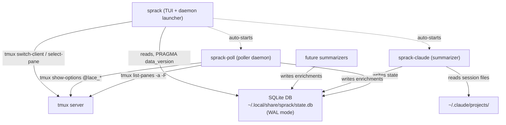

---
first_authored:
  by: "@claude-opus-4-6-20250605"
  at: 2026-03-21T12:57:44-07:00
task_list: terminal-management/sprack-tui
type: proposal
state: live
status: evolved
last_reviewed:
  status: accepted
  by: "@claude-opus-4-6-20250605"
  at: 2026-03-21T18:45:00-07:00
  round: 2
tags: [architecture, terminal_management, tmux, rust, tui, lace_into, sqlite, roadmap]
---

# sprack: tmux Sidecar TUI for Session and Process Management (Roadmap)

> BLUF: sprack is a tree-style tmux session browser built as cooperating Rust binaries sharing a SQLite database.
> A poller writes tmux state, the TUI reads and renders responsively across viewport widths, and standalone summarizers write process enrichments (especially deep Claude Code status).
> This document is the high-level roadmap and architecture overview.
> Per-component implementation details live in linked proposals: [sprack-db](2026-03-21-sprack-db.md), [sprack-poll](2026-03-21-sprack-poll.md), [sprack-tui](2026-03-21-sprack-tui-component.md), [sprack-claude](2026-03-21-sprack-claude.md).
> Design refinements (responsive layout, input model, daemon behavior) are in the [supplemental proposal](2026-03-21-sprack-design-refinements.md).

> NOTE(opus/sprack-restructuring): This proposal evolved from a monolithic implementation spec to a roadmap.
> The original detailed design was reviewed and accepted through two rounds.
> It has been restructured into per-component proposals for implementation clarity.

## What sprack Does

sprack renders a persistent view of every tmux session, window, and pane as a collapsible tree.
Sessions are grouped by lace devcontainer (using `@lace_port` tmux options set by `lace-into`).
Selecting a node focuses it in tmux.

The interface is responsive: it adapts from a narrow sidebar (~28 cols) to wider layouts that surface more detail (process summaries, Claude Code status with subagent counts and context usage).

sprack is read-and-navigate only: it does not create, destroy, or rearrange tmux objects.

## Architecture Overview

Three cooperating Rust binaries share a SQLite database (WAL mode):

| Component | Role | Proposal |
|-----------|------|----------|
| **sprack-db** | Shared library crate: schema, migrations, query helpers, WAL setup | [sprack-db](2026-03-21-sprack-db.md) |
| **sprack-poll** | Daemon: queries tmux state, writes to SQLite, SIGUSR1-driven updates | [sprack-poll](2026-03-21-sprack-poll.md) |
| **sprack** (TUI) | Responsive tree view, keyboard + mouse input, tmux navigation, daemon launcher | [sprack-tui](2026-03-21-sprack-tui-component.md) |
| **sprack-claude** | Claude Code summarizer: session file reading, colored status, subagent/context info | [sprack-claude](2026-03-21-sprack-claude.md) |

The SQLite DB is the integration contract: any tool that writes to `process_integrations` gets rendered in the tree.
See the [design overview report](../reports/2026-03-21-sprack-design-overview.md) for a mid-level walkthrough.

## SQLite Schema (Summary)

Five tables owned by `sprack-db`:

| Table | Written By | Read By | Purpose |
|-------|-----------|---------|---------|
| `sessions` | sprack-poll | sprack TUI | Session name, attached status, lace metadata |
| `windows` | sprack-poll | sprack TUI | Window index, name, active flag |
| `panes` | sprack-poll | sprack TUI, summarizers | Pane ID, title, command, PID, active/dead |
| `process_integrations` | summarizers | sprack TUI | Per-process contextual info (composite PK: `pane_id + kind`) |
| `poller_heartbeat` | sprack-poll | sprack TUI | Staleness detection (singleton timestamp) |

Full schema definition in [sprack-db proposal](2026-03-21-sprack-db.md).

## Key Design Decisions

### 1. Decoupled Architecture via Shared SQLite

Decoupling state collection from rendering provides composability (summarizers are standalone tools), performance (TUI hot loop checks one integer), and extensibility (any tool that writes to the DB gets rendered).
The trade-off is operational complexity (three+ processes), mitigated by the TUI acting as a daemon launcher.

### 2. Host-Grouped Tree

Top-level tree nodes are host groups (container or local), not raw sessions.
Sessions sharing the same `@lace_port` are siblings under one host group.
This reflects the lace mental model: "I'm working on the lace project," not "I have sessions named lace, lace-editor."

### 3. SIGUSR1 + Fallback Polling

sprack-poll uses SIGUSR1 signals from tmux hooks for near-instant structural updates (<50ms), with a 1-second fallback poll.
Hash-based diff skips DB writes when tmux state is unchanged.
Pattern adopted from [tabby](../reports/2026-03-21-tabby-tmux-plugin-analysis.md).

### 4. Rust + ratatui

Instant startup (<50ms), low memory, single static binary per component.
ratatui is the dominant Rust TUI framework with tree widget and mouse support.

### 5. Responsive Layout

sprack adapts to viewport width rather than assuming a fixed narrow sidebar.
Narrow widths (~28 cols) show a compact tree with truncated names.
Wider viewports surface more detail: process summaries, Claude Code status with subagent counts and context usage.
See [design refinements](2026-03-21-sprack-design-refinements.md) and [ratatui responsive layout report](../reports/2026-03-21-ratatui-responsive-layout-patterns.md).

### 6. Summarizers as Standalone Binaries

Process integrations are standalone binaries writing to the shared SQLite DB.
The DB schema is the contract, not a Rust trait.
Any language can write a summarizer.

### 7. Deep Claude Code Integration

sprack-claude reads Claude Code session files for rich status: thinking/idle/error state, subagent count, context window usage.
Status is rendered with loud colored indicators visible at a glance.
See [sprack-claude proposal](2026-03-21-sprack-claude.md).

### 8. Auto-Start Daemon

The `sprack` binary acts as the user-facing entry point.
On launch, it auto-starts `sprack-poll` and configured summarizers if not already running.
This collapses the multi-process complexity into a single command.

## Input Model

Simplified keyboard navigation plus mouse support:

| Key | Action |
|-----|--------|
| `j` / `k` | Move cursor down / up |
| `h` | Collapse current node |
| `l` | Expand current node |
| `Space` | Toggle collapse |
| `Enter` | Focus selected node in tmux |
| `q` | Quit sprack |

Mouse: click to select/focus, scroll to navigate, click collapse toggles.

## Implementation Phases

| Phase | Scope | Component Proposals |
|-------|-------|-------------------|
| 1 | Cargo workspace, sprack-db schema, sprack-poll basic operation, TUI renders tree from DB | [sprack-db](2026-03-21-sprack-db.md), [sprack-poll](2026-03-21-sprack-poll.md), [sprack-tui](2026-03-21-sprack-tui-component.md) |
| 2 | tmux navigation (Enter focuses panes), SIGUSR1 hooks, self-filtering, collapse/expand | [sprack-poll](2026-03-21-sprack-poll.md), [sprack-tui](2026-03-21-sprack-tui-component.md) |
| 3 | Container grouping via `@lace_port`, responsive layout breakpoints, mouse support, daemon auto-start | [sprack-tui](2026-03-21-sprack-tui-component.md), [design refinements](2026-03-21-sprack-design-refinements.md) |
| 4 | Summarizer architecture, sprack-claude with session file reading, colored status indicators | [sprack-claude](2026-03-21-sprack-claude.md) |

Phase 1 is the largest: it establishes the Cargo workspace, shared DB library, poller, and TUI.
All three layers must exist for the decoupled architecture to function at all.

## Resolved Decisions (formerly Open Questions)

1. **Repository location**: same repo (lace), at `packages/sprack/`. Published as a standalone package via cargo. Monorepo simplifies cross-references and ecosystem tooling.
2. **Installation**: `cargo install`. Dotfile integration (chezmoi, tmux.conf hooks) comes later.
3. **DB location**: `~/.local/share/sprack/state.db`. Persistent across sessions, cleaned up by the poller on start (idempotent schema creation).
4. **Claude Code integration depth**: deep. Read session files for subagent count, context usage, thinking/idle state. Loud colored status indicators are the primary goal.
5. **Launcher UX**: `sprack` auto-starts `sprack-poll` and configured summarizers. Effectively a daemon: one command starts everything.

## Related Documents

| Document | Relationship |
|----------|-------------|
| [Design Refinements](2026-03-21-sprack-design-refinements.md) | Supplemental: responsive layout, input model, daemon, claude integration |
| [sprack-db](2026-03-21-sprack-db.md) | Component: shared library crate |
| [sprack-poll](2026-03-21-sprack-poll.md) | Component: poller daemon |
| [sprack-tui](2026-03-21-sprack-tui-component.md) | Component: TUI binary |
| [sprack-claude](2026-03-21-sprack-claude.md) | Component: Claude Code summarizer |
| [Design Overview Report](../reports/2026-03-21-sprack-design-overview.md) | Familiarization walkthrough |
| [tmux Return Proposal](2026-03-21-tmux-return-and-lace-into.md) | Foundation: provides `@lace_*` session options, `lace-into`, tmux.conf |
| [Wezterm Sidecar Proposal](2026-02-01-wezterm-sidecar-workspace-manager.md) | Ancestor: sprack evolves this from wezterm Lua + TUI to pure tmux + SQLite |
| [sqlite-watcher Report](../reports/2026-03-21-sqlite-watcher-cross-process-reactivity.md) | Research: proves sqlite-watcher doesn't work cross-process |
| [tabby Analysis Report](../reports/2026-03-21-tabby-tmux-plugin-analysis.md) | Reference: SIGUSR1 pattern, batched queries, hash-based diff |
| [ratatui Responsive Layout Report](../reports/2026-03-21-ratatui-responsive-layout-patterns.md) | Research: breakpoint patterns, constraint system, mouse support |
| [tmux vs Zellij Decision](../reports/2026-03-21-tmux-vs-zellij-multiplexer-decision.md) | Context: why tmux was chosen |
