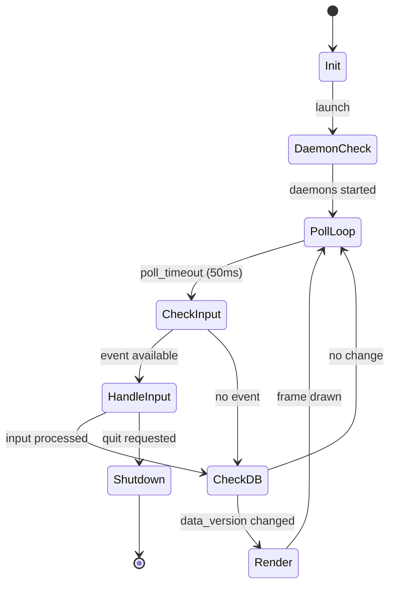
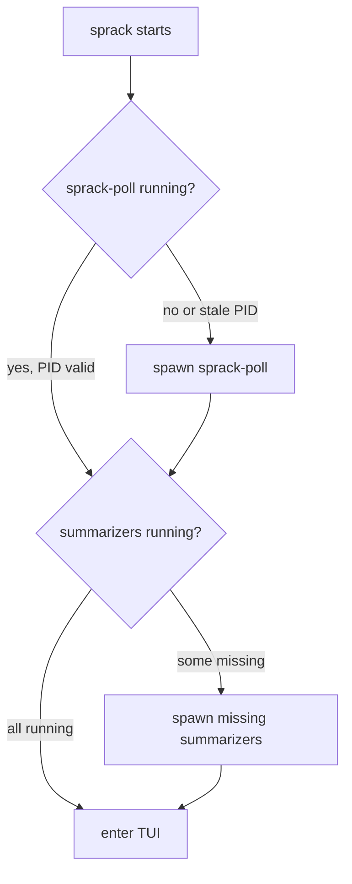

---
first_authored:
  by: "@claude-opus-4-6-20250605"
  at: 2026-03-21T19:50:00-07:00
task_list: terminal-management/sprack-tui
type: proposal
state: live
status: implementation_ready
last_reviewed:
  status: accepted
  by: "@claude-opus-4-6-20250605"
  at: 2026-03-21T21:15:00-07:00
  round: 2
tags: [sprack, ratatui, tui, responsive_layout, mouse, rust]
---

# sprack TUI Component Proposal

> BLUF: The `sprack` binary is the user-facing entry point for the sprack ecosystem: it auto-starts companion daemons, reads tmux state from SQLite, and renders a responsive collapsible tree with keyboard and mouse navigation.
> This proposal covers application structure, the four-tier responsive layout, tree widget integration, input handling, DB change detection, tmux navigation, self-filtering, daemon launcher logic, visual styling, and edge case handling.
> Implementation is phased: Phase 1 delivers basic tree rendering and DB reading, Phase 2 adds tmux navigation and collapse/expand, Phase 3 adds responsive layout, mouse support, and daemon auto-start.

## Crate Location

`packages/sprack/crates/sprack/` within the lace monorepo.
The binary is named `sprack` and is the primary command users run.

## Application Structure

### Main Loop

The application uses a standard ratatui event loop with polling-based DB change detection:



The inner loop runs on a 50ms tick.
Each tick: drain input events, check `PRAGMA data_version`, conditionally rebuild tree state, and render.

### Module Layout

```
src/
  main.rs          # Entry point, daemon launcher, terminal setup/teardown
  app.rs           # App struct, state management, main loop
  tree.rs          # Tree data model, DB-to-tree conversion, node identity
  layout.rs        # Responsive layout tiers, breakpoint logic
  render.rs        # Rendering functions per layout tier
  input.rs         # Keyboard and mouse event handling
  tmux.rs          # tmux CLI commands for navigation
  daemon.rs        # PID file management, process spawning/validation
  truncate.rs      # Unicode-aware text truncation with ellipsis
```

### App State

```rust
struct App {
    tree_state: TreeState<NodeId>,
    tree_items: Vec<TreeItem<'static, NodeId>>,
    db: Connection,
    last_data_version: i64,
    selected_node: Option<NodeId>,
    should_quit: bool,
    own_pane_id: Option<String>,  // $TMUX_PANE for self-filtering
    poller_healthy: bool,
}
```

`NodeId` is an enum distinguishing node types for tmux navigation:

```rust
#[derive(Clone, PartialEq, Eq, Hash)]
enum NodeId {
    HostGroup(String),       // lace_port or "local"
    Session(String),         // session name
    Window(String, i32),     // session name + window index
    Pane(String),            // pane_id (e.g., "%15")
}
```

## Responsive Layout

The TUI adapts to viewport width using four layout tiers.
The tier is determined by `area.width` at render time: no persistent layout state, no user configuration.

### Tier Definitions

| Tier | Width Range | Tree Content | Detail Panel |
|------|-------------|-------------|-------------|
| Compact | <30 cols | Single-char status icons, truncated names, no process info | None |
| Standard | 30-59 cols | Tree with short labels, inline status badges | None |
| Wide | 60-99 cols | Tree with labels + detail column showing process summary | Yes |
| Full | 100+ cols | Tree + expanded detail: subagent count, context %, token usage | Yes |

### Breakpoint Implementation

```rust
enum LayoutTier {
    Compact,
    Standard,
    Wide,
    Full,
}

fn layout_tier(width: u16) -> LayoutTier {
    match width {
        0..30 => LayoutTier::Compact,
        30..60 => LayoutTier::Standard,
        60..100 => LayoutTier::Wide,
        _ => LayoutTier::Full,
    }
}
```

Each tier has a distinct rendering function.
This is simpler than parameterized scaling: each function is self-contained and testable.

### Layout Structure

All tiers share a vertical frame: optional header (1 row), tree body (fill), status bar (1 row).

For tiers with a detail panel (Wide, Full), the body splits horizontally:

```rust
fn body_layout(area: Rect, tier: LayoutTier) -> (Rect, Option<Rect>) {
    match tier {
        LayoutTier::Compact | LayoutTier::Standard => {
            (area, None)
        }
        LayoutTier::Wide | LayoutTier::Full => {
            let [tree, detail] = Layout::horizontal([
                Constraint::Min(25),
                Constraint::Fill(1),
            ]).areas(area);
            (tree, Some(detail))
        }
    }
}
```

The tree column has a floor of 25 columns via `Constraint::Min(25)`.
The detail panel absorbs remaining space via `Constraint::Fill(1)`.
If the terminal shrinks below 25 columns, the tree still renders (ratatui clips content at the boundary).

### Mockups

**Compact (<30 cols):**

```
 HOSTS
 v lace
   v editor
     * shell
     . term
   > logs (3)
 > local
   ? scratch
```

Single-char status icons: `*` thinking, `.` idle, `T` tool use, `!` error, `?` waiting, `-` complete.
Names truncated with ellipsis at boundary.

**Standard (30-59 cols):**

```
 HOSTS
 v lace (22425)
   v editor
     shell (nvim) [thinking]
     terminal (nu) [idle]
   > logs (3)
 v dotfiles (22430)
   > editor
   > shell
 > local
   scratch (nu) [waiting]
```

Inline status badges in brackets.
Collapsed nodes show child count.

**Wide (60-99 cols):**

```
 HOSTS                          | Detail
 v lace (22425)                 | claude [thinking...]
   v editor                     |   3 subagents
     shell (nvim) [thinking]    |   42% context
     terminal (nu) [idle]       |   last tool: Read
   > logs (3)                   |
 v dotfiles (22430)             |
   > editor                     |
```

Tree + detail column.
Detail shows process summary for the selected node.

**Full (100+ cols):**

```
 HOSTS                          | Detail
 v lace (22425)                 | claude-opus-4-5 [thinking...]
   v editor                     |   subagents: 3 active
     shell (nvim) [thinking]    |   context: 42% (84k/200k tokens)
     terminal (nu) [idle]       |   last tool: Read src/main.rs
   > logs (3)                   |   session: 12m active, 847 messages
 v dotfiles (22430)             |   model: claude-opus-4-5-20251101
   > editor                     |
```

Full detail: model name, subagent count, context percentage with raw token counts, last tool with argument, session duration.

### Text Truncation

All text labels truncate with Unicode-aware ellipsis using `unicode-width`:

```rust
fn truncate_with_ellipsis(s: &str, max_width: usize) -> String {
    if s.width() <= max_width {
        return s.to_string();
    }
    if max_width <= 1 {
        return "\u{2026}".to_string();
    }
    let target = max_width - 1;
    let mut width = 0;
    let mut end = 0;
    for (idx, ch) in s.char_indices() {
        let cw = unicode_width::UnicodeWidthChar::width(ch).unwrap_or(0);
        if width + cw > target { break; }
        width += cw;
        end = idx + ch.len_utf8();
    }
    format!("{}\u{2026}", &s[..end])
}
```

Truncation priority (lowest priority truncated first):
1. Detail panel content
2. Pane titles/commands
3. Window names
4. Session names
5. Host group names (truncated last)

Truncation happens at `TreeItem` construction time, since `tui-tree-widget` does not perform width-aware truncation internally.

## Tree Widget

### Crate: `tui-tree-widget`

The `tui-tree-widget` crate (v0.24+) provides `TreeItem`, `TreeState`, and `Tree` types that map directly to sprack's hierarchy.

### Tree Data Model

The tree has four levels of nesting:

```
HostGroup (container or "local")
  Session (tmux session)
    Window (tmux window)
      Pane (tmux pane)
```

Sessions are grouped by `@lace_port`.
Sessions sharing the same `@lace_port` value are siblings under one `HostGroup`.
Sessions without `@lace_port` go under a group named "local".

The `HostGroup` display name is derived from the shared prefix of its session names, falling back to the first session name alphabetically.
If there is only one session in the group, the group name is that session's name.

### Node Identity and State Preservation

When the DB changes and the tree rebuilds, UI state (cursor position, collapsed/expanded nodes) must be preserved.
`TreeState` tracks expanded nodes by identifier path.

The rebuild algorithm:
1. Read all sessions, windows, panes from DB.
2. Group sessions by `@lace_port`.
3. Construct new `Vec<TreeItem<NodeId>>`.
4. The existing `TreeState` retains its expanded set and selection, keyed by `NodeId`.
5. If the selected node no longer exists (pane closed, session destroyed), fall back to the nearest surviving ancestor, then to the first visible node.

> NOTE(opus/sprack-tui): `tui-tree-widget`'s `TreeState` stores expanded nodes as `HashSet<Vec<Identifier>>` (identifier paths).
> Identifiers only need to be unique among siblings, matching tmux's naming (session names are unique, window indices are unique within a session, pane IDs are globally unique).

### Tree Construction

```rust
fn build_tree(
    db: &Connection,
    own_pane_id: Option<&str>,
    available_width: u16,
    tier: LayoutTier,
) -> Result<Vec<TreeItem<'static, NodeId>>> {
    let sessions = sprack_db::query_sessions(db)?;
    let windows = sprack_db::query_windows(db)?;
    let panes = sprack_db::query_panes(db)?;
    let integrations = sprack_db::query_integrations(db)?;

    let groups = group_sessions_by_host(&sessions);

    groups.iter().map(|group| {
        let session_items: Vec<_> = group.sessions.iter().map(|session| {
            let window_items: Vec<_> = windows_for(session, &windows).iter().map(|window| {
                let pane_items: Vec<_> = panes_for(window, &panes)
                    .iter()
                    .filter(|p| Some(p.pane_id.as_str()) != own_pane_id)
                    .map(|pane| build_pane_item(pane, &integrations, available_width, tier))
                    .collect();
                build_window_item(window, pane_items, available_width, tier)
            }).collect();
            build_session_item(session, window_items, available_width, tier)
        }).collect();
        build_host_group_item(group, session_items, available_width, tier)
    }).collect()
}
```

## Input Handling

### Keyboard

| Key | Action | Implementation |
|-----|--------|---------------|
| `j` / Down | Move cursor down | `tree_state.key_down()` |
| `k` / Up | Move cursor up | `tree_state.key_up()` |
| `h` / Left | Collapse node or move to parent | `tree_state.key_left()` |
| `l` / Right | Expand node or move to first child | `tree_state.key_right()` |
| `Space` | Toggle collapse/expand | `tree_state.toggle_selected()` |
| `Enter` | Focus selected node in tmux | `tmux::focus_node(selected)` |
| `q` | Quit sprack | `app.should_quit = true` |

Arrow keys are mapped as aliases for `j`/`k`/`h`/`l` for discoverability.

### Mouse

Mouse capture is enabled explicitly on startup (`crossterm::event::EnableMouseCapture`) and disabled on cleanup.

| Action | Behavior | Implementation |
|--------|----------|---------------|
| Left click on node | Select (move cursor, show detail panel info) | `tree_state.click_at(pos)` |
| Double-click on node | Focus in tmux (equivalent to Enter) | `tree_state.click_at(pos)` then `tmux::focus_node()` |
| Left click on collapse toggle | Toggle collapse/expand | `tree_state.click_at(pos)` (handled internally) |
| Scroll up/down | Scroll tree view | `tree_state.scroll_up(3)` / `tree_state.scroll_down(3)` |

Left click selects only, matching the keyboard's select/focus separation (cursor keys select, Enter focuses).
Double-click is the mouse equivalent of pressing Enter.

`tui-tree-widget`'s `click_at()` handles hit testing internally using rendered position data from `render_stateful_widget`.
No manual coordinate-to-node mapping is needed.

### Event Loop Integration

```rust
fn handle_event(app: &mut App, event: Event) -> Result<()> {
    match event {
        Event::Key(key) => handle_key(app, key),
        Event::Mouse(mouse) => handle_mouse(app, mouse),
        Event::Resize(_, _) => Ok(()),  // layout recomputed on next render
        _ => Ok(()),
    }
}
```

Crossterm's `poll()` with a 50ms timeout provides the tick rate.
Multiple events may queue between ticks; all are drained before rendering.

## DB Reading and Change Detection

### Connection Setup

The TUI opens the SQLite DB via sprack-db's shared read-only helper:

```rust
let db = sprack_db::open_db_readonly(db_path)?;
```

> NOTE(opus/sprack-tui): `open_db_readonly` configures WAL mode and read-only flags internally.
> The TUI never modifies the DB; only sprack-poll and summarizers write.

### Change Detection

Every tick (50ms), the TUI checks for DB changes:

```rust
fn check_data_version(db: &Connection) -> Result<i64> {
    db.pragma_query_value(None, "data_version", |row| row.get(0))
}
```

If `data_version` differs from the cached value, perform a full state read and tree rebuild.
If unchanged, skip all DB work.
This check reads from the WAL-index shared memory region and is sub-microsecond.

### Full State Read

On change, a single function reads all five tables in one transaction:

```rust
fn read_full_state(db: &Connection) -> Result<DbSnapshot> {
    let sessions = query_sessions(db)?;
    let windows = query_windows(db)?;
    let panes = query_panes(db)?;
    let integrations = query_integrations(db)?;
    let heartbeat = query_heartbeat(db)?;
    Ok(DbSnapshot { sessions, windows, panes, integrations, heartbeat })
}
```

The heartbeat timestamp is checked against the current time.
If stale (>5 seconds old), the status bar shows a warning that the poller may be down.

## tmux Navigation

When the user presses Enter or double-clicks a node, sprack executes tmux commands to focus that node.

### Command Construction

| Node Type | tmux Command |
|-----------|-------------|
| Pane | `tmux switch-client -t $session \; select-window -t $session:$window \; select-pane -t $pane_id` |
| Window | `tmux switch-client -t $session \; select-window -t $session:$window` |
| Session | `tmux switch-client -t $session` |
| HostGroup | `tmux switch-client -t $first_session` (focus first session in group) |

### Execution

Commands run via `std::process::Command::status()` (spawn and wait for exit).
Using `status()` instead of bare `spawn()` prevents zombie processes from accumulating when tmux commands complete.

```rust
fn focus_pane(session: &str, window_idx: i32, pane_id: &str) -> Result<()> {
    Command::new("tmux")
        .args(["switch-client", "-t", session])
        .args([";", "select-window", "-t", &format!("{}:{}", session, window_idx)])
        .args([";", "select-pane", "-t", pane_id])
        .status()?;
    Ok(())
}
```

> WARN(opus/sprack-tui): `switch-client` changes the active session for the client attached to the current terminal.
> If sprack runs in a detached context (unlikely but possible), this command fails silently.
> This is acceptable: sprack is designed to run in a tmux pane.

## Self-Filtering

sprack excludes its own pane from the tree to avoid a confusing self-referential entry.

On startup, read `$TMUX_PANE` from the environment:

```rust
let own_pane_id = std::env::var("TMUX_PANE").ok();
```

During tree construction, filter out any pane whose `pane_id` matches `own_pane_id`.
If `$TMUX_PANE` is not set (running outside tmux, e.g., for testing), no filtering occurs.

If the self-filtered pane is the only pane in a window, the window is still shown (empty window node).
If the window has no other panes and the user navigates to it, the window-level tmux focus command is used.

## Daemon Launcher

### Startup Sequence



### PID File Validation

PID files live at `~/.local/share/sprack/`:
- `poll.pid`: sprack-poll
- `claude.pid`: sprack-claude

Validation checks:
1. PID file exists.
2. PID file contains a valid integer.
3. Process with that PID exists (`kill(pid, 0)` or `/proc/<pid>/` check).
4. Process is the correct binary (read `/proc/<pid>/cmdline` or `/proc/<pid>/exe`).

If any check fails, remove the stale PID file and respawn.

### Process Spawning

Daemons are spawned as detached background processes:

```rust
use std::os::unix::process::CommandExt;

fn spawn_daemon(binary: &str, args: &[&str], pid_file: &Path) -> Result<()> {
    let child = unsafe {
        Command::new(binary)
            .args(args)
            .stdin(Stdio::null())
            .stdout(Stdio::null())
            .stderr(Stdio::null())
            .pre_exec(|| { libc::setsid(); Ok(()) })
            .spawn()?
    };
    fs::write(pid_file, child.id().to_string())?;
    Ok(())
}
```

> NOTE(opus/sprack-tui): Use `pre_exec` with `setsid()` (via `libc::setsid`) to place daemons in their own session, preventing signal propagation from the TUI's process group.
> Without `setsid`, a SIGINT to the TUI's process group could terminate daemons.
> `stdin`/`stdout`/`stderr` are still nulled to detach from the terminal.

### Shutdown Behavior

On `q` (quit), the TUI exits.
Daemons (sprack-poll, summarizers) continue running.
They self-terminate when the tmux server exits or on SIGTERM.

The DB stays warm between TUI sessions: the next `sprack` launch reads from an already-populated DB instead of waiting for the first poll cycle.

## Node Visual Styling

### Tree Chrome

| Element | Style |
|---------|-------|
| Expanded node prefix | `v ` |
| Collapsed node prefix | `> ` |
| Leaf node prefix | `  ` (two spaces) |
| Collapsed child count | ` (N)` after node name, dimmed |

### Node State Styles

| State | Style | Rationale |
|-------|-------|-----------|
| Active pane (cursor in this pane) | Bold text, highlighted background | Most important: shows where the user is |
| Active window (contains active pane) | Subtle highlight (no bold) | Secondary importance |
| Attached session | Normal text | Default state |
| Detached session | Dimmed text | Lower priority, not currently in use |
| Selected node (cursor) | Reversed colors | Standard tree selection indicator |

### Process Status Colors

Colors for `process_integrations` status, visible at all layout tiers:

| State | Color | Compact Icon | Standard Badge |
|-------|-------|-------------|---------------|
| Thinking | Bold yellow | `*` | `[thinking]` |
| ToolUse | Bold cyan | `T` | `[tool: Read]` |
| Idle | Dim green | `.` | `[idle]` |
| Error | Bold red | `!` | `[error]` |
| Waiting | Dim white | `?` | `[waiting]` |
| Complete | Dim (default) | `-` | `[complete]` |

These colors are loud by design: the primary use case is scanning multiple Claude Code instances at a glance to see which are active, stuck, or idle.

### Stale Poller Indicator

When the poller heartbeat is >5 seconds old, the status bar renders a warning:

```
[poller: stale (8s ago)]
```

Styled bold red to alert the user that the tree may be out of date.

## Edge Cases

### Narrow Resize

If the terminal shrinks below 25 columns, the tree still renders.
Ratatui clips content at the widget boundary.
Text truncation ensures labels degrade gracefully (single-char icons and truncated names).
At extreme widths (<10 cols), the tree is essentially unusable but does not crash.

### Destroyed Nodes

When a pane, window, or session is destroyed between ticks:
- The next `data_version` change triggers a tree rebuild.
- If the selected node no longer exists, selection falls back to the nearest surviving ancestor.
- If the entire ancestor chain is gone, selection falls to the first visible node.
- No stale references persist because the tree is fully rebuilt from DB state.

### tmux Server Down

If the tmux server exits while sprack is running:
- sprack-poll detects this and self-terminates.
- The poller heartbeat goes stale.
- sprack shows the stale poller warning.
- tmux navigation commands (`switch-client`, etc.) fail silently.
- The TUI remains running and responsive (showing stale data) until the user quits.

> TODO(opus/sprack-tui): Consider auto-exit when the tmux server is confirmed down.
> Detection: tmux navigation commands return non-zero, heartbeat stale for >30 seconds.

### Stale Poller

If sprack-poll crashes but the TUI is still running:
- `data_version` stops changing.
- Heartbeat timestamp ages.
- After 5 seconds, the status bar shows a stale warning.
- The tree remains navigable with the last-known state.
- The user can quit and re-run `sprack` to trigger daemon restart.

### DB Locked or Missing

If the DB file does not exist on startup (sprack-poll has not run yet):
- The daemon launcher starts sprack-poll first.
- sprack waits up to 2 seconds for the DB file to appear (polling every 100ms).
- If the DB does not appear, sprack exits with an error message.

If the DB is locked (unlikely with WAL mode and read-only access):
- Retry the read with a 100ms backoff, up to 3 attempts.
- If still locked, render a status bar warning and skip the update.

### Rapid Resize

Crossterm emits `Event::Resize` on each terminal resize.
The layout tier is recomputed on every render call using `area.width`.
No debouncing is needed: ratatui's layout cache makes redundant renders cheap, and the tier enum switch is a simple integer comparison.

## Dependencies

| Crate | Version | Purpose |
|-------|---------|---------|
| `ratatui` | 0.29+ | TUI framework: layout, rendering, widgets |
| `crossterm` | 0.28+ | Terminal backend: input events, mouse capture, raw mode |
| `tui-tree-widget` | 0.24+ | Collapsible tree widget with mouse support |
| `sprack-db` | path dep | Shared library: schema, queries, WAL setup |
| `rusqlite` | 0.32+ | SQLite bindings (via sprack-db, but also direct for `data_version`) |
| `unicode-width` | 0.2+ | Display-width measurement for text truncation |
| `anyhow` | 1.0 | Error handling |

> NOTE(opus/sprack-tui): `unicode-width` is already a transitive dependency of ratatui.
> Listing it explicitly ensures the version is pinned and the import path is clear.

## Test Plan

### Unit Tests

| Area | Test |
|------|------|
| `truncate_with_ellipsis` | ASCII strings, empty string, max_width=0, max_width=1, string shorter than max, CJK characters |
| `layout_tier` | Boundary values: 0, 29, 30, 59, 60, 99, 100, 500 |
| `body_layout` | Compact/Standard return no detail panel; Wide/Full return detail panel with correct constraints |
| `build_tree` | Correct grouping by `@lace_port`, "local" group for ungrouped sessions, self-filtering |
| `NodeId` hashing | Distinct node types with same string produce distinct hashes |
| Tree rebuild | Selection preservation when selected node survives rebuild |
| Tree rebuild | Selection fallback when selected node is destroyed |
| PID validation | Valid PID, stale PID, missing PID file, PID file with non-integer content |

### Integration Tests

| Area | Test |
|------|------|
| DB change detection | Write to DB from a second connection, verify `data_version` changes |
| Tree from DB | Populate DB with known state, verify tree structure matches |
| Self-filtering | Populate DB with pane matching `$TMUX_PANE`, verify it is excluded |
| Daemon launcher | Mock PID file creation, verify stale PID detection and cleanup |

### Manual Verification

| Scenario | Verification |
|----------|-------------|
| Narrow sidebar (~28 cols) | Compact tier renders, names truncated, status icons visible |
| Standard width (~45 cols) | Standard tier renders, inline badges visible |
| Wide width (~80 cols) | Detail panel appears, process summary shown |
| Full width (~120 cols) | Expanded detail with token counts and model name |
| Resize from wide to narrow | Layout tier switches cleanly, no visual artifacts |
| Mouse click on pane | Pane selected (cursor moves, detail panel updates) |
| Mouse double-click on pane | Pane focused in tmux |
| Mouse scroll | Tree scrolls |
| Collapse/expand with keyboard | `h`/`l`/`Space` work correctly |
| Kill sprack-poll while TUI running | Stale poller warning appears in status bar |
| Run `sprack` when daemons not running | Daemons auto-start, tree populates within 2 seconds |

## Implementation Phasing

### Phase 1: Basic Tree Rendering

Scope:
- `App` struct, main loop with 50ms tick.
- `PRAGMA data_version` change detection.
- Full state read from DB (assumes sprack-poll is running separately).
- Flat tree rendering: sessions > windows > panes, no host grouping.
- `j`/`k` navigation, `q` to quit.
- Compact and Standard tiers only (no detail panel).
- No mouse support.
- No daemon launcher (manual start of sprack-poll).

Deliverable: a read-only tree view that updates when the DB changes.

### Phase 2: tmux Navigation and Collapse/Expand

Scope:
- `Enter` focuses selected node in tmux.
- `h`/`l`/`Space` for collapse/expand.
- Host grouping by `@lace_port`.
- Self-filtering via `$TMUX_PANE`.
- Selection preservation across tree rebuilds.
- Destroyed-node fallback logic.
- Node visual styling (bold active pane, dimmed detached sessions).

Deliverable: a navigable, interactive tree browser.

### Phase 3: Responsive Layout, Mouse, Daemon Launcher

Scope:
- All four layout tiers (Compact, Standard, Wide, Full).
- Detail panel for Wide and Full tiers.
- Mouse support (click, scroll).
- Daemon auto-start (PID file validation, process spawning).
- Process integration rendering (colored status from `process_integrations` table).
- Stale poller detection and status bar warning.
- Status bar with connection health and help hints.

Deliverable: the complete user-facing `sprack` binary.

## Related Documents

| Document | Relationship |
|----------|-------------|
| [sprack Roadmap](2026-03-21-sprack-tmux-sidecar-tui.md) | Parent: high-level architecture and phasing |
| [Design Refinements](2026-03-21-sprack-design-refinements.md) | Supplemental: responsive layout, input model, daemon behavior |
| [sprack-db](2026-03-21-sprack-db.md) | Sibling component: shared library crate |
| [sprack-poll](2026-03-21-sprack-poll.md) | Sibling component: poller daemon |
| [sprack-claude](2026-03-21-sprack-claude.md) | Sibling component: Claude Code summarizer |
| [Design Overview Report](../reports/2026-03-21-sprack-design-overview.md) | Context: mid-level architecture walkthrough |
| [Ratatui Responsive Layout Report](../reports/2026-03-21-ratatui-responsive-layout-patterns.md) | Research: constraint system, breakpoints, mouse, tree widget |
