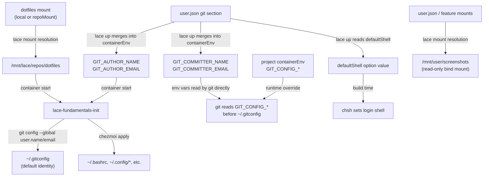

---
first_authored:
  by: "@claude-opus-4-6-20250725"
  at: 2026-03-24T18:00:00-07:00
task_list: lace/fundamentals-feature
type: proposal
state: live
status: review_ready
last_reviewed:
  status: accepted
  by: "@claude-opus-4-6-20250725"
  at: 2026-03-24T22:30:00-07:00
  round: 4
tags: [lace, devcontainer_features, architecture, sshd, git, dotfiles]
---

# Lace Fundamentals Devcontainer Feature

> BLUF(opus/fundamentals-feature): Introduce a single published devcontainer feature (`ghcr.io/weftwiseink/devcontainer-features/lace-fundamentals`) that consolidates baseline capabilities every lace container needs: SSH daemon with hardening, git (latest via dependency) with project-aware identity, dotfiles integration via chezmoi, default shell configuration, core utilities, and host screenshot directory access.
> The feature uses `dependsOn` to pull in the upstream sshd and git features, and declares lace mount metadata for authorized keys, dotfiles, and screenshots as requested mounts (lace prompts the user when a source is not configured).
> Git identity uses a two-layer approach: `user.json` provides the default (written to `~/.gitconfig` by the init script), projects override via git's native `GIT_CONFIG_*` environment variables.
> The install script is decomposed into per-component step scripts (`steps/ssh-hardening.sh`, `steps/chezmoi.sh`, etc.) sourced by a thin orchestrator.
> SSH is hardened to key-only authentication with password and root login disabled.
> Dotfiles are applied via a `postCreateCommand` lifecycle hook that runs `chezmoi apply` from the mounted dotfiles repo if present.
> This feature replaces three current declarations (`ghcr.io/devcontainers/features/sshd:1`, `./features/lace-sshd`, and manual dotfiles setup) with a single feature reference, and integrates cleanly with the user-level config proposal (`user.json`).
>
> - **Depends on:** [user-level config proposal](2026-03-24-lace-user-level-config.md) (provides git identity, shell preference, screenshot mounts)
> - **Subsumes:** [sshd evolution proposal](2026-03-22-lace-sshd-feature-evolution.md) (deferred, folded into this design)
> - **References:** [git credential support RFP](2026-03-23-lace-git-credential-support.md), [screenshot sharing RFP](2026-03-24-lace-screenshot-sharing.md), [dotfiles/chezmoi proposal](2026-02-04-dotfiles-migration-and-config-extraction.md)

## Objective

Provide a single devcontainer feature that delivers the baseline developer environment for every lace container.

The feature must:
1. Install and harden an SSH daemon for terminal-native access (wezterm, tmux, direct SSH).
2. Configure git commit identity from `user.json` environment variables without exposing credential helpers or SSH keys.
3. Integrate with chezmoi-managed dotfiles mounted at a well-known path.
4. Set the user's preferred default shell (nushell or other) when specified.
5. Declare lace mount and port metadata so lace auto-injects SSH keys, dotfiles, and screenshot directory access.
6. Work correctly both with and without `user.json` (graceful degradation).
7. Replace the current proliferation of individual feature declarations and manual setup steps.

## Background

### Current state

Lace containers require several independent feature declarations and manual configuration to achieve a baseline development environment.
The current `devcontainer.json` for the lace project declares:

```json
"prebuildFeatures": {
    "ghcr.io/devcontainers/features/git:1": { "version": "latest" },
    "ghcr.io/devcontainers/features/sshd:1": {},
    "./features/lace-sshd": {},
    "ghcr.io/anthropics/devcontainer-features/claude-code:1": {},
    "ghcr.io/devcontainers-extra/features/neovim-homebrew:1": {},
    "ghcr.io/eitsupi/devcontainer-features/nushell:0": {},
    "ghcr.io/devcontainers/features/rust:1": { "version": "latest", "profile": "default" }
}
```

Of these, `sshd:1` + `./features/lace-sshd` are always paired (the local feature is metadata-only, the upstream feature does the install).
Git identity is not configured at all: containers cannot create commits without manual `git config` commands.
Dotfiles integration requires a `repoMounts` entry for the dotfiles repo and manual `chezmoi apply` inside the container.
Default shell (nushell) is declared as a separate feature with no integration into shell preference configuration.

### Problems this solves

1. **Feature proliferation**: two features (sshd + lace-sshd) to get SSH working, neither of which hardens the configuration.
2. **No git identity**: the git credential support RFP identified that containers cannot `git commit` without manual setup.
3. **Manual dotfiles**: chezmoi apply must be run by hand after each container creation.
4. **No shell preference**: nushell is installed as a feature but not set as the default login shell.
5. **No SSH hardening**: the upstream sshd feature leaves password authentication enabled, root login permitted.
6. **Not reusable**: each project must vendor the local lace-sshd feature and replicate the same setup.

### Related proposals

The [user-level config proposal](2026-03-24-lace-user-level-config.md) introduces `~/.config/lace/user.json` which provides:
- Git identity via `GIT_AUTHOR_NAME`/`GIT_AUTHOR_EMAIL`/`GIT_COMMITTER_NAME`/`GIT_COMMITTER_EMAIL` environment variables.
- Default shell preference via the `defaultShell` field.
- Screenshot mount via the `mounts` section (user-level, read-only).

The fundamentals feature is the container-side consumer of these user config values.
User config provides the data; the feature configures the container to use it.

The [sshd evolution proposal](2026-03-22-lace-sshd-feature-evolution.md) designed a standalone `lace-sshd` published feature.
This fundamentals feature subsumes that design: SSH hardening is one component of a broader baseline, not a standalone concern.
The sshd evolution proposal is marked `deferred` and should transition to `evolved` once this proposal is accepted.

### Existing feature patterns

Published lace features follow a consistent structure:
- `devcontainer-feature.json` with `id`, `version`, `options`, `dependsOn`, and `customizations.lace` (mounts, ports).
- `install.sh` running as root during container build.
- Published to `ghcr.io/weftwiseink/devcontainer-features/<id>`.
- The CI workflow at `.github/workflows/devcontainer-features-release.yaml` auto-publishes from `devcontainers/features/src/`.

The `claude-code` feature is the closest reference: it uses `dependsOn` for node, declares a lace mount for config persistence, and has an `install.sh` that installs a tool and prepares directories.

## Proposed Solution

### Feature identity

- **ID**: `lace-fundamentals`
- **Registry**: `ghcr.io/weftwiseink/devcontainer-features/lace-fundamentals`
- **Source**: `devcontainers/features/src/lace-fundamentals/`
- **Version**: `1.0.0`

### Feature metadata (`devcontainer-feature.json`)

```json
{
    "id": "lace-fundamentals",
    "version": "1.0.0",
    "name": "Lace Fundamentals",
    "description": "Baseline developer environment for lace containers: hardened SSH, git identity, dotfiles integration, default shell, and screenshot access.",
    "documentationURL": "https://github.com/weftwiseink/lace/tree/main/devcontainers/features/src/lace-fundamentals",
    "licenseURL": "https://github.com/weftwiseink/lace/blob/main/LICENSE",
    "options": {
        "sshPort": {
            "type": "string",
            "default": "2222",
            "description": "Container-side SSH port. Lace maps this asymmetrically: the host-side port is auto-allocated from the lace range (22425-22499)."
        },
        "defaultShell": {
            "type": "string",
            "default": "",
            "description": "Absolute path to the default login shell (e.g., /usr/bin/nu). Empty string means no shell change. Typically populated from user.json defaultShell."
        },
        "enableSshHardening": {
            "type": "boolean",
            "default": true,
            "description": "Apply SSH hardening (key-only auth, no password, no root login). Disable only for debugging."
        }
    },
    "dependsOn": {
        "ghcr.io/devcontainers/features/sshd:1": {},
        "ghcr.io/devcontainers/features/git:1": {}
    },
    "customizations": {
        "lace": {
            "ports": {
                "sshPort": {
                    "label": "sshd",
                    "onAutoForward": "silent",
                    "requireLocalPort": true
                }
            },
            "mounts": {
                "authorized-keys": {
                    "target": "/home/${_REMOTE_USER}/.ssh/authorized_keys",
                    "recommendedSource": "~/.config/lace/ssh/id_ed25519.pub",
                    "description": "SSH public key for lace SSH access",
                    "readonly": true,
                    "sourceMustBe": "file",
                    "hint": "Run: mkdir -p ~/.config/lace/ssh && ssh-keygen -t ed25519 -f ~/.config/lace/ssh/id_ed25519 -N ''"
                },
                "dotfiles": {
                    "target": "/mnt/lace/repos/dotfiles",
                    "description": "Dotfiles repo for chezmoi apply. Can be a direct git clone or a local checkout.",
                    "sourceMustBe": "directory",
                    "hint": "Point to your dotfiles repo checkout, or configure a repoMount for automatic cloning"
                },
                "screenshots": {
                    "target": "/mnt/lace/screenshots",
                    "recommendedSource": "~/Pictures/Screenshots",
                    "description": "Host screenshots directory for Claude Code image references",
                    "readonly": true,
                    "sourceMustBe": "directory",
                    "hint": "Override source in settings.json. macOS: ~/Desktop/Screenshots, Linux: ~/Pictures/Screenshots"
                }
            }
        }
    }
}
```

Key design points:

- **`dependsOn` for sshd**: the upstream `ghcr.io/devcontainers/features/sshd:1` is auto-installed before this feature.
  Consumers no longer declare it separately.
- **`sshPort` option**: retained from the current lace-sshd for lace port allocation.
  The option value is readable by lace's metadata pipeline.
- **`defaultShell` option**: an empty default means no shell change.
  When `user.json` provides a `defaultShell`, lace injects it as the option value.
- **Dotfiles and screenshots as requested mounts**: the feature declares `dotfiles` and `screenshots` in `customizations.lace.mounts` using the same pattern as `claude-code` (which requests a config mount) and `neovim` (which requests a plugins mount).
  The dotfiles mount target (`/mnt/lace/repos/dotfiles`) is known at build time; the init script reads `LACE_DOTFILES_PATH` env var at runtime for flexibility.
  Lace prompts the user to configure a source if one is not provided in `settings.json` or `user.json`.
  For dotfiles, the user chooses whether to point to a local checkout or set up a `repoMount` for automatic git cloning.
  For screenshots, `user.json` provides the source via its mounts section.
- **Git dependency**: `dependsOn` includes `ghcr.io/devcontainers/features/git:1` to ensure the latest git is available (required for `GIT_CONFIG_*` env var support, available since git 2.31).

> NOTE(opus/fundamentals-feature): The dotfiles mount uses `sourceMustBe: "directory"` without a `recommendedSource`.
> This is intentional: dotfiles repos vary widely in location.
> Some users have `~/dotfiles`, others use `~/.dotfiles`, others rely on `repoMounts` for automatic cloning.
> The `hint` guides the user without prescribing a single path.

> NOTE(opus/fundamentals-feature): The screenshots mount includes `recommendedSource: "~/Pictures/Screenshots"` as a sensible Linux default.
> macOS users should override this in `settings.json` or `user.json` (typically `~/Desktop/Screenshots`).
> The mount is `readonly: true` to match the user-level config security posture.

### Install script (`install.sh`)

The install script runs as root during container build.
It is decomposed into per-component step scripts sourced from a `steps/` directory, making each concern independently readable and testable.

> NOTE(opus/fundamentals-feature): Chezmoi is hardcoded as the only supported dotfiles manager.
> It is the most widely adopted declarative dotfiles tool and the only one our team uses.
> Supporting alternative managers (GNU Stow, yadm, etc.) could be added via an option in the future, but there is no current demand.

> NOTE(opus/fundamentals-feature): Git identity setup remains in the fundamentals feature rather than being a standalone feature.
> The project-aware identity mechanism (via `GIT_CONFIG_*` env vars) is lightweight: the init script writes `~/.gitconfig` defaults, and project `containerEnv` overrides at runtime.
> This does not warrant a separate feature because the init script already exists and the identity logic is fewer than 20 lines.
> If project-aware identity grows more complex in the future (e.g., multi-repo workspaces with different identities per repo), extracting a dedicated `lace-git-identity` feature would be warranted.

#### Directory structure

```
devcontainers/features/src/lace-fundamentals/
  devcontainer-feature.json
  install.sh                  # orchestrator: sources steps in order
  steps/
    ssh-hardening.sh          # SSH config hardening
    ssh-directory.sh          # SSH directory preparation
    chezmoi.sh                # chezmoi binary installation
    git-identity.sh           # init script creation (runtime git config)
    shell.sh                  # default shell configuration
    staples.sh                # core utilities installation
```

#### Main install.sh (orchestrator)

```sh
#!/bin/sh
set -eu

# Feature option variables (devcontainer CLI injects these as env vars)
SSH_PORT="${SSHPORT:-2222}"
DEFAULT_SHELL="${DEFAULTSHELL:-}"
ENABLE_SSH_HARDENING="${ENABLESSHHARDENING:-true}"
_REMOTE_USER="${_REMOTE_USER:-root}"

SCRIPT_DIR="$(cd "$(dirname "$0")" && pwd)"

# Source each step in dependency order
. "$SCRIPT_DIR/steps/staples.sh"
. "$SCRIPT_DIR/steps/ssh-hardening.sh"
. "$SCRIPT_DIR/steps/ssh-directory.sh"
. "$SCRIPT_DIR/steps/chezmoi.sh"
. "$SCRIPT_DIR/steps/git-identity.sh"
. "$SCRIPT_DIR/steps/shell.sh"

echo "lace-fundamentals: Install complete."
```

#### steps/ssh-hardening.sh

```sh
# SSH Hardening step
# Requires: sshd installed (via dependsOn)

if [ "$ENABLE_SSH_HARDENING" = "true" ]; then
    echo "lace-fundamentals: Hardening SSH configuration..."

    SSHD_CONFIG="/etc/ssh/sshd_config"

    if [ ! -f "$SSHD_CONFIG" ]; then
        echo "Error: sshd_config not found. The sshd dependency should have installed it."
        exit 1
    fi

    # Disable password authentication
    sed -i 's/^#*PasswordAuthentication.*/PasswordAuthentication no/' "$SSHD_CONFIG"
    if ! grep -q '^PasswordAuthentication' "$SSHD_CONFIG"; then
        echo "PasswordAuthentication no" >> "$SSHD_CONFIG"
    fi

    # Disable keyboard-interactive (PAM-based password prompts)
    sed -i 's/^#*KbdInteractiveAuthentication.*/KbdInteractiveAuthentication no/' "$SSHD_CONFIG"
    if ! grep -q '^KbdInteractiveAuthentication' "$SSHD_CONFIG"; then
        echo "KbdInteractiveAuthentication no" >> "$SSHD_CONFIG"
    fi

    # Enable pubkey authentication explicitly
    sed -i 's/^#*PubkeyAuthentication.*/PubkeyAuthentication yes/' "$SSHD_CONFIG"
    if ! grep -q '^PubkeyAuthentication' "$SSHD_CONFIG"; then
        echo "PubkeyAuthentication yes" >> "$SSHD_CONFIG"
    fi

    # Disable root login
    sed -i 's/^#*PermitRootLogin.*/PermitRootLogin no/' "$SSHD_CONFIG"
    if ! grep -q '^PermitRootLogin' "$SSHD_CONFIG"; then
        echo "PermitRootLogin no" >> "$SSHD_CONFIG"
    fi

    # Disable agent forwarding (no credential leakage)
    sed -i 's/^#*AllowAgentForwarding.*/AllowAgentForwarding no/' "$SSHD_CONFIG"
    if ! grep -q '^AllowAgentForwarding' "$SSHD_CONFIG"; then
        echo "AllowAgentForwarding no" >> "$SSHD_CONFIG"
    fi

    # Allow local TCP forwarding only
    sed -i 's/^#*AllowTcpForwarding.*/AllowTcpForwarding local/' "$SSHD_CONFIG"
    if ! grep -q '^AllowTcpForwarding' "$SSHD_CONFIG"; then
        echo "AllowTcpForwarding local" >> "$SSHD_CONFIG"
    fi

    # Disable X11 forwarding
    sed -i 's/^#*X11Forwarding.*/X11Forwarding no/' "$SSHD_CONFIG"
    if ! grep -q '^X11Forwarding' "$SSHD_CONFIG"; then
        echo "X11Forwarding no" >> "$SSHD_CONFIG"
    fi

    # Validate port consistency
    CONFIGURED_PORT=$(grep -oP '(?<=^Port )\d+' "$SSHD_CONFIG" 2>/dev/null || echo "2222")
    if [ "$CONFIGURED_PORT" != "$SSH_PORT" ]; then
        echo "WARNING: sshd port ($CONFIGURED_PORT) does not match sshPort option ($SSH_PORT)."
    fi

    echo "lace-fundamentals: SSH hardened (key-only auth, no password, no root login, local-only TCP forwarding)."
else
    echo "lace-fundamentals: SSH hardening disabled via option."
fi
```

#### steps/ssh-directory.sh

```sh
# SSH directory preparation step

SSH_DIR="/home/${_REMOTE_USER}/.ssh"
if [ "$_REMOTE_USER" = "root" ]; then
    SSH_DIR="/root/.ssh"
fi

mkdir -p "$SSH_DIR"
chmod 700 "$SSH_DIR"
chown "${_REMOTE_USER}:${_REMOTE_USER}" "$SSH_DIR"
```

#### steps/chezmoi.sh

```sh
# Chezmoi installation step
# NOTE: Chezmoi is the only supported dotfiles manager.
# Alternative managers (GNU Stow, yadm) could be added via an option in the future.

echo "lace-fundamentals: Installing chezmoi..."
if command -v chezmoi >/dev/null 2>&1; then
    echo "lace-fundamentals: chezmoi already installed, skipping."
else
    sh -c "$(curl -fsLS get.chezmoi.io)" -- -b /usr/local/bin
    echo "lace-fundamentals: chezmoi installed at $(chezmoi --version)."
fi
```

#### steps/git-identity.sh

```sh
# Git identity bootstrap step
# Creates a runtime init script that configures git identity from environment variables.
# This is a lifecycle helper, not a build-time action: env vars are not available during build.
#
# Identity layering:
# 1. user.json git section -> init script writes ~/.gitconfig (default identity)
# 2. Project containerEnv with GIT_CONFIG_* -> overrides at runtime (project identity)
# 3. Repo-level .gitconfig -> overrides global per git's native resolution

cat > /usr/local/bin/lace-fundamentals-init <<'INITEOF'
#!/bin/sh
# lace-fundamentals-init: runtime initialization for lace fundamentals.
# Called from postCreateCommand or entrypoint lifecycle hooks.

# --- Git identity ---
# Write user.json defaults to ~/.gitconfig.
# Projects can override via GIT_CONFIG_COUNT/GIT_CONFIG_KEY_*/GIT_CONFIG_VALUE_* env vars,
# which git reads at runtime and which take precedence over ~/.gitconfig.
if [ -n "${GIT_AUTHOR_NAME:-}" ]; then
    git config --global user.name "$GIT_AUTHOR_NAME"
    echo "lace-fundamentals: git user.name set to '$GIT_AUTHOR_NAME'"
    if [ -n "${GIT_COMMITTER_NAME:-}" ] && [ "$GIT_COMMITTER_NAME" != "$GIT_AUTHOR_NAME" ]; then
        echo "lace-fundamentals: NOTE: GIT_COMMITTER_NAME ('$GIT_COMMITTER_NAME') differs from GIT_AUTHOR_NAME."
        echo "         Committer identity is handled via env var only (.gitconfig has no committer.name field)."
    fi
fi

if [ -n "${GIT_AUTHOR_EMAIL:-}" ]; then
    git config --global user.email "$GIT_AUTHOR_EMAIL"
    echo "lace-fundamentals: git user.email set to '$GIT_AUTHOR_EMAIL'"
fi

# --- Dotfiles ---
# Apply chezmoi if the dotfiles repo is mounted
DOTFILES_PATH="${LACE_DOTFILES_PATH:-/mnt/lace/repos/dotfiles}"
if [ -d "$DOTFILES_PATH" ] && command -v chezmoi >/dev/null 2>&1; then
    echo "lace-fundamentals: Applying dotfiles from $DOTFILES_PATH..."
    chezmoi apply --source "$DOTFILES_PATH" --no-tty || {
        echo "lace-fundamentals: WARNING: chezmoi apply failed (non-fatal)."
    }
else
    if [ ! -d "$DOTFILES_PATH" ]; then
        echo "lace-fundamentals: No dotfiles repo at $DOTFILES_PATH, skipping chezmoi apply."
    fi
fi

echo "lace-fundamentals: Runtime initialization complete."
INITEOF

chmod +x /usr/local/bin/lace-fundamentals-init
```

#### steps/shell.sh

```sh
# Default shell configuration step

if [ -n "$DEFAULT_SHELL" ]; then
    if [ -x "$DEFAULT_SHELL" ]; then
        chsh -s "$DEFAULT_SHELL" "$_REMOTE_USER" 2>/dev/null || {
            echo "WARNING: Could not set default shell to $DEFAULT_SHELL via chsh."
            echo "         Falling back to SHELL env var (set in containerEnv)."
        }
        echo "lace-fundamentals: Default shell set to $DEFAULT_SHELL for $_REMOTE_USER."
    else
        echo "lace-fundamentals: Shell $DEFAULT_SHELL not found or not executable."
        echo "         The shell feature may not have been installed yet."
        echo "         Ensure the shell feature is listed before lace-fundamentals in feature order,"
        echo "         or use installsAfter to control ordering."
    fi
fi
```

#### steps/staples.sh

```sh
# Core utilities (staples) step
# Ensures fundamental CLI tools are present regardless of base image.

echo "lace-fundamentals: Checking core utilities..."

# Detect package manager
if command -v apt-get >/dev/null 2>&1; then
    PKG_INSTALL="apt-get update && apt-get install -y --no-install-recommends"
    PKG_CLEANUP="rm -rf /var/lib/apt/lists/*"
elif command -v apk >/dev/null 2>&1; then
    PKG_INSTALL="apk add --no-cache"
    PKG_CLEANUP=":"
else
    echo "lace-fundamentals: WARNING: Unknown package manager, skipping staples."
    return 0 2>/dev/null || exit 0
fi

# Core utilities that should always be present.
# These are commonly assumed by scripts and developer workflows.
STAPLES="curl jq less"

MISSING=""
for tool in $STAPLES; do
    if ! command -v "$tool" >/dev/null 2>&1; then
        MISSING="$MISSING $tool"
    fi
done

if [ -n "$MISSING" ]; then
    echo "lace-fundamentals: Installing missing staples:$MISSING"
    eval "$PKG_INSTALL $MISSING"
    eval "$PKG_CLEANUP"
else
    echo "lace-fundamentals: All core utilities present."
fi
```

### Lifecycle integration

The `install.sh` orchestrator sources each step script at build time: staples, SSH hardening, chezmoi binary installation, init script creation, and shell configuration.

The `lace-fundamentals-init` script runs at container start via `postCreateCommand` and handles: git identity configuration (from env vars) and chezmoi apply (from mounted dotfiles repo).

The init script is idempotent: running it multiple times has no adverse effects.
Git config is overwritten each time (correct behavior: env vars are the source of truth).
Chezmoi apply is idempotent by design.

Projects should include the init script in their `postCreateCommand`:

```json
"postCreateCommand": "lace-fundamentals-init"
```

> NOTE(opus/fundamentals-feature): The init script writes `user.json` defaults to `~/.gitconfig` via `git config --global`.
> This provides the baseline identity for tools that read `.gitconfig` rather than env vars.
> Projects that need a different identity set `GIT_CONFIG_COUNT`/`GIT_CONFIG_KEY_*`/`GIT_CONFIG_VALUE_*` in their `containerEnv`, which git reads at runtime and which take precedence over `~/.gitconfig`.
> `GIT_COMMITTER_NAME`/`GIT_COMMITTER_EMAIL` are not written to `.gitconfig` because git has no `committer.name`/`committer.email` config fields: committer identity is handled solely by env vars.
> The init script logs a note when committer and author identities differ.

### Container environment variable flow



### Feature ordering and dependencies

```mermaid
flowchart LR
    S["sshd:1\n(upstream)"] -->|dependsOn| F["lace-fundamentals"]
    G["git:1\n(upstream)"] -->|dependsOn| F
    N["nushell:0\n(if used)"] -.->|installsAfter\n(recommended)| F
```

The `dependsOn` on sshd ensures OpenSSH is installed before the hardening script runs.
The `dependsOn` on git ensures the latest git is available (required for `GIT_CONFIG_*` env var support, available since git 2.31).
If a shell feature (nushell, zsh, fish) is used, it should install before `lace-fundamentals` so the shell binary exists when `chsh` runs.
This is a recommendation documented in the feature README, not enforced via `dependsOn` (the shell feature is optional).

> NOTE(opus/fundamentals-feature): If the shell binary is not present at build time, `chsh` fails with a warning but the install completes.
> The `defaultShell` can also be handled via `SHELL` env var in `containerEnv` as a fallback, which does not require the binary at build time but is less comprehensive (not all tools respect `SHELL`).

### What this feature does NOT do

- **Does not install nushell or other shells**: shell installation is a separate feature.
  Fundamentals only sets the default.
- **Does not provide credential helpers or SSH key forwarding**: this is a security boundary.
  The container can commit but not push.
- **Does not install neovim or other editors**: editors are user-preference features declared in `user.json` or per-project.

### What this feature DOES install

- **Git** (latest): via `dependsOn` on `ghcr.io/devcontainers/features/git:1`.
  Required for `GIT_CONFIG_*` env var support (git 2.31+) and general development.
- **Chezmoi**: dotfiles manager, installed at build time.
- **Core utilities** (`curl`, `jq`, `less`): the `staples.sh` step checks for these and installs any that are missing.
  These are assumed by common developer workflows and scripts.

> NOTE(opus/fundamentals-feature): The staples list is intentionally minimal: `curl`, `jq`, `less`.
> `curl` is needed for chezmoi installation and general API work.
> `jq` is ubiquitous for JSON processing in shell scripts.
> `less` is the standard pager (some minimal images only have `more`).
> Build tools (gcc, make) are NOT included: they are project-specific and belong in project features or the base image.
> `git-delta`, `lazygit`, and similar git ergonomics are user preferences, not fundamentals.
> `coreutils` is assumed present in all supported base images (Debian, Ubuntu, Alpine all include it).

## Important Design Decisions

### Decision 1: Consolidated feature rather than composable micro-features

The alternative is keeping sshd, git-identity, dotfiles, and shell as separate published features that compose independently.

Consolidation wins because:
- These five capabilities are universally needed.
  No lace container should lack any of them.
- Separate features create ordering and declaration burden: the current two-feature SSH dance demonstrates the friction.
- A single feature means a single install script, a single set of test scenarios, and a single version to track.
- The consolidated feature is still composable: its components are controlled by options (`enableSshHardening`, `defaultShell`) and mount configuration.

### Decision 2: Git identity via gitconfig + GIT_CONFIG_* override, not gitconfig mount

Mounting `~/.gitconfig` from the host is risky because host gitconfig commonly contains `credential.helper`, `url.*.insteadOf`, and `gpg.program` entries.
Stripping dangerous config is fragile due to `includeIf` directives and tool-specific extensions.

The fundamentals feature writes a clean `~/.gitconfig` inside the container from `user.json` defaults.
Projects that need a different identity (e.g., work email) set `GIT_CONFIG_*` env vars in their `containerEnv`, which git reads at runtime and which override `~/.gitconfig`.
This provides a two-layer system (user default, project override) without any credential exposure.

> NOTE(opus/fundamentals-feature): Git identity remains in the fundamentals feature rather than becoming a dedicated feature.
> The mechanism is lightweight (init script writes defaults, `GIT_CONFIG_*` overrides at runtime) and does not warrant its own install script, metadata, or version lifecycle.
> If multi-repo workspaces with per-repo identity requirements emerge, a dedicated `lace-git-identity` feature could be extracted.

### Decision 3: Chezmoi installed at build time, applied at container start

Chezmoi is installed by `install.sh` during the image build (baked into the layer).
Dotfiles are applied by `lace-fundamentals-init` at container start, because:
- The dotfiles repo mount is not available at build time (it is a runtime bind mount).
- The user's env vars (for chezmoi templating) are not available at build time.
- Chezmoi apply is fast (sub-second for typical dotfiles repos) and idempotent.

### Decision 4: SSH hardening goes beyond the sshd evolution proposal

The sshd evolution proposal hardened four settings.
The fundamentals feature adds three more: `AllowAgentForwarding no`, `AllowTcpForwarding local`, and `X11Forwarding no`.

Agent forwarding is explicitly blocked per the security requirement (no SSH key forwarding).
TCP forwarding is restricted to local-only: `ssh -L` for ad-hoc port forwarding is a common development pattern (debugging web UIs, accessing services not in port mappings), but remote forwarding (making the container act as a network relay) is blocked.
X11 forwarding is irrelevant for headless containers and reduces attack surface.

### Decision 5: `lace-fundamentals-init` as a standalone script, not an entrypoint

The init script is placed at `/usr/local/bin/lace-fundamentals-init` and invoked from `postCreateCommand`.
The alternative is using the devcontainer feature `entrypoint` field, which runs on every container start.

`postCreateCommand` is preferred because:
- It runs once after container creation (not on every attach/restart).
- It runs as the remote user, not as root.
- It has access to the full container environment including `containerEnv`.
- Entrypoints run as root and on every start, which is unnecessary for idempotent git config and chezmoi apply.

> NOTE(opus/fundamentals-feature): If `postCreateCommand` is already used by the project for other purposes, it should be composed using `&&`:
> `"postCreateCommand": "lace-fundamentals-init && git config --global --add safe.directory '*'"`
> Alternatively, lace could auto-inject `lace-fundamentals-init` into the lifecycle command chain.
> This is a follow-up concern for the lace lifecycle management system.

### Decision 6: Dotfiles and screenshots declared as feature mount requests

The fundamentals feature declares `dotfiles` and `screenshots` as requested mounts in `customizations.lace.mounts`.
This follows the established lace pattern: features declare what mounts they need, lace prompts users to configure sources, and users can override via `settings.json`.

This is preferable to leaving these as implicit runtime assumptions because:
- Lace can guide the user through initial setup ("screenshots mount not configured, run: ...")
- Mount validation catches misconfigurations at `lace up` time, not at runtime
- The feature metadata is self-documenting: the feature's mount requirements are declared alongside its port and option requirements

The screenshots mount target (`/mnt/user/screenshots`) is namespaced under `lace-fundamentals/screenshots`.
If a user also declares a `user/screenshots` mount in `user.json` targeting a different path, there is no conflict.
If they target the same path, `validateMountTargetConflicts()` catches it and the user should remove one.

## Edge Cases / Challenging Scenarios

### No user.json configured

When `user.json` does not exist:
- `GIT_AUTHOR_NAME`/`GIT_AUTHOR_EMAIL` env vars are absent.
  The init script skips git config.
  Commits use git's default identity resolution (which may fail or use system defaults).
- `defaultShell` option is empty.
  No shell change occurs.
  The container uses the base image's default shell.
- No screenshot mount is injected.
  Tools that reference screenshots get a "file not found" error.
- SSH hardening and chezmoi installation still happen (they are unconditional).
- Chezmoi apply finds no dotfiles repo and skips with an informational message.

This is the correct degradation path: the container is functional for SSH access but requires manual git config and has no dotfiles.

### Dotfiles repo not mounted

If `repoMounts` does not include a dotfiles entry, `lace-fundamentals-init` checks for the directory and skips with a log message.
Chezmoi is still installed (it takes minimal space in the image layer) and available for manual use.

### Chezmoi apply fails

If chezmoi encounters an error (template error, permission issue, missing dependency), the init script logs a warning and continues.
The `|| { echo "WARNING..."; }` pattern ensures the init script does not abort.
This is the correct behavior: a dotfiles failure should not prevent the container from being usable.

### Shell binary not present at build time

If `defaultShell` is set to `/usr/bin/nu` but the nushell feature has not installed yet (ordering issue), `chsh` fails with a warning.
The install script continues.
The workaround is: ensure the shell feature is listed with appropriate ordering (via `installsAfter` or feature declaration order) so it installs before `lace-fundamentals`.

Alternatively, `user.json` can set `"containerEnv": { "SHELL": "/usr/bin/nu" }` as a runtime fallback.
This is less comprehensive than `chsh` but sufficient for most interactive use.

### Multiple projects with different dotfiles paths

The dotfiles mount target defaults to `/mnt/lace/repos/dotfiles` (from the feature's mount declaration).
The init script reads `LACE_DOTFILES_PATH` env var as a runtime override, allowing per-project customization without rebuilding.
Projects can set this in their `containerEnv` to point to a different dotfiles location.

### SSH port conflict with upstream sshd

The upstream sshd feature defaults to port 2222.
The `sshPort` option also defaults to 2222.
If the upstream feature is configured with a different port, the install script emits a warning about the mismatch.
Lace's port allocation uses the `sshPort` option value, not the upstream feature's config, so the warning is informational.

### Existing gitconfig in the container

If the base image or another feature has written a `~/.gitconfig`, the init script's `git config --global` commands append to or overwrite the `user.name`/`user.email` entries.
Other gitconfig entries are preserved.
This is safe: the init script only touches identity fields.

## Test Plan

### Unit tests (`lace-fundamentals.test.ts`)

1. **SSH hardening verification**:
   - Parse a sample `sshd_config` after install script runs.
   - Verify `PasswordAuthentication no`, `KbdInteractiveAuthentication no`, `PubkeyAuthentication yes`, `PermitRootLogin no`, `AllowAgentForwarding no`, `AllowTcpForwarding local`, `X11Forwarding no`.
   - Verify hardening is skipped when `enableSshHardening=false`.

2. **Init script generation**:
   - Verify `/usr/local/bin/lace-fundamentals-init` is created and executable.
   - Verify script content handles missing env vars gracefully.

3. **Default shell configuration**:
   - Verify `chsh` is called with the correct shell path when `defaultShell` is set.
   - Verify no `chsh` call when `defaultShell` is empty.
   - Verify warning on non-existent shell binary.

### Integration tests

4. **Feature metadata validation**:
   - Parse `devcontainer-feature.json` and verify `dependsOn` includes sshd.
   - Verify `customizations.lace.ports.sshPort` matches the lace port schema.
   - Verify `customizations.lace.mounts.authorized-keys` matches the lace mount schema.

5. **Scenario tests** (extending existing test infrastructure):
   - **F1: Fundamentals with user.json**: `lace up` with user.json providing git identity and defaultShell. Verify generated config includes env vars and the feature with defaultShell option populated.
   - **F2: Fundamentals without user.json**: `lace up` without user.json. Verify the feature is present, SSH port allocated, no git env vars.
   - **F3: Fundamentals replaces lace-sshd**: migrate from current setup. Verify the generated config has one feature reference instead of two (sshd + lace-sshd).

### Manual verification

6. Build a devcontainer with `lace-fundamentals`.
7. Verify `sshd_config` is hardened (inspect file contents).
8. Verify SSH key-only auth works: `ssh -p <port> -i ~/.config/lace/ssh/id_ed25519 node@localhost`.
9. Verify password auth is rejected: `ssh -p <port> -o PubkeyAuthentication=no node@localhost` should fail immediately.
10. Verify `git config user.name` and `git config user.email` return values from user.json.
11. Verify `chezmoi --version` works.
12. Verify `echo $SHELL` returns the configured shell.
13. Verify `lace-fundamentals-init` runs without errors when dotfiles are not mounted.

## Verification Methodology

The implementer should use the existing test infrastructure (`vitest` with scenario helpers in `packages/lace/src`).

For SSH hardening verification, the implementer should:
1. Build a test container with the feature.
2. Read `/etc/ssh/sshd_config` and assert each hardening directive.
3. Attempt SSH connection with key auth (should succeed).
4. Attempt SSH connection with password auth (should fail).

For git identity verification:
1. Set `GIT_AUTHOR_NAME` and `GIT_AUTHOR_EMAIL` in containerEnv.
2. Run `lace-fundamentals-init` inside the container.
3. Run `git config --global user.name` and verify output matches.

For dotfiles verification:
1. Mount a test dotfiles repo at the default path.
2. Run `lace-fundamentals-init`.
3. Verify chezmoi-managed files appear in the home directory.

The generated `.lace/devcontainer.json` is the primary build-time artifact to inspect: it should show the feature with correct options and the sshd dependency resolved.

## Implementation Phases

### Phase 1: Feature scaffold

Create `devcontainers/features/src/lace-fundamentals/` with:
- `devcontainer-feature.json` as specified above (including `dependsOn` for sshd and git, mount declarations for authorized-keys, dotfiles, and screenshots).
- `install.sh` orchestrator that sources per-component step scripts.
- `steps/` directory with: `staples.sh`, `ssh-hardening.sh`, `ssh-directory.sh`, `chezmoi.sh`, `git-identity.sh`, `shell.sh`.

**Success criteria**:
- The feature installs in a devcontainer build without errors.
- SSH hardening directives are present in `sshd_config`.
- Core utilities (`curl`, `jq`, `less`) are installed.
- Git is available (latest, from dependency).
- Chezmoi binary is available.
- Init script is at `/usr/local/bin/lace-fundamentals-init`.

**Constraints**:
- Do not modify any existing feature source directories (`claude-code`, `neovim`, `portless`).
- Do not modify `packages/lace/src/` in this phase.

### Phase 2: Update test suite

Add scenario tests referencing `lace-fundamentals`:
- Replace `wezterm-server`/`lace-sshd` references in port allocation and mount tests with `lace-fundamentals`.
- Add F1, F2, F3 scenarios as described in the test plan.
- Update the `standard.jsonc` fixture to use `lace-fundamentals`.

**Success criteria**:
- All existing tests pass with the updated feature references.
- New scenario tests validate the three primary configurations (with user.json, without user.json, migration from current setup).

**Constraints**:
- Update test fixtures but do not change test infrastructure (`scenario-helpers.ts`, `test-utils.ts`).
- Preserve backward compatibility: tests that reference `lace-sshd` by name should be updated, not duplicated.

### Phase 3: Lace pipeline integration

Modify `packages/lace/src/lib/up.ts` to:
- Detect `lace-fundamentals` in the feature set.
- When `user.json` provides `defaultShell`, inject it as the `defaultShell` option value for the feature.
- Set `LACE_DOTFILES_PATH` in containerEnv to the resolved dotfiles repo mount target (if a dotfiles repoMount exists).
- Auto-inject `lace-fundamentals-init` into `postCreateCommand` if the feature is present and the command is not already included.

**Success criteria**:
- `lace up` with `lace-fundamentals` and `user.json` produces a generated config with the feature's `defaultShell` option populated and `LACE_DOTFILES_PATH` set.
- The `postCreateCommand` includes `lace-fundamentals-init`.

**Constraints**:
- Do not modify `settings.ts`, `mount-resolver.ts`, or `template-resolver.ts` (beyond the `user/` namespace addition from the user config proposal).
- The pipeline integration should be minimal: lace injects option values and env vars, the feature's install script and init script do the work.

### Phase 4: Migrate lace's own devcontainer

Update `.devcontainer/devcontainer.json`:
- Replace `"ghcr.io/devcontainers/features/sshd:1": {}` and `"./features/lace-sshd": {}` with `"ghcr.io/weftwiseink/devcontainer-features/lace-fundamentals:1": {}`.
- Remove the `ghcr.io/eitsupi/devcontainer-features/nushell:0` declaration from `prebuildFeatures` (nushell becomes a `user.json` feature, with the fundamentals feature setting it as default shell via `defaultShell` option).
- Add `"postCreateCommand": "lace-fundamentals-init"` (or compose with existing postCreateCommand).
- Delete `.devcontainer/features/lace-sshd/` directory.

> NOTE(opus/fundamentals-feature): Phase 4 depends on the feature being published to GHCR first.
> The merge of Phase 1 to `main` triggers CI publish.
> Phase 4 can be a follow-up PR after publish confirms success.

**Success criteria**:
- `lace up` on the lace project uses the published fundamentals feature.
- SSH works, git identity is configured from user.json, chezmoi applies dotfiles, nushell is the default shell.

**The before/after in `devcontainer.json`**:

Before:
```json
"prebuildFeatures": {
    "ghcr.io/devcontainers/features/git:1": { "version": "latest" },
    "ghcr.io/devcontainers/features/sshd:1": {},
    "./features/lace-sshd": {},
    "ghcr.io/anthropics/devcontainer-features/claude-code:1": {},
    "ghcr.io/devcontainers-extra/features/neovim-homebrew:1": {},
    "ghcr.io/eitsupi/devcontainer-features/nushell:0": {},
    "ghcr.io/devcontainers/features/rust:1": { "version": "latest", "profile": "default" }
}
```

After:
```json
"prebuildFeatures": {
    "ghcr.io/weftwiseink/devcontainer-features/lace-fundamentals:1": {},
    "ghcr.io/anthropics/devcontainer-features/claude-code:1": {},
    "ghcr.io/devcontainers/features/rust:1": { "version": "latest", "profile": "default" }
}
```

The explicit `git:1` declaration is removed: fundamentals pulls it in via `dependsOn`.
Nushell and neovim move to `user.json` features.
The `sshd:1` and `./features/lace-sshd` pair is replaced by a single fundamentals reference.
Git identity is handled by `user.json` + fundamentals init, not by a separate feature.

### Phase 5: Documentation and cleanup

- Delete the SSH hardening portions of the Dockerfile (lines 64-69: `.ssh` directory setup, which the feature now handles).
- Update the sshd evolution proposal status to `evolved` with a reference to this proposal.
- Mark the git credential support and screenshot sharing RFPs as subsumed by this proposal + user config proposal.
- Add a `README.md` to the feature source directory with usage examples.

**Success criteria**:
- The local `lace-sshd` feature directory is deleted.
- The Dockerfile SSH setup is removed.
- Related proposals are updated.

## Open Questions

1. **Should `lace-fundamentals-init` be auto-injected into `postCreateCommand`?**
   The current design requires projects to add it manually.
   Lace could auto-inject it when the fundamentals feature is detected, similar to how it auto-injects mounts and ports.
   This would be more ergonomic but adds complexity to the lifecycle command pipeline.

2. **Should the feature install `git-delta` and other git ergonomics?**
   The current Dockerfile installs `git-delta` separately.
   Including it in the fundamentals feature would further consolidate baseline tooling, but risks feature creep.
   A follow-up iteration could add optional git tooling (`delta`, `lazygit`, etc.) controlled by feature options.

3. **Should chezmoi apply run on every container restart or only on creation?**
   The current design uses `postCreateCommand` (runs once).
   Using `postStartCommand` would re-apply dotfiles on every restart, catching updates to the dotfiles repo.
   The trade-off is startup time vs staleness.
   Chezmoi apply is fast but not free.

4. **Should the feature declare `installsAfter` for shell features?**
   If a user declares nushell via `user.json` features and lace-fundamentals in prebuildFeatures, the install order is not guaranteed.
   An explicit `installsAfter` for common shell features would ensure ordering.
   The downside is coupling the feature to specific shell feature IDs.

5. **Should the Dockerfile SSH directory setup (lines 64-69) be removed immediately?**
   The fundamentals feature's install script creates the same directory.
   Removing it from the Dockerfile simplifies the build but creates a dependency on the feature being present.
   Since the fundamentals feature uses `dependsOn` for sshd and always creates `.ssh`, this should be safe, but the Dockerfile serves as a fallback for non-lace builds.
