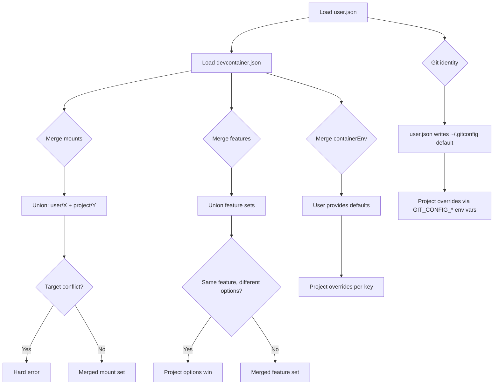

---
first_authored:
  by: "@claude-opus-4-6"
  at: 2026-03-24T14:30:00-07:00
task_list: lace/user-config-proposal
type: proposal
state: live
status: review_ready
tags: [lace, user_config, architecture, security, chezmoi]
last_reviewed:
  status: accepted
  by: "@claude-opus-4-6"
  at: 2026-03-24T20:15:00-07:00
  round: 4
---

# Lace User-Level Config

> BLUF(opus/user-config-proposal): Introduce `~/.config/lace/user.json` as a declarative user-level config file that specifies universal mounts, prebuild features, git identity, default shell, and shared directories across all lace projects.
> All user-declared mounts are enforced read-only (writable opt-in may be added in a future iteration).
> Mount paths are validated against a configurable mount policy (`~/.config/lace/mount-policy`) with a secure default denylist; users can add rules or `!`-prefixed exceptions.
> Git identity is written to a clean in-container `~/.gitconfig` by the fundamentals init script; projects can override via git's native `GIT_CONFIG_*` environment variables.
> User config merges with project config using "user provides defaults, project overrides" semantics.
> The mechanism subsumes three existing RFPs: git credential support, screenshot sharing, and parts of workspace system context.
>
> - **Research:** [cdocs/reports/2026-03-24-user-level-devcontainer-config-approaches.md](../reports/2026-03-24-user-level-devcontainer-config-approaches.md)
> - **Subsumes:** [git credential support RFP](2026-03-23-lace-git-credential-support.md), [screenshot sharing RFP](2026-03-24-lace-screenshot-sharing.md), parts of [workspace system context RFP](2026-03-24-workspace-system-context.md)

## Objective

Provide a single mechanism for lace users to declare personal configuration that applies to every lace-managed devcontainer.

The mechanism must:
1. Declare universal mounts (e.g., screenshots directory, shared notes) injected into all containers.
2. Declare universal prebuild features (e.g., neovim, nushell) added to every project.
3. Configure default git commit identity (user.name, user.email) without exposing credential helpers or SSH keys, with project-level override support.
4. Set a default shell preference.
5. Enforce security constraints: read-only mounts, configurable mount policy with secure defaults, no credential exposure.
6. Work seamlessly with chezmoi-managed dotfiles.
7. Integrate cleanly with lace's existing config resolution pipeline.

## Background

Lace preprocesses `devcontainer.json` files through a multi-phase pipeline: workspace layout detection, metadata fetch, template auto-injection, port allocation, mount resolution, prebuild, and config generation.
The current user-level config file (`~/.config/lace/settings.json`) serves a narrow purpose: overriding the host source paths for project-declared mounts.

Every time a user wants a personal tool or mount in their containers, they must either:
- Add it to every project's `devcontainer.json` (not portable, pollutes project config).
- Create a wrapper feature that declares the metadata (heavyweight for simple mounts).
- Manually modify the generated `.lace/devcontainer.json` (fragile, overwritten on next `lace up`).

This gap has produced five separate RFPs, each proposing a narrow solution for one instance of the same underlying problem.
The research report at [cdocs/reports/2026-03-24-user-level-devcontainer-config-approaches.md](../reports/2026-03-24-user-level-devcontainer-config-approaches.md) evaluates approaches and recommends a new config file.

### Existing pipeline integration points

The `runUp()` function in `packages/lace/src/lib/up.ts` (line 137) orchestrates these steps:

| Step | Line | Operation |
|------|------|-----------|
| Phase 0a | 178 | Workspace layout detection + auto-configuration |
| Phase 0b | 214 | Host-side validation |
| Step 1 | 270 | `fetchAllFeatureMetadata()`: fetch OCI metadata, validate options and ports |
| Step 2 | 335 | Warn about `${lace.port()}` in prebuildFeatures |
| Step 3 | 341 | Auto-inject `${lace.port()}` templates |
| Step 4 | 348 | Auto-inject mount templates via `extractProjectMountDeclarations()` |
| Step 4.5 | 356 | Deduplicate static mounts |
| Step 5 | 364 | Resolve container remote user for `${_REMOTE_USER}` |
| Step 5.5 | 378 | `validateMountNamespaces()` + `validateMountTargetConflicts()` |
| Step 6 | 414 | Warn about prebuild features with static ports |
| Step 7 | 424 | `loadSettings()` + create `MountPathResolver` |
| Step 7.5 | 438 | Validate `sourceMustBe` declarations |
| Step 8 | 474 | `resolveTemplates()`: port allocation, mount assignment |
| Post-8 | 538 | Inferred mount validation (missing bind-mount sources) |
| Prebuild | 597 | `runPrebuild()` (if configured) |
| Repo mounts | 621 | `runResolveMounts()` (if configured) |
| Generate | 647 | `generateExtendedConfig()`: emit `.lace/devcontainer.json` |
| Drift | 673 | Config drift detection |
| Up | 715 | `runDevcontainerUp()` |
| Verify | 745 | Post-container git verification |

User config must be loaded before Step 1 (feature metadata fetch needs user features) and before Step 4 (mount auto-injection needs user mounts in the declarations map).
The natural insertion point is between Phase 0b (line 243) and Step 1 (line 270).

### Current settings.json schema

```typescript
interface LaceSettings {
  repoMounts?: Record<string, RepoMountSettings>;
  mounts?: Record<string, MountOverrideSettings>;
}
```

This file answers "where on this host is the source for mount X?"
The new `user.json` answers "what mounts, features, and preferences do I always want?"

## Proposed Solution

### Config file: `~/.config/lace/user.json`

A new JSONC file at `~/.config/lace/user.json` declares user-level defaults.
Discovery follows the same pattern as `settings.json`: environment variable override (`LACE_USER_CONFIG`) with fallback to XDG path.

```jsonc
// NOTE: Example config
{
  // Universal mounts: injected into every lace container.
  // All user mounts are read-only. The "readonly" field is not configurable.
  "mounts": {
    "screenshots": {
      "source": "~/Pictures/Screenshots",
      "target": "/mnt/user/screenshots",
      "description": "Host screenshots for Claude Code image references"
    },
    "notes": {
      "source": "~/Documents/dev-notes",
      "target": "/mnt/user/notes",
      "description": "Shared development notes across projects"
    }
  },

  // Universal prebuild features: added to every project's feature set.
  // Only registry features (ghcr.io, mcr.microsoft.com) are allowed.
  // Local path features ("./features/...") are blocked for security.
  "features": {
    "ghcr.io/devcontainers-extra/features/neovim-homebrew:1": {},
    "ghcr.io/eitsupi/devcontainer-features/nushell:0": {}
  },

  // Git commit identity. Injected as containerEnv variables.
  // Does NOT mount .gitconfig (which may contain credential helpers).
  "git": {
    "name": "Jane Developer",
    "email": "jane@example.com"
  },

  // Default shell for the container remote user.
  // Project-level config can override this.
  "defaultShell": "/usr/bin/nu",

  // Additional environment variables injected into every container.
  // Project-level containerEnv overrides user-level on conflict.
  "containerEnv": {
    "EDITOR": "nvim",
    "VISUAL": "nvim"
  }
}
```

### Mount namespace and labeling

User mounts are prefixed with the `user/` namespace, mirroring the existing `project/` namespace for project-declared mounts.
The mount label `user/screenshots` is constructed from the key in the `mounts` object.

This integrates directly with the existing `MountPathResolver` and `validateMountNamespaces()` infrastructure.
The `user/` namespace is treated identically to `project/` for validation and conflict detection, with one exception: user mounts always have `readonly: true` forced, regardless of what the config says.

> NOTE(opus/user-config-proposal): Read-only is the initial security posture.
> A future iteration may introduce a `writable: true` opt-in per mount, but starting from maximum restriction is the correct default.
> Loosening is easier to justify than tightening after the fact.

### Security constraints

#### Read-only enforcement

All user-level mounts are read-only.
The `readonly` field is not present in the user mount schema: it is always `true`.
This is enforced in the mount spec generation code, not in the config file.

If a user needs writable access to a directory (e.g., shared build cache), that mount must be declared at the project level in `devcontainer.json` where the project maintainer has explicitly opted in.

#### Mount policy file

Before resolving mount sources, lace validates each user mount source against a mount policy.
The policy is a line-oriented file at `~/.config/lace/mount-policy` (override via `LACE_MOUNT_POLICY`).

Lace ships a default policy embedded in the binary.
If no user policy file exists, the default policy applies.
If a user policy file exists, it is merged with the default: user rules are appended after the default rules, so user rules take precedence (last match wins).

##### Policy file format

Each line is a rule.
Blank lines and lines starting with `#` are ignored.
Rules are evaluated top-to-bottom; the last matching rule wins.

| Syntax | Meaning |
|--------|---------|
| `~/.ssh` | Deny: block this path and everything under it (prefix match) |
| `~/.ssh/*` | Deny: block immediate children of `~/.ssh` |
| `~/.ssh/**` | Deny: block all descendants of `~/.ssh` (recursive glob) |
| `!~/.npmrc` | Allow exception: remove a previous deny for this exact path |
| `!~/remove/rule/*` | Allow exception: remove a previous deny matching this glob |
| `/var/run/docker.sock` | Deny: absolute paths are supported |

The `!`-prefix creates an allow exception that overrides a preceding deny.
This lets users punch holes in the default denylist for legitimate use cases without disabling protection entirely.

##### Default policy (shipped with lace)

```
# Lace default mount policy
# Protects credential stores and sensitive directories.
# Users can override in ~/.config/lace/mount-policy

# Home directory root: would bypass all other rules
~/

# SSH and GPG keys
~/.ssh
~/.gnupg
~/.gpg

# Cloud provider credentials
~/.aws
~/.kube
~/.config/gcloud
~/.azure

# Tool-specific credentials
~/.config/gh
~/.config/op
~/.docker
~/.npmrc
~/.netrc
~/.pypirc

# Secret stores
~/.local/share/keyrings
~/.password-store

# Docker socket
/var/run/docker.sock
/run/docker.sock
```

##### Example user policy file

```
# User overrides for mount policy
# These are appended after the default policy (last match wins).

# Allow .npmrc (I use it for read-only registry config, no tokens)
!~/.npmrc

# Block additional paths specific to my setup
~/secrets/*
~/work/credentials/**

# Allow a specific subdirectory under a denied path
!~/.config/gh/hosts.yml
```

##### Evaluation algorithm

```typescript
function evaluateMountPolicy(
  source: string,
  defaultRules: PolicyRule[],
  userRules: PolicyRule[]
): "allow" | "deny" {
  const allRules = [...defaultRules, ...userRules];
  let result: "allow" | "deny" = "allow";  // default: allow

  for (const rule of allRules) {
    if (matchesGlob(source, rule.pattern)) {
      result = rule.type;  // "allow" for !-prefixed, "deny" otherwise
    }
  }

  return result;
}
```

The glob matching uses the same globstar semantics as `.gitignore`: `*` matches within a path component, `**` matches across path components.
Exact paths (no glob characters) use path-aware prefix matching: `~/.ssh` blocks `~/.ssh`, `~/.ssh/config`, and `~/.ssh/keys/id_ed25519`, but does NOT match `~/.sshrc` or `~/.ssh-backup`.
The match requires the source path to be either exactly the rule path or to have a `/` separator immediately after the rule path prefix.

> NOTE(opus/user-config-proposal): The mount policy file is intentionally separate from `user.json`.
> Policy rules are line-oriented and benefit from comments; embedding them in JSON would be awkward.
> The separate file also allows the policy to be version-controlled independently from user preferences.

> NOTE(opus/user-config-proposal): The default policy is conservative.
> It blocks the most common credential stores.
> Project-level mounts are not subject to the user-mount policy because they are authored by the project maintainer, not injected from user config.

#### Symlink traversal

Mount source paths are resolved via `realpath()` before denylist checking.
This prevents a symlink at `~/innocent-dir` pointing to `~/.ssh/` from bypassing the denylist.
If `realpath()` fails (broken symlink, nonexistent path), the mount is skipped with a warning (same as missing source behavior).

> NOTE(opus/user-config-proposal): Symlink resolution does not protect against symlinks created inside the mounted directory after the container starts.
> This is an accepted risk: the mount is read-only, so the container cannot create new symlinks, and existing symlinks in user directories are the user's responsibility.

> NOTE(opus/user-config-proposal): The denylist is intentionally conservative.
> It blocks the most common credential stores.
> Project-level mounts are not subject to the user-mount denylist because they are authored by the project maintainer, not injected from user config.

#### Path scope

User mount sources can be any valid path on the host: paths under `$HOME` (using `~/` prefix) or absolute paths elsewhere (e.g., `/tmp/shared_data`, `/opt/datasets`).
The mount policy protects dangerous paths regardless of location.
The default policy blocks `/var/run/docker.sock` and `/run/docker.sock` as examples of non-home paths that are dangerous to mount.

#### Feature registry requirement

User-declared features must not be local paths.
Validation uses the existing `isLocalPath()` function in `feature-metadata.ts` (line 286), which blocks `./`, `../`, and absolute path prefixes.
Any feature ID that passes `isLocalPath()` is rejected in user config.
This prevents a compromised chezmoi-managed `user.json` from injecting arbitrary install scripts via local feature directories.

#### Git identity: user default with project override

Git identity is a two-layer system: `user.json` provides the default, projects can override.

##### Default identity from user.json

The `git` section in `user.json` provides the user's default identity.
At container start, the fundamentals feature's init script writes this identity into `~/.gitconfig` via `git config --global`:

```
[user]
    name = Jane Developer
    email = jane@example.com
```

This is the fallback identity for any project that does not specify its own.

##### Project-level override via git's `includeIf`

Git natively supports per-directory identity configuration via `includeIf` directives.
The fundamentals init script sets up a conditional include based on the workspace path:

```
[includeIf "gitdir:/workspaces/"]
    path = /workspaces/.gitconfig-work
```

Projects can override git identity by providing a `containerEnv` entry that sets `GIT_CONFIG_COUNT`, `GIT_CONFIG_KEY_*`, and `GIT_CONFIG_VALUE_*` environment variables.
These are git's native mechanism for injecting config at runtime without modifying files.

Example: a project that needs a work email:

```jsonc
// In the project's devcontainer.json
"containerEnv": {
  "GIT_CONFIG_COUNT": "2",
  "GIT_CONFIG_KEY_0": "user.name",
  "GIT_CONFIG_VALUE_0": "Jane Developer (Work)",
  "GIT_CONFIG_KEY_1": "user.email",
  "GIT_CONFIG_VALUE_1": "jane@bigcorp.com"
}
```

Git's `GIT_CONFIG_*` environment variables take precedence over `~/.gitconfig`, so the project identity overrides the user default without modifying any files.

##### Why not mount `~/.gitconfig`

Mounting `~/.gitconfig` from the host is risky:
- Host `.gitconfig` commonly contains `credential.helper` entries (e.g., `credential.helper=store`, `credential.helper=osxkeychain`).
- These credential helpers, if functional inside the container, grant push access to all configured remotes.
- Stripping dangerous config from `.gitconfig` is fragile: the format supports `includeIf` directives, multiple `[credential]` sections, and tool-specific extensions.
- `url.*.insteadOf` rewrites that redirect to authenticated endpoints.
- `gpg.program` and `user.signingkey` references.
- `sendemail.*` SMTP credentials.

The init script + `GIT_CONFIG_*` env var approach provides identity without any credential exposure.

##### Precedence chain for git identity

1. `user.json` `git` section: written to `~/.gitconfig` by the init script (lowest priority).
2. Project `containerEnv` with `GIT_CONFIG_*`: git reads these at runtime, overriding `~/.gitconfig`.
3. Repository-level `.gitconfig` (if present in the repo): overrides global config per git's native resolution.

> NOTE(opus/user-config-proposal): The `GIT_CONFIG_COUNT`/`GIT_CONFIG_KEY_*`/`GIT_CONFIG_VALUE_*` mechanism is supported since git 2.31 (March 2021).
> The fundamentals feature depends on `ghcr.io/devcontainers/features/git:1` which installs the latest git, so this is safe to rely on.

### Merge semantics with project config



Detailed merge rules:

| Config Type | Merge Behavior | Conflict Resolution |
|-------------|---------------|-------------------|
| `mounts` | Union of user and project mounts | Target path collision is a hard error |
| `features` | Union of user and project features | Same feature ID: project options override user options |
| `git` | User provides default identity | Project can override via `GIT_CONFIG_*` env vars in `containerEnv` |
| `defaultShell` | User provides default | Project `remoteUser` shell or explicit override takes precedence |
| `containerEnv` | User provides defaults | Project `containerEnv` overrides on per-key basis |

### Pipeline integration

User config is loaded in a new step inserted between Phase 0b (host validation, line 243) and Step 1 (feature metadata fetch, line 270):

```
Phase 0a: Workspace layout detection (line 178)
Phase 0b: Host validation (line 214)
Phase 0c: User config loading (NEW, inserted at ~line 245)
  1. Call loadUserConfig() to read ~/.config/lace/user.json
  2. Resolve and canonicalize mount source paths (realpath for symlink handling)
  3. Validate mount sources against mount policy (default + user rules)
  4. Validate feature references (reject local paths via isLocalPath())
  5. Merge user features into allRawFeatures (before fetchAllFeatureMetadata)
  6. Merge user mounts into mountDeclarations (before validateMountNamespaces)
  7. Inject git identity default into containerEnv (for init script consumption)
  8. Set defaultShell (if not overridden by project)
Step 1: fetchAllFeatureMetadata (now includes user features)
Step 4: Mount auto-injection (now includes user mounts in declarations)
Step 5.5: validateMountNamespaces (must accept "user" namespace, see below)
...remaining steps unchanged...
```

The key insight: user config is merged into the in-memory config object before the existing pipeline runs.
From the perspective of Step 1 onward, user features and mounts are indistinguishable from project-declared ones (except for the `user/` namespace prefix on mount labels).

#### Required modification to `validateMountNamespaces()`

The current implementation at `template-resolver.ts:329` constructs valid namespaces as:

```typescript
const validNamespaces = new Set(["project", ...featureShortIds]);
```

This must be extended to include `"user"`:

```typescript
const validNamespaces = new Set(["project", "user", ...featureShortIds]);
```

This is a one-line change.
The `user/` namespace is always valid regardless of whether `user.json` exists, because the namespace validator should not need to know about the user config loading phase.

#### User mount resolution path

User mounts go through `MountPathResolver` like project mounts.
This means user mount targets can contain container variables (e.g., `${_REMOTE_USER}`) and will be resolved at Step 5.
The difference from project mounts: missing user mount sources emit a warning and skip (tolerant of machine differences), whereas missing project mount sources are errors.

### File discovery

```typescript
function findUserConfig(): string | null {
  // 1. Environment variable override
  const envPath = process.env.LACE_USER_CONFIG;
  if (envPath) {
    const resolved = resolveSettingsPath(envPath);
    if (existsSync(resolved)) return resolved;
    throw new UserConfigError(
      `LACE_USER_CONFIG points to non-existent file: ${envPath}`
    );
  }

  // 2. XDG-compliant default
  const xdgPath = join(homedir(), ".config", "lace", "user.json");
  if (existsSync(xdgPath)) return xdgPath;

  return null;  // No user config is valid, all features are opt-in
}
```

The file is optional.
A missing `user.json` means no user-level config: lace behaves exactly as it does today.
This ensures backward compatibility.

### Chezmoi integration

Chezmoi manages `user.json` as a templated file:

```
# In chezmoi source state:
dot_config/lace/user.json.tmpl
```

```jsonc
// dot_config/lace/user.json.tmpl
{
  "mounts": {{ dict
    "screenshots" (dict
      "source" (ternary (eq .chezmoi.os "darwin") "~/Desktop/Screenshots" "~/Pictures/Screenshots")
      "target" "/mnt/user/screenshots"
      "description" (printf "%s screenshots" .chezmoi.os)
    ) | toJson }},
  "features": {
    "ghcr.io/devcontainers-extra/features/neovim-homebrew:1": {},
    "ghcr.io/eitsupi/devcontainer-features/nushell:0": {}
  },
  "git": {
    "name": {{ .name | toJson }},
    "email": {{ .email | toJson }}
  },
  "defaultShell": "/usr/bin/nu"
}
```

> NOTE(opus/user-config-proposal): The template uses chezmoi's `toJson` function and `ternary` for platform branching.
> This avoids the risk of conditional blocks producing invalid JSON when a platform case falls through without a default.

This pattern:
- Works on any machine where chezmoi is installed.
- Handles platform differences (screenshot paths, feature availability).
- Pulls identity from chezmoi's data file (`.chezmoi.toml`), avoiding hardcoded values.
- Does not require lace to know anything about chezmoi.

> NOTE(opus/user-config-proposal): Implementer: migrating the current lace developer setup to use `user.json` is a separate follow-up task.
> The migration involves creating a chezmoi template for `user.json` that replaces the ad-hoc mount and feature declarations in the current `devcontainer.json`.
> Coordinate with the fundamentals feature migration (Phase 4 of that proposal) to avoid a two-step transition.

## Important Design Decisions

### Decision 1: Separate file (`user.json`) rather than extending `settings.json`

`settings.json` answers "where on this machine are the sources for project-declared mounts?"
`user.json` answers "what mounts, features, and preferences do I always want?"

These are different concerns with different lifecycles:
- `settings.json` is machine-specific (different paths on laptop vs. workstation).
- `user.json` is portable across machines (same features, same identity, same preferences).

Mixing them creates confusion: is a mount entry an override for a project-declared mount, or a new mount to inject into every container?
The separate file makes intent unambiguous.

### Decision 2: Git identity via gitconfig + env vars, not `.gitconfig` mount

Mounting `~/.gitconfig` from the host carries unacceptable security risk: host gitconfig commonly contains `credential.helper`, `url.*.insteadOf`, and `gpg.program` entries that would grant the container push access or expose signing keys.

Instead, the fundamentals init script writes a clean `~/.gitconfig` inside the container with only `user.name` and `user.email` from `user.json`.
Projects that need a different identity use git's native `GIT_CONFIG_*` environment variables in their `containerEnv`, which override `~/.gitconfig` at runtime.
This provides a clean two-layer system: user default, project override, no credential exposure.

### Decision 3: Read-only enforcement as initial default

User mounts are read-only by default.
The `readonly` field is not present in the user mount schema for this initial implementation: it is always `true`.

The reasoning: user mounts are injected into every container without project-level review.
A writable user mount could allow a compromised container to modify host files silently.
Project-level mounts can be writable because they are explicitly declared per-project and reviewed by the project maintainer.

A future iteration may introduce a `writable: true` opt-in per mount for cases like shared build caches.
Starting from maximum restriction is the correct security posture: loosening a constraint is easier to justify than tightening one after adoption.

### Decision 4: User features are prebuild features

User-declared features are merged into the `prebuildFeatures` block, not the top-level `features` block.
This ensures they are baked into the prebuild image, avoiding repeated installation on container rebuild.

If a project has no `prebuildFeatures` configured, user features are added to the top-level `features` block instead.

### Decision 5: Mount target paths use `/mnt/user/` convention

User mounts target paths under `/mnt/user/` by convention.
This avoids collision with project mounts (which use project-specific paths like `/home/node/.claude`) and system paths.

The convention is documented but not enforced: users can target any path.
Target conflict validation catches collisions regardless of path prefix.

## Edge Cases / Challenging Scenarios

### User mount conflicts with project mount

If `user.json` declares a mount targeting `/home/node/.config/nvim` and the project's `devcontainer.json` also declares a mount at the same target, the existing `validateMountTargetConflicts()` function catches this.

Resolution: hard error with a message identifying both mounts.
The user must change their mount target or the project must adjust.

### User feature conflicts with project feature

If `user.json` declares `ghcr.io/devcontainers-extra/features/neovim-homebrew:1` and the project declares the same feature with different options, the project's options win.

This follows Docker Compose-style "most specific wins" precedent.
The user gets neovim, but with the project's preferred version/options.

### Missing mount source on host

If `user.json` declares a mount with `source: ~/Pictures/Screenshots` but that directory does not exist, lace emits a warning (not an error) and skips that mount.

Rationale: user config is portable across machines.
A macOS user's `~/Desktop/Screenshots` does not exist on Linux.
Skipping with a warning preserves the rest of the config.

> NOTE(opus/user-config-proposal): This differs from project-level mount behavior, where a missing source is an error.
> The asymmetry is intentional: user config must be tolerant of machine differences, project config must be strict.

### No user.json file

Entirely valid.
Lace behaves exactly as it does today.
The feature is fully opt-in.

### Feature already installed via prebuild

If a user feature is already present in the project's prebuild image (because the project declares it too), Docker's layer caching handles deduplication.
The feature's install script may run twice, but well-written features are idempotent.

Lace deduplicates at the config level: if the same feature ID appears in both user and project config, only one entry is emitted in the generated `devcontainer.json`.

### Chezmoi templating produces invalid JSON

If chezmoi generates malformed `user.json` (e.g., syntax error in template), lace reports a parse error with the file path.
The error message includes the JSONC parse error offset for debugging.

This is identical to how `settings.json` parse errors are handled today.

### Git identity vs explicit containerEnv conflict

If `user.json` declares both `"git": { "name": "Jane" }` and `"containerEnv": { "GIT_AUTHOR_NAME": "Different" }`, the `git` section controls `~/.gitconfig` (via `LACE_GIT_NAME`/`LACE_GIT_EMAIL`), while the explicit `GIT_AUTHOR_NAME` env var takes effect at git runtime (env vars override gitconfig).
This is a user error: the `git` section should be the single source for default identity.
Lace emits a warning when `user.json` `containerEnv` sets `GIT_AUTHOR_NAME`, `GIT_AUTHOR_EMAIL`, `GIT_COMMITTER_NAME`, or `GIT_COMMITTER_EMAIL`, since these would bypass the two-layer identity system.

### containerEnv precedence chain

Git identity precedence (lowest to highest priority):

1. `~/.gitconfig` `user.name`/`user.email` (written by init script from `LACE_GIT_NAME`/`LACE_GIT_EMAIL`): the user's default identity.
2. Project `GIT_CONFIG_*` env vars (from project `containerEnv`): override gitconfig per-key.
3. Explicit `GIT_AUTHOR_NAME`/`GIT_COMMITTER_NAME` env vars (if set): override everything. Should not normally be set in `user.json` containerEnv.

General containerEnv precedence:

1. User `containerEnv` (from `user.json`): general env vars for the container.
2. `LACE_GIT_NAME`/`LACE_GIT_EMAIL` (injected by lace from `user.json` `git` section): read by init script, not by git.
3. Project `containerEnv` (from `devcontainer.json`): overwrites user values per-key.
4. Lace auto-injected vars (`CONTAINER_WORKSPACE_FOLDER`, `LACE_PROJECT_NAME`): only set if not already present.

### Denied mount source in user config

If `user.json` declares a mount with `source: ~/.ssh/config`, lace emits a hard error:

```
User mount "user/ssh-config" blocked: source "~/.ssh/config" matches
mount policy rule "~/.ssh". User mounts cannot access credential directories.
To allow this path, add "!~/.ssh/config" to ~/.config/lace/mount-policy.
```

The error identifies the specific policy rule that matched and suggests the override syntax.

## Test Plan

### Unit tests

1. **User config loading** (`user-config.test.ts`):
   - Load valid `user.json` with all fields.
   - Load `user.json` with only some fields (mounts only, features only, git only).
   - Handle missing `user.json` (returns empty config).
   - Handle malformed `user.json` (throws `UserConfigError`).
   - Honor `LACE_USER_CONFIG` environment variable.
   - Error when `LACE_USER_CONFIG` points to nonexistent file.

2. **Mount policy validation** (`user-config.test.ts`):
   - Default policy blocks `~/.ssh`, `~/.ssh/config`, `~/.ssh/known_hosts`.
   - Default policy blocks `~/.gnupg`, `~/.aws`, `~/.kube`, `~/.config/gcloud`.
   - Default policy blocks `~/.netrc`, `~/.local/share/keyrings`, `~/.password-store`, `~/.config/op`.
   - Default policy blocks `/var/run/docker.sock`.
   - Default policy blocks `~/` (home directory root mount).
   - Default policy allows `~/Documents`, `~/Pictures/Screenshots`, `~/.config/nvim`.
   - Allow absolute paths outside `$HOME` (e.g., `/tmp/shared_data`).
   - User `!`-prefixed exception overrides default deny (e.g., `!~/.npmrc` allows it).
   - User deny rule blocks additional paths.
   - Last-match-wins semantics: user allow after default deny works, user deny after user allow works.

3. **Security: symlink traversal** (`user-config.test.ts`):
   - Symlink `~/innocent` -> `~/.ssh/`: blocked after `realpath()`.
   - Symlink `~/link` -> `~/.gnupg/keys/`: blocked after `realpath()`.
   - Broken symlink: skipped with warning (same as missing source).
   - Non-symlink path: passes through unchanged.

4. **Security: path canonicalization** (`user-config.test.ts`):
   - `~/.ssh/../.ssh/` normalizes to `~/.ssh/`: blocked.
   - `~/./Documents/../.ssh/` normalizes to `~/.ssh/`: blocked.
   - Case sensitivity: `~/.SSH/` is not blocked on case-sensitive filesystems (accepted risk, documented).

5. **Feature registry validation** (`user-config.test.ts`):
   - Allow `ghcr.io/...`, `mcr.microsoft.com/...`, other registry-hosted features.
   - Block `./features/...`, `../features/...`, `/absolute/path/...` (via `isLocalPath()`).

6. **Merge semantics** (`user-config-merge.test.ts`):
   - Mount union with no conflicts.
   - Mount target conflict raises error.
   - Feature union with no conflicts.
   - Feature option conflict: project wins.
   - ContainerEnv precedence chain: user env < project env < auto-injected env.
   - Git identity: user provides default, project overrides via `GIT_CONFIG_*`.
   - Git identity vs explicit user containerEnv conflict emits warning.
   - `user/` and `project/` mounts with same suffix but different targets: no conflict.

7. **Mount spec generation** (`user-config-mount.test.ts`):
   - All user mounts have `readonly` in their spec string.
   - Mount sources are tilde-expanded.
   - Mount labels are prefixed with `user/`.

8. **Namespace validation** (`template-resolver.test.ts`):
   - `validateMountNamespaces()` accepts `user/screenshots`, `user/notes`.
   - `validateMountNamespaces()` still rejects `unknown/mount`.

### Integration tests

1. **Pipeline integration** (`up.integration.test.ts`):
   - `lace up` with `user.json` containing mounts: mounts appear in generated config.
   - `lace up` with `user.json` containing features: features appear in generated config.
   - `lace up` with `user.json` containing git identity: env vars appear in `containerEnv`.
   - `lace up` without `user.json`: identical behavior to current.
   - `lace up` with denied mount source: exits with error.

2. **Scenario tests**:
   - Full scenario: user config with mounts + features + git + shell, merged with a project that has its own mounts and features.
   - Conflict scenario: user mount and project mount targeting the same path.

### Manual verification

1. Create a `user.json` with a screenshots mount and neovim feature.
2. Run `lace up` on the lace project.
3. Verify the generated `.lace/devcontainer.json` contains the user mount and feature.
4. Verify the mount is read-only in the Docker mount spec.
5. Verify `git config user.name` and `git config user.email` inside the container return the values from `user.json`.
6. Verify `nvim --version` works inside the container (user feature installed).

## Verification Methodology

The implementer should use the existing test infrastructure (`vitest` with scenario helpers).
Each phase should be verified by:

1. Running the relevant unit test suite after implementation.
2. Running integration tests that exercise the full pipeline.
3. For the final phase, performing a manual `lace up` cycle to verify end-to-end behavior.

The generated `.lace/devcontainer.json` is the primary artifact to inspect: it should contain all user-declared mounts, features, and environment variables merged with project config.

## Implementation Phases

### Phase 1: User config types and loading

Create `packages/lace/src/lib/user-config.ts` with:

- `UserConfig` interface:
  ```typescript
  interface UserMountDeclaration {
    source: string;
    target: string;
    description?: string;
  }

  interface UserGitIdentity {
    name: string;
    email: string;
  }

  interface UserConfig {
    mounts?: Record<string, UserMountDeclaration>;
    features?: Record<string, Record<string, unknown>>;
    git?: UserGitIdentity;
    defaultShell?: string;
    containerEnv?: Record<string, string>;
  }
  ```
- `findUserConfig()`: discovery with `LACE_USER_CONFIG` env var fallback to XDG path.
- `readUserConfig()`: JSONC parse with error handling (same pattern as `readSettingsConfig()`).
- `loadUserConfig()`: convenience wrapper (find + read, returns empty on missing).

Unit tests: loading, missing file, malformed file, env var override.

**Success criteria:** `loadUserConfig()` returns a typed config object or empty object.

### Phase 2: Security validation

Add to `user-config.ts`:

- `loadMountPolicy()`: read the default policy (embedded) and user policy file (`~/.config/lace/mount-policy`), merge them.
- `evaluateMountPolicy()`: evaluate a source path against the merged policy rules (last match wins).
- `validateMountSources()`: check each mount source against the mount policy.
- `validateFeatureReferences()`: check each feature reference is a registry path, not a local path.
- `DEFAULT_MOUNT_POLICY` constant with the default policy rules.

Unit tests: all default policy entries, user overrides, allow exceptions, glob matching, last-match-wins semantics.

**Success criteria:** invalid mounts and features are rejected with clear error messages that include the matching rule and override instructions.

### Phase 3: Merge logic

Create `packages/lace/src/lib/user-config-merge.ts` with:

- `mergeUserMounts()`: convert user mounts to `LaceMountDeclaration` entries with `user/` namespace prefix and forced `readonly: true`.
- `mergeUserFeatures()`: merge user features into the feature set, with project options taking precedence on conflict.
- `mergeUserContainerEnv()`: merge user env vars as defaults under project overrides.
- `mergeUserGitIdentity()`: store the git identity values for the `lace-fundamentals-init` script to write to `~/.gitconfig` at container start. Does NOT inject `GIT_AUTHOR_NAME`/`GIT_AUTHOR_EMAIL` as containerEnv (those env vars would override both `~/.gitconfig` and project-level `GIT_CONFIG_*` overrides, breaking the two-layer identity system). Instead, the identity is passed to the init script via `LACE_GIT_NAME`/`LACE_GIT_EMAIL` containerEnv variables, which the init script reads to write `~/.gitconfig` and which are not recognized by git itself.

Unit tests: all merge scenarios from the test plan.

**Success criteria:** merge functions produce correct output for union, conflict, and override cases.

### Phase 4: Pipeline integration

Modify `packages/lace/src/lib/up.ts`:

- Import user config loading and merge functions.
- Insert Phase 0c after host validation:
  1. Call `loadUserConfig()`.
  2. Call `validateMountSources()` and `validateFeatureReferences()`.
  3. Merge user mounts into `mountDeclarations` via `mergeUserMounts()`.
  4. Merge user features into the appropriate feature block.
  5. Merge git identity and containerEnv.
- User mounts that reference missing source directories emit a warning and are skipped (tolerant of machine differences).

Integration tests: pipeline with and without user config.

**Constraints:**
- Do not modify `settings.ts` (settings.json semantics are unchanged).
- Do not modify mount resolution logic in `mount-resolver.ts` or template resolution logic in `template-resolver.ts`, but DO update `validateMountNamespaces()` in `template-resolver.ts` to include `"user"` in the valid namespace set.
- Do not modify `feature-metadata.ts` (user features are resolved through the existing metadata fetch pipeline). Reuse `isLocalPath()` from `feature-metadata.ts` for feature validation.

**Success criteria:** `lace up` with a `user.json` produces a generated config containing user mounts, features, and env vars.

### Phase 5: Documentation and chezmoi example

- Add a `user.json` schema description to the lace README or CONTRIBUTING docs.
- Add a chezmoi template example showing platform-aware `user.json` generation.
- Update any relevant CLAUDE.md sections to mention user config.
- Update the git credential support RFP to reference this proposal as the implementation path.
- Update the screenshot sharing RFP to reference this proposal.

**Success criteria:** a new user can set up `user.json` from documentation alone.

## Open Questions

1. **Should `user.json` support `repoMounts`?** The existing `settings.json` handles repo mount overrides. Should user config also be able to declare repos that are always cloned and mounted? This adds complexity and has unclear use cases.

2. **Should `defaultShell` set the login shell or just `SHELL` env var?** Setting the login shell requires `chsh` inside the container (which may need root). Setting `SHELL` is simpler but not all tools respect it. A lifecycle hook might be needed.

3. **How should `lace status` surface user config?** The `lace status` command should probably show which user mounts and features are active. The display format needs design.

4. **Should there be a `lace user init` command?** An interactive command that generates a starter `user.json` with common defaults would reduce onboarding friction. This could be a follow-up feature.

5. **File extension: `.json` or `.jsonc`?** The file is parsed as JSONC (comments allowed), but the `.json` extension may confuse editors that don't recognize JSONC. Using `.jsonc` would be more explicit, but deviates from the `settings.json` convention. Recommendation: keep `.json` and document that JSONC parsing is used (matching `devcontainer.json` precedent, which is also JSONC with a `.json` extension).
