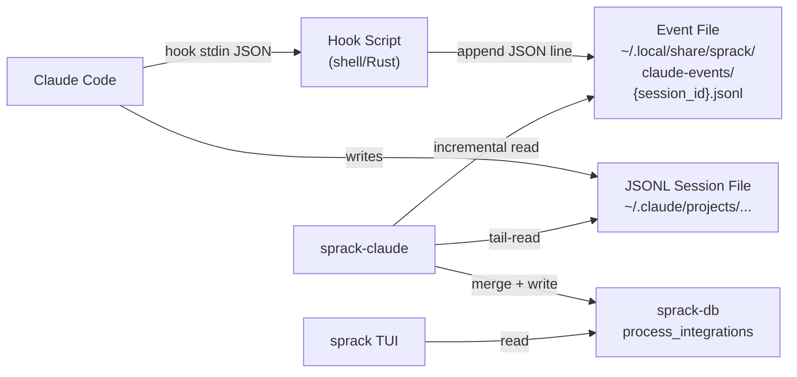

---
first_authored:
  by: "@claude-opus-4-6"
  at: 2026-03-24T20:00:00-07:00
task_list: terminal-management/sprack-hook-bridge
type: proposal
state: live
status: wip
tags: [sprack, claude_code, hooks, architecture, data_bridge]
last_reviewed:
  status: revision_requested
  by: "@claude-opus-4-6"
  at: 2026-03-24T21:30:00-07:00
  round: 1
---

# Sprack Hook Event Bridge

> BLUF: A lightweight hook command script captures seven Claude Code lifecycle events (SessionStart, PostToolUse, SubagentStart, SubagentStop, TaskCompleted, PostCompact, SessionEnd) and appends structured JSON lines to per-session event files at `~/.local/share/sprack/claude-events/<session_id>.jsonl`.
> A corresponding event reader in sprack-claude merges these events into an extended `ClaudeSummary` with task list progress, session purpose, and subagent lifecycle data.
> The hook bridge supplements (not replaces) JSONL tail-reading: hooks provide metadata that JSONL cannot, while JSONL provides real-time activity state (thinking/tool_use/idle) and context usage that hooks do not carry.
> Graceful fallback: when hooks are not configured, sprack-claude operates identically to the current JSONL-only mode.

## Problem Statement

sprack-claude's current data source is a single JSONL tail-reader that reverse-engineers Claude Code's internal session file format.
This approach provides basic activity state, context usage percentage, model name, and last tool used, but cannot provide three categories of high-value data:

1. **Task list progress.**
   Claude Code maintains a task list (via `TaskCreate`, `TaskUpdate`, and `TaskCompleted` internal operations) that tracks the work plan for a session.
   The JSONL file contains task operations as `tool_use`/`tool_result` pairs, but extracting structured task state requires parsing JSON-within-JSON, tracking create/update/complete transitions across the full session, and correlating task IDs.
   Hooks provide this data directly: `TaskCompleted` fires with `task_id`, `task_subject`, and `task_description`, and filtered `PostToolUse` events capture the full task lifecycle.

2. **Session purpose and summary.**
   The JSONL file has no summary field.
   Determining what a Claude session is doing requires reading the full conversation and performing semantic extraction.
   Hooks provide this via `PostCompact`, which fires after context compaction and carries `compact_summary`: a one-paragraph description of the session's work.

3. **Subagent lifecycle with identity.**
   The JSONL file contains `agent_progress` entries that allow counting active subagents by distinct `toolUseID`, but provides no information about subagent type or completion status.
   `SubagentStart` and `SubagentStop` hooks carry `agent_id` and `agent_type`, enabling the TUI to display what kind of subagent is running and when it finishes.

Additionally, hooks provide `session_id` and `cwd` directly on every event, eliminating the fragile `/proc`-based session discovery chain that walks process trees and depends on undocumented path-encoding schemes.
The [plugin analysis report](../reports/2026-03-24-sprack-claude-code-plugin-analysis.md) evaluated MCP servers, skills, and hooks as data bridge mechanisms; hooks were recommended as the highest-leverage approach.

## Architecture

The bridge consists of three components: a hook command script that writes events, a per-session JSONL event file that stores them, and an event reader in sprack-claude that consumes them.



### Hook Command Script

A shell script (or small Rust binary) registered as a `command` hook handler.
Claude Code invokes it as a subprocess on each configured hook event, passing the event JSON on stdin.
The script reads stdin, extracts the relevant fields, and appends a single JSON line to the session's event file.

The script is intentionally minimal: read, extract, append.
No network calls, no database writes, no complex logic.
File append is O(1) and completes in under 10ms, well within Claude Code's hook timeout budgets.

> NOTE(opus/sprack-hook-bridge): `PostToolUse` fires on every tool call (potentially hundreds per session).
> The hook script filters early: it only writes an event line when `tool_name` matches `TaskCreate` or `TaskUpdate`.
> Unfiltered `PostToolUse` would produce thousands of events and add latency to every tool call.
> All other hook events (SessionStart, SubagentStart, etc.) fire infrequently and are always written.

### Event File Format

One JSONL file per session at `~/.local/share/sprack/claude-events/<session_id>.jsonl`.
The directory is created on first write.
Files are append-only during a session.

Each line is a JSON object with a common envelope:

```json
{
  "ts": "2026-03-24T20:15:00Z",
  "event": "TaskCompleted",
  "session_id": "abc-123",
  "cwd": "/workspaces/lace/main",
  "data": { ... }
}
```

- `ts`: ISO 8601 UTC timestamp, set by the hook script at write time.
- `event`: the hook event name (one of the seven captured events).
- `session_id`: from the hook input's `session_id` field.
- `cwd`: from the hook input's `cwd` field.
- `data`: event-specific payload (defined in the Data Model section).

### Event Reader in sprack-claude

A new `events.rs` module reads event files using the same byte-offset incremental-read pattern as the existing JSONL reader in `jsonl.rs`.
On each poll cycle, the reader:

1. Checks whether an event file exists for the current session's `session_id` (if known) or scans the event directory for files matching the pane's `cwd`.
2. Reads new bytes from the last-known offset.
3. Parses each new JSON line into a typed `HookEvent` struct.
4. Merges the parsed events into the `ClaudeSummary` being built for this pane.

The reader maintains its own byte offset per event file, independent of the JSONL reader's offset.

### ClaudeSummary Extensions

The `ClaudeSummary` struct in `status.rs` gains three new optional fields:

```rust
pub struct ClaudeSummary {
    // Existing fields:
    pub state: String,
    pub model: Option<String>,
    pub subagent_count: u32,
    pub context_percent: u8,
    pub last_tool: Option<String>,
    pub error_message: Option<String>,
    pub last_activity: Option<String>,
    // New fields from hook events:
    pub tasks: Option<Vec<TaskEntry>>,
    pub session_summary: Option<String>,
    pub session_purpose: Option<String>,
}

pub struct TaskEntry {
    pub task_id: String,
    pub subject: String,
    pub description: Option<String>,
    pub status: TaskStatus,
}

pub enum TaskStatus {
    Created,
    InProgress,
    Completed,
}
```

All new fields are `Option` types and default to `None` via `serde(default)`.
Existing TUI code that deserializes `ClaudeSummary` is unaffected: unknown fields are ignored by default, and missing optional fields deserialize as `None`.

### Hook Configuration Template

A `.claude/settings.local.json` template configures Claude Code to invoke the hook script:

```json
{
  "hooks": {
    "SessionStart": [
      {
        "type": "command",
        "command": "~/.local/share/sprack/hooks/sprack-hook-bridge"
      }
    ],
    "PostToolUse": [
      {
        "type": "command",
        "command": "~/.local/share/sprack/hooks/sprack-hook-bridge"
      }
    ],
    "SubagentStart": [
      {
        "type": "command",
        "command": "~/.local/share/sprack/hooks/sprack-hook-bridge"
      }
    ],
    "SubagentStop": [
      {
        "type": "command",
        "command": "~/.local/share/sprack/hooks/sprack-hook-bridge"
      }
    ],
    "TaskCompleted": [
      {
        "type": "command",
        "command": "~/.local/share/sprack/hooks/sprack-hook-bridge"
      }
    ],
    "PostCompact": [
      {
        "type": "command",
        "command": "~/.local/share/sprack/hooks/sprack-hook-bridge"
      }
    ],
    "SessionEnd": [
      {
        "type": "command",
        "command": "~/.local/share/sprack/hooks/sprack-hook-bridge"
      }
    ]
  }
}
```

> NOTE(opus/sprack-hook-bridge): The hook script path uses `~/.local/share/sprack/hooks/` to keep sprack assets under a single XDG data directory.
> A lace devcontainer feature can drop the script into this path during container creation.
> The `.claude/settings.local.json` file is gitignored, so hook configuration does not impose on other contributors.

## Data Model

### Common Envelope

Every event line shares this envelope structure:

| Field | Type | Description |
|-------|------|-------------|
| `ts` | string (ISO 8601 UTC) | Timestamp when the hook script wrote the event |
| `event` | string | Hook event name |
| `session_id` | string | Claude Code session UUID |
| `cwd` | string | Working directory of the Claude Code session |
| `data` | object | Event-specific payload |

### SessionStart

Fires when a session begins, resumes, clears, or compacts.

```json
{
  "ts": "2026-03-24T20:00:00Z",
  "event": "SessionStart",
  "session_id": "abc-123",
  "cwd": "/workspaces/lace/main",
  "data": {
    "model": "claude-opus-4-6",
    "transcript_path": "/home/node/.claude/projects/-workspaces-lace-main/abc-123.jsonl"
  }
}
```

| data field | Type | Source | Purpose |
|------------|------|--------|---------|
| `model` | string | `hook_input.model` | Initial model; may change mid-session |
| `transcript_path` | string | `hook_input.transcript_path` | Direct path to JSONL file, bypassing `/proc` discovery |

### PostToolUse (filtered)

Fires after every tool call, but the hook script only writes events for `TaskCreate` and `TaskUpdate` tool names.

```json
{
  "ts": "2026-03-24T20:05:00Z",
  "event": "PostToolUse",
  "session_id": "abc-123",
  "cwd": "/workspaces/lace/main",
  "data": {
    "tool_name": "TaskCreate",
    "tool_input": {
      "subject": "Implement hook bridge",
      "description": "Create the hook script and event reader"
    },
    "tool_response": {
      "task_id": "task_001",
      "status": "created"
    }
  }
}
```

| data field | Type | Source | Purpose |
|------------|------|--------|---------|
| `tool_name` | string | `hook_input.tool_name` | Always `TaskCreate` or `TaskUpdate` (filtered) |
| `tool_input` | object | `hook_input.tool_input` | Task subject and description |
| `tool_response` | object | `hook_input.tool_response` | Task ID and new status |

> WARN(opus/sprack-hook-bridge): `tool_input` and `tool_response` may contain sensitive data for non-task tools.
> Because the hook script filters to only `TaskCreate`/`TaskUpdate`, the risk is limited to task descriptions, which are non-sensitive operational metadata.
> If the filter list is expanded to other tools in the future, the redaction question must be revisited.

### TaskCompleted

Fires when Claude marks a task as complete.

```json
{
  "ts": "2026-03-24T20:10:00Z",
  "event": "TaskCompleted",
  "session_id": "abc-123",
  "cwd": "/workspaces/lace/main",
  "data": {
    "task_id": "task_001",
    "task_subject": "Implement hook bridge",
    "task_description": "Create the hook script and event reader"
  }
}
```

| data field | Type | Source | Purpose |
|------------|------|--------|---------|
| `task_id` | string | `hook_input.task_id` | Correlates with task lifecycle |
| `task_subject` | string | `hook_input.task_subject` | Short task name |
| `task_description` | string (optional) | `hook_input.task_description` | Longer description |

### SubagentStart

Fires when a subagent is spawned.

```json
{
  "ts": "2026-03-24T20:06:00Z",
  "event": "SubagentStart",
  "session_id": "abc-123",
  "cwd": "/workspaces/lace/main",
  "data": {
    "agent_id": "agent_001",
    "agent_type": "triage"
  }
}
```

| data field | Type | Source | Purpose |
|------------|------|--------|---------|
| `agent_id` | string | `hook_input.agent_id` | Unique subagent identifier |
| `agent_type` | string | `hook_input.agent_type` | Subagent kind (e.g., "triage", "reviewer") |

### SubagentStop

Fires when a subagent finishes.

```json
{
  "ts": "2026-03-24T20:08:00Z",
  "event": "SubagentStop",
  "session_id": "abc-123",
  "cwd": "/workspaces/lace/main",
  "data": {
    "agent_id": "agent_001",
    "agent_type": "triage",
    "last_assistant_message": "Triage complete: 3 documents processed."
  }
}
```

| data field | Type | Source | Purpose |
|------------|------|--------|---------|
| `agent_id` | string | `hook_input.agent_id` | Correlates with SubagentStart |
| `agent_type` | string | `hook_input.agent_type` | Subagent kind |
| `last_assistant_message` | string (optional) | `hook_input.last_assistant_message` | Final output; useful for subagent status display |

### PostCompact

Fires after context compaction.

```json
{
  "ts": "2026-03-24T20:15:00Z",
  "event": "PostCompact",
  "session_id": "abc-123",
  "cwd": "/workspaces/lace/main",
  "data": {
    "compact_summary": "Implementing sprack hook event bridge: hook script writes events to per-session JSONL files, event reader in sprack-claude merges into ClaudeSummary."
  }
}
```

| data field | Type | Source | Purpose |
|------------|------|--------|---------|
| `compact_summary` | string | `hook_input.compact_summary` | One-paragraph session description |

### SessionEnd

Fires when a session terminates.

```json
{
  "ts": "2026-03-24T21:00:00Z",
  "event": "SessionEnd",
  "session_id": "abc-123",
  "cwd": "/workspaces/lace/main",
  "data": {
    "reason": "user_exit"
  }
}
```

| data field | Type | Source | Purpose |
|------------|------|--------|---------|
| `reason` | string | `hook_input.reason` | Termination reason |

## Integration Points

### Integration with sprack-claude's Poll Loop

The event reader runs alongside the existing JSONL tail-reader in `run_poll_cycle`.
The modified cycle:

```
run_poll_cycle:
  1. find_claude_panes()              # unchanged
  2. for each pane:
     a. resolve pane to session file  # unchanged (or via hook SessionStart cwd)
     b. tail-read/incremental-read JSONL session file  # unchanged
     c. read new hook events from event file            # NEW
     d. build_summary() from JSONL entries              # unchanged
     e. merge_hook_events() into summary                # NEW
     f. write_integration()                             # unchanged
  3. clean_stale_integrations()       # unchanged
```

The JSONL reader provides the base `ClaudeSummary` (state, model, context_percent, last_tool, subagent_count, last_activity).
The event reader overlays task list, session summary, session purpose, and refined subagent data onto the same summary struct.

Event file lookup uses two strategies:
- If a `SessionStart` event has been seen, the event reader knows the `session_id` and reads `~/.local/share/sprack/claude-events/<session_id>.jsonl` directly.
- If no `SessionStart` has been seen yet, the reader scans all event files in the directory for one whose `cwd` matches the pane's resolved working directory and whose last modification time is recent.

### Integration with Inline Summaries (Phase 2A)

The [inline summaries proposal](2026-03-24-sprack-inline-summaries.md) defines a multi-line rich Claude widget that renders at wide/full tiers.
Lines 2-4 of the widget consume hook-derived data:

| Widget Line | Data Source | ClaudeSummary Field |
|-------------|------------|-------------------|
| Line 1: status + context | JSONL reader | `state`, `context_percent`, `subagent_count` |
| Line 2: task progress | Hook: TaskCompleted, PostToolUse | `tasks` |
| Line 3: tool stats + model | JSONL reader + session cache | `last_tool`, `model` |
| Line 4: session purpose | Hook: PostCompact | `session_summary` or `session_purpose` |

When `tasks` is `None` (hooks not configured), lines 2-4 are omitted and the widget falls back to single-line mode.
This fallback is the design contract between the hook bridge and the inline summaries proposal.

### Complementarity with JSONL Tail-Reading

Hooks and JSONL serve complementary roles.
Neither is a replacement for the other.

| Data Point | JSONL | Hooks |
|-----------|-------|-------|
| Activity state (thinking/tool_use/idle) | Direct: `stop_reason` on last entry | Not available in real-time |
| Context usage (%) | Direct: `usage` on assistant entries | Not in hook input data |
| Model name | Direct: `message.model` | Available in `SessionStart` only |
| Task list state | Requires complex parsing | Direct: `TaskCompleted`, filtered `PostToolUse` |
| Session purpose/summary | Not available | Direct: `PostCompact.compact_summary` |
| Subagent lifecycle with type | Count only (from `agent_progress`) | Direct: `SubagentStart`/`SubagentStop` with `agent_type` |
| Workspace path | Must derive via `/proc/cwd` | Direct: `cwd` on all events |
| Custom title | Available as entry type | Not in hook input data |

The JSONL reader remains the primary source for real-time state because activity state changes multiple times per second during active generation, and the JSONL tail-reader captures this with 2-second polling granularity.
Hooks fire only on discrete events, not on continuous thinking/generating state transitions.

### Graceful Fallback

When hooks are not configured:
- No event files exist in `~/.local/share/sprack/claude-events/`.
- The event reader returns empty results.
- `ClaudeSummary` has `tasks: None`, `session_summary: None`, `session_purpose: None`.
- The TUI renders single-line inline suffixes (current behavior).
- No errors, no warnings, no degraded state indicators.

This is the critical design requirement: the hook bridge is purely additive.

### Integration with Session Cache

The [incremental session cache proposal](2026-03-24-sprack-claude-incremental-session-cache.md) introduces `session-cache.db` with byte-offset tracking for JSONL ingestion.
The hook event reader uses the same incremental-read pattern but tracks its state independently.

Three options for hook event state storage:

1. **In-memory only (recommended for Phase 1)**: maintain hook event state in a per-pane HashMap, re-read event files from byte offset 0 on sprack-claude restart. Event files are small (typically under 50KB for a full session), so the restart cost is negligible.

2. **Shared `session-cache.db`**: add `hook_ingestion_state` and `hook_events` tables alongside JSONL tables. Pros: single database, atomic reads across both data sources. Cons: couples two ingestion pipelines.

3. **Separate `claude-events.db`**: dedicated database for hook event state. Pros: independent lifecycle, failure isolation. Cons: extra connection to manage.

> NOTE(opus/sprack-hook-bridge): In-memory state is sufficient because the event file is the source of truth and is small enough to re-read quickly.
> If the session cache proposal lands first, migrating to shared `session-cache.db` storage is straightforward: add an `event_ingestion_state` table using the same schema pattern as `ingestion_state`.

### Integration with Process Host Awareness

The [process host awareness proposal](2026-03-24-sprack-process-host-awareness.md) defines `PaneResolver` with `LocalResolver` and `LaceContainerResolver` for session file discovery.
Hook events provide a third resolution strategy: the `SessionStart` event carries `session_id`, `cwd`, and `transcript_path` directly.

For hook-enabled sessions, the resolver can:
- Match `cwd` against the tmux pane's `current_path` to associate the event file with the correct pane.
- Use `transcript_path` to locate the JSONL session file without `/proc` walking or bind-mount enumeration.

A `HookResolver` implementation of `PaneResolver` is a natural follow-on, with priority order: `HookResolver` (if event file exists for matching cwd) > `LaceContainerResolver` (if lace metadata present) > `LocalResolver` (proc walk fallback).

> TODO(opus/sprack-hook-bridge): Define the startup race handling for `HookResolver`.
> A pane may be visible in tmux before Claude Code fires its first `SessionStart` hook.
> During this window, the resolver falls back to `LaceContainerResolver` or `LocalResolver`.

## Hook Script Implementation

### Shell Script (Recommended for Phase 1)

```bash
#!/bin/bash
# sprack-hook-bridge: Claude Code hook command handler
# Reads hook event JSON from stdin, extracts relevant fields,
# appends a structured event line to the per-session event file.

set -euo pipefail

EVENT_DIR="${SPRACK_EVENT_DIR:-$HOME/.local/share/sprack/claude-events}"

# Read stdin into a variable (hook input is a single JSON object).
INPUT=$(cat)

# Extract common fields.
EVENT_NAME=$(echo "$INPUT" | jq -r '.hook_event_name // empty')
SESSION_ID=$(echo "$INPUT" | jq -r '.session_id // empty')
CWD=$(echo "$INPUT" | jq -r '.cwd // empty')

# Bail if required fields are missing.
if [ -z "$SESSION_ID" ] || [ -z "$EVENT_NAME" ]; then
  exit 0
fi

# PostToolUse: filter to task-related tools only.
if [ "$EVENT_NAME" = "PostToolUse" ]; then
  TOOL_NAME=$(echo "$INPUT" | jq -r '.tool_name // empty')
  case "$TOOL_NAME" in
    TaskCreate|TaskUpdate) ;;
    *) exit 0 ;;
  esac
fi

# Build the event-specific data payload.
case "$EVENT_NAME" in
  SessionStart)
    DATA=$(echo "$INPUT" | jq -c '{
      model: .model,
      transcript_path: .transcript_path
    }')
    ;;
  PostToolUse)
    DATA=$(echo "$INPUT" | jq -c '{
      tool_name: .tool_name,
      tool_input: .tool_input,
      tool_response: .tool_response
    }')
    ;;
  TaskCompleted)
    DATA=$(echo "$INPUT" | jq -c '{
      task_id: .task_id,
      task_subject: .task_subject,
      task_description: .task_description
    }')
    ;;
  SubagentStart|SubagentStop)
    DATA=$(echo "$INPUT" | jq -c '{
      agent_id: .agent_id,
      agent_type: .agent_type,
      last_assistant_message: .last_assistant_message
    }')
    ;;
  PostCompact)
    DATA=$(echo "$INPUT" | jq -c '{
      compact_summary: .compact_summary
    }')
    ;;
  SessionEnd)
    DATA=$(echo "$INPUT" | jq -c '{
      reason: .reason
    }')
    ;;
  *)
    exit 0
    ;;
esac

# Ensure the event directory exists.
mkdir -p "$EVENT_DIR"

# Build and append the event line.
TS=$(date -u +"%Y-%m-%dT%H:%M:%SZ")
echo "$INPUT" | jq -c --arg ts "$TS" --arg event "$EVENT_NAME" \
  --arg sid "$SESSION_ID" --arg cwd "$CWD" --argjson data "$DATA" \
  '{ts: $ts, event: $event, session_id: $sid, cwd: $cwd, data: $data}' \
  >> "$EVENT_DIR/$SESSION_ID.jsonl"
```

> NOTE(opus/sprack-hook-bridge): The script calls `jq` multiple times per invocation.
> Each `jq` call adds 3-5ms.
> Total execution time is 10-20ms for the filtered case (PostToolUse with non-task tool exits after one `jq` call at ~5ms).
> For the write case, total is ~15-25ms.
> Claude Code's default hook timeout for most events is several seconds, so this is well within budget.
> If jq latency proves problematic, a Rust binary that reads stdin once and does all extraction in-process would reduce this to under 1ms.

### Environment Variable Override

The event directory path is configurable via `SPRACK_EVENT_DIR`.
This allows:
- Container deployments where `~/.local/share` is not the right location.
- Testing with isolated event directories.
- Future bind-mount configurations where the event directory is shared between host and container.

> WARN(opus/sprack-hook-bridge): The event directory at `~/.local/share/sprack/claude-events/` must be accessible from the host where sprack-claude runs.
> In a lace container deployment, this path must be bind-mounted alongside `~/.claude`, or the event directory should be placed inside `~/.claude` (e.g., `~/.claude/sprack-events/`) to reuse the existing bind mount.
> The `SPRACK_EVENT_DIR` environment variable allows configuring this per deployment.

## Implementation Phases

### Phase 1: Hook Script and Event File Writer

**Goal**: Deploy the hook command script and verify it produces well-formed event files.

**Deliverables**:
- Shell script at `packages/sprack/hooks/sprack-hook-bridge.sh`.
- Installation target that copies the script to `~/.local/share/sprack/hooks/sprack-hook-bridge`.
- `.claude/settings.local.json` template for hook configuration.
- Manual test: configure hooks, run a Claude Code session with tasks, verify event file is created and contains correct JSON lines.

**Estimated effort**: 2-3 hours.

### Phase 2: Event File Reader in sprack-claude

**Goal**: Add an event file reader module that reads event files incrementally and parses them into typed structs.

**Deliverables**:
- New `events.rs` module in sprack-claude with:
  - `HookEvent` enum and per-event data structs (matching the Data Model section).
  - `read_events(path, position) -> Vec<HookEvent>`: incremental reader using the same pattern as `jsonl::incremental_read`.
  - `find_event_file(event_dir, cwd) -> Option<PathBuf>`: locates the event file for a pane by matching `cwd` or `session_id`.
- Unit tests for event parsing, incremental reading, and event file discovery.

**Estimated effort**: 3-4 hours.

### Phase 3: ClaudeSummary Extensions and TUI Integration

**Goal**: Merge hook events into `ClaudeSummary` and make the data available to the TUI.

**Deliverables**:
- `TaskEntry` and `TaskStatus` structs in `status.rs`.
- `ClaudeSummary` extended with `tasks`, `session_summary`, `session_purpose` fields.
- `merge_hook_events(summary: &mut ClaudeSummary, events: &[HookEvent])` function in `status.rs`.
- `run_poll_cycle` modified to call the event reader and merge function.
- `serde(default)` on all new fields for backward-compatible deserialization.
- Integration tests: verify merged summary contains task data when events are present, and `None` fields when absent.

**Estimated effort**: 3-4 hours.

### Phase 4: Settings Template and Documentation

**Goal**: Provide a turnkey setup experience for hook configuration.

**Deliverables**:
- A `sprack hooks install` subcommand (or a setup script) that:
  - Copies the hook script to `~/.local/share/sprack/hooks/`.
  - Merges hook entries into `.claude/settings.local.json` without overwriting existing settings.
  - Verifies `jq` is available.
- Documentation in the sprack README covering hook setup and configuration.

**Estimated effort**: 2-3 hours.

## Open Questions

### Resolved by This Proposal

1. **Hook input schema stability**: use lenient deserialization throughout.
   The shell script uses `jq`'s `// empty` fallback for missing fields.
   The Rust event reader uses `#[serde(default)]` on all fields.
   Hook data is supplemental: missing fields degrade gracefully to `None` values in `ClaudeSummary`.

2. **PostToolUse filtering granularity**: filter in the hook script, not in sprack-claude.
   The script checks `tool_name` before writing, avoiding I/O for non-task tool calls.
   When new high-value tools are identified, the script's case statement is updated.
   This trades update frequency for write-path performance.

3. **Graceful fallback**: defined as a design requirement (see Integration Points section).
   No event files means `None` fields, which the TUI handles by omitting optional widget lines.

### Deferred

4. **Event file lifecycle management**: who cleans up event files for ended sessions?
   Options:
   - sprack-claude deletes files for sessions whose `SessionEnd` event is older than N days.
   - A periodic cleanup job (cron or systemd timer) prunes old files.
   - The user manages it manually.
   A reasonable default: sprack-claude deletes event files older than 7 days on startup.
   This keeps the event directory bounded without requiring external infrastructure.

5. **Multiple Claude instances per workspace**: if two Claude sessions share the same `cwd`, they produce separate event files keyed by `session_id`.
   The event reader must match the correct event file to the correct pane.
   When hooks are configured, `SessionStart` carries `transcript_path`, which can be correlated with the JSONL session file that the pane resolver already identified.
   When hooks are not configured, this is not an issue (no event files exist).

6. **Hook timeout budget**: the shell script's total execution time (15-25ms) is well within the default timeout for all hook events.
   Under disk I/O pressure (e.g., NFS-mounted home directory), the append may take longer.
   Mitigation: if timeouts become a problem, switch to a compiled Rust binary that avoids jq subprocess overhead.

7. **Interaction with context compaction**: `PostCompact` fires after compaction and provides `compact_summary`.
   The JSONL tail-reader may also see compaction artifacts (synthetic `isCompactSummary` entries).
   The merge logic treats `PostCompact.compact_summary` as the authoritative session summary and does not attempt to derive summaries from JSONL.
   There is no double-counting risk because the data serves different purposes: `compact_summary` is a semantic description, while `isCompactSummary` entries are re-stated conversation context.

8. **Container bind-mount requirement**: the event directory must be accessible from the host.
   The `SPRACK_EVENT_DIR` environment variable allows placing events inside `~/.claude/sprack-events/` (which is already bind-mounted in lace deployments) or any other shared path.
   The default `~/.local/share/sprack/claude-events/` works for non-container deployments.

## Future Work

### Clauthier Marketplace Packaging

The hook script is self-contained: no hard dependencies on sprack internals, configurable event directory via environment variable.
It is a candidate for extraction into a clauthier marketplace plugin, enabling `clauthier install sprack-hooks` for one-command installation.

> NOTE(opus/sprack-hook-bridge): clauthier is in a separate repository.
> If lace consolidates to a monorepo, the hook script package moves with it.
> Until then, the hook script lives in the sprack package and is distributed via the lace devcontainer feature.

### Event File Rotation and Compaction

Long-running sessions with many task operations could produce large event files.
A rotation strategy (rename to `.jsonl.1` when exceeding N MB, or compact completed task entries into a summary line) bounds growth.
For the initial implementation, event files are expected to stay under 100KB (a session with 50 task operations and 20 subagent cycles produces roughly 50KB).

### HookResolver for PaneResolver

A `HookResolver` implementation of the `PaneResolver` trait from the [process host awareness proposal](2026-03-24-sprack-process-host-awareness.md) uses `SessionStart` events to associate panes with sessions without `/proc` walking.
This eliminates the primary fragility in session discovery for hook-enabled sessions.

### Expanded PostToolUse Filtering

The initial filter captures only `TaskCreate` and `TaskUpdate`.
Future candidates for filtering include:
- `Write` and `Edit`: file modification tracking for a "files changed" summary.
- `Bash`: command execution tracking.
- `WebSearch`/`WebFetch`: research activity indicators.

Each addition increases event file size and hook latency proportionally.

## Relationship to Other Proposals

| Document | Relationship |
|----------|-------------|
| [Plugin analysis report](../reports/2026-03-24-sprack-claude-code-plugin-analysis.md) | Evaluated extensibility options; recommended hybrid hooks+JSONL (Option C) |
| [Iteration phasing plan](2026-03-24-sprack-iteration-phasing-plan.md) | This is Phase 1.5; depends on Phase 0 for test infrastructure |
| [Inline summaries](2026-03-24-sprack-inline-summaries.md) | Consumer: renders `tasks`, `session_summary`, `session_purpose` in the rich widget |
| [Process host awareness](2026-03-24-sprack-process-host-awareness.md) | `PaneResolver` trait; hook bridge provides an alternative resolution strategy |
| [Incremental session cache](2026-03-24-sprack-claude-incremental-session-cache.md) | JSONL ingestion pipeline; hook bridge shares or parallels its storage pattern |
| [Workspace system context](2026-03-24-workspace-system-context.md) | Hooks could also deliver workspace context; shared distribution mechanism |
