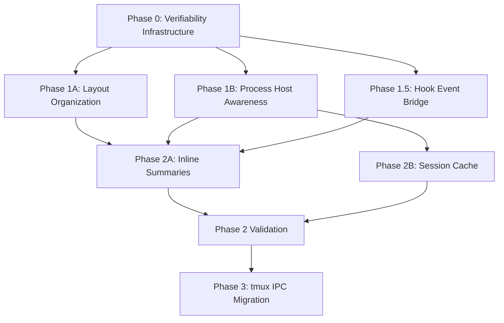

---
first_authored:
  by: "@claude-opus-4-6"
  at: 2026-03-24T18:30:00-07:00
task_list: terminal-management/sprack-iteration-plan
type: proposal
state: live
status: wip
tags: [sprack, architecture, phasing, project_management, hooks]
last_reviewed:
  status: revision_requested
  by: "@claude-opus-4-6-20250605"
  at: 2026-03-24T19:00:00-07:00
  round: 1
---

# Sprack Iteration Phasing Plan

> BLUF: Six proposals plus a hook event bridge define the next round of sprack improvements.
> This plan organizes them into five phases with explicit ordering constraints, subagent allocation, and validation checkpoints.
> Phase 0 (verifiability infrastructure) is the foundation: it introduces the trait abstractions and test infrastructure that all subsequent work depends on.
> Phase 1 (layout + process host awareness) is the highest-value work, unblocking the primary use case.
> Phase 1.5 (hook event bridge) adds Claude Code hook integration for rich metadata: task list progress, session purpose, subagent lifecycle.
> Phase 2 (inline summaries + session cache) builds on Phase 1 and 1.5 data, with inline summaries delivering a multi-line rich Claude widget dashboard.
> Phase 3 (tmux IPC migration) is a cleanup pass that benefits from the extended format string established in Phase 1.
> Each phase ends with a manual validation checkpoint against a running lace environment.

## Principles

1. **Iterative, empirical validation.**
   Each phase ends with a manual TUI verification against a real lace deployment.
   No phase is "done" until someone has run sprack and confirmed the feature works visually.

2. **Prefer landing incremental improvements over batching.**
   Each phase's changes should be committable independently.
   A phase can be split into multiple commits, but cross-phase commits should not be interleaved.

3. **Test infrastructure first.**
   The verifiability strategy's trait abstractions (ProcFs, socket parameterization, claude_home injection) are prerequisites for all feature work.
   Building them first means every subsequent phase has automated tests.

4. **Sequence by dependency, parallelize by independence.**
   Layout organization and process host awareness are independent and can run in parallel.
   Inline summaries and session cache depend on the data these provide.
   IPC migration should follow layout organization to migrate the extended (19-field) format string.

## Phase Overview

## Phase 0: Verifiability Infrastructure

**Proposal**: [Verifiability strategy](2026-03-24-sprack-verifiability-strategy.md)

**Scope**: Phase 1 of the verifiability proposal (mock infrastructure only, not full test suite).

**Deliverables**:
- `ProcFs` trait extracted from `proc_walk.rs`.
- `find_claude_pid` refactored to `find_process_pid` with predicate parameter.
- Socket parameter added to 4 tmux functions.
- `claude_home` parameter added to `resolve_session_for_pane()`.
- `insta` dev-dependency added.
- 3-5 smoke tests per category proving the abstractions work.

**Subagent allocation**: 1 subagent.
This is focused refactoring with no new features: existing 76 tests must continue passing.

**Validation checkpoint**: `cargo test` passes.
No manual TUI validation needed: this phase changes no behavior.

**Estimated effort**: 2-3 hours.

## Phase 1: Data Foundation (Parallel)

Two independent workstreams, each assignable to its own subagent.

### Phase 1A: Layout Organization

**Proposal**: [Layout organization](2026-03-24-sprack-layout-organization.md)

**Scope**: All three phases of the layout proposal (data pipeline, spatial sorting, metadata display).

**Deliverables**:
- Format string extended to 19 fields.
- Schema upgraded to v1 with `user_version` pragma.
- Panes sorted by `(pane_top, pane_left)` in the TUI tree.
- Metadata display enriched per tier.

**Subagent allocation**: 1 subagent.
Well-defined scope touching sprack-poll, sprack-db, and sprack TUI.
Changes are mechanical: extend parsing, extend schema, sort panes, update labels.

**Validation checkpoint**: Run `sprack` against a tmux server with multiple pane layouts.
Verify panes appear in visual (spatial) order.
Verify metadata density changes at different terminal widths.

**Estimated effort**: 4-6 hours.

### Phase 1B: Process Host Awareness

**Proposal**: [Process host awareness](2026-03-24-sprack-process-host-awareness.md)

**Scope**: Phase 1 of the process host awareness proposal (container detection + bind-mount resolution).
Phase 2 (pane-level metadata) and Phase 3 (SSH probe) are deferred.

**Deliverables**:
- `PaneResolver` trait with `LocalResolver` and `LaceContainerResolver`.
- Container panes detected via session-level `lace_port`.
- Session files discovered via workspace prefix matching + mtime heuristic.
- `process_integrations` rows written for container panes.

**Subagent allocation**: 1 subagent.
Depends on Phase 0's `ProcFs` trait for the `LocalResolver` implementation.

**Validation checkpoint**: Run `sprack` on the host with a lace container running Claude Code.
Verify that container panes show Claude status (not just "ssh").
This is the critical validation: it confirms the primary use case works.

**Estimated effort**: 4-6 hours.

## Phase 1.5: Hook Event Bridge

**Proposal**: [Claude Code plugin analysis](../reports/2026-03-24-sprack-claude-code-plugin-analysis.md) (Option C: hybrid hooks + JSONL)

**Scope**: Create the hook command script and event reader infrastructure.
This phase is independent of Phase 1A/1B and can run in parallel with them.
Depends only on Phase 0 for test infrastructure.

**Deliverables**:
- Hook command script (shell or small Rust binary) handling `PostToolUse`, `SessionStart`, `SubagentStart`, `SubagentStop`, `TaskCompleted`, `PostCompact`, and `SessionEnd` events.
- Event file writer appending structured JSON to `~/.local/share/sprack/claude-events/<session_id>.jsonl`.
- Event file reader added to sprack-claude alongside the existing JSONL reader.
- `ClaudeSummary` extended with `tasks` (list of task subjects with completion status), `session_summary` (from `PostCompact`), and `session_purpose` (from first user message or custom title) fields.
- `.claude/settings.local.json` template for hook configuration.

**Subagent allocation**: 1 subagent.
The hook script is minimal (stdin read, field extraction, file append).
The event reader reuses sprack-claude's existing incremental-read infrastructure.

> NOTE(opus/sprack-iteration-plan): This phase could eventually be packaged as a clauthier marketplace plugin.
> For now, keep it as a local hook script in the lace devcontainer.
> The hook configuration lives in `.claude/settings.local.json` (gitignored) to avoid imposing it on other contributors.

**Validation checkpoint**: Configure hooks in a Claude Code session, run sprack-claude, verify event file is populated.
Verify `ClaudeSummary` includes task list and session summary data when hooks are active.
Verify graceful fallback: when hooks are not configured, sprack-claude behaves identically to current JSONL-only mode.

**Estimated effort**: 3-5 hours.

## Phase 2: Rich Display (Parallel After Phase 1)

Two independent workstreams that consume Phase 1 outputs.

**Cross-phase coordination:** Phase 2A (inline summaries) should define format string placeholders for the session cache fields added by Phase 2B (`user_turns`, `context_trend`, `tool_counts`) and the hook event bridge fields added by Phase 1.5 (`tasks`, `session_summary`, `session_purpose`), rendered conditionally when available.
This addresses the ClaudeSummary schema divergence identified in the coherence review.
Additionally, `ClaudeSummary` should be moved from `sprack-claude/src/status.rs` to `sprack-db` as the canonical shared type, since both sprack-claude (writes) and the TUI (reads) depend on sprack-db.

### Phase 2A: Inline Summaries (Rich Claude Widget)

**Proposal**: [Inline summaries](2026-03-24-sprack-inline-summaries.md)

**Scope**: Multi-line rich Claude widget dashboard.
Multi-line `TreeItem` support in `tui-tree-widget` v0.22 is confirmed to work architecturally, so the implementation proceeds directly to multi-line rendering without an evaluation gate.

**Deliverables**:
- Multi-line pane items (3-5 lines) showing: status + context, task progress, tool stats, session purpose.
- Per-tier format strings rendering ClaudeSummary inline.
- Detail pane removed at Compact/Standard/Wide tiers.
- Staleness indicators (dimmed suffixes).
- Window/session aggregation counts.
- Lines 2-4 of the rich widget render only when hook data (Phase 1.5) is available; graceful fallback to single-line when not.

**Subagent allocation**: 1 subagent.
Touches only the sprack TUI crate.
No dependency on sprack-poll or sprack-db changes (reads existing `process_integrations`).
Benefits from Phase 1A's richer metadata (dimensions in labels), Phase 1B's container pane integrations, and Phase 1.5's task list and session summary data.

**Validation checkpoint**: Run `sprack` with multiple Claude instances and hooks configured.
Verify multi-line widget renders task progress and session purpose when hook data is present.
Verify single-line fallback when hook data is absent.
Verify inline summaries at each tier.
Verify staleness when sprack-claude is stopped.
Resize terminal to verify tier transitions.

**Estimated effort**: 5-7 hours.

### Phase 2B: Session Cache

**Proposal**: [Incremental session cache](2026-03-24-sprack-claude-incremental-session-cache.md)

**Scope**: Phase 1 (schema + ingestion) and Phase 2 (cache-backed summaries) of the session cache proposal.
Phase 3 (subagent lifecycle + context trends) can be deferred.

**Deliverables**:
- `session-cache.db` with incremental JSONL ingestion.
- `ClaudeSummary` extended with `user_turns`, `assistant_turns`, `tool_counts`, `context_trend`.
- sprack-claude reads from cache instead of tail-reading JSONL.
- `isCompactSummary` entries skipped during ingestion.

**Subagent allocation**: 1 subagent.
Touches only sprack-claude.
Depends on Phase 1B's `PaneResolver` for session file discovery: the cache should use PaneResolver's workspace-path resolution rather than reimplementing the algorithm described in the session cache proposal's "Session Discovery Without /proc" section.
This is a deduplication constraint per the coherence review (Conflict 3), not a hard technical dependency.
If Phase 1B is delayed, Phase 2B can proceed with its own discovery logic and refactor to PaneResolver later.

**Validation checkpoint**: Run sprack-claude, verify `session-cache.db` is populated.
Kill and restart sprack-claude, verify it resumes from the cached byte offset.
Verify the TUI shows richer summary data (turn counts, tool counts).

**Estimated effort**: 5-7 hours.

## Phase 3: Cleanup

### tmux IPC Migration

**Proposal**: [tmux IPC migration](2026-03-24-sprack-tmux-ipc-migration.md)

**Scope**: All steps (library evaluation, sprack-poll migration, TUI command migration).

**Deliverables**:
- tmux-interface-rs replaces raw `Command::new("tmux")` in sprack-poll and sprack TUI.
- `||`-delimited format string eliminated.
- Hash-based change detection migrated to struct hashing.

**Subagent allocation**: 1 subagent.
Touches sprack-poll and sprack TUI.
Must happen after Phase 2 validation: it migrates the extended 19-field format string from Phase 1A, and all feature work should land before the interaction layer changes.

> NOTE(opus/sprack-iteration-plan): If the tmux-interface-rs evaluation fails (library does not cover sprack's format variables), the fallback (single-field-per-call queries) is a viable permanent solution.
> This fallback is quick to implement and eliminates delimiters by construction.
> The phasing plan does not change: Phase 3 delivers delimiter safety regardless of which approach succeeds.

**Validation checkpoint**: Run `sprack` and `sprack-poll` with the new tmux interaction layer.
Create a session named `test||pipes` and verify it does not break parsing.
Verify all existing functionality is preserved.

**Estimated effort**: 4-6 hours.

## Phase 2+ (Ongoing): Verifiability Completion

After feature phases complete, fill in the remaining verifiability proposal phases:
- Phase 2 of verifiability: full Tier 2 integration tests (mock tmux server, synthetic `~/.claude`), full Tier 3 boundary mock tests.
- Phase 3 of verifiability: TUI snapshot tests with `TestBackend`.
- Write manual validation runbook.

This is ongoing work that can be done by any available subagent between feature phases.
It does not block any feature work but improves confidence in future changes.

> NOTE(opus/sprack-iteration-plan): Certain verifiability tiers have implicit ordering preferences even though the work is nominally parallel.
> Tier 3C (PaneResolver dispatch tests) requires Phase 1B's trait to exist.
> TUI snapshot tests are most valuable after Phase 2A changes the TUI layout.
> The subagent should prioritize tiers whose dependencies have already landed.

**Subagent allocation**: 1 subagent (can run in parallel with any phase).
The 4-6 hour estimate covers Tier 2 integration tests and Tier 3 boundary mocks.
TUI snapshot tests (Tier 4) and the manual validation runbook are separate follow-up work if the initial estimate is consumed.

## Subagent Summary

| Phase | Work | Subagent | Depends On | Est. Hours |
|-------|------|----------|------------|------------|
| 0 | Verifiability infrastructure | 1 | None | 2-3 |
| 1A | Layout organization | 1 | Phase 0 | 4-6 |
| 1B | Process host awareness | 1 | Phase 0 | 4-6 |
| 1.5 | Hook event bridge | 1 | Phase 0 | 3-5 |
| 2A | Inline summaries (rich widget) | 1 | Phase 1A, 1B, 1.5 | 5-7 |
| 2B | Session cache | 1 | Phase 1B | 5-7 |
| 3 | tmux IPC migration | 1 | Phase 2 validation | 4-6 |
| 2+ | Verifiability completion | 1 | Phases 1-2 (for test targets) | 4-6 |

Peak parallelism: 3 subagents (Phase 1A + 1B + 1.5).
Total estimated effort: 31-46 hours of subagent work.

## Commit Strategy

Each phase should produce frequent, small commits rather than a single large commit.
Suggested commit granularity:

- **Phase 0**: One commit per trait extraction + one commit for smoke tests.
- **Phase 1A**: One commit for format string + parsing, one for schema, one for sorting, one for metadata display.
- **Phase 1B**: One commit for PaneResolver trait, one for LaceContainerResolver, one for dispatch wiring.
- **Phase 1.5**: One commit for hook script, one for event reader, one for ClaudeSummary extension, one for settings template.
- **Phase 2A**: One commit for multi-line widget rendering, one per tier's format string changes, one for aggregation, one for detail pane removal.
- **Phase 2B**: One commit for schema + ingestion, one for cache-backed summaries, one for ClaudeSummary extension.
- **Phase 3**: One commit for library evaluation, one for sprack-poll migration, one for TUI migration.

## Risk: Phase 1B Validation Requires Host Environment

Phase 1B's validation checkpoint ("run sprack on the host with a lace container") requires the host-tmux deployment, not the devcontainer development environment.
Development and unit testing happen in-container, but the critical manual validation requires the user to test on their host.

**Mitigation**: Phase 0's mock infrastructure allows automated testing of the resolver logic in-container.
The host validation confirms the bind mount path is correct and the mtime heuristic selects the right session file.
If the user cannot test on the host, Phase 1B's automated tests provide ~80% confidence.

## Risk: Subagent Context Loss Across Phases

Each subagent starts fresh without the previous phase's context.
A subagent implementing Phase 2A (inline summaries) needs to understand the Phase 1A changes (new metadata fields) and Phase 1B changes (container pane integrations).

**Mitigation**: Each phase's subagent prompt should include:
1. The proposal being implemented.
2. The devlog from the previous phase (for context on what changed).
3. A `git diff` of the previous phase's commits (for concrete code changes).
4. The verifiability analysis report (for test expectations).
5. The cross-coherence review (for cross-proposal integration constraints).

## Open Questions

1. **Should Phase 1A and 1B share a devlog or have separate ones?**
   Recommendation: separate devlogs, one per subagent.
   A coordinating devlog can synthesize findings after both complete.

2. **~~When should the multi-line TreeItem evaluation (inline summaries Phase 2) run?~~**
   Resolved: multi-line `TreeItem` in `tui-tree-widget` v0.22 is confirmed to work.
   Phase 2A proceeds directly to multi-line rich widget rendering.
   A brief verification step replaces the evaluation gate.

3. **Should Phase 3 wait for Phase 2 validation or just Phase 1A?**
   Recommendation: wait for Phase 2 validation.
   Phase 3 is low urgency (the delimiter problem is rare in practice) and benefits from stability.
   All feature work should land before the interaction layer changes.
