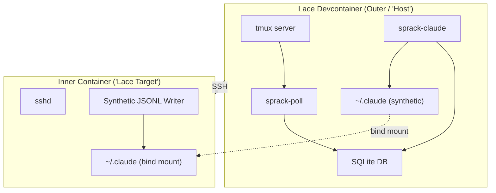

---
first_authored:
  by: "@claude-opus-4-6"
  at: 2026-03-24T19:30:00-07:00
task_list: terminal-management/sprack-podman-testing
type: proposal
state: live
status: request_for_proposal
tags: [sprack, testing, container, podman, integration, future_work]
---

# sprack Podman-in-Podman Integration Testing

> BLUF: Mock-based container-boundary tests verify algorithm logic but cannot catch real integration failures: path encoding bugs against actual bind mounts, SSH key permission issues, `/proc` behavior differences across PID namespaces.
> A podman-in-podman test harness using rootless nested containers can reproduce the host+container split entirely within the devcontainer, enabling automated end-to-end testing of the full sprack pipeline across container boundaries.
> This supplements the mock-based [verifiability strategy](2026-03-24-sprack-verifiability-strategy.md): it does not replace it.
> Feasibility depends on several open questions about the devcontainer's kernel capabilities and podman's rootless nesting support.

## Objective

The [verifiability analysis](../reports/2026-03-24-sprack-verifiability-analysis.md) identified a fundamental paradox: container-boundary features cannot be tested from inside a single container.
The [verifiability strategy](2026-03-24-sprack-verifiability-strategy.md) addresses this with trait abstractions (`ProcFs`), synthetic fixtures, and a manual validation runbook.

Mocks validate algorithm correctness but miss a class of failures that only surface under real conditions:
- Bind mount permission and ownership mismatches between user namespaces.
- `/proc/<pid>/children` vs `/proc/<pid>/task/<tid>/children` behavioral differences across PID namespace boundaries.
- SSH key access and sshd configuration issues.
- Path encoding correctness against actual filesystem state (symlinks, case sensitivity, special characters in mount paths).
- `sessions-index.json` `fullPath` resolution when `$HOME` differs between writer and reader.
- Race conditions in JSONL file discovery during container startup/shutdown.

Podman-in-podman creates a self-contained two-environment test topology that reproduces the host+container split without leaving the development container.
This enables automated integration tests for scenarios that the current strategy relegates to a manual runbook.

## Scope

### In scope

- Rootless podman installation and configuration inside the lace devcontainer.
- A minimal "inner container" image with sshd and a synthetic JSONL writer.
- Test harness that starts the outer+inner topology, runs sprack components, and asserts on results.
- Bind mount of a synthetic `~/.claude` directory between outer and inner containers.
- SSH connection from outer to inner container.
- End-to-end pipeline test: synthetic JSONL -> sprack-claude -> sprack-db -> verification.

### Out of scope

- Replacing mock-based tests (Tiers 1-4 in the verifiability strategy remain the primary test suite).
- Testing against real Claude Code instances (the synthetic JSONL writer simulates Claude output).
- CI integration (addressed as an open question, not a deliverable).
- Multi-container aggregation (multiple inner containers: deferred to a follow-up).
- TUI rendering tests (covered by TestBackend snapshots in the verifiability strategy).

## Architecture

The test harness creates a two-level container topology inside the devcontainer.

### Outer container (simulated host)

The lace devcontainer itself acts as the "host."
It runs:
- **tmux**: a test tmux server on an isolated socket, with a session containing panes that SSH into the inner container.
- **sprack-poll**: queries the test tmux server, writes pane state to the SQLite DB.
- **sprack-claude**: reads pane state, resolves session files via the bind-mounted `~/.claude`, produces summaries.
- **Assertions**: a test binary or script that verifies the DB contains expected `process_integrations` rows with correct summary data.

### Inner container (simulated lace target)

A minimal container image built from `debian:bookworm-slim` containing:
- **sshd**: accepts SSH connections from the outer container using a test keypair generated at test setup time.
- **Synthetic JSONL writer**: writes Claude-format JSONL session data to `~/.claude/projects/<encoded-path>/` at a configurable rate.
- **No sprack components**: the inner container is a pure simulation target.

### Bind mounts

| Mount | Source (outer) | Target (inner) | Purpose |
|-------|---------------|-----------------|---------|
| `~/.claude` | `$TMPDIR/sprack-test-claude/` | `/home/testuser/.claude/` | Session file sharing |

The synthetic `~/.claude` directory is created fresh per test run in a temp directory.
The JSONL writer inside the inner container writes to `/home/testuser/.claude/projects/-workspaces-lace-main/test-session.jsonl`.
sprack-claude in the outer container resolves this via the bind mount.

> NOTE(opus/sprack-podman-testing): The `$HOME` mismatch between outer and inner containers is intentional.
> It reproduces the real-world scenario where container-Claude writes paths relative to `/home/node` while host-sprack resolves relative to `/home/mjr`.
> This exercises the `sessions-index.json` `fullPath` resolution failure and the mtime-based fallback path.

### SSH setup

1. Test harness generates an ephemeral ed25519 keypair at setup time.
2. The public key is injected into the inner container's `authorized_keys`.
3. The private key is written to a temp file accessible to the outer container.
4. tmux panes are configured to `ssh -i <keyfile> -o StrictHostKeyChecking=no testuser@<inner-container-ip>`.

### Synthetic JSONL writer

Writes Claude Code-format JSONL entries to simulate an active session.
Minimal requirements:
- Write a valid `sessions-index.json` with a `fullPath` using the inner container's `$HOME`.
- Write `.jsonl` entries containing `type: "assistant"` messages with tool use.
- Support configurable write rate (one entry per N seconds) for testing incremental reads.
- Support a "completed session" mode where the file is closed (tests stale detection).

## Test Scenarios

### Scenario 1: Basic container pane detection

1. Start inner container with sshd.
2. Create tmux session with a pane SSH'd into inner container.
3. Set `@lace_port` and `@lace_workspace` tmux options on the session.
4. Run sprack-poll: verify pane appears in DB with `lace_port` set.
5. Run sprack-claude: verify it classifies the pane as a container pane and dispatches to `LaceContainerResolver`.

### Scenario 2: Session file resolution across bind mount

1. Start JSONL writer inside inner container.
2. Verify the `.jsonl` file is visible from the outer container via the bind mount.
3. Run sprack-claude: verify it discovers the session file using workspace prefix matching.
4. Verify the `process_integrations` row contains a valid summary with state, model, and tool data.

### Scenario 3: `sessions-index.json` fullPath mismatch

1. Write a `sessions-index.json` inside the inner container with `fullPath` using `/home/testuser/...`.
2. Run sprack-claude from the outer container where `$HOME` is `/home/node`.
3. Verify the `fullPath` resolution fails gracefully.
4. Verify the mtime-based fallback discovers the correct `.jsonl` file.

### Scenario 4: Container lifecycle

1. Start inner container, establish SSH pane, begin JSONL writing.
2. Verify sprack-claude produces a summary.
3. Stop the inner container.
4. Run sprack-claude again: verify it handles the gone container gracefully (no crash, stale detection).

### Scenario 5: PID namespace isolation

1. Verify that `/proc` walking from the outer container cannot traverse into the inner container's PID namespace.
2. Verify that `LaceContainerResolver` succeeds without `/proc` walking (uses bind mount + mtime instead).

## Open Questions

### Q1: Is podman available in the lace devcontainer?

Podman is not installed in the current devcontainer image.
The Dockerfile installs tmux, sqlite3, and standard build tools, but no container runtime.
Installation options:
- Add `podman` to the `apt-get install` line in the Dockerfile (Debian bookworm ships podman 4.3+).
- Use a devcontainer feature (`ghcr.io/devcontainers/features/docker-in-docker` or a podman equivalent).
- Install at test-time via a setup script (slower but avoids image bloat).

The first option is simplest but increases the base image size.
A devcontainer feature is cleaner for optional capabilities.
A test-time installation is viable if podman tests are rare.

### Q2: Can rootless podman run inside a rootless container?

Rootless podman requires:
- User namespaces enabled (`/proc/sys/kernel/unprivileged_userns_clone = 1` or equivalent).
- A working `newuidmap`/`newgidmap` or sufficient `/etc/subuid`+`/etc/subgid` entries.
- Access to `/dev/fuse` for rootless overlay (or use `vfs` storage driver as fallback).

Initial probing of the lace devcontainer shows:
- User namespace creation works (`unshare --user` succeeds).
- Seccomp is disabled (`Seccomp: 0`).
- cgroup v2 is available at `/sys/fs/cgroup/`.
- The container runs as UID 1000 (node user) with passwordless sudo.

These are encouraging signs, but a definitive answer requires installing podman and attempting `podman run --rm alpine echo hello`.
The `/etc/subuid` and `/etc/subgid` files need to be configured for the node user if they don't already exist.

### Q3: What kernel capabilities are needed?

Rootless podman in a nested container typically needs:
- `CAP_SYS_ADMIN` (for mount namespaces): the devcontainer's `runArgs` do not explicitly grant this. However, user namespaces grant a subset of capabilities within the namespace.
- `CAP_NET_ADMIN` (for network namespace setup): needed for `slirp4netns` or `pasta` networking.
- Overlay filesystem support: may require `/dev/fuse` access or the `vfs` storage driver.

The devcontainer does not set `--privileged` or `--cap-add` in its configuration.
The seccomp filter being disabled is unusual and suggests the container runtime (lace) may already be configured for permissive operation.
The exact capability set should be checked with `capsh --print` (not installed) or by reading `/proc/self/status` `Cap*` fields.

If the devcontainer lacks required capabilities, options include:
- Adding `--cap-add SYS_ADMIN,NET_ADMIN` to the devcontainer's `runArgs`.
- Using `--security-opt seccomp=unconfined` (already appears to be the case).
- Running the test harness under `unshare` to create necessary namespaces.

### Q4: SSH key setup for the test environment

Options:
- **Ephemeral keys**: generate a fresh ed25519 keypair per test run, inject into the inner container's `authorized_keys` at build/start time. Cleanest approach, no persistent key material.
- **Shared test keys**: commit a test-only keypair to the repo under `packages/sprack/tests/fixtures/`. Simpler but requires ensuring the keys never leak to production.
- **`ssh-keygen` at test time**: shell out to `ssh-keygen -t ed25519 -f $TMPDIR/test_key -N ""` during test setup. Requires `ssh-keygen` in the container (present via the sshd feature).

Ephemeral keys generated at test time are the recommended approach: no secrets in the repo, no cleanup needed.

### Q5: Synthetic JSONL writer implementation

Options:
- **Shell script**: a bash script that writes JSONL lines using `echo`/`printf`. Simplest, zero compilation. Good enough for initial validation.
- **Rust binary**: a small binary compiled from a crate in the sprack workspace. Type-safe, reusable, can share types with sprack-claude. Higher initial investment.
- **Static fixture files**: pre-written `.jsonl` files copied into the inner container at build time. No runtime writer needed for basic tests. Insufficient for testing incremental reads and live session behavior.

Recommendation: start with static fixture files for the initial proof-of-concept, add a shell script writer for live-session tests.
A Rust binary is overkill unless the writer needs complex behavior (rate-limited streaming, session rotation).

### Q6: Performance impact on test runs

Container startup costs:
- `podman build` of the inner container image: ~5-15 seconds (cached after first build).
- `podman run` startup: ~1-3 seconds for a minimal image.
- sshd startup inside the container: <1 second.
- JSONL writer startup: negligible.
- SSH connection establishment: <1 second.

Estimated per-test overhead: ~3-5 seconds with a pre-built image, ~15-20 seconds on cold start.
This is acceptable for integration tests run separately from the unit test suite.

Mitigation strategies:
- Start the inner container once per test module, not per test function.
- Use `podman build --cache` to avoid rebuilding unchanged images.
- Gate podman tests behind `#[ignore]` or a cargo feature flag so `cargo test` does not include them by default.

### Q7: CI integration

GitHub Actions supports container-based workflows, but podman-in-podman adds complexity:
- GitHub-hosted runners use Docker, not Podman. Podman can be installed via `apt-get`.
- Actions runners typically have limited namespace support. `--privileged` may be needed.
- Self-hosted runners with podman pre-installed would work but require infrastructure.

The pragmatic approach: podman tests run locally in the devcontainer and are not part of CI initially.
CI integration is deferred until sprack has a CI pipeline at all (it does not currently).
When CI is introduced, podman tests can be added as an optional job that requires `--privileged` runners.

## Relationship to Existing Verifiability Strategy

This proposal supplements the [verifiability strategy](2026-03-24-sprack-verifiability-strategy.md), not replaces it.

| Verifiability Strategy | Podman Testing |
|----------------------|----------------|
| Tiers 1-2: unit + integration tests | Foundation. Run in `cargo test`. |
| Tier 3: mock-based boundary tests | Validates algorithm logic. |
| Tier 4: TUI snapshots | Visual regression detection. |
| Manual runbook | Replaced by automated podman tests for covered scenarios. |

The podman harness targets the manual runbook scenarios: container pane detection, session file resolution across mounts, lifecycle handling.
It does not replace Tier 3 mocks because the mocks test edge cases (malformed paths, permission errors, race conditions) that are expensive to reproduce in a full container topology.

The testing pyramid remains:
1. **Unit tests** (fast, many): existing + new Tier 1 additions.
2. **Mock integration tests** (fast, moderate count): Tiers 2-3.
3. **TUI snapshot tests** (fast, moderate count): Tier 4.
4. **Podman integration tests** (slow, few): this proposal. 5-10 tests covering the scenarios above.
5. **Manual validation** (slow, rare): only for scenarios not covered by podman tests (multi-host, real Claude interaction).

## Implementation Sketch

### Phase 0: Feasibility validation

1. Install podman in the devcontainer (`sudo apt-get install -y podman`).
2. Configure `/etc/subuid` and `/etc/subgid` for the node user.
3. Attempt `podman run --rm docker.io/library/alpine echo hello`.
4. If this fails, document the failure mode and assess whether capability or kernel changes are needed.

This phase produces a go/no-go decision.
If podman cannot run rootless inside the devcontainer, the alternatives are:
- Docker-in-Docker (requires `dockerd` and typically `--privileged`).
- Bubblewrap (`bwrap`) for lightweight namespace isolation (less featureful but lower requirements).
- Accept that container-boundary tests remain manual-only.

### Phase 1: Inner container image and test harness skeleton

- Dockerfile for the inner container: `debian:bookworm-slim` + `openssh-server` + test user + authorized_keys.
- Rust test harness module at `packages/sprack/tests/podman/` with setup/teardown helpers.
- Scenario 1 (basic container pane detection) implemented.

### Phase 2: Full pipeline tests

- Scenarios 2-5 implemented.
- Synthetic JSONL fixtures and writer script.
- SSH connection and tmux integration.

### Phase 3: Developer ergonomics

- `cargo test --features podman-integration` feature gate.
- Image caching and pre-build in devcontainer setup.
- Documentation for running podman tests locally.
