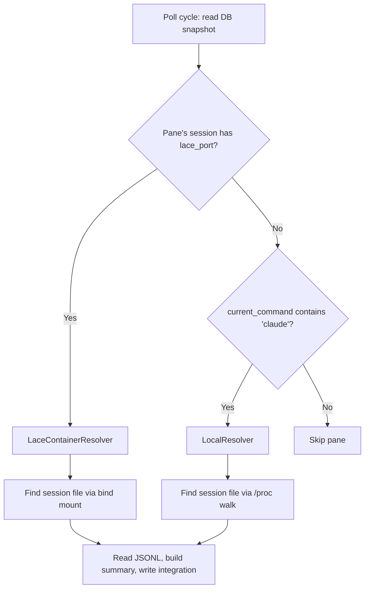

---
first_authored:
  by: "@claude-opus-4-6"
  at: 2026-03-24T14:45:00-07:00
task_list: terminal-management/sprack-process-host-awareness
type: proposal
state: live
status: wip
last_reviewed:
  status: revision_requested
  by: "@claude-opus-4-6-20250605"
  at: 2026-03-24T15:30:00-07:00
  round: 1
tags: [sprack, container, architecture, lace, cross_container]
---

# sprack Process Host Awareness

> BLUF(opus/sprack-process-host-awareness): sprack-claude's `/proc` walking fails when Claude Code runs inside lace containers while tmux observes from the host.
> This proposal introduces a `PaneResolver` trait with two implementations: `LocalResolver` (existing `/proc` walk) and `LaceContainerResolver` (metadata + bind mount, mtime-based session file discovery).
> Container panes are detected by the presence of pane-level `@lace_port` metadata.
> Session files are found by enumerating `~/.claude/projects/` directories whose names match the `@lace_workspace` prefix, then selecting the directory with the most recently modified `.jsonl` file.
> No schema changes are required.
> SSH probe (strategy 4B) is deferred as an optional enhancement.

## Objective

Enable sprack-claude to produce structured summaries for Claude Code instances running inside lace devcontainers, where:

1. tmux runs on the host.
2. Claude Code runs inside one or more lace devcontainers connected via SSH.
3. Panes show `current_command: ssh` instead of `current_command: claude`.
4. The `~/.claude` directory is bind-mounted between host and containers.
5. Lace metadata (`@lace_port`, `@lace_user`, `@lace_workspace`) is available per pane.

The `~/.claude` bind mount (condition 4) is a hard prerequisite: without it, the host has no access to container session files and no summary can be produced.

The result is identical to local pane summarization: a `process_integrations` row with a JSON summary containing state, model, tool use, and context percentage.

## Architecture

> NOTE(opus/sprack-process-host-awareness): The container boundary analysis report concluded that all sprack components should run inside the container, where `/proc` walking works.
> This proposal takes a different approach because the user's actual deployment has tmux on the host, not inside the container: lace-into creates host-side tmux sessions and SSH-connects panes to containers.
> The bind mount of `~/.claude` provides file-level access to container session files without needing `/proc` traversal, which the boundary analysis did not evaluate as a standalone strategy.

sprack-claude classifies each candidate pane into one of two categories and dispatches to the appropriate resolver.



### Pane classification

A pane is a **container pane** if it has a non-null `lace_port` value in the DB.
A pane is a **local Claude pane** if `current_command` contains "claude" and it has no `lace_port`.

> NOTE(opus/sprack-process-host-awareness): The classification uses `lace_port` presence rather than `current_command: ssh` because a pane could be running SSH to a non-lace host.
> Lace metadata is the authoritative signal for container panes.

### Candidate pane discovery

The `find_claude_panes` function broadens from its current filter (`current_command LIKE '%claude%'`) to also include panes whose parent session has `lace_port` set.
The join is performed in-memory after reading the `DbSnapshot`: build a `HashSet<String>` of session names where `lace_port.is_some()`, then filter panes whose `session_name` is in that set OR whose `current_command` contains "claude".
This is the only query change: the rest of the logic dispatches per-pane based on which resolver applies.

## Design: PaneResolver Trait

```rust
trait PaneResolver {
    /// Attempt to find the active session file for this pane.
    /// Returns None if resolution fails (process gone, no session file, etc.).
    fn resolve(&self, pane: &Pane, sessions: &[Session]) -> Option<ResolvedSession>;
}

struct ResolvedSession {
    /// Path to the active JSONL session file.
    session_file: PathBuf,
    /// Cache key for invalidation. For local: claude PID. For container: session file path.
    cache_key: String,
}
```

> NOTE(opus/sprack-process-host-awareness): The trait is internal to sprack-claude, not a public API.
> It exists for separation of concerns, not for third-party extensibility.
> Lace-specific logic is acceptable: there is no need for a generic `RemoteResolver`.

### LocalResolver

Wraps the existing `/proc` walk logic unchanged:

1. Read `pane_pid` from the DB.
2. Walk `/proc/<pid>/children` recursively to find a child whose `cmdline` contains "claude".
3. Read `/proc/<claude_pid>/cwd` to get the project directory.
4. Encode the path and look up `~/.claude/projects/<encoded>/`.
5. Call `find_session_file()` on the project directory.

Cache invalidation: check `/proc/<claude_pid>` existence (current behavior).

### LaceContainerResolver

New implementation for container panes:

1. Look up the pane's session in the `sessions` table to get `lace_workspace`.
2. Enumerate candidate project directories (see "Session File Discovery" below).
3. Select the directory with the most recently modified `.jsonl` file.
4. Call `find_session_file()` on the selected directory.

Cache invalidation: check that the session file still exists and has been modified within the last 60 seconds.
There is no PID to check, so staleness detection relies on file activity.
The 60-second threshold accommodates Claude Code idle periods (waiting for user input) where no writes occur, while still detecting genuinely dead sessions within one minute.

> NOTE(opus/sprack-process-host-awareness): `find_session_file()` already has the mtime-based fallback that avoids the `sessions-index.json` `fullPath` mismatch problem.
> The `LaceContainerResolver` skips `sessions-index.json` entirely and uses only the mtime-based listing, since `fullPath` entries contain container-internal absolute paths (`/home/node/.claude/...`) that do not resolve on the host.

## Session File Discovery

> WARN(opus/sprack-process-host-awareness): The entire session file discovery chain depends on two implementation details of Claude Code that are not documented APIs:
> (1) the path encoding scheme (`/` replaced with `-`) for project directory names, and
> (2) the `~/.claude/projects/` directory layout.
> Changes to either would silently break resolution.
> Additionally, the `@lace_workspace` value comes from the devcontainer.json `workspaceFolder` setting, which users can change.
> A Claude Code hook-based approach (see [plugin analysis report](../reports/2026-03-24-sprack-claude-code-plugin-analysis.md)) can eliminate this fragility by providing `session_id` and `cwd` directly.
> The bind-mount approach here is the pragmatic near-term path; hooks should subsume it longer-term.

### The path derivation problem

`@lace_workspace` gives the workspace root inside the container (e.g., `/workspaces/lace`), but Claude Code's working directory is a subdirectory (e.g., `/workspaces/lace/main`).
The encoded project directory name is `-workspaces-lace-main`, not `-workspaces-lace`.
Without knowing the exact subdirectory, we cannot construct the full path.

### Solution: prefix-matching enumeration

Enumerate all directories in `~/.claude/projects/` whose names start with the encoded workspace prefix.

> NOTE(opus/sprack-process-host-awareness): The path encoding (`/` to `-`) is not bijective: `/workspaces/lace-main` and `/workspaces/lace/main` both encode to `-workspaces-lace-main`.
> In practice this collision is extremely unlikely because lace workspace roots use simple directory names without hyphens.

Given `@lace_workspace = /workspaces/lace`:
1. Encode: `/workspaces/lace` becomes `-workspaces-lace`.
2. List all directories in `~/.claude/projects/` matching the prefix `-workspaces-lace`.
3. This matches `-workspaces-lace-main`, `-workspaces-lace-feature-branch`, etc.
4. For each matching directory, find the most recently modified `.jsonl` file.
5. Select the directory whose most recent `.jsonl` file has the latest mtime overall.

```rust
fn find_container_project_dir(workspace: &str) -> Option<PathBuf> {
    let prefix = encode_project_path(Path::new(workspace));
    let home = std::env::var("HOME").ok()?;
    let projects_dir = PathBuf::from(&home).join(".claude").join("projects");

    let candidates: Vec<(PathBuf, SystemTime)> = std::fs::read_dir(&projects_dir)
        .ok()?
        .filter_map(|entry| entry.ok())
        .filter(|entry| {
            entry.file_name().to_string_lossy().starts_with(&prefix)
        })
        .filter_map(|entry| {
            let dir = entry.path();
            let newest_mtime = newest_jsonl_mtime(&dir)?;
            Some((dir, newest_mtime))
        })
        .collect();

    candidates.into_iter()
        .max_by_key(|(_, mtime)| *mtime)
        .map(|(path, _)| path)
}
```

### Handling multiple worktrees

When multiple worktrees exist (e.g., `main`, `feature-branch`), the prefix match returns all of them.
The mtime heuristic selects the one with the most recently active Claude session.

This is correct for the single-container case: the user is working in one worktree at a time, and the most recent session file indicates where.

For multiple simultaneous Claude instances in different worktrees within the same container, each instance writes to a different project directory.
The resolver returns only the most recent one per pane.
This is acceptable: a single pane runs a single Claude instance, and that instance's session file is the most recently modified one under that pane's workspace prefix.

> NOTE(opus/sprack-process-host-awareness): If a container runs two Claude instances in two different terminal emulator panes (not tmux panes), both would produce session files under the same workspace prefix.
> The mtime heuristic would pick the most recent one.
> This is a theoretical edge case: in practice, each Claude instance maps to one tmux pane, and the pane-to-session mapping is unambiguous because the session file's activity correlates with the pane's activity.

### Handling multiple containers

Multiple containers produce session files with different workspace prefixes (e.g., `-workspaces-lace-main` vs `-workspaces-other-project-main`).
Each container pane has its own `@lace_workspace` value, so the prefix match naturally scopes to the correct container.

## Pane-Level vs Session-Level Metadata

**Recommendation: read pane-level `@lace_port`.**

sprack-poll reads lace options at the session level via `tmux show-options -qvt $session`.
This works when all panes in a session connect to the same container, which is the common case.
It breaks when a session mixes local and container panes (possible with `lace-into --pane`).

lace-into sets pane-level `@lace_port`, `@lace_user`, and `@lace_workspace` via `tmux set-option -p` on every pane it creates.
sprack-poll should read these pane-level options and store them in the `panes` table.

### Schema change evaluation

Adding `lace_port`, `lace_user`, `lace_workspace` columns to the `panes` table would be the clean approach.
However, this proposal avoids schema changes by using a join strategy instead.

sprack-claude already reads the full DB snapshot (`read_full_state`), which includes both sessions and panes.
For each candidate pane, sprack-claude looks up the parent session's lace metadata.
This is correct for the common case (all panes in a lace session are container panes).

For the mixed-session edge case, sprack-poll adds a new query: `tmux show-options -pqvt $pane_id @lace_port` for each pane.
If the pane has a pane-level `@lace_port`, it overrides the session-level value.
This override is stored in a supplementary in-memory map, not in the schema.

> NOTE(opus/sprack-process-host-awareness): The schema-free approach trades storage normalization for implementation simplicity.
> If pane-level metadata becomes important for other consumers (e.g., the TUI), a schema migration adding lace columns to the `panes` table is the right follow-up.
> For now, sprack-claude is the only consumer and can handle the join internally.

**Phase 1 simplification:** read lace metadata from the session level only (current behavior).
Mixed sessions are rare and can be addressed in Phase 2 by adding pane-level option reads to sprack-poll.

## SSH Probe (Strategy 4B): Deferred Enhancement

An SSH probe (`ssh -p $port $user@localhost "readlink /proc/$(pgrep -n claude)/cwd"`) provides the exact cwd of the Claude process inside the container, eliminating the prefix-matching heuristic.

### When to use

- When the prefix-matching heuristic returns zero candidates (no directories match the workspace prefix).
- When it returns multiple candidates with similar mtimes and the heuristic is ambiguous.

### Security considerations

- Requires SSH key access from the sprack-claude process.
- lace-into uses `~/.config/lace/ssh/id_ed25519` as the SSH identity.
- sprack-claude would need read access to this key, which it has by default (same user).
- The probe runs `readlink` and `pgrep`: no write access, no privilege escalation.

### Performance budget

- One SSH round-trip per probe: ~50-100ms for localhost.
- At a 2-second poll interval with a handful of container panes, this adds 50-300ms per cycle.
- Acceptable, but only as a fallback: the bind-mount path is sub-millisecond.

### Recommendation

Defer SSH probe to a future enhancement.
The prefix-matching heuristic covers the common case (single worktree per container, or most-recently-active worktree).
If users report resolution failures, SSH probe can be added as a targeted fallback without architectural changes.

## Schema Changes

None required.

The `sessions` table already has `lace_port`, `lace_user`, and `lace_workspace` columns.
The `panes` table already has `session_name` for joining to session metadata.
The `process_integrations` table is unchanged: container pane integrations use the same `(pane_id, kind)` primary key and `summary` JSON format as local pane integrations.

> NOTE(opus/sprack-process-host-awareness): A future phase may add `lace_port`, `lace_user`, `lace_workspace` columns to the `panes` table for the mixed-session case.
> This is a non-breaking additive migration (nullable columns) and does not affect the Phase 1 design.

## Implementation Phases

### Phase 1: Container Pane Detection and Bind-Mount Resolution

**Goal:** sprack-claude detects container panes and resolves their session files via the `~/.claude` bind mount.

**Changes:**

1. **`main.rs`**: Broaden `find_claude_panes` to include panes whose session has `lace_port` set.
   Pass the sessions list through to `process_claude_pane`.

2. **New module `resolve.rs`**: Implement `PaneResolver` trait, `LocalResolver`, and `LaceContainerResolver`.
   - `LocalResolver` wraps existing `proc_walk` + `session` logic.
   - `LaceContainerResolver` implements prefix-matching enumeration.

3. **`main.rs`**: Replace direct `resolve_session_for_pane` call with resolver dispatch.
   Select resolver based on whether the pane's session has `lace_port`.

4. **`session.rs`**: Extract `find_via_jsonl_listing` as a public function for use by `LaceContainerResolver`.
   The container resolver cannot use `find_session_file` (the existing public entry point) because it tries `sessions-index.json` first, whose `fullPath` entries contain container-internal absolute paths (e.g., `/home/node/.claude/...`) that do not resolve on the host.

5. **Cache invalidation**: Modify `SessionFileState` to support PID-less cache validation.
   Replace `claude_pid: u32` with `cache_key: String` (PID for local, file path for container).
   Container cache entries are valid while the session file exists and has recent mtime.

**Testable:** Run sprack-claude on the host with a lace container running Claude Code.
Verify that `process_integrations` rows appear for container panes with correct summaries.

### Phase 2: Pane-Level Metadata and Mixed Sessions

**Goal:** Support sessions that mix local and container panes.

**Changes:**

1. **`sprack-poll/src/tmux.rs`**: Add `query_pane_lace_options` function that reads pane-level `@lace_port` via `tmux show-options -pqvt $pane_id @lace_port`.
   Call for each pane that has `current_command: ssh`.

2. **`sprack-poll/src/main.rs`**: Pass pane-level overrides through to the DB write.
   Store in a new `pane_lace_overrides` map or add columns to the `panes` table.

3. **`sprack-claude/src/main.rs`**: Use pane-level lace metadata when available, falling back to session-level.

**Testable:** Create a lace session, then `lace-into --pane` a different container into the same session.
Verify that sprack-claude resolves each pane to the correct container's session file.

### Phase 3 (Deferred): SSH Probe Fallback

**Goal:** Fall back to SSH probe when bind-mount discovery fails.

**Changes:**

1. **New module `ssh_probe.rs`**: Implement SSH probe logic.
   Run `ssh -i ~/.config/lace/ssh/id_ed25519 -p $port $user@localhost "readlink /proc/$(pgrep -n claude)/cwd 2>/dev/null"`.
   Parse the returned path as the exact cwd.

2. **`resolve.rs`**: Add probe fallback to `LaceContainerResolver::resolve`.
   Try bind-mount resolution first; if no candidates, try SSH probe.

3. **Configuration:** Add a `--enable-ssh-probe` flag or config option.
   Disabled by default to avoid unexpected SSH connections.

## Test Plan

### Unit tests (no containers required)

- **`resolve.rs`**: Test `find_container_project_dir` with a mock `~/.claude/projects/` directory structure.
  Create directories named `-workspaces-lace-main`, `-workspaces-lace-feature`, `-workspaces-other-project` with `.jsonl` files of varying mtimes.
  Verify prefix matching returns the correct directory for a given workspace.

- **`resolve.rs`**: Test resolver dispatch: mock pane with `lace_port` gets `LaceContainerResolver`, mock pane without gets `LocalResolver`.

- **`session.rs`**: Test `find_via_jsonl_listing` in isolation (already implicitly tested, but add explicit cases for the container path encoding).

- **Prefix encoding**: Test that `encode_project_path("/workspaces/lace")` produces `-workspaces-lace` and that prefix matching against `-workspaces-lace-main` succeeds.

### Integration tests (mock filesystem)

- Create a temp directory simulating `~/.claude/projects/` with container-encoded directories.
- Place `.jsonl` files with varying mtimes.
- Run `LaceContainerResolver` against mock pane data.
- Verify correct session file is selected.

### Manual verification (requires lace environment)

- Start a lace container, run Claude Code inside it.
- Run sprack-poll and sprack-claude on the host.
- Check `process_integrations` table for a row with the container pane's ID.
- Verify the summary JSON contains correct state, model, and tool information.
- Verify the TUI displays the container pane's Claude status.

## Open Risks and Mitigations

### Risk: prefix matching returns stale directories

If a user previously worked in a worktree that no longer exists, its project directory remains in `~/.claude/projects/` with old session files.
The mtime heuristic would deprioritize it (old mtime), but if the active worktree has no session file yet (Claude just started), the stale directory could be selected briefly.

**Mitigation:** Use a recency threshold in the `LaceContainerResolver` only (the `LocalResolver` uses PID-based validation instead).
Ignore directories whose newest `.jsonl` mtime is older than 5 minutes.
A fresh Claude session creates its session file within seconds of starting.

### Risk: bind mount not present

If `~/.claude` is not bind-mounted (non-lace container, or mount removed), the resolver finds no project directories.
The pane appears as an SSH pane with no Claude integration.

**Mitigation:** Acceptable degradation.
The pane is correctly identified as a container pane (via `lace_port`), but no summary is produced.
Log a diagnostic message: "no session files found for workspace prefix <prefix>".

### Risk: race between session file creation and poll cycle

Claude Code takes a moment to create its session file after starting.
During this window, the resolver finds no `.jsonl` files.

**Mitigation:** This is the same race that exists for local panes.
The error integration ("no session file found") is written and corrected on the next poll cycle.
No special handling needed.

### Risk: `SessionFileState` cache key collision

Two container panes in different containers could theoretically resolve to the same session file if their workspace paths and worktree names are identical.
This would cause cache confusion.

**Mitigation:** Include the pane ID in the cache key (already the case: `session_cache` is keyed by `pane_id`).
Each pane has its own cache entry regardless of which session file it resolves to.
