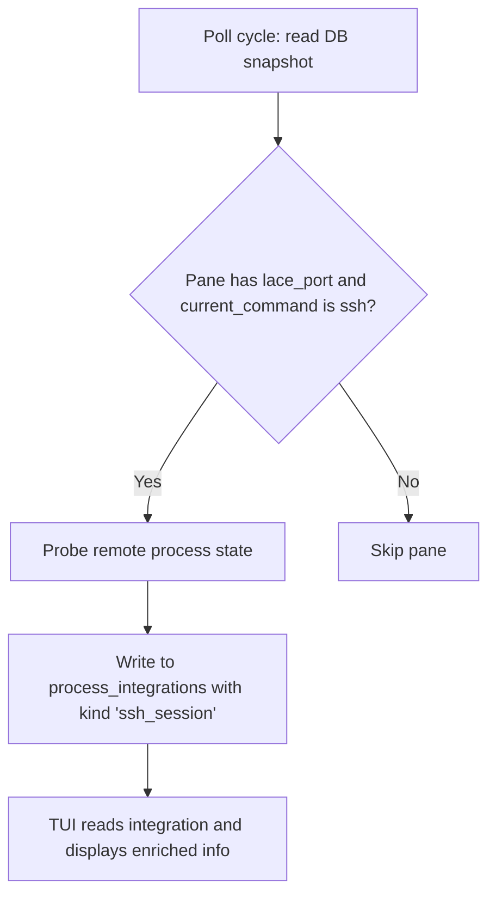

---
first_authored:
  by: "@claude-opus-4-6"
  at: 2026-03-24T22:00:00-07:00
task_list: terminal-management/sprack-ssh-integration
type: proposal
state: live
status: request_for_proposal
tags: [sprack, ssh, lace, future_work]
---

# RFP: Sprack SSH Pane Integration

> BLUF: SSH panes in sprack display "ssh" as the process name, hiding what is actually running inside the remote session.
> A `sprack-ssh` integration daemon could enrich these panes with the active foreground command (nvim, cargo, etc.), the remote working directory, and the container/workspace identity.
> This proposal requests design for data extraction strategies, the integration daemon architecture, and TUI display changes.

## Problem

tmux reports `pane_current_command: ssh` for any pane connected to a remote host via SSH.
sprack-poll records this verbatim, so the TUI shows "ssh" for every lace container pane that is not running Claude Code.

For the common case of nvim, shell, or build commands running inside a lace container, the user sees no useful process information.
The sprack-claude integration solves this for Claude Code panes via JSONL session file reading, but non-Claude SSH panes remain opaque.

## Objective

Build a `sprack-ssh` daemon (or module) that detects SSH panes connected to lace containers and writes enriched metadata to the `process_integrations` table, following the same pattern as sprack-claude.

The integration should provide:

1. **Active foreground command**: the process currently running in the remote shell (nvim, cargo build, nushell, etc.).
2. **Remote working directory**: the current path inside the container.
3. **Container identity**: container name or workspace, derived from existing `@lace_workspace` session metadata.

## Data Source Options

The full proposal should evaluate these approaches and recommend one or a combination.

### Option A: SSH remote command probe

SSH into the container and query process state directly.

```
ssh -p $lace_port $lace_user@localhost "ps -o comm= -p $(cat /proc/$(tmux display -p '#{pane_pid}')/task/*/children 2>/dev/null | head -1) 2>/dev/null"
```

Or more simply, run `ps` or read `/proc` on the remote to find the foreground process group of the remote shell.

- Lace SSH credentials are available at `~/.config/lace/ssh/id_ed25519`.
- `lace_port` and `lace_user` are in the sprack DB via `@lace_port`/`@lace_user` session options.
- Latency: ~50-100ms per SSH round-trip to localhost.
- Gives accurate process name and cwd via `/proc/<pid>/cwd`.

> NOTE(opus/sprack-ssh-integration): sprack-claude's process host awareness proposal deferred SSH probe as a fallback strategy.
> For sprack-ssh, it may be the primary strategy since there is no equivalent of the `~/.claude` bind mount for general process state.

### Option B: tmux capture-pane prompt parsing

Capture the last line(s) of the pane's terminal output and parse the shell prompt for path information.

- No SSH connection required: `tmux capture-pane -t $pane_id -p` runs on the host.
- Shell prompts often contain the working directory (e.g., `node@container:/workspaces/lace/main$`).
- Fragile: depends on prompt format, fails during full-screen applications (nvim, htop).
- Cannot reliably determine the active command, only the prompt when idle.

### Option C: Remote tmux or shell integration

If the container runs its own tmux or shell with reporting hooks, sprack could read those.

- Nushell's `$env.PROMPT_COMMAND` or starship configuration could write state to a shared file.
- Requires container-side setup, which lace features could automate.
- More reliable than prompt parsing, but heavier to deploy.

### Option D: /proc via container filesystem

If the container's filesystem is accessible from the host (e.g., via Docker/Podman's merged directory), read `/proc`-equivalent information from the container's filesystem namespace.

- `podman inspect --format '{{.GraphDriver.Data.MergedDir}}' $container` gives the merged filesystem root.
- Requires mapping the SSH pane to a container ID (via `lace_port` to container lookup).
- Avoids SSH overhead but couples to the container runtime.

## Integration Architecture

The daemon follows the sprack-claude pattern.



Key design points:

- **Integration kind**: `ssh_session` (distinct from `claude_code`).
- **Summary JSON structure**: `{ "command": "nvim", "remote_cwd": "/workspaces/lace/main", "container": "lace-main", "state": "active" }`.
- **Poll interval**: 2-5 seconds, matching sprack-claude.
- **Candidate detection**: panes where `current_command` is "ssh" and parent session has `lace_port` set.
- **Stale cleanup**: remove integrations for panes that are no longer SSH sessions, same pattern as sprack-claude's `clean_stale_integrations`.

## TUI Display

The TUI should use `ssh_session` integrations to replace the bare "ssh" label with richer information.

Possible display formats:
- `nvim /workspaces/lace/main/src/app.rs` (command + argument when available)
- `cargo build [lace-main]` (command + container name)
- `nushell ~/project` (shell + cwd)

The display format depends on the inline summaries proposal: if inline summaries land first, SSH integration data appears as an inline suffix; otherwise it replaces the `current_command` field in the existing tree node.

## Scope Boundaries

- **In scope**: lace container panes (identified by `@lace_port` metadata).
- **Out of scope**: arbitrary SSH connections to non-lace hosts. Those remain as "ssh" in the TUI.
- **Out of scope**: full session/history tracking. This is a live status enrichment, not a session recorder.

## Relationship to Existing Work

- **Process host awareness**: that proposal focuses on finding Claude Code sessions across container boundaries. sprack-ssh addresses the complementary problem: non-Claude processes in containers.
- **sprack-claude**: sprack-ssh follows the same daemon pattern (poll, resolve, write integration) and can potentially share the candidate pane detection logic.
- **Inline summaries**: determines how the enriched SSH data is displayed in the TUI.

## Open Questions

1. **Separate binary or module?** sprack-ssh could be a standalone binary (like sprack-claude) or a module within sprack-claude that handles non-Claude SSH panes. A shared binary reduces the number of daemons but mixes concerns.

2. **SSH connection pooling**: if using the SSH probe approach, should connections be kept alive between poll cycles to avoid repeated handshake overhead? `ControlMaster` in SSH config could handle this transparently.

3. **Full-screen application detection**: when nvim or another TUI application is running, the "active command" is the interesting data. When the user is at a shell prompt, the cwd is more useful. Should the integration report differently based on whether a full-screen app is active?

4. **ProcessStatus mapping**: sprack-claude maps Claude states to `ProcessStatus` variants (Thinking, ToolUse, Idle, etc.). What status semantics make sense for SSH sessions? Possibly just `Idle` (at prompt) vs `ToolUse` (command running) vs `Error` (connection lost).

5. **Multiple SSH hops**: if a pane SSH-connects to a container that then SSH-connects elsewhere, which layer's process state is reported? For lace containers this is unlikely, but the design should define the boundary.

## Success Criteria for Full Proposal

1. Recommended data extraction strategy with latency and reliability analysis.
2. Summary JSON schema definition.
3. Daemon architecture: lifecycle, polling, caching, error handling.
4. TUI integration: how enriched data replaces the "ssh" label.
5. Test plan covering probe reliability, stale detection, and display correctness.
