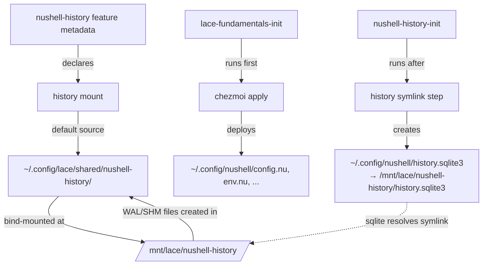

---
first_authored:
  by: "@claude-opus-4-6-20250605"
  at: 2026-03-25T12:00:00-07:00
task_list: lace/nushell-history
type: proposal
state: live
status: wip
last_reviewed:
  status: revision_requested
  by: "@claude-opus-4-6-20250605"
  at: 2026-03-25T14:30:00-07:00
  round: 1
tags: [lace, nushell, history, mounts, chezmoi, architecture]
---

# Lace Nushell History Persistence

> BLUF: Nushell history is persisted via a dedicated `nushell-history` lace feature wrapper that declares a mount and creates a post-chezmoi symlink.
> The feature declares a `history` mount with a shared default at `~/.config/lace/shared/nushell-history/`.
> Its init script symlinks `~/.config/nushell/history.sqlite3` to the mount target after chezmoi apply.
> SQLite (>= 3.39.0) resolves the symlink before constructing WAL/SHM paths, so all three files land on the persistent volume.
> History is shared across containers by default; per-project isolation is available via `settings.json` override.
>
> This proposal also evaluates the broader question of whether chezmoi-in-container is the right config model versus direct host config dir mounting.
> The analysis concludes that chezmoi-in-container remains correct: nushell conflates config and state in `~/.config/nushell/`, making direct mounting unsafe for concurrent containers.
> The symlink approach cleanly separates config (chezmoi-managed) from state (mount-persisted) without modifying shared dotfiles.
>
> - **Depends on:** [lace-fundamentals feature](2026-03-24-lace-fundamentals-feature.md), [user-json rollout](2026-03-25-lace-user-json-rollout.md)
> - **References:** [nushell history report](../reports/2026-03-25-nushell-history-container-persistence.md), [config directory reorg RFP](2026-03-25-lace-config-directory-reorganization.md)
> - **Cross-repo:** `.chezmoiignore` change required in dotfiles repo

## Objective

Persist nushell command history across container rebuilds in lace-managed devcontainers.
History is one of the highest-value pieces of developer state: losing it on every rebuild degrades the container experience significantly.
The solution must work within lace's existing mount and init infrastructure, require zero changes to shared dotfiles config files, and handle SQLite WAL mode correctly.

## Background

### Nushell history internals

Nushell stores history at `$nu.history-path`, which resolves to `$XDG_CONFIG_HOME/nushell/history.sqlite3` (sqlite format) or `history.txt` (plaintext format).
This path is read-only: there is no `$env.config.history.path` setting, no `NU_HISTORY_PATH` env var, and no other override mechanism.

> NOTE(opus/nushell-history): PR [#14434](https://github.com/nushell/nushell/pull/14434) ("Add config.history.path") was closed without merge.
> Issue [#17419](https://github.com/nushell/nushell/issues/17419) ("Allow configuring history file path") is open but has no linked PR.
> PR [#14441](https://github.com/nushell/nushell/pull/14441) ("Move history to $nu.data-dir") was closed without merge on 2026-03-14.
> There is no upstream path forward for configurable history location in nushell 0.110/0.111.

The `$env.config.history` record has exactly four fields: `max_size`, `sync_on_enter`, `file_format`, `isolation`.
SQLite WAL mode is active on the history database, producing three files: `.sqlite3`, `.sqlite3-shm`, `.sqlite3-wal`.
All three must be co-located for correct operation.

### Lace current state

Bash history persists via a `project/bash-history` mount declaration in devcontainer.json, bound to `/commandhistory` in the container.
The Dockerfile configures `HISTFILE=/commandhistory/.bash_history`.

Nushell config is deployed by chezmoi from the dotfiles repo.
`lace-fundamentals-init` (postCreateCommand) runs chezmoi apply, which writes `config.nu`, `env.nu`, and related files to `~/.config/nushell/` inside the container.
Nushell then writes `history.sqlite3` to the same directory.

Nushell history is ephemeral in the current rollout: lost on every container rebuild.

### Why this is harder than bash history

Bash supports `HISTFILE` as a simple env var override.
Nushell has no equivalent.
The history file location is derived from `$XDG_CONFIG_HOME` at startup and cannot be changed afterward.
Changing `XDG_CONFIG_HOME` redirects the entire config directory, breaking chezmoi's deployment target.

## Container Config Model Analysis

The RFP raised a broader question: should lace mount host config directories directly instead of using chezmoi inside containers?
Three models are evaluated.

### Model A: Chezmoi deploys inside container (current)

Chezmoi source repo is mounted readonly at `/mnt/lace/repos/dotfiles`.
`lace-fundamentals-init` runs `chezmoi apply` at container start, deploying config files into the container's filesystem.
State (history, caches) must be persisted separately.

**Strengths:**
- Container independence: each container gets its own copy of config, with no risk of one container's state changes affecting another.
- Container-specific overrides are possible (chezmoi templating with `$env.DEVCONTAINER`, autoload scripts).
- No concurrent write risk on config files: chezmoi apply is a one-shot operation at startup.
- Chezmoi's diff/apply model handles config evolution cleanly.

**Weaknesses:**
- Config and state management are split: config via chezmoi, state via mounts/symlinks.
- Config changes on the host require re-running chezmoi apply inside the container (or rebuilding).
- Chezmoi binary and source repo must be available inside the container.

### Model B: Mount host config dirs directly

Chezmoi applies once on the host.
Containers mount result directories (`~/.config/nushell/`, `~/.config/nvim/`, etc.) from the host.
Config and state are co-located: history writes in the container go directly to the host filesystem.

**Strengths:**
- Simpler mental model: host config = container config, always in sync.
- No chezmoi binary needed inside containers.
- History persistence is automatic (no symlinks needed).

**Weaknesses:**
- **Concurrent sqlite corruption**: Multiple containers mounting the same `~/.config/nushell/` directory write to the same `history.sqlite3`. SQLite WAL mode requires shared mmap across all writers, which works on a single Linux kernel but creates real corruption risk with multiple nushell instances across containers.
- **Mount shadows everything**: Container-specific config overrides are impossible. The host directory takes precedence over any container-side file.
- **Neovim plugin conflicts**: `~/.config/nvim/` contains both config (lua files) and state (lazy-lock.json). Multiple containers sharing the same lazy-lock.json creates plugin version conflicts.
- **Tighter host-container coupling**: Container environment must match host environment (same paths, same tool versions for config compatibility).
- **Chezmoi `run_once` scripts break**: These scripts track execution state in `~/.config/chezmoi/`. If the host has already run them, containers skip them, even when they need to run (different package managers, different architectures).

### Model C: Hybrid - mount config readonly, persist state separately

Mount `~/.config/nushell/` readonly from the host for config files.
Persist state (history) via a separate writable mount.

**Fatal flaw:** Nushell writes `history.sqlite3` to `~/.config/nushell/`.
A readonly mount prevents history writes entirely.
The only workaround is to symlink the history file out to a writable location, which requires a writable filesystem at the symlink source.
This means the directory cannot be mounted readonly, collapsing Model C back to Model B with all its weaknesses.

> NOTE(opus/nushell-history): An overlayfs mount (readonly lower layer + writable upper layer) could theoretically solve this, but Docker does not support user-specified overlayfs mounts in `devcontainer.json`. The container's root filesystem already uses overlayfs, and nesting another overlay at a specific path is not a standard Docker primitive.

### Assessment

**Model A (chezmoi in container) is the correct model.**

The fundamental problem is that nushell conflates config and state in the same directory.
`~/.config/nushell/` contains both `config.nu` (configuration) and `history.sqlite3` (mutable state).
This violates the XDG Base Directory Specification (state should be in `$XDG_STATE_HOME`, data in `$XDG_DATA_HOME`), but nushell does not follow it.

Until nushell either adds `config.history.path` or moves history to `$nu.data-dir`, the cleanest approach is:
- **Config**: chezmoi deploys config files into the container (Model A, current).
- **State**: symlink redirects mutable state to a persistent mount (this proposal).

This separation is not a temporary workaround.
It is the architecturally correct response to tools that conflate config and state.
Even if nushell adds `config.history.path` in the future, the symlink approach remains forward-compatible: we would simply migrate from symlink to config, with no changes to the mount infrastructure.

## Proposed Solution

### Dedicated feature: `nushell-history`

Nushell history persistence is implemented as its own lace feature wrapper at `devcontainers/features/src/nushell-history/`, not as part of `lace-fundamentals`.
This keeps fundamentals focused on baseline infrastructure (SSH, git, chezmoi, shell) and isolates nushell-specific concerns.

The feature:
- Declares a `history` mount for the persistent sqlite directory.
- Provides a `postCreateCommand` init script that creates the symlink after chezmoi apply has run.
- Uses `installsAfter` to ensure nushell and lace-fundamentals are installed first.

Users add it to `user.json` alongside the nushell feature:

```jsonc
{
  "features": {
    "ghcr.io/eitsupi/devcontainer-features/nushell:0": {},
    "ghcr.io/weftwiseink/devcontainer-features/nushell-history:1": {}
  }
}
```

### Architecture



### Mount declaration

The `nushell-history` feature metadata declares the mount:

```json
{
  "id": "nushell-history",
  "version": "1.0.0",
  "name": "Nushell History Persistence",
  "description": "Persists nushell command history across container rebuilds via symlink to a bind-mounted host directory.",
  "installsAfter": {
    "ghcr.io/eitsupi/devcontainer-features/nushell:0": {},
    "ghcr.io/weftwiseink/devcontainer-features/lace-fundamentals:1": {}
  },
  "customizations": {
    "lace": {
      "mounts": {
        "history": {
          "target": "/mnt/lace/nushell-history",
          "description": "Persistent nushell command history (sqlite)",
          "recommendedSource": "~/.config/lace/shared/nushell-history"
        }
      }
    }
  }
}
```

The mount has no `sourceMustBe` constraint and uses `recommendedSource` to guide users toward the shared location.
Without a `settings.json` override, lace auto-derives the host path to `~/.config/lace/<project>/mounts/nushell-history/history/` and creates the directory.

To use the shared default, add a `settings.json` entry:

```json
{
  "mounts": {
    "nushell-history/history": {
      "source": "~/.config/lace/shared/nushell-history"
    }
  }
}
```

> TODO(opus/nushell-history): Document per-project history isolation as an alternative in the feature's README.md.
> Users who prefer project-scoped history can omit the `settings.json` override and use the auto-derived per-project path.

### Symlink in init script

The feature's `install.sh` creates an init script at `/usr/local/bin/nushell-history-init`.
This script runs as a `postCreateCommand` (auto-injected by lace) after `lace-fundamentals-init`.

```sh
#!/bin/sh
# nushell-history-init: symlink nushell history to persistent mount.
# Runs after lace-fundamentals-init (chezmoi apply must complete first).

NUSHELL_CONFIG="$HOME/.config/nushell"
HISTORY_MOUNT="/mnt/lace/nushell-history"

if [ -d "$HISTORY_MOUNT" ] && [ -d "$NUSHELL_CONFIG" ]; then
    HISTORY_FILE="history.sqlite3"

    # Remove any existing history file (chezmoi may have created an empty one)
    rm -f "$NUSHELL_CONFIG/$HISTORY_FILE"
    rm -f "$NUSHELL_CONFIG/${HISTORY_FILE}-shm"
    rm -f "$NUSHELL_CONFIG/${HISTORY_FILE}-wal"

    # Symlink to persistent mount
    ln -sf "$HISTORY_MOUNT/$HISTORY_FILE" "$NUSHELL_CONFIG/$HISTORY_FILE"

    echo "nushell-history: linked to $HISTORY_MOUNT/$HISTORY_FILE"
fi
```

SQLite (>= 3.39.0) resolves the symlink via `unixFullPathname()` before constructing WAL/SHM paths.
When nushell opens `~/.config/nushell/history.sqlite3`, the kernel follows the symlink to `/mnt/lace/nushell-history/history.sqlite3`.
SQLite then appends `-wal` and `-shm` to the resolved canonical path, so all auxiliary files land in the persistent mount directory.
All three files persist across container rebuilds.

> NOTE(opus/nushell-history): Nushell 0.110 bundles SQLite >= 3.49 via rusqlite 0.37, well above the 3.39.0 threshold for full symlink resolution.
> Verified empirically: auxiliary files appear exclusively at the symlink target, not the symlink source.

### Chezmoi ignore rule

The dotfiles repo must add `history.sqlite3*` to `.chezmoiignore` to prevent chezmoi from managing the history file:

```
# In dotfiles repo .chezmoiignore:
history.sqlite3
history.sqlite3-shm
history.sqlite3-wal
```

Without this, `chezmoi apply` would overwrite the symlink with a real file on re-apply, breaking persistence.

> NOTE(opus/nushell-history): This is a cross-repo change (dotfiles, not lace).
> It is the only change outside the lace repository.

## Important Design Decisions

### Dedicated feature, not part of lace-fundamentals

Nushell history persistence is nushell-specific, not baseline infrastructure.
Bundling it into lace-fundamentals would couple a tool-specific concern to the core feature, making fundamentals harder to reason about and test.
A dedicated feature also lets users opt out cleanly by removing a single line from `user.json`.

### Shared history by default

All containers share a single history database at `~/.config/lace/shared/nushell-history/` (configured via `settings.json` override of the `recommendedSource`).
This is the correct default for single-developer use:

1. **Unified command recall.** Commands typed in one project are available in all others. In practice, a single developer's history is more useful unified than fragmented.
2. **Concurrent access is safe.** All containers share the host Linux kernel. SQLite WAL uses `fcntl` locking, which works correctly across bind mounts on the same kernel. Lock contention from concurrent nushell sessions may cause brief (millisecond) blocks on history writes, which is imperceptible for interactive use.
3. **Simpler mental model.** One history location, one `settings.json` entry, no per-project state to manage.

> NOTE(opus/nushell-history): Per-project history isolation is available by omitting the `settings.json` override.
> Without it, lace auto-derives the host path to `~/.config/lace/<project>/mounts/nushell-history/history/`, giving each project its own database.
> This is useful in multi-user or multi-tenant scenarios where history should not leak across projects.

### Symlink over alternatives

The symlink approach is chosen over:

- **Chezmoi templating** (`config.nu.tmpl`): Would couple shared dotfiles to container awareness.
  Every config edit requires reasoning about template branching.
  Rejected.
- **XDG_CONFIG_HOME override**: Redirects the entire config directory, breaking chezmoi's deployment target.
  Rejected.
- **Autoload directory script**: Can modify `$env.config.history.*` settings but cannot set a history path (field does not exist).
  Rejected.
- **Docker named volume**: Mounting a volume at `~/.config/nushell/` shadows chezmoi-deployed config files.
  Rejected.
- **Reusing `/commandhistory` mount**: The existing bash history mount could hold a `nushell/` subdirectory.
  However, bash history is a project-level concern declared in devcontainer.json, while nushell history is a user-level concern owned by a dedicated feature.
  Mixing concerns in one mount creates confusion.
  A dedicated mount is cleaner.

### Mount target path

The mount target is `/mnt/lace/nushell-history/` (under lace's mount namespace) rather than a path inside `~/.config/nushell/`.
Mounting inside the nushell config directory would require careful ordering to avoid shadowing chezmoi-deployed files.
A separate mount point with a symlink avoids this entirely.

## Edge Cases

### Chezmoi re-apply inside running container

If a user runs `chezmoi apply` manually inside a running container, chezmoi will skip `history.sqlite3` because of the `.chezmoiignore` rule.
If the ignore rule is missing (dotfiles repo not yet updated), chezmoi overwrites the symlink with an empty file.
Mitigation: `nushell-history-init` always re-creates the symlink. A manual `chezmoi apply` without re-running init would break persistence until the next container restart.

> TODO(opus/nushell-history): Consider adding a chezmoi `run_after` script that re-creates the symlink after every apply. This is a dotfiles-repo concern, not a lace concern.

### Plaintext vs sqlite history format

Nushell supports both `plaintext` and `sqlite` history formats via `$env.config.history.file_format`.
The history filename changes: `history.txt` for plaintext, `history.sqlite3` for sqlite.
The init script should detect the configured format.

In practice, lace's nushell setup uses sqlite format (configured in `config.nu`).
The init script defaults to sqlite but could be extended to read the format from nushell if needed.

### First-time use (no existing history)

On first container creation with a fresh auto-derived directory, the mount target is empty.
The symlink points to a non-existent file.
Nushell handles this gracefully: it creates the history file (and WAL/SHM files) at the symlink target on first command entry.

### Feature without nushell installed

If the `nushell-history` feature is added but nushell itself is not installed, `~/.config/nushell/` does not exist.
The init script checks for both the mount directory (`/mnt/lace/nushell-history`) and the nushell config directory before creating the symlink.
If either is missing, the step is skipped silently.

### Migration from ephemeral history

Existing containers have ephemeral history in `~/.config/nushell/history.sqlite3`.
On first rebuild after this change, the container gets a fresh persistent volume with no history.
The old ephemeral history is lost (it was already lost on every rebuild).
No migration is needed: users upgrading get an empty persistent history that accumulates from that point forward.

## Verification

After implementation, verify in a freshly rebuilt container:

1. `ls -la ~/.config/nushell/history.sqlite3` shows a symlink to `/mnt/lace/nushell-history/history.sqlite3`
2. Run several nushell commands, then `history | last 5` shows them
3. Rebuild the container (`docker rm -f` + `lace up`)
4. `history | last 5` still shows commands from step 2
5. `ls /mnt/lace/nushell-history/` shows `history.sqlite3` (and `-shm`, `-wal` if recently written)
6. On the host: `ls ~/.config/lace/shared/nushell-history/` shows the same files

Cross-container shared history:
7. Rebuild two different project containers (both with `nushell-history` feature)
8. Run commands in container A, verify they appear in `history` in container B (after nushell restart to reload the database)

Negative case (feature without nushell):
9. Temporarily remove nushell feature from user.json (keep nushell-history)
10. Rebuild the container
11. Verify init script output shows no errors (symlink step skipped silently)
12. Restore nushell feature

## Implementation Phases

### Phase 1: Create the `nushell-history` feature

**Scope:** lace repo, `devcontainers/features/src/nushell-history/`.

1. Create `devcontainer-feature.json` with the mount declaration, `installsAfter` for nushell and lace-fundamentals.
2. Create `install.sh` that generates `/usr/local/bin/nushell-history-init` via heredoc (following the same pattern as lace-fundamentals' `git-identity.sh`).
3. Guard the symlink step: only run if `/mnt/lace/nushell-history` exists and `~/.config/nushell/` exists.
4. Create a minimal `README.md` for the feature.

**Success criteria:**
- Feature directory structure matches other lace features.
- `nushell-history-init` creates the symlink on container start.
- No errors when nushell is not installed (symlink step skipped).

### Phase 2: User config and chezmoi

**Scope:** `user.json`, dotfiles repo.

1. Add `"ghcr.io/weftwiseink/devcontainer-features/nushell-history:1": {}` to `user.json` features.
2. Add `"nushell-history/history": { "source": "~/.config/lace/shared/nushell-history" }` to `settings.json` mounts.
3. Add `history.sqlite3*` patterns to `.chezmoiignore` in the dotfiles repo.
4. Verify `chezmoi managed` does not list history files.

**Success criteria:**
- `user.json` includes the new feature.
- `settings.json` override points all containers at shared history.
- `chezmoi apply --dry-run` shows no changes to history files.

### Phase 3: End-to-end verification

**Scope:** Cross-repo.

1. Publish the new feature to GHCR.
2. Rebuild a lace container with all changes applied.
3. Walk through the verification checklist above (including cross-container shared history).

**Success criteria:**
- All verification steps pass.
- History survives a container rebuild.
- History is shared across containers.

## Resolved Questions

1. **History format detection**: The init script hardcodes `history.sqlite3`.
Lace's nushell setup configures sqlite format in `config.nu`.
Users who override the format to plaintext need to adjust the init script manually (documented in README).

2. **History for nushell on the host**: Verified via `chezmoi managed`: no history files are currently managed by chezmoi.
The `.chezmoiignore` rule is safe for both host and containers.

## Open Questions

1. **Chezmoi re-apply resilience**: Should the dotfiles repo include a `run_after` script that re-creates the symlink after every `chezmoi apply`?
This adds resilience against manual re-apply but adds complexity to the dotfiles repo for a rare scenario.
The init script already re-creates the symlink on every container start, so the window for breakage is limited to manual chezmoi re-apply within a running container session.
