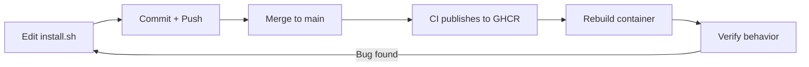
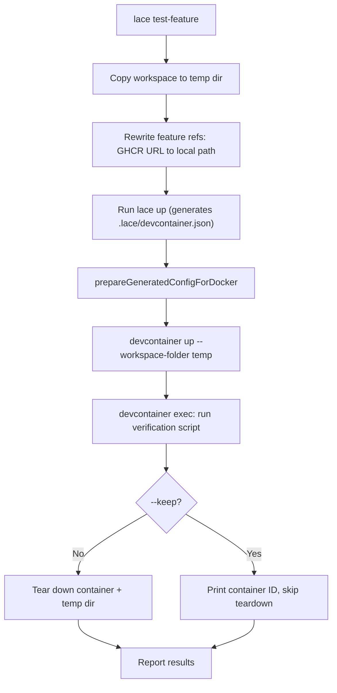

---
first_authored:
  by: "@claude-opus-4-6"
  at: 2026-03-25T12:00:00-07:00
task_list: lace/pre-publish-feature-testing
type: proposal
state: live
status: review_ready
tags: [devcontainer-features, testing, developer-experience, lace]
---

# Pre-Publish Feature Testing

> BLUF: Developing devcontainer features requires a full publish-to-GHCR cycle before
> container-level verification is possible.
> This proposal introduces a `lace test-feature` command and supporting workflow that
> builds a real container with local feature sources, runs verification scripts, and
> tears down: giving feature authors sub-minute feedback without touching the registry.

## Problem

The current feature development feedback loop:



Each cycle takes 5-15 minutes and requires a merge to main.
Bugs discovered at step F require repeating the entire loop.

The existing test infrastructure covers config generation (lace's `runUp` with `skipDevcontainerUp: true`) and the portless feature has `devcontainer features test` scenarios.
Neither exercises the feature's `install.sh` in a real container with the feature's full dependency graph.

The gap: there is no way to run `install.sh` inside a container built from the project's actual base image and `devcontainer.json` without publishing to GHCR first.

## Existing Infrastructure

### What works for config-generation tests

`scenario-utils.ts` provides `symlinkLocalFeature()` and `copyLocalFeature()` for referencing local feature sources in generated configs.
These are used with `skipDevcontainerUp: true` to test lace's config resolution pipeline without Docker.
`prepareGeneratedConfigForDocker()` rewrites absolute paths to relative paths for the devcontainer CLI.

### What works for feature unit tests

The `devcontainers/features/test/` directory contains `scenarios.json` + shell test scripts.
The `devcontainer features test` CLI command runs these: it builds a container with the feature and executes the test script.
The portless feature has working scenarios.
Other features (lace-fundamentals, wezterm-server, neovim, claude-code) lack test scenarios.

### What is missing

1. **Container-level verification against the project's own config.**
   The `devcontainer features test` command uses standalone `scenarios.json` with arbitrary base images.
   It does not test the feature as composed within the project's actual `devcontainer.json` (with its `dependsOn` graph, mounts, prebuild layers, and option injection from lace).
2. **Iterative local testing during development.**
   Editing `install.sh` and verifying the result requires either publishing or manually hacking paths.
   There is no `lace test-feature <name>` workflow.
3. **Verification scripts for most features.**
   Only portless has `test/` scenarios.
   lace-fundamentals has six install steps (staples, ssh-hardening, ssh-directory, chezmoi, git-identity, shell) with no automated post-install validation.

## Design

### Phase 1: Feature Test Scenarios for All Features

Add `devcontainer features test` scenarios for every feature in `devcontainers/features/src/`.

Each feature gets a `test/` directory following the existing portless pattern:

```
devcontainers/features/test/<feature-name>/
  scenarios.json       # base image + feature options per scenario
  test.sh              # default scenario verification
  <scenario-name>.sh   # named scenario verifications
```

Verification scripts check:
- Binaries are installed and on PATH
- Config files are written to expected locations
- Services start (where applicable, e.g., sshd)
- Options take effect (e.g., `defaultShell` changes the login shell)
- Idempotency: running install.sh twice does not break anything

These run via `devcontainer features test -f <feature-name> --base-path ./devcontainers/features/src`.

> NOTE(opus/pre-publish-feature-testing): `devcontainer features test` resolves local
> feature paths relative to `--base-path`, not the workspace root.
> The `--base-path` must point to the directory containing the feature source directories.

**Effort:** Low.
Shell scripts following the portless pattern.
No new tooling.

**Coverage gap filled:** Feature install.sh correctness in isolation.

### Phase 2: `lace test-feature` Command

A new lace CLI command that builds a container using the project's own `devcontainer.json` with local feature sources swapped in, runs verification, and tears down.

#### Usage

```sh
# Test lace-fundamentals against the current project config
lace test-feature lace-fundamentals

# Test with a specific base image override
lace test-feature lace-fundamentals --image node:24-bookworm

# Run only specific verification checks
lace test-feature lace-fundamentals --check ssh --check shell

# Keep container alive for interactive debugging
lace test-feature lace-fundamentals --keep
```

#### Workflow



#### Implementation details

The command reuses existing infrastructure:
- `copyLocalFeature()` from `scenario-utils.ts` copies feature sources into the temp workspace (symlinks are not followed by the devcontainer CLI's build context).
- `prepareGeneratedConfigForDocker()` rewrites absolute paths to relative `./features/<name>` paths.
- `cleanupWorkspaceContainers()` handles teardown.

Feature reference rewriting:
- Scan the source `devcontainer.json` for GHCR URLs matching the feature name pattern `ghcr.io/weftwiseink/devcontainer-features/<name>:<version>`.
- Also scan `customizations.lace.prebuildFeatures` for prebuild-phase features.
- Replace with the local path returned by `copyLocalFeature()`.
- Features not being tested retain their GHCR URLs.

Verification script discovery:
- Check `devcontainers/features/test/<name>/test.sh` first (Phase 1 scripts).
- Fall back to a generic health check: `install.sh` exit code 0 + basic binary presence checks from `devcontainer-feature.json` metadata.

> WARN(opus/pre-publish-feature-testing): The devcontainer CLI (v0.83.0) does not
> support absolute paths for local features, nor local feature paths when `--config`
> points outside `.devcontainer/`.
> `prepareGeneratedConfigForDocker()` works around this by copying the generated config
> back to `.devcontainer/devcontainer.json` and rewriting paths to relative.
> This is already proven in the existing Docker smoke tests.

**Effort:** Medium.
The path-rewriting and temp-workspace logic exists in `scenario-utils.ts`.
The new work is the CLI command, GHCR-to-local URL rewriting, and the verification runner.

**Coverage gap filled:** Feature behavior within the project's composed config, with real `dependsOn` resolution, mount declarations, and option injection.

### Phase 3: CI Integration

Add a GitHub Actions workflow that runs Phase 1 feature test scenarios on PRs that modify feature source files.

```yaml
name: "Feature Tests"
on:
  pull_request:
    paths:
      - 'devcontainers/features/src/**'

jobs:
  test-features:
    runs-on: ubuntu-latest
    steps:
      - uses: actions/checkout@v4
      - name: "Install devcontainer CLI"
        run: npm install -g @devcontainers/cli
      - name: "Test modified features"
        run: |
          # Detect which features changed
          CHANGED=$(git diff --name-only origin/main... | grep 'devcontainers/features/src/' | cut -d/ -f4 | sort -u)
          for feature in $CHANGED; do
            echo "Testing feature: $feature"
            devcontainer features test -f "$feature" --base-path ./devcontainers/features/src
          done
```

This catches install.sh regressions before merge, eliminating the most common class of post-publish failures.

> NOTE(opus/pre-publish-feature-testing): This workflow uses `devcontainer features test`,
> not `lace test-feature`.
> Phase 1 scenarios are standalone and do not require lace.
> Phase 2's `lace test-feature` is for local developer iteration and is not suited for CI
> (it requires the full lace runtime and project-specific config).

**Effort:** Low.
Standard GitHub Actions workflow.

### Phase 4: Pre-Commit Validation (Optional)

A lightweight pre-commit hook that catches the most common class of feature errors: shell syntax errors in `install.sh` and step scripts.

```sh
#!/bin/sh
# .githooks/pre-commit-feature-lint
for f in $(git diff --cached --name-only -- 'devcontainers/features/src/*/install.sh' 'devcontainers/features/src/*/steps/*.sh'); do
  if ! bash -n "$f"; then
    echo "Shell syntax error in $f"
    exit 1
  fi
done
```

This is fast (sub-second) and catches typos before they enter the commit history.
It does not catch runtime errors, missing dependencies, or behavioral regressions: those require container-level testing (Phases 1 and 2).

**Effort:** Minimal.

## Phasing and Priority

| Phase | Covers | Effort | Priority |
|-------|--------|--------|----------|
| 1: Feature test scenarios | install.sh correctness in isolation | Low | High: unblocks CI gating |
| 2: `lace test-feature` | Composed behavior with project config | Medium | Medium: developer experience |
| 3: CI workflow | PR-level regression gating | Low | High: prevents post-merge breakage |
| 4: Pre-commit hook | Shell syntax errors | Minimal | Low: nice-to-have |

Recommended order: Phase 1, then Phase 3 (they are independent of Phase 2), then Phase 2, then Phase 4.
Phase 1 + Phase 3 together provide the highest value-to-effort ratio: feature install.sh is validated in CI before merge.
Phase 2 is the quality-of-life improvement for iterative development.

## Alternatives Considered

### Docker-in-Docker test harness in vitest

Extend the existing `docker_smoke.test.ts` pattern to test features directly.
Rejected because:
- The smoke tests use `runPrebuild()` which builds from a Dockerfile, not from `devcontainer features test`.
- Building a feature into a container within vitest requires either shelling out to `devcontainer features test` (at which point the vitest wrapper adds no value) or reimplementing the feature installation logic.
- The `devcontainer features test` CLI already handles feature isolation, dependency resolution, and test script execution.

### Mounting features into a running container

Instead of building a new container, mount the feature directory into an existing container and run `install.sh` manually.
Rejected because:
- `install.sh` runs as root during image build, not at container runtime. Running it in a running container has different filesystem state, user context, and environment variables.
- `dependsOn` resolution only happens during `devcontainer build`/`up`, not at runtime. Manual installation skips the dependency graph entirely.
- This approach cannot validate that the feature's `devcontainer-feature.json` metadata is correct.

### Temporary GHCR publish to a dev tag

Publish to `ghcr.io/weftwiseink/devcontainer-features/<name>:dev` from a branch, then test against that tag.
Rejected because:
- Still requires a push + CI round-trip (even if not to main).
- Pollutes the GHCR namespace with dev tags that need cleanup.
- Does not improve the local iteration loop.

## Open Questions

1. **Feature test scenario coverage depth.**
   How thorough should Phase 1 verification scripts be?
   The portless tests check binary presence and version output.
   lace-fundamentals has six install steps: should each step get its own scenario, or is a single end-to-end scenario sufficient?
   Recommendation: one default scenario per feature that checks critical post-conditions, plus named scenarios for option variations (e.g., `enableSshHardening=false`).

2. **Base image matrix.**
   Should feature tests run against multiple base images (Debian, Alpine, Ubuntu)?
   The current features target Debian/Ubuntu.
   Alpine support is partial (staples.sh detects `apk` but other steps are untested).
   Recommendation: start with the primary base image only.
   Add Alpine when there is demand.

3. **`lace test-feature` and prebuild interaction.**
   If the feature under test is in `prebuildFeatures` (like `lace-fundamentals`), should `lace test-feature` run the prebuild pipeline or the regular feature pipeline?
   The prebuild path builds a Docker image with `devcontainer build` and rewrites the Dockerfile.
   The regular path includes features in `devcontainer up`.
   Recommendation: test through the regular feature pipeline by default.
   The prebuild pipeline is an optimization that should not affect feature install behavior.
