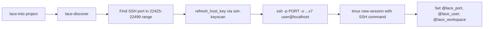
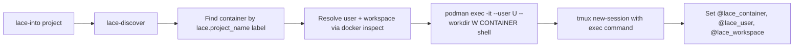

---
first_authored:
  by: "@claude-opus-4-6-20250725"
  at: 2026-03-26T10:07:00-07:00
task_list: lace/podman-migration
type: proposal
state: archived
status: implementation_accepted
tags: [architecture, podman, ssh, migration, lace_into]
last_reviewed:
  status: accepted
  by: "@mjr"
  at: 2026-03-26T14:30:00-07:00
  round: 3
---

# Podman Exec Container Entry: SSH Replacement for lace Entry Tooling

> BLUF: Replace SSH with `podman exec` as the container entry transport in `lace-into`, `lace-split`, `lace-disconnect-pane`, and `lace-paste-image`.
> This eliminates the SSH infrastructure from the entry path (host key management, SSH arg construction, port-based container identity, `authorized_keys` mounting) while retaining the existing tmux session-per-project UX.
> Container identity shifts from SSH port (`@lace_port`) to container name (`@lace_container`), which is stable across container restarts and removes the dominant source of tmux metadata staleness.
> The port allocator, sshd feature, and template system remain in the ecosystem for service exposure use cases: only the entry path changes.
> WezTerm is deprecated and excluded from this proposal.
> Sprack code changes are out of scope except for the minimal `@lace_port` -> `@lace_container` rename in sprack-poll and sprack-db, which is a direct dependency of the migration.
> Breakage is acceptable: no backwards-compatible shims.

## Summary

This proposal covers the transport swap from SSH to `podman exec` across six bin scripts and the `lace-fundamentals` devcontainer feature.
It includes a detailed analysis of which `@lace_*` tmux metadata fields survive the migration, which become unnecessary, and which gain new alternatives via `podman inspect`.
The viability report at `cdocs/reports/2026-03-26-podman-exec-migration-viability.md` provides the analytical foundation.
The stale metadata RFP at `cdocs/proposals/2026-03-25-rfp-stale-tmux-lace-metadata.md` documents the problem this migration solves at its root.

> NOTE(opus/lace/podman-migration): This proposal uses "podman" throughout, but the implementation should use whichever container runtime is active.
> The scripts already use `docker` CLI commands (which may be podman-aliased via `podman-docker`).
> A `resolve_runtime()` helper is introduced in Phase 1 to abstract this.

## Objective

Replace SSH-based container entry with `podman exec` in all lace entry tooling.
Eliminate SSH as a required transport for interactive shell access to devcontainers.
Shift container identity from port-based to name-based, removing the root cause of tmux metadata staleness.
Preserve the tmux session-per-project UX and `lace-into`/`lace-split` workflow.

## Background

### Current SSH-based entry flow



Every connection constructs an SSH command with 7 options (`IdentityFile`, `IdentitiesOnly`, `UserKnownHostsFile`, `StrictHostKeyChecking`, `ControlMaster`, `ControlPath`, `ControlPersist`).
This is duplicated in `lace-into`, `lace-split`, and `lace-paste-image`.
The SSH port is the primary container identifier, stored in tmux metadata and used by sprack for container detection.

The SSH layer causes three persistent failure modes:
1. **Port staleness**: container rebuilds change the SSH port, but tmux sessions retain the old `@lace_port`, causing "connection refused" on splits and reconnections.
2. **Host key rotation**: every rebuild requires `ssh-keyscan` to refresh `~/.ssh/lace_known_hosts`, or SSH prompts/refuses the connection.
3. **Key provisioning**: the `authorized_keys` bind mount must exist before container creation, adding a host-side file dependency.

### Proposed podman exec entry flow



No SSH options, no host key management, no port allocation for entry.
Container identity is the container name (derived from `lace.project_name` label), which is deterministic and stable across stop/start cycles.

### Viability report

`cdocs/reports/2026-03-26-podman-exec-migration-viability.md` analyzes the full SSH footprint (~1,200 lines across 12+ files), the `podman exec` replacement for each use case, and the cost/benefit tradeoffs.
This proposal focuses on design and implementation; the viability report provides the analytical backing.

> NOTE(opus/lace/podman-migration): This proposal has a transitive dependency on `cdocs/proposals/2026-03-26-podman-first-core-runtime.md`, which makes the core TypeScript package podman-aware.
> On podman-only systems (no `podman-docker`), `lace up` must work with podman before the bin scripts can connect to containers via `podman exec`.
> The core runtime proposal should be implemented first.

## Proposed Solution

### 1. Container runtime abstraction

Introduce a `resolve_runtime()` function in a shared location (`bin/lace-lib.sh` or inline in each script) that returns the active container CLI:

```bash
resolve_runtime() {
  # Respect CONTAINER_RUNTIME env var override (consistent with TypeScript resolveContainerRuntime())
  if [ -n "${CONTAINER_RUNTIME:-}" ]; then
    case "$CONTAINER_RUNTIME" in
      podman|docker)
        echo "$CONTAINER_RUNTIME"
        return
        ;;
      *)
        echo "WARNING: CONTAINER_RUNTIME='$CONTAINER_RUNTIME' is not valid (expected podman or docker). Auto-detecting." >&2
        ;;
    esac
  fi

  if command -v podman &>/dev/null; then
    echo "podman"
  elif command -v docker &>/dev/null; then
    echo "docker"
  else
    echo "ERROR: No container runtime found. Install podman or docker." >&2
    return 1
  fi
}
```

All scripts use `$RUNTIME` (result of `resolve_runtime()`) instead of hardcoding `docker`.
This applies to all six bin scripts: `lace-into`, `lace-split`, `lace-discover`, `lace-disconnect-pane`, `lace-paste-image`, and `lace-inspect`.
`lace-discover` and `lace-inspect` currently hardcode `docker` throughout and need the same treatment.
This is a low-risk change that can land independently.

### 2. lace-discover: label-based discovery without port requirement

`lace-discover` drops the SSH port range scan as a container filter.
Discovery becomes: find containers with the `devcontainer.local_folder` label, extract `lace.project_name` (or fall back to `basename` of local_folder).

Output format changes:

**Text mode (current)**: `name:port:user:path:workspace`
**Text mode (new)**: `name:container_name:user:path:workspace`

**JSON mode (current)**: `{"name", "port", "user", "path", "workspace", "container_id"}`
**JSON mode (new)**: `{"name", "container_name", "container_id", "user", "path", "workspace"}`

The `port` field is removed from the primary output.
The `container_name` field is added: the Docker/podman container name as returned by `$RUNTIME inspect --format '{{.Name}}'`.
This is the sanitized name that `lace up` sets via `--name` from `sanitizeContainerName(projectName)` in TypeScript.
`lace-discover` obtains it from `$RUNTIME inspect`, not from the `lace.project_name` label (which stores the raw, unsanitized project name).
`@lace_container` must store this sanitized inspect-derived name, since `podman exec` requires the actual container name.

User resolution is unchanged: `devcontainer.metadata` `remoteUser` -> `Config.User` -> default `node`.
Workspace resolution is unchanged: `CONTAINER_WORKSPACE_FOLDER` env var from the container.

> NOTE(opus/lace/podman-migration): Containers without `lace.project_name` labels (pre-lace or non-lace containers) are still discoverable via `devcontainer.local_folder`.
> The fallback to `basename` of local_folder is preserved.

### 3. lace-into: podman exec transport

The core connection functions `do_connect()` and `do_connect_pane()` change from SSH to `podman exec`.

**Container entry command construction:**

```bash
exec_cmd=(
  "$RUNTIME" exec -it
  --user "$user"
  --workdir "$workspace"
  "$container_name"
  "$shell"
)
```

Where `$shell` is resolved from the container's configured login shell (defaulting to `/bin/bash -l`).
The `--workdir` flag replaces the SSH `cd $workspace && exec $SHELL -l` pattern.

**Key changes in lace-into:**

| Function | SSH behavior | Podman exec behavior |
|----------|-------------|---------------------|
| `discover()` output | Parses `name:port:user:path:ws` | Parses `name:container_name:user:path:ws` |
| `refresh_host_key()` | ssh-keyscan + known_hosts update | Removed entirely |
| `resolve_user_for_port()` | Queries discover by port | Becomes `resolve_user_for_container()`, queries by container name |
| `do_connect()` | Builds SSH args array, creates tmux session | Builds exec args array, creates tmux session |
| `do_connect_pane()` | Respawns pane with SSH | Respawns pane with exec |
| tmux metadata | `@lace_port`, `@lace_user`, `@lace_workspace` | `@lace_container`, `@lace_user`, `@lace_workspace` |
| Session identity check | Compares `@lace_port` for name collision | Compares `@lace_container` for name collision |
| `LACE_PORT` env var | `tmux new-session -e LACE_PORT=$port` | `tmux new-session -e LACE_CONTAINER=$container_name` |

**Dead pane recovery** works the same way: `lace-into` detects dead panes via `remain-on-exit failed`, reads `@lace_container` from the session, and `respawn-pane` with the exec command.
The critical improvement is that `@lace_container` does not change on container restart (only on full remove+recreate), so respawns succeed without re-discovery.

**start_and_connect()** changes minimally: after `lace up` completes, re-discovery uses `lace-discover` which returns container name instead of port.
The retry loop checks for a running container by `devcontainer.local_folder` label (same as today), but connects via container name instead of port.

### 4. lace-split: podman exec splits

`lace-split` changes the container pane detection from SSH-based to metadata-based:

**Detection (current):**
1. Check pane-level `@lace_port`
2. Fallback: check `pane_current_command == "ssh"`

**Detection (new):**
1. Check pane-level `@lace_container`
2. No fallback needed: there is no ambient process name to detect (podman exec processes show as the container shell, not as "podman")

> WARN(opus/lace/podman-migration): The `pane_current_command == "ssh"` fallback for ad-hoc SSH panes is lost.
> Users who manually SSH into containers without `lace-into` will not get container-aware splits.
> This is acceptable: the migration explicitly drops SSH from the entry path.

**Split command construction:**

```bash
container=$(tmux show-option -pqv @lace_container 2>/dev/null)
user=$(tmux show-option -pqv @lace_user 2>/dev/null)
ws=$(tmux show-option -pqv @lace_workspace 2>/dev/null)

new_pane=$(tmux split-window "$DIRECTION" -PF '#{pane_id}' \
  "$RUNTIME" exec -it --user "${user:-node}" --workdir "$ws" "$container" /bin/bash -l)

tmux set-option -p -t "$new_pane" @lace_container "$container"
[ -n "$user" ] && tmux set-option -p -t "$new_pane" @lace_user "$user"
[ -n "$ws" ] && tmux set-option -p -t "$new_pane" @lace_workspace "$ws"
```

### 5. lace-disconnect-pane: metadata cleanup

Changes from clearing `@lace_port` to clearing `@lace_container`:

```bash
tmux set-option -pu -t "$pane_id" @lace_container 2>/dev/null || true
tmux set-option -pu -t "$pane_id" @lace_user 2>/dev/null || true
tmux set-option -pu -t "$pane_id" @lace_workspace 2>/dev/null || true
```

No other changes.
The `respawn-pane -k` with the default shell remains identical.

### 6. lace-paste-image: podman cp replaces SCP

`lace-paste-image` replaces SCP-over-SSH with `podman cp`:

**Current flow:**
1. Save clipboard image to local temp file
2. SCP with 7 SSH options to remote `/tmp/`
3. Paste remote path as literal text

**New flow:**
1. Save clipboard image to local temp file
2. `$RUNTIME cp $local_path $container_name:/tmp/$(basename $local_path)`
3. Paste remote path as literal text

**Detection change:**
The current detection checks `pane_current_command == "ssh"`.
The new detection checks for `@lace_container` pane-level metadata.
If present, the pane is a container pane; if absent, pass through `Ctrl+V`.

```nu
let container = (lace-option $pane_id "@lace_container")
if ($container | is-empty) {
  do $passthrough
  return
}

# podman cp replaces SCP
let remote_path = $"/tmp/(($local_path | path basename))"
^$runtime cp $local_path $"($container):($remote_path)"
tmux send-keys -l -t $pane_id $remote_path
```

The entire SSH option array and SCP invocation are removed.

### 7. lace-fundamentals feature: SSH removal from entry path

The `lace-fundamentals` devcontainer feature removes SSH-specific steps from the default entry path.
The sshd feature dependency **remains available** (not removed from the ecosystem) but is no longer required by `lace-fundamentals`.

**Changes to `devcontainer-feature.json`:**

- Remove `"ghcr.io/devcontainers/features/sshd:1": {}` from `dependsOn`.
- Remove the `sshPort` option (no longer drives entry).
- Remove the `authorized-keys` mount declaration from `customizations.lace.mounts`.
- Remove the `sshPort` entry from `customizations.lace.ports`.

**Changes to install steps:**

- Remove `steps/ssh-hardening.sh` (no sshd to harden).
- Remove `steps/ssh-directory.sh` (no SSH directory needed).
- Remove the `$SSH_PORT` and `$ENABLE_SSH_HARDENING` variables from `install.sh`.

**Retained steps** (SSH-independent):
- `steps/staples.sh`: core utilities (curl, jq, less).
- `steps/chezmoi.sh`: dotfiles integration.
- `steps/git-identity.sh`: git config.
- `steps/shell.sh`: default shell configuration.

> NOTE(opus/lace/podman-migration): The sshd feature (`ghcr.io/devcontainers/features/sshd:1`) is still available in the feature registry.
> Projects that need SSH access (e.g., for remote tooling, VS Code remote SSH, or service exposure) can add it explicitly to their `devcontainer.json`.
> It is removed from `lace-fundamentals`'s default dependency chain only.

### 8. lace-inspect: remove sshd check

`lace-inspect` removes the "sshd running" check from the in-container verification section.
This check (`pgrep -x sshd`) is no longer relevant for the default entry path.
Replace with a container connectivity check: `$RUNTIME exec $name echo ok`.

## Important Design Decisions

### Container name as primary identifier (not container ID)

Container name is chosen over container ID because:
- The name is human-readable and deterministic (derived from `sanitizeContainerName(projectName)`).
- The name is used as the tmux session name, creating a natural 1:1 mapping.
- `podman exec` accepts both name and ID, but names are easier to reason about.
- Container IDs change on every `devcontainer up --remove-existing-container`, but the name is re-derived from the same project name.

Container ID is still available from `lace-discover` JSON output for tools that need it.

> NOTE(opus/lace/podman-migration): The container name derivation (`sanitizeContainerName(projectName)`) and the sprack feature's `${lace.projectName}` substitution must produce compatible strings.
> Verify during implementation that these two derivations yield identical values, or document any normalization differences.

### `@lace_container` stores the container name, not the container ID

Using the name (not the 64-char hex ID) because:
- It matches the tmux session name (no mapping table needed).
- It survives `docker stop` / `docker start` cycles.
- It is readable in `tmux show-options` output.
- If the container is fully removed and recreated, the name is re-derived identically from the project name.

### Shell resolution for exec

The exec command needs a shell path.
Options considered:

1. **Hardcode `/bin/bash -l`**: simple, works for all current lace containers.
   Breaks if a container does not have bash.
2. **Use the container's configured shell**: query via `$RUNTIME exec $container getent passwd $user | cut -d: -f7`.
   Adds a round-trip on every connection.
3. **Use `$SHELL` from the container environment**: available from `$RUNTIME inspect`.
   May not reflect the actual login shell if `lace-fundamentals` changed it.

Decision: use `/bin/bash -l` as default, with an override via `@lace_shell` metadata if set.
The `lace-fundamentals` feature sets the default shell at install time; a future enhancement can propagate this to the tmux metadata.
This matches the current behavior: SSH's `exec $SHELL -l` resolves to whatever the container's login shell is, but `lace-split` already hardcodes a shell assumption.

> TODO(opus/lace/podman-migration): Query the container's login shell once during `lace-into` connection setup and store it in `@lace_shell`.
> This should be part of Phase 2 or 3: the migration is the natural moment to improve shell resolution, since the exec command already needs a shell path.
> This makes splits use the correct shell for containers with non-bash defaults (e.g., nushell).

### Port allocator and template system: retained for non-SSH features

The port allocator (`port-allocator.ts`), template resolver (`${lace.port()}`), and port injection pipeline in `up.ts` are preserved.
Features like `portless` still declare ports in their `devcontainer-feature.json` and need host-to-container port mapping.

The change in `up.ts` is limited: stop auto-injecting the sshd port for `lace-fundamentals` (since it no longer declares `sshPort` in its ports metadata).
All other features' port declarations continue to work unchanged.

### No backwards-compatible shim

Per the user constraint, no shim that falls back to SSH when podman exec fails.
Scripts are rewritten to use podman exec exclusively.
If `podman exec` is unavailable (e.g., rootless podman socket not accessible), the connection fails with a clear error.

## tmux Metadata Analysis

Analysis of each `@lace_*` option: who reads it, whether podman provides a better alternative, and the migration decision.

### `@lace_port` -> removed, replaced by `@lace_container`

| Aspect | Detail |
|--------|--------|
| Current readers | `lace-split` (pane-level), `lace-into` (session-level, for collision detection), `lace-paste-image` (pane-level, for SCP), sprack-poll (session-level, for container detection) |
| Podman alternative | Container name: `@lace_container`. Stable across restarts. Derivable from tmux session name (they match). |
| Decision | **Remove**. Replace with `@lace_container` everywhere. |

### `@lace_user` -> retained

| Aspect | Detail |
|--------|--------|
| Current readers | `lace-split` (pane-level), `lace-paste-image` (pane-level), `lace-into` (session-level) |
| Podman alternative | Could be derived from `$RUNTIME inspect --format '{{.Config.User}}'`, but this adds a subprocess call per split. The user is stable for the container's lifetime. |
| Decision | **Retain**. Set once by `lace-into`, propagated by `lace-split`. Same semantics. |

### `@lace_workspace` -> retained, with podman-derivable fallback

| Aspect | Detail |
|--------|--------|
| Current readers | `lace-split` (pane-level), `lace-into` (session-level), sprack-poll (session-level) |
| Podman alternative | Derivable from `$RUNTIME inspect` via `CONTAINER_WORKSPACE_FOLDER` env var. This is the same source `lace-discover` uses today. |
| Decision | **Retain** as primary source. Add `podman inspect` as a recovery mechanism for the `@lace_workspace` flakiness described in the stale metadata RFP. If `@lace_workspace` is empty but `@lace_container` is set, `lace-split` can query `$RUNTIME inspect` to recover the workspace. |

### Session-level vs pane-level metadata: unchanged architecture

Both session-level and pane-level metadata continue to be set.
Session-level: set by `lace-into` for the whole session (used by sprack, `lace-into` collision detection).
Pane-level: set by `lace-into` on the initial pane and propagated by `lace-split` to new panes (used by `lace-split`, `lace-paste-image`, `lace-disconnect-pane`).

### Container name derivability from tmux session name

A notable property of the new design: the container name and the tmux session name are derived from the same source (`sanitizeContainerName(projectName)`).
This means `@lace_container` is redundant with the session name for the common case.

However, `@lace_container` is still needed because:
- Pane-mode (`lace-into --pane`) can connect a pane to a different container than the session's default.
- A session could have panes connected to multiple containers.
- Pane-level metadata must be explicit, not inferred from the session name.

## Edge Cases / Challenging Scenarios

### Container not running

If the container is stopped, `podman exec` fails immediately with a clear error ("container is not running").
This is better than the SSH case (connection timeout or "connection refused" with no indication of why).
`lace-into --start` handles this the same way: run `lace up`, wait for the container, then connect.

### Transient failure during container rebuild

During `devcontainer up --remove-existing-container`, there is a window between container removal and recreation where the container name does not exist.
If `lace-split` or `lace-paste-image` fires during this window, `podman exec` fails.
This is the same failure class as SSH (port unreachable during rebuild), but with a clearer error message ("no such container" vs "connection refused").
The window is short (typically under 5 seconds) and the dead pane recovery mechanism handles post-rebuild reconnection: the pane enters `remain-on-exit failed` state, and the next `lace-into` invocation respawns it with the same `@lace_container` value (which resolves again once the new container starts with the same name).
This is acceptable: the transient failure window exists today and the recovery path is unchanged.

### Container name collision

`sanitizeContainerName()` can produce the same name for different projects (e.g., `my-project!` and `my-project?` both become `my-project`).
This is an existing issue (the container name is already set via `--name` in `up.ts`).
Docker/podman rejects the second `docker run --name X` if a container with that name exists.
The migration does not change this behavior.

### Multiple containers with the same project name

If two workspace folders produce the same project name, `lace-discover` returns both.
The current port-based approach naturally disambiguates (different ports).
With container names, the names would collide at `docker run` time.
The existing `resolveContainerName()` already handles `--name` conflicts via the `runArgs` check.
`lace-into` disambiguates sessions by appending the container ID if a collision is detected.

### `pane_current_command` detection loss

`lace-split` loses the `pane_current_command == "ssh"` fallback.
Users who SSH manually into containers (not via `lace-into`) will not get container-aware splits.
Mitigation: `lace-into --pane` is the supported way to connect a pane.
The fallback was a convenience, not a primary flow.

### Container shell not being bash

If a container does not have `/bin/bash`, the exec command fails.
Mitigation: `lace-fundamentals` installs bash via `staples.sh` (bash is nearly universal in devcontainers).
A future enhancement can detect the shell from the container.

### Rootless podman socket access

If podman runs rootless and the socket is not accessible from the tmux session's environment, `podman exec` fails.
This is the same failure mode as the current `docker` commands throughout lace.
No new risk.

## Test Plan

### Unit-level: `bin/test/test-lace-into.sh`

The existing test harness mocks `ssh`, `docker`, and `lace-discover`.
Changes:

1. Replace `ssh` mock expectations with `podman exec` (or `docker exec`) mock expectations.
2. Update `lace-discover` mock output to return `container_name` instead of `port`.
3. Update all `@lace_port` assertions to `@lace_container`.
4. Add test cases:
   - Container not running: verify clear error message.
   - Missing `@lace_container` metadata: verify `lace-split` creates local split.
   - `lace-disconnect-pane`: verify `@lace_container` is cleared.
   - `lace-paste-image`: verify `podman cp` is called instead of `scp`.
   - `start_and_connect()` flow: verify `lace up` + re-discovery loop with container-name-based parsing.

### Integration-level: manual verification

1. `lace-into lace`: creates tmux session, pane runs inside container.
2. `lace-split -h` in a container pane: new pane opens in same container.
3. `lace-split -h` in a local pane: new pane opens locally.
4. `lace-disconnect-pane`: pane respawns with local shell.
5. `lace-into --start lace`: starts stopped container, connects.
6. `lace-into --pane lace`: connects current pane to container.
7. Container stop/start: `lace-into` reconnects without metadata refresh.

### Regression checks

1. Port allocator tests (445+ in `packages/lace/`): should pass unchanged (port system is retained).
2. `lace-discover --json` output: validate new schema with `jq`.
3. `lace-inspect`: verify no sshd check, verify exec connectivity check.

## Sprack Integration Boundary

> NOTE(opus/lace/podman-migration): Sprack code changes are out of scope for this proposal.
> This section sketches the integration boundary that a companion sprack proposal must address.

Sprack currently couples to lace's entry tooling at two points:

1. **sprack-poll** (`tmux.rs`): reads `@lace_port` from tmux session options as the signal that a session is a container session.
   Post-migration, this changes to `@lace_container`.
   The detection logic (`lace_port.is_some()`) becomes `lace_container.is_some()`.

2. **sprack-claude** (`resolver.rs`): `LaceContainerResolver` uses `@lace_workspace` to find Claude Code session files via bind mount path enumeration.
   This is unchanged by the podman migration: `@lace_workspace` is retained.
   The resolver's bind mount path enumeration is independent of how the container was entered.

Sprack will consume container state via the mount from the companion sprack feature proposal.
The sprack-lace decoupling RFP (`cdocs/proposals/2026-03-25-rfp-sprack-lace-decoupling.md`) already identifies the tight coupling and proposes approaches for a generic integration bridge.

> NOTE(opus/lace/podman-migration): Sprack rework around the podman migration and a new sprack devcontainer feature is pending follow-up work.
> Deeper decoupling (config file discovery, hook event bridge) should be designed in a separate proposal.
> However, the minimal sprack-poll and sprack-db changes below are a direct dependency of Phase 2 and are in scope for this proposal.
> Without them, sprack cannot detect container sessions after the `@lace_port` -> `@lace_container` rename.

**Minimal sprack change (in scope, Phase 2 dependency):**

In `sprack-poll/src/tmux.rs`, the session metadata query changes from:
- `@lace_port` -> `@lace_container`

In `sprack-db/src/schema.rs`, the column changes from:
- `lace_port INTEGER` -> `lace_container TEXT`

This is a type change (integer to text), not just a rename, requiring a schema migration in sprack-db.
The `lace_user` and `lace_workspace` columns are unchanged.

In `tree.rs`, sessions are grouped by `lace_port` for host grouping; this changes to grouping by `lace_container`.
The rendering may need minor adjustment since the grouping key changes from a port number to a container name.

## Implementation Phases

### Phase 1: Foundation (no behavior change)

**Goal:** Lay infrastructure for the migration without changing any user-facing behavior.

1. **Introduce `resolve_runtime()` helper** in `bin/lace-lib.sh` (or inline in each script).
   Returns `podman` or `docker` based on availability.
   Respects `CONTAINER_RUNTIME` env var override, matching the TypeScript `resolveContainerRuntime()` in the prerequisite core runtime proposal.
   All existing `docker` calls in all six bin scripts (`lace-into`, `lace-split`, `lace-discover`, `lace-disconnect-pane`, `lace-paste-image`, `lace-inspect`) use `$RUNTIME` instead.

2. **Apply `$RUNTIME` to `lace-discover`** as an explicit deliverable.
   `lace-discover` currently hardcodes `docker` in six places (lines 44, 87, 97, 110, 116, 126).
   Replace all with `$RUNTIME`.
   Add `container_name` to output alongside the existing `port` field.
   JSON mode: add `"container_name"` field.
   Text mode: no change yet (consumers parse positionally).
   The container name is resolved from `lace.project_name` label -> `docker inspect --format '{{.Name}}'`.

3. **Add `lace-lib.sh` shared functions file** (optional: inline in each script if shared lib is too heavy).
   Contains `resolve_runtime()` and `resolve_container_shell()`.

**Verification:** All existing tests pass. `lace-discover --json` output includes `container_name`. No behavior change.

### Phase 2: Core transport swap (lace-into + lace-split)

**Goal:** Replace SSH with podman exec in the primary entry and split paths.

1. **Rewrite `lace-discover`** to use label-based discovery without SSH port requirement.
   Text output format changes to `name:container_name:user:path:workspace`.
   JSON output drops `port`, adds `container_name`.
   Containers without SSH ports are now discoverable.

2. **Rewrite `do_connect()` and `do_connect_pane()` in `lace-into`.**
   Steps 1 and 2 must land atomically: `lace-into` parses `lace-discover` output, so the format change and parser change must be coordinated.
   Replace SSH arg construction with `$RUNTIME exec -it --user $user --workdir $workspace $container_name /bin/bash -l`.
   Replace `@lace_port` with `@lace_container` in all tmux metadata writes.
   Remove `refresh_host_key()` entirely.
   Remove `LACE_SSH_KEY`, `LACE_KNOWN_HOSTS` constants.
   Update `resolve_user_for_port()` -> `resolve_user_for_container()`.
   Update session collision check from port comparison to container name comparison.

3. **Rewrite `lace-split`.**
   Replace `@lace_port` reads with `@lace_container`.
   Replace SSH command construction with exec command construction.
   Remove `pane_current_command == "ssh"` fallback.
   Propagate `@lace_container` to new panes.

4. **Update `lace-disconnect-pane`.**
   Clear `@lace_container` instead of `@lace_port`.

5. **Update sprack-poll and sprack-db** (co-landing requirement).
   Rename `@lace_port` read to `@lace_container` in `sprack-poll/src/tmux.rs`.
   Migrate `lace_port INTEGER` column to `lace_container TEXT` in `sprack-db/src/schema.rs` (type change requires schema migration).
   Update `tree.rs` host grouping from port to container name.
   This must land atomically with steps 2-4: once `lace-into` writes `@lace_container` instead of `@lace_port`, sprack-poll must read the new field.
   Since breakage is acceptable, there is no backwards-compatible dual-read period.

6. **Update `bin/test/test-lace-into.sh`.**
   Replace mock expectations and assertions per the test plan.

**Verification:**
- `test-lace-into.sh` passes with new assertions.
- Manual: `lace-into <project>` opens a container shell via exec, not SSH.
- Manual: `lace-split` in a container pane opens another container shell.
- Manual: `lace-disconnect-pane` returns to local shell.
- Manual: `tmux show-options -t <project>` shows `@lace_container` instead of `@lace_port`.

### Phase 3: Ancillary scripts

**Goal:** Migrate remaining scripts that depend on SSH.

1. **Rewrite `lace-paste-image`.**
   Replace SCP with `$RUNTIME cp`.
   Replace `pane_current_command == "ssh"` detection with `@lace_container` metadata check.
   Remove all SSH option arrays.

2. **Update `lace-inspect`.**
   Remove sshd check (`pgrep -x sshd`).
   Add exec connectivity check (`$RUNTIME exec $name echo ok`).

3. **Update `lace-into --status` output format.**
   Replace `PORT` column with `CONTAINER` column.

4. **Update `lace-into --dry-run` output.**
   Show `$RUNTIME exec` command instead of SSH command.

5. **Update `lace-into --help` text.**
   Remove SSH references, document podman exec behavior.

**Verification:**
- `lace-paste-image` copies clipboard image into container via `podman cp`.
- `lace-inspect` shows exec connectivity instead of sshd status.
- `lace-into --status` shows container names.
- `lace-into --dry-run` shows exec commands.

### Phase 4: Feature cleanup

**Goal:** Remove SSH from `lace-fundamentals` default dependency chain.

1. **Update `devcontainer-feature.json`.**
   Remove `sshd:1` from `dependsOn`.
   Remove `sshPort` option.
   Remove `authorized-keys` mount from `customizations.lace.mounts`.
   Remove `sshPort` entry from `customizations.lace.ports`.

2. **Delete `steps/ssh-hardening.sh`.**

3. **Delete `steps/ssh-directory.sh`.**

4. **Update `install.sh`.**
   Remove `SSH_PORT` and `ENABLE_SSH_HARDENING` variables.
   Remove sourcing of deleted steps.

5. **Update `up.ts` pipeline** (limited change).
   The port injection for `lace-fundamentals`'s `sshPort` is driven by the feature's metadata.
   Since `sshPort` is removed from the feature's port declarations, no port is allocated for it.
   No code change in `up.ts` itself: the metadata-driven approach handles this automatically.

6. **Bump `lace-fundamentals` version** to `2.0.0` (breaking change: sshd no longer included by default).
   Update the feature description string to remove "hardened SSH" references.

**Verification:**
- `lace up` builds a container without sshd (unless explicitly added by the project).
- Container starts without SSH-related bind mounts.
- `lace-into` connects via exec without SSH.
- Port allocator tests pass (non-SSH features still get ports).

### Phase 5: Host-side cleanup

**Goal:** Remove host-side SSH artifacts that are no longer needed for entry.

1. **Remove `~/.config/lace/ssh/` key pair references** from documentation.
   The key pair itself is not deleted (user may have other uses), but lace no longer requires or generates it.

2. **Remove `~/.ssh/lace_known_hosts` management** from all scripts.
   No script references this file post-migration.

3. **Update `lace-into` help text** to remove references to SSH keys and known_hosts.

4. **Update any README/documentation** that references SSH-based entry.

**Verification:** No script references `LACE_SSH_KEY`, `LACE_KNOWN_HOSTS`, `ssh-keyscan`, or `ssh-keygen`.

## Open Questions

1. **Shell resolution**: Should `lace-into` query the container's login shell once and store it in `@lace_shell`?
   This adds one `$RUNTIME exec` call at connection time but makes splits use the correct shell.
   Current proposal defaults to `/bin/bash -l`.

2. **`lace-discover` text format break**: The positional text format change (`port` -> `container_name` in field 2) breaks any external consumers.
   Are there external consumers of the text format beyond `lace-into`?
   If so, should a deprecation period be added?
   The JSON format is more stable and should be preferred by external tools.

3. **Container name vs tmux session name alignment**: Should `lace-into` enforce that the tmux session name exactly matches the container name?
   They are derived from the same source, but `lace-into` appends suffixes for collision avoidance (e.g., `project-22425` for port conflicts).
   Post-migration, the disambiguation suffix is the first 8 characters of the container ID (e.g., `project-a1b2c3d4`).
