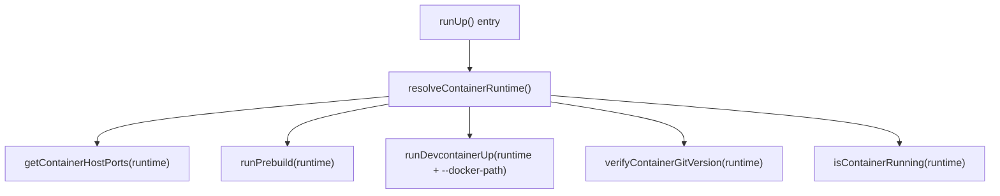

---
first_authored:
  by: "@claude-opus-4-6-20250725"
  at: 2026-03-26T18:30:00-07:00
task_list: lace/podman-migration
type: proposal
state: live
status: wip
tags: [architecture, podman, migration, runtime_detection]
last_reviewed:
  status: revision_requested
  by: "@claude-opus-4-6-20250725"
  at: 2026-03-26T19:45:00-07:00
  round: 2
---

# Podman-First Container Runtime for lace Core TypeScript Package

> BLUF: Make `packages/lace/` runtime-agnostic by introducing a `resolveContainerRuntime()` function that prefers `podman` and falls back to `docker`, then threading the resolved runtime through all five call sites that hardcode `"docker"` as a subprocess command.
> The change is mechanical: all docker CLI calls already go through the injectable `RunSubprocess` interface, so the migration is a string substitution of the command name at each call site.
> The `devcontainer` CLI calls (`devcontainer up`, `devcontainer build`) gain a `--docker-path` flag pointing to the resolved runtime, ensuring the devcontainer CLI uses the same binary lace detected.
> The mount policy blocklist in `user-config.ts` gains podman-equivalent entries (`~/.local/share/containers`, podman socket paths).
> This proposal is a prerequisite for the companion proposal at `cdocs/proposals/2026-03-26-podman-exec-container-entry.md`, which assumes the core package works with podman.
> Total scope: 5 call sites in 4 source files, 2 devcontainer CLI integration points, 1 mount policy update, and corresponding test updates.

## Summary

The lace TypeScript core (`packages/lace/src/`) hardcodes `"docker"` as the CLI command in five locations across four files.
All calls go through the mockable `RunSubprocess` interface, making the migration a matter of resolving the runtime once at startup and passing it through.
The devcontainer CLI (used for `up` and `build`) has a `--docker-path` flag that must be passed when `podman-docker` is not installed.

> NOTE(opus/lace/podman-migration): This proposal covers only the TypeScript core package.
> The bin scripts (`lace-discover`, `lace-inspect`, `lace-into`, etc.) are covered by the companion proposal `cdocs/proposals/2026-03-26-podman-exec-container-entry.md`, which introduces a parallel `resolve_runtime()` shell function.
> Both proposals share the `lace/podman-migration` task list and should be implemented together.

## Objective

Enable `packages/lace/` to work with podman as the container runtime without requiring `podman-docker` (the compatibility symlink).
Prefer podman when available, fall back to docker.
Maintain full test coverage with the existing mock-based testing pattern.

## Background

### Current state

The user runs rootless podman on Fedora.
The `podman-docker` package provides a `docker` CLI symlink, but this may not always be installed.
Without the symlink, lace fails because every subprocess call targets the literal `"docker"` binary.

### Subprocess architecture

All container CLI calls in `packages/lace/src/` use the `RunSubprocess` interface (`packages/lace/src/lib/subprocess.ts`).
The command name (`"docker"`) is passed as the first argument to `subprocess()`.
The interface is already injectable for testing: `runUp()`, `runPrebuild()`, and `verifyContainerGitVersion()` all accept a `subprocess` parameter.

### Docker CLI call site inventory

| # | File | Function | Command | Purpose |
|---|------|----------|---------|---------|
| 1 | `lib/up.ts:74` | `getContainerHostPorts()` | `docker ps -q --filter label=...` | Find running container by devcontainer label |
| 2 | `lib/up.ts:82` | `getContainerHostPorts()` | `docker port <id>` | Get host port bindings for owned-port detection |
| 3 | `lib/prebuild.ts:212` | `runPrebuild()` | `docker image inspect --format {{.Id}} <tag>` | Check if prebuild image exists locally |
| 4 | `commands/up.ts:13` | `isContainerRunning()` | `docker ps --filter label=... --format {{.ID}}` | Quick container-running check for LACE_RESULT metadata |
| 5 | `lib/workspace-detector.ts:506` | `verifyContainerGitVersion()` | `docker exec <name> git --version` | Run git inside container for extension verification |

### Devcontainer CLI call sites

| # | File | Function | Command | Notes |
|---|------|----------|---------|-------|
| 6 | `lib/up.ts:1212` | `runDevcontainerUp()` | `devcontainer up ...` | Needs `--docker-path` when podman-docker absent |
| 7 | `lib/prebuild.ts:327` | `runPrebuild()` | `devcontainer build ...` | Same `--docker-path` consideration |

### Mount policy blocklist

`packages/lace/src/lib/user-config.ts` blocks mounting sensitive paths into containers.
The blocklist includes docker-specific entries: `~/.docker`, `/var/run/docker.sock`, `/run/docker.sock`.
Podman equivalents are absent: `~/.local/share/containers`, `$XDG_RUNTIME_DIR/podman/podman.sock`.

### Compatibility analysis

All docker CLI subcommands used by lace (`ps`, `port`, `image inspect`, `exec`) produce identical output with podman.
The `--filter`, `--format`, and `--format {{.Id}}` flags work the same way.
Label filtering (`label=devcontainer.local_folder=...`) is supported by both runtimes.
No `docker compose` usage exists in the codebase: lace delegates compose handling to the devcontainer CLI.

Rootless podman specifics:
- Socket: `$XDG_RUNTIME_DIR/podman/podman.sock` (not `/var/run/docker.sock`).
- Image storage: `~/.local/share/containers/` (not `/var/lib/docker/`).
- No root daemon: all commands run as the current user.
- These differences are transparent to the CLI interface: `podman ps` works identically to `docker ps`.

### Devcontainer CLI and `--docker-path`

The devcontainer CLI (`@devcontainers/cli`) auto-discovers the container runtime by checking for `docker` on PATH.
When `podman-docker` is installed, the `docker` symlink is found and the devcontainer CLI uses podman transparently.
When `podman-docker` is not installed, the devcontainer CLI fails because it cannot find `docker`.
The `--docker-path` flag allows specifying an explicit path to the container runtime binary.

Lace calls the devcontainer CLI in two places: `devcontainer up` and `devcontainer build`.
Both must receive `--docker-path` pointing to the resolved runtime when `podman-docker` is absent.

## Proposed Solution

### 1. Runtime detection module

Create `packages/lace/src/lib/container-runtime.ts` with a single function:

```typescript
import { execFileSync } from "node:child_process";

export type ContainerRuntime = "podman" | "docker";

/**
 * Resolve the container runtime CLI binary.
 * Prefers podman, falls back to docker.
 * Respects CONTAINER_RUNTIME env var override.
 * Returns the binary name (not full path) for subprocess calls.
 * Throws if neither runtime is found.
 */
export function resolveContainerRuntime(): ContainerRuntime {
  const override = process.env.CONTAINER_RUNTIME;
  if (override === "podman" || override === "docker") {
    return override;
  }
  if (override) {
    console.warn(
      `CONTAINER_RUNTIME="${override}" is not valid (expected "podman" or "docker"). Falling back to auto-detection.`
    );
  }

  for (const candidate of ["podman", "docker"] as const) {
    try {
      execFileSync(candidate, ["--version"], { stdio: "pipe" });
      return candidate;
    } catch {
      continue;
    }
  }

  throw new Error(
    "No container runtime found. Install podman or docker."
  );
}
```

The `CONTAINER_RUNTIME` env var provides an explicit override for environments where both runtimes are present and the user wants to force one.
Without the override, podman is preferred.

> NOTE(opus/lace/podman-migration): Using `candidate --version` instead of `which` for detection.
> `which` is not POSIX-standard (absent on NixOS and some minimal environments).
> `--version` is more portable and also validates the binary is functional, not just present on PATH.
> Neither podman nor docker requires a running daemon for `--version`, so this adds negligible latency.

### 2. Thread runtime through call sites

Each hardcoded `"docker"` string becomes a reference to the resolved runtime.

**`lib/up.ts` - `getContainerHostPorts()`:**

Add a `runtime` parameter (or thread it from `runUp`'s resolved value):

```typescript
export function getContainerHostPorts(
  workspaceFolder: string,
  subprocess: RunSubprocess,
  runtime: ContainerRuntime,
): Set<number> {
  const psResult = subprocess(runtime, [
    "ps", "-q",
    "--filter", `label=devcontainer.local_folder=${workspaceFolder}`,
  ]);
  // ...
  const portResult = subprocess(runtime, ["port", containerId]);
  // ...
}
```

**`lib/prebuild.ts` - `runPrebuild()`:**

Add `runtime` to `PrebuildOptions` and use it for the image inspect check:

```typescript
const imageCheck = run(runtime, [
  "image", "inspect", "--format", "{{.Id}}", prebuildTag,
]);
```

**`commands/up.ts` - `isContainerRunning()`:**

This function uses `defaultRunSubprocess` directly (not the injectable subprocess).
Resolve the runtime at module level or pass it:

```typescript
function isContainerRunning(
  workspaceFolder: string,
  runtime: ContainerRuntime,
): boolean {
  const result = defaultRunSubprocess(runtime, [
    "ps",
    "--filter", `label=devcontainer.local_folder=${workspaceFolder}`,
    "--format", "{{.ID}}",
  ]);
  return result.exitCode === 0 && result.stdout.trim() !== "";
}
```

**`lib/workspace-detector.ts` - `verifyContainerGitVersion()`:**

Add `runtime` parameter:

```typescript
export function verifyContainerGitVersion(
  containerName: string,
  detectedExtensions: Record<string, string>,
  subprocess: RunSubprocess,
  runtime: ContainerRuntime,
): ContainerGitVerificationResult {
  const versionResult = subprocess(runtime, [
    "exec", containerName, "git", "--version",
  ]);
  // ...
}
```

### 3. Devcontainer CLI `--docker-path` integration

When calling `devcontainer up` and `devcontainer build`, inject `--docker-path` with the resolved runtime binary name.
The third devcontainer CLI call site (`feature-metadata.ts:317`, `devcontainer features info manifest`) is excluded: it is a registry operation that does not interact with the container runtime.

**`lib/up.ts` - `runDevcontainerUp()`:**

```typescript
function runDevcontainerUp(
  options: RunDevcontainerUpOptions & { runtime: ContainerRuntime },
): SubprocessResult {
  const args = ["up"];
  args.push("--docker-path", options.runtime);
  // ... rest of args ...
  return subprocess("devcontainer", args);
}
```

**`lib/prebuild.ts` - `runPrebuild()`:**

```typescript
const buildArgs = [
  "build",
  "--docker-path", runtime,
  "--workspace-folder", prebuildDir,
  // ...
];
```

> NOTE(opus/lace/podman-migration): The `--docker-path` flag accepts either a binary name (resolved via PATH) or an absolute path.
> Passing the binary name (`"podman"`) is sufficient: the devcontainer CLI resolves it the same way a shell would.
> This avoids needing to resolve the full path with `which`.

### 4. Mount policy blocklist update

Add podman-equivalent entries to the blocklist in `packages/lace/src/lib/user-config.ts`:

```
# Podman storage
~/.local/share/containers

# Podman socket
${XDG_RUNTIME_DIR}/podman/podman.sock
```

> NOTE(opus/lace/podman-migration): The `${XDG_RUNTIME_DIR}` variable must be expanded at evaluation time.
> The existing blocklist uses literal paths (`/var/run/docker.sock`), but the podman socket path varies per user.
> A simple `process.env.XDG_RUNTIME_DIR` expansion at policy load time handles this.

### 5. Pipeline integration

The runtime is resolved once at the top of `runUp()` and threaded through:



The runtime value propagates to `runPrebuild()` via `PrebuildOptions.runtime` and to `verifyContainerGitVersion()` as a direct parameter.
The `commands/up.ts` `isContainerRunning()` helper receives it from the command handler.

## Important Design Decisions

### Podman-first, not docker-first

Podman is checked before docker because the target environment is rootless podman on Fedora.
When `podman-docker` is installed, both `podman` and `docker` (symlink) are on PATH: checking podman first avoids the indirection.
The `CONTAINER_RUNTIME` override provides an escape hatch for users who prefer docker on dual-install systems.

### Runtime resolved once, not per-call

Resolving the runtime once at the start of `runUp()` (and once in `isContainerRunning()`) avoids repeated filesystem probes.
The runtime does not change during a single `lace up` invocation.

### No runtime field in subprocess interface

The `RunSubprocess` interface remains unchanged.
The runtime is passed as the `command` argument to the existing interface, keeping the mock pattern simple.
Tests continue to check `command === "docker"` or switch to `command === "podman"` depending on what the test exercises.

> NOTE(opus/lace/podman-migration): An alternative design stores the runtime in a context object threaded through the pipeline.
> This adds indirection for no functional benefit: the runtime is just a string passed as the first argument to subprocess calls.
> The simpler approach of passing it directly was chosen.

### `CONTAINER_RUNTIME` env var for explicit override

The env var name `CONTAINER_RUNTIME` must be respected by both this TypeScript function and the companion proposal's bash `resolve_runtime()` function.
The companion proposal has been updated to support `CONTAINER_RUNTIME` with the same semantics: `"podman"` or `"docker"` override auto-detection, invalid values warn and fall through.
Valid values: `"podman"`, `"docker"`.
Invalid values log a warning and fall back to auto-detection.

### devcontainer CLI receives `--docker-path` unconditionally

Rather than checking whether `podman-docker` is installed, the `--docker-path` flag is always passed.
This is safe: the devcontainer CLI accepts the flag whether or not the symlink exists.
It eliminates an edge case where `podman-docker` is present but points to an unexpected version.

## Edge Cases / Challenging Scenarios

### Neither podman nor docker installed

`resolveContainerRuntime()` throws with a clear error: "No container runtime found. Install podman or docker."
This fails fast before any subprocess calls, providing a better error message than "docker: command not found" buried in subprocess stderr.

### podman-docker installed alongside native podman

Both `podman` and `docker` (symlink) resolve to podman.
The auto-detection picks `podman` first, which is the native binary.
The `--docker-path podman` flag passed to devcontainer CLI is redundant but harmless.
No behavioral difference.

### CONTAINER_RUNTIME set to invalid value

Values other than `"podman"` or `"docker"` trigger a warning to stderr and fall through to auto-detection.
A typo like `CONTAINER_RUNTIME=podmam` logs "not valid, falling back to auto-detection" and proceeds normally.

### devcontainer CLI version does not support `--docker-path`

Older versions of `@devcontainers/cli` may not support the flag.
The devcontainer CLI ignores unknown flags in most cases (they pass through to the underlying docker/podman command).

> WARN(opus/lace/podman-migration): If the devcontainer CLI rejects unknown flags in a future version, this could fail.
> Mitigation: pin the minimum devcontainer CLI version in lace's documentation.
> The `--docker-path` flag has been supported since devcontainer CLI v0.30.0.

### Test mocks reference `"docker"` as the command

Unit tests that mock `RunSubprocess` check `command === "docker"` to distinguish container CLI calls from `devcontainer` calls.
After migration, these checks must be updated to match the runtime used in the test.
For most unit tests, the runtime can be hardcoded as `"docker"` or `"podman"` since the mock controls the output regardless.

### `isContainerRunning()` uses `defaultRunSubprocess` directly

This function in `commands/up.ts` bypasses the injectable subprocess and calls `defaultRunSubprocess("docker", ...)` directly.
It must resolve the runtime independently since it is not part of the `runUp()` pipeline.
The fix: call `resolveContainerRuntime()` at the call site.

### Podman socket path in mount policy

The podman socket is at `$XDG_RUNTIME_DIR/podman/podman.sock`, which varies by user.
The blocklist evaluation must expand `$XDG_RUNTIME_DIR` at runtime.
If the env var is unset, fall back to `/run/user/<uid>/podman/podman.sock` or skip the check.

## Test Plan

### Unit tests: runtime detection

New test file `packages/lace/src/lib/__tests__/container-runtime.test.ts`:

1. Returns `"podman"` when podman is on PATH and docker is not.
2. Returns `"docker"` when docker is on PATH and podman is not.
3. Returns `"podman"` when both are on PATH (podman-first preference).
4. Throws when neither is on PATH.
5. `CONTAINER_RUNTIME=docker` overrides auto-detection to return `"docker"`.
6. `CONTAINER_RUNTIME=podman` overrides auto-detection to return `"podman"`.
7. Invalid `CONTAINER_RUNTIME` value falls through to auto-detection.

### Unit tests: existing call site updates

**`lib/__tests__/get-container-host-ports.test.ts`:**
Update mock assertions to accept either `"podman"` or `"docker"` as the command, or parameterize tests with both runtimes.

**`commands/__tests__/up.integration.test.ts`:**
Update `createMock()` and assertions for docker exec calls to accept the runtime variable.
Add test case: runtime resolved as `"podman"` produces equivalent subprocess calls.

**`__tests__/docker_smoke.test.ts`:**
This file makes real `docker` CLI calls (`docker image inspect`, `docker rmi`).
Update to use `resolveContainerRuntime()` so the smoke tests work on podman-only systems.

**`__tests__/e2e.test.ts`:**
Mock subprocess handler must accept either runtime as the command name.

**`__tests__/helpers/scenario-utils.ts`:**
Real `docker info`, `docker rm`, `docker ps` calls must use the resolved runtime.
This file is used by scenario tests that shell out to real commands.

### Integration test: full pipeline with podman

Manual verification on a podman-only Fedora system (no `podman-docker` installed):

1. `lace up` resolves podman, passes `--docker-path podman` to devcontainer CLI.
2. Prebuild image check uses `podman image inspect`.
3. Container host port detection uses `podman ps` and `podman port`.
4. Post-container git verification uses `podman exec`.
5. `devcontainer up` succeeds with `--docker-path podman`.

### Unit tests: `--docker-path` injection

Add test cases verifying the devcontainer CLI integration:

1. `runDevcontainerUp()` includes `--docker-path podman` in args when runtime is `"podman"`.
2. `runDevcontainerUp()` includes `--docker-path docker` in args when runtime is `"docker"`.
3. `runPrebuild()` includes `--docker-path` in `devcontainer build` args.

### Mount policy test

New test cases in `lib/__tests__/user-config.test.ts`:

1. Blocks `~/.local/share/containers`.
2. Blocks `~/.config/containers`.
3. Blocks `$XDG_RUNTIME_DIR/podman/podman.sock` (with env var expansion).

## Verification Methodology

### Automated

Run the existing test suite after each phase: `pnpm test` in `packages/lace/`.
The test suite has 445+ tests covering the full pipeline.
All tests must pass: runtime detection is additive, not behavior-changing.

### Manual

On a Fedora system with rootless podman and no `podman-docker`:

1. Uninstall `podman-docker` if present: `sudo dnf remove podman-docker`.
2. Verify `which docker` fails and `which podman` succeeds.
3. Run `lace up --skip-devcontainer-up` and confirm:
   - No "docker: command not found" errors.
   - Console output shows podman being used (via log messages or `--docker-path podman` in devcontainer args).
4. Run the full `lace up` and verify the container starts.
5. Reinstall `podman-docker` and verify `lace up` still works (auto-detects podman natively, ignoring the symlink).
6. Set `CONTAINER_RUNTIME=docker` with `podman-docker` installed and verify lace uses the docker symlink.

### Checklist for manual verification of the full `lace up` flow

- [ ] `resolveContainerRuntime()` returns `"podman"` on podman-only system.
- [ ] `getContainerHostPorts()` calls `podman ps` and `podman port`.
- [ ] `runPrebuild()` calls `podman image inspect` for cache check.
- [ ] `runDevcontainerUp()` passes `--docker-path podman` to devcontainer CLI.
- [ ] `verifyContainerGitVersion()` calls `podman exec` for git check.
- [ ] `isContainerRunning()` calls `podman ps` for container check.
- [ ] Container starts and runs correctly with podman.
- [ ] Port allocation works correctly (owned-port detection via `podman port`).
- [ ] Prebuild cache works correctly (image existence via `podman image inspect`).
- [ ] Mount policy blocks podman-specific paths.

## Implementation Phases

### Phase 1: Runtime detection module

**Goal:** Introduce `resolveContainerRuntime()` without changing any existing behavior.

1. Create `packages/lace/src/lib/container-runtime.ts` with the `resolveContainerRuntime()` function and `ContainerRuntime` type.
2. Create `packages/lace/src/lib/__tests__/container-runtime.test.ts` with the 7 test cases above.
3. No existing code changes. The module is available for import but not yet used.

**Success criteria:** New tests pass. Existing tests unaffected.

### Phase 2: Thread runtime through `runUp()` pipeline

**Goal:** Replace all hardcoded `"docker"` strings in the `runUp()` call chain.

1. Add `runtime?: ContainerRuntime` to `UpOptions`. Default to `resolveContainerRuntime()` when not provided (tests can override).
2. Update `getContainerHostPorts()` to accept and use `runtime` parameter.
3. Update `verifyContainerGitVersion()` to accept and use `runtime` parameter.
4. Update `runDevcontainerUp()` to accept `runtime` and inject `--docker-path`.
5. Thread the resolved runtime from `runUp()` through each call site.
6. Update `lib/__tests__/get-container-host-ports.test.ts` mock assertions.

**Success criteria:** All call sites in `lib/up.ts` and `lib/workspace-detector.ts` use the runtime variable. Tests pass.

**Constraint:** Do not modify `RunSubprocess` interface. The runtime is the command string.

### Phase 3: Prebuild runtime integration

**Goal:** Replace the hardcoded `"docker"` in `runPrebuild()`.

1. Add `runtime?: ContainerRuntime` to `PrebuildOptions`. Default to `resolveContainerRuntime()`.
2. Update the image inspect call to use `runtime`.
3. Update the `devcontainer build` call to include `--docker-path runtime`.
4. Thread the runtime from `runUp()` into `runPrebuild()` via `PrebuildOptions`.
5. Update `__tests__/e2e.test.ts` and `__tests__/docker_smoke.test.ts` mock/call patterns.

**Success criteria:** Prebuild works with podman. Cache check uses resolved runtime. Tests pass.

### Phase 4: `isContainerRunning()` and command handler

**Goal:** Fix the remaining call site in `commands/up.ts`.

1. Update `isContainerRunning()` to accept `runtime` parameter.
2. Resolve runtime in the `upCommand` run handler and pass it to both `runUp()` and `isContainerRunning()`.
3. Update `commands/__tests__/up.integration.test.ts` assertions for the docker ps call.

**Success criteria:** `isContainerRunning()` uses the resolved runtime. Tests pass.

### Phase 5: Mount policy and test infrastructure

**Goal:** Update security blocklist and test helpers.

1. Add podman paths to the mount policy blocklist in `user-config.ts`:
   - `~/.local/share/containers` (image/container storage, sensitive)
   - Podman socket path (with `$XDG_RUNTIME_DIR` expansion).
   - `~/.config/containers` is excluded: it contains configuration (registries.conf, storage.conf), not credentials, and users may legitimately want to mount it.
2. Add test cases for the new blocklist entries in `lib/__tests__/user-config.test.ts`.
3. Update `__tests__/helpers/scenario-utils.ts` to use `resolveContainerRuntime()` for real CLI calls (`docker info`, `docker rm -f`, `docker ps`).
4. Update `__tests__/neovim-scenarios.test.ts` and `__tests__/claude-code-scenarios.test.ts` to use the resolved runtime for real `docker exec`/`docker run` calls.

**Success criteria:** Mount policy blocks podman paths. Scenario tests work on podman-only systems. Full test suite passes.

### Phase 6: Documentation and JSDoc updates

**Goal:** Update code comments and doc references.

1. Update JSDoc comments that reference "Docker" to say "container runtime" or "Docker/podman".
2. Update `getContainerHostPorts()` doc comment ("Query Docker for host ports" -> "Query the container runtime for host ports").
3. Update `verifyContainerGitVersion()` doc comment.
4. Update `isContainerRunning()` doc comment.
5. Add `CONTAINER_RUNTIME` env var to any relevant documentation.

**Success criteria:** No hardcoded "Docker" references remain in non-test source files (except where referring to Dockerfile syntax, Docker labels, or the docker.io registry).

## Open Questions

1. **~~`which` vs version check~~**: Resolved: use `<binary> --version` for portability (`which` is not POSIX-standard).

2. **Test parameterization**: Should unit tests that mock subprocess calls be parameterized to run with both `"podman"` and `"docker"` as the runtime?
   This doubles the test matrix but ensures parity.
   Recommendation: parameterize only the `getContainerHostPorts` and `verifyContainerGitVersion` tests, since they contain the output parsing logic.
   Other tests can use a fixed runtime.

3. **Minimum devcontainer CLI version**: Should lace enforce a minimum version of `@devcontainers/cli` that supports `--docker-path`?
   The flag has been supported since v0.30.0 (released 2023).
   Recommendation: document the requirement but do not enforce it programmatically.
