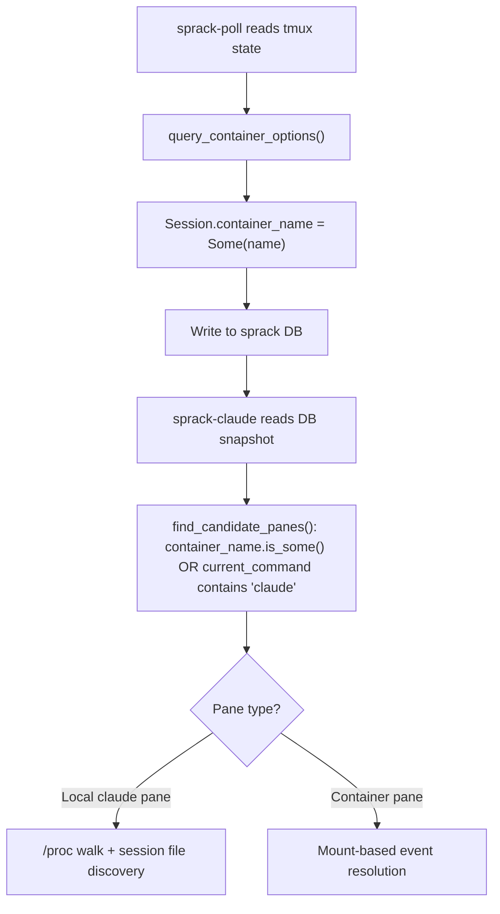
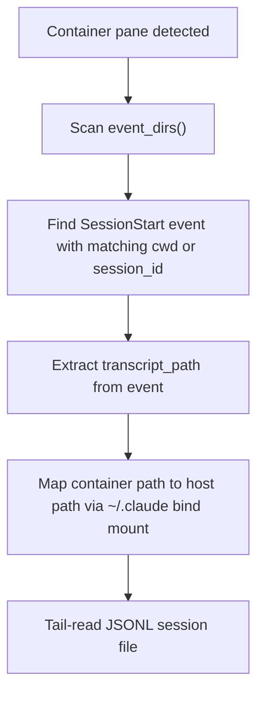

---
first_authored:
  by: "@claude-opus-4-6-20250725"
  at: 2026-03-26T10:56:00-07:00
task_list: sprack/lace-decoupling
type: proposal
state: live
status: wip
tags: [architecture, sprack, decoupling, container, migration]
last_reviewed:
  status: revision_requested
  by: "@claude-opus-4-6-20250725"
  at: 2026-03-26T12:00:00-07:00
  round: 1
---

# Sprack Codebase Decoupling: Consuming New Data Channels and Shedding Lace Coupling

> BLUF: This proposal exhaustively catalogs every piece of lace-specific code in the sprack Rust codebase and specifies replacements, driven by three companion proposals: the sprack devcontainer feature (mount-based event visibility), podman exec container entry (`@lace_container` replacing `@lace_port`), and the podman-first core runtime.
> The refactoring touches all four sprack crates: sprack-poll (tmux metadata reads), sprack-db (schema and types), sprack-claude (container resolution, event scanning, git context), and sprack TUI (host grouping and display).
> The net effect is ~300 lines of lace-specific code deleted, replaced by ~150 lines of generic container-aware code, a DB schema migration from version 1 to 2, and re-enablement of git context rendering for container panes.
> After this work, sprack can monitor any container orchestrator that sets `@container_name` on tmux sessions, not just lace.

## Summary

This is the fourth and final proposal in the sprack-lace decoupling arc.
It depends on all three companion proposals and ties them together:

1. **Sprack devcontainer feature** (`cdocs/proposals/2026-03-26-sprack-devcontainer-feature.md`): provides `/mnt/sprack/` mount, `SPRACK_EVENT_DIR`, per-project host directories at `~/.local/share/sprack/lace/<project>/claude-events/`.
2. **Podman exec container entry** (`cdocs/proposals/2026-03-26-podman-exec-container-entry.md`): replaces `@lace_port` with `@lace_container`, eliminates SSH from entry path.
3. **Podman-first core runtime** (`cdocs/proposals/2026-03-26-podman-first-core-runtime.md`): makes lace's TypeScript core podman-aware.

Key prior documents:
- `cdocs/proposals/2026-03-25-rfp-sprack-lace-decoupling.md`: RFP that motivated this work.
- `cdocs/reports/2026-03-26-sprack-lace-coupling-analysis.md`: coupling inventory and trait design.

> NOTE(opus/sprack/lace-decoupling): The podman exec proposal declares minimal sprack changes (the `@lace_port` -> `@lace_container` rename) as in-scope for its Phase 2.
> This proposal covers the complete sprack codebase refactoring, including the rename, and subsumes that scope.
> If both proposals proceed in parallel, the rename should be implemented exactly once per the specification here.

## Objective

Refactor the sprack Rust codebase to:
1. Replace all lace-specific tmux option reads, DB columns, and container resolution code with generic container-aware equivalents.
2. Consume the new data channels from the sprack devcontainer feature (multi-directory event scanning, mount-based metadata).
3. Re-enable git context rendering for container panes.
4. Make sprack usable with any container orchestrator that sets a known tmux option naming convention.

## Background

The coupling analysis report (`cdocs/reports/2026-03-26-sprack-lace-coupling-analysis.md`) identified six coupling points across three crates.
Two coupling points have existing TODO markers for removal once the hook bridge is complete.
The companion proposals provide the infrastructure that makes removal possible:
- The sprack devcontainer feature provides host-visible event files via a bind mount, eliminating the need for bind-mount-based session file discovery.
- The podman exec migration shifts container identity from SSH port to container name, requiring a column type change in the DB.
- The hook event bridge already provides `transcript_path` and `session_id` directly, bypassing the fragile prefix-matching resolution.

## Code Deletion Inventory

### 1. sprack-poll: tmux metadata reads

**File:** `packages/sprack/crates/sprack-poll/src/tmux.rs`

| Item | Lines | Replacement |
|------|-------|-------------|
| `LaceMeta` struct | 180-185 | `ContainerMeta` struct with `container_name: Option<String>`, `user: Option<String>`, `workspace: Option<String>` |
| `query_lace_options()` | 192-210 | `query_container_options()`: reads `@container_name`, `@container_user`, `@container_workspace` |
| `read_lace_option()` helper | 215-218 | Renamed to `read_tmux_option()` (generic) |
| `parse_lace_option()` | 223-230 | Renamed to `parse_tmux_option()` (logic unchanged) |
| `to_db_types()` lace metadata mapping | 251-257 | Maps `ContainerMeta` fields to `container_name`, `container_user`, `container_workspace` on `Session` |
| All test references to `LaceMeta`, `lace_port`, `lace_user`, `lace_workspace` | 672-804 | Updated to `ContainerMeta`, `container_name`, `container_user`, `container_workspace` |

**Key change:** `query_lace_options()` calls `tmux show-options -qvt $session @lace_port/user/workspace` per session.
The replacement `query_container_options()` reads `@container_name`, `@container_user`, `@container_workspace`.
The option name `@container_name` is chosen to be generic: any orchestrator (lace, a standalone podman script, VS Code remote) can set it.

> NOTE(opus/sprack/lace-decoupling): The option names `@container_name`, `@container_user`, `@container_workspace` differ from the podman exec proposal's `@lace_container`, `@lace_user`, `@lace_workspace`.
> The podman exec proposal uses `@lace_container` because it is a lace script writing lace-branded metadata.
> Sprack reads the metadata generically.
> Resolution: sprack reads `@lace_container` as the concrete implementation, but the sprack-side type and field is named `container_name` (generic).
> If a second orchestrator appears, the read can be extended to check `@container_name` as a fallback.
> This keeps the refactoring minimal while achieving naming decoupling on the sprack side.

### 2. sprack-db: schema and types

**File:** `packages/sprack/crates/sprack-db/src/schema.rs`

| Item | Lines | Replacement |
|------|-------|-------------|
| `lace_port INTEGER` column | 52 | `container_name TEXT` |
| `lace_user TEXT` column | 53 | `container_user TEXT` |
| `lace_workspace TEXT` column | 54 | `container_workspace TEXT` |
| `CURRENT_SCHEMA_VERSION` constant | 11 | Bump from `1` to `2` |
| `init_schema()` migration logic | 19-44 | Add version 1 -> 2 migration path |

The schema migration from version 1 to version 2:

```sql
-- Version 1 -> 2: rename lace columns to container columns, port (INTEGER) -> name (TEXT).
DROP TABLE IF EXISTS process_integrations;
DROP TABLE IF EXISTS panes;
DROP TABLE IF EXISTS windows;
DROP TABLE IF EXISTS sessions;
DROP TABLE IF EXISTS poller_heartbeat;
```

The DB is ephemeral (regenerated every poll cycle by sprack-poll), so the migration is a drop-and-recreate.
No data preservation is needed.
The `init_schema()` match arm for version 1 drops all tables and recreates at version 2, identical to the existing version 0 handling.

New `SCHEMA_SQL` for the `sessions` table:

```sql
CREATE TABLE IF NOT EXISTS sessions (
    name                TEXT PRIMARY KEY,
    attached            INTEGER NOT NULL DEFAULT 0,
    container_name      TEXT,
    container_user      TEXT,
    container_workspace TEXT,
    updated_at          TEXT NOT NULL
);
```

**File:** `packages/sprack/crates/sprack-db/src/types.rs`

| Item | Lines | Replacement |
|------|-------|-------------|
| `Session.lace_port: Option<u16>` | 19 | `Session.container_name: Option<String>` |
| `Session.lace_user: Option<String>` | 21 | `Session.container_user: Option<String>` |
| `Session.lace_workspace: Option<String>` | 23 | `Session.container_workspace: Option<String>` |
| Doc comments referencing `@lace_port`, `@lace_user`, `@lace_workspace` | 18, 20, 22 | Updated to reference `@container_*` |

**File:** `packages/sprack/crates/sprack-db/src/read.rs`

| Item | Lines | Replacement |
|------|-------|-------------|
| `read_sessions()` SQL query: `lace_port`, `lace_user`, `lace_workspace` | 76-77 | `container_name`, `container_user`, `container_workspace` |
| Row mapping: `lace_port: lace_port.map(\|p\| p as u16)` | 85 | `container_name: row.get(2)?` (TEXT, not INTEGER) |
| Row mapping: `lace_user: row.get(3)?` | 87 | `container_user: row.get(3)?` |
| Row mapping: `lace_workspace: row.get(4)?` | 88 | `container_workspace: row.get(4)?` |

**File:** `packages/sprack/crates/sprack-db/src/write.rs`

| Item | Lines | Replacement |
|------|-------|-------------|
| `insert_sessions()` SQL: `lace_port, lace_user, lace_workspace` | 113 | `container_name, container_user, container_workspace` |
| `insert_sessions()` params: `session.lace_port`, `session.lace_user`, `session.lace_workspace` | 120-122 | `session.container_name`, `session.container_user`, `session.container_workspace` |

### 3. sprack-claude: container resolution (`resolver.rs`)

**File:** `packages/sprack/crates/sprack-claude/src/resolver.rs`

This file has the highest density of lace-specific code.
The refactoring replaces the `LaceContainerResolver` and bind-mount prefix-matching with hook-bridge-based resolution via the sprack devcontainer mount.

| Item | Lines | Action |
|------|-------|--------|
| `CONTAINER_RECENCY_THRESHOLD` constant | 19 | Delete (no longer needed: hook bridge provides exact paths) |
| `WARNED_MISSING_WORKSPACE` static | 23-24 | Delete (workspace is no longer required for resolution) |
| `find_candidate_panes()`: `lace_port.is_some()` + `lace_workspace.is_some()` filter | 31-64 | Replace with `container_name.is_some()` filter. Drop workspace requirement: the hook bridge provides session files directly. |
| `build_lace_session_map()` | 67-75 | Rename to `build_container_session_map()`. Filter by `container_name.is_some()`. |
| `LaceContainerResolver` struct and `PaneResolver` impl | 131-164 | Delete entirely. Container resolution now goes through the hook bridge event files on the sprack mount. |
| `resolve_container_pane()` convenience function | 170-198 | Delete. Replaced by `resolve_container_pane_via_mount()` that reads event files from the per-project mount. |
| `find_container_project_dir()` | 208-243 | Delete. The bind-mount prefix-matching heuristic is eliminated. |
| `newest_jsonl_mtime()` | 248-259 | Delete. No longer enumerating `~/.claude/projects/` directories. |
| All `LaceContainerResolver` tests | 318-548 | Replace with tests for mount-based resolution. |

**Replacement architecture:**

The new container resolution uses the sprack devcontainer mount as the primary data source.
When sprack-claude processes a container pane, it:

1. Looks up the container name from the session's `container_name` field.
2. Scans event directories (`~/.local/share/sprack/lace/*/claude-events/`) for a matching `SessionStart` event file.
3. Extracts `transcript_path` from the `SessionStart` event: this is the exact JSONL session file path, as seen from the container.
4. Maps the container-internal `transcript_path` to the host-visible path via the `~/.claude` bind mount (which the `claude-code` feature provides).

This eliminates the prefix-matching heuristic entirely.
The `PaneResolver` trait is retained but simplified: the `LaceContainerResolver` implementation is replaced with a `MountEventResolver` that reads from the per-project event directories.

```rust
/// Resolves container panes via the sprack devcontainer mount.
///
/// Reads event files from per-project mount directories to find the
/// active session's transcript_path. Falls back to legacy flat directory.
pub struct MountEventResolver;

impl PaneResolver for MountEventResolver {
    fn resolve(
        &self,
        pane: &sprack_db::types::Pane,
        claude_home: &Path,
    ) -> Option<SessionFileState> {
        // Scan event_dirs() for a SessionStart event matching pane context.
        // Extract transcript_path and map to host-visible path.
        // ...
    }
}
```

> NOTE(opus/sprack/lace-decoupling): The `encode_project_path()` function in `proc_walk.rs` (line 121) is retained for local pane resolution.
> It is not lace-specific: it encodes paths for Claude Code's project directory naming scheme, which is needed regardless of container orchestrator.

### 4. sprack-claude: session processing (`main.rs`)

**File:** `packages/sprack/crates/sprack-claude/src/main.rs`

| Item | Lines | Action |
|------|-------|--------|
| `lace_sessions` variable and `build_lace_session_map()` call | 104 | Rename to `container_sessions`, call `build_container_session_map()` |
| `lace_session` variable in poll loop | 109 | Rename to `container_session` |
| `process_claude_pane()`: `lace_session` parameter | 134-140 | Rename parameter to `container_session` |
| Container resolution dispatch: `lace_session.and_then(\|session\| resolver::resolve_container_pane(...))` | 156-163 | Replace with mount-based resolution via `resolve_container_pane_via_mount()` |
| `is_file()` check for `transcript_path` from hooks | 266-269 | Retain but update comment: the check validates host-visible paths from the `~/.claude` bind mount. Container-internal paths from the sprack mount's event files need mapping. |
| `is_session_cache_valid()`: `CacheKey::ContainerSession` branch | 378-395 | Simplified: mount-based resolution provides stable paths that do not need mtime-based staleness checks. |
| Git context gate: `if matches!(session_state.cache_key, session::CacheKey::Pid(_))` | 335 | Extended to include container panes (see "Git context re-enablement" section). |

### 5. sprack-claude: event scanning (`events.rs`)

**File:** `packages/sprack/crates/sprack-claude/src/events.rs`

| Item | Lines | Action |
|------|-------|--------|
| `default_event_dir()` | 391-397 | Replace with `event_dirs()` returning `Vec<PathBuf>`: legacy flat dir + per-project mount dirs |

**Replacement:**

```rust
/// Returns all event directories: the legacy flat directory plus per-project mounts.
pub fn event_dirs() -> Vec<PathBuf> {
    let home = match std::env::var("HOME") {
        Ok(h) => PathBuf::from(h),
        Err(_) => return Vec::new(),
    };

    let mut dirs = Vec::new();

    // Per-project: sprack devcontainer feature mounts.
    let lace_dir = home.join(".local/share/sprack/lace");
    if let Ok(entries) = std::fs::read_dir(&lace_dir) {
        for entry in entries.filter_map(|e| e.ok()) {
            let events_dir = entry.path().join("claude-events");
            if events_dir.is_dir() {
                dirs.push(events_dir);
            }
        }
    }

    // Legacy/local: flat event directory for host-side sessions.
    let flat_dir = home.join(".local/share/sprack/claude-events");
    if flat_dir.is_dir() {
        dirs.push(flat_dir);
    }

    dirs
}
```

Per-project directories are searched first.
The call site in `main.rs` (lines 238-307) changes from scanning one directory to iterating over `event_dirs()`.
`find_event_file` and `find_event_file_by_session_id` already accept `event_dir: &Path`, so no signature changes are needed.

### 6. sprack TUI: host grouping (`tree.rs`)

**File:** `packages/sprack/crates/sprack/src/tree.rs`

| Item | Lines | Action |
|------|-------|--------|
| Module doc comment: "grouped by `@lace_port`" | 5 | Update to "grouped by `container_name`" |
| `NodeId::HostGroup` doc comment: "keyed by lace_port" | 81 | Update to "keyed by container_name" |
| `HostGroup` struct: `port: Option<u16>` field | 111 | Change to `container_name: Option<String>` |
| `build_tree()` doc: "Groups sessions by `@lace_port`" | 117 | Update |
| `group_sessions_by_host()`: groups by `session.lace_port` | 188-219 | Group by `session.container_name` instead. Type changes from `Option<u16>` to `Option<String>`. |
| Sort order: `Some(pa).cmp(Some(pb))` (port numeric sort) | 211 | String sort on container name |
| `derive_group_name()`: `format!("port-{p}")` fallback | 230 | `format!("container-{c}")` or just use the container name directly |
| `format_session_label()` Full tier: `session.lace_port` display as `:port` | 640-642 | Display container name badge instead (e.g., ` [container_name]`) |
| All test `Session` structs with `lace_port/user/workspace` fields | 963-981, 1079-1081 | Update to `container_name/user/workspace` |

**Grouping semantics change:**

The current grouping uses `Option<u16>` (port number) as the map key.
Multiple sessions can share a port if they connect to the same container (rare).
The new grouping uses `Option<String>` (container name) as the map key.
Sessions with the same container name are grouped together.
Sessions with `container_name = None` go under the "local" group (unchanged semantics).

The display change is minor: instead of `:22427` after a session name, the TUI shows `[lace-dev]` or similar.
For the `derive_group_name` function, when multiple sessions share a container name, the container name itself is the group name (no need for prefix detection).

### 7. sprack-poll: diff and main (missed in initial inventory)

**File:** `packages/sprack/crates/sprack-poll/src/diff.rs`

| Item | Lines | Replacement |
|------|-------|-------------|
| `compute_lace_meta_hash()` function | 33 | Rename to `compute_container_meta_hash()`. Note: `port: Option<u16>` becomes `container_name: Option<String>`, changing the hash input type. |
| `LaceMeta` imports and type references | throughout | `ContainerMeta` |
| Test functions: `test_lace_meta_hash_detects_change`, `test_lace_meta_hash_detects_no_change` | multiple | Rename tests; update `LaceMeta` constructors to `ContainerMeta` with `container_name` field |

**File:** `packages/sprack/crates/sprack-poll/src/main.rs`

| Item | Lines | Replacement |
|------|-------|-------------|
| Imports: `compute_lace_meta_hash`, `query_lace_options`, `LaceMeta` | 17-20 | `compute_container_meta_hash`, `query_container_options`, `ContainerMeta` |
| Variables: `last_lace_hash`, `current_lace_hash`, `lace_changed`, `lace_meta` | 59, 85-101 | `last_container_hash`, `current_container_hash`, `container_changed`, `container_meta` |
| Test `LaceMeta` constructors | 353-365, 399-400 | `ContainerMeta` with `container_name` field |

### 8. Test helpers with lace references

**File:** `packages/sprack/crates/sprack-db/src/lib.rs`

| Item | Lines | Replacement |
|------|-------|-------------|
| `make_test_session()` helper: `lace_port: None, lace_user: None, lace_workspace: None` | 110 | `container_name: None, container_user: None, container_workspace: None` |
| Round-trip test constructor: `lace_port: Some(2222)` | 200-208 | `container_name: Some("lace-dev".to_string())` |

**File:** `packages/sprack/crates/sprack/src/test_render.rs`

| Item | Lines | Replacement |
|------|-------|-------------|
| `make_session_lace()` helper with `lace_port`, `lace_user`, `lace_workspace` | 113 | Rename to `make_session_container()` with `container_name`, `container_user`, `container_workspace` |
| Default session builder: `lace_port: None, lace_user: None, lace_workspace: None` | 99-101 | `container_name: None, container_user: None, container_workspace: None` |

## DB Schema Migration

### Column changes

| Old Column | Old Type | New Column | New Type |
|------------|----------|------------|----------|
| `lace_port` | `INTEGER` | `container_name` | `TEXT` |
| `lace_user` | `TEXT` | `container_user` | `TEXT` |
| `lace_workspace` | `TEXT` | `container_workspace` | `TEXT` |

### Migration SQL

The sprack DB is ephemeral: sprack-poll writes the full tmux state on every cycle, and `write_tmux_state()` does `DELETE FROM sessions` (cascading to windows, panes, integrations) before re-inserting.
Data loss is a non-issue.

The `init_schema()` function gains a version 1 migration path:

```rust
pub const CURRENT_SCHEMA_VERSION: i32 = 2;

pub fn init_schema(conn: &Connection) -> Result<(), SprackDbError> {
    let version: i32 = conn.pragma_query_value(None, "user_version", |row| row.get(0))?;

    match version {
        0 | 1 => {
            // Fresh DB, pre-versioning, or version 1. Drop and recreate.
            conn.execute_batch(
                "DROP TABLE IF EXISTS process_integrations;
                 DROP TABLE IF EXISTS panes;
                 DROP TABLE IF EXISTS windows;
                 DROP TABLE IF EXISTS sessions;
                 DROP TABLE IF EXISTS poller_heartbeat;",
            )?;
            conn.execute_batch(SCHEMA_SQL)?;
            // SCHEMA_SQL must end with: PRAGMA user_version = 2;
        }
        v if v == CURRENT_SCHEMA_VERSION => {
            conn.execute_batch(SCHEMA_SQL)?;
        }
        other => {
            return Err(SprackDbError::UnsupportedSchemaVersion(other));
        }
    }

    Ok(())
}
```

### Backwards compatibility

None.
Per the podman exec proposal, breakage is acceptable.
The old sprack DB file (`~/.local/share/sprack/sprack.db`) is detected as version 1, dropped, and recreated at version 2.
sprack-poll and sprack TUI must be rebuilt from the same commit: a version mismatch between writer (sprack-poll v2) and reader (sprack TUI v1) would fail at the `UnsupportedSchemaVersion` check, producing a clear error.

## tmux Metadata Decoupling

### Options sprack reads post-migration

| Option | Source | Purpose |
|--------|--------|---------|
| `@lace_container` | Set by `lace-into` | Container name for this session. Sprack reads this as the `container_name` field. |
| `@lace_user` | Set by `lace-into` | Remote user. Sprack reads this as `container_user`. Not strictly needed by sprack (no SSH), but useful for display. |
| `@lace_workspace` | Set by `lace-into` | Container workspace path. Sprack reads this as `container_workspace`. Used for event file cwd matching. |

### Options that are gone

| Option | Reason |
|--------|--------|
| `@lace_port` | Replaced by `@lace_container`. The SSH port is no longer the container identifier. |

### Could sprack work with any container orchestrator?

Yes, with a minor configuration addition.
The tmux option names sprack reads (`@lace_container`, `@lace_user`, `@lace_workspace`) are hardcoded strings.
Any script that sets these three options on a tmux session makes that session visible to sprack as a container session.

A non-lace orchestrator could:
1. Set `@lace_container` (or a configurable alternative like `@container_name`) on the tmux session.
2. Provide an event directory at a known path (the sprack devcontainer feature convention, or the legacy flat directory).
3. Sprack detects the session, scans event directories, and resolves session files.

> NOTE(opus/sprack/lace-decoupling): Making the option names configurable (e.g., via a config file or env var) is deferred.
> The current approach hardcodes `@lace_container` as the option name.
> The decoupling analysis report recommends deferring the `ContainerProvider` trait until a concrete second backend exists.
> When that happens, the trait's `query_metadata()` method can accept configurable option names.

### Standalone sprack tmux plugin

The tmux integration (pane metadata reads, session listing) lives entirely in `sprack-poll/src/tmux.rs`.
After the refactoring, the tmux interaction consists of:
- `query_tmux_state()`: `tmux list-panes -a -F` (no lace dependency).
- `query_container_options()`: `tmux show-options -qvt $session @lace_container/user/workspace` (option name is the only coupling point).

Bundling sprack as a standalone tmux plugin requires:
1. Building `sprack-poll` and `sprack` (TUI) as static binaries.
2. A `sprack.tmux` plugin file that starts `sprack-poll` in the background and binds a key to launch the TUI.
3. Configurable option names via tmux `@sprack_container_option`, `@sprack_user_option`, `@sprack_workspace_option` user options.

This is outside the scope of this proposal but is enabled by the decoupling.

## Git Context Re-enablement

### Current state

Git context rendering in the TUI is disabled at `tree.rs:754-758`:

```
// Git context line: disabled pending redesign.
// Data collection continues in sprack-claude but rendering is suppressed.
// TODO(opus/sprack-git-context): Re-enable after container support and
// worktree enumeration redesign (show sibling sessions, not all worktrees).
```

Git data collection in `main.rs` is gated to local panes only (line 335):

```rust
if matches!(session_state.cache_key, session::CacheKey::Pid(_)) {
    resolve_git_state(session_state, &pane.current_path, &mut summary);
}
```

Container panes get no git context because:
1. `pane.current_path` is the host-side path (e.g., `/home/mjr/code/weft/lace/main`), which is the tmux pane's cwd. For SSH panes, this was the sshd process cwd, not the container's working directory.
2. The git module reads `.git/HEAD` directly from the filesystem, which only works for host-accessible paths.

### Post-migration enablement

After the podman exec migration, `pane.current_path` for container panes is the host path where `podman exec` was launched (typically the same as the workspace path on the host, or the directory the user was in when running `lace-into`).
This is not the container-internal working directory.

Two complementary approaches provide git context for container panes:

**Approach A: Sprack mount metadata (primary)**

The sprack devcontainer feature's optional metadata writer produces `/mnt/sprack/metadata/state.json` on the mount, containing `git_branch`, `git_commit_short`, and `git_dirty`.
On the host, this is at `~/.local/share/sprack/lace/<project>/metadata/state.json`.

sprack-claude reads this file for container panes:

```rust
/// Reads container git state from the sprack mount metadata file.
fn resolve_container_git_state(
    container_name: &str,
    summary: &mut ClaudeSummary,
) {
    let home = match std::env::var("HOME") {
        Ok(h) => h,
        Err(_) => return,
    };

    // Scan per-project mount directories for a matching container.
    let lace_dir = PathBuf::from(&home).join(".local/share/sprack/lace");
    // The project directory name matches the container name (via sanitizeContainerName).
    let metadata_path = lace_dir.join(container_name).join("metadata/state.json");

    if let Ok(content) = std::fs::read_to_string(&metadata_path) {
        if let Ok(meta) = serde_json::from_str::<ContainerMetadata>(&content) {
            summary.git_branch = meta.git_branch;
            summary.git_commit_short = meta.git_commit_short;
        }
    }
}
```

**Approach B: Podman exec git commands (fallback)**

For containers without the metadata writer, sprack-claude can invoke `podman exec <container> git rev-parse --abbrev-ref HEAD` and `podman exec <container> git rev-parse --short HEAD`.
This adds subprocess overhead (~50ms per call) but works without any container-side setup.

```rust
fn resolve_container_git_via_exec(
    container_name: &str,
    workspace: &str,
    summary: &mut ClaudeSummary,
) {
    let branch_output = std::process::Command::new("podman")
        .args(["exec", "--workdir", workspace, container_name,
               "git", "rev-parse", "--abbrev-ref", "HEAD"])
        .output();
    if let Ok(output) = branch_output {
        if output.status.success() {
            let branch = String::from_utf8_lossy(&output.stdout).trim().to_string();
            if !branch.is_empty() {
                summary.git_branch = Some(branch);
            }
        }
    }
    // Similar for git_commit_short.
}
```

> NOTE(opus/sprack/lace-decoupling): Approach B is included as a fallback for Phase 5 but is not required for initial re-enablement.
> The metadata writer from the sprack devcontainer feature is the primary path.
> If neither approach produces git data, the git context line is simply omitted (graceful degradation, same as today).

**TUI rendering change:**

Remove the disabled-rendering block at `tree.rs:754-758` and unconditionally render git context when `summary.git_branch` is populated.
The data source (host-side `.git/HEAD` for local panes, mount metadata for container panes) is transparent to the renderer.

The gate in `main.rs` line 335 changes from:

```rust
if matches!(session_state.cache_key, session::CacheKey::Pid(_)) {
    resolve_git_state(session_state, &pane.current_path, &mut summary);
}
```

To:

```rust
match &session_state.cache_key {
    session::CacheKey::Pid(_) => {
        resolve_git_state(session_state, &pane.current_path, &mut summary);
    }
    session::CacheKey::ContainerSession(_) => {
        if let Some(ref container) = container_session {
            if let Some(ref name) = container.container_name {
                resolve_container_git_state(name, &mut summary);
            }
        }
    }
}
```

## Replacement Architecture

### Container pane detection (post-migration)



### Session file discovery for container panes



The mount-based resolution replaces the three-step bind-mount heuristic (encode workspace, enumerate prefix matches, select by mtime).
The hook bridge provides the exact session file path, eliminating all heuristics.

### `ContainerBackend` trait (deferred)

The coupling analysis report proposed `ContainerProvider` and `SessionFileResolver` traits.
This proposal does **not** introduce these traits.
The refactoring replaces lace-specific code with generic code that is functionally equivalent: it reads tmux options by hardcoded names and resolves sessions via the mount.

Trait extraction is deferred until a second container backend materializes.
The current code is structured to make extraction straightforward: all container-specific logic is concentrated in `query_container_options()` and `resolve_container_pane_via_mount()`.

## Important Design Decisions

### Field naming: `container_*` in sprack, `@lace_*` in tmux

The DB columns and Rust struct fields use `container_name`, `container_user`, `container_workspace`.
The tmux options remain `@lace_container`, `@lace_user`, `@lace_workspace` (written by lace scripts).
The mapping happens in `query_container_options()`: sprack reads lace-branded tmux options but stores them generically.
This decouples sprack's data model from lace's naming while maintaining compatibility with the podman exec proposal.

### Drop-and-recreate migration, not ALTER TABLE

SQLite's `ALTER TABLE` supports adding columns and renaming columns (since 3.25.0), but changing a column type requires rebuilding the table.
Since the DB is ephemeral, drop-and-recreate is simpler, more reliable, and has zero data loss risk.

### Event directory scanning order: per-project first

Per-project directories (`~/.local/share/sprack/lace/*/claude-events/`) are scanned before the legacy flat directory (`~/.local/share/sprack/claude-events/`).
Per-project files are more likely to be current (they come from the mount, actively written by the container).
The legacy directory continues to serve host-side sessions that are not in containers.

### Hook bridge as primary, bind-mount as removed (not fallback)

The existing code has TODO comments flagging bind-mount resolution as a fallback.
This proposal removes it entirely rather than keeping it as a fallback.
The hook bridge is the authoritative data source.
If the hook bridge is not configured (no sprack devcontainer feature), container session resolution returns `None` and the pane shows an error integration: this is the correct behavior since sprack cannot observe the session without the mount.

### `pane.current_command` check for container panes

After the podman exec migration, container pane processes appear as the container shell (e.g., `bash`) rather than `ssh`.
The `find_candidate_panes()` function currently includes panes with `current_command.contains("claude")` OR belonging to a container session.
Post-migration, the logic is unchanged: container panes are identified by `container_name.is_some()`, not by command name.
The `contains("claude")` check continues to catch local Claude panes.

## Edge Cases / Challenging Scenarios

### Concurrent sprack-poll v1 and v2

If a user rebuilds only sprack-poll but not the TUI (or vice versa), the schema version mismatch causes an error.
The `UnsupportedSchemaVersion` error clearly indicates the issue.
Resolution: always rebuild all sprack crates together (cargo workspace rebuild).

### Container name not matching project directory name

The sprack mount is at `~/.local/share/sprack/lace/<project_name>/`.
The container name is derived from `sanitizeContainerName(projectName)`.
If these diverge (e.g., due to normalization differences), the metadata file lookup by container name fails.
Mitigation: the event file lookup does not depend on the container name matching the directory name: it scans all `*/claude-events/` directories by content (session_id or cwd match).
Only the metadata file (`state.json`) lookup uses the directory name.

### No sprack devcontainer feature installed

If the sprack feature is not installed in the devcontainer, the mount does not exist.
`SPRACK_EVENT_DIR` is not set, so the hook bridge writes to `$HOME/.local/share/sprack/claude-events` inside the container, which is invisible to the host.
Container session resolution returns `None`: the pane shows an error integration.
This is the expected behavior: sprack requires the feature to observe container sessions.
Local sessions are unaffected.

### Multiple Claude sessions in the same container

Multiple Claude instances write to separate `<session_id>.jsonl` event files.
`find_event_file_by_session_id()` disambiguates by session_id.
`find_event_file()` (cwd-based) returns the most recently modified file with a matching cwd.
Both methods work correctly with multiple concurrent sessions.

### Hook bridge not running

If Claude Code hooks are not configured, no event files are written.
Container session resolution returns `None`.
Host-side sessions that have hooks configured continue to work.
This is a graceful degradation, not a failure.

### Stale event files from previous sessions

Event files persist across container rebuilds (the host directory survives).
`SessionEnd` events in the JSONL mark completed sessions.
sprack-claude's existing mtime-based freshness check on session files prevents stale data from being displayed.
Garbage collection of old event files is out of scope for this proposal.

## Test Plan

### Unit tests: sprack-db schema migration

1. Version 0 (fresh DB) -> version 2: tables created with `container_*` columns.
2. Version 1 -> version 2: tables dropped and recreated.
3. Version 2 (current): tables ensured to exist (idempotent).
4. Version 3+ (future): `UnsupportedSchemaVersion` error.

### Unit tests: sprack-poll tmux metadata

5. `query_container_options()`: reads `@lace_container`, `@lace_user`, `@lace_workspace` from tmux.
6. `parse_tmux_option()`: unchanged behavior (rename only).
7. `to_db_types()`: maps `ContainerMeta` fields correctly.
8. Session without container metadata: `container_name = None` (local session).

### Unit tests: sprack-claude resolver

9. `find_candidate_panes()`: includes panes with `container_name.is_some()`.
10. `find_candidate_panes()`: excludes panes with `container_name = None` and non-claude command.
11. `build_container_session_map()`: filters by `container_name.is_some()`.
12. Mount-based resolution: finds event file in per-project directory, extracts `transcript_path`.
13. Mount-based resolution: returns `None` when no event files exist.
14. Mount-based resolution: handles multiple per-project directories.

### Unit tests: sprack-claude events

15. `event_dirs()`: returns both per-project and legacy flat directories.
16. `event_dirs()`: returns empty vec when no directories exist.
17. `find_event_file_by_session_id()`: finds file in per-project directory.
18. `find_event_file()`: searches across all event directories.

### Unit tests: sprack TUI tree

19. `group_sessions_by_host()`: groups by `container_name` instead of `lace_port`.
20. `derive_group_name()`: uses container name for non-local groups.
21. Session label: displays container name badge instead of port.
22. Sort order: "local" (None) last, container groups sorted alphabetically.

### Integration tests

23. Full poll cycle with container session: sprack-poll writes container metadata, sprack-claude reads events from per-project directory, TUI renders container pane with status.
24. Git context for container pane: metadata file read produces git branch/commit in summary.

## Verification Methodology

### Automated

Run `cargo test --workspace` in `packages/sprack/` after each phase.
The test suite covers all renamed types and columns.

### Manual

1. Start a lace devcontainer with the sprack feature installed.
2. Run a Claude Code session inside the container.
3. Verify sprack TUI shows the container session with status.
4. Verify git context appears for the container pane (if metadata writer is enabled).
5. Verify local (non-container) sessions continue to display correctly.
6. Kill and restart the container: verify sprack recovers.

## Implementation Phases

### Phase 1: DB schema migration and type renames

**Goal:** Rename all `lace_*` identifiers to `container_*` across sprack-db, sprack-poll, and the TUI.
No behavioral change: the tmux option reads still target `@lace_container` et al.

**Scope:**
- `sprack-db/src/schema.rs`: bump version to 2, add version 1 migration path, rename columns in `SCHEMA_SQL`.
- `sprack-db/src/types.rs`: rename `lace_port: Option<u16>` to `container_name: Option<String>`, `lace_user` to `container_user`, `lace_workspace` to `container_workspace`.
- `sprack-db/src/read.rs`: update SQL queries and row mappings.
- `sprack-db/src/write.rs`: update INSERT statement and param bindings.
- `sprack-poll/src/tmux.rs`: rename `LaceMeta` to `ContainerMeta`, `query_lace_options()` to `query_container_options()`, update option name from `@lace_port` to `@lace_container`. Update `to_db_types()`. Update all tests.
- `sprack/src/tree.rs`: change `HostGroup.port: Option<u16>` to `HostGroup.container_name: Option<String>`. Update `group_sessions_by_host()`, `derive_group_name()`, `format_session_label()`. Update test fixtures.
- `sprack-claude/src/resolver.rs`: rename `build_lace_session_map()` to `build_container_session_map()`, update `find_candidate_panes()` filter from `lace_port.is_some()` to `container_name.is_some()`.
- `sprack-claude/src/main.rs`: rename `lace_sessions` / `lace_session` variables.

**Depends on:** Nothing (can proceed independently).

**Acceptance criteria:** `cargo test --workspace` passes. Schema version is 2. No identifiers contain `lace_port`.

### Phase 2: Multi-directory event scanning

**Goal:** Extend sprack-claude to scan event files from per-project mount directories.

**Scope:**
- `sprack-claude/src/events.rs`: replace `default_event_dir()` with `event_dirs()` returning `Vec<PathBuf>`.
- `sprack-claude/src/main.rs`: update the event scanning block (lines 238-307) to iterate over `event_dirs()`. For each directory, try `find_event_file_by_session_id()` then `find_event_file()`.
- Add unit tests for `event_dirs()` with tempdir-based per-project directories.
- Add unit tests for cross-directory event file discovery.

**Depends on:** Phase 1 (renamed types).

**Acceptance criteria:** sprack-claude finds event files in `~/.local/share/sprack/lace/*/claude-events/`. Legacy flat directory continues to work. All existing event tests pass.

### Phase 3: Remove bind-mount resolution

**Goal:** Delete the `LaceContainerResolver`, `find_container_project_dir()`, and all bind-mount prefix-matching code. Replace with mount-based resolution.

**Scope:**
- `sprack-claude/src/resolver.rs`: delete `CONTAINER_RECENCY_THRESHOLD`, `WARNED_MISSING_WORKSPACE`, `LaceContainerResolver`, `resolve_container_pane()`, `find_container_project_dir()`, `newest_jsonl_mtime()`. Add `MountEventResolver` and `resolve_container_pane_via_mount()`.
- `sprack-claude/src/main.rs`: update `process_claude_pane()` to use mount-based resolution for container panes. Update `is_session_cache_valid()` for the new resolution pattern.
- Replace all deleted test cases with tests for the new resolution path.

**Depends on:** Phase 2 (multi-directory scanning available).

**Acceptance criteria:** No bind-mount enumeration code remains. Container session resolution works via hook events on the sprack mount. Tests cover the new resolution path.

### Phase 4: TUI display updates

**Goal:** Update the TUI to display container names instead of ports. Remove disabled git context block.

**Scope:**
- `sprack/src/tree.rs`: update `format_session_label()` to show container name instead of port. Update `HostGroup` doc comments. Remove the disabled git context block at lines 754-758 (rendering is unconditional on data availability).
- Update `test_render.rs` if it exists and references lace fields.

**Depends on:** Phase 1 (renamed types).

**Acceptance criteria:** TUI renders container names for container sessions. Git context line appears when `git_branch` is populated. "local" grouping unchanged.

### Phase 5: Git context for container panes

**Goal:** Re-enable git context data collection for container panes via the sprack mount metadata.

**Scope:**
- `sprack-claude/src/main.rs`: extend the git resolution gate to include `CacheKey::ContainerSession`. Add `resolve_container_git_state()` function that reads from `~/.local/share/sprack/lace/<container>/metadata/state.json`.
- Add a `ContainerMetadata` struct for parsing `state.json`.
- Add unit tests for metadata file parsing and missing-file graceful degradation.
- Optional: add `resolve_container_git_via_exec()` fallback using `podman exec`.

**Depends on:** Phase 3 (mount-based resolution), Phase 4 (TUI rendering enabled).

**Acceptance criteria:** Container panes display git branch and commit when the metadata file is present. Missing metadata file results in no git context (graceful degradation). Local panes' git context is unchanged.

### Phase 6: Cleanup and documentation

**Goal:** Remove dead code, update doc comments, and clean up any remaining `lace_`-prefixed identifiers in sprack crates.

**Scope:**
- Grep all sprack crates for remaining `lace_` references in non-test code. Update or remove.
- Update module-level doc comments (`//!`) in all affected files.
- Remove `#[allow(dead_code)]` annotations that are no longer needed.
- Verify all TODO comments referencing the hook bridge or bind-mount removal are resolved.

**Depends on:** All previous phases.

**Acceptance criteria:** No `lace_`-prefixed identifiers in sprack source (except in test fixtures that mock lace-written tmux options). All TODO markers for hook bridge migration are resolved. `cargo test --workspace` passes. `cargo clippy --workspace` clean.

## Open Questions

1. **Option name alignment with lace scripts:** Should sprack read `@lace_container` (matching the podman exec proposal) or `@container_name` (fully generic)?
   The current proposal reads `@lace_container` for compatibility.
   A future enhancement can add fallback reads for `@container_name`.

2. **Metadata writer dependency:** The git context re-enablement depends on the sprack devcontainer feature's metadata writer, which is marked as optional in that proposal.
   If the metadata writer is not implemented, should the `podman exec git` fallback be the primary path?

3. **~~Event directory structure divergence~~:** Resolved.
   The `lace.projectName` (mount directory) and `sanitizeContainerName()` (container name) may not produce identical strings.
   Resolution: `resolve_container_git_state()` must NOT do a direct path join with the container name.
   Instead, it scans `~/.local/share/sprack/lace/*/metadata/state.json` and matches by reading a `container_name` field inside `state.json`.
   The metadata writer (in the sprack devcontainer feature) must include the container name in `state.json` so sprack can match it.
   This requires updating the sprack devcontainer feature's `state.json` schema to include a `"container_name"` field alongside `workdir`, `git_branch`, etc.
   The event file lookup already scans all directories by content (session ID), so it is unaffected.
