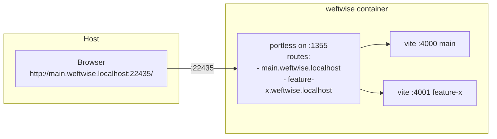
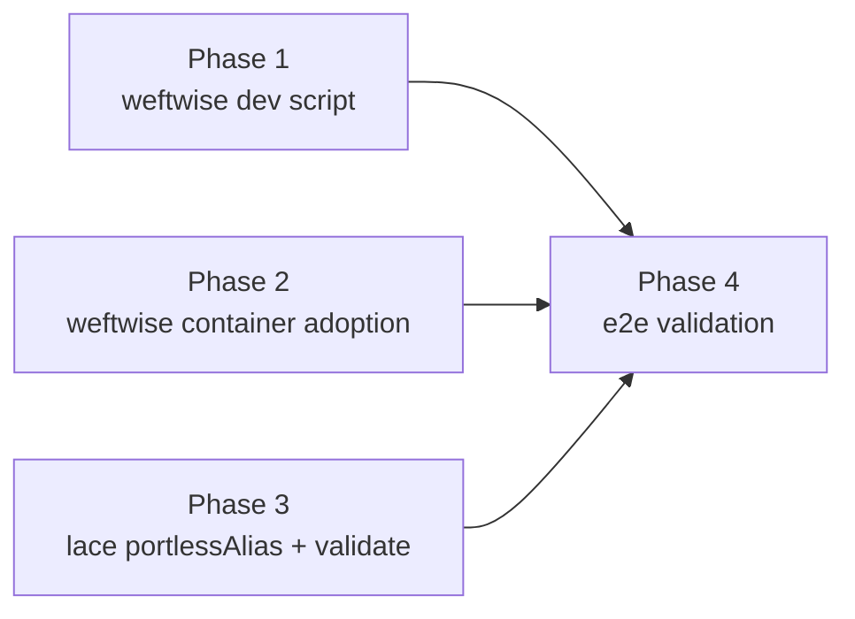

---
first_authored:
  by: "@claude-opus-4-7"
  at: 2026-05-13T13:10:39-07:00
task_list: weftwise/parallel-feature-development
type: proposal
state: live
status: implementation_ready
last_reviewed:
  status: accepted
  by: "@claude-opus-4-7"
  at: 2026-05-14T11:55:00-07:00
  round: 7
tags: [worktree, portless, parallel-development, weftwise, multi-project]
---

# Streamlined Parallel Feature Development for Weftwise

> BLUF(opus/weftwise-parallel-dev): Weftwise's `scripts/worktree.sh` gains a `dev` subcommand and the project adopts the portless container feature; lace gains a `portlessAlias` port-metadata flag that its `validate` command picks up automatically to run a generic host-port-availability check and print an informational pointer toward the future clean-URLs work.
> Browser reaches each worktree at `http://{branch}.weftwise.localhost:<lace-allocated-port>/` concurrently, multi-project safe (each project gets its own host port).
> Port-80 binding, host-side portless lifecycle, and clean-URL routing are out of scope for this proposal and live in the follow-up RFP `cdocs/proposals/2026-05-13-rfp-truly-portless-portless.md`.

## Overview

Three things change to deliver parallel-worktree dev (with port-suffix URLs in v1):

1. Weftwise's `scripts/worktree.sh` gains a `dev` subcommand: install-on-missing, derive branch from `$PWD`, exec `portless {branch}.weftwise.localhost pnpm dev`.
2. Weftwise adds portless to top-level `features` (one-line `devcontainer.json` change). The container portless does intra-container Host-header demux.
3. Lace adds a `portlessAlias?: boolean` port-metadata flag and extends `validate` to check host-port availability and print an informational message when the active config carries that flag. No new commands; no sudo; no durable host state.

URL pattern in v1: `http://{branch}.{project}.localhost:<host-port>/`, where `<host-port>` is the lace-allocated port for that project's container portless (22425-22499).
The pattern is forward-compatible with the future clean-URL work: dropping the `<host-port>` suffix is purely a host-side routing change.

## Objective

1. **Parallel worktrees work.** N concurrent dev servers in the single container, each reachable from the host browser at a distinct stable URL.
2. **New worktrees just work.** `git worktree add` then `scripts/worktree.sh dev` is the entire ceremony.
3. **Multi-project safe.** Two projects up at the same time produce two distinct host-port URLs; no collision and no manual coordination.
4. **Zero durable host state.** No sudo prompts, no systemd units, no global npm installs, no sysctl drop-ins. All host-side complexity is deferred to the follow-up RFP.

Clean URLs (no port suffix) are explicitly out of scope; they are the deliverable of the follow-up RFP.

## Background

Companion documents:

- `cdocs/reports/2026-05-13-worktree-portless-parallel-dev-prior-work.md` — design-space survey.
- `cdocs/reports/2026-05-13-clean-portless-urls-fresh-eyes.md` — clean-URL approaches (relevant to the follow-up RFP).
- `cdocs/reports/2026-05-13-weftwise-parallel-dev-decisions.md` — supplemental design decisions (D1-D12). Decisions D1-D5, D7, D11 apply to v1. Decisions D6, D8, D9, D10, D12 apply to the follow-up RFP.
- `cdocs/proposals/2026-05-13-rfp-truly-portless-portless.md` — follow-up RFP for clean URLs via host-side portless.

Load-bearing facts:

- **Container portless already works.** The portless feature at `devcontainers/features/src/portless/` installs portless in-container and starts the proxy on :1355.
- **Lace's port allocator** at `packages/lace/src/lib/port-allocator.ts:96-193` allocates stable host ports in the 22425-22499 range and persists them across runs.
- **Symmetric port injection** at `packages/lace/src/lib/template-resolver.ts:181-223` (`injectForBlock`) maps the feature's container port to the allocated host port via `appPort` when portless is in top-level `features`.
- **Portless auto-injects framework-specific CLI flags for vite/astro/angular**, so weftwise's hard-coded `vite.config.ts:server.port: 3000` is overridden at runtime when launched via `portless ... pnpm dev` (no config relaxation needed).
- **Weftwise's Dockerfile bakes a pnpm store at `/build`**; bind-mount-workspace installs hit it in 2.5s (verification devlog Finding 1). No host-side mount is needed.
- **Weftwise's `.devcontainer/devcontainer.json` is already on top-level `features`** (the legacy-builder migration landed); no `prebuildFeatures` block remains.

### Existing primitives this proposal reuses

| Primitive | Location | Role |
|---|---|---|
| `bare-worktree` workspace layout | `packages/lace/src/lib/workspace-layout.ts:82-209` | Mounts the bare-repo at `/workspaces/weftwise`; all worktrees visible in one container. |
| Portless container feature | `devcontainers/features/src/portless/` | Installs `portless` in-container; runs proxy on :1355. |
| Symmetric port injection | `packages/lace/src/lib/template-resolver.ts:181-223` | Maps container :1355 to a lace-allocated host port. |
| `PortAllocator` | `packages/lace/src/lib/port-allocator.ts:96-193` | Stable host-port allocation across `lace up` runs. |
| `validate` command | `packages/lace/src/commands/validate.ts` | Extended to consume `portlessAlias` metadata. |
| `LacePortDeclaration` | `packages/lace/src/lib/feature-metadata.ts:47-57` | Extended with `portlessAlias?: boolean`. |
| `extractLaceCustomizations` | `packages/lace/src/lib/feature-metadata.ts:641-689` | Extended to round-trip `portlessAlias`. |
| Weftwise `scripts/worktree.sh` | weftwise's repo | Existing `add`/`list`/`remove`/`status` subcommands; extended with `dev`. |

### What is explicitly NOT being built in v1

- No host-side portless lifecycle (deferred to the follow-up RFP).
- No `portless alias` shellout from lace (deferred).
- No port-80 binding (deferred).
- No sysctl handling, in any form (deferred).
- No HTTPS (deferred).
- No bundled portless dependency in lace's `package.json` (deferred to follow-up; v1 only consumes the container's portless).
- No new lace subcommand (`doctor` / `setup` etc.); the `validate` command is extended in place.
- No string mode for `portlessAlias` (boolean only; future RFP may extend).
- No `installDeps` flag, no `mergePostCreateCommand` extension, no pnpm-store bind mount, no vite config relaxation (all dropped from prior drafts).
- No fix for the `sshPort` phantom-option bug (separately tracked).

## Proposed Solution



The flow has three pieces. Each is detailed in Implementation Phases.

**1. Weftwise `scripts/worktree.sh dev`** — install-on-missing + container-portless launch with the full per-branch host name.

**2. Container portless** — adopted via top-level `features`; demuxes by Host header inside the container.

**3. Lace `portlessAlias` metadata + `validate` extension** — schema-and-extractor widening plus a `validate` step that runs a generic host-port-availability check and prints a forward-looking informational message.

### `portlessAlias` v1 semantics

The flag's v1 role is **marker for future tooling**.
Its presence on a port declaration:

- Triggers `validate` to run a generic host-port-availability check against that port's lace-allocated host port.
- Triggers `validate` to print a one-line informational pointer to the follow-up RFP, in case the user expected clean URLs and got port-suffix ones.

The flag has NO `lace up` runtime effect in v1.
Container-side behaviour is identical whether the flag is set or not (the URL is the same `http://{branch}.{project}.localhost:<host-port>/` either way).

The flag is added to the portless feature manifest in v1 so the follow-up RFP doesn't have to re-touch the feature; the follow-up adds the host-side consumer.

## Implementation Phases

Four phases. Phases 1-3 are largely independent. Phase 4 is end-to-end validation.



### Phase 1: Weftwise `scripts/worktree.sh dev` subcommand

**File.** `/home/mjr/code/weft/weftwise/main/scripts/worktree.sh`.

**Concrete shape.**

```sh
cmd_dev() {
  local branch
  branch=$(basename "$PWD")

  # Sanity-check we're in a package directory
  if [[ ! -f package.json ]]; then
    log_error "No package.json in $PWD; run from a worktree's package directory"
    exit 1
  fi

  # Install on demand
  if [[ ! -d node_modules ]]; then
    log_info "node_modules missing in $branch; running pnpm install --frozen-lockfile"
    pnpm install --frozen-lockfile
  fi

  # portless must be on PATH (provided by the portless devcontainer feature)
  if ! command -v portless >/dev/null 2>&1; then
    log_error "portless not found on PATH; ensure the portless feature is in devcontainer.json"
    exit 1
  fi

  local route="${branch}.weftwise.localhost"
  log_info "Starting dev server: http://${route}:<host-port>/"
  log_info "(host-port from podman port weftwise; lace allocates 22425-22499)"
  exec portless "${route}" pnpm dev
}
```

Dispatch in the main `case` statement:

```sh
case "${1:-}" in
  add) shift; cmd_add "$@" ;;
  list) cmd_list ;;
  remove) shift; cmd_remove "$@" ;;
  status) cmd_status ;;
  dev) cmd_dev ;;
  *) usage; exit 1 ;;
esac
```

**Tests.** Shell smoke tests (matches the existing script's style):

- Outside a `package.json` directory: clean error.
- Missing `node_modules`: install runs, then dev exec.
- `node_modules` present: install skipped, dev exec.
- `portless` not on PATH: clean error.

**Acceptance.** `./scripts/worktree.sh dev` from any worktree's package root reaches the dev server at `http://{branch}.weftwise.localhost:<host-port>/`, where `<host-port>` is visible via `podman port weftwise`.

### Phase 2: Adopt portless in the weftwise container

**File.** `/home/mjr/code/weft/weftwise/main/.devcontainer/devcontainer.json`.

**Diff.**

```diff
-  "appPort": [3000],
   "features": {
-    "ghcr.io/weftwiseink/devcontainer-features/lace-fundamentals:1": {}
+    "ghcr.io/weftwiseink/devcontainer-features/lace-fundamentals:1": {},
+    "ghcr.io/weftwiseink/devcontainer-features/portless:1": {}
   }
```

During lace local development before the portless feature is published, use the path reference `"./devcontainers/features/src/portless": {}`.

**Tests.** Existing weftwise CI plus manual:

- `lace up --rebuild` succeeds (rebuild required per E5).
- `podman port weftwise` shows `<22425-22499>:1355` and NO `3000:3000`.
- `podman exec weftwise portless --version` succeeds.
- `lace validate` (after Phase 3) reports the `portlessAlias` informational message.

**Acceptance.** The container portless is reachable on its lace-allocated host port; the renderer port 3000 is no longer published.

### Phase 3: Lace `portlessAlias` metadata + `validate` extension

Two file targets in lace, one in the portless feature.

#### 3a: Schema widening

**File.** `packages/lace/src/lib/feature-metadata.ts`.

**Step 1 — Interface widening (lines 47-57).**

```ts
export interface LacePortDeclaration {
  label?: string;
  requireLocalPort?: boolean;
  onAutoForward?: string;
  protocol?: "http" | "https";
  portlessAlias?: boolean;     // ← new (v1: boolean only)
}
```

**Step 2 — Extractor widening (lines 660-673 within `extractLaceCustomizations`).**

The extractor enumerates known fields; any field not listed is silently dropped. Add the `portlessAlias` branch:

```ts
validatedPorts[key] = {
  label: typeof entry.label === "string" ? entry.label : undefined,
  onAutoForward: isValidAutoForward(entry.onAutoForward) ? entry.onAutoForward : undefined,
  requireLocalPort: typeof entry.requireLocalPort === "boolean" ? entry.requireLocalPort : undefined,
  protocol: isValidProtocol(entry.protocol) ? entry.protocol : undefined,
  portlessAlias: typeof entry.portlessAlias === "boolean" ? entry.portlessAlias : undefined,   // ← new
};
```

Without Step 2, the `portlessAlias: true` from the feature manifest is silently dropped before the `validate` extension sees it.

**Tests.**

- Unit: `LacePortDeclaration` widened type accepts `portlessAlias: true` / `false` / undefined.
- Unit: `extractLaceCustomizations` round-trips `portlessAlias` for booleans; coerces non-booleans to `undefined`.

#### 3b: Portless feature manifest

**File.** `devcontainers/features/src/portless/devcontainer-feature.json`.

**Diff.**

```diff
   "customizations": {
     "lace": {
       "ports": {
         "proxyPort": {
           "label": "portless proxy",
           "onAutoForward": "silent",
-          "requireLocalPort": true
+          "requireLocalPort": true,
+          "portlessAlias": true
         }
       }
     }
   }
```

The flag is forward-looking; v1 consumers are limited to the `validate` extension (3c).

#### 3c: `validate` command extension

**File.** `packages/lace/src/commands/validate.ts`.

After the existing validation passes (or alongside them, scoped to a new sub-check), iterate the resolved config's port allocations and per-port metadata. For each allocation whose port declaration has `portlessAlias === true`:

1. **Generic host-port availability check.** Probe whether `allocation.port` is bound by something other than the project's own running container. The probe is the same shape `PortAllocator` already uses (`isPortAvailable` at `packages/lace/src/lib/port-allocator.ts:19-44`); reuse it.
   - If the port is free or held by the project's own container: pass silently.
   - If held by an unrelated process: warn (not error) and print the offending hint.
2. **Informational message.** Print a one-line pointer:

   ```
   info: portless feature detected (alias=<project>); URLs include the host port suffix in v1.
   info: see cdocs/proposals/2026-05-13-rfp-truly-portless-portless.md for clean-URL routing.
   ```

The check is automatic — driven by `portlessAlias` presence in the config, not by a flag the user passes.

**Generic-not-sysctl-coupled framing.** The host-port-availability check is the foundational primitive; in v1 it works against ports 22425-22499. The follow-up RFP reuses the same primitive against port 80 (or 443) plus environment-specific remediation hints (sysctl is one example; setcap is another; rootful podman is another). Lace itself stays out of the sysadmin business: any required system change is printed to stdout for the user to evaluate and apply, not auto-applied.

> NOTE(opus/weftwise-parallel-dev): The "auto-apply sysctl" path explored in earlier drafts is explicitly OUT of scope.
> Lace prints; the user applies. This keeps lace environment-portable (NixOS, immutable distros, container hosts, CI runners) and avoids taking on sysadmin responsibility.

**Tests.**

- Unit: `validate` with a fixture config containing `portlessAlias: true` invokes the port-availability check and prints the informational message.
- Unit: `validate` with no `portlessAlias` ports is a no-op for this sub-check.
- Unit: when the host port is held by an unrelated process, `validate` warns but does not error.
- Integration: `lace validate` against a weftwise fixture (portless in `features`) produces the expected output.

**Acceptance.**

- `lace validate` for a project with portless in `features` prints the informational message and the port-availability result.
- `lace validate` for a project without portless is unaffected.
- Neither path makes any system change.

### Phase 4: End-to-end validation

Captured to a devlog at `cdocs/devlogs/<date>-weftwise-parallel-dev-validation.md`.

**Setup.**

1. Weftwise with three worktrees: `main`, `feature-x`, `loro_migration`.
2. Phases 1-3 applied.
3. Clean state: `rm -rf .lace/`.

**Step-by-step.**

| Step | Command | Expected |
|---|---|---|
| 1 | `lace validate` in weftwise/main | Prints "portless feature detected" info + port-availability result. No system changes. |
| 2 | `lace up --rebuild` in weftwise/main | Container builds; `podman port weftwise` shows `<22425-22499>:1355` and NO `3000:3000`; `podman exec weftwise portless --version` succeeds. |
| 3 | `./scripts/worktree.sh dev` in `main` (inside container) | Vite starts on a 4xxx port (portless auto-injects `--port`); `http://main.weftwise.localhost:<host-port>/` returns HTTP 200 from the host browser. |
| 4 | `./scripts/worktree.sh dev` in `feature-x` (concurrent, separate pane) | Vite starts on a different 4xxx; `http://feature-x.weftwise.localhost:<host-port>/` returns HTTP 200; `main` still serving. |
| 5 | `./scripts/worktree.sh dev` in `loro_migration` (concurrent) | Three concurrent dev servers; three URLs serving HTTP 200. |
| 6 | Inside container: `pnpm --version` from the dev-script context | The `pnpm install` invoked by the dev script routes through corepack (per `packageManager: pnpm@10.26.2`), not the login-shell nvm `pnpm@11.1.1`; electron postinstall does not break (verification devlog Finding 4). |
| 7 | Add a new worktree on the host: `git worktree add ../feature-y`; verify with `ls /workspaces/weftwise/` inside the container | `feature-y/` appears in the listing. |
| 8 | `./scripts/worktree.sh dev` in `feature-y` | Install runs (2.5s, baked store); dev starts; `http://feature-y.weftwise.localhost:<host-port>/` returns HTTP 200. |
| 9 | `lace up` for a second project (e.g., whelm) with portless in features | Second project gets its own lace-allocated host port; `http://main.whelm.localhost:<other-host-port>/` reachable; weftwise URLs unaffected. (Precondition: whelm has adopted portless and a dev-script convention.) |

**Success criteria.**

- All three weftwise URLs return HTTP 200 simultaneously.
- Multi-project step 9 reaches both projects' URLs concurrently at distinct host ports.
- `worktree.sh dev` in a fresh worktree completes under 5s on warm caches.
- `lace validate` runs the new sub-check automatically when `portlessAlias` is present and is silent otherwise.
- No system changes by lace (no sudo, no sysctl, no systemd, no /etc/ writes).

If any step fails, the proposal returns to `status: wip` with a deviation NOTE.

## Test Plan (consolidated)

### Unit (lace TypeScript)

- `feature-metadata.test.ts` — `LacePortDeclaration` schema accepts `portlessAlias: true/false/undefined`; `extractLaceCustomizations` round-trips booleans and coerces non-booleans to undefined.
- `validate.test.ts` — `portlessAlias: true` triggers the port-availability check + info message; `portlessAlias: false` / absent is a no-op for the sub-check.

### Integration (lace)

- `portless-validate-integration.test.ts` — fixture devcontainer.json with portless in `features`; running `lace validate` against it exercises the full extractor → validate path and produces the expected stdout.

### End-to-end

Phase 4's 9-step matrix.

### Weftwise smoke

`./scripts/worktree.sh dev` from each worktree; error paths covered (no `package.json`, no portless, no `node_modules`).

## Edge Cases

### E1: Container hostname is not `weftwise`

Truncated container ID. Cosmetic; orthogonal to URL routing (container portless registers full hostnames provided by the dev script).

### E2: `lace up --rebuild` required for `appPort` changes

`lace up` without `--rebuild` does not detect `appPort` changes. The migration guide instructs `--rebuild` for the first `lace up` after editing `devcontainer.json`.

### E3: New worktrees mid-session

Handled by the dev script's install-on-missing path. No `lace up` re-run, no manual install.

### E4: Wildcard alias matching is NOT applicable in v1

v1 does not run host portless, so the `--wildcard` flag question (relevant only to the follow-up RFP) is irrelevant here. Each browser request hits the container portless directly via the published host port; container portless does exact-hostname matching against routes registered by the dev script.

### E5: pnpm version split-brain

Pre-existing weftwise drift (verification devlog Finding 4). The dev script's `pnpm install` runs in a non-interactive shell where corepack routes to the `packageManager` version. Phase 4 step 6 verifies this empirically.

### E6: Multi-service per worktree (out of scope)

If weftwise later needs to expose multiple services per worktree (e.g., sync-server on 42069 alongside vite), the route name extends to `<service>.<branch>.<project>.localhost`. The dev script and container portless support this with no extra plumbing.

### E7: Multiple projects on the same host

Each project gets its own container portless with its own lace-allocated host port. URLs disambiguate by port (e.g., `main.weftwise.localhost:22435` vs `main.whelm.localhost:22436`). Forward-compatible with the follow-up RFP, which collapses the port-disambiguation onto host-side routing.

## Open Questions

- **Q. Should `lace validate` warn or error when `portlessAlias` is present but the port-availability probe finds the port held by something else?**
  Warn, not error. The check is informational; the actual port allocation runs at `lace up` time and `PortAllocator` handles re-allocation if needed (`port-allocator.ts:141-160`). The validate-time warning helps the user diagnose surprising states early.

- **Q. Should `portlessAlias` be visible to projects that aren't using the portless feature?**
  Yes; the metadata key is generic-looking but its name (`portlessAlias`) communicates that it is tied to the portless feature's intent. Future features that want host-side aliasing without going through portless should declare a different metadata key.

- **Q. What happens after the follow-up RFP lands?**
  The same `portlessAlias: true` triggers two new behaviours: lace spawns/manages host portless, and `lace up` calls `portless alias <project> <host-port>` after the container is healthy. The v1 informational message disappears (replaced by clean URLs). No re-touching of feature manifests required; the schema already carries `portlessAlias: true`.

- **Q. What does the v1 user experience look like with port-suffix URLs?**
  Browser bookmarks include the port (e.g., `http://main.weftwise.localhost:22435/`). Stable across `lace up` runs because `PortAllocator` persists allocations in `.lace/port-assignments.json`. Bookmark migration after the follow-up lands is a one-time edit.

## Summary

v1 ships the dev-script + container-portless path with minimum new lace surface area:

- One weftwise script subcommand.
- One weftwise devcontainer.json edit.
- One lace metadata field (`portlessAlias?: boolean`) with two-step widening (interface + extractor).
- One portless feature manifest one-line change.
- One `validate` sub-check.

Zero durable host state, zero sudo prompts, zero new lace subcommands.

Deferred to the follow-up RFP `cdocs/proposals/2026-05-13-rfp-truly-portless-portless.md`:

- Clean URLs (no port suffix).
- Host portless lifecycle.
- `portless alias` shellout.
- sysctl / setcap / port-80 binding considerations.
- HTTPS via `portless trust`.
- Stale-alias cleanup (already had its own RFP at `cdocs/proposals/2026-05-13-rfp-lace-stale-portless-alias-cleanup.md`; remains relevant for the follow-up).

The v1 design is forward-compatible: the metadata flag is in place, the feature manifest is in place, the URL pattern only loses its port suffix. No re-architecture between v1 and the follow-up.

## References

### Supporting documents

- Design decisions supplemental (v1 scope: D1-D5, D7, D11): `cdocs/reports/2026-05-13-weftwise-parallel-dev-decisions.md`.
- Companion design-space survey: `cdocs/reports/2026-05-13-worktree-portless-parallel-dev-prior-work.md`.
- Clean-URL fresh-eyes report (informs the follow-up RFP): `cdocs/reports/2026-05-13-clean-portless-urls-fresh-eyes.md`.
- Verification devlog: `cdocs/devlogs/2026-05-13-verify-weftwise-migration.md`.

### Follow-up RFPs

- Clean URLs via host-side portless: `cdocs/proposals/2026-05-13-rfp-truly-portless-portless.md`.
- Stale-alias cleanup (becomes relevant when the follow-up lands): `cdocs/proposals/2026-05-13-rfp-lace-stale-portless-alias-cleanup.md`.
- HTTPS via `portless trust` (further-future): `cdocs/proposals/2026-05-13-rfp-portless-https-via-trust.md`.

### Lace source (Phase 3 targets)

- `packages/lace/src/lib/feature-metadata.ts:47-57` (interface widening).
- `packages/lace/src/lib/feature-metadata.ts:660-673` (extractor widening).
- `packages/lace/src/commands/validate.ts` (sub-check addition).
- `packages/lace/src/lib/port-allocator.ts:19-44` (`isPortAvailable`, reused for the probe).

### Feature source (Phase 3 target)

- `devcontainers/features/src/portless/devcontainer-feature.json` — add `portlessAlias: true`.

### Weftwise host artefacts

- `/home/mjr/code/weft/weftwise/main/.devcontainer/devcontainer.json` (Phase 2).
- `/home/mjr/code/weft/weftwise/main/scripts/worktree.sh` (Phase 1).

### Superseded

- `cdocs/proposals/2026-02-26-host-proxy-project-domain-routing.md` — `state: archived, status: evolved`, now pointing at the follow-up RFP (not this v1).
