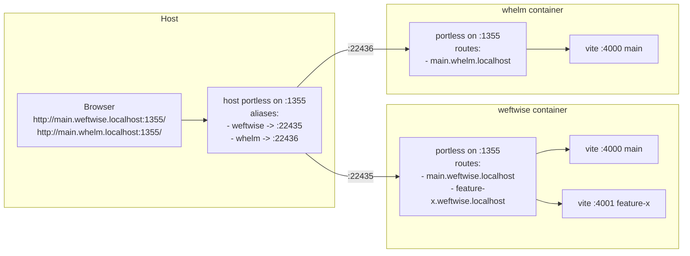
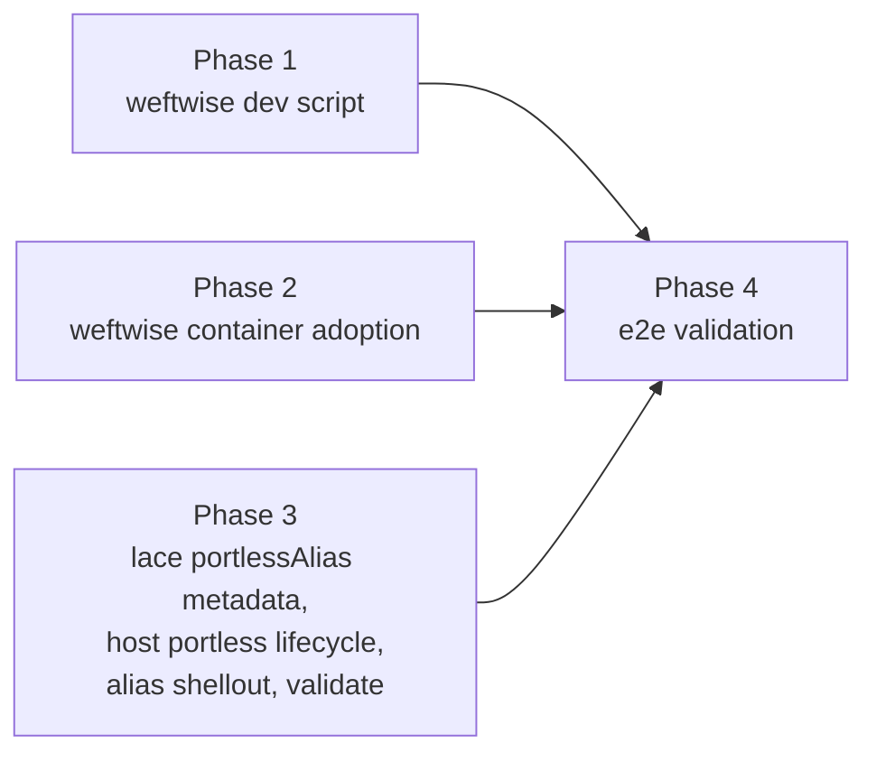

---
first_authored:
  by: "@claude-opus-4-7"
  at: 2026-05-13T13:10:39-07:00
task_list: weftwise/parallel-feature-development
type: proposal
state: live
status: implementation_accepted
last_reviewed:
  status: accepted
  by: "@claude-opus-4-7"
  at: 2026-05-14T10:30:00-07:00
  round: 8
tags: [worktree, portless, parallel-development, weftwise, multi-project]
---

# Streamlined Parallel Feature Development for Weftwise

> BLUF(opus/weftwise-parallel-dev): Weftwise's `scripts/worktree.sh` gains a `dev` subcommand and the project adopts the portless container feature; lace runs a single shared host portless on `:1355` that routes per-project to each container portless via `portless alias`.
> Browser reaches each worktree at `http://{branch}.{project}.localhost:1355/` concurrently, multi-project safe under one shared port.
> Port-80 binding (and the sysctl/setcap surface it entails) plus HTTPS via `portless trust` are deferred to the follow-up RFP `cdocs/proposals/2026-05-13-rfp-truly-portless-portless.md`.

> NOTE(opus/weftwise-parallel-dev): An earlier round-7-accepted iteration scoped per-project host portless instances with per-project host port allocations (URLs like `http://main.weftwise.localhost:22435/`).
> That broke the "single shared URL space" utility of portless: each project carried a distinct port suffix in its bookmarks.
> The design absorbs the host-portless lifecycle work previously scoped to `cdocs/proposals/2026-05-13-rfp-truly-portless-portless.md`, using port 1355 instead of 80 to sidestep sysctl/unprivileged-port concerns.
> The truly-portless-portless RFP narrows to port-80 binding specifically.

## Overview

Five things change to deliver parallel-worktree dev under one shared host port:

1. Weftwise's `scripts/worktree.sh` gains a `dev` subcommand: install-on-missing, derive branch from `$PWD`, exec `portless {branch}.weftwise.localhost pnpm dev`.
2. Weftwise adds portless to top-level `features` (one-line `devcontainer.json` change). The container portless does intra-container Host-header demux.
3. Lace adds a `portlessAlias?: boolean` port-metadata flag. Its presence on a port declaration drives the host-side alias shellout.
4. Lace bundles `portless` as a runtime dependency and owns the host portless lifecycle: probe, spawn-if-absent, reuse across `lace up` runs, teardown.
5. Lace `validate` runs a generic host-port-availability check on the allocated host port plus port 1355, and reports the URL pattern users should expect.

URL pattern: `http://{branch}.{project}.localhost:1355/`.
The host portless on `:1355` demuxes by the `{project}` segment to the project's container portless, which demuxes by the `{branch}` segment to the worktree's dev server.
The two layers are asymmetric: the host portless registers a wildcard project alias per project (one alias matches `*.{project}.localhost`), while the container portless registers full branch-qualified routes (one route per worktree).

## Objective

1. **Parallel worktrees work.** N concurrent dev servers in the single container, each reachable from the host browser at a distinct stable URL.
2. **New worktrees just work.** `git worktree add` then `scripts/worktree.sh dev` is the entire ceremony.
3. **Single shared URL space across projects.** Every project's URLs live under `:1355`; bookmarks never carry a project-specific port suffix.
4. **Multi-project safe.** Two projects up at the same time route correctly without collision or manual coordination.
5. **No sysadmin coupling.** Port 1355 is unprivileged on every supported host; no sysctl drop-in, no setcap, no `sudo`. Port-80 binding lives in the follow-up RFP.

Clean URLs on port 80 (no port suffix at all) are explicitly out of scope; that is the deliverable of the follow-up RFP.

## Background

Companion documents:

- `cdocs/reports/2026-05-13-worktree-portless-parallel-dev-prior-work.md`: design-space survey.
- `cdocs/reports/2026-05-13-clean-portless-urls-fresh-eyes.md`: clean-URL approaches (relevant to the follow-up RFP).
- `cdocs/reports/2026-05-13-weftwise-parallel-dev-decisions.md`: supplemental design decisions (D1-D12). Decisions D1-D5, D7, D8, D9, D11 apply to v1. Decisions D6, D10, D12 apply to the follow-up RFP.
- `cdocs/proposals/2026-05-13-rfp-truly-portless-portless.md`: follow-up RFP for port-80 binding.

Load-bearing facts:

- **Container portless already works.** The portless feature at `devcontainers/features/src/portless/` installs portless in-container and starts the proxy on :1355.
- **Lace's port allocator** at `packages/lace/src/lib/port-allocator.ts:96-193` allocates stable host ports in the 22425-22499 range and persists them across runs.
- **Symmetric port injection** at `packages/lace/src/lib/template-resolver.ts:181-223` (`injectForBlock`) maps the feature's container port to the allocated host port via `appPort` when portless is in top-level `features`.
- **Portless auto-injects framework-specific CLI flags for vite/astro/angular**, so weftwise's hard-coded `vite.config.ts:server.port: 3000` is overridden at runtime when launched via `portless ... pnpm dev` (no config relaxation needed).
- **Weftwise's Dockerfile bakes a pnpm store at `/build`**; bind-mount-workspace installs hit it in 2.5s (verification devlog Finding 1). No host-side mount is needed.
- **Weftwise's `.devcontainer/devcontainer.json` is already on top-level `features`** (the legacy-builder migration landed); no `prebuildFeatures` block remains.

### Existing primitives this proposal reuses

| Primitive | Location | Role |
|---|---|---|
| `bare-worktree` workspace layout | `packages/lace/src/lib/workspace-layout.ts:82-209` | Mounts the bare-repo at `/workspaces/weftwise`; all worktrees visible in one container. |
| Portless container feature | `devcontainers/features/src/portless/` | Installs `portless` in-container; runs proxy on :1355. |
| Symmetric port injection | `packages/lace/src/lib/template-resolver.ts:181-223` | Maps container :1355 to a lace-allocated host port. |
| `PortAllocator` | `packages/lace/src/lib/port-allocator.ts:96-193` | Stable host-port allocation across `lace up` runs. |
| `validate` command | `packages/lace/src/commands/validate.ts` | Extended to consume `portlessAlias` metadata. |
| `LacePortDeclaration` | `packages/lace/src/lib/feature-metadata.ts:47-57` | Extended with `portlessAlias?: boolean`. |
| `extractLaceCustomizations` | `packages/lace/src/lib/feature-metadata.ts:641-689` | Extended to round-trip `portlessAlias`. |
| Weftwise `scripts/worktree.sh` | weftwise's repo | Existing `add`/`list`/`remove`/`status` subcommands; extended with `dev`. |

### What is explicitly NOT being built in this proposal

- No port-80 binding (deferred to the follow-up RFP).
- No sysctl handling, in any form (deferred; port 1355 is unprivileged).
- No setcap, no rootful podman, no other privilege-elevation paths.
- No HTTPS via `portless trust` (separately tracked).
- No string mode for `portlessAlias` (boolean only; future RFP may extend).
- No `installDeps` flag, no `mergePostCreateCommand` extension, no pnpm-store bind mount, no vite config relaxation (all dropped from prior drafts).
- No fix for the `sshPort` phantom-option bug (separately tracked).

## Proposed Solution



The flow has four pieces. Each is detailed in Implementation Phases.

**1. Weftwise `scripts/worktree.sh dev`**: install-on-missing + container-portless launch with the full per-branch host name.

**2. Container portless**: adopted via top-level `features`; demuxes by Host header inside the container.

**3. Lace `portlessAlias` metadata**: schema-and-extractor widening; the flag drives the host-side alias shellout.

**4. Lace-owned host portless on `:1355`**: bundled binary, probe-and-spawn lifecycle, `portless alias <project> <host-port>` after the container is healthy.

### `portlessAlias` semantics

The flag's presence on a port declaration triggers two host-side behaviours during `lace up` for the project that declares it:

- Lace ensures a host portless process is running on `:1355` (spawn-if-absent, reuse otherwise).
- After the container is healthy, lace shells out `portless alias <project> <host-allocated-port>` to register the route, where `<project>` is `deriveProjectName()` and `<host-allocated-port>` is the port lace mapped container `:1355` to.

`validate` additionally consumes the flag for informational reporting and a host-port-availability probe (see Phase 3c).

The flag is portless-coupled by name (D11); future features that want host-side aliasing via a different mechanism declare a different metadata key.

## Implementation Phases

Four phases. Phases 1-3 are largely independent. Phase 4 is end-to-end validation.



### Phase 1: Weftwise `scripts/worktree.sh dev` subcommand

**File.** `/home/mjr/code/weft/weftwise/main/scripts/worktree.sh`.

**Concrete shape.**

```sh
cmd_dev() {
  local branch
  branch=$(basename "$PWD")

  # Sanity-check we're in a package directory
  if [[ ! -f package.json ]]; then
    log_error "No package.json in $PWD; run from a worktree's package directory"
    exit 1
  fi

  # Install on demand
  if [[ ! -d node_modules ]]; then
    log_info "node_modules missing in $branch; running pnpm install --frozen-lockfile"
    pnpm install --frozen-lockfile
  fi

  # portless must be on PATH (provided by the portless devcontainer feature)
  if ! command -v portless >/dev/null 2>&1; then
    log_error "portless not found on PATH; ensure the portless feature is in devcontainer.json"
    exit 1
  fi

  local route="${branch}.weftwise.localhost"
  log_info "Starting dev server: http://${route}:1355/"
  exec portless "${route}" pnpm dev
}
```

Dispatch in the main `case` statement:

```sh
case "${1:-}" in
  add) shift; cmd_add "$@" ;;
  list) cmd_list ;;
  remove) shift; cmd_remove "$@" ;;
  status) cmd_status ;;
  dev) cmd_dev ;;
  *) usage; exit 1 ;;
esac
```

**Tests.** Shell smoke tests (matches the existing script's style):

- Outside a `package.json` directory: clean error.
- Missing `node_modules`: install runs, then dev exec.
- `node_modules` present: install skipped, dev exec.
- `portless` not on PATH: clean error.

**Acceptance.** `./scripts/worktree.sh dev` from any worktree's package root, with Phase 3's host portless running, reaches the dev server at `http://{branch}.weftwise.localhost:1355/`.

### Phase 2: Adopt portless in the weftwise container

**File.** `/home/mjr/code/weft/weftwise/main/.devcontainer/devcontainer.json`.

**Diff.**

```diff
-  "appPort": [3000],
   "features": {
-    "ghcr.io/weftwiseink/devcontainer-features/lace-fundamentals:1": {}
+    "ghcr.io/weftwiseink/devcontainer-features/lace-fundamentals:1": {},
+    "ghcr.io/weftwiseink/devcontainer-features/portless:1": {}
   }
```

During lace local development before the portless feature is published, use the path reference `"./devcontainers/features/src/portless": {}`.

**Tests.** Existing weftwise CI plus manual:

- `lace up --rebuild` succeeds (rebuild required per E5).
- `podman port weftwise` shows `<22425-22499>:1355` and NO `3000:3000`.
- `podman exec weftwise portless --version` succeeds.
- After Phase 3: the host portless is running on `:1355`; `portless alias` lists `weftwise -> <22425-22499>`; `lace validate` reports the `portlessAlias` informational message.

**Acceptance.** The container portless is reachable on its lace-allocated host port; the renderer port 3000 is no longer published.

### Phase 3: Lace `portlessAlias` metadata, host portless lifecycle, alias shellout, validate

Seven sub-phases. 3a/3b/3c remain the schema/manifest/validate trio; 3d/3e/3f/3g add the host-side surface.

#### 3a: Schema widening

**File.** `packages/lace/src/lib/feature-metadata.ts`.

**Step 1: Interface widening (lines 47-57).**

```ts
export interface LacePortDeclaration {
  label?: string;
  requireLocalPort?: boolean;
  onAutoForward?: string;
  protocol?: "http" | "https";
  portlessAlias?: boolean;     // boolean-only per D11
}
```

**Step 2: Extractor widening (lines 660-673 within `extractLaceCustomizations`).**

The extractor enumerates known fields; any field not listed is silently dropped. Add the `portlessAlias` branch:

```ts
validatedPorts[key] = {
  label: typeof entry.label === "string" ? entry.label : undefined,
  onAutoForward: isValidAutoForward(entry.onAutoForward) ? entry.onAutoForward : undefined,
  requireLocalPort: typeof entry.requireLocalPort === "boolean" ? entry.requireLocalPort : undefined,
  protocol: isValidProtocol(entry.protocol) ? entry.protocol : undefined,
  portlessAlias: typeof entry.portlessAlias === "boolean" ? entry.portlessAlias : undefined,
};
```

Without Step 2, the `portlessAlias: true` from the feature manifest is silently dropped before the host-portless and validate consumers see it.

**Tests.**

- Unit: `LacePortDeclaration` widened type accepts `portlessAlias: true` / `false` / undefined.
- Unit: `extractLaceCustomizations` round-trips `portlessAlias` for booleans; coerces non-booleans to `undefined`.

#### 3b: Portless feature manifest

**File.** `devcontainers/features/src/portless/devcontainer-feature.json`.

**Diff.**

```diff
   "customizations": {
     "lace": {
       "ports": {
         "proxyPort": {
           "label": "portless proxy",
           "onAutoForward": "silent",
-          "requireLocalPort": true
+          "requireLocalPort": true,
+          "portlessAlias": true
         }
       }
     }
   }
```

The flag is consumed by 3c (validate), 3e (host portless lifecycle), and 3f (alias shellout).

#### 3c: `validate` command extension

**File.** `packages/lace/src/commands/validate.ts`.

After the existing validation passes (or alongside them, scoped to a new sub-check), iterate the resolved config's port allocations and per-port metadata. For each allocation whose port declaration has `portlessAlias === true`:

1. **Generic host-port availability check.** Probe whether `allocation.port` and host port `1355` are bound by something other than the project's own running container or the lace-owned host portless. The probe is the same shape `PortAllocator` already uses (`isPortAvailable` at `packages/lace/src/lib/port-allocator.ts:19-44`); reuse it.
   - If both ports are free or held by lace-owned processes: pass silently.
   - If port 1355 is held by an unrelated process: warn (not error) and print the offending hint.
   - If the allocated host port is held by an unrelated process: warn; lace's `PortAllocator` will re-allocate on `lace up`.
2. **Informational message.** Print a one-line pointer:

   ```
   info: portless feature detected (alias=<project>); URLs at http://{branch}.<project>.localhost:1355/.
   info: port-80 binding is tracked in cdocs/proposals/2026-05-13-rfp-truly-portless-portless.md.
   ```

The check is automatic, driven by `portlessAlias` presence in the config, not by a flag the user passes.

**Generic-not-sysctl-coupled framing.** The host-port-availability check is the foundational primitive; here it works against the lace-allocated host port (22425-22499) and port 1355. The follow-up RFP reuses the same primitive against port 80 (or 443) plus environment-specific remediation hints (sysctl is one example; setcap is another; rootful podman is another). Lace itself stays out of the sysadmin business: any required system change is printed to stdout for the user to evaluate and apply, not auto-applied.

> NOTE(opus/weftwise-parallel-dev): The "auto-apply sysctl" path explored in earlier drafts is explicitly OUT of scope.
> Lace prints; the user applies. This keeps lace environment-portable (NixOS, immutable distros, container hosts, CI runners) and avoids taking on sysadmin responsibility.
> Port 1355 is unprivileged on every supported host, so the entire sysctl surface is irrelevant to this proposal.

**Tests.**

- Unit: `validate` with a fixture config containing `portlessAlias: true` invokes the port-availability check and prints the informational message.
- Unit: `validate` with no `portlessAlias` ports is a no-op for this sub-check.
- Unit: when the host port is held by an unrelated process, `validate` warns but does not error.
- Integration: `lace validate` against a weftwise fixture (portless in `features`) produces the expected output.

**Acceptance.**

- `lace validate` for a project with portless in `features` prints the informational message and the port-availability result.
- `lace validate` for a project without portless is unaffected.
- Neither path makes any system change.

#### 3d: Bundle portless as a lace dependency

**File.** `packages/lace/package.json`.

Add `portless` to `dependencies`. Resolve the binary at runtime via `require.resolve("portless/dist/cli.js")` (or the equivalent Node API for the published shape of portless's bin entry; verify against `node_modules/portless/package.json` after install).

Upgrading portless becomes a lace dependency bump, not a separate user action. No global install, no clutter on the user's PATH. See D9.

**Tests.**

- Unit: the resolved binary path exists and is executable.
- Smoke: `node <resolved-path> --version` returns a sane version string.

#### 3e: Host portless lifecycle module

**File.** New module at `packages/lace/src/lib/host-portless.ts` (or similar; final location subject to existing file-organization conventions).

Responsibilities:

- **Probe.** On `lace up` for any project carrying a `portlessAlias: true` port, probe whether a host portless process is already listening on `:1355` (reuse `isPortAvailable` semantics: bound by lace-owned PID is "running"; bound by an unrelated process is a warning surface for validate).
- **Spawn.** If absent, spawn via `child_process.spawn(node, [portlessCliPath, '--wildcard'], { detached: true, stdio: 'ignore' })`, then `unref()`. The `--wildcard` flag enables suffix matching so `*.weftwise.localhost` matches a single registered alias for `weftwise`.
- **Persist.** Record `{ pid, startedAt, port: 1355, portlessVersion }` to `~/.config/lace/portless-runtime.json`.
- **Reuse.** Subsequent `lace up` invocations read the runtime file and reuse a still-living process; stale entries (PID not running) are replaced.

> NOTE(opus/weftwise-parallel-dev): `--wildcard` semantics must be re-verified against the bundled portless version's source.
> The previous round's source-read against an earlier upstream confirmed the flag; the bundled version may differ.

**Tests.**

- Unit: probe correctly distinguishes "lace-owned portless" from "unrelated process" using the persisted PID.
- Unit: spawn writes the runtime file; reuse path reads it and skips spawning.
- Unit: stale PID in the runtime file is detected and replaced.

#### 3f: `portless alias` shellout from `lace up`

**File.** `packages/lace/src/lib/up.ts` (extension point; final integration site depends on existing health-check / post-up hooks).

After the container is healthy and Phase 3e has ensured the host portless is running, lace shells out:

```
portless alias <project> <host-allocated-port>
```

where `<project>` is `deriveProjectName()` (existing helper at `packages/lace/src/lib/project-name.ts`) and `<host-allocated-port>` is the lace-allocated host port mapped to container `:1355`.

The alias call is idempotent: re-registering an existing alias updates the target port without error. See D7 (lace owns the alias call, not weftwise scripts) and D11 (alias name is the project name).

**Tests.**

- Unit: the shellout is constructed with the correct project name and port.
- Unit: re-running `lace up` updates the alias without error.
- Integration: against a running host portless, `portless alias` registration succeeds and the route resolves.

#### 3g: Teardown surface

**File.** Existing `lace doctor` command (or the nearest natural fit; verify the command surface before introducing a new subcommand).

Add a `--reset` mode that:

- Sends `SIGTERM` to the host portless PID recorded in `~/.config/lace/portless-runtime.json`.
- Removes the runtime state file.

The teardown is best-effort: a missing file or already-dead PID is a no-op, not an error.

Aliases persist on the host portless across container restarts (intended for reuse on the next `lace up`); after `lace down` removes a project's container, the alias points at a now-unbacked host port until the project is brought back up or `lace doctor --reset` nukes the whole daemon, which is the only built-in way to clear stale aliases in v1.

> NOTE(opus/weftwise-parallel-dev): Stale-alias cleanup remains tracked at `cdocs/proposals/2026-05-13-rfp-lace-stale-portless-alias-cleanup.md`.
> Out of scope for this proposal; teardown here resets the daemon, not its registered aliases.

**Tests.**

- Unit: `--reset` with no runtime file is a no-op.
- Unit: `--reset` with a live PID sends SIGTERM and removes the file.
- Unit: `--reset` with a stale PID still removes the file.

### Phase 4: End-to-end validation

Captured to a devlog at `cdocs/devlogs/<date>-weftwise-parallel-dev-validation.md`.

**Setup.**

1. Weftwise with three worktrees: `main`, `feature-x`, `loro_migration`.
2. Phases 1-3 applied.
3. Clean state: `rm -rf .lace/`.

**Step-by-step.**

| Step | Command | Expected |
|---|---|---|
| 1 | `lace validate` in weftwise/main | Prints "portless feature detected" info + port-availability result (host port + `:1355`). No system changes. |
| 2 | `lace up --rebuild` in weftwise/main | Container builds; `podman port weftwise` shows `<22425-22499>:1355` and NO `3000:3000`; `podman exec weftwise portless --version` succeeds; host portless on `:1355` is running (PID recorded in `~/.config/lace/portless-runtime.json`); `portless alias` lists `weftwise -> <host-port>`. |
| 3 | `./scripts/worktree.sh dev` in `main` (inside container) | Vite starts on a 4xxx port (portless auto-injects `--port`); `http://main.weftwise.localhost:1355/` returns HTTP 200 from the host browser. |
| 4 | `./scripts/worktree.sh dev` in `feature-x` (concurrent, separate pane) | Vite starts on a different 4xxx; `http://feature-x.weftwise.localhost:1355/` returns HTTP 200; `main` still serving. |
| 5 | `./scripts/worktree.sh dev` in `loro_migration` (concurrent) | Three concurrent dev servers; three URLs serving HTTP 200 on `:1355`. |
| 6 | Inside container: `pnpm --version` from the dev-script context | The `pnpm install` invoked by the dev script routes through corepack (per `packageManager: pnpm@10.26.2`), not the login-shell nvm `pnpm@11.1.1`; electron postinstall does not break (verification devlog Finding 4). |
| 7 | Add a new worktree on the host: `git worktree add ../feature-y`; verify with `ls /workspaces/weftwise/` inside the container | `feature-y/` appears in the listing. |
| 8 | `./scripts/worktree.sh dev` in `feature-y` | Install runs (2.5s, baked store); dev starts; `http://feature-y.weftwise.localhost:1355/` returns HTTP 200. |
| 9 | `lace up` for a second project (e.g., whelm) with portless in features | Host portless on `:1355` is reused (same PID); `portless alias` lists `weftwise -> <port-a>` and `whelm -> <port-b>`; `http://main.whelm.localhost:1355/` reachable concurrently with `http://main.weftwise.localhost:1355/`. (Precondition: whelm has adopted portless and a dev-script convention.) |
| 10 | `lace doctor --reset` | Host portless terminated; `~/.config/lace/portless-runtime.json` removed; subsequent `lace up` re-spawns cleanly. |

**Success criteria.**

- All three weftwise URLs return HTTP 200 simultaneously on `:1355`.
- Multi-project step 9 reaches both projects' URLs concurrently on a single shared `:1355`, demonstrating the host portless routes by `{project}` segment. This step is load-bearing.
- `worktree.sh dev` in a fresh worktree completes under 5s on warm caches.
- `lace validate` runs the new sub-check automatically when `portlessAlias` is present and is silent otherwise.
- `lace up` is idempotent: re-running on a healthy project reuses the host portless and updates the alias without error.
- `lace doctor --reset` cleanly terminates the host portless and removes runtime state.
- No system changes by lace (no sudo, no sysctl, no systemd, no /etc/ writes).

If any step fails, the proposal returns to `status: wip` with a deviation NOTE.

## Test Plan (consolidated)

### Unit (lace TypeScript)

- `feature-metadata.test.ts`: `LacePortDeclaration` schema accepts `portlessAlias: true/false/undefined`; `extractLaceCustomizations` round-trips booleans and coerces non-booleans to undefined.
- `validate.test.ts`: `portlessAlias: true` triggers the port-availability check + info message; `portlessAlias: false` / absent is a no-op for the sub-check.
- `host-portless.test.ts`: probe distinguishes lace-owned vs unrelated processes; spawn writes the runtime file; reuse path reads it; stale PIDs are replaced.
- `up.test.ts` (extension): the alias shellout is constructed with the correct project name and port; re-running is idempotent.
- `doctor.test.ts` (extension): `--reset` is a no-op when no runtime file exists; with a live PID it sends SIGTERM and removes the file; with a stale PID it still removes the file.

### Integration (lace)

- `portless-validate-integration.test.ts`: fixture devcontainer.json with portless in `features`; running `lace validate` against it exercises the full extractor -> validate path and produces the expected stdout.
- `host-portless-integration.test.ts`: against a real spawned host portless, the alias registration succeeds and the route resolves.

### End-to-end

Phase 4's 10-step matrix.

### Weftwise smoke

`./scripts/worktree.sh dev` from each worktree; error paths covered (no `package.json`, no portless, no `node_modules`).

## Edge Cases

### E1: Container hostname is not `weftwise`

Truncated container ID. Cosmetic; orthogonal to URL routing (container portless registers full hostnames provided by the dev script).

### E2: `lace up --rebuild` required for `appPort` changes

`lace up` without `--rebuild` does not detect `appPort` changes. The migration guide instructs `--rebuild` for the first `lace up` after editing `devcontainer.json`.

### E3: New worktrees mid-session

Handled by the dev script's install-on-missing path. No `lace up` re-run, no manual install.

### E4: Wildcard alias matching on the host portless

The host portless spawns with `--wildcard` so a single alias `weftwise -> <host-port>` matches every `*.weftwise.localhost` request (including `main.weftwise.localhost`, `feature-x.weftwise.localhost`, etc.). The container portless then does exact-hostname matching against routes registered by the dev script.

> NOTE(opus/weftwise-parallel-dev): The `--wildcard` flag semantics must be re-verified empirically against the bundled portless version (D11 already flags this).
> Falsified-wildcard behaviour falls back to per-route alias registration from the dev script, which is a worse but workable degraded mode.

### E5: pnpm version split-brain

Pre-existing weftwise drift (verification devlog Finding 4). The dev script's `pnpm install` runs in a non-interactive shell where corepack routes to the `packageManager` version. Phase 4 step 6 verifies this empirically.

### E6: Multi-service per worktree (out of scope)

If weftwise later needs to expose multiple services per worktree (e.g., sync-server on 42069 alongside vite), the route name extends to `<service>.<branch>.<project>.localhost`. The dev script and container portless support this with no extra plumbing.

### E7: Multiple projects on the same host

Each project gets its own container portless on its own lace-allocated host port. The single shared host portless on `:1355` aliases each project name to its host port, so URLs disambiguate by the `{project}` segment under a single shared port: `main.weftwise.localhost:1355` and `main.whelm.localhost:1355`.

Forward-compatible with the follow-up RFP, which drops the `:1355` suffix once port-80 binding is in place.

## Open Questions

- **Q. Should `lace validate` warn or error when `portlessAlias` is present but the port-availability probe finds `:1355` or the allocated host port held by something else?**
  Warn, not error. The check is informational; the actual port allocation runs at `lace up` time and `PortAllocator` handles re-allocation for the project port (`port-allocator.ts:141-160`). For `:1355` specifically, a collision with an unrelated process means the user has to free the port or accept that the host portless cannot start.

- **Q. Should `portlessAlias` be visible to projects that aren't using the portless feature?**
  Yes; the metadata key is generic-looking but its name (`portlessAlias`) communicates that it is tied to the portless feature's intent. Future features that want host-side aliasing without going through portless should declare a different metadata key.

- **Q. What happens after the follow-up RFP lands?**
  The same `portlessAlias: true` keeps triggering the same lifecycle, except the host portless binds `:80` instead of `:1355` (subject to the sysctl/setcap remediation the follow-up scopes). URLs lose the `:1355` suffix. No re-touching of feature manifests required.

- **Q. What does the user experience look like with `:1355` URLs?**
  Browser bookmarks include the `:1355` suffix (e.g., `http://main.weftwise.localhost:1355/`). Stable across `lace up` runs because `PortAllocator` persists allocations in `.lace/port-assignments.json` and the host portless is reused. Bookmark migration after the follow-up lands is a one-time strip-the-suffix edit.

- **Q. What if `:1355` is already held by another lace install or unrelated process?**
  `validate` warns; `lace up` aborts with a clear error pointing at the offending PID. No fallback port: the entire design rests on a single shared port, and silently relocating it would undermine that property. The user resolves the conflict explicitly.

## Summary

This proposal ships the parallel-worktree dev path with the single-shared-port URL space:

- One weftwise script subcommand.
- One weftwise devcontainer.json edit.
- One lace metadata field (`portlessAlias?: boolean`) with two-step widening (interface + extractor).
- One portless feature manifest one-line change.
- One `validate` sub-check.
- One bundled portless dependency.
- One host portless lifecycle module (probe / spawn / persist / reuse / teardown).
- One alias shellout from `lace up`.

The only durable host state is `~/.config/lace/portless-runtime.json` (lace-owned, removed by `lace doctor --reset`). No sudo prompts, no sysctl, no setcap, no systemd, no global npm installs.

Deferred to the follow-up RFP `cdocs/proposals/2026-05-13-rfp-truly-portless-portless.md`:

- Port-80 binding specifically (the sysctl / setcap / rootful-podman surface).
- HTTPS via `portless trust`.
- Stale-alias cleanup (already had its own RFP at `cdocs/proposals/2026-05-13-rfp-lace-stale-portless-alias-cleanup.md`; remains relevant for the follow-up).

The design is forward-compatible with the follow-up: the lifecycle module's bind port is the only thing that changes from `:1355` to `:80`, gated on the remediation the follow-up scopes.

## References

### Supporting documents

- Design decisions supplemental (scope: D1-D5, D7, D8, D9, D11): `cdocs/reports/2026-05-13-weftwise-parallel-dev-decisions.md`.
- Companion design-space survey: `cdocs/reports/2026-05-13-worktree-portless-parallel-dev-prior-work.md`.
- Clean-URL fresh-eyes report (informs the follow-up RFP): `cdocs/reports/2026-05-13-clean-portless-urls-fresh-eyes.md`.
- Verification devlog: `cdocs/devlogs/2026-05-13-verify-weftwise-migration.md` (round-7 baseline; findings on install perf and pnpm split-brain remain valid).

### Follow-up RFPs

- Port-80 binding: `cdocs/proposals/2026-05-13-rfp-truly-portless-portless.md`.
- Stale-alias cleanup: `cdocs/proposals/2026-05-13-rfp-lace-stale-portless-alias-cleanup.md`.
- HTTPS via `portless trust`: `cdocs/proposals/2026-05-13-rfp-portless-https-via-trust.md`.

### Lace source (Phase 3 targets)

- `packages/lace/src/lib/feature-metadata.ts:47-57` (interface widening).
- `packages/lace/src/lib/feature-metadata.ts:660-673` (extractor widening).
- `packages/lace/src/commands/validate.ts` (sub-check addition).
- `packages/lace/src/lib/port-allocator.ts:19-44` (`isPortAvailable`, reused for the probe).
- `packages/lace/src/lib/host-portless.ts` (new; lifecycle module per 3e).
- `packages/lace/src/lib/up.ts` (alias shellout integration per 3f).
- `packages/lace/src/lib/project-name.ts` (existing `deriveProjectName()` helper, consumed by 3f).
- `packages/lace/package.json` (`portless` dependency per 3d).
- `packages/lace/src/commands/doctor.ts` (or nearest fit; `--reset` mode per 3g).

### Feature source (Phase 3 target)

- `devcontainers/features/src/portless/devcontainer-feature.json`: add `portlessAlias: true`.

### Weftwise host artefacts

- `/home/mjr/code/weft/weftwise/main/.devcontainer/devcontainer.json` (Phase 2).
- `/home/mjr/code/weft/weftwise/main/scripts/worktree.sh` (Phase 1).

### Superseded

- `cdocs/proposals/2026-02-26-host-proxy-project-domain-routing.md`: `state: archived, status: evolved`, now pointing at this proposal (the host portless surface lives here).
