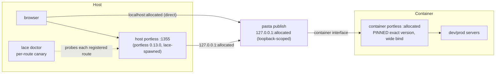

---
first_authored:
  by: "@claude-fable-5"
  at: 2026-07-18T17:21:18-07:00
task_list: portless/ingress-durability
type: proposal
state: live
status: implementation_ready
last_reviewed:
  status: accepted
  by: "@claude-opus-4-8"
  at: 2026-07-18T17:34:53-07:00
  round: 2
tags: [portless, devcontainer, networking, dependency_pinning, dev-infra]
---

# Portless Feature Version Pin and Ingress Durability

> BLUF: Pin the portless devcontainer feature to an exact tested version instead of `latest`, because upstream portless 0.15.4 (published 2026-07-16, third-party, vercel-labs) changed the proxy to bind loopback only, which breaks every host-to-container route on podman/pasta hosts at the next container rebuild.
> The pin is the whole fix for the outage class: versions 0.13.0 through 0.15.3 bind all interfaces, so pasta's interface-address delivery reaches the proxy with no bridge, no relay, and no new processes.
> Around the pin, three durability measures: a per-route host-reachability check in `lace doctor` so the next upstream behavior change is a named diagnostic instead of a white screen, a loopback-scoped `appPort` publish so the restored wide bind is not LAN-exposed, and a discoverable per-project origin so consuming repos stop hardcoding `:1355`.
> An upstream feature request (opt-in bind flag decoupled from LAN mode) is the eventual unpin path, not a blocker.
> Delivery has two legs because the feature is consumed as a published OCI artifact, not from this repo: consumers get the fix immediately via a feature `version` option override in their own devcontainer config, and durably via a republished feature plus a consumer lock refresh.
> Full diagnosis and design adjudication: [`2026-07-18-review-of-weftwise-lace-ingress-handoff.md`](../reviews/2026-07-18-review-of-weftwise-lace-ingress-handoff.md).

## Objective

Host-to-container reachability (`http://<branch>.<project>.localhost:1355/` and the published per-project port) must survive a container rebuild with zero hand-started processes, and future upstream portless changes must surface as explicit, diagnosable events rather than silent breakage.

## Background

- Weftwise's [ingress report](https://github.com/weftwiseink/weftwise/blob/mirror-rearch/cdocs/reports/2026-07-18-lace-portless-ingress-architecture.md) measured the break: with a hand-started relay stopped, host requests return `HTTP 502`; with it running, `200`. Its Section 8 asked lace for a committed interface-to-loopback bridge.
- The [cross-repo review](../reviews/2026-07-18-review-of-weftwise-lace-ingress-handoff.md) re-diagnosed the defect: the feature installs `portless@latest` (`devcontainers/features/src/portless/devcontainer-feature.json`, `version` default `"latest"`; `install.sh` runs `npm install -g "portless@${VERSION}"`), and 0.15.4 is the first version that binds loopback only. The [2026-05-14 multi-project validation](../devlogs/2026-05-14-weftwise-parallel-dev-multi-project-validation.md) worked relay-free on 0.13.0 because that era's proxy bound all interfaces.
- portless is third-party (github.com/vercel-labs/portless). The design record commits to upstream-no-fork ([integration design rationale](../reports/2026-02-26-portless-integration-design-rationale.md), Decision 2). The host tier is separately pinned at `^0.13.0` via `packages/lace/package.json` and still runs 0.13.0.
- No portless version offers a wide bind while keeping `.localhost`: LAN mode is the only wide-bind path and it force-switches the TLD to `.local`.

## Proposed Solution

Four committed changes in this repo, plus one upstream engagement and one cross-repo cleanup.

1. **Exact version pin, delivered along both consumption paths.** Change the feature's `version` default from `"latest"` to `"0.15.3"` (newest wide-binding release), contingent on the Phase 1 smoke test; fall back to `"0.13.0"` (last lace-validated version) if 0.15.3 misbehaves. Document the pin's reason and the unpin condition next to the option.
   The feature reaches consumers as a published artifact (`ghcr.io/weftwiseink/devcontainer-features/portless:1`) held by digest in each consumer's `devcontainer-lock.json`, so the source edit alone changes nothing at any consumer: the fix ships as (a) an immediate consumer-side feature option override `{ "version": "0.15.3" }`, which `install.sh` honors at build time regardless of the locked artifact digest, and (b) a feature self-version bump, republish via the release workflow, and consumer lock refresh, after which the override is redundant and may be dropped or kept as defense in depth.
2. **Reachability canary in `lace doctor`.** For each project with a registered portless alias, request the route from the host and report per-hop status: host portless up, alias present, published port reachable, container proxy answering. Failure output names the dead hop.
3. **Loopback-scoped publish.** Emit `127.0.0.1:<port>:<port>` instead of `<port>:<port>` in generated `appPort` entries for portless-alias ports, so the wide-binding container proxy is reachable from the host but not the LAN. Verify pasta honors the host-address publish form before landing; if it does not, keep the symmetric form and record the exposure in the feature README.
4. **Origin discoverability.** Expose the allocated per-project origin (`http://<branch>.<project>.localhost:<allocated>/`, valid on host and in-container) programmatically: a `lace route <project>` subcommand or documented stable read of `.lace/port-assignments.json`, plus a feature README section stating the two-origin contract (`:1355` is host-side convenience; `:<allocated>` is the canonical programmatic origin). Consuming repos derive origins instead of hardcoding `:1355`.
5. **Upstream engagement (non-blocking).** File an issue against vercel-labs/portless requesting an opt-in bind-address flag (or `PORTLESS_BIND` env) decoupled from LAN/mDNS mode, citing the containerized-behind-published-port use case. When it lands, bump the pin and pass the flag instead of relying on the wide-bind default.
6. **Runtime-drift cleanup (cross-repo, with weftwise).** After a rebuilt relay-free container serves host `200`: delete the in-container hand relay and the host `~/.cache/weft-portless-bridge.mjs` tunnel, and confirm the `weftwise`/`whelm` aliases are `lace up`-registered (re-run `lace up` if any were added by hand).

## Important Design Decisions

- **Pin, not bridge.** A committed socat/node forwarder (the weftwise brief's preferred option) would permanently run a second network process to compensate for an upstream change lace never chose to ingest, and would mask the next such change. The pin removes the regression at its entry point. Prior art already rejected socat forwarding for the host tier ([fresh-eyes report](../reports/2026-05-13-clean-portless-urls-fresh-eyes.md), option C).
- **Exact pin, not a range.** 0.15.4 shipped a behavior change in a patch release; ranges are how this outage class gets in. The host tier's `^0.13.0` is already effectively exact via the pnpm lockfile; moving the declaration to exact is hygiene that documents intent, not part of the live fix.
- **A consumer feature option is config, not drift.** The weftwise brief's "no network-binding workaround in `.devcontainer`" rule stands, but a feature `version` option is the feature's own public configuration surface, not a workaround: it is the designed lever for exactly this situation and the only lever that delivers the fix with zero republish latency. The prohibition in Phase 1 is scoped accordingly.
- **Keep the `:1355` host tier.** Consolidating on the per-project port alone would reverse the round-8 "single shared URL space" decision and abandon the `:80`/HTTPS roadmap ([decisions D2/D6/D12](../reports/2026-05-13-weftwise-parallel-dev-decisions.md)). Once pinned, the tier costs little and never broke this week (it runs lace's own pinned 0.13.0). Retiring it remains available as a separate, explicit supersession proposal if the maintainer wants it; see review Q2.
- **Canary in `lace doctor`, not a daemon.** Doctor is the established home for environment diagnostics and already handles host-portless teardown (`--reset`); the per-route check is a new diagnostic action there (the liveness probe logic currently lives in `host-portless.ts` and is reused, not duplicated). On-demand beats a new supervisor process.
- **Security posture at least as good as before.** The pin restores the May-era wide bind inside the container; the loopback-scoped publish makes the overall posture strictly safer than May (LAN-blocked at the pasta layer) rather than merely equal.

## Edge Cases

- **0.15.3 was never lace-validated.** 0.13.0 to 0.15.3 may contain state-dir, alias, or flag changes that matter even with the wide bind intact. Phase 1 smoke-tests before the pin value is committed; the fallback pin is 0.13.0.
- **pasta may reject a host-scoped publish.** If `127.0.0.1:<port>:<port>` fails on this podman version, phase 3 degrades to documenting the exposure; the pin does not depend on it.
- **Existing containers keep 0.15.4 until rebuilt.** The pin only takes effect on rebuild. The cleanup phase must sequence: rebuild first, verify host `200` relay-free, then delete the relay and tunnel.
- **Digest-pinned locks silently defeat a source-only pin.** Consumers' `devcontainer-lock.json` pins the feature artifact by sha256, and the prebuild path re-seeds prior lock entries, so a rebuild without the option override or a lock refresh reinstalls the pre-fix artifact (whose default is still `latest`, resolving 0.15.4). This is why Phase 1's acceptance test runs against a consumer carrying the option override, and why Phase 1b exists at all.
- **Alias drift.** If current aliases were hand-added, deleting them without re-running `lace up` breaks the host tier; the cleanup step re-registers via the committed path before removing anything.
- **Upstream deletes or renames old versions.** npm tarballs for 0.13.0-0.15.3 exist today; if upstream ever unpublishes, the pin fails loudly at build time (`npm install -g portless@<exact>` errors), which is the desired failure mode. Vendoring is the contingency and is out of scope until forced.
- **Feature README drift.** The README currently describes an asymmetric `22435:1355` mapping that does not match the top-level symmetric code path; phase 4's README rewrite corrects it so the two-origin contract is not documented against stale behavior.

## Test Plan

- **Pin efficacy (the acceptance test from the weftwise brief, adopted):** on a freshly rebuilt weftwise container with no hand-started relay, host `curl -sI http://<branch>.weftwise.localhost:1355/` returns `HTTP 200`; the same for the direct published-port origin `http://<branch>.weftwise.localhost:<allocated>/`.
- **Bind verification:** in-container socket table shows the portless proxy listening on a non-loopback address (interface or `0.0.0.0`/`*`), and `portless --version` reports the pinned version exactly.
- **Second project:** `whelm` (or any second lace project) reachable from the host on the same fresh-container basis, proving the fix is at the shared feature layer.
- **Canary:** `lace doctor` on a healthy setup reports all hops green per route; stopping the container proxy flips exactly the container-proxy hop to a named failure.
- **Loopback publish:** with phase 3 landed, `ss` on the host shows the published port bound to `127.0.0.1` (not `*`), and a LAN-address request to the published port fails while `localhost` succeeds.
- **Regression:** existing `lace up` integration tests pass; alias re-registration is idempotent (`--force` path unchanged).

## Verification Methodology

Every phase verifies against a real rebuilt container, not config inspection: the outage class this proposal addresses was invisible in committed config and only observable at the socket table and from a host-side probe.
Paste into the implementation devlog, per phase: the socket-table line for the proxy bind, the host curl status lines with the relay confirmed absent (`ps` capture), and the `lace doctor` output.
The weftwise `mirror-rearch` worktree is the natural test bed since its report documents the pre-fix `502` baseline: reproduce the `502` first (stop the relay) on the unrebuilt container, then rebuild with the pin and show `200` relay-free.

## Implementation Phases

Phase 1 is the immediate outage fix (consumer-side, zero republish latency).
Phase 1b makes it durable at the feature layer.
Phase 2 can land with either.
Phases 3-5 are independent follow-ups.
Phase 6 is cross-repo cleanup gated on phase 1.

### Phase 1: pin via consumer feature option, and in feature source

- Smoke-test 0.15.3 in a scratch container: proxy starts with the existing entrypoint flags (`--port`, `--no-tls`), binds wide, routes by Host header, `alias` works against it. Fall back to 0.13.0 on any misbehavior.
- **Immediate mitigation:** in the weftwise source `.devcontainer/devcontainer.json`, set the portless feature option `"version": "0.15.3"`. `install.sh` reads `VERSION` at build time, so this works against the currently locked artifact with no republish and no lock refresh.
- Set the `version` default to the tested value in the feature source `devcontainer-feature.json`; add a README note stating why (0.15.4 loopback bind) and the unpin condition (upstream bind flag).
- Optionally move `packages/lace/package.json` `portless` from `^0.13.0` to exact (hygiene: the lockfile already holds 0.13.0; the change documents intent).
- **Success criteria:** on a consumer carrying the option override: fresh rebuild, relay-free host `200` on both origins, `portless --version` in-container reports the pin exactly.
- **Do NOT:** add any bridge/forwarder process; add any network-binding workaround to consumer `.devcontainer` files (the feature `version` option is designed configuration and is explicitly permitted).

### Phase 1b: republish the feature and refresh consumer locks

- Bump the feature's own `version` in `devcontainer-feature.json` (e.g. 1.0.0 to 1.0.1), merge to `main` so the feature release workflow publishes the new artifact to `ghcr.io/weftwiseink/devcontainer-features/portless`.
- Refresh each consumer's `devcontainer-lock.json` to the new digest (weftwise worktrees first), minding the prebuild path that re-seeds prior lock entries.
- After a rebuild on the refreshed lock, the Phase 1 option override is redundant; keep or drop it per the maintainer's defense-in-depth preference (recorded in the review's open questions).
- **Success criteria:** a consumer with a refreshed lock and NO option override gets the pinned version on rebuild, verified by `portless --version` and the relay-free host `200`.
- **Depends on:** phase 1 (pin value settled by its smoke test).

### Phase 2: `lace doctor` per-route reachability canary

- For each `portlessAlias` allocation: probe host portless liveness (existing), alias presence, host request to `http://<canonical-route>:1355/`, and direct published-port request; report per-hop pass/fail with the failing hop named.
- **Success criteria:** the Test Plan canary scenarios, including the induced-failure case.

### Phase 3: loopback-scoped publish

- In `template-resolver.ts` port-entry generation, emit `127.0.0.1:<port>:<port>` for portless-alias ports after verifying pasta honors host-scoped publishes on this podman version; degrade to documentation if not.
- Update the duplicate-suppression check in `generatePortEntries` (it matches entries by `startsWith("<port>:")`), and any user-override detection, to recognize the host-scoped entry form; otherwise the change double-emits or misses user overrides.
- **Success criteria:** host `ss` shows loopback-bound publish; host paths still work; LAN request refused; no duplicate `appPort` entries in generated config.

### Phase 4: origin discoverability

- Add `lace route <project>` (or document the `.lace/port-assignments.json` contract) printing both origins; rewrite the feature README's stale asymmetric-mapping section into the two-origin contract, and correct its upstream link (it points at `nicobrinkkemper/portless`; the package's own repository field is `vercel-labs/portless`).
- **Success criteria:** a consuming script can derive the canonical origin with no hardcoded port; README matches actual top-level-feature behavior.

### Phase 5: upstream engagement

- File the vercel-labs/portless issue for an opt-in bind flag decoupled from LAN mode; link it from the pin's README note.
- **Success criteria:** issue filed and linked; a tracking NOTE added to this proposal when upstream responds.

### Phase 6: runtime-drift cleanup (with weftwise)

- After phase 1 verification on the weftwise container: kill and delete the hand relay, delete `~/.cache/weft-portless-bridge.mjs`, re-run `lace up` to confirm alias ownership, and re-verify both origins plus the weftwise `qa-up` health probes.
- **Success criteria:** the weftwise brief's acceptance criteria hold verbatim; no orphaned forwarder processes remain (`ps` capture pasted).

## Summary

The weftwise handoff asked lace to bridge an interface-to-loopback gap; the investigation behind the [companion review](../reviews/2026-07-18-review-of-weftwise-lace-ingress-handoff.md) showed the gap is two days old and version-shaped, so this proposal pins the version instead of building the bridge.
The durability additions (canary, loopback-scoped publish, discoverable origins) each retire a specific documented pain: undiagnosable white screens, LAN exposure of dev servers, and consumers hardcoding `:1355`.
The maintainer's open options from the review (pin target, host-tier fate, LAN posture) are carried as review Q1-Q3; this proposal assumes the recommended answers and marks the divergence points where a different answer would change a phase.

> NOTE(fable/portless/ingress-durability): Phases 1, 1b, and 6 are implemented and verified: pin value 0.15.3 (smoke test passed, fallback unused), feature 1.0.1 published to ghcr (<https://github.com/weftwiseink/lace/actions/runs/29693044839>), weftwise main carries the option override and a lock refreshed to the 1.0.1 digest via `devcontainer upgrade`.
> Phase 6 completed 2026-07-19 with maintainer authorization: the weftwise container was rebuilt via `lace up --rebuild`, the hand relay and host tunnel were deleted, and the acceptance test passed (relay-free host `200` on both origins, in-container 0.15.3 on a wide `::` bind, alias registered by `lace up` itself).
> Phases 2-5 (doctor canary, loopback-scoped publish, origin discoverability, upstream issue) are outstanding.
> Implementation devlog: [`2026-07-19-portless-pin-implementation.md`](../devlogs/2026-07-19-portless-pin-implementation.md).

> NOTE(fable/portless/ingress-durability): Round-1 review ([`2026-07-18-review-of-portless-feature-version-pin-and-ingress-durability.md`](../reviews/2026-07-18-review-of-portless-feature-version-pin-and-ingress-durability.md)) found the original draft had no working delivery path: the feature ships as a digest-locked published artifact, so a source-only pin never reached consumers.
> The current phasing (consumer option override first, republish plus lock refresh second) is the response.
> Its remaining maintainer questions: whether the option override stays as defense in depth after the lock refresh (assumed: drop it once Phase 1b verifies), feature version bump granularity (assumed: patch bump), and whether the canary ships with the pin or after (assumed: after; the pin does not wait for it).
