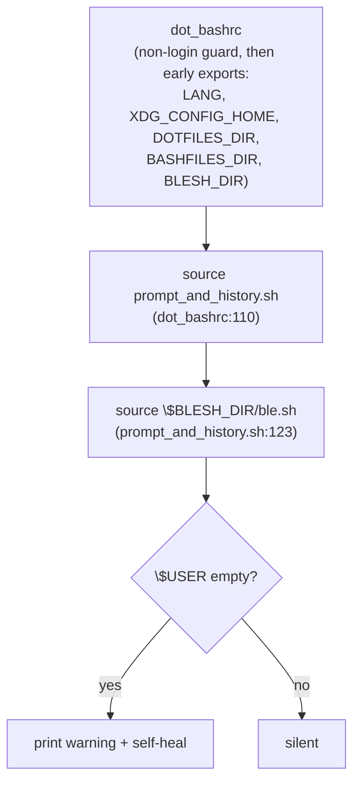

---
first_authored:
  by: "@claude-opus-4-8"
  at: 2026-09-01T14:30:00-07:00
task_list: devcontainer/blesh-user-env
type: proposal
state: live
status: implementation_ready
last_reviewed:
  status: accepted
  by: "@claude-opus-4-8"
  at: 2026-09-01T15:10:00-07:00
  round: 1
tags: [devcontainer, dotfiles, shell]
---

# Fix ble.sh "insane environment: $USER is empty" in Lace Containers

> BLUF: Interactive shells launched via `podman exec` (non-login) enter the Lace container without `$USER` set, so ble.sh prints a two-line `insane environment: $USER is empty` warning on every prompt.
> Fix with defense-in-depth: a correctly-timed `export USER="${USER:-$(id -un)}"` guard in the dotfiles `dot_bashrc` early-exports block (the only path guaranteed to run before ble.sh in the non-login interactive shell), plus a systemic `/etc/profile.d` guard emitted by the `lace-fundamentals` feature so every Lace container is covered regardless of dotfiles.

## Summary

ble.sh runs an environment sanity check when sourced.
When `$USER` is unset or empty it prints a warning to stderr and self-heals via `export USER=$(id -un)`, reporting the healed value (`modified USER=node` in the Lace container, whose `remoteUser` is `node`).
The warning is cosmetic, but it fires on every interactive shell startup and is noise the user wants gone.

The root cause is the shell entry path, not ble.sh or the bash-history feature.
Lace enters containers via a launcher (`podman exec` / `docker exec`) that spawns a non-login shell.
Only `login` / PAM / sshd populate `$USER`, so it is empty when the dotfiles bashrc sources ble.sh.

The recommended fix is A+B (defense-in-depth):
- **A (primary, correctly timed):** guard `$USER` in the dotfiles `dot_bashrc` early-exports block, before the fragment chain that sources ble.sh.
- **B (systemic complement):** emit a `/etc/profile.d` guard from the `lace-fundamentals` feature, covering all Lace containers and users who do not run these dotfiles.

> NOTE(claude-opus-4-8/blesh-user-env): The user suspected the bash-history feature.
> That feature is coincidental, not causal: it only sets `HISTFILE` and recently touched `prompt_and_history.sh`.
> It does not affect `$USER`. See Background for the closed loop.

## Objective

Eliminate the `ble.sh: insane environment: $USER is empty` / `ble.sh: modified USER=node` warning lines emitted on every interactive shell startup in Lace containers, by ensuring `$USER` is populated before ble.sh loads.

## Background

### The warning

ble.sh's environment sanity check lives at `~/.local/share/blesh/ble.sh:1008` (source: `src/ble.pp`).
The relevant block:

```sh
if [[ ! ${USER-} ]]; then
  ble/util/print-lines \
    'ble.sh: insane environment: $USER is empty.  Please consider checking the' \
    '  terminal'\''s settings or setting export USER=$(id -un) in your .bash_profile.' >&2
  if ble/util/assign USER 'id -un 2>/dev/null' && [[ $USER ]]; then
    export USER
    ble/util/print "ble.sh: modified USER=$USER" >&2
  fi
fi
```

`[[ ! ${USER-} ]]` is true when `$USER` is unset OR empty.
ble.sh's own suggested remedy is `export USER=$(id -un)` in a profile/rc file: exactly the guard this proposal adds.

### The source chain

ble.sh is sourced through the dotfiles, not built into a Lace feature's runtime shell:



The `blesh` Lace feature (`devcontainers/features/src/blesh/`) installs ble.sh to `~/.local/share/blesh/ble.sh`, the exact path `BLESH_DIR` expects.
The dotfiles chezmoi installer short-circuits when that path exists, so there is no double install.

### Root cause: non-login shell entry

`$USER` is populated by `login`, PAM, or sshd, none of which run in the `podman exec` / `docker exec` entry path Lace uses.
A non-login interactive shell (`bash -i`) reads only `~/.bashrc` (the dotfiles `dot_bashrc`); it does NOT read `/etc/profile` or `/etc/profile.d/*.sh`.
This distinction is central to the fix design (see Important Design Decisions).

### The bash-history feature is coincidental

`devcontainers/features/src/bash-history/` is mount-only: it sets `containerEnv.HISTFILE` and writes a one-time login-shell history-migration snippet to `/etc/profile.d/bash-history-migrate.sh`.
It never reads or writes `$USER`.
Its recent edits to `prompt_and_history.sh` (the `_prompt_func` history archiver) are unrelated to the ble.sh sanity check.
This closes the user's hunch: correlation in edit history, no causal link.

> NOTE(claude-opus-4-8/blesh-user-env): The bash-history feature is nonetheless the in-repo precedent for the `/etc/profile.d/*.sh` pattern Option B uses, and its install.sh documents the `_REMOTE_USER` resolution and login-shell caveat this proposal relies on.

## Proposed Solution

Apply both guards. Each is a single idempotent line using `${USER:-$(id -un)}`, which resolves for both unset and empty `$USER` and matches ble.sh's own recommended remedy.

### A: Dotfiles guard (primary, correctly timed)

Add to the dotfiles `dot_bashrc` early-exports block, before the fragment chain sources ble.sh:

```sh
export USER="${USER:-$(id -un)}"
```

This runs for every interactive shell these dotfiles provision, login or not, before ble.sh loads.
It is the ONLY option guaranteed to run before ble.sh in the non-login interactive path (the exact reproduction path).

### B: lace-fundamentals feature guard (systemic complement)

Add a new step `devcontainers/features/src/lace-fundamentals/steps/user-env.sh` that writes an idempotent `/etc/profile.d` guard, and source it from `install.sh`.
The step writes:

```sh
# /etc/profile.d/lace-user-env.sh
export USER="${USER:-$(id -un)}"
```

This covers Lace containers and users regardless of dotfiles.
Its limitation is timing: `/etc/profile.d` runs only for login shells, so it does not fire in the bare non-login `bash -i` path (see Edge Cases).
It is a systemic backstop, not a replacement for A.

> NOTE(claude-opus-4-8/blesh-user-env): B's genuine marginal coverage is narrower than "all containers/users."
> Login shells reached via real `login`/PAM/sshd already have `$USER` populated, which is exactly why they never trip the warning.
> B's real delta is login shells launched OUTSIDE PAM (e.g. `podman exec -it <c> bash -l`), where `/etc/profile.d` runs but PAM has not set `$USER`.
> A remains the primary fix for the reported non-login path.

## Important Design Decisions

### Why A+B and not A or B alone

- **A alone** fixes this user's shells everywhere but only helps shells provisioned by these dotfiles. Another user's container, or a shell before dotfiles apply, stays broken.
- **B alone** covers every Lace container but does NOT fire in the non-login interactive path (`podman exec ... bash -i`), which is exactly the reproduction path. It would leave the reported symptom unfixed for non-login shells.
- **A+B** is defense-in-depth: A guarantees correct timing on the failing path; B guarantees breadth across containers and users. Their gaps are complementary, not overlapping.

### Why `lace-fundamentals` hosts Option B, not `blesh`

The `blesh` feature is the immediate emitter of the warning and already resolves `_REMOTE_USER`, so co-locating the guard there is defensible.
`lace-fundamentals` is chosen instead because an empty `$USER` in a non-login container shell is a general environment-hygiene defect (many tools read `$USER`), not a ble.sh-specific one.
`lace-fundamentals` is the baseline-environment feature installed in every Lace container and already owns a `steps/` structure for exactly this kind of environment setup.
Placing the systemic guard there fixes the class of problem, not just its ble.sh symptom.

> NOTE(claude-opus-4-8/blesh-user-env): If a reviewer prefers symptom co-location, the `blesh` feature is a viable alternative home for the profile.d guard.
> The tradeoff: `blesh`-hosted means the guard exists only where ble.sh is installed; `lace-fundamentals`-hosted means it exists in every Lace container.
> The latter better matches the "general env hygiene" framing.

### Why `${USER:-$(id -un)}` and not `containerEnv.USER: node`

Option C (setting `containerEnv.USER` in `devcontainer.json`) is rejected: it hardcodes the username, is brittle across containers with different remote users, and pins an env var that should track the runtime user.
`${USER:-$(id -un)}` derives the value at runtime from the actual process owner, matching ble.sh's self-heal and staying correct for any remote user.

### Scope: `$USER` only

Only `$USER` is reported empty in this container.
ble.sh also sanity-checks `$HOME` (`ble.sh:1029`) and `$HOSTNAME`, but those are populated by `podman exec` (home directory) and self-heal quietly, so they are not reported.
The fix stays scoped to `$USER` to remain minimal.

> NOTE(claude-opus-4-8/blesh-user-env): If a future container surfaces `$HOME is empty` from ble.sh, extend the same guard pattern rather than reworking this design.

## Edge Cases / Challenging Scenarios

- **Non-login vs login timing:** `/etc/profile.d` (Option B) runs only for login shells. The `podman exec` reproduction path is a non-login interactive shell, so B does not fire there. A covers it. This is the whole reason A is primary, not optional.
- **tmux re-exec:** `dot_bashrc` launches `tmux` early (lines 7-9) before the exports block. Placing the guard in the exports block still runs it in every inner tmux pane shell before ble.sh loads. Placing it before the tmux launch additionally ensures the tmux server itself inherits a populated `$USER`; this is preferred but not required to silence the warning.
- **`id -un` unavailable:** if `id` is missing, `$(id -un)` yields empty and `$USER` stays empty, reproducing the original warning. `id` is present in all Lace base images (coreutils), so this is theoretical. No worse than the status quo.
- **Idempotency / double export:** running both guards is harmless. Once `$USER` is set, `${USER:-...}` is a no-op. The profile.d snippet is world-readable and root-owned, mirroring `bash-history-migrate.sh`.
- **Ordering within dotfiles:** the guard MUST precede `dot_bashrc:110` (`source prompt_and_history.sh`), which reaches `ble.sh` at `prompt_and_history.sh:123`. Placing it in the early-exports block (around line 11) satisfies this.

## Test Plan

- **A, non-login path (the reproduction):** in the Lace container, `env -u USER bash -i -c 'echo "USER=[$USER]"' 2>&1` shows no `insane environment` line and prints a non-empty `USER=[node]`.
- **A, deployed dotfiles:** after `chezmoi apply`, a fresh `podman exec -it <container> bash` prompt shows no warning and `echo "$USER"` is non-empty.
- **B, login path:** in a container WITHOUT these dotfiles (or with the dotfiles guard temporarily removed), a login shell (`bash -l -i`) sources `/etc/profile.d/lace-user-env.sh` and `$USER` is populated.
- **B, feature build:** `lace-fundamentals` install writes `/etc/profile.d/lace-user-env.sh` with mode `0644`, and `install.sh` sources `steps/user-env.sh` without error.
- **Regression:** bash-history migration snippet and other profile.d scripts are unaffected; `$USER` is not clobbered when already set (verify by exporting a distinct value and confirming it survives).

## Verification Methodology

Reproduce the non-login launch path and confirm the warning is gone and `$USER` is populated.

**Before the fix (failure picture):**

```sh
# In the Lace container, simulate the non-login entry path:
env -u USER bash -i -c 'echo "USER=[$USER]"' 2>&1 | head
# Expected (broken):
#   ble.sh: insane environment: $USER is empty.  Please consider checking the
#     terminal's settings or setting export USER=$(id -un) in your .bash_profile.
#   ble.sh: modified USER=node
#   USER=[node]
```

The presence of the two `ble.sh:` lines on stderr, or an empty `USER=[]`, is the failure signature.

**After the fix (success picture):**

```sh
env -u USER bash -i -c 'echo "USER=[$USER]"' 2>&1 | head
# Expected (fixed): no ble.sh warning lines, and:
#   USER=[node]
```

Success criteria: NO `insane environment: $USER is empty` line appears on stderr, AND `$USER` is non-empty in the fresh interactive shell.

For Option B in isolation, run the same check in a login shell (`bash -l -i`) in a container built from the updated `lace-fundamentals` feature with the dotfiles guard absent, and confirm `/etc/profile.d/lace-user-env.sh` populates `$USER`.

## Implementation Phases

The two phases are independent and may be implemented and committed separately.
Phase 1 alone silences the reported symptom for this user; Phase 2 is the systemic backstop.

### Phase 1: Dotfiles `$USER` guard (Option A)

**Repo:** `/home/mjr/code/personal/dotfiles` (chezmoi-managed).

1. In `dot_bashrc`, add `export USER="${USER:-$(id -un)}"` to the early-exports block, before `source "$BASHFILES_DIR/prompt_and_history.sh"` (currently `dot_bashrc:110`).
   Preferred placement: immediately after the non-interactive early-return guard (after line 4) and before the tmux launch (lines 7-9), so tmux and all downstream shells inherit a populated `$USER`.
   Acceptable alternative: as the first statement in the `export LANG=...` exports block (around line 11).
2. `chezmoi apply` to deploy to `~/.bashrc`.

**Success criteria:**
- The `env -u USER bash -i -c ...` reproduction (Verification Methodology) prints no ble.sh warning and a non-empty `$USER`.
- The guard appears before the ble.sh source chain in the deployed `~/.bashrc`.

**Constraints:**
- Do NOT edit deployed `~/.bashrc` directly; edit the chezmoi source `dot_bashrc` and apply.
- Do NOT reorder or alter the existing exports, tmux launch, or fragment source lines beyond inserting the one guard.

### Phase 2: `lace-fundamentals` systemic guard (Option B)

**Repo:** this worktree, `devcontainers/features/src/lace-fundamentals/`.

1. Create `steps/user-env.sh` that writes an idempotent, root-owned, `0644` `/etc/profile.d/lace-user-env.sh` containing `export USER="${USER:-$(id -un)}"`.
   Mirror the write/chmod idiom in `bash-history/install.sh` (heredoc, `chmod 0644`, best-effort `chown "$_REMOTE_USER"` when non-root).
2. Source the new step from `install.sh`, keeping the existing `. "$SCRIPT_DIR/steps/..."` idiom (POSIX `sh`).
   Ordering among steps is cosmetic here: the step writes the profile.d guard at build time and the guard executes at shell runtime, so there is no build-time dependency on `id`/coreutils or on any other step.
3. Bump the feature `version` in `devcontainer-feature.json` from `2.0.0` to `2.1.0`: adding a backwards-compatible step is a semver MINOR bump.
4. Note the change in `README.md` if the feature documents its steps.

**Success criteria:**
- Building a container with the updated feature yields `/etc/profile.d/lace-user-env.sh` (mode `0644`) that populates `$USER` in a login shell.
- `install.sh` runs cleanly under `sh` with the new step sourced.

**Constraints:**
- Do NOT modify `bash-history` or `blesh` features.
- Keep the guard scoped to `$USER` only.
- Do NOT set `containerEnv.USER` in any `devcontainer.json` (rejected Option C).

**Dependency:** none between phases. Phase 2 does not depend on Phase 1.

## Open Questions

- Should Option B live in `lace-fundamentals` (general env hygiene, chosen) or `blesh` (symptom co-location)? Flagged for reviewer preference; the proposal recommends `lace-fundamentals` with justification.
