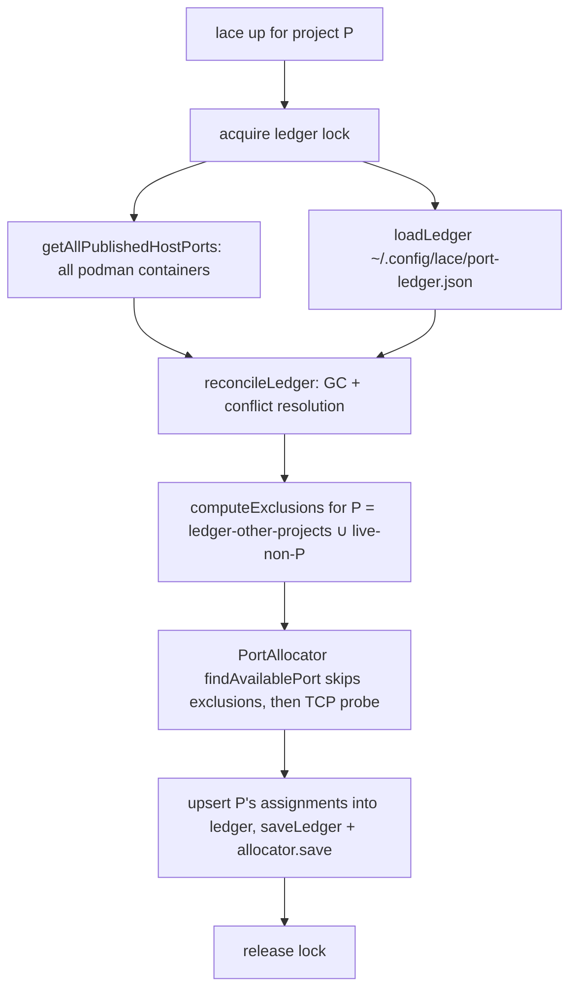

---
first_authored:
  by: "@claude-opus-4-8"
  at: 2026-09-06T11:15:00-07:00
task_list: lace/port-allocation
type: proposal
state: live
status: implementation_ready
last_reviewed:
  status: accepted
  by: "@claude-opus-4-8"
  at: 2026-09-06T11:24:07-07:00
  round: 2
tags: [port-allocation, devcontainer, dev-infra, architecture]
---

# Cross-project host-port allocation: a locked global ledger with live-podman reconciliation

> BLUF: This proposal serves [RFP: cross-project host-port allocation collisions](2026-08-24-rfp-cross-project-port-allocation-collision.md).
> `PortAllocator` allocates host ports with no cross-project awareness: it excludes only the current project's own container ports and otherwise trusts a live TCP probe, which cannot see a stopped sibling's reserved port or the window between a sibling's `lace up` resolving a port and its container actually binding it.
> The recommended fix is a **hybrid authority**: a lock-guarded global ledger at `~/.config/lace/port-ledger.json` that records every lace reservation independent of container run-state, reconciled on each `lace up` against a **machine-wide** enumeration of podman-published host ports.
> A port is excluded from allocation if EITHER the ledger reserves it for another project OR any non-current podman container publishes it, so neither source alone has to be complete.
> Allocation stays decentralized: N per-project `PortAllocator` instances, not a broker daemon, coordinated by a cross-process lockfile over the ledger's read-reconcile-allocate-write critical section.
> The design is fully unit-testable without live containers: podman is a stubbed subprocess seam and the ledger lives in a temp directory, so the whole allocation path is hermetic. Multi-container container proof is deferred to a follow-up.

## Objective

Guarantee that two different lace projects never allocate the same host port, so `podman run` never fails on a publish conflict (observed: `whelm.localhost` and `jif.localhost` both allocated `22428`).
The guarantee must hold when a sibling project's container is stopped, when two `lace up` invocations run concurrently, and across the window where a sibling has reserved a port but not yet bound it.

Non-goal: same-project concurrency.
The in-process serialization queue in `PortAllocator` (`port-allocator.ts:111`) already guarantees distinct ports among labels within one allocator instance, and this proposal does not re-solve it.
Cross-process serialization over the shared ledger is a distinct, new mechanism (see Design Decisions).

## Background

Current allocation is per-project and run-state-blind.

- The allocator is seeded per project: `up.ts:726-727` builds `ownedPorts = getContainerHostPorts(workspaceFolder, subprocess)` then `new PortAllocator(workspaceFolder, ownedPorts)`.
- `getContainerHostPorts` (`up.ts:93-101`) filters `podman ps` by `label=devcontainer.local_folder=${workspaceFolder}`, so it only ever returns the CURRENT project's running container's host ports.
- `ownedPorts` is used narrowly: `_allocate` (`port-allocator.ts:170`) consults it only to let the current project reuse its own already-bound port. It is never an exclusion source for new labels.
- `findAvailablePort` (`port-allocator.ts:202-214`) scans the range excluding only this project's own assignments (`this.assignments`), then trusts a live TCP probe `isPortAvailable()`. It deliberately does not consult `ownedPorts` and has no knowledge of any other project.
- Persistence is per-project: `PortAllocator` writes `.lace/port-assignments.json` inside the project (`port-allocator.ts:113-121`, save at `138-150`). There is no shared ledger; `~/.config/lace/` holds only `settings.json` (`up.ts:848`).

The single cross-project guard is therefore the TCP probe, and it is insufficient by construction:
a stopped sibling container is not listening, so its reserved port probes as free, and even a running sibling can be raced across container start/stop.
This is the collision root cause.

The subprocess wrapper (`subprocess.ts`, `RunSubprocess`) is already the mockable seam every podman call flows through, and `getPodmanCommand()` (`container-runtime.ts`) resolves the runtime binary.
Existing tests (`port-allocator.test.ts`, `get-container-host-ports.test.ts`) run against temp-directory workspaces and stubbed subprocesses, so the new mechanism can follow the same hermetic pattern.

## Proposed Solution

Introduce a global, run-state-independent reservation ledger and reconcile it against a machine-wide podman view under a cross-process lock.
Keep the per-project allocator; give it a complete exclusion set.

### Components

1. **`podman-ports.ts` (new): machine-wide enumeration.**
   `getAllPublishedHostPorts(subprocess): PublishedPort[]` runs `podman ps -a --format json` (all containers, not label-filtered) and parses published host ports plus each container's `devcontainer.local_folder` label.
   Returns `{ port, containerId, localFolder | null }[]`.
   Unlike `getContainerHostPorts`, it is not scoped to one project and includes non-running containers.

   Each `podman ps -a --format json` element carries a `Ports` array whose elements are objects of the form `{ host_ip: string; host_port: number; container_port: number; protocol: string }`.
   The parser reads `host_port` (an integer, present and non-zero only when a container actually publishes a host port) from each `Ports` element, and the `devcontainer.local_folder` value from that element's `Labels`.
   A container with no published ports has an empty or absent `Ports` array and contributes nothing.

   > NOTE(claude-opus-4-8/lace/port-allocation): That `podman ps -a --format json` reports `Ports[].host_port` for a STOPPED (exited) container is verified on podman 5.8.2 and is version-dependent. On this version a stopped `-p 22488:2222` container still reports `host_port: 22488` with `State: "exited"`, so the enumeration arm sees stopped siblings. `podman port <stopped>` returns empty on the same version, which is why the current `getContainerHostPorts` (`up.ts:106`) cannot.

   For robustness against podman versions or runtimes that omit stopped-container host ports from `ps -a`, `getAllPublishedHostPorts` falls back per suspect container to `podman inspect <id> --format '{{json .HostConfig.PortBindings}}'`, a config-sourced view that returns `{"2222/tcp":[{"HostIp":"0.0.0.0","HostPort":"22488"}]}` and persists across stop (verified on 5.8.2). The fallback keeps the stopped-sibling case covered where the fast `ps -a` path does not.

2. **`port-ledger.ts` (new): the authoritative reservation record.**
   File at `~/.config/lace/port-ledger.json`, shape:
   ```ts
   interface LedgerEntry { port: number; project: string; label: string; assignedAt: string; lastSeen: string; }
   interface PortLedger { entries: LedgerEntry[]; }
   ```
   `project` is the workspace folder (matching `devcontainer.local_folder`), so ledger entries and podman containers are joinable.
   The module exposes:
   - `loadLedger(path)` / `saveLedger(path, ledger)` with atomic write (temp file + rename), tolerating a missing or corrupt file by starting empty.
   - `withLedgerLock(path, fn)`: a cross-process critical section (see Design Decisions).
   - `reconcileLedger(ledger, live, projectExists, now): PortLedger`: a **pure** function performing conflict resolution and GC.
   - `computeExclusions(ledger, live, currentProject): Set<number>`: a **pure** function returning every port the current project must avoid.

3. **`PortAllocator` change: injected exclusions.**
   The constructor gains an exclusions set (via an options argument to stay backward-compatible), and `findAvailablePort` skips `this.assignments ∪ exclusions` before the TCP probe.
   Exclusions must ALSO gate the reuse short-circuit in `_allocate` (`port-allocator.ts:170`), not just `findAvailablePort`.
   That branch reuses a project's stored `.lace` port when `ownedPorts.has(existing.port)` OR `isPortAvailable(existing.port)` passes, and it runs BEFORE `findAvailablePort`.
   Its guard becomes: reuse `existing` only if `!exclusions.has(existing.port)` AND (`ownedPorts.has(existing.port)` OR `isPortAvailable(existing.port)`); otherwise fall through to `findAvailablePort` to pick a fresh port.
   Without this, a project whose stored port has been reassigned to another owner (migration, a manual `podman run -p`, or a corrupt ledger) hands its now-excluded port straight back: `ownedPorts` is empty because its own container is down, and the TCP probe passes precisely because the new owner is stopped or reserved-but-unbound, reintroducing the exact collision the design exists to close.
   The probe remains as a final reality check, no longer the sole cross-project guard.

4. **Coordinator in `up.ts`: replace the seam at `726-727`.**
   The new flow, all inside `withLedgerLock`:
   1. `live = getAllPublishedHostPorts(subprocess)`.
   2. `ledger = reconcileLedger(loadLedger(...), live, existsSync, now)` (GC + conflict resolution).
   3. `exclusions = computeExclusions(ledger, live, workspaceFolder)`.
   4. `allocator = new PortAllocator(workspaceFolder, { ownedPorts, exclusions })`; run `resolveTemplates`.
   5. Merge the resulting assignments back into `ledger` (upsert by `project`+`label`, refresh `lastSeen`), `saveLedger`, and keep `allocator.save()` for the per-project record.
   The lock is released after the write.

### Data-flow



The per-project `.lace/port-assignments.json` is retained as the project's own stable record (its labels reuse their prior ports), while the global ledger is the cross-project source of truth for exclusion.

## Important Design Decisions

### Hybrid authority: exclude on the UNION, resolve ownership by live podman

A port is excluded from allocation if EITHER the ledger reserves it for another project OR any non-current podman container publishes it.
This union is deliberately conservative: the cost of a false exclusion is one skipped port in a 75-port range, while the cost of a false inclusion is a `podman run` failure, the exact bug we are eliminating.

Neither source is complete on its own, which is why we need both:
- The ledger alone misses ports held by containers started outside lace (a manual `podman run -p`), and is incomplete during migration before every project has run under the new code.
- Live enumeration alone misses the resolve-before-run window: a sibling reserved a port this second but has not created its container, so no run-state (running or stopped) yet exists for the enumeration to see.
  Live enumeration DOES cover stopped-and-defined siblings, because `podman ps -a` reports `Ports[].host_port` for exited containers (verified on podman 5.8.2, with a `podman inspect .HostConfig.PortBindings` fallback for versions that omit it, per Component 1).
  The one gap live enumeration cannot close is the reserved-but-no-container-yet window, which is exactly what the ledger records.

For **ownership** (which project a reservation belongs to) rather than mere occupancy, **live podman wins over the ledger**.
If podman shows project Q's container publishing `22428` but the ledger records project P as owner, the ledger is stale: reconciliation rewrites the entry to Q.
A reservation with no live container of any run-state (the resolve-before-run window, or a stopped-and-still-defined sibling) keeps its ledger ownership, because that is precisely the state the TCP probe cannot observe.

> NOTE(claude-opus-4-8/lace/port-allocation): "Live podman wins for ownership, union wins for exclusion" is the crux resolving the RFP's stale-ledger-vs-live-bind question. Occupancy and ownership are separate questions and get separate authorities.

### Garbage collection: reclaim on removal, not on stop

A ledger entry is reclaimed during `reconcileLedger` when any of:
- its port is now published by a DIFFERENT project's live container (superseded), or
- its owning project's workspace folder no longer exists on disk (`projectExists(project) === false`) AND it has no live podman container of any run-state referencing it AND `lastSeen` is older than the staleness threshold, or
- it has no live podman container of any run-state referencing it AND `lastSeen` is older than a staleness threshold (a conservative default such as 30 days).

> NOTE(claude-opus-4-8/lace/port-allocation): Workspace-gone is deliberately NOT a standalone reclaim trigger. `existsSync(project)` can transiently false-negative when the workspace lives on an unmounted volume or a path not visible to the `lace up` process, and reclaiming on that alone would free a still-live reservation and cause a collision when the path remounts. It only contributes to reclaim when combined with no live container AND age, so a stronger signal than a single failed stat is always required.

A merely stopped container is NOT reclaimed: a stopped container retains its `-p` binding, so its port must stay reserved for a stable restart.
The reconcile pass distinguishes "stopped but still defined" (keep, and refresh `lastSeen` if the container is present in `podman ps -a`) from "removed or workspace gone" (reclaim).
GC runs opportunistically at the head of every `lace up`; there is no daemon and no background timer, which keeps the whole path hermetically testable.

### Decentralized allocators plus a shared lock, not a broker

Allocation stays as N short-lived per-project `PortAllocator` instances.
A single lace-level broker process would add a daemon to supervise, a socket protocol, and lifecycle and failure modes, all for an event that is infrequent and short-lived.
The cross-project guarantee needs shared state, not a shared process, so the design centralizes the ledger and serializes access to it with a cross-process lockfile (`~/.config/lace/port-ledger.lock`), acquired via `O_EXCL`/atomic-mkdir with stale-lock detection.
Owner-pid liveness is the PRIMARY stale signal: the lock is broken only when the recorded owner pid is dead.
Lock mtime is strictly SUBORDINATE, a secondary heuristic for pid-reuse or cross-host cases, never a standalone timeout that can break a lock held by a live owner.
This ordering matters because the critical section is long: the lock is held across `resolveTemplates`, which drives many `isPortAvailable` TCP probes at ~100ms each, so a live holder legitimately holds the lock for a noticeable interval.
A fixed mtime timeout that preempted a live-but-slow holder would let a waiter steal the lock mid-resolution and both processes would allocate against divergent ledger states.
If cross-host or pid-reuse robustness is later needed, the holder can heartbeat the lock mtime during resolution rather than lowering a timeout.

This is orthogonal to the existing in-process queue (`port-allocator.ts:111`), which serializes concurrent `allocate()` calls within one process (for example sibling appPort templates resolved through `Promise.all`).
The queue does nothing across processes, and the ledger lock does nothing within one.
Two concurrent `lace up` invocations are a cross-process race the queue never addressed, and the ledger lock closes it.

## Edge Cases / Challenging Scenarios

- **Stopped sibling (the observed bug).** The sibling is absent from a live TCP probe but present in `podman ps -a` and in the ledger, so it is excluded by both arms of the union. The regression test reproduces whelm/jif: sibling container stopped, sibling reservation for `22428` in the ledger, current project must not receive `22428` even though `isPortAvailable(22428)` returns true.
- **Container start/stop race.** Exclusion no longer depends on run-state, so the window that made the TCP probe unreliable is closed. The probe becomes defense-in-depth rather than the guard.
- **Stale ledger entry.** Handled by GC (workspace-gone / superseded / aged-out) and by live-podman-wins ownership rewrite. A stale entry never causes a wrong allocation, only at worst a needlessly skipped port until GC reclaims it.
- **Manual `podman run -p` outside lace.** Caught by machine-wide enumeration and excluded while that container exists. Lace does not write non-lace ports into the ledger: doing so would create reservations lace cannot later GC (it does not own the container). When the manual container is removed, its port frees naturally.
- **Port exhaustion.** The exclusion set is now larger, so the 75-port range (`LACE_PORT_MIN`..`LACE_PORT_MAX`) can exhaust sooner. The exhaustion error must enumerate cross-project holders from the ledger, not just `this.assignments`, so the message is actionable. GC bounds long-term growth. If the range proves tight in practice, widening it is a follow-up, not part of this fix.
- **Concurrent `lace up`.** Serialized by the ledger lock; the second waits, reads the first's committed reservation, and allocates around it.
- **Corrupt or missing ledger.** Treated as empty, with a warning. A lost ledger degrades to the podman-enumeration arm alone. Because `podman ps -a` reports host ports for stopped-and-defined siblings (verified on podman 5.8.2, `inspect` fallback otherwise), that arm still covers the headline whelm/jif stopped-sibling case: enumeration sees the stopped container's `22428` and excludes it. What a lost ledger loses is the reserved-but-no-container-yet window (a sibling that has resolved a port but not created its container) and any port lace reserved but has not yet handed to `podman run`. This degradation depends on the enumeration reporting stopped host ports: on a podman version where neither `ps -a` nor `inspect` reports them, a lost ledger would degrade all the way back to the original stopped-sibling bug, which is why the ledger is retained as defense-in-depth rather than treated as redundant with enumeration.
- **Stale lock.** The lock is broken and re-acquired only when the recorded owner pid is dead, so a crashed `lace up` cannot wedge the machine. A live-but-slow holder (normal, since the lock spans `resolveTemplates` and its TCP probes) is never preempted; mtime is only a subordinate heuristic for pid-reuse or cross-host cases and never breaks a lock held by a live pid on its own.
- **Migration gap.** Until every project has run once under the new code, the ledger is incomplete. During that window the live-podman arm still covers running and stopped-defined siblings; only a not-yet-migrated sibling's resolve-before-run window is unguarded. Documented as a bounded, self-healing transient.

## Test Plan

All tests are hermetic: podman is a stubbed `RunSubprocess`, the ledger and workspaces live under `tmpdir()`, and the only real I/O is the existing `isPortAvailable` TCP seam (already exercised with real sockets in `port-allocator.test.ts`).

- **`reconcileLedger` (pure).** GC reclaims a workspace-gone entry; keeps a stopped-but-defined entry; rewrites ownership when a different live project publishes the port; ages out an entry past the staleness threshold; leaves a fresh reserved-but-unbound entry intact.
- **`computeExclusions` (pure).** Returns the union of ledger entries owned by other projects and live ports published by non-current containers; excludes nothing the current project itself owns.
- **`getAllPublishedHostPorts`.** Stubbed subprocess returns canned `podman ps -a --format json` (running, stopped, and non-lace containers); asserts correct host ports and `localFolder` attribution; tolerates an empty list and a non-zero exit.
- **`PortAllocator` with exclusions.** The key regression: an excluded port that the TCP probe reports free (a stopped sibling's reservation) is never returned; a genuinely free, unexcluded port is.
- **Reuse-branch gating (finding #1 regression).** A project whose stored `.lace` assignment names a port now in its exclusion set (ownership flipped to another project) must NOT reuse that port on re-`up`, even though `ownedPorts` is empty and `isPortAvailable` reports it free; it must fall through to `findAvailablePort` and receive a fresh, unexcluded port.
- **Cross-process lock.** Two coordinators run concurrently against one temp ledger path (real lockfile, no containers); assert they receive distinct ports and both writes survive. Stale-lock: a lockfile owned by a dead pid is broken and acquired.
- **Lock liveness (no-preempt-live-holder).** A lock held by a live pid whose holder is slow (spends longer than the mtime heuristic inside the critical section) is NOT preempted by a waiter; the waiter blocks until real release. Only a dead-pid lock is broken.
- **End-to-end coordinator (whelm/jif regression).** Two temp projects, sibling container stopped, sibling reservation `22428` in the ledger; assert the second project does not get `22428`.
- **Failure modes.** Corrupt ledger degrades to enumeration-only with a warning; exhaustion error lists ledger holders.

### Verification Methodology

Run the package test suite (`vitest`) after each phase; every phase lands with its own passing hermetic tests and no regression in `port-allocator.test.ts` or `get-container-host-ports.test.ts`.
Live multi-container proof (two real projects racing `lace up`) is intentionally out of the hermetic loop because container rebuilds are constrained in this environment; it is captured as a deferred follow-up below and should not block merge.

## Implementation Phases

Phases 1-4 are independent and land behind no behavior change; phase 5 wires them in.
This shape fits subagent-driven execution (5+ largely independent phases, each with clear criteria); the coordinator phase depends on all prior phases and should land last.

Constraints / what NOT to change:
- Do not alter the in-process `queue` mutex (`port-allocator.ts:111`) or its semantics.
- Keep `.lace/port-assignments.json` and its format for backward compatibility; the ledger is additive.
- Keep every podman call behind `RunSubprocess` and `getPodmanCommand()`; no direct shelling.

**Phase 1: machine-wide podman enumeration.**
Add `podman-ports.ts` with `getAllPublishedHostPorts(subprocess)`.
Success: parses running, stopped, and non-lace containers from stubbed `podman ps -a --format json`; correct ports and `localFolder`; graceful on empty and error. No wiring.

**Phase 2: ledger module (pure core).**
Add `port-ledger.ts` types, `loadLedger`/`saveLedger` (atomic, corrupt-tolerant), and pure `reconcileLedger` + `computeExclusions`.
Success: all reconcile and exclusion unit cases pass; save is atomic (temp+rename); corrupt file loads as empty. No wiring.

**Phase 3: cross-process lock.**
Add `withLedgerLock(path, fn)` with `O_EXCL`/atomic-mkdir acquisition, pid-liveness-primary stale detection (mtime subordinate), and guaranteed release on throw.
Success: concurrent coordinators serialize, a dead-pid lock is broken, a live-but-slow holder is never preempted, and the lock always releases.

**Phase 4: allocator exclusions.**
Extend `PortAllocator` with an injected exclusions set consumed by BOTH `findAvailablePort` AND the reuse short-circuit in `_allocate` (`port-allocator.ts:170`); default empty (backward-compatible). Update the exhaustion error to include ledger holders when present.
Success: an excluded-but-TCP-free port is never returned by `findAvailablePort`, AND a stored `.lace` port that is now excluded is not reused by the `_allocate` short-circuit (it falls through to a fresh port); existing allocator tests still pass.

**Phase 5: coordinator wiring.**
Replace the seam at `up.ts:726-727` with the locked enumerate → reconcile → computeExclusions → allocate → persist-ledger+per-project flow.
Success: whelm/jif regression passes; single-project behavior unchanged; ledger written under `~/.config/lace/` (temp-homed in tests).

**Phase 6 (deferred-to-followup): live container proof.**
Two real projects race `lace up`; assert distinct published ports and successful `podman run` on both.
Filed as a separate verification task because rebuilds are constrained here; not a merge blocker.
