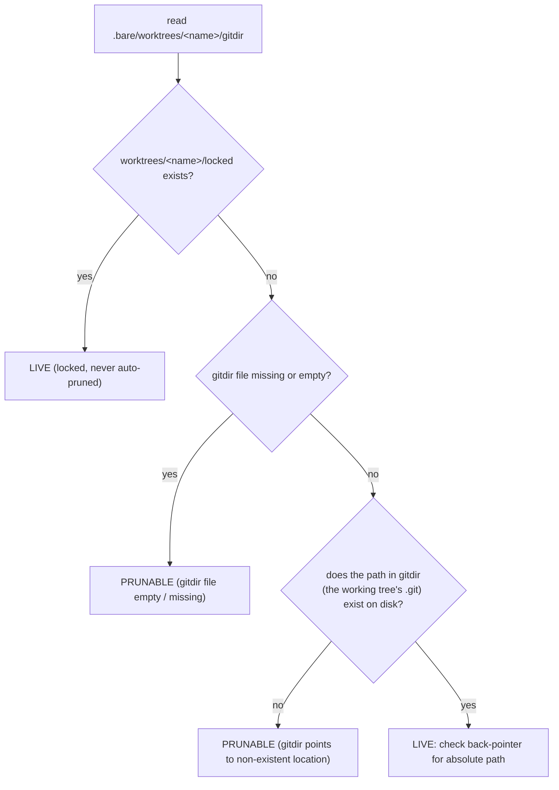

---
first_authored:
  by: "@claude-opus-4-8"
  at: 2026-09-06T14:20:00-07:00
task_list: lace/workspace-validation
type: proposal
state: live
status: implementation_accepted
last_reviewed:
  status: accepted
  by: "@claude-opus-4-8"
  at: 2026-09-06T11:24:52-07:00
  round: 2
tags: [workspace-detection, worktree, error-handling, dev-infra, architecture]
---

# Classify stale/prunable worktrees separately from broken-live worktrees in `lace up`

> BLUF: This proposal serves the RFP [`2026-08-25-rfp-stale-worktree-up-abort.md`](2026-08-25-rfp-stale-worktree-up-abort.md).
> It splits the undifferentiated `absolute-gitdir` hard error into two classes by inspecting git's own worktree admin metadata (`.bare/worktrees/<name>/gitdir`) with git's exact prune criteria: a `prunable-worktree` entry (working tree gone, safely removable by `git worktree prune`) becomes a non-fatal warning that prints the one-line remedy, while a genuinely broken LIVE worktree (working tree present, absolute back-pointer) keeps aborting `lace up`.
> The recommended remediation is warn-not-error with a printed remedy, NOT auto-running `git worktree prune`, because a co-tenant agent's live container-side worktree looks prunable from the host and auto-prune would destroy shared, live admin state.
> Scope is smaller than greenfield: the `prunable-worktree` code already exists in the `ClassificationWarning.code` union at `workspace-detector.ts:45` as a dead stub that is never emitted, so the core work is wiring an existing, planned distinction rather than inventing one.
> The source of the failure state is closed by baking `worktree.useRelativePaths=true` into container-side git so ordinary in-container `git worktree add` stops writing the absolute `/workspace/...` gitdirs that this very validation rejects.
> All detection is filesystem-only and unit-testable with hermetic fixtures (fake `.git/worktrees/*/gitdir` files); no live container is required for the core work.

## Objective

Stop `lace up` from converting routine post-merge worktree residue into a hard stop that only `--skip-validation` escapes.

The `absolute-gitdir` validation was promoted to a hard error to catch a live worktree whose gitdir cannot resolve inside the container.
That promotion treats "absolute gitdir" as a single class.
It does not distinguish a stale/prunable admin entry, which `git worktree prune` removes with zero risk, from a live worktree with a genuinely broken gitdir.
The result: a dead entry left behind by a normal merge blocks every `lace up` in that repo, with no remedy string and no auto-remediation, until the user discovers the global `--skip-validation` escape hatch that also downgrades every other check.

## Background

### The two back-pointers, and which one git prunes on

A nikitabobko bare-worktree layout has two distinct pointers per worktree, and the distinction is the crux of this proposal:

- The working tree's `.git` FILE (e.g. `<root>/<name>/.git`) holds a BACK pointer: `gitdir: <path to .bare/worktrees/<name>>`.
  This is what `resolveGitdirPointer` reads and what the current classifier flags as `absolute-gitdir` when the path is absolute.
- The admin dir's `gitdir` FILE (`<root>/.bare/worktrees/<name>/gitdir`) holds a FORWARD pointer to the working tree's `.git` file (e.g. `/workspace/jif/home-dashboard/.git`).
  This is git's source of truth for `git worktree list` and `git worktree prune`.

Git's own prunability test (`should_prune_worktree` in git's `builtin/worktree.c`) reads the FORWARD pointer, not the back-pointer:



### The current code only inspects back-pointers of host-visible working trees

`classifyWorkspace` (`workspace-detector.ts:83-216`) classifies a single workspace directory and emits `absolute-gitdir` (`:166-178`) when the CURRENT worktree's back-pointer is absolute.
For siblings it calls `checkAbsolutePaths` (`:276-316`), which scans immediate DIRECTORY children of the bare-repo root and reads each child's working-tree `.git` back-pointer.

This sibling scan never sees a prunable entry.
A prunable entry's defining property is that its working tree directory is GONE, so there is no host child directory to scan and no back-pointer file to read.
The admin dir `.bare/worktrees/<name>/` survives with a dangling forward pointer, but nothing in the current classifier ever reads `.bare/worktrees/*`.
So the classifier as written inspects the wrong artifact for this failure mode: it reads host working-tree back-pointers, while prunability lives in the admin forward-pointers.
This is a latent gap the RFP surfaces, not merely a policy choice.

### The dead stub

`ClassificationWarning.code` at `workspace-detector.ts:41-49` already includes `"prunable-worktree"` in its union, present since the module's first commit (Feb 2026):

```ts
code:
  | "absolute-gitdir"
  | "standard-bare"
  | "prunable-worktree"   // :45 declared, NEVER emitted anywhere
  | "unsupported-extension";
```

No code path in `classifyWorkspaceUncached` or `checkAbsolutePaths` ever pushes a `prunable-worktree` warning.
A prunable distinction was planned and left as a stub.
This proposal wires it up rather than inventing a new code.

### The hard-error path

`applyWorkspaceLayout` (`workspace-layout.ts:82-209`) mutates the config first (`:137-179`), then runs the soft check at `:185-199`:

```ts
const absoluteGitdirWarnings = result.warnings.filter(
  (w) => w.code === "absolute-gitdir",
);
if (absoluteGitdirWarnings.length > 0) {
  return { status: "error", /* ... */ };
}
```

All `absolute-gitdir` warnings are one undifferentiated class, and any one of them forces `status: "error"`.

`up.ts:344-357` consumes that status.
An `error` status aborts the run (`:349-353`) unless `skipValidation` is set, in which case it is downgraded to a warning and the run continues (`:354-356`).
`--skip-validation` is the global flag defined at `commands/up.ts:49` and is the ONLY escape.

### The source: container-side `git worktree add` writes absolute gitdirs

Healthy host-created worktrees carry relative pointers (`../../../main/.git`) because `worktree.useRelativePaths=true` is set host-side.
A worktree created INSIDE the container writes absolute `/workspace/<project>/...` pointers, because container-side git does not have `worktree.useRelativePaths` set and git does not apply it by default.
From the host, `/workspace/<project>/...` does not exist, so those entries dangle.
Ordinary in-container use therefore produces this validation's own failure state.
Closing the source is direction 3 below and is not optional polish: without it, host and container disagree about which worktrees are prunable (see Design Decisions), which is what makes auto-prune unsafe.

## Proposed Solution

Three coordinated changes: a new admin-metadata scanner in `workspace-detector.ts`, a partitioned error policy in `workspace-layout.ts`, and a config bake-in that fixes the source.

### 1. Admin-metadata scan (`workspace-detector.ts`)

Add a function that scans the authoritative admin directory and classifies each entry with git's prune criteria:

```ts
export interface WorktreeAdminEntry {
  name: string;
  /** Absolute path recorded in worktrees/<name>/gitdir (the working tree's .git). */
  forwardPointer: string | null;
  /** True if the working tree's .git referenced by the forward pointer is absent. */
  prunable: boolean;
  /** Reason string mirroring `git worktree prune -n` output. */
  prunableReason?: "gitdir-missing" | "gitdir-empty" | "nonexistent-location";
  /** True if worktrees/<name>/locked exists (never auto-prunable). */
  locked: boolean;
}

/** Scan <bareGitDir>/worktrees/* and classify each entry hermetically. */
export function scanWorktreeAdmin(bareGitDir: string): WorktreeAdminEntry[];
```

Detection rules per `.bare/worktrees/<name>/`, matching git's `should_prune_worktree`.
Git evaluates `locked` BEFORE stat-ing the gitdir, so a locked entry is never prunable even when its `gitdir` is missing or empty; this ordering is reproduced exactly:

1. If `locked` exists, `prunable=false` (`locked=true`). Git never auto-prunes a locked entry, regardless of gitdir state.
2. Else read `gitdir`. If missing or empty, `prunable` with reason `gitdir-missing` / `gitdir-empty`.
3. Else stat the path recorded in `gitdir` (the working tree's `.git`). If it does not exist, `prunable` with reason `nonexistent-location` (git's exact wording).
4. Else the entry is LIVE. Read that working tree's `.git` back-pointer; an absolute back-pointer is the `absolute-gitdir` (broken-live) concern.

> NOTE(claude-opus-4-8/workspace-validation): This scanner models `git worktree prune`'s default semantics (`expire = TIME_MAX`, no `--expire` flag), under which every `nonexistent-location` entry is prunable.
> It does NOT reproduce `git worktree list`'s `prunable` annotation, which additionally suppresses entries whose `worktrees/<name>/index` mtime is newer than the expire threshold.
> The omitted index-mtime branch is therefore intentional: it mirrors the `prune` subcommand's default, which is the artifact this validation reports against, not `list`'s annotation.

Emission changes in `classifyWorkspaceUncached`:

- Locate the bare git dir with the existing `findBareGitDir` (`:323-337`).
- Call `scanWorktreeAdmin` and translate entries into warnings:
  - `prunable === true` produces a `prunable-worktree` warning (the wired-up stub) whose `remediation` is the exact prune command (see below).
  - `prunable === false` and the live back-pointer is absolute produces an `absolute-gitdir` warning (unchanged severity intent).
- Retire the host-working-tree-children sibling scan in `checkAbsolutePaths` (`:276-316`) in favor of the admin scan, which is git's source of truth and sees entries whose working tree is gone.
  This trades away one coverage case: see "Broken-live sibling downgrade" under Important Design Decisions.
  Keep the current-worktree absolute back-pointer check at `:166-178` (it covers the worktree being brought up, which by definition has a present working tree).
- Exclude the current worktree from `scanWorktreeAdmin`'s emission (mirroring the retired `checkAbsolutePaths` `excludeWorktree` parameter), or dedup emitted warnings by worktree name.
  Without this, a current worktree with a present, host-resolving forward pointer and an absolute back-pointer would fire both the `:166-178` check and the admin scan, emitting two `absolute-gitdir` warnings for the same worktree.

> NOTE(claude-opus-4-8/workspace-validation): `scanWorktreeAdmin` is deliberately filesystem-only and git-binary-free, consistent with the module's stated design (`:78-82`).
> An OPTIONAL cross-check against `git worktree prune -n --verbose` through the existing `RunSubprocess` seam is deferred to a followup; the filesystem logic already reproduces git's criteria and stays hermetic.

### 2. Partitioned error policy (`workspace-layout.ts:185-199`)

Replace the single filter with a partition:

```ts
const broken = result.warnings.filter((w) => w.code === "absolute-gitdir");
const prunable = result.warnings.filter((w) => w.code === "prunable-worktree");

// Prunable-only: benign. Emit warning + remedy, do NOT abort, do NOT mutate.
// (prunable warnings already flow into `warnings` at :99-103.)

// Broken LIVE worktree(s): keep the hard error.
if (broken.length > 0) {
  return { status: "error", /* absolute-gitdir message, unchanged */ };
}
```

Consequences:

- Prunable-only offenders yield `status: "applied"`; the run proceeds and the prune remedy is printed as a warning.
- A genuinely broken live worktree still returns `status: "error"` and aborts unless `--skip-validation`.
- Config mutation already happens before this check (`:137-179`), so no path regresses.

`up.ts:344-357` needs no structural change: `applied` proceeds, `error` aborts as today.
The behavioral win is that the common benign case is now `applied`, so `--skip-validation` is no longer the only way past it.

### 3. Close the source: container-side `worktree.useRelativePaths` (fixes new failures)

Make container-side git write relative pointers so in-container `git worktree add` stops producing absolute gitdirs.

Recommended vehicle: inject, via its own unconditional `mergePostCreateCommand` call (`:218-252`), the command:

```
git config --global worktree.useRelativePaths true
```

Give it a dedicated, unconditional injection rather than piggybacking on the `safe.directory` block at `:167-172`.
That block is guarded by `wsConfig.postCreate?.safeDirectory !== false`, and the relative-paths fix is unrelated to `safeDirectory`: a user who disables `safeDirectory` must not also lose this fix.
The injection is idempotent (`mergePostCreateCommand`) and applies to every lace-managed container.

`worktree.useRelativePaths` is a git 2.48+ key; the module already tracks it as `relativeworktrees: 2.48.0` in `GIT_EXTENSION_MIN_VERSIONS` (`:350-354`).
On container git < 2.48 the setting is an inert no-op (an unknown config key), not a hard requirement: it is harmless on older git and effective on 2.48+.
The bake-in is not itself version-gated, and `verifyContainerGitVersion` (`:502-581`) only fires when the repo already carries the `relativeworktrees` extension, so a fresh repo never triggers it.
On old container git the setting silently does nothing and absolute paths persist until git is upgraded; the fix is version-safe to apply but only takes effect on 2.48+.
For repositories that already carry absolute entries, the existing `git worktree repair --relative-paths` remediation string (`:172-174`, `:302-305`) remains the manual fix.

> NOTE(claude-opus-4-8/workspace-validation): Baking into the lace-fundamentals feature or dotfiles global gitconfig is an equivalent alternative and may be preferred if the team wants the setting present even for non-`postCreate` flows.
> The `postCreate` route is recommended because it is in-repo, already exercised, and unit-testable here; a fundamentals-feature bake-in is a reasonable followup if broader coverage is wanted.
> Container proof of the relative-paths write is deferred to a followup (see Implementation Phases).

## Important Design Decisions

### Remediation: warn-and-print-remedy, NOT auto-prune

The RFP weighs auto-running `git worktree prune` during `lace up` against downgrading the prunable class to a warning with a printed remedy.
This proposal recommends warn-not-error and explicitly rejects auto-prune.

The decisive reason is co-tenant safety, and it is stronger than the RFP's framing.
A worktree created container-side and currently checked out by a live co-tenant agent has a forward pointer of `/workspace/<project>/<name>/.git`.
That path does not exist on the host, so from the host the entry satisfies git's `nonexistent-location` prune criterion: it LOOKS prunable while being a LIVE worktree.
Auto-running `git worktree prune` from the host during `lace up` would delete that live co-tenant's admin entry, corrupting shared state mid-session.
`lace up` must never mutate shared worktree admin state as a side effect, so auto-prune is unsafe by construction, not merely by preference.

Warn-not-error is safe under exactly this ambiguity.
A false-positive "prunable" on a live container-side worktree produces only a benign, non-fatal warning: no abort, no mutation.
The user, who knows whether a co-tenant container is live, runs `git worktree prune` themselves at a safe moment.

The printed remedy is worded to respect the host/container disagreement:

> Stale worktree admin entries detected: `<names>`.
> These have no working tree on the host and are removable with `git worktree prune`.
> Run it only when no co-tenant container is live, because a worktree created inside a running container can appear stale from the host while still being in use.

### Why host and container disagree, and why direction 3 is load-bearing

The root ambiguity is the path-prefix mismatch: the same worktree is `/var/home/.../<name>` on the host and `/workspace/<project>/<name>` in the container.
An absolute forward pointer resolves in exactly one of those contexts.
`worktree.useRelativePaths=true` writes forward and back pointers as relative paths (`../../<name>/.git`), which resolve identically from both host and container.
With relative pointers, host and container agree on prunability, the "looks prunable but is live" false positive disappears, and new absolute entries stop being produced.
Direction 3 is therefore the true fix; directions 1 and 2 make the CLI safe and legible while the stock of legacy absolute entries drains.

### Admin scan over working-tree-children scan

Reading `.bare/worktrees/*` rather than host directory children aligns detection with git's own source of truth and is the only way to see an entry whose working tree is gone (the RFP's core gap).
It also picks up worktrees checked out at unusual host locations that were invisible to the directory-children scan.

This realignment is not a pure superset of the retired scan: it trades away one broken-live case, documented next.

### Broken-live sibling downgrade (accepted coverage trade-off)

Retiring `checkAbsolutePaths` downgrades one specific case from a hard error to a benign warning, and this proposal accepts that downgrade deliberately.

The case is a SIBLING worktree created container-side whose working tree is still present on the host.
Recall that `/workspace/<project>/<name>` and `<bareRepoRoot>/<name>` are the same bind-mounted directory:

- Its back-pointer at `<root>/<sibling>/.git` is `gitdir: /workspace/<project>/.bare/worktrees/<sibling>` (absolute container path).
- Its forward pointer at `.bare/worktrees/<sibling>/gitdir` is `/workspace/<project>/<sibling>/.git` (absolute container path).

The retired `checkAbsolutePaths` iterated host directory children, found `<root>/<sibling>/.git` present, read its absolute back-pointer, and hard-errored (`absolute-gitdir`).
`scanWorktreeAdmin` stats the forward pointer `/workspace/<project>/<sibling>/.git`, which does not resolve on the host, so it classifies `nonexistent-location` -> prunable -> a benign `prunable-worktree` warning.
The same worktree moves from hard-abort to non-fatal warning.

The downgrade is accepted because the two cases are genuinely indistinguishable from the host: a broken-live container-created sibling and a live co-tenant checkout both present a `nonexistent-location` forward pointer.
Hard-erroring the broken-live sibling would necessarily hard-error the live co-tenant too, which directly contradicts the never-abort-on-shared-live-state stance that motivates warn-not-error in the first place.
Given that ambiguity, downgrading both to a warning is the only policy consistent with the rest of this design.

The alternative considered and rejected: when a forward pointer reads `nonexistent-location`, additionally stat `<bareRepoRoot>/<name>/.git`, and if that host path exists with an absolute back-pointer, treat it as broken-live and hard-error.
This restores today's coverage for the broken-live sibling but re-introduces hard-abort on any live co-tenant worktree whose working directory is visible on the host, defeating the RFP's central goal.
It is rejected for that reason.

Two facts bound the blast radius of the accepted downgrade:

- The CURRENT worktree being brought up is unaffected.
  Its working tree is present by definition and the `:166-178` back-pointer check is retained, so the primary broken-live case still hard-aborts.
  Only SIBLING worktrees are downgraded from error to warning.
- The residue is a printed warning, not silence.
  A user who reads `lace up` output still learns of the entry and its prune remedy.

The relative-paths bake-in (direction 3) drains the stock of absolute entries that produce this ambiguity, so the downgrade is transitional in practice for lace-managed containers.

## Edge Cases / Challenging Scenarios

- Mixed prunable + broken-live offenders.
  The partition treats them independently: prunable entries emit warnings, and the presence of any broken-live entry still returns `status: "error"`.
  A run with both aborts (on the live breakage) AND prints the prune remedy for the stale entries, so the user fixes both in one pass.
- A live worktree that only LOOKS prunable (container-side worktree, `/workspace/...` forward pointer absent on host).
  Classified `prunable` from the host, so it yields a benign warning only.
  Never aborts, never auto-pruned.
  A `locked` file, if present, suppresses even the prunable classification (git parity), taking precedence over the gitdir state.
  The relative-paths bake-in removes the false positive going forward.
- A genuinely broken-live SIBLING worktree (present host working tree, absolute container back-pointer).
  This is the accepted downgrade: its forward pointer is an absolute container path that does not resolve on the host, so it classifies `nonexistent-location` -> `prunable-worktree` warning, NOT the hard error the retired `checkAbsolutePaths` produced.
  It is host-indistinguishable from a live co-tenant checkout, so it cannot be hard-errored without also aborting live co-tenants.
  See "Broken-live sibling downgrade" under Important Design Decisions.
  The current worktree being upped is not subject to this downgrade (its `:166-178` check is retained).
- Shared container worktree admin state.
  `lace up` performs zero mutation of `.bare/worktrees/*`.
  The only state change is the user's explicit, later `git worktree prune`.
- `--skip-validation` interaction.
  Prunable is now a warning, so `--skip-validation` is unnecessary for the benign case (the RFP's central complaint).
  Warnings are still printed under `--skip-validation` (they always are).
  Genuine broken-live errors still require `--skip-validation` to bypass, unchanged.
- `gitdir` present but empty, or `worktrees/<name>/` with no `gitdir` at all.
  Both are prunable per git (`gitdir-empty` / `gitdir-missing`), handled by rule 2 (the gitdir check, after the `locked` gate).
- Malformed forward pointer (not a path, or unreadable).
  Treated as non-prunable and skipped (no warning), matching the module's existing defensive `try/catch` posture around sibling parsing (`:295-309`); such an entry is neither a confident prune target nor a confident live-breakage.

## Test Plan

All core tests are hermetic and extend the existing fixture helper `createBareRepoWorkspace` (`__tests__/helpers/scenario-utils.ts:416-461`), which already writes `.bare/worktrees/<name>/gitdir` forward pointers.
No git binary and no container are required.

Add a fixture option to write a stale entry: an admin dir `.bare/worktrees/<name>/` whose `gitdir` points to a non-existent working tree, with the working tree directory omitted.

`scanWorktreeAdmin` unit tests:

- Forward pointer to an existing working-tree `.git` yields `prunable=false`.
- Forward pointer to a non-existent location yields `prunable=true`, reason `nonexistent-location`.
- Missing `gitdir` file yields `prunable=true`, reason `gitdir-missing`.
- Empty `gitdir` file yields `prunable=true`, reason `gitdir-empty`.
- `locked` file present with a dangling forward pointer yields `prunable=false`, `locked=true`.
- Live entry with an absolute working-tree back-pointer yields `prunable=false` and feeds an `absolute-gitdir` warning.

`classifyWorkspace` integration tests:

- Repo with one live worktree + one stale admin entry emits exactly one `prunable-worktree` warning and no `absolute-gitdir` warning.
- Repo with a live absolute-back-pointer worktree still emits `absolute-gitdir`.
- Mixed repo emits both codes.
- Ambiguous sibling (accepted downgrade): a sibling admin entry whose forward pointer is `nonexistent-location` WHILE the sibling working-tree directory IS present on disk emits a `prunable-worktree` warning and NO `absolute-gitdir` warning.
  This locks in the accepted broken-live-sibling downgrade (warn-not-error) and guards against a future regression that would re-hard-error live co-tenants.
- Current-worktree exclusion: a current worktree with a present, host-resolving forward pointer and an absolute back-pointer emits exactly ONE `absolute-gitdir` warning, not two.
  This guards the `scanWorktreeAdmin` exclusion / dedup against the retained `:166-178` check emitting a duplicate.

`applyWorkspaceLayout` tests (`__tests__/workspace-layout.test.ts`):

- Prunable-only offenders return `status: "applied"` with the prune remedy present in `warnings` and config still mutated (`workspaceMount`/`workspaceFolder` set).
- Any broken-live offender returns `status: "error"` (regression guard on the promoted behavior).
- Mixed offenders return `status: "error"` AND include the prune remedy in `warnings`.

`up.ts` wiring test:

- With prunable-only offenders, the layout phase reports success and the run does not abort, WITHOUT `--skip-validation`.

Config injection test:

- The `worktree.useRelativePaths true` command is injected idempotently into `postCreateCommand` alongside `safe.directory`, reusing the existing `mergePostCreateCommand` tests as a pattern.
- The injection still occurs when `postCreate.safeDirectory` is `false`, confirming it is not gated behind the `safeDirectory` guard.

Remember `clearClassificationCache()` in `beforeEach` (the suite already does this) to avoid cross-test contamination.

## Implementation Phases

Phases are ordered; phase 2 depends on phase 1's warning codes, and phase 3 is independent and may proceed in parallel.
Do not change the `absolute-gitdir` message text or the promoted hard-error behavior for broken-live worktrees; that promotion is intentional and out of scope to weaken.

### Phase 1: Admin-metadata scanner

Add `scanWorktreeAdmin` and the `WorktreeAdminEntry` type to `workspace-detector.ts`.
Wire `classifyWorkspaceUncached` to emit `prunable-worktree` and `absolute-gitdir` warnings from the scan, retiring the host-children sibling scan and excluding the current worktree from the admin-scan emission.
This phase intentionally accepts the broken-live-sibling downgrade documented under Important Design Decisions; the ambiguous-sibling test below locks that behavior in.
Extend `createBareRepoWorkspace` with a stale-entry option.

Success criteria:

- `scanWorktreeAdmin` unit tests pass for all six cases above, with `locked` evaluated before the gitdir-missing/empty test.
- `prunable-worktree` is emitted for a stale entry; `absolute-gitdir` is emitted for a live absolute-back-pointer worktree.
- The ambiguous sibling (present working tree + absolute back-pointer / `nonexistent-location` forward pointer) yields `prunable-worktree`, not `absolute-gitdir`.
- The current worktree emits exactly one `absolute-gitdir` warning (no duplicate from the retained `:166-178` check).
- No existing `workspace-detector` test regresses.

### Phase 2: Partitioned error policy

Replace the single `absolute-gitdir` filter in `applyWorkspaceLayout` (`:185-199`) with the partition.
Add the prune remedy string.

Success criteria:

- Prunable-only returns `status: "applied"` with the remedy in `warnings`.
- Broken-live and mixed cases return `status: "error"`.
- The `up.ts` wiring test confirms a prunable-only repo runs to completion without `--skip-validation`.

### Phase 3: Close the source (config bake-in)

Inject `git config --global worktree.useRelativePaths true` via its own unconditional `mergePostCreateCommand` call, using the `safe.directory` injection only as a code pattern, NOT gated behind `safeDirectory`.

Success criteria:

- The command is injected idempotently and appears in `postCreateCommand` in unit tests.
- The injection still occurs when `postCreate.safeDirectory` is `false` (guard-independence test).
- No regression in existing `mergePostCreateCommand` tests.

### Phase 4 (deferred followup): Container proof and optional git cross-check

Verify in a live container that in-container `git worktree add` writes relative pointers after the bake-in, and that a repo with a stale entry brings up cleanly.
Optionally add the `git worktree prune -n` cross-check through the `RunSubprocess` seam for defense-in-depth.

Success criteria:

- Documented container-verified evidence that new worktrees are relative and that a stale entry no longer blocks `lace up`.
- This phase is explicitly out of the hermetic core and gated on container availability.

## Summary

The RFP's three directions map to three changes: an admin-metadata scan that wires the dead `prunable-worktree` stub using git's exact prune criteria (direction 1), a warn-not-error remediation policy that never mutates shared worktree state during `lace up` (direction 2), and a `worktree.useRelativePaths=true` container bake-in that stops the failure state from being produced (direction 3).
The single most important design judgment is rejecting auto-prune: because a live co-tenant's container-side worktree is indistinguishable from a stale entry when viewed from the host, only a non-fatal warning is safe, and only the relative-paths fix makes host and container agree.

