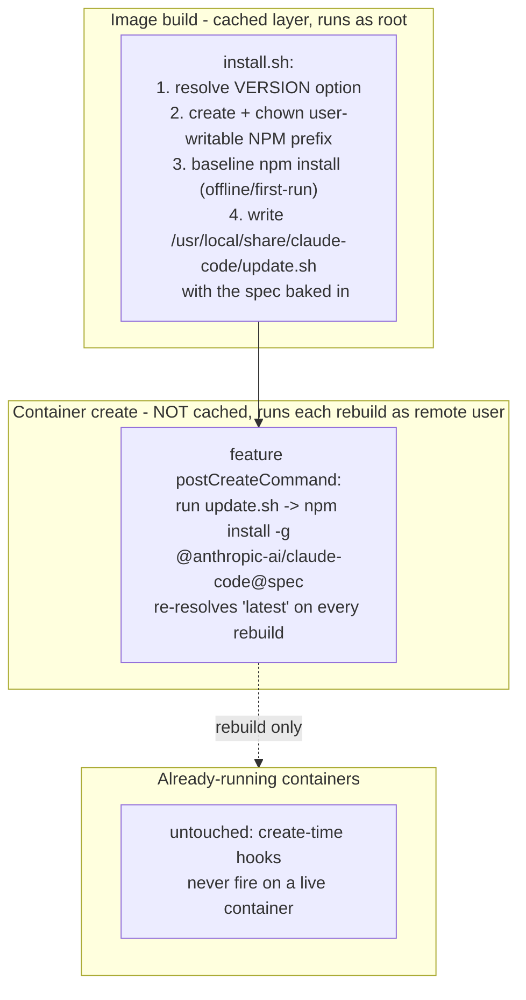

---
first_authored:
  by: "@claude-opus-4-8"
  at: 2026-09-11T14:00:00-07:00
task_list: devcontainer/claude-feature-updatability
type: proposal
state: live
status: evolved
superseded_by: cdocs/proposals/2026-09-12-claude-code-volume-native-update.md
last_reviewed:
  status: accepted
  by: "@claude-opus-4-8"
  at: 2026-09-11T16:45:00-07:00
  round: 2
tags: [devcontainer, claude-code, dependency_pinning, dev-infra, feature-updatability]
---

# Claude Code Feature Updatability

> NOTE(opus/claude-volume-native-update): Superseded by [`2026-09-12-claude-code-volume-native-update.md`](./2026-09-12-claude-code-volume-native-update.md), which reconsiders this design's one-line rejection of the native updater and instead persists the install directory on a named Docker volume.
> This proposal remains the more-reproducible fallback if the volume mount is not honored on lace's `--buildkit never` path.

> BLUF: The `claude-code` feature installs `@anthropic-ai/claude-code@latest` in `install.sh`, but the version is frozen twice over: the legacy builder caches the feature-install layer (so `@latest` is only ever re-resolved when the layer's cache key changes), and the `:1` OCI tag is digest-pinned in each consumer's `devcontainer-lock.json`.
> A `lace up --rebuild` recreates the container from the cached image and never re-runs the npm install, which is why weftwise stays stale.
> Fix: `install.sh` bakes the resolved version spec into an installed wrapper script, and a feature-declared `postCreateCommand` invokes that wrapper on every container create, so the reinstall runs outside the image-layer cache and lands current on each rebuild without touching running containers.
> Delivery is single-leg: the lifecycle hook is a new feature capability absent from the currently locked digest, so it reaches consumers only by republishing the feature and refreshing each consumer's lock once.
> After that one-time sweep, every future rebuild lands Claude Code current with zero further action.

## Summary

The user's report is precise: the feature "becomes outdated easily and (at least in weftwise) can't be updated easily," and the desired outcome is that "next time weftwise is rebuilt, it just handles the Claude Code update automatically," without restarting any active container.

Two distinct freezes cause the staleness, and both must be addressed because they interact:

1. Build-layer freeze (dominant). `install.sh` runs `npm install -g @anthropic-ai/claude-code@${VERSION}` with `VERSION` defaulting to `latest`. lace builds via `devcontainer up --buildkit never` (the legacy builder), whose local layer cache is persistent and effective: an empirical run cached all feature install scripts on a warm build. Once the feature-install layer is cached, `@latest` is never re-resolved on rebuild, so the container keeps whatever was newest at first build.
2. Digest-lock freeze. The feature ships as the OCI artifact `ghcr.io/weftwiseink/devcontainer-features/claude-code`, referenced by consumers as the floating major tag `:1` and resolved to a `@sha256` digest recorded in `devcontainer-lock.json`. A feature source edit or republish changes nothing at a consumer until that consumer's lock is refreshed.

The mechanism defeats freeze (1) structurally by relocating the reinstall out of the cached build layer and into a create-time lifecycle command that the devcontainer CLI runs inside the freshly created container.
The version value is bridged from build to create by baking it into an installed wrapper script: `install.sh` runs at build time where the `VERSION` option is a known env var, resolves the spec, and writes it into `/usr/local/share/claude-code/update.sh`; the feature declares `postCreateCommand` to run that wrapper.
This avoids the trap that a lifecycle-command string in `devcontainer-feature.json` gets no `${VERSION}` substitution and no build-time env at create time.
Because create-time lifecycle commands run only when a new container is created, this is inherently rebuild-triggered and never disturbs a running container, satisfying the hard constraint.

Freeze (2) is addressed by republishing the feature and refreshing each consumer's lock once.
This delivery is single-leg: the lifecycle hook is a capability that does not exist in the currently locked digest, so there is no zero-latency consumer-side path to it.
The sweep exists only to deliver the hook; thereafter the create-time hook keeps every rebuild current on its own.

## Objective

A lace-managed devcontainer must land a current Claude Code on its next rebuild, automatically, with no manual version bump and no restart of any currently-active container.
The `claude-code` feature itself must be easy to keep current, and the four consuming projects (jif, whelm, clauthier, weftwise) must be brought onto the new behavior in a single controlled sweep.

## Background

- Feature source: `devcontainers/features/src/claude-code/`.
  `devcontainer-feature.json` is at version `1.0.1` and declares a single `version` option defaulting to `"latest"`.
  `install.sh` runs `npm install -g "@anthropic-ai/claude-code@${VERSION}"` and creates the `~/.claude` config directory.
- Feature options reach `install.sh` as capitalized env vars at build time only.
  A lifecycle-command string declared in `devcontainer-feature.json` runs in the container at create time and is not documented to receive feature-option substitution, and existing features (`sprack`, `bash-history`) that use `containerEnv` all use static values, so there is no in-repo precedent for interpolating a feature option into feature metadata beyond the `install.sh` env.
- Persistence: the feature declares lace mounts for `~/.claude` (config directory) and `~/.claude/.claude.json` (host state overlay).
  The npm global prefix where the `claude` binary lands is not mounted: it is baked into the image layer and lives only in the container's ephemeral overlay, so anything written there is lost on rebuild.
- Publication: `.github/workflows/devcontainer-features-release.yaml` runs `devcontainers/action@v1` with `publish-features: true` on any push to `main` touching `devcontainers/features/src/**`.
  The action publishes each feature to `ghcr.io/weftwiseink/devcontainer-features/<id>` and tags it by the `version` field plus the floating major (`:1`) and `:latest` tags.
- Consumption: consumers reference `ghcr.io/weftwiseink/devcontainer-features/claude-code:1` and the devcontainer CLI records the resolved digest in `devcontainer-lock.json` (see fixture `packages/lace/src/__fixtures__/lockfiles/with-namespaced.json`).
- Build path: `runDevcontainerUp` in `packages/lace/src/lib/up.ts` invokes `devcontainer up --buildkit never`.
  The empirical report [`2026-05-12-experiment-legacy-builder-cache.md`](../reports/2026-05-12-experiment-legacy-builder-cache.md) measured the legacy builder caching all feature install scripts on a warm build (234s cold, 16s warm).
- lace cache flags: `lace up --no-cache` is documented as "Bypass filesystem cache for floating feature tags," and in `up.ts` it flows only to `fetchAllFeatureMetadata` (lace's metadata cache).
  It does not add `--build-no-cache` to the `devcontainer up` invocation, so it does not bust the podman build-layer cache.
  `lace up --rebuild` sets `removeExistingContainer` (passing `--remove-existing-container`), recreating the container from the existing/cached image; it does not force the feature-install layer to rebuild.
- Lifecycle semantics: the repo report [`2026-05-06-devcontainer-features-actual-behavior.md`](../reports/2026-05-06-devcontainer-features-actual-behavior.md) documents that `onCreateCommand`, `updateContentCommand`, and `postCreateCommand` run once on create; that `postCreateCommand` is intentionally never baked into a prebuild/content snapshot while `updateContentCommand`'s result can be; and that these commands once did not re-run on container recreation, a defect fixed in Remote-Containers v0.223.0.
- Lifecycle precedent: lace already composes `lace-fundamentals-init` into `postCreateCommand` (`up.ts` around line 1036), demonstrating that create-time lifecycle composition is an established pattern in this codebase.
- lace does not handle feature-declared lifecycle hooks in `template-resolver.ts` or elsewhere: it passes the feature OCI ref through and the devcontainer CLI performs the lifecycle merge at `up` time.
- Prior art on the constraint: [`2026-05-12-migrate-to-legacy-builder-cache.md`](./2026-05-12-migrate-to-legacy-builder-cache.md) migrated all four projects off `prebuildFeatures` to top-level `features` under the same hard "do not reboot the running containers" constraint.
- Related delivery precedent: [`2026-07-18-portless-feature-version-pin-and-ingress-durability.md`](./2026-07-18-portless-feature-version-pin-and-ingress-durability.md) delivered a feature change to digest-locked consumers. Its immediate, zero-latency leg was a consumer-side `version` option override honored by `install.sh` against the old locked digest; that leg does not apply here, because a new lifecycle capability cannot be conjured by an option override on the old digest. See Design Decisions.

> NOTE(opus/claude-feature-updatability): Claude Code has its own self-updater (`claude update`, auto-update on by default, `claude migrate-installer` to move a global npm install to a user-local install).
> It is not a durable mechanism here: whether it updates the npm-global package in place or installs to `~/.local`, it writes to paths outside the mounted `~/.claude`, so the update lives only in the container's ephemeral overlay and is lost on the next rebuild.
> The durable path must re-establish the desired version at build or create time. See Design Decisions.

## Proposed Solution

Bake the resolved version spec into an installed wrapper script at build time, invoke that wrapper from a feature-declared `postCreateCommand` so the reinstall runs outside the image-layer cache on every container create, and deliver the capability to consumers with a one-time republish plus lock-refresh sweep.

1. Feature build step (`install.sh`, runs as root):
   - Resolve the version spec from the `VERSION` env (default `latest`).
   - Create a user-writable npm global prefix (for example `/usr/local/share/npm-global`), `chown` it to the remote user, and export it as `NPM_CONFIG_PREFIX` via the feature's `containerEnv` so both the root build-time install and the remote-user create-time reinstall target the same writable location.
   - Run the baseline `npm install -g "@anthropic-ai/claude-code@${VERSION}"` so the image is self-contained and first run works offline.
   - Write an installed wrapper script (for example `/usr/local/share/claude-code/update.sh`) with the concrete spec baked in, made world-executable. The wrapper runs `npm install -g "@anthropic-ai/claude-code@<baked spec>"` and is non-fatal on network failure (falls back to the baked baseline and warns).

2. Feature metadata (`devcontainer-feature.json`):
   - Declare `postCreateCommand` to invoke the installed wrapper (for example `"postCreateCommand": "/usr/local/share/claude-code/update.sh"`).
   - Declare `containerEnv` exporting the `NPM_CONFIG_PREFIX` established in step 1.
   - Because `postCreateCommand` runs on every container create and is never baked into a prebuild/content snapshot, the reinstall re-resolves `latest` on each rebuild and cannot be re-frozen by a snapshot path.

3. Feature version bump and republish:
   - Bump `devcontainer-feature.json` from `1.0.1` to `1.1.0` and merge to `main` so the release workflow republishes the artifact carrying the wrapper, the `postCreateCommand`, and the `containerEnv`.
   - Update the feature README to document auto-update-on-rebuild, the `version` option's dual role (baseline install and the baked spec the wrapper reinstalls each create), the reproducibility pin, and the rebuild-latency cost.

4. Cross-project update sweep:
   - Refresh each consumer's `devcontainer-lock.json` to the republished digest, one project at a time, in an order that leaves the user's active container for last, verifying each on rebuild.

5. Reproducibility and toggle polish:
   - Confirm an exact `version` pin makes the wrapper an idempotent reinstall of that exact version, and optionally add an `autoUpdate` option (default true) so a consumer can opt out of floating `latest`.

## Important Design Decisions

- Create-time wrapper invocation, not build-time only. WHY: the build-layer freeze is the dominant cause of staleness, and no in-tree lace flag busts that layer (`--no-cache` is metadata-only; `--rebuild` recreates the container from the cached image).
  A create-time lifecycle command runs inside the freshly created container, outside the image-layer cache, so the version spec is genuinely re-resolved on every rebuild.
  This is also why the mechanism satisfies the no-restart constraint for free: create-time hooks fire only when a new container is created, never on a running one.

- Bake the spec into an installed script; do not put `${VERSION}` in the hook string. WHY: feature options are exposed to `install.sh` as env vars at build time only, and a lifecycle-command string in `devcontainer-feature.json` has no guaranteed access to them.
  An inline `postCreateCommand` running `...@${VERSION}` would likely expand to `@anthropic-ai/claude-code@`, an npm error, which (given the non-fatal degradation) would silently fall back to the baseline forever.
  Baking the resolved spec into `update.sh` at build time, where `VERSION` is known, is the concrete bridge that makes the create-time reinstall use the intended spec.

- `postCreateCommand`, not `updateContentCommand`. WHY: the objective is to escape a cached build artifact.
  Per the repo behavior report, `postCreateCommand` is intentionally never baked into a prebuild/content snapshot, whereas `updateContentCommand`'s result can be, which would reintroduce exactly the "result gets baked and refrozen" failure mode if any consumer ever adopts a prebuild/snapshot path.
  On the current `--buildkit never` recreate path the two are equivalent as an update trigger (lace removed its prebuild flow), so there is nothing to gain from `updateContentCommand` and a latent liability in it.
  `postCreateCommand` also maps 1:1 to the "fires only on a new container" model, keeping the design legible.

- User-writable npm prefix via `containerEnv`. WHY: `install.sh` runs as root during the build, but the create-time hook runs as the remote user, so a root-owned global npm prefix breaks the create-time reinstall.
  `install.sh` creates and `chown`s a user-writable prefix and exports it as `NPM_CONFIG_PREFIX` via `containerEnv`, so both installs target the same location unprivileged.
  The alternative (elevating the hook with `sudo`) assumes passwordless sudo, which not every consumer configures; the exported-prefix approach is portable.
  Whether a consumer's own `NPM_CONFIG_PREFIX` (weftwise sets a node-owned one) cooperates or collides with the feature-imposed prefix is an empirical per-consumer check, deferred to Phase 1 against the real configs; the mechanism itself is settled here.

- Unified `version` spec across build and create. WHY: both the baseline install and the wrapper's reinstall read the same resolved spec.
  A consumer that pins `version: "1.2.3"` gets an idempotent reinstall of that exact version on each create (it still runs `npm install` and touches the network, subject to the same offline-degradation path), so pinning stays reproducible; the default `latest` floats forward on each rebuild.
  This avoids a second, divergent version knob.

- Not the Claude Code self-updater. WHY: `claude update` and the native installer write outside the mounted `~/.claude`, so their effect is ephemeral and lost on rebuild.
  A mechanism that evaporates on the exact event we are targeting (rebuild) cannot be the durable answer.
  Re-establishing the version at create time is durable by construction.

- Single-leg delivery. WHY: the lifecycle hook, the wrapper, and the `containerEnv` are new feature capabilities absent from the currently locked digest.
  Unlike the portless pin (whose immediate leg was a consumer-side `version` override honored by the already-locked `install.sh`), no consumer-side override can conjure a capability the locked artifact does not contain.
  Delivery is therefore only the durable leg: republish the feature, then refresh each consumer's lock once. There is no zero-latency path, and an implementer should not look for one.

- Sweep is one-time, not a standing obligation. WHY: after the sweep the create-time wrapper keeps every future rebuild current without any further per-project action.
  The sweep exists only to deliver the capability; it is not a recurring maintenance task.

## Edge Cases / Challenging Scenarios

- Offline or registry-unreachable rebuild. The wrapper's `npm install` can fail with no network.
  The wrapper must be non-fatal (fall back to the baked baseline and warn) so a network blip does not fail container creation.
  Document the resulting behavior: the container comes up on the baseline version and warns that the refresh was skipped.

- Consumer prefix cooperation. A consumer that sets its own `NPM_CONFIG_PREFIX` (weftwise does, to a node-owned dir) may cooperate with or override the feature-exported one.
  The mechanism (export a user-writable prefix from the feature) is fixed; the per-consumer interaction is a Phase 1 empirical check against the four real configs, which live outside this worktree.

- Pinned consumers. A consumer pinning an exact `version` must not float.
  The unified-spec design makes the wrapper an idempotent reinstall of the pinned version, so pinning behaves as expected.

- Feature lifecycle command not honored through lace's generated config. lace emits an extended `.lace/devcontainer.json` and injects its own `postCreateCommand`, but does not handle feature-declared lifecycle hooks; the devcontainer CLI performs the merge.
  That the CLI runs the feature `postCreateCommand` alongside lace's injected one on the `--buildkit never` path is expected but must be verified rather than assumed. See Verification Methodology; the fallback is for lace to compose the wrapper invocation into `postCreateCommand` the way it composes `lace-fundamentals-init`.

- Stale toolchain not re-running lifecycle commands on recreate. The mechanism depends on `postCreateCommand` re-running when `--remove-existing-container` recreates the container.
  The repo behavior report documents a period where lifecycle commands did not re-run on recreation, fixed in Remote-Containers v0.223.0, so the toolchain floor must be asserted. See Verification Methodology.

- Rebuild latency. The create-time reinstall adds an npm install (order of ten to twenty seconds) to every rebuild.
  This is the intended cost of always-current and is acceptable; note it in the README so it is not mistaken for a regression.

- Active-container safety during the sweep. Refreshing a lock is a file edit and does not touch a running container, but the verification rebuild does recreate it.
  The sweep must sequence the user's actively-used container last and only rebuild it with explicit authorization, mirroring the constraint honored in the prebuild-removal migration.

- `claude.json` overlay churn. The feature mounts `~/.claude/.claude.json`, which Claude Code writes on every startup.
  Reinstalling the CLI does not touch this file, so the update wrapper and the state overlay are orthogonal; note it to preempt the concern.

## Test Plan

- Feature unit/smoke (Phase 1): in a scratch container built from the feature, assert the baseline `claude --version` after build; assert the wrapper carries the resolved spec; run the wrapper and assert the version is re-resolved; assert the wrapper runs unprivileged (no sudo) and writes successfully to the exported `NPM_CONFIG_PREFIX`.
- Idempotency: run the wrapper twice; the second run reinstalls the same version and the reported version is unchanged.
- Pin fidelity: with `version: "<older exact>"`, build and run the wrapper; assert the version equals the pin exactly and does not float to latest.
- Offline degradation: with the network blocked, assert container create still succeeds on the baseline version and emits the skip warning.
- Recreate re-run: assert the `postCreateCommand` actually re-runs on a `--remove-existing-container` recreate (not only on first create), on a toolchain at or above the v0.223.0 floor.
- lace propagation (Phase 3): assert the feature `postCreateCommand` appears in the effective lifecycle set of the generated `.lace/devcontainer.json` run and composes with `lace-fundamentals-init` (both execute).
- Regression: existing `claude-code-scenarios.test.ts` mount auto-injection scenarios (C1-C8) still pass; the added lifecycle command and `containerEnv` do not perturb mount injection.
- Sweep (Phase 4): per project, `claude --version` before rebuild, then after a `lace up --rebuild` on the refreshed lock, assert the version advanced to (or equals) the newest published Claude Code.

## Verification Methodology

The freeze is invisible in committed config and only observable at the running binary, so every phase verifies against a real rebuilt container, not config inspection.

Per phase, paste into the implementation devlog:

- The reproduction of the freeze first: on an un-updated consumer, capture `claude --version`, run `lace up --rebuild`, and capture `claude --version` again; show they are identical despite `@latest` in the feature. This proves the defect before the fix.
- The toolchain floor: capture `devcontainer --version` and confirm it is at or above the Remote-Containers v0.223.0 lifecycle-re-run fix, and explicitly assert that `postCreateCommand` re-runs on a recreate (not just first create) by observing the wrapper's log line on a second `lace up --rebuild`. This guards against a stale toolchain silently reintroducing the freeze.
- After the fix (feature carrying the wrapper, lock refreshed): the before/after `claude --version` across a `lace up --rebuild`, showing the version advanced with no manual bump.
- The active-container safety evidence: `podman ps` for a second, deliberately-not-rebuilt container captured before and after the target rebuild, showing unchanged uptime and unchanged `claude --version` in that other container. This is the direct proof that the update did not restart or touch active containers.
- The idempotency evidence: a plain `lace up` (no `--rebuild`) after the update, showing the container is reused (not recreated) and the version is stable.
- The lifecycle-composition evidence: the effective lifecycle commands from the generated `.lace/devcontainer.json` and the create-time logs showing both the feature wrapper and `lace-fundamentals-init` ran.

The weftwise worktree is the natural final test bed since it is the project the user named, but it is rebuilt last and only with authorization; jif, whelm, or clauthier serve as the earlier, lower-stakes verification beds.

> NOTE(opus/claude-feature-updatability): This repo has no single-command devcontainer config validator; verification is the manual rebuild-and-inspect loop above.
> If this proves too repetitive across the four-project sweep, a small `lace` helper that captures `claude --version` before/after a rebuild would be a reasonable follow-up `/cdocs:rfp`, but it is not a blocker.

## Implementation Phases

Phase 1 is the feature change (wrapper, prefix, hook).
Phase 2 is its publication.
Phase 3 is the lace-side propagation check.
Phase 4 is the cross-project sweep and depends on Phase 2.
Phase 5 is polish and can land with or after Phase 4.

### Phase 1: feature wrapper, user-writable prefix, and create-time hook

- In `install.sh` (root, build time): resolve the `VERSION` spec; create and `chown` a user-writable npm global prefix; export it as `NPM_CONFIG_PREFIX` via the feature's `containerEnv`; run the baseline install into that prefix; write the installed wrapper (`/usr/local/share/claude-code/update.sh`) with the resolved spec baked in and made executable.
- Make the wrapper non-fatal on network failure (fall back to baseline, warn).
- In `devcontainer-feature.json`: add `postCreateCommand` invoking the wrapper and the `containerEnv` for the prefix.
- Smoke-test in a scratch container under both a root-user and a non-root (`node`) remote-user config, since the privilege model differs, and confirm the wrapper re-runs on a `--remove-existing-container` recreate on a toolchain at or above v0.223.0.
- Success criteria: build then create; `claude --version` after the wrapper re-resolves to the newest published version when `version` is `latest`; the wrapper runs without sudo and without permission error against the exported prefix; a pinned `version` yields exactly that version; a network-blocked create still succeeds on the baseline with a warning; the wrapper re-runs on recreate; the reinstall is idempotent.
- Do NOT: put `${VERSION}` in the hook string (bake it into the wrapper); remove the build-time baseline install; change the `~/.claude` or `~/.claude/.claude.json` mount declarations; adopt `claude update`/native-installer self-update as the mechanism.

### Phase 2: version bump, republish, README

- Bump `devcontainer-feature.json` `version` from `1.0.1` to `1.1.0`.
- Merge to `main` so `devcontainer-features-release.yaml` republishes `ghcr.io/weftwiseink/devcontainer-features/claude-code` with the wrapper, hook, and `containerEnv`.
- Rewrite the feature README to document auto-update-on-rebuild, the `version` option's dual role, the reproducibility pin, and the rebuild-latency cost.
- Success criteria: the new artifact is published and the `:1` and `:1.1.0` tags resolve to it; the README matches the shipped behavior.
- Depends on: Phase 1 (wrapper and prefix settled by its smoke test).
- Do NOT: change the feature `id`, the mount labels, or the `dependsOn` node feature.

### Phase 3: lace propagation check

- Verify the feature `postCreateCommand` is honored through lace's generated `.lace/devcontainer.json` and the `--buildkit never` path, and composes with the injected `lace-fundamentals-init` (both run).
- If the CLI does not honor the feature hook in this configuration, fall back to composing the wrapper invocation into `postCreateCommand` in lace, the way `lace-fundamentals-init` is composed.
- Success criteria: an integration test or a captured run shows both lifecycle commands executing on create; existing `claude-code-scenarios.test.ts` scenarios still pass.
- Do NOT: change the `--buildkit never` decision; alter the metadata-only semantics of the existing `--no-cache` flag; modify the `lace-fundamentals-init` injection.

> NOTE(opus/claude-feature-updatability): An operator escape hatch to force-rebuild the baked baseline layer itself (a `--build-no-cache` passthrough on `lace up`, distinct from the metadata-only `--no-cache`) is orthogonal to the auto-update mechanism, which already keeps things current on rebuild.
> It is deliberately out of scope here; if wanted, capture it as a follow-up `/cdocs:rfp` rather than enlarging this change surface.

### Phase 4: cross-project update sweep

- For each consumer, refresh `devcontainer-lock.json` to the republished digest (for example via `devcontainer upgrade`), then verify on a rebuild.
- Order: jif, then whelm, then clauthier, then weftwise last (weftwise is the user's named, actively-used project and is rebuilt only with explicit authorization).
- For each project, paste the before/after `claude --version` across the rebuild and the untouched-second-container evidence per the Verification Methodology.
- Success criteria: each project, on its post-refresh rebuild, lands the newest published Claude Code with no manual version bump; no non-target running container is restarted or changed during any project's rebuild.
- Depends on: Phase 2.
- Do NOT: rebuild multiple projects' active containers concurrently; rebuild weftwise's active container without authorization; hand-edit feature versions in consumer configs when a lock refresh suffices.

### Phase 5: reproducibility and toggle polish

- Confirm the exact-pin idempotent-reinstall behavior end to end in a consumer.
- Optionally add an `autoUpdate` boolean option (default true) so a consumer can freeze at the baseline without pinning an exact version, documented alongside `version`. When `autoUpdate: false`, the wrapper is not invoked and the baseline stays in place.
- Success criteria: a pinned consumer reinstalls only the pinned version; if `autoUpdate` is added, `autoUpdate: false` skips the create-time reinstall.
- Do NOT: make `autoUpdate: false` the default (that would reintroduce the staleness the proposal removes).

## Investigation Requested

The following need reviewer or maintainer input; they are surfaced here rather than blocking, per dispatched-mode discipline.

- Author-checklist review: the `/cdocs:review` sanity check is handled by the overseer's review loop rather than run here.
- Per-consumer prefix confirmation: the exported `NPM_CONFIG_PREFIX` mechanism is settled, but its interaction with each consumer's own prefix (weftwise sets a node-owned `NPM_CONFIG_PREFIX`) is an empirical Phase 1 check against the real four configs, which live outside this worktree and were not read.
- Lifecycle-hook honoring: that the devcontainer CLI runs a feature-declared `postCreateCommand` alongside lace's injected one on the `--buildkit never` path is expected but unverified; Phase 3 is the verification, with the lace-composition fallback if it is not honored.
