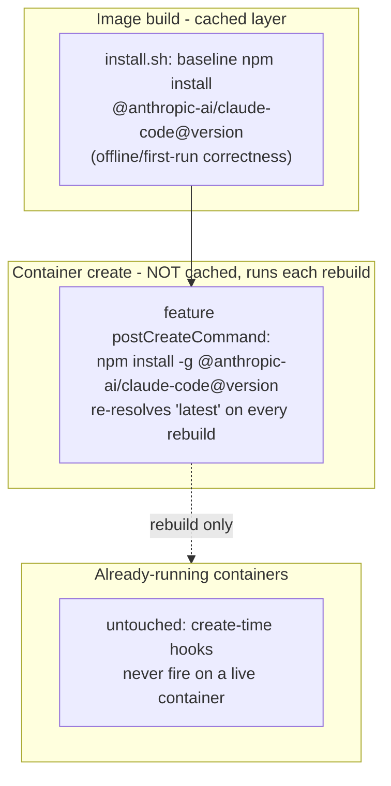

---
first_authored:
  by: "@claude-opus-4-8"
  at: 2026-09-11T14:00:00-07:00
task_list: devcontainer/claude-feature-updatability
type: proposal
state: live
status: review_ready
tags: [devcontainer, claude-code, dependency_pinning, dev-infra, feature-updatability]
---

# Claude Code Feature Updatability

> BLUF: The `claude-code` feature installs `@anthropic-ai/claude-code@latest` in `install.sh`, but the version is frozen twice over: the legacy builder caches the feature-install layer (so `@latest` is only ever re-resolved when the layer's cache key changes), and the `:1` OCI tag is digest-pinned in each consumer's `devcontainer-lock.json` (so a republished feature never reaches a consumer until its lock is refreshed).
> A `lace up --rebuild` recreates the container from the cached image and never re-runs the npm install, which is why weftwise stays stale.
> Fix: move the npm install out of the cached build layer and into a feature-declared create-time lifecycle command, so the version spec is re-resolved on every container create (every rebuild) with no build-cache dependency, then deliver that behavior to the four consumers with a one-time feature republish plus lock refresh.
> After that one-time sweep, every future rebuild lands Claude Code current with zero further action, and no currently-running container is touched (create-time hooks only fire on a new container).
> Keep a build-time baseline install for offline/first-run correctness; an exact `version` pin remains available and makes the hook a deterministic no-op for consumers that want reproducibility.

## Summary

The user's report is precise: the feature "becomes outdated easily and (at least in weftwise) can't be updated easily," and the desired outcome is that "next time weftwise is rebuilt, it just handles the Claude Code update automatically," without restarting any active container.

Two distinct freezes cause the staleness, and both must be addressed because they interact:

1. Build-layer freeze (dominant). `install.sh` runs `npm install -g @anthropic-ai/claude-code@${VERSION}` with `VERSION` defaulting to `latest`. lace builds via `devcontainer up --buildkit never` (the legacy builder), whose local layer cache is persistent and effective: an empirical run cached all feature install scripts on a warm build. Once the feature-install layer is cached, `@latest` is never re-resolved on rebuild, so the container keeps whatever was newest at first build.
2. Digest-lock freeze. The feature ships as the OCI artifact `ghcr.io/weftwiseink/devcontainer-features/claude-code`, referenced by consumers as the floating major tag `:1` and resolved to a `@sha256` digest recorded in `devcontainer-lock.json`. A feature source edit or republish changes nothing at a consumer until that consumer's lock is refreshed.

The chosen mechanism defeats freeze (1) structurally by relocating the install from a cached build layer into a feature-declared `postCreateCommand`, which the devcontainer CLI runs inside the freshly created container rather than as a cached image layer.
Because create-time lifecycle commands run only when a new container is created, this is inherently rebuild-triggered and never disturbs a running container, satisfying the hard constraint.
Freeze (2) is addressed with the delivery pattern this repo already established for the portless pin: bump the feature version, republish via the release workflow, refresh each consumer's lock once.
The sweep is one-time; thereafter the create-time hook keeps every rebuild current on its own.

This proposal deliberately reuses the two-leg delivery model adjudicated in [`2026-07-18-portless-feature-version-pin-and-ingress-durability.md`](./2026-07-18-portless-feature-version-pin-and-ingress-durability.md), whose round-1 review established that a source-only change to a digest-locked feature reaches no consumer.

## Objective

A lace-managed devcontainer must land a current Claude Code on its next rebuild, automatically, with no manual version bump and no restart of any currently-active container.
The `claude-code` feature itself must be easy to keep current, and the four consuming projects (jif, whelm, clauthier, weftwise) must be brought onto the new behavior in a single controlled sweep.

## Background

- Feature source: `devcontainers/features/src/claude-code/`.
  `devcontainer-feature.json` is at version `1.0.1` and declares a single `version` option defaulting to `"latest"`.
  `install.sh` runs `npm install -g "@anthropic-ai/claude-code@${VERSION}"` and creates the `~/.claude` config directory.
- Persistence: the feature declares lace mounts for `~/.claude` (config directory) and `~/.claude/.claude.json` (host state overlay).
  The npm global prefix where the `claude` binary lands is not mounted: it is baked into the image layer and lives only in the container's ephemeral overlay, so anything written there is lost on rebuild.
- Publication: `.github/workflows/devcontainer-features-release.yaml` runs `devcontainers/action@v1` with `publish-features: true` on any push to `main` touching `devcontainers/features/src/**`.
  The action publishes each feature to `ghcr.io/weftwiseink/devcontainer-features/<id>` and tags it by the `version` field plus the floating major (`:1`) and `:latest` tags.
- Consumption: consumers reference `ghcr.io/weftwiseink/devcontainer-features/claude-code:1` and the devcontainer CLI records the resolved digest in `devcontainer-lock.json` (see fixture `packages/lace/src/__fixtures__/lockfiles/with-namespaced.json`).
- Build path: `runDevcontainerUp` in `packages/lace/src/lib/up.ts` invokes `devcontainer up --buildkit never`.
  The empirical report [`2026-05-12-experiment-legacy-builder-cache.md`](../reports/2026-05-12-experiment-legacy-builder-cache.md) measured the legacy builder caching all feature install scripts on a warm build (234s cold, 16s warm).
- lace cache flags: `lace up --no-cache` is documented as "Bypass filesystem cache for floating feature tags," and in `up.ts` it flows only to `fetchAllFeatureMetadata` (lace's metadata cache).
  It does not add `--build-no-cache` to the `devcontainer up` invocation, so it does not bust the podman build-layer cache.
  `lace up --rebuild` sets `removeExistingContainer` (passing `--remove-existing-container`), recreating the container from the existing/cached image; it does not force the feature-install layer to rebuild.
- Lifecycle precedent: lace already composes `lace-fundamentals-init` into `postCreateCommand` (`up.ts` around line 1036), demonstrating that create-time lifecycle composition is an established pattern in this codebase.
- Prior art on delivery: [`2026-07-18-portless-feature-version-pin-and-ingress-durability.md`](./2026-07-18-portless-feature-version-pin-and-ingress-durability.md) established the two-leg delivery (consumer-side override for immediacy, republish plus lock refresh for durability) for exactly this class of digest-locked feature.
- Prior art on the constraint: [`2026-05-12-migrate-to-legacy-builder-cache.md`](./2026-05-12-migrate-to-legacy-builder-cache.md) migrated all four projects off `prebuildFeatures` under the same hard "do not reboot the running containers" constraint.

> NOTE(opus/claude-feature-updatability): Claude Code has its own self-updater (`claude update`, auto-update on by default, `claude migrate-installer` to move a global npm install to a user-local install).
> It is not a durable mechanism here: whether it updates the npm-global package in place or installs to `~/.local`, it writes to paths outside the mounted `~/.claude`, so the update lives only in the container's ephemeral overlay and is lost on the next rebuild.
> The durable path must re-establish the desired version at build or create time. See Design Decisions.

## Proposed Solution

Relocate the Claude Code install from a cached build layer into a feature-declared create-time lifecycle command, so the version spec is re-resolved every time a container is created, and deliver that behavior to consumers with a one-time republish plus lock-refresh sweep.

1. Feature: add a create-time update hook.
   Add a `postCreateCommand` to `devcontainer-feature.json` (or an installed script the feature points that command at) that runs `npm install -g "@anthropic-ai/claude-code@${VERSION}"`.
   Keep the existing build-time install in `install.sh` as a baseline so the image is self-contained and first run works offline.
   The hook re-runs on every container create, which is every rebuild, and re-resolves `latest` each time.
   Make the install prefix user-writable so the create-time hook (which runs as the remote user) can write where the build-time install (which runs as root) put the binary. See Design Decisions for the privilege model.

2. Feature: version bump and republish.
   Bump `devcontainer-feature.json` from `1.0.1` to `1.1.0` and merge to `main` so the release workflow republishes the artifact carrying the hook.
   Update the feature README to document the auto-update-on-rebuild behavior, the `version` option's dual role (baseline install and re-resolved on each rebuild), and the pin-for-reproducibility path.

3. lace: verify propagation and add an operator escape hatch.
   Confirm the feature's `postCreateCommand` survives lace's generated `.lace/devcontainer.json` and the `--buildkit never` path, and composes with lace's injected `lace-fundamentals-init` rather than clobbering it.
   Add a force-refresh path for operators who want to rebuild the baked layer itself (for example a `--build-no-cache` passthrough on `lace up`), for the rare case where the baseline install must be refreshed rather than the create-time hook.

4. Cross-project update sweep.
   Refresh each consumer's `devcontainer-lock.json` to the republished digest, one project at a time, in an order that leaves the user's active container for last, verifying each on rebuild.

5. Reproducibility and toggle polish.
   Confirm that an exact `version` pin makes the hook a deterministic no-op, and optionally add an `autoUpdate` option (default true) so a consumer can opt out of floating `latest` without pinning an exact version.

## Important Design Decisions

- Create-time hook, not build-time only. WHY: the build-layer freeze is the dominant cause of staleness, and no in-tree lace flag busts that layer (`--no-cache` is metadata-only; `--rebuild` recreates the container from the cached image).
  A create-time lifecycle command runs inside the freshly created container, outside the image-layer cache, so `@latest` is genuinely re-resolved on every rebuild.
  This is also why the mechanism satisfies the no-restart constraint for free: create-time hooks fire only when a new container is created, never on a running one.

- Keep the build-time baseline install. WHY: relying on the create-time hook alone would leave the image without a `claude` binary if the create-time network call fails, and would break offline first run.
  The baseline keeps the image self-contained; the hook is an idempotent refresh on top of it.

- Not the Claude Code self-updater. WHY: `claude update` and the native installer write outside the mounted `~/.claude`, so their effect is ephemeral and lost on rebuild.
  A mechanism that evaporates on the exact event we are targeting (rebuild) cannot be the durable answer.
  Re-establishing the version at create time is durable by construction.

- Unified `version` spec across build and create. WHY: both the baseline install and the create-time hook read the same `${VERSION}`.
  A consumer that pins `version: "1.2.3"` gets a deterministic no-op hook (reinstalls the same version), so pinning stays fully reproducible; the default `latest` floats forward on each rebuild.
  This avoids a second, divergent version knob.

- User-writable install prefix. WHY: `install.sh` runs as root during the build, but a feature `postCreateCommand` runs as the remote user.
  If the global npm prefix is root-owned, the create-time reinstall fails with a permission error.
  Installing Claude Code into a user-writable prefix (or otherwise granting the remote user write to the install location) lets both the build-time and create-time installs use the same unprivileged path.
  The alternative (elevating the hook with `sudo`) assumes passwordless sudo, which not every consumer configures; the user-prefix approach is portable.
  This is the highest-risk detail and is the first thing Phase 1 smoke-tests.

- Two-leg delivery, reusing the portless-established pattern. WHY: the feature is digest-locked in each consumer's `devcontainer-lock.json`, so a source edit alone reaches no one.
  The immediate leg is a consumer-side lock refresh; the durable leg is the republished artifact.
  This is the same adjudication accepted in the portless proposal and needs no re-litigation.

- Sweep is one-time, not a standing obligation. WHY: the whole point is that after the sweep the create-time hook keeps every future rebuild current without any further per-project action.
  The sweep exists only to deliver the hook itself; it is not a recurring maintenance task.

## Edge Cases / Challenging Scenarios

- Offline or registry-unreachable rebuild. The create-time hook's `npm install` can fail with no network.
  The hook must be non-fatal (for example, fall back to the baked baseline and warn) so a network blip does not fail container creation.
  Document the resulting behavior: the container comes up on the baseline version and warns that the refresh was skipped.

- Permission mismatch between root build and user create. Covered in Design Decisions; if the prefix is not user-writable the hook fails.
  Phase 1 must verify the exact prefix and ownership under the real consumer configs (weftwise sets `NPM_CONFIG_PREFIX` to a node-owned dir; a base-image consumer may not).

- Pinned consumers. A consumer pinning an exact `version` must not be surprised by a floating update.
  The unified-spec design makes the hook reinstall the pinned version (idempotent), so pinning behaves as expected.

- Feature lifecycle command not honored through lace's generated config. lace emits an extended `.lace/devcontainer.json` and injects its own `postCreateCommand`.
  The devcontainer CLI is expected to run feature-declared lifecycle hooks separately from the top-level `postCreateCommand`, but this must be verified on the `--buildkit never` path rather than assumed. See Verification Methodology.

- Rebuild latency. The create-time reinstall adds an npm install (order of ten to twenty seconds) to every rebuild.
  This is the intended cost of always-current and is acceptable; note it in the README so it is not mistaken for a regression.

- Active-container safety during the sweep. Refreshing a lock is a file edit and does not touch a running container, but the verification rebuild does recreate it.
  The sweep must sequence the user's actively-used container last and only rebuild it with explicit authorization, mirroring the constraint honored in the prebuild-removal migration.

- `claude.json` overlay churn. The feature mounts `~/.claude/.claude.json`, which Claude Code writes on every startup.
  Reinstalling the CLI does not touch this file, so the update hook and the state overlay are orthogonal; note it to preempt the concern.

## Test Plan

- Feature unit/smoke (Phase 1): in a scratch container built from the feature, assert the baseline `claude --version` after build, then simulate a create-time hook run and assert the version is re-resolved; assert the hook runs unprivileged (no sudo) and writes successfully to the install prefix.
- Idempotency: run the hook twice; the second run is a no-op reinstall and the version is unchanged.
- Pin fidelity: with `version: "<older exact>"`, build and run the hook; assert the version equals the pin exactly and does not float to latest.
- Offline degradation: with the network blocked, assert container create still succeeds on the baseline version and emits the skip warning.
- lace propagation (Phase 3): assert the feature `postCreateCommand` appears in the effective lifecycle set of the generated `.lace/devcontainer.json` run and composes with `lace-fundamentals-init` (both execute).
- Regression: existing `claude-code-scenarios.test.ts` mount auto-injection scenarios (C1-C8) still pass; the added lifecycle command does not perturb mount injection.
- Sweep (Phase 4): per project, `claude --version` before rebuild, then after a `lace up --rebuild` on the refreshed lock, assert the version advanced to (or equals) the newest published Claude Code.

## Verification Methodology

The freeze is invisible in committed config and only observable at the running binary, so every phase verifies against a real rebuilt container, not config inspection.

Per phase, paste into the implementation devlog:

- The reproduction of the freeze first: on an un-updated consumer, capture `claude --version`, run `lace up --rebuild`, and capture `claude --version` again; show they are identical despite `@latest` in the feature. This proves the defect before the fix.
- After the fix (feature carrying the hook, lock refreshed): the same before/after `claude --version` across a `lace up --rebuild`, showing the version advanced with no manual bump.
- The active-container safety evidence: `podman ps` for a second, deliberately-not-rebuilt container captured before and after the target rebuild, showing unchanged uptime and unchanged `claude --version` in that other container. This is the direct proof that the update did not restart or touch active containers.
- The idempotency evidence: a plain `lace up` (no `--rebuild`) after the update, showing the container is reused (not recreated) and the version is stable.
- The lifecycle-composition evidence: the effective lifecycle commands from the generated `.lace/devcontainer.json` and the create-time logs showing both the feature hook and `lace-fundamentals-init` ran.

The weftwise worktree is the natural final test bed since it is the project the user named, but it is rebuilt last and only with authorization; jif, whelm, or clauthier serve as the earlier, lower-stakes verification beds.

> NOTE(opus/claude-feature-updatability): This repo has no single-command devcontainer config validator; verification is the manual rebuild-and-inspect loop above.
> If this proves too repetitive across the four-project sweep, a small `lace` helper that captures `claude --version` before/after a rebuild would be a reasonable follow-up `/cdocs:rfp`, but it is not a blocker.

## Implementation Phases

Phases 1 and 2 are the feature change and its publication.
Phase 3 is the lace-side propagation check and operator escape hatch.
Phase 4 is the cross-project sweep and depends on Phase 2.
Phase 5 is polish and can land with or after Phase 4.

### Phase 1: feature create-time update hook

- Add a create-time update mechanism to the `claude-code` feature: a `postCreateCommand` in `devcontainer-feature.json` that runs `npm install -g "@anthropic-ai/claude-code@${VERSION}"`, or an installed script the command invokes.
- Make the install prefix user-writable so the hook runs unprivileged; keep the existing root build-time install in `install.sh` as the baseline, targeting the same prefix.
- Make the hook non-fatal on network failure (fall back to baseline, warn).
- Smoke-test in a scratch container under both a root-user and a non-root (`node`) remote-user config, since the privilege model differs.
- Success criteria: build then create; `claude --version` after the hook re-resolves to the newest published version when `version` is `latest`; the hook runs without sudo and without permission error; a pinned `version` yields exactly that version; a network-blocked create still succeeds on the baseline with a warning; the hook is idempotent.
- Do NOT: remove the build-time baseline install; change the `~/.claude` or `~/.claude/.claude.json` mount declarations; adopt `claude update`/native-installer self-update as the mechanism.

### Phase 2: version bump, republish, README

- Bump `devcontainer-feature.json` `version` from `1.0.1` to `1.1.0`.
- Merge to `main` so `devcontainer-features-release.yaml` republishes `ghcr.io/weftwiseink/devcontainer-features/claude-code` with the hook.
- Rewrite the feature README to document auto-update-on-rebuild, the `version` option's dual role, the reproducibility pin, and the rebuild-latency cost.
- Success criteria: the new artifact is published and the `:1` and `:1.1.0` tags resolve to it; the README matches the shipped behavior.
- Depends on: Phase 1 (hook settled by its smoke test).
- Do NOT: change the feature `id`, the mount labels, or the `dependsOn` node feature.

### Phase 3: lace propagation check and operator escape hatch

- Verify the feature `postCreateCommand` is honored through lace's generated `.lace/devcontainer.json` and the `--buildkit never` path, and composes with the injected `lace-fundamentals-init` (both run).
- Add an operator force-refresh path for the baked baseline layer (for example a `--build-no-cache` passthrough on `lace up`, distinct from the metadata-only `--no-cache`), documented as the rare escape hatch for refreshing the baseline rather than the create-time hook.
- Success criteria: an integration test or a captured run shows both lifecycle commands executing on create; the force-refresh path rebuilds the feature layer on demand; existing `claude-code-scenarios.test.ts` scenarios still pass.
- Do NOT: change the `--buildkit never` decision; alter the metadata-only semantics of the existing `--no-cache` flag (add a distinct flag instead); modify the `lace-fundamentals-init` injection.

### Phase 4: cross-project update sweep

- For each consumer, refresh `devcontainer-lock.json` to the republished digest (for example via `devcontainer upgrade`), then verify on a rebuild.
- Order: jif, then whelm, then clauthier, then weftwise last (weftwise is the user's named, actively-used project and is rebuilt only with explicit authorization).
- For each project, paste the before/after `claude --version` across the rebuild and the untouched-second-container evidence per the Verification Methodology.
- Success criteria: each project, on its post-refresh rebuild, lands the newest published Claude Code with no manual version bump; no non-target running container is restarted or changed during any project's rebuild.
- Depends on: Phase 2.
- Do NOT: rebuild multiple projects' active containers concurrently; rebuild weftwise's active container without authorization; hand-edit feature versions in consumer configs when a lock refresh suffices.

### Phase 5: reproducibility and toggle polish

- Confirm the exact-pin no-op behavior end to end in a consumer.
- Optionally add an `autoUpdate` boolean option (default true) so a consumer can freeze at the baseline without pinning an exact version, documented alongside `version`.
- Success criteria: a pinned consumer never floats; if `autoUpdate` is added, `autoUpdate: false` skips the create-time hook and leaves the baseline in place.
- Do NOT: make `autoUpdate: false` the default (that would reintroduce the staleness the proposal removes).

## Investigation Requested

The following need reviewer or maintainer input; they are surfaced here rather than blocking, per dispatched-mode discipline.

- Author-checklist review: the `/cdocs:review` sanity check is deferred to the overseer's review loop rather than run here.
- Privilege model confirmation: the exact npm global prefix and its ownership differ per consumer (weftwise sets a node-owned `NPM_CONFIG_PREFIX`; a base-image consumer may inherit a root-owned prefix).
  Whether the feature should impose its own user-writable prefix, or rely on the remote user already owning the prefix, or elevate the hook with sudo, should be confirmed against the real four consumer configs during Phase 1.
  The consuming repos (jif, whelm, clauthier, weftwise) are outside this worktree and were not read.
- Lifecycle-hook honoring: that the devcontainer CLI runs a feature-declared `postCreateCommand` alongside lace's injected `postCreateCommand` on the `--buildkit never` path is expected but unverified; Phase 3 is the verification, and if the CLI does not honor feature lifecycle hooks in this configuration, the fallback is to have lace compose the update command into `postCreateCommand` the same way it composes `lace-fundamentals-init`.
- `updateContentCommand` vs `postCreateCommand`: `postCreateCommand` is proposed for simplicity (runs once on create, which covers rebuild).
  A reviewer may prefer `updateContentCommand` for its update semantics; the trade-off is that it can run more often. Either satisfies the constraint.
