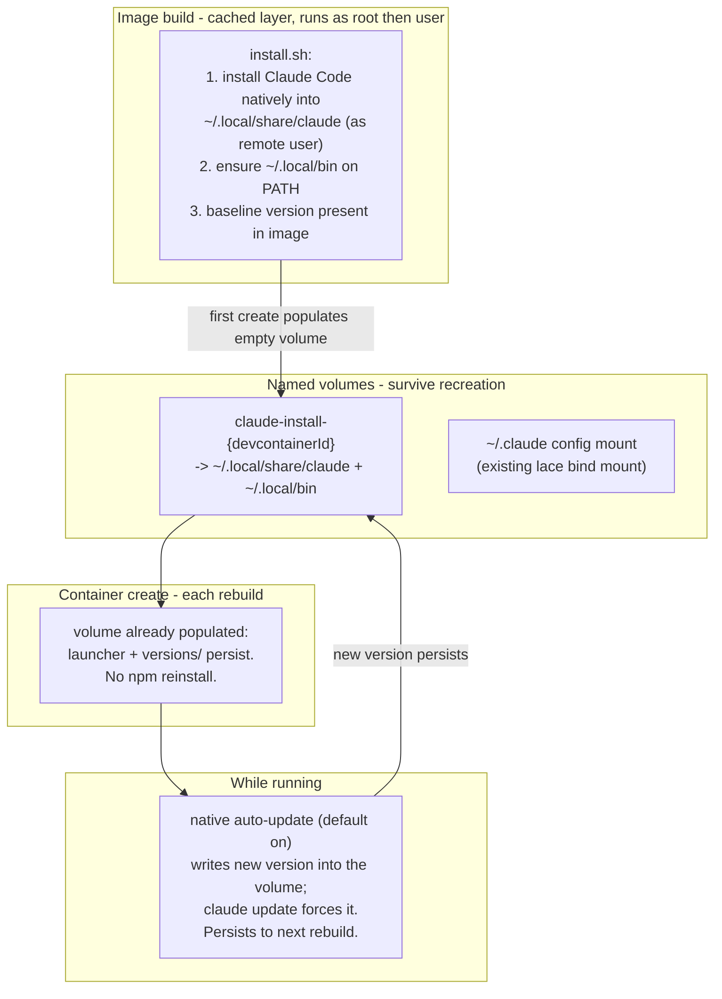

---
first_authored:
  by: "@claude-opus-4-8"
  at: 2026-09-12T11:00:00-07:00
task_list: devcontainer/claude-volume-native-update
type: proposal
state: live
status: review_ready
tags: [devcontainer, claude-code, auto-update, docker-volume, architecture]
---

# Claude Code via Persistent Volume and Native Self-Update

> BLUF: The `claude-code` feature can be kept current by persisting Claude Code's install directory on a per-project named Docker volume and letting the tool's own native updater keep it fresh, instead of npm-reinstalling on every container create.
> This directly neutralizes the one-line rationale that the accepted npm-reinstall proposal used to reject `claude update` ("evaporates on rebuild"): a named volume survives container recreation, so what the updater writes to `~/.local/share/claude` persists across the exact event the design targets.
> The approach is also simpler on the two hardest points of the npm design: the native install is user-local (`~/.local`), so the root-build-vs-user-create prefix and `chown` dance disappears, and there is no per-create network install, so rebuilds are faster and work offline.
> The cost is a genuine reproducibility regression: the running Claude version is no longer described by `devcontainer-lock.json` but by mutable volume state, and update timing shifts from deterministic-at-create to background-while-running.
> Verdict: sound with conditions. Recommended as the go-forward mechanism, superseding the 2026-09-11 npm-reinstall design, conditional on per-project volume scoping, a verified feature-native `mounts` passthrough on lace's `--buildkit never` path, and an accepted (or floor-pinned) reproducibility tradeoff.

## Summary

The accepted proposal [`2026-09-11-claude-code-feature-updatability.md`](./2026-09-11-claude-code-feature-updatability.md) fixes staleness by relocating `npm install -g @anthropic-ai/claude-code@<spec>` out of the cached build layer and into a create-time `postCreateCommand`, so every rebuild re-resolves the version.
Its rejection of Claude Code's own updater was a single premise: `claude update` and the native installer write outside the mounted `~/.claude`, so their effect lives in the container's ephemeral overlay and is lost on rebuild.

That premise is correct only because nothing persists the install directory.
Persist it, and the premise inverts.
A named Docker volume mounted at Claude Code's native install root (`~/.local/share/claude` plus the `~/.local/bin/claude` launcher) survives container recreation by construction, which is the entire purpose of a named volume.
The tool's background auto-updater (on by default for native installs) and `claude update` then write into that persistent volume, and their effect carries across rebuilds instead of evaporating.

This is not a minor variation on the npm design; it is a different mechanism with a different guarantee.
The npm design guarantees the version is re-resolved deterministically at each create, at the cost of a network install every rebuild and a root-owned-prefix permission problem.
The volume design guarantees the install persists and the tool keeps itself current on its own schedule, at the cost of moving the version-of-record out of `devcontainer-lock.json` and into mutable volume state.

## Objective

Keep the `claude-code` feature current across rebuilds automatically, honoring the same hard constraint as the npm design (never restart an active container), while removing the per-create network install and the root-owned-prefix complexity, and while being honest about the reproducibility tradeoff that persistence introduces.

## Background

### What the upstream and in-repo features actually do

Both the upstream feature and this repo's fork install via npm, not the native installer.

- Upstream `anthropics/devcontainer-features/src/claude-code/install.sh` runs `npm install -g @anthropic-ai/claude-code` (after best-effort Node install), then verifies with `claude --version`. It does not reference the native installer, `claude update`, `claude migrate-installer`, or `NPM_CONFIG_PREFIX`.
- This repo's `devcontainers/features/src/claude-code/install.sh` runs `npm install -g "@anthropic-ai/claude-code@${VERSION}"` as root, creates `~/.claude`, and `dependsOn` the node feature.

The user's hunch is correct: the "native installer" is not a fundamentally different artifact.
Per Claude Code's own setup docs, as of v2.1.198 the npm package installs the same native binary as the standalone installer: npm pulls a per-platform binary through an optional dependency (for example `@anthropic-ai/claude-code-linux-x64`) and a postinstall step links it into place, and the installed `claude` binary does not invoke Node at runtime.
So npm-vs-native is not a binary difference; it is a difference in where the binary lands and how updates flow.

### How the native install and its updater work

- Install: `curl -fsSL https://claude.ai/install.sh | bash` (accepts `bash -s stable` or `bash -s <version>`). It needs neither npm nor Node.
- Layout: the launcher lives at `~/.local/bin/claude` as a symlink into `~/.local/share/claude/versions/<version>`. Multiple versions coexist under `versions/`.
- Update: native installs auto-update in the background by default (checked on startup and periodically), installing into `~/.local/share/claude/versions/` and repointing the symlink; the new version takes effect on next start. `claude update` forces it immediately.
- Controls: `DISABLE_AUTOUPDATER=1` stops the background check (manual `claude update` still works); `DISABLE_UPDATES=1` blocks all update paths; `autoUpdatesChannel` selects `latest` (default) or `stable`; `minimumVersion` sets a floor the updater will not go below.
- `claude migrate-installer` moves an existing npm-global install to the native user-local install.
- PATH: `~/.local/bin` must be on the remote user's PATH for `claude` to resolve.

The salient property: the native install is entirely user-local under `~/.local`, owned by the remote user, and the updater is a first-class supported path that Anthropic recommends and enables by default.

### Volume mechanics in a devcontainer feature

- The devcontainer feature spec supports a top-level `mounts` array in `devcontainer-feature.json`, which the CLI merges into the container's mounts. It accepts named volumes: `{ "source": "claude-code-${devcontainerId}", "target": "/home/<user>/.local/share/claude", "type": "volume" }`. The `${devcontainerId}` variable yields a stable per-project volume name.
- Named volumes survive `docker rm` / container recreation. A `lace up --rebuild` recreates the container but leaves the named volume intact, which is precisely the persistence the npm design has to re-synthesize with a create-time reinstall.
- First-run population: when a fresh (empty) named volume is first mounted over a path that has content in the image, Docker copies the image content into the volume. So a build-time baseline install at the volume's target path populates the volume once; subsequent rebuilds reuse the populated volume.

### How lace handles mounts (and why the volume must ride the feature spec, not lace's mount system)

- lace's mount mechanism (`customizations.lace.mounts`, resolved in `template-resolver.ts` and `mounts.ts`) is bind-only. It resolves a host source path, validates it exists (`sourceMustBe: file | directory`), and emits `type=bind,source=<hostpath>,target=<containerpath>`. It has no representation for a named volume and no host path to validate for one.
- The claude-code feature already declares two such bind mounts via `customizations.lace.mounts` (`config` for `~/.claude`, `config-json` for `~/.claude/.claude.json`).
- Therefore the install-directory volume cannot use lace's mount path. It must use the devcontainer feature spec's own `mounts` array, which lace does not process: lace passes the feature OCI ref through and the devcontainer CLI performs the merge at `up` time. That the CLI honors a feature-declared named-volume `mount` on lace's `devcontainer up --buildkit never` path is expected but must be verified, exactly as the npm proposal had to verify its feature-declared `postCreateCommand`.

### The freeze this must still respect

The two freezes the npm proposal documents remain the operative context.
The build-layer freeze (legacy builder caches the feature-install layer) and the digest-lock freeze (`:1` pinned to a `@sha256` in `devcontainer-lock.json`) still mean any new feature capability reaches consumers only through republish plus a one-time lock refresh.
The volume design does not change this delivery reality; see Design Decisions.

## Proposed Solution

Switch the feature to a user-local native install, mount a per-project named volume over the install directory (and `~/.claude`), and rely on the tool's native updater to keep it current.

1. Feature install (`install.sh`):
   - Install Claude Code via the native installer as the remote user into `~/.local` (or install via npm at build and run `claude migrate-installer` to relocate to `~/.local`; the native `curl | bash` path is the more direct option and drops the node `dependsOn`).
   - Ensure `~/.local/bin` is on the remote user's PATH (via `containerEnv` PATH prepend or a `profile.d` entry).
   - Leave a baseline version in the image so first run works offline before any update.

2. Feature metadata (`devcontainer-feature.json`):
   - Declare a feature-native `mounts` entry for a named volume scoped per project: `source: "claude-code-install-${devcontainerId}"`, `target: <remote user>/.local/share/claude`, `type: volume`. Persist the launcher too, either by including `~/.local/bin` in the volume scope or by having the launcher live inside the versioned dir the volume covers.
   - Keep the existing `~/.claude` lace bind mount for credentials and session state, unchanged.
   - Optionally set `autoUpdatesChannel` / `minimumVersion` defaults via a feature option, and honor `DISABLE_AUTOUPDATER` for consumers that want to freeze.

3. Delivery (unchanged from the npm design):
   - Bump the feature version, republish via `devcontainer-features-release.yaml`, and refresh each consumer's `devcontainer-lock.json` once. This is single-leg for the same reason the npm design is: a named-volume mount and a native install are new capabilities absent from the currently locked digest.

## Important Design Decisions and Tradeoffs vs the npm-Reinstall Design

- Persistence via named volume, not create-time reinstall. WHY: the npm design re-establishes the version at every create because nothing persists the install; a volume persists it directly. This removes the per-create npm install entirely. The 2026-09-11 rejection of `claude update` ("evaporates on rebuild") is answered head-on: the volume is exactly the durable store that rejection assumed did not exist.

- Native user-local install removes the permission problem. WHY: the npm design's hardest committed detail is a user-writable global npm prefix that root's build-time install and the user's create-time reinstall must share, requiring a `chown`ed prefix exported via `containerEnv` and a documented `EACCES` risk (the npm review's NEW-1 nit). A native install lives under `~/.local`, already user-owned, so there is no root-vs-user prefix reconciliation. This is a real simplification, not a lateral move.

- Update timing shifts from deterministic-at-create to background-while-running. WHY and TRADEOFF: the npm design guarantees the newest version is resolved at the moment of create. The volume design does not touch the version at create; the persisted version is whatever the auto-updater last wrote, and the tool then updates in the background on its own schedule. For the user's stated goal ("it just handles the Claude Code update automatically") this is arguably better, because it keeps current continuously while running rather than only at rebuild. But it is a weaker create-time guarantee: a container that has been offline or had auto-update disabled comes up on whatever the volume holds until the next background check succeeds.

- Reproducibility regression. WHY THIS IS THE CENTRAL COST: with the npm design, the running version is a function of `version` option plus lock digest plus the create-time resolve, all inspectable in version-controlled config (a pinned `version` is a reproducible reinstall). With the volume design, the running version is mutable state in a Docker volume that no committed file describes. Two containers created from the same locked config can run different Claude versions, and a rebuild does not reset the version. Mitigations: pin via `minimumVersion` / `autoUpdatesChannel: stable`, or `DISABLE_UPDATES` for a frozen consumer, but none restores "the lockfile describes the running version." This tradeoff must be accepted deliberately.

- Offline behavior improves. WHY: the npm design must degrade gracefully when the create-time `npm install` cannot reach the network (its offline-fallback requirement). The volume design has no create-time network step: the persisted binary just runs, and a failed background update is a non-event that retries later.

- Interaction with the legacy-builder layer-cache freeze. WHY IT NO LONGER MATTERS THE SAME WAY: the npm design's whole cleverness is escaping the cached build layer by moving work to create time. The volume design sidesteps the freeze differently: the cached layer only ever holds the baseline install, and currency comes from the volume plus the runtime updater, neither of which is subject to the image-layer cache. The build layer can stay frozen forever without causing staleness.

- Feature-native `mounts` vs lace's bind-only mount system. WHY A VERIFICATION GATE: lace's mount resolver cannot express a named volume, so the volume must be declared in the feature spec's own `mounts` array and passed through to the CLI. This is analogous to the npm design's unverified assumption that the CLI honors a feature-declared `postCreateCommand` on the `--buildkit never` path. It is expected to work but is load-bearing and unverified from this worktree.

- Per-project volume scoping via `${devcontainerId}`. WHY: a single shared volume across jif, whelm, clauthier, and weftwise would couple their Claude versions and risk two containers auto-updating the same `versions/` tree concurrently (file-locking and half-written-version races). Scoping the volume name per project isolates them at the cost of more volumes on disk (orphan-volume cleanup becomes a minor operational concern).

## Edge Cases and Challenging Scenarios

- First-population correctness. The empty-volume-copies-image-content behavior populates the volume from the baseline install on first mount only. If the baseline is not present at the exact volume target path at build time, the volume comes up empty and `claude` is missing until an install runs. The build must place the baseline at precisely the mounted path.

- Launcher outside the volume. The native launcher at `~/.local/bin/claude` is a symlink into `~/.local/share/claude/versions/`. If only `~/.local/share/claude` is on the volume and `~/.local/bin` is not, a rebuild resets the launcher symlink from the (baseline) image while the volume holds newer versions. Either include the launcher path in the persisted scope or have the launcher self-heal on start. The docs note the updater leaves a custom launcher in place and installs versions under `versions/` regardless, which helps, but the mapping must be deliberate.

- PATH regression. Relocating to `~/.local/bin` requires that directory on PATH; a miss yields `command not found`. This is the same class of gate as the npm design's relocated-prefix PATH nit (its NEW-2).

- Multiple containers sharing one volume. Avoided by `${devcontainerId}` scoping. If a consumer deliberately shares a volume, concurrent auto-updates to one `versions/` tree can race; document that sharing is unsupported.

- Auto-update reaching out unexpectedly. Background auto-update makes network calls at runtime that some locked-down consumers may not want. `DISABLE_AUTOUPDATER` (background only) and `DISABLE_UPDATES` (all paths) are the escape hatches; expose them as feature-level defaults.

- Orphaned volumes. Per-project volumes accumulate as projects are retired. This is a low-severity operational cleanup item, not a correctness problem.

- `~/.claude` overlay is orthogonal. The existing `config` and `config-json` bind mounts are unaffected: they hold credentials and session state, not the binary. The install volume and the config mounts do not overlap.

## Recommendation

Verdict on the volume-backed feature idea: **sound, with conditions.**

It is sound because it neutralizes the exact premise on which the npm design rejected the native updater, it aligns with how Claude Code is designed to run (native, user-local, background auto-update on by default), and it is genuinely simpler on the npm design's two thorniest points (root-vs-user prefix permissions, and per-create network cost).
For the user's literal goal, "it just handles the update automatically," the tool's own updater against a persistent store is the most direct expression of that intent.

It is conditional because the reproducibility regression is real and must be accepted or bounded: the running version leaves version-controlled config and becomes mutable volume state, and the update guarantee weakens from deterministic-at-create to background-while-running.

Conditions for adoption:

1. Per-project volume scoping via `${devcontainerId}` (no cross-project sharing).
2. A verified feature-native `mounts` passthrough on lace's `devcontainer up --buildkit never` path (the load-bearing unknown, mirroring the npm design's `postCreateCommand` verification).
3. A deliberate reproducibility stance: either accept mutable-volume version state, or bound it with `minimumVersion` / `autoUpdatesChannel: stable` / `DISABLE_UPDATES` exposed as feature options.
4. Correct first-population and launcher/PATH mapping so the persisted volume and the launcher agree.

I recommend the volume-plus-native-update design as the go-forward mechanism, superseding the 2026-09-11 npm-reinstall design.
The npm design remains a valid, more-reproducible fallback if condition 2 fails (the CLI does not honor the feature-native volume mount on the `--buildkit never` path) or if a consumer requires the lockfile to fully describe the running version.

> NOTE(opus/claude-volume-native-update): This is a design and decision proposal, not a build-out. Per the propose-revise-only scope, no implementation follows immediately, and the reproducibility stance (condition 3) is a policy call the review loop and overseer should confirm before any implementation.

## High-Level Implementation Shape

Sketch only; deliberately not phased to acceptance-criteria depth, since no implementation follows immediately.

1. Feature change: switch `install.sh` to a native user-local install (or npm-then-`migrate-installer`), set PATH, leave a baseline in the image; add the feature-native named-volume `mounts` entry scoped by `${devcontainerId}`; keep the `~/.claude` bind mounts; add optional update-control feature options.
2. Verification in a scratch container: baseline `claude --version` after build; volume persists a `claude update` across a `--remove-existing-container` recreate; auto-update writes into the volume; the launcher and PATH resolve after recreation; offline create succeeds on the persisted version.
3. lace passthrough check: confirm the CLI honors the feature-native volume mount on the `--buildkit never` path (the go/no-go gate), and that it composes with lace's existing bind mounts and injected lifecycle commands.
4. Delivery: version bump, republish, one-time per-consumer lock refresh, active-container-last (weftwise last, with authorization), mirroring the npm design's sweep discipline.

## Investigation Requested

- Author-checklist and review: handled by the overseer's propose-revise loop, not run here (dispatched-mode discipline).
- CLI honoring of a feature-native named-volume `mounts` entry on lace's `devcontainer up --buildkit never` path: expected but unverified from this worktree. This is the load-bearing go/no-go condition (condition 2) and the direct analogue of the npm design's unverified `postCreateCommand` assumption.
- Launcher/volume scope decision: whether persisting `~/.local/share/claude` alone suffices given the launcher symlink at `~/.local/bin/claude`, or whether `~/.local/bin` must also be persisted. The docs describe the updater leaving a custom launcher in place, but the exact interaction with a volume-backed `versions/` tree across recreation needs a scratch-container check.
- Reproducibility policy: whether the project accepts mutable-volume version state as the version-of-record, or requires a bound (`minimumVersion` / `stable` / `DISABLE_UPDATES`). This is a stance the overseer and review loop should set.
- Native-install variant: whether to adopt `curl | bash` directly (drops the node `dependsOn`) or keep npm at build and `claude migrate-installer` to `~/.local`. Both reach the same user-local layout; the direct native path is simpler but changes the feature's dependency surface.
- Consumer configs (jif, whelm, clauthier, weftwise) live outside this worktree and were not inspected; per-consumer PATH and any existing `~/.local` usage are empirical sweep-time checks.
