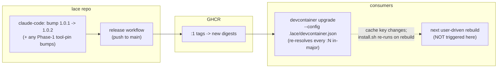

---
first_authored:
  by: "@claude-opus-4-8"
  at: 2026-09-12T07:15:55-07:00
task_list: devcontainer/feature-update-sweep
type: proposal
state: live
status: implementation_accepted
last_reviewed:
  status: accepted
  by: "@claude-opus-4-8"
  at: 2026-09-12T07:52:27-07:00
  round: 3
tags: [devcontainer, feature_versioning, dependency_pinning, dev-infra]
---

# Feature Version Update Sweep

> BLUF: The lace-published devcontainer features are stale in consumer locks: `claude-code`'s locked `:1` digest resolved its `version` default of `latest` at 1.0.1 publish and never re-resolves, because the legacy build-layer cache is keyed on the feature digest.
> This is the deliberately shallow, behavior-neutral unblock: republish `claude-code` so its `:1` tag gets a NEW digest (which re-resolves `latest` to current-at-publish), then relock each consumer's authoritative `.lace/devcontainer-lock.json`.
> One `devcontainer upgrade` re-resolves EVERY feature's floating `:N` major tag to its newest digest within the same major, so the relock also sweeps up other in-major updates (e.g. the portless `1.0.0` -> `1.0.1` durability fix) with no major-version change.
> No mechanism change and no breaking change: the `lace-fundamentals` `:1` -> `:2` migration is explicitly deferred (it drops `sshd` from three of four consumers), and `portless`'s deliberate pin is untouched.
> Hard constraint: republish and relock only; never restart a running container.
> Reuses the single-leg republish plus one-time per-consumer lock-refresh delivery pattern from [`2026-07-18-portless-feature-version-pin-and-ingress-durability.md`](2026-07-18-portless-feature-version-pin-and-ingress-durability.md).

## Summary

Seven features live under `devcontainers/features/src/*` and publish to `ghcr.io/weftwiseink/devcontainer-features/<id>` via `.github/workflows/devcontainer-features-release.yaml` on push to `main`.
Consumers (jif, whelm, clauthier, weftwise) reference them by `:1` major tag in `.lace/devcontainer.json` and pin an exact digest in `.lace/devcontainer-lock.json`, which is the lock `lace up` actually builds from (`--config <consumer>/.lace/devcontainer.json`, `packages/lace/src/lib/up.ts:1679`).

The sweep is two steps:

1. **Republish `claude-code`** with a version bump (1.0.1 -> 1.0.2, no source-logic change) so the `:1` digest advances.
   `install.sh` installs `@anthropic-ai/claude-code@${VERSION}` with the feature's `version` option defaulting to `latest`; the locked `:1` digest froze that resolution at 1.0.1 publish time, and the legacy build-layer cache is keyed on the feature digest, so a rebuild against the same digest never re-runs the npm install.
   A new digest changes the layer cache key, so the next rebuild re-resolves `latest` to current-at-publish.
2. **Relock each consumer's `.lace/` lock** with `devcontainer upgrade --config <consumer>/.lace/devcontainer.json`.
   `devcontainer upgrade` re-resolves every referenced `:N` major tag to its newest digest within the same major, so this single command picks up the new `claude-code` digest and any other in-major updates (the portless `1.0.0` -> `1.0.1` durability fix on whelm and weftwise, any within-`:1` fundamentals update) at once, with no major-version change and therefore no behavioral break.

`portless` is explicitly excluded from republish: its 0.15.3 pin is a deliberate ingress-durability fix, not staleness.
The remaining features (`neovim`, `blesh`, `bash-history`, `sprack`) are current in their locked `:1` line and only get a tool-pin bump if a Phase 1 upstream check finds them meaningfully and safely behind.

> NOTE(opus/feature-update-sweep): The `lace-fundamentals` `:1` -> `:2` migration is deferred to a future SSH-decoupling workstream.
> `:2` removes `sshd` from the feature's default dependency chain, and only jif declares `sshd:1` directly, so migrating clauthier, whelm, or weftwise would silently drop SSH on their next rebuild.
> That is a behavioral change outside this sweep's no-behavior-change contract.

> NOTE(opus/feature-update-sweep): The deeper "why does `latest` freeze at all" fix is [`2026-09-11-claude-code-feature-updatability.md`](2026-09-11-claude-code-feature-updatability.md) (create-time reinstall hook).
> This sweep does not adopt it: it only makes the current locked digests current-at-publish so downstream usage is unblocked now.

## Objective

The next user-driven rebuild of each consumer (jif, whelm, clauthier, weftwise) must pull updated feature versions with a current Claude Code and current tooling, achieved solely by republishing features and refreshing the authoritative `.lace/devcontainer-lock.json`.
No running container is restarted by this work; rebuilds remain the user's action.

## Background

### Feature inventory (source version, tool pin, locked-in-consumers)

| Feature | Source ver | Tool pin in `install.sh` | Locked `:N` in consumers | Action |
|---|---|---|---|---|
| `bash-history` | 1.0.0 | none (no external tool) | `:1` 1.0.0 | leave |
| `blesh` | 1.1.0 | ble.sh `0.4.0-devel3`, fzf `0.74.3` | `:1` 1.1.0 | Phase 1 upstream check, maybe bump |
| `claude-code` | 1.0.1 | `@anthropic-ai/claude-code@${VERSION}`, `version` option default `latest` | `:1` 1.0.1 | bump 1.0.1 -> 1.0.2, republish, relock |
| `lace-fundamentals` | 2.1.0 | none external | `:1` 1.0.2 | deferred (see NOTE: `:2` drops `sshd`) |
| `neovim` | 1.1.0 | nvim `v0.11.6` | `:1` 1.1.0 | Phase 1 upstream check, maybe bump |
| `portless` | 1.0.1 | portless `0.15.3` (deliberate pin) | `:1` 1.0.0-1.0.1 | do NOT republish; relock picks up `1.0.1` in-major |
| `sprack` | 1.0.0 | none external | not consumed by these projects | leave |

Sources: `devcontainers/features/src/*/devcontainer-feature.json` and `install.sh`; consumer `.lace/devcontainer-lock.json` files.

### How consumers depend and how publishing works

- Consumers list features in `.lace/devcontainer.json` by `:1` tag (e.g. `ghcr.io/weftwiseink/devcontainer-features/claude-code:1`), optionally with option overrides (jif already sets `portless.version: "0.15.3"`).
- `lace up` builds with `--config <consumer>/.lace/devcontainer.json` (`packages/lace/src/lib/up.ts:1679`).
  The devcontainer CLI reads and writes the lock adjacent to the `--config` it is given, so the authoritative lock the build consumes is `<consumer>/.lace/devcontainer-lock.json`.
  This lock maps each `:N` tag to an exact `resolved` digest plus `integrity`.
- Relock: `devcontainer upgrade --config <consumer>/.lace/devcontainer.json` re-resolves each referenced `:N` tag to the newest matching digest within that major and rewrites the `.lace/` lock.
  A bare `devcontainer upgrade --workspace-folder <consumer>` instead targets `.devcontainer/`, which for most consumers references a different, smaller feature set (or no `claude-code` at all) and is not the lock lace builds from: it must not be used.
- Publishing: pushing a change under `devcontainers/features/src/**` to `main` triggers `devcontainer-features-release.yaml`, which runs `devcontainers/action@v1` with `publish-features: true` and namespace `weftwiseink/devcontainer-features`.
  The action publishes both the exact `x.y.z` tag and the rolling `:major` tag, so a bump within major 1 advances the `:1` digest consumers resolve.

### `.lace/` is the authoritative lock; `.devcontainer/` locks are legacy cruft

The lock authority is systemic, not a weftwise quirk.
`lace up` builds only from `.lace/devcontainer.json`, so `.lace/devcontainer-lock.json` is the only lock that affects a build.
jif, clauthier, and whelm carry only a `.lace/` lock.
weftwise additionally carries a `.devcontainer/devcontainer-lock.json` that disagrees with its `.lace/` lock (its `.devcontainer/` lock shows portless `1.0.1` while `.lace/` shows `1.0.0`).
That divergence is a symptom of a relock having written the non-authoritative `.devcontainer/` file: the sweep standardizes on `.lace/` and treats any `.devcontainer/*-lock.json` as cruft, optionally cleaned up later, out of scope here.

### Consumer locations (verified)

- jif: `/var/home/mjr/code/weft/jif/main/.lace/devcontainer-lock.json`
- whelm: `/var/home/mjr/code/apps/whelm/.lace/devcontainer-lock.json` (note: NOT under `weft/`)
- clauthier: `/var/home/mjr/code/weft/clauthier/main/.lace/devcontainer-lock.json`
- weftwise: `/var/home/mjr/code/weft/weftwise/main/.lace/devcontainer-lock.json` (authoritative), plus a divergent `.devcontainer/` lock and per-worktree `.devcontainer/` locks that this sweep does not touch.

### Prior art

[`2026-07-18-portless-feature-version-pin-and-ingress-durability.md`](2026-07-18-portless-feature-version-pin-and-ingress-durability.md) established the two-observation delivery model this sweep reuses:
a source edit alone changes nothing at a consumer, because the feature is a digest-locked OCI artifact;
delivery is a feature version bump plus republish, then a one-time consumer lock refresh, after which the new digest is what rebuilds resolve.

> NOTE(opus/feature-update-sweep): That precedent's relock likely wrote a `.devcontainer/` lock (weftwise's `.devcontainer/` shows the post-fix portless `1.0.1` while its authoritative `.lace/` lock still shows `1.0.0`).
> This sweep corrects the target to `.lace/`, which also finally delivers that portless fix to weftwise.

## Proposed Solution

Republish `claude-code` for a fresh digest, then relock each consumer's `.lace/` lock; the relock naturally sweeps up all in-major updates.

Per-feature decision:

- **`claude-code`**: keep the `version` default `latest` in `install.sh`; bump the feature version 1.0.1 -> 1.0.2 (no source-logic change) so the `:1` digest advances.
  On the next rebuild the changed digest is a new build-layer cache key, so `install.sh` re-runs and resolves `latest` to whatever is current AT THAT REBUILD.
  This is current-at-publish/rebuild, then frozen in the image until the next digest change: the reason the create-time-hook workstream exists.
- **`portless`**: do not republish (deliberate 0.15.3 pin), but the `.lace/` relock re-resolves the `:1` tag to the latest 1.x digest, so whelm and weftwise pick up the already-published `1.0.1` durability republish as an expected in-major bump.
- **`neovim`, `blesh`**: Phase 1 checks upstream stable (neovim release tag, ble.sh release, fzf release).
  Bump the tool pin and the feature version only if clearly behind and low-risk; otherwise leave untouched.
- **`lace-fundamentals`, `bash-history`, `sprack`**: no republish.
  Fundamentals is deferred (the `:2` NOTE); the other two are current in-major.

## Important Design Decisions

- **Relock the `.lace/` lock, always with `--config`.** `lace up` builds only from `.lace/devcontainer.json`, so a relock must pass `--config <consumer>/.lace/devcontainer.json` or it rewrites a lock the build never reads (and, for clauthier and whelm, one that does not even reference `claude-code`). This is the load-bearing correction of the sweep.
- **One relock sweeps every in-major update.** Because `devcontainer upgrade` re-resolves all referenced `:N` tags within their major, the sweep does not enumerate per-feature relocks: republishing `claude-code` plus one relock per consumer delivers the new claude-code digest and any other in-major digests (portless `1.0.1`, within-`:1` fundamentals or tooling) together, with no major-version change. This is what keeps the whole sweep behavior-neutral.
- **Version bump only when a fresh digest is required.** Relock is free but useless if the `:1` digest has not advanced. `claude-code` needs a digest change to break the frozen-`latest` cache; features with no source change and no tool-pin change are not republished.
- **Keep `claude-code` on the `latest` default for this sweep.** Pinning an exact npm version would be more reproducible but is a mechanism decision owned by the updatability workstream. The shallow goal is "current now," and a fresh digest plus `latest` re-resolution delivers that with a one-line version bump.
- **Defer `lace-fundamentals` `:2` entirely.** `:2` (source 2.1.0) removes `sshd` from the default dependency chain; only jif declares `sshd:1` directly, so migrating the other three would silently drop SSH on rebuild. Landing that via a lock refresh violates the no-behavior-change contract, so it belongs to the SSH-decoupling workstream, not this sweep.
- **weftwise is swept last.** It is the production canary and the one consumer with a divergent legacy `.devcontainer/` lock; ordering jif -> whelm -> clauthier -> weftwise proves the mechanism on lower-stakes consumers first and gives weftwise an explicit final-confirm gate.
- **Reuse `devcontainer upgrade`, do not invent lace tooling.** No lace-native lock refresher exists; whether one should is a heavier question outside the shallow scope.

## Edge Cases

- **Relock without `--config` refreshes nothing the build uses.** A bare `devcontainer upgrade --workspace-folder <consumer>` reads/writes `.devcontainer/`, which for clauthier and whelm does not reference `claude-code` at all. The sweep would run green and deliver nothing. Always pass `--config <consumer>/.lace/devcontainer.json`.
- **Same-digest relock is a no-op.** For a feature whose `:1` digest has not moved, relock rewrites nothing meaningful; do not report it as a fix. Only `claude-code` (post-bump), portless on whelm/weftwise (`1.0.0` -> `1.0.1` in-major), and any tool-pin-bumped feature actually advance.
- **`latest` re-resolution is at rebuild, not at relock.** The lock refresh only advances the digest; the current Claude Code is fetched when the user rebuilds. A relock alone does not change the installed CLI.
- **A running container keeps its current install until rebuilt.** By constraint we do not rebuild; the sweep only positions the lock so the next voluntary rebuild lands current.
- **weftwise legacy `.devcontainer/` lock.** Leaving it stale is harmless because the build ignores it; do not "fix" it by relocking `.devcontainer/`. Optional cleanup is a separate chore.
- **Upstream tool version disappears.** If a bumped `neovim`/`blesh` pin references a tag that later vanishes, the build fails loudly at install time (desired). Pin only to tags confirmed present in Phase 1.
- **GHCR push precondition.** Republish depends on the release workflow's `GITHUB_TOKEN` retaining `packages: write` to `weftwiseink`. The workflow already declares this and the portless precedent cites a green publish run, so it is a confirmation, not a blocker.

## Test Plan

- **Digest advance:** after republish, `ghcr.io/weftwiseink/devcontainer-features/claude-code:1` resolves to a digest different from the pre-sweep `sha256:95eabba1...` locked value.
- **Lock refresh:** each swept consumer's `.lace/devcontainer-lock.json` shows the new `claude-code` digest, and whelm/weftwise show portless `1.0.1`; no unintended feature digests change and no major-version changes.
- **No-op discipline:** features not bumped and not moved in-major show identical digests pre/post; the sweep report lists them as "unchanged, intentional."
- **Resolution proof (no restart):** a scratch/dry build against a refreshed `.lace/` lock resolves the new feature versions and, for `claude-code`, installs a current CLI, without touching any running container.
- **Regression:** existing lace `up`/lock integration tests pass; consumer `.lace/devcontainer.json` remains valid JSON with unchanged (`:1`) tag references.

## Verification Methodology

The claim to prove is narrow: a relocked consumer WOULD pull the updated versions on its next rebuild, established without restarting any running container.

1. **Digest diff (relock proof).** Capture each consumer's `.lace/` lock entries before and after `devcontainer upgrade --config <consumer>/.lace/devcontainer.json`; paste before/after `resolved` digests into the sweep report. A changed `claude-code` digest (and portless `1.0.1` on whelm/weftwise) is the relock evidence.
2. **Scratch/dry build (cold-cache resolution proof, no live container).** In a throwaway workspace copy referencing the refreshed `.lace/` lock, run a build to the point where features install (a scratch `devcontainer build`, or a disposable `lace up` into a fresh scratch container, never an existing one).
   Confirm `claude-code --version` in that scratch build reports a current release.
   Tear the scratch container down.
   This proves "new digest installs a current CLI" on a COLD cache only.
   The actual user scenario is a WARM-cache rebuild where the changed digest busts the cached `claude-code` layer; the no-restart constraint forbids reproducing it here, so that layer-bust rests by reference on the legacy-builder cache model in [`2026-05-12-experiment-legacy-builder-cache.md`](../reports/2026-05-12-experiment-legacy-builder-cache.md) (via [`2026-09-11-claude-code-feature-updatability.md`](2026-09-11-claude-code-feature-updatability.md)), not on this scratch build. State this explicitly in the report.
3. **Constraint audit.** Record a `podman ps` snapshot before and after the sweep to prove no running consumer container's lifecycle changed.

> NOTE(opus/feature-update-sweep): The scratch `lace up` acquires a distinct project name and container, but `up.ts` coordinates ports via a shared ledger lock (`withLedgerLock`).
> The scratch build must not contend for or mutate the real consumer's port-ledger entry; use a throwaway project name.

Paste all three artifacts per consumer into the implementation devlog.

## Implementation Phases

Sequential. Phase 3 sweeps consumers jif -> whelm -> clauthier -> weftwise, weftwise last and final-confirm gated.

### Phase 1: Inventory, lock authority, and target versions

- Confirm the inventory table against source and every consumer `.lace/` lock (re-verify at implementation time in case of drift).
- Confirm, per consumer, that `lace up` builds from `.lace/devcontainer.json` and that `.lace/devcontainer-lock.json` is the authoritative lock (spot-check the `--config` path in the build invocation); record any `.devcontainer/` locks as legacy.
- For `neovim` and `blesh`, check current upstream stable (neovim release tag, ble.sh release tag, fzf release) and decide bump-or-leave per feature; record the decision and reason.
- Confirm `claude-code` plan is version-bump-only with the `latest` default retained.
- Confirm GHCR publish precondition holds (workflow `packages: write`; prior green run pattern).
- **Acceptance:** a settled per-feature target table (bump / leave), a per-consumer confirmation that `.lace/` is authoritative, and the GHCR precondition confirmed, committed to the devlog.
- **Do NOT:** touch `portless` source; change any `install.sh` logic beyond a tool-pin string where Phase 1 decided a bump; pin `claude-code` to an exact npm version; include any `lace-fundamentals` `:2` migration.

### Phase 2: Bump and republish

- Bump `devcontainer-feature.json` `version` for each feature decided in Phase 1 (`claude-code` 1.0.1 -> 1.0.2 at minimum; any tool-pin-bumped feature likewise).
- Commit and merge to `main` so `devcontainer-features-release.yaml` publishes.
- Confirm the workflow run succeeded and the `:1` digest advanced on GHCR.
- **Acceptance:** new `:1` digests visible on GHCR for exactly the bumped features; the release workflow run is green.
- **Do NOT:** republish `portless`, `lace-fundamentals`, `bash-history`, or `sprack`; republish a feature whose Phase 1 decision was "leave."

### Phase 3: Per-consumer `.lace/` lock refresh (jif -> whelm -> clauthier -> weftwise)

- For each consumer in order, run `devcontainer upgrade --config <consumer>/.lace/devcontainer.json`.
- Capture before/after digests (Verification step 1); expect a new `claude-code` digest everywhere and portless `1.0.0` -> `1.0.1` on whelm and weftwise.
- weftwise is last and requires explicit maintainer final-confirm before its `.lace/` lock is written, given its production status and legacy `.devcontainer/` lock.
- **Acceptance:** each swept consumer's `.lace/` lock carries the new `claude-code` digest (and portless `1.0.1` where applicable), with before/after diffs in the devlog; no major-tag references change; unchanged features confirmed unchanged.
- **Do NOT:** rebuild or restart any running container; relock any `.devcontainer/` lock or worktree; change any `:1` tag reference to `:2`.

### Phase 4: Verification

- Run the scratch/dry build and constraint audit (Verification steps 2 and 3) for at least jif (mechanism proof) and weftwise (production proof), honoring the port-ledger NOTE.
- **Acceptance:** scratch build resolves the new versions and installs a current `claude-code` on a cold cache; the report states the warm-rebuild re-resolution is established by reference to the cache model, not this build; `podman ps` before/after shows no running consumer container was started or restarted; all artifacts pasted into the devlog.
- **Do NOT:** substitute config inspection for an actual scratch build; claim the scratch build proves the warm-cache layer-bust.

## Investigation Requested

- **`lace-fundamentals` deferral hand-off:** confirm the SSH-decoupling workstream owns the eventual `:1` -> `:2` migration and the `sshd` decoupling for clauthier, whelm, and weftwise (only jif declares `sshd:1` directly today).
- **`portless` staleness hand-off:** whelm and weftwise sit on portless feature `1.0.0` (pre the `1.0.1` durability republish). The `.lace/` relock delivers `1.0.1` as an in-major bump here; confirm the portless workstream is content with that pickup rather than a dedicated action.
- **neovim/blesh upstream currency:** current stable versions were not resolved offline; Phase 1 must check them online to decide bump-or-leave.
- **whelm accessibility:** whelm lives at `/var/home/mjr/code/apps/whelm`, outside `weft/`; confirm this is the current canonical checkout to sweep.
