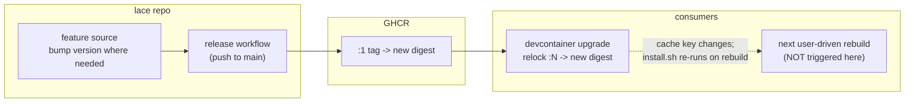

---
first_authored:
  by: "@claude-opus-4-8"
  at: 2026-09-12T07:15:55-07:00
task_list: devcontainer/feature-update-sweep
type: proposal
state: live
status: review_ready
tags: [devcontainer, feature_versioning, dependency_pinning, dev-infra]
---

# Feature Version Update Sweep

> BLUF: The lace-published devcontainer features are stale in consumer locks: `claude-code`'s locked `:1` digest baked `@latest` at its 1.0.1 publish and never re-resolves, and `lace-fundamentals` sits at 2.1.0 in source while every consumer's lock pins `:1` at 1.0.2.
> This is the deliberately shallow unblock: bump the feature version where a fresh digest is needed, republish to GHCR via the existing release workflow, and refresh each consumer's `devcontainer-lock.json` once, so the next user-driven rebuild pulls a current Claude Code and current tooling.
> No mechanism change (no create-time hook, no volume backing, no auto-update): those live in parallel workstreams, and this sweep makes each feature current AT PUBLISH, not self-updating.
> Hard constraint: republish and relock only; never restart a running container.
> Reuses the single-leg republish plus one-time per-consumer lock-refresh delivery pattern established by [`2026-07-18-portless-feature-version-pin-and-ingress-durability.md`](2026-07-18-portless-feature-version-pin-and-ingress-durability.md).

## Summary

Seven features live under `devcontainers/features/src/*` and publish to `ghcr.io/weftwiseink/devcontainer-features/<id>` via `.github/workflows/devcontainer-features-release.yaml` on push to `main`.
Consumers (jif, whelm, clauthier, weftwise) reference them by `:1` major tag and pin an exact digest in `devcontainer-lock.json`.
Two staleness classes block "the basics":

1. `claude-code` bakes `@anthropic-ai/claude-code@latest` in `install.sh`.
   The locked `:1` digest froze `@latest` at 1.0.1 publish time, and the legacy build layer cache is keyed on the feature digest, so a rebuild against the same digest never re-runs the npm install.
   Getting current requires a NEW digest: bump the feature version, republish, relock.
2. `lace-fundamentals` is 2.1.0 in source but consumers lock `:1` at 1.0.2.
   The `:1` tag tops out at the last 1.x digest, so a plain relock cannot reach 2.x: this needs a consumer tag migration `:1` -> `:2`, which carries the SSH-decoupling behavioral change and is therefore gated (see Design Decisions and Investigation Requested).

`portless` is explicitly excluded: its 0.15.3 pin is a deliberate ingress-durability fix, not staleness.
The remaining features (`neovim`, `blesh`, `bash-history`, `sprack`) are current in their locked `:1` line and only get a tool-pin bump if a Phase 1 upstream check finds them meaningfully and safely behind.

> NOTE(opus/feature-update-sweep): The deeper "why does `@latest` freeze at all" fix is [`2026-09-11-claude-code-feature-updatability.md`](2026-09-11-claude-code-feature-updatability.md) (create-time reinstall hook).
> This sweep does not adopt it: it only makes the current locked digests current-at-publish so downstream usage is unblocked now.

## Objective

The next user-driven rebuild of each consumer (jif, whelm, clauthier, weftwise) must pull updated feature versions with a current Claude Code and current tooling, achieved solely by republishing features and refreshing `devcontainer-lock.json`.
No running container is restarted by this work; rebuilds remain the user's action.

## Background

### Feature inventory (source version, tool pin, locked-in-consumers)

| Feature | Source ver | Tool pin in `install.sh` | Locked `:N` in consumers | Stale? |
|---|---|---|---|---|
| `bash-history` | 1.0.0 | none (no external tool) | `:1` 1.0.0 | No |
| `blesh` | 1.1.0 | ble.sh `0.4.0-devel3`, fzf `0.74.3` | `:1` 1.1.0 | Maybe (Phase 1 check) |
| `claude-code` | 1.0.1 | `@anthropic-ai/claude-code@latest` | `:1` 1.0.1 | Yes (frozen `@latest`) |
| `lace-fundamentals` | 2.1.0 | none external | `:1` 1.0.2 | Yes (major-tag gap) |
| `neovim` | 1.1.0 | nvim `v0.11.6` | `:1` 1.1.0 | Maybe (Phase 1 check) |
| `portless` | 1.0.1 | portless `0.15.3` (deliberate pin) | `:1` 1.0.0-1.0.1 | Excluded (do NOT touch) |
| `sprack` | 1.0.0 | none external | not consumed by these projects | No |

Sources: `devcontainers/features/src/*/devcontainer-feature.json` and `install.sh`; consumer `devcontainer-lock.json` files enumerated below.

### How consumers depend and how publishing works

- Consumers list features in `.lace/devcontainer.json` by `:1` tag (e.g. `ghcr.io/weftwiseink/devcontainer-features/claude-code:1`), optionally with option overrides (jif already sets `portless.version: "0.15.3"`).
- `devcontainer-lock.json` maps each `:N` tag to an exact `resolved` digest plus `integrity`.
  `devcontainer upgrade --workspace-folder <consumer>` re-resolves each `:N` tag to the newest matching digest and rewrites the lock (the mechanism used in the portless pin's Phase 1b, "lock refreshed via `devcontainer upgrade`").
- Publishing: pushing a change under `devcontainers/features/src/**` to `main` triggers `devcontainer-features-release.yaml`, which runs `devcontainers/action@v1` with `publish-features: true` and namespace `weftwiseink/devcontainer-features`.
  The action publishes both the exact `x.y.z` tag and the rolling `:major` tag, so a version bump within major 1 advances the `:1` digest that consumers resolve.

### Consumer locations (verified)

- jif: `/var/home/mjr/code/weft/jif/main/.lace/devcontainer-lock.json`
- whelm: `/var/home/mjr/code/apps/whelm/.lace/devcontainer-lock.json` (note: NOT under `weft/`)
- clauthier: `/var/home/mjr/code/weft/clauthier/main/.lace/devcontainer-lock.json`
- weftwise: `/var/home/mjr/code/weft/weftwise/main` carries TWO lock files (`.lace/devcontainer-lock.json` and `.devcontainer/devcontainer-lock.json`) that disagree (portless 1.0.0 vs 1.0.1; the `.devcontainer` one lists only a subset), plus multiple worktrees each with their own `.devcontainer/devcontainer-lock.json`.

### Prior art

[`2026-07-18-portless-feature-version-pin-and-ingress-durability.md`](2026-07-18-portless-feature-version-pin-and-ingress-durability.md) established the two-observation delivery model this sweep reuses:
a source edit alone changes nothing at a consumer, because the feature is a digest-locked OCI artifact;
delivery is a feature version bump plus republish, then a one-time consumer lock refresh, after which the new digest is what rebuilds resolve.

## Proposed Solution

A per-feature version bump only where a fresh digest is required, one republish through the existing workflow, and a one-time lock refresh per consumer.

Per-feature decision:

- **`claude-code`**: keep `@latest` in `install.sh`; bump feature version 1.0.1 -> 1.0.2 (no source-logic change) so the `:1` digest advances.
  On the next rebuild the changed digest is a new build-layer cache key, so `install.sh` re-runs `npm install -g @anthropic-ai/claude-code@latest` and resolves whatever is current AT THAT REBUILD.
  This is current-at-publish/rebuild, then frozen in the image until the next digest change: the reason the create-time-hook workstream exists.
- **`lace-fundamentals`**: 2.x is already published under `:2`; a `:1`-pinned consumer cannot reach it by relock.
  Migrate each consumer's feature reference `:1` -> `:2` and relock, contingent on the SSH-decoupling gate (Design Decisions).
- **`neovim`, `blesh`**: Phase 1 checks upstream stable (neovim release tag, ble.sh release, fzf release).
  Bump the tool pin and the feature version only if clearly behind and low-risk; otherwise leave untouched (a same-digest relock is a no-op and adds no value).
- **`bash-history`, `sprack`, `portless`**: no change.
  `portless` is explicitly protected.

## Important Design Decisions

- **Version bump only when a fresh digest is required.** Relock is free but useless if the `:1` digest has not advanced. `claude-code` needs a digest change to break the frozen-`@latest` cache; features with no source change and no tool-pin change are skipped rather than churned.
- **Keep `claude-code` on `@latest` for this sweep.** Pinning an exact npm version would be more reproducible but is a mechanism decision owned by the updatability workstream. The shallow goal is "current now," and a fresh digest plus `@latest` re-resolution delivers that with a one-line version bump.
- **`lace-fundamentals` `:1` -> `:2` is the one non-mechanical change, and it is gated.** The 2.0.0 bump was "remove SSH from the default dependency chain"; 2.1.0 added the `$USER` profile.d guard.
  Migrating a consumer to `:2` therefore changes install behavior (SSH decoupling), so it proceeds only after confirming the consumer is already SSH-decoupled at the config level, matching 2.x intent.
  If that is not confirmed for a given consumer, its fundamentals migration is deferred to the decoupling workstream and this sweep leaves it at `:1`.
- **weftwise is swept last and final-confirm gated.** It is the production canary with dual, disagreeing lock files; ordering jif -> whelm -> clauthier -> weftwise proves the mechanism on lower-stakes consumers first.
- **Reuse `devcontainer upgrade`, do not invent lace tooling.** No lace-native lock refresher exists; the portless pin already relied on `devcontainer upgrade` and it is the tool of record.

## Edge Cases

- **Same-digest relock is a no-op.** Running `devcontainer upgrade` against a feature whose `:1` digest has not moved rewrites nothing meaningful; do not report it as a fix. Only `claude-code` (post-bump) and any tool-pin-bumped feature actually advance.
- **`lace-fundamentals` `:2` is a major migration, not a relock.** A plain `devcontainer upgrade` keeps `:1` and will NOT surface 2.x. The consumer's `devcontainer.json` reference must change to `:2` first. Skipping this and expecting relock to deliver 2.x is the trap.
- **weftwise dual lock files.** Both `.lace/devcontainer-lock.json` and `.devcontainer/devcontainer-lock.json` exist and disagree. Determine which one the consumer's build actually consumes before refreshing, and record the divergence; do not blindly rewrite both.
- **weftwise worktrees.** Multiple worktrees each carry a `.devcontainer/devcontainer-lock.json`. Scope the sweep to `main` unless the maintainer asks otherwise; note untouched worktrees will resolve old digests on their next rebuild.
- **`@latest` re-resolution is at rebuild, not at relock.** The lock refresh only advances the digest; the current Claude Code is fetched when the user rebuilds. State this precisely so no one expects a relock alone to change the installed CLI.
- **A running container keeps its current install until rebuilt.** By constraint we do not rebuild; the sweep only positions the lock so the next voluntary rebuild lands current.
- **Upstream tool version disappears.** If a bumped `neovim`/`blesh` pin references a tag that later vanishes, the build fails loudly at install time (desired). Pin only to tags confirmed present in Phase 1.
- **GHCR push auth.** Republish depends on the workflow's `GITHUB_TOKEN` retaining `packages: write` to `weftwiseink`. If publishing is org-gated, this is a blocker surfaced in Investigation Requested.

## Test Plan

- **Digest advance:** after republish, `ghcr.io/weftwiseink/devcontainer-features/claude-code:1` resolves to a digest different from the pre-sweep `sha256:95eabba1...` locked value.
- **Lock refresh:** each swept consumer's `devcontainer-lock.json` shows the new `claude-code` digest (and `lace-fundamentals` `:2` digest where migrated); no unintended feature digests change.
- **No-op discipline:** features not bumped show identical digests pre/post; the sweep report lists them as "unchanged, intentional."
- **Resolution proof (no restart):** a scratch/dry build (below) against a refreshed lock resolves the new feature versions and, for `claude-code`, installs a current CLI, without touching any running container.
- **Regression:** existing lace `up`/lock integration tests pass; consumer devcontainer.json remains valid JSON with correct tag references.

## Verification Methodology

The claim to prove is narrow: a relocked consumer WOULD pull the updated versions on its next rebuild, established without restarting any running container.

1. **Digest diff (relock proof).** Capture each consumer's relevant lock entries before and after `devcontainer upgrade`; paste the before/after `resolved` digests into the sweep report. A changed `claude-code` digest and (where migrated) a `:2` `lace-fundamentals` digest is the relock evidence.
2. **Scratch/dry build (resolution proof, no live container).** In a throwaway workspace copy that references the refreshed lock, run a build to the point where features install (a scratch `devcontainer build`, or a disposable `lace up` into a fresh scratch container, never an existing one).
   Confirm `claude-code --version` in that scratch build reports a current release and `lace-fundamentals` installed the 2.x steps (e.g. `/etc/profile.d/05-lace-user-env.sh` present).
   Tear the scratch container down; assert via `podman ps`/`lace` that no pre-existing consumer container was started or restarted.
3. **Constraint audit.** Record a `podman ps` snapshot before and after the sweep to prove no running consumer container's lifecycle changed.

Paste all three artifacts per consumer into the implementation devlog.

## Implementation Phases

Sequential. Phase 3 sweeps consumers jif -> whelm -> clauthier -> weftwise, weftwise last and final-confirm gated.

### Phase 1: Inventory and decide target versions

- Confirm the inventory table against source and every consumer lock (already captured; re-verify at implementation time in case of drift).
- For `neovim` and `blesh`, check current upstream stable (neovim release tag, ble.sh release tag, fzf release) and decide bump-or-leave per feature; record the decision and reason.
- For `claude-code`, confirm the plan is version-bump-only with `@latest` retained.
- For `lace-fundamentals`, decide per consumer whether the `:1` -> `:2` migration is in scope, based on confirmed SSH-decoupling state (see Investigation Requested).
- **Acceptance:** a settled per-feature target table (bump / leave / migrate) with rationale, committed to the devlog.
- **Do NOT:** touch `portless`; change any `install.sh` logic beyond a tool-pin string where Phase 1 decided a bump; pin `claude-code` to an exact npm version.

### Phase 2: Bump and republish

- Bump `devcontainer-feature.json` `version` for each feature decided in Phase 1 (`claude-code` 1.0.1 -> 1.0.2 at minimum; any tool-pin-bumped feature likewise).
- Commit under `docs(...)`/`feat(...)` touching `devcontainers/features/src/**` and merge to `main` so `devcontainer-features-release.yaml` publishes.
- Confirm the workflow run succeeded and the `:1` (and, for fundamentals, `:2`) digests advanced on GHCR.
- **Acceptance:** new digests visible on GHCR for exactly the bumped features; the release workflow run is green.
- **Do NOT:** bump or republish `portless`, `bash-history`, or `sprack`; republish a feature whose Phase 1 decision was "leave."

### Phase 3: Per-consumer lock refresh sweep (jif -> whelm -> clauthier -> weftwise)

- For each consumer in order, run `devcontainer upgrade` against the lock the build actually consumes; for `lace-fundamentals` migrations, first change the `devcontainer.json` feature reference `:1` -> `:2`, then relock.
- Capture before/after digests (Verification step 1).
- weftwise is last and requires explicit maintainer final-confirm before its lock is written, given its dual lock files and production status; resolve which lock file is authoritative first.
- **Acceptance:** each swept consumer's lock carries the new `claude-code` digest (and `:2` fundamentals where migrated), with before/after diffs in the devlog; unchanged features confirmed unchanged.
- **Do NOT:** rebuild or restart any running container; touch weftwise worktrees other than `main` unless asked; rewrite both weftwise lock files without first determining which is authoritative.

### Phase 4: Verification

- Run the scratch/dry build and constraint audit (Verification steps 2 and 3) for at least jif (mechanism proof) and weftwise (production proof).
- **Acceptance:** scratch build resolves the new versions and installs a current `claude-code`; `podman ps` before/after shows no running consumer container was started or restarted; all artifacts pasted into the devlog.
- **Do NOT:** substitute config inspection for an actual scratch build; the whole point is proving the resolved install, not the lock text alone.

## Investigation Requested

- **GHCR push auth:** confirm `devcontainer-features-release.yaml`'s `GITHUB_TOKEN` still has `packages: write` to the `weftwiseink` org and that publishing is not additionally gated. Republish (Phase 2) blocks on this.
- **`lace-fundamentals` `:2` gate:** for each consumer, confirm whether SSH decoupling is complete at the config level (matching 2.x's removal of SSH from the default dependency chain). This decides whether the sweep migrates `:1` -> `:2` now or defers fundamentals to the decoupling workstream.
- **`lace-fundamentals` 2.1.0 publish state:** confirm 2.x is actually published to GHCR under `:2` (assumed, since 2.1.0 is committed to `main` and the workflow triggers on feature changes). If it was never published, Phase 2 must publish it before Phase 3 can migrate any consumer.
- **weftwise authoritative lock:** determine whether the build consumes `.lace/devcontainer-lock.json` or `.devcontainer/devcontainer-lock.json` (they disagree), so Phase 3 refreshes the right one.
- **whelm accessibility:** whelm lives at `/var/home/mjr/code/apps/whelm`, outside `weft/`; confirm this is the current canonical checkout to sweep.
- **neovim/blesh upstream currency:** current stable versions were not resolved offline; Phase 1 must check them online to decide bump-or-leave.
