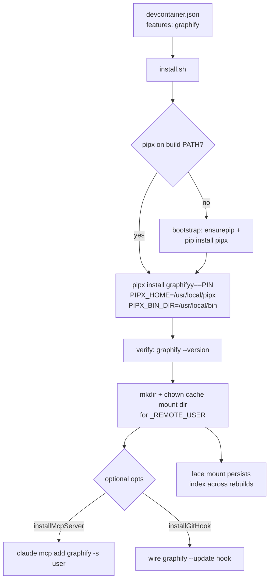

---
first_authored:
  by: "@claude-opus-4-8"
  at: 2026-09-15T15:00:00-08:00
task_list: code-graph/graphify-lace-feature
type: proposal
state: live
status: implementation_accepted
last_reviewed:
  status: accepted
  by: "@claude-opus-4-8"
  at: 2026-09-15T18:30:00-08:00
  round: 2
tags: [devcontainer_features, code_graph, tooling, architecture, future_work]
---

# graphify: a lace devcontainer feature for in-container graph indexing

> BLUF(opus/code-graph/graphify-lace-feature): Add a `graphify` devcontainer feature at `devcontainers/features/src/graphify/` that installs the `graphifyy` CLI (exact-pinned, isolated via system-wide pipx) and declares a lace mount so the deterministic tree-sitter code graph persists across rebuilds.
> This is the concrete lace-side answer to the driving RFP's "what is lace?" open question: lace is this repo's devcontainer-feature framework, and graphify is the in-container provisioning surface for a graph-backed review/dev loop.
> The feature is justified by precision-on-collisions, traversal, and reuse of the graphify product substrate, NOT by a proven token win: the grep floor already ties graphify on recall (~97.4%), so the marginal cost benefit is unmeasured, and the graph is blind to weftwise's CRDT coupling. A missing or stale index MUST degrade to the grep-scoping floor; this feature provisions a scoping aid, never a related-code guarantee.

## Summary

The [code-graph review-plugin RFP](#links) lists "what is lace?" as its first, blocking open question.
This proposal answers it concretely on the lace side: lace is the devcontainer-feature framework under `devcontainers/features/src/**`, auto-published to GHCR by CI, and its review/dev-loop integration surface for a graph substrate is a new `graphify` feature that provisions the index in-container.

The feature installs the `graphifyy` PyPI package (the bare `graphify` name is squatted) at an exact pin, isolated from any project venv, verifies the CLI is on the remote user's PATH, and declares a `customizations.lace.mounts` entry so graphify's incremental index state survives rebuilds - analogous to the neovim feature's plugin-state mount.
A default-off `installMcpServer` boolean registers the MCP server for the in-container agent via `claude mcp add`, and an optional git hook wires `graphify --update`.
The `/graphify` skill is out of scope: it is owned by the clauthier `cdocs` plugin layer that the driving RFP names as the review-loop owner, and the README points there.

The honest framing, carried from the RFP and the landscape survey, is load-bearing and appears as first-class WARN callouts below: pre-1.0 API churn, the CRDT blind spot, and the unmeasured cost win.
This feature makes the graph substrate cheaply available and reproducible in a container; it does not settle whether the graph earns its cost over grep. That remains the unrun A/B the RFP flags.

## Objective

Provide a reproducible, pinned, isolated in-container installation of the graphify code-graph engine as a lace devcontainer feature, so the review/dev loop can query a pre-indexed understanding graph without each consumer reinventing provisioning.

Concretely:
- Install `graphifyy` at a pinned version, isolated from project Python environments, on the remote user's PATH.
- Persist the incremental index/cache across container rebuilds via a lace mount.
- Expose the graphify MCP server to the in-container agent as an opt-in option (the `/graphify` skill is owned by the clauthier plugin layer, not this feature).
- Frame the feature so the consuming loop treats the index as a scoping aid with a defined grep fallback, never a guarantee.

## Background

Three sibling documents in the `weftwise` repo form the decision trail (they live in that repo, referenced here by path; see [Links](#links)):

- The [code-graph review-plugin RFP](#links) is the driving document.
  Its open questions this feature addresses: index provisioning in the loop, engine choice under license, and the graceful-degradation contract to the grep floor.
  Its "what is lace?" question is the one this proposal answers directly.
- The [code-wiki landscape survey](#links) ranks graphify #1: permissive dual license (Apache-2.0/MIT), zero-LLM deterministic tree-sitter AST indexing across 37 languages for the code path, an MCP server, and an existing empirical spike against weftwise's own tree.
- The [grep-scoping RFP](#links) is the zero-cost floor: `git grep` for importers at ~97.4% recall, needing no toolchain or index. This feature must degrade to that floor when the index is absent or stale.

### graphify facts (treated as given from the survey, not re-researched)

- PyPI package: `graphifyy` (the `graphify` name is squatted). Python CLI: `graphify query`, `graphify path`, `graphify explain`, `graphify --update`.
- Local, deterministic, tree-sitter AST indexing across 37 languages, zero API calls for the code path (an LLM is invoked only for non-code modalities like PDFs and images).
- Emits `graph.json` (the queryable artifact), `graph.html`, and `GRAPH_REPORT.md`.
- Ships an MCP server (`query_graph`, `get_node`, `shortest_path`) with an HTTP transport option, and a `/graphify` Claude Code skill.
- Incremental via `--update`, plus git commit/branch-switch hooks for auto-refresh.
- Pre-1.0 (`v0.9.61` as of 2026-09-12), 229 PyPI releases in ~5.5 months.

### lace feature framework (the integration surface)

The framework layout, verified against the existing features:

- Each feature is `devcontainers/features/src/<id>/{devcontainer-feature.json, install.sh, README.md}`.
- Persistent state is declared via `customizations.lace.mounts.<label>` with `target`, `recommendedSource`, `description`, and `sourceMustBe` (see `claude-code` and `neovim` manifests).
- `.github/workflows/devcontainer-features-release.yaml` auto-publishes `devcontainers/features/src/**` to GHCR namespace `weftwiseink/devcontainer-features` on push to `main`, and opens a docs PR.
- Tests live at `devcontainers/features/test/<id>/` as `scenarios.json` + `test.sh`, run by the devcontainer features test harness (`portless` is the reference).

Precedent this feature mirrors:
- `claude-code` installs a CLI globally via npm, `dependsOn` the node feature, and declares config mounts.
- `neovim` installs a GitHub-release binary into `/usr/local`, `installsAfter` rust for a cargo-built tree-sitter CLI, and declares a plugin-state mount.
- `blesh` pins a release tarball with a source-build fallback and handles root vs non-root `_REMOTE_USER` explicitly.

## Proposed Solution

A new `graphify` feature that installs `graphifyy` system-wide via pipx into `/usr/local/bin`, so the CLI is on PATH for every user without per-user PATH fragility, and declares a lace mount for graphify's incremental cache.



### Feature manifest (`devcontainer-feature.json`)

```jsonc
{
  "id": "graphify",
  "version": "1.0.0",
  "name": "graphify (code graph)",
  "description": "Installs the graphify (graphifyy) code-graph CLI via isolated pipx. Declares a lace mount for persistent index state. Provisions a scoping aid, not a related-code guarantee: consumers must fall back to grep when the index is stale or absent.",
  "documentationURL": "https://github.com/weftwiseink/lace/tree/main/devcontainers/features/src/graphify",
  "options": {
    "version": {
      "type": "string",
      "default": "0.9.61",
      "description": "graphifyy PyPI version to install (exact pin; pre-1.0, so no range). Passed to pipx as graphifyy==<version>."
    },
    "installMcpServer": {
      "type": "boolean",
      "default": false,
      "description": "Register the graphify MCP server (query_graph, get_node, shortest_path) into the remote user's Claude config via 'claude mcp add'. Requires the claude-code feature; no-op with a warning if absent."
    },
    "installGitHook": {
      "type": "boolean",
      "default": false,
      "description": "Install a post-commit git hook running 'graphify --update' for index freshness. Off by default: it adds latency to every commit."
    }
  },
  "dependsOn": {
    "ghcr.io/devcontainers/features/python:1": {}
  },
  "installsAfter": [
    "ghcr.io/weftwiseink/devcontainer-features/claude-code"
  ],
  "customizations": {
    "lace": {
      "mounts": {
        "index": {
          "target": "/home/${_REMOTE_USER}/.cache/graphify",
          "recommendedSource": "~/.cache/graphify",
          "sourceMustBe": "directory",
          "description": "graphify incremental index cache (persists the AST graph across container rebuilds so --update stays incremental)"
        }
      }
    }
  }
}
```

Rationale for the key choices, expanded in [Important Design Decisions](#important-design-decisions):
- `dependsOn` the standard `python` feature: it provides Python 3 (and, on most images, `pip`/`ensurepip`), the substrate the install script bootstraps pipx onto if pipx is not already on the build-time PATH.
- `installsAfter` `claude-code` (not `dependsOn`): the `installMcpServer` option needs Claude config to exist when enabled, but the core install must not hard-require claude-code.
- The mount targets graphify's cache dir, not the repo, so the graph artifact does not pollute or risk being committed to the working tree.

### Install script (`install.sh`) shape

Follows the blesh root/non-root pattern and the claude-code/neovim verify-at-end pattern.

```sh
#!/bin/sh
set -eu

VERSION="${VERSION:-0.9.61}"
INSTALL_MCP="${INSTALLMCPSERVER:-false}"
INSTALL_HOOK="${INSTALLGITHOOK:-false}"

_REMOTE_USER="${_REMOTE_USER:-root}"
if [ "$_REMOTE_USER" = "root" ]; then USER_HOME="/root"; else USER_HOME="/home/${_REMOTE_USER}"; fi

# System-wide install so the CLI is on PATH for every user (no per-user PATH fragility).
export PIPX_HOME=/usr/local/pipx
export PIPX_BIN_DIR=/usr/local/bin

# Resolve a pipx invocation. `dependsOn python` provides Python 3, but the
# python feature installs pipx into an isolated /usr/local/py-utils venv that is
# NOT guaranteed on this script's build-time PATH, and `python3 -m pipx` fails
# for the same reason (pipx is not in the base interpreter's site-packages).
# So probe for pipx, and self-provision it onto python3 if absent, idempotently.
if command -v pipx >/dev/null 2>&1; then
    PIPX="pipx"
elif python3 -m pipx --version >/dev/null 2>&1; then
    PIPX="python3 -m pipx"
else
    echo "pipx not found on build PATH; bootstrapping it via pip."
    command -v python3 >/dev/null 2>&1 || {
        echo "Error: python3 is required. Add ghcr.io/devcontainers/features/python." >&2
        exit 1
    }
    python3 -m ensurepip --upgrade >/dev/null 2>&1 || true
    # --break-system-packages guards the PEP 668 edge: the intended `dependsOn
    # python` path is a source-built /usr/local CPython with no EXTERNALLY-MANAGED
    # marker (so the flag is a harmless no-op there), but a distro-managed python3
    # (Debian/Ubuntu ship the marker) would otherwise refuse the bootstrap.
    python3 -m pip install --break-system-packages --upgrade pip pipx >/dev/null 2>&1 \
        || python3 -m pip install --break-system-packages --user pipx
    PIPX="python3 -m pipx"
fi

echo "Installing graphifyy==${VERSION} via pipx (system-wide)..."
$PIPX install "graphifyy==${VERSION}"

# Verify the CLI resolves on PATH. Fail loudly if it does not.
command -v graphify >/dev/null 2>&1 || { echo "Error: graphify not on PATH after install." >&2; exit 1; }
graphify --version

# Create the cache mount dir so the lace mount target exists and is owned by the remote user.
CACHE_DIR="${USER_HOME}/.cache/graphify"
mkdir -p "$CACHE_DIR"
if [ "$_REMOTE_USER" != "root" ]; then
    chown -R "${_REMOTE_USER}:${_REMOTE_USER}" "${USER_HOME}/.cache" 2>/dev/null || true
fi

# Optional wiring (each guarded, non-fatal, default off) documented in later phases.
```

> NOTE(opus/code-graph/graphify-lace-feature): The exact verification command (`graphify --version` vs `graphify --help`) and the cache directory path (`~/.cache/graphify` vs `~/.graphify`) are assumptions from the survey, not confirmed against an installed CLI.
> Phase 1 verification MUST confirm both against the pinned build and correct the manifest/script if they differ. See [Open Questions](#open-questions).

## Important Design Decisions

**Isolation via system-wide pipx, not a project venv or bare pip.**
`graphifyy` is a CLI, not a library the project imports, so it must not land in a project venv or pollute the base Python.
pipx gives each CLI its own venv; setting `PIPX_HOME=/usr/local/pipx` and `PIPX_BIN_DIR=/usr/local/bin` puts the shim on the global PATH for all users, matching the npm-global (`claude-code`) and `/usr/local` (`neovim`) precedent.
This avoids the per-user PATH fragility of installing into one user's `~/.local/bin`, which is the failure mode called out in the [Verification Methodology](#verification-methodology).
`uv tool install` is a viable alternative with the same isolation; pipx is chosen because it is the devcontainer python feature's own utility installer, so the base image already carries the machinery to provision it.

> WARN(opus/code-graph/graphify-lace-feature): pipx is NOT guaranteed on the build-time PATH just because `dependsOn python` is declared.
> node provides `npm` on the build PATH for a later feature (which is why claude-code can rely on `command -v npm`), but the python feature installs pipx into an isolated `/usr/local/py-utils` venv whose bin dir is not guaranteed on a subsequent feature's `install.sh` PATH, and `python3 -m pipx` fails the same way (pipx is not in the base interpreter's site-packages).
> This is the one assumption whose failure hard-fails the core install, so `install.sh` self-provisions pipx via `ensurepip`/`pip install pipx` when neither probe resolves, rather than betting on how the python feature exposes it.
> The node→npm and python→pipx cases are therefore NOT equivalent, and the design does not treat them as such.
> The bootstrap's `pip install` carries `--break-system-packages` defensively for the PEP 668 edge: the intended `dependsOn python` target is a source-built `/usr/local` CPython with no `EXTERNALLY-MANAGED` marker (where the flag is a no-op), but a distro-managed python3 would otherwise refuse the install. The only genuinely unrecoverable case is `python3` absent.

**Exact version pin, no range.**
graphify is pre-1.0 with 229 releases in ~5.5 months. A range would silently pull breaking CLI/MCP changes on every rebuild. The `version` option defaults to an exact pin and is passed as `graphifyy==<version>`.

> WARN(opus/code-graph/graphify-lace-feature): Pre-1.0 churn is a first-class maintenance risk, not a footnote.
> 229 PyPI releases in ~5.5 months against a still-pre-1.0 API means any integration built on graphify's CLI or MCP surface carries real churn cost: option names, output shape, and MCP tool signatures can all move between pins.
> Exact-pinning contains the blast radius per-container but transfers the cost to the maintainer, who must periodically bump and re-verify. Budget for it.

**Cache mount, not repo artifact.**
graphify writes `graph.json`, `graph.html`, and `GRAPH_REPORT.md` into the working directory by default.
The working tree is already the host-bind-mounted repo, so those artifacts would land in (and risk being committed to) the repo.
The lace mount instead persists graphify's incremental *cache* dir, keeping `--update` incremental across rebuilds without polluting the tree.
The repo-level artifacts are a separate concern: consumers should gitignore them or redirect them if graphify supports it (unconfirmed, see [Open Questions](#open-questions)).

**MCP server is opt-in and default off; the `/graphify` skill is out of scope and NOT provided.**
A code-index feature registering entries in Claude Code's config surface couples an infrastructure feature to an agent-config concern and introduces a cross-feature ordering dependency (`installsAfter` claude-code).
The critical read: the MCP-server registration has a real in-loop use (the in-container reviewer/dev agent querying the graph headlessly), so a default-off boolean is defensible.
The `/graphify` *skill* is not: skills are a Claude Code plugin/marketplace concern, and the driving RFP names the clauthier `cdocs` plugin's `reviewer` surface as the review-loop owner.
A devcontainer feature installing an agent skill would couple infrastructure provisioning to agent-plugin distribution with no clean ownership boundary, so the skill is deferred entirely to the clauthier plugin layer and this feature ships no skill option.
The README instead points consumers to the clauthier plugin as the skill's install path.

**MCP registration uses `claude mcp add`, not hand-edited config.**
When `installMcpServer` is enabled, registration is performed via `claude mcp add graphify -s user -- <graphify mcp command>`, which is idempotent and version-tolerant.
Hand-editing `~/.claude.json` or a `.mcp.json` schema is brittle across exactly the claude-code version churn the proposal warns about one layer up, so the mechanism is pinned to the CLI.

**Git-hook refresh is opt-in, default off.**
`graphify --update` on every commit keeps the index fresh but adds latency and surprise to a hot path.
The tradeoff (freshness vs per-commit cost) has no universally right answer, so it is an option defaulting off; consumers who want freshness opt in explicitly.

**Graceful degradation is a documented contract, not code in this feature.**
The feature provisions the engine and persists the cache. It does not, and cannot, guarantee the index is fresh or present at query time.
The contract, stated in the README and the manifest description, is that the consuming loop treats graphify as a scoping *aid* and falls back to the grep floor when the index is stale or missing.

> WARN(opus/code-graph/graphify-lace-feature): The graph is blind to CRDT coupling.
> graphify is reference/import-granularity, not dataflow, and is blind to weftwise's ~125 CRDT `.observe`/`.subscribe` coupling sites, which are 86.8% of that codebase's real coupling (mutator and reactor share a runtime object, not a resolvable symbol).
> A graph-scoped review is NOT a coupling guarantee. This feature must never be presented, in docs or in a consumer prompt, as a complete related-code discovery mechanism.

> WARN(opus/code-graph/graphify-lace-feature): The cost win over grep is unmeasured.
> The grep floor already ties graphify on recall (~97.4%). graphify's marginal advantage is precision-on-collisions plus multi-hop traversal, not recall, and its token delta over grep at equal recall has never been measured in a real loop.
> This feature is justified by precision, traversal, and reuse of the graphify substrate, NOT by a proven cost reduction. Do not present it as a cost optimization until the RFP's A/B is run.

## Edge Cases / Challenging Scenarios

- **python3 absent** (no python feature, and no base-image python3): this is the sole unrecoverable case, so install.sh errors loudly with a pointer to add the python feature. pipx-absent is NOT this case: it self-heals (next bullet).
- **Root vs non-root remote user**: cache dir and chown branch on `_REMOTE_USER`, following the blesh pattern. System-wide binary needs no per-user chown.
  > NOTE(opus/code-graph/graphify-lace-feature): The mount `target` hardcodes `/home/${_REMOTE_USER}/.cache/graphify`, which resolves to `/home/root/...` for a root remote user, while `install.sh` branches `USER_HOME` to `/root`. This mirrors a pre-existing divergence in the claude-code manifest (same `/home/${_REMOTE_USER}` target, `/root` script branch) and is harmless in the normal non-root case; a root remote user is the edge where the mount target and the created dir diverge.
- **pipx not on build-time PATH**: the install script self-provisions pipx via `ensurepip`/`pip install pipx` rather than failing, since `dependsOn python` does not guarantee pipx on a later feature's PATH (see the [Important Design Decisions](#important-design-decisions) WARN).
- **claude-code absent but `installMcpServer=true`**: no-op with a warning, never a hard failure. The core install stands alone.
- **Stale index at query time**: out of this feature's control by design. The consuming loop's contract is to fall back to grep. Documented, not coded here.
- **Repo-artifact pollution**: `graph.json` etc. default to the working tree. The README must instruct consumers to gitignore them; this feature does not write them.
- **Architecture / platform**: pipx installs a Python package, so there is no arch-specific binary fetch (unlike neovim/blesh). Any wheel/sdist concerns are graphify's, surfaced by a failed `pipx install` which fails the build.
- **Version pin yanked from PyPI**: a yanked pin fails `pipx install` and fails the build loudly, which is the correct behavior (no silent drift).

## Test Plan

Use the devcontainer features test harness (`devcontainer features test`), following the `portless` reference (`scenarios.json` + `test.sh`).

Scenarios (`devcontainers/features/test/graphify/scenarios.json`):
- `default_install`: python base image, `graphify` with defaults.
- `custom_version`: an explicit non-default `version` pin.
- `non_root_user`: an image with a non-root remote user, to catch PATH/ownership regressions.
- `mcp_without_claude`: `installMcpServer=true` with no claude-code feature, asserting a clean no-op (warning, exit 0).

Checks (`test.sh`, run as the remote user where the harness allows):
- `command -v graphify` resolves.
- `graphify --version` (or the confirmed equivalent) reports the pinned version.
- The graphify binary shim is under `/usr/local/bin` (system-wide, not a single user's `~/.local/bin`).
- The cache mount dir `~/.cache/graphify` exists and is owned by the remote user.
- For `mcp_without_claude`: the install exited 0 and did not write a broken Claude config.

Functional smoke (in at least one scenario): run `graphify --update` (or the index command) on a tiny fixture tree and assert `graph.json` is produced, proving the CLI actually indexes, not merely resolves on PATH.
The exact index invocation is provisional pending Phase 1's confirmation against the installed CLI, the same status as the verify command and cache path in the install.sh NOTE.

## Verification Methodology

The implementer verifies empirically, not by inspection, using the harness against a real container build.

1. Build the `default_install` scenario: `devcontainer features test -f graphify -i <python-base-image>`.
2. Confirm the CLI resolves and reports the pinned version *as the remote user*, not root.
3. Run the functional smoke: index a fixture tree, assert `graph.json` exists and is non-empty.
4. Rebuild with the mount populated and confirm `graphify --update` reuses cache rather than re-indexing from scratch (incremental behavior across rebuilds).

Failure pictures the verification MUST rule out (each is a real, silent failure mode):
- **install.sh exits 0 but `graphify` is not on PATH for the remote user.** This happens if pipx installs into root's `~/.local/bin` instead of a shared `/usr/local/bin`. The test's remote-user `command -v graphify` check exists specifically to catch this. A passing root-only check would be a false green.
- **`graphify --version` resolves but reports a different version than the pin**, indicating a pre-existing base-image install shadowing the pinned pipx shim on PATH.
- **The cache dir exists but is root-owned**, so the remote user cannot write the index and every `--update` fails at runtime while install-time checks pass.

> NOTE(opus/code-graph/graphify-lace-feature): The lace mount itself is exercised by lace's `up` path, not by the standalone `devcontainer features test` harness, which does not apply lace mounts.
> Harness tests verify the *target dir* is created and owned correctly; end-to-end mount persistence is verified separately via a lace `up` rebuild, or noted as a manual step in the devlog.

## Implementation Phases

Phases are independently verifiable. Phases 1, 2, and 6 are the core deliverable; 3, 4, and 5 are additive.
Constraint: modify only files under `devcontainers/features/src/graphify/` and `devcontainers/features/test/graphify/`. Do NOT edit sibling features, the CI workflow, or lace's `up` path.

**Phase 1: Core install and verification.**
Author `devcontainer-feature.json` (id, version, `version` option, `dependsOn` python) and `install.sh` (pipx-bootstrap-then-install, system-wide pinned install, root/non-root handling, verify `graphify --version` at end).
The pipx bootstrap (self-provision via `ensurepip`/`pip install pipx` when pipx is not on the build PATH) is part of this phase: verify it against a python-feature base image where pipx is in `/usr/local/py-utils`, not on PATH.
Success: `default_install` scenario builds, `graphify --version` reports the pin as the remote user, functional smoke produces `graph.json`.
This phase also RESOLVES the [Open Questions](#open-questions) about the verify command, the cache path, and whether graphify exposes an output-dir flag (which would let a consumer redirect `graph.json`/`graph.html`/`GRAPH_REPORT.md` rather than gitignore them), confirming each against the installed CLI and correcting the manifest/script/README accordingly.

**Phase 2: Index persistence mount.**
Add `customizations.lace.mounts.index` targeting the confirmed cache dir; create and chown it in install.sh.
Success: harness confirms the dir exists and is remote-user-owned; a lace `up` rebuild (manual, per the Verification NOTE) confirms `--update` stays incremental.

**Phase 3: Optional MCP server registration.**
Implement `installMcpServer` (default false): when true and the `claude` CLI is present, register the server via `claude mcp add graphify -s user -- <graphify mcp command>` (idempotent, version-tolerant); when `claude` is absent, warn and no-op. Add `installsAfter` claude-code.
Because install.sh runs from the root build context, `claude mcp add -s user` writes root's config unless invoked as the remote user: wrap it as `su - "$_REMOTE_USER" -c 'claude mcp add graphify -s user -- ...'` (a login shell so the remote user's HOME and the `claude` CLI on PATH resolve). For a root remote user, run it directly.
The stdio-vs-HTTP transport of the registered command is the deferred sub-decision (default stdio, per [Open Questions](#open-questions)).
Success: `mcp_without_claude` scenario exits 0 with a warning and no broken config; a with-claude scenario registers a valid MCP entry that `claude mcp list` reports.

**Phase 4: Optional git hook.**
Implement `installGitHook` (default false), guarded and non-fatal: install a post-commit hook running `graphify --update`.
Success: enabling it in a scenario produces a present, runnable post-commit hook without affecting the default path.
> NOTE(opus/code-graph/graphify-lace-feature): The `/graphify` skill is deliberately NOT installed by this feature; it is owned by the clauthier `cdocs` plugin layer. See [Important Design Decisions](#important-design-decisions).

**Phase 5: README.**
Author `README.md` following the neovim README structure: usage, options table, the lace mount table, dependencies, and an explicit "Graceful degradation" section stating the grep-fallback contract and the two WARN caveats (CRDT blindness, unmeasured cost).
Include a pointer to the clauthier `cdocs` plugin as the install path for the `/graphify` skill (which this feature does not provide).
Success: README documents every option and states the scoping-aid-not-guarantee contract prominently.

**Phase 6: Test harness.**
Author `devcontainers/features/test/graphify/{scenarios.json, test.sh}` per the Test Plan.
Success: `devcontainer features test` passes all scenarios, including the remote-user PATH check and the functional smoke.

**Phase 7: CI publish awareness (no code change).**
Confirm, do not modify, that merging `devcontainers/features/src/graphify/**` to `main` triggers `devcontainer-features-release.yaml`, publishing `ghcr.io/weftwiseink/devcontainer-features/graphify` and opening a docs PR.
Success: the devlog notes that the first merge to main publishes the feature (a real side effect: the pin ships to GHCR immediately), so the version pin must be verified before merge.

## Open Questions

Empirically confirmable, resolved in Phase 1 against the installed CLI:
- **Verify command**: is `graphify --version` the correct verification invocation, or is it `graphify --help` / another? Confirm against the pinned build.
- **Cache directory path**: does graphify use `~/.cache/graphify`, `~/.graphify`, or a project-local `.graphify/`? The mount target depends on this. Confirm before finalizing the manifest.
- **Redirecting repo artifacts**: does graphify expose an output-dir flag so `graph.json`/`graph.html`/`GRAPH_REPORT.md` can be redirected out of the working tree, or must consumers gitignore them? A redirect is cleaner than a gitignore and would tighten the README contract.

Deferred sub-decision (does not gate the design):
- **MCP transport**: register the MCP server (via `claude mcp add`) over stdio or the HTTP transport for the in-container agent? HTTP enables sharing but adds a port/process concern; stdio is the default for a single in-container agent.

> NOTE(opus/code-graph/graphify-lace-feature): The `installSkill` scope question is resolved: the `/graphify` skill is dropped from this feature and deferred to the clauthier `cdocs` plugin layer. See [Important Design Decisions](#important-design-decisions).

## Links

The driving trail lives in the sibling `weftwise` repo (paths relative to that repo's root):
- Driving RFP: weftwise `cdocs/proposals/2026-09-15-code-graph-review-plugin-rfp.md`.
- Landscape survey (graphify ranked #1): weftwise `cdocs/reports/2026-09-15-code-wiki-landscape.md`.
- Grep-scoping floor (the degradation target): weftwise `cdocs/proposals/2026-09-14-prompt-based-review-scoping-rfp.md`.

lace-side precedent:
- `devcontainers/features/src/claude-code/` (npm global + config mounts + node dependsOn).
- `devcontainers/features/src/neovim/` (release binary + plugin-state mount + rust installsAfter).
- `devcontainers/features/src/blesh/` (pinned tarball + root/non-root handling).
- `devcontainers/features/test/portless/` (scenarios.json + test.sh harness pattern).
- `.github/workflows/devcontainer-features-release.yaml` (GHCR auto-publish on push to main).
