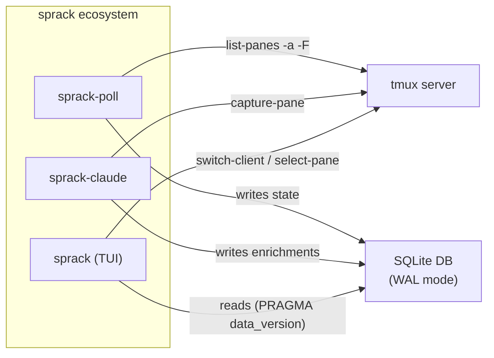

---
first_authored:
  by: "@claude-opus-4-6-20250605"
  at: 2026-03-21T14:08:00-07:00
task_list: terminal-management/sprack-tui
type: report
state: live
status: wip
tags: [architecture, sprack, tmux, sqlite, rust]
---

# sprack Design Overview

> BLUF: sprack is a tree-style tmux session browser built as three cooperating Rust binaries sharing a SQLite database.
> A poller writes tmux state, the TUI reads and renders, and standalone summarizers write process enrichments.
> The SQLite DB (WAL mode) is the integration contract: any tool that writes to it gets rendered in the tree.
> This report is a mid-level walkthrough of the architecture, data flow, and key decisions to orient a reader before diving into the full proposal.

## What sprack Does

sprack renders a persistent sidebar in tmux showing every session, window, and pane as a collapsible tree:

```
 HOSTS
 v lace (22425)
   v editor
     shell (nvim) [*]
   > terminal (2)
   > logs
 v dotfiles (22430)
   > editor
   > shell
 > local
   scratch (nu)
```

Sessions are grouped by lace devcontainer (using the `@lace_port` tmux option set by `lace-into`).
Selecting a node focuses it in tmux.
The tree updates near-instantly for structural changes (new session, closed pane) and within 1 second for everything else.

sprack is read-and-navigate only: it does not create, destroy, or rearrange tmux objects.

## The Three Components



### 1. sprack-poll (the poller)

Runs as a background daemon.
Every 1 second (or immediately when triggered by SIGUSR1 from tmux hooks), it:

1. Calls `tmux list-panes -a -F` with a format string that returns one line per pane across all sessions.
2. Calls `tmux show-options` per session to read `@lace_port`, `@lace_user`, `@lace_workspace`.
3. Hashes the output: if unchanged from last cycle, skips the DB write (avoids unnecessary TUI refreshes).
4. If changed, writes all sessions/windows/panes to SQLite in a single transaction.
5. Writes a heartbeat timestamp so the TUI can detect if the poller has crashed.

Near-instant structural updates come from tmux hooks:
```tmux
set-hook -g after-new-session  "run-shell 'pkill -USR1 sprack-poll 2>/dev/null || true'"
set-hook -g after-new-window   "run-shell 'pkill -USR1 sprack-poll 2>/dev/null || true'"
set-hook -g pane-exited        "run-shell 'pkill -USR1 sprack-poll 2>/dev/null || true'"
set-hook -g after-select-pane  "run-shell 'pkill -USR1 sprack-poll 2>/dev/null || true'"
```

### 2. sprack (the TUI)

A ratatui application running in a dedicated tmux pane (narrow left sidebar, ~28 cols).
It never calls the tmux CLI for state reads: it reads exclusively from SQLite.

Every 50-100ms, it checks `PRAGMA data_version`: a built-in SQLite counter that increments whenever any other process commits.
If unchanged, no work is done (sub-microsecond check).
If changed, it reads the full DB state and rebuilds the tree, preserving UI state (cursor position, collapse/expand).

User input (j/k navigation, Enter to focus) triggers tmux navigation commands directly.

### 3. Summarizers (e.g., sprack-claude)

Standalone binaries that enrich the tree with process-specific information.
Each summarizer:

1. Reads the `panes` table to find panes matching its target process (e.g., `current_command LIKE '%claude%'`).
2. Resolves contextual info: tmux user options, file reads, pane content scraping (rate-limited, as fallback).
3. Writes results to the `process_integrations` table.

The TUI renders enrichments inline in the tree: `claude [thinking...]` instead of just `claude`.

Summarizers are independently deployable.
Any binary in any language that writes to `process_integrations` gets rendered: the DB schema is the contract.

## The SQLite DB

WAL mode enables concurrent readers (TUI) and a single writer (poller, or summarizers for their table) without blocking.

Five tables:

| Table | Written By | Read By | Purpose |
|-------|-----------|---------|---------|
| `sessions` | sprack-poll | sprack TUI | Session name, attached status, lace metadata |
| `windows` | sprack-poll | sprack TUI | Window index, name, active flag |
| `panes` | sprack-poll | sprack TUI, summarizers | Pane ID, title, command, PID, active/dead |
| `process_integrations` | summarizers | sprack TUI | Per-process contextual info (composite PK: `pane_id + kind`) |
| `poller_heartbeat` | sprack-poll | sprack TUI | Staleness detection (singleton timestamp) |

The composite primary key `(pane_id, kind)` on `process_integrations` allows multiple enrichments per pane (e.g., nvim buffer info + language server status).

The DB is ephemeral: it lives at `$XDG_RUNTIME_DIR/sprack/state.db` and is rebuilt from scratch on each `sprack-poll` start.
Schema creation is idempotent (`CREATE TABLE IF NOT EXISTS`).

## Cross-Process Reactivity

The key architectural question was: how does the TUI detect changes written by the poller?

**Not sqlite-watcher**: the crate uses per-connection temporary triggers that don't fire across process boundaries.

**PRAGMA data_version**: a built-in SQLite primitive (since 3.12.0) that returns an integer incrementing on any external commit.
Polling this at 50-100ms is the correct cross-process pattern: it's a single read from the WAL-index shared memory region, effectively free.
See the [full analysis](2026-03-21-sqlite-watcher-cross-process-reactivity.md).

## Container Grouping

Sessions created by `lace-into` store three tmux user options:
- `@lace_port`: SSH port for the devcontainer (e.g., 22425)
- `@lace_user`: remote user (e.g., `node`)
- `@lace_workspace`: container workspace path (e.g., `/workspaces/lace/main`)

sprack-poll reads these and writes them to the `sessions` table.
The TUI groups sessions sharing the same `@lace_port` into a `HostGroup` node at the top level of the tree.
Sessions without `@lace_port` go under a "local" group.

## Key Design Decisions

### Why Decouple via SQLite?

Three benefits drove this over the simpler single-binary approach:

1. **Composability**: process integrations are standalone tools.
   `sprack-claude` is independently testable and deployable.
   You can `sqlite3 state.db` to debug.
   Any language can write a summarizer.
2. **Performance**: the TUI's hot loop checks one integer (`data_version`).
   Full DB reads only happen when data changed.
   No shell-outs in the render path.
3. **Extensibility**: new integrations require zero sprack changes: write to `process_integrations`, done.

The trade-off is operational complexity: three processes instead of one.
Mitigation: a `sprack-start` launcher or auto-start logic in the TUI binary.

### Why SIGUSR1 from tmux Hooks?

Inspired by [tabby's architecture](2026-03-21-tabby-tmux-plugin-analysis.md).
Pure 1-second polling is sufficient but introduces visible lag for structural changes.
tmux hooks fire SIGUSR1 to the poller, giving <50ms response for new sessions, closed panes, and focus changes.
The fallback poll catches everything the hooks don't cover (command changes, title updates).

### Why Rust + ratatui?

- Instant startup (<50ms), low memory, no runtime
- ratatui is the dominant Rust TUI framework with tree widget support
- Single static binary per component, no runtime deps beyond `tmux` on PATH
- Consistent with the wezterm sidecar proposal's language choice

### Why Not tmux Control Mode?

`tmux -C` provides an event stream but requires maintaining a persistent connection, parsing a non-trivial protocol, and handling disconnects.
The polling + SIGUSR1 approach is simpler and sufficient.
Control mode is a documented upgrade path if sub-second responsiveness becomes important.

## Implementation Phases

| Phase | Scope | Key Deliverable |
|-------|-------|-----------------|
| 1 | Cargo workspace, SQLite schema, basic tree | sprack-poll writes state, TUI renders and navigates |
| 2 | tmux interaction, SIGUSR1 hooks | Enter focuses panes, near-instant structural updates |
| 3 | Container grouping, search, toggle keybinding | Sessions grouped by `@lace_port`, fuzzy filter, Alt-t toggle |
| 4 | Summarizer architecture, sprack-claude | Process enrichments in tree, standalone summarizer validated |

Phase 1 is the largest: it establishes the Cargo workspace with two binaries (sprack, sprack-poll), a shared `sprack-db` library crate, the SQLite schema, and `PRAGMA data_version` change detection.
This is necessary because the decoupled architecture requires all three layers (poller, DB, TUI) to function at all.

## Relationship to Other Work

| Document | Relationship |
|----------|-------------|
| [tmux Return Proposal](../proposals/2026-03-21-tmux-return-and-lace-into.md) | Foundation: provides `@lace_port`/`@lace_user`/`@lace_workspace` session options, `lace-into`, tmux.conf |
| [Wezterm Sidecar Proposal](../proposals/2026-02-01-wezterm-sidecar-workspace-manager.md) | Ancestor: sprack evolves this from a wezterm Lua plugin + TUI hybrid to a pure tmux + SQLite architecture |
| [sqlite-watcher Report](2026-03-21-sqlite-watcher-cross-process-reactivity.md) | Research: proves sqlite-watcher doesn't work cross-process, validates `PRAGMA data_version` |
| [tabby Analysis Report](2026-03-21-tabby-tmux-plugin-analysis.md) | Reference: SIGUSR1 pattern, batched queries, hash-based diff, format variable catalog |
| [tmux vs Zellij Decision](2026-03-21-tmux-vs-zellij-multiplexer-decision.md) | Context: why tmux was chosen (copy mode), which informed sprack targeting tmux |
