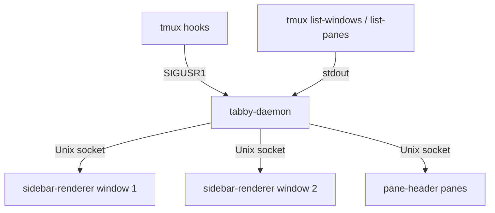

---
first_authored:
  by: "@claude-opus-4-6-20250319"
  at: 2026-03-21T13:31:17-07:00
task_list: terminal-management/sprack-tui
type: report
state: live
status: wip
tags: [architecture, sprack, tmux, reference]
---

# Tabby tmux Plugin Analysis

> BLUF: Tabby is a Go-based tmux plugin that provides a vertical sidebar with grouped window/pane trees, activity indicators, and mouse interaction.
> Its architecture: a per-session daemon queries tmux state via `list-windows`/`list-panes` format strings, pushes pre-rendered frames over Unix sockets to per-window Bubble Tea renderers, and uses SIGUSR1 signals from tmux hooks for near-instant refresh.
> Key patterns for sprack: the tmux format variable catalog, the daemon-renderer split, activity/bell detection via both native flags and custom `@tabby_*` user options, and the N+1 query optimization for pane listing.

## Repository Overview

- **Repository**: [brendandebeasi/tabby](https://github.com/brendandebeasi/tabby)
- **Language**: Go (with shell scripts for tmux integration)
- **TUI Framework**: Bubble Tea + Lipgloss (charmbracelet ecosystem)
- **Minimum tmux version**: 3.0+

## Architecture

Tabby uses a daemon-renderer architecture with three main process types per tmux session:

1. **tabby-daemon** (one per session): central coordinator that queries tmux, computes state diffs, and pushes render payloads to connected renderers via Unix domain sockets.
2. **sidebar-renderer** (one per window): Bubble Tea TUI process running in a tmux pane, receiving pre-rendered content from the daemon and handling mouse/keyboard input.
3. **pane-header** (one per content pane): renders per-pane header bars with titles and drag handles.



## Tmux State Querying

### Format Variables Used

Tabby queries tmux using `list-windows -F` and `list-panes -F` with unit-separator (`\x1f`) delimited format strings.
This is the core technique sprack should adopt.

**Window format variables** (from `ListWindows()`):
- `#{window_id}`, `#{window_index}`, `#{window_name}`, `#{window_active}`
- `#{window_activity_flag}`, `#{window_bell_flag}`, `#{window_silence_flag}`, `#{window_last_flag}`
- `#{window_layout}`, `#{session_id}`

**Pane format variables** (from `ListAllPanes()`):
- `#{pane_id}`, `#{pane_index}`, `#{pane_active}`
- `#{pane_current_command}`, `#{pane_start_command}`, `#{pane_title}`
- `#{pane_pid}`, `#{pane_last_activity}`
- `#{pane_top}`, `#{pane_left}`, `#{pane_width}`, `#{pane_height}`
- `#{pane_current_path}`, `#{pane_dead}`

**Custom user options** (stored as tmux window/pane options via `@tabby_*`):
- `#{@tabby_color}`, `#{@tabby_group}`, `#{@tabby_busy}`, `#{@tabby_bell}`
- `#{@tabby_activity}`, `#{@tabby_silence}`, `#{@tabby_collapsed}`
- `#{@tabby_input}`, `#{@tabby_name_locked}`, `#{@tabby_sync_width}`
- `#{@tabby_pinned}`, `#{@tabby_icon}`, `#{@tabby_pane_title}`
- `#{@tabby_pane_collapsed}`, `#{@tabby_pane_prev_height}`

> NOTE(opus/sprack-tui): The `@tabby_*` pattern is notable: tmux user options (`set-option -w @option_name value`) can be queried in format strings, giving plugins persistent per-window/pane metadata without external state files.
> Sprack should use `@sprack_*` user options for any metadata it needs to persist on windows/panes.

### N+1 Query Optimization

Tabby avoids the N+1 query problem by using `list-panes -s` (session scope) to fetch all panes in a single command, then mapping them to windows by `#{window_index}`.
This is significantly faster than calling `list-panes -t :N` for each window.

```
Optimized: 2 tmux commands total (list-windows + list-panes -s)
Naive:     1 + N tmux commands (list-windows + list-panes per window)
```

### Command Execution

All tmux commands run through a `tmuxOutput()` wrapper with a 5-second timeout per command, preventing the daemon from hanging on stuck tmux processes.

## State Change Detection

Tabby uses a **signal-driven** model with fallback polling:

| Mechanism | Interval | Purpose |
|-----------|----------|---------|
| SIGUSR1 from tmux hooks | Instant | Primary refresh trigger |
| Window check fallback | 10s | Spawn/cleanup renderers |
| Refresh tick fallback | 30s | Full window list poll |
| Animation tick | 100ms | Spinner/pet state |
| Git status poll | 5s | Repository updates |
| Renderer watchdog | 5s | Process health checks |

The primary flow:
1. `tabby.tmux` registers tmux hooks (e.g., `after-select-window`, `window-linked`, `pane-focus-in`, `client-resized`) that run `signal_sidebar.sh`.
2. `signal_sidebar.sh` reads the daemon PID from `/tmp/tabby-daemon-{SESSION_ID}.pid` and sends `kill -USR1`.
3. The daemon's signal handler queues a refresh into a channel.
4. Heavy operations (renderer spawning, orphan cleanup) are debounced to 300ms to prevent feedback loops where tmux operations trigger hooks that re-signal.

> NOTE(opus/sprack-tui): Sprack will not need the SIGUSR1 relay since it runs as a persistent TUI process that can use tmux hooks directly or poll on its own schedule.
> The 300ms debounce for heavy operations is a pattern worth adopting.

### Hash-Based Diff Detection

The coordinator computes a hash of current window/pane state and only broadcasts render updates when the hash changes.
This prevents unnecessary re-renders when tmux hooks fire but state has not actually changed.

## Activity and Bell Detection

Tabby detects activity through two complementary mechanisms:

**Native tmux flags**: `window_activity_flag`, `window_bell_flag`, `window_silence_flag` provide built-in monitoring when `monitor-activity`, `monitor-bell`, or `monitor-silence` are enabled.

**Custom `@tabby_*` options**: processes can set `@tabby_busy`, `@tabby_bell`, `@tabby_activity`, or `@tabby_input` directly, allowing explicit signaling from scripts or AI tools.

**Busy detection heuristics**:
- A curated `idleCommands` map lists shells and long-running editors (bash, zsh, vim, nvim, etc.) as "not busy."
- Any `pane_current_command` not in the idle set is considered busy.
- Remote commands (ssh, mosh) use a 3-second `pane_last_activity` recency check instead.
- AI tools (Claude Code, detected by semver process name pattern `^\d+\.\d+\.\d+$`) use spinner detection in pane titles: braille characters (U+2801-U+28FF) indicate working, and a specific idle icon (U+2733) indicates waiting for input.

## Rendering in a Tmux Pane

### Sidebar Pane Creation

The sidebar is created as a tmux split pane via `tmux split-window`.
Width is configurable and responsive (e.g., 15 columns mobile, 25 desktop).
The sidebar pane runs the `sidebar-renderer` binary, which is a full Bubble Tea application.

### Content Flow

The daemon pre-renders the sidebar content as plain text with ANSI styling, then pushes it as a `RenderPayload` over the Unix socket.
The renderer receives the content, applies viewport scrolling, overlays any active modals (context menu, color picker, marker picker), and draws to the terminal.

Key render payload fields:
- Pre-rendered lines of text (ANSI-styled)
- Clickable regions with coordinates mapping to semantic actions
- Background color for the sidebar
- Pinned widget content (clock, stats) that stays fixed at top/bottom
- Touch mode flag for mobile-optimized interaction

### Tree Display

Windows are grouped by their `@tabby_group` value, with groups ordered: Pinned first, then Default, then alphabetically sorted custom groups.
Within each group, windows are sorted by index.
Multi-pane windows show an indented pane list beneath the window entry.
Tree connectors use configurable characters (default: `\u251c\u2500` and `\u2514\u2500`).

### Information Displayed Per Entry

**Per window**:
- Window name (with optional custom icon)
- Active indicator (e.g., `>` prefix)
- Activity/bell/silence/busy/input state indicators
- Group color coding

**Per pane** (when expanded):
- Current command or locked title
- Active indicator
- Busy state
- Position in pane layout tree

## User Interaction

### Mouse Support

- Left-click: select window/pane
- Right-click: open context menu (with long-press detection at 350ms for mobile)
- Middle-click: close window
- Scroll wheel: viewport scrolling
- Double-tap detection (600ms window, 10-pixel tolerance)
- Drag detection to distinguish clicks from scrolls

### Keyboard Navigation

- Arrow keys and vim bindings for navigation
- Standard tmux bindings preserved (c, n, p, etc.)
- Alt-key shortcuts for fast window switching
- Configurable bindings from `config.yaml`

### Context Menus

Right-clicking a window, pane, or group opens a context menu with relevant actions (rename, kill, move to group, set color, etc.).
The menu is rendered as an overlay within the sidebar-renderer's Bubble Tea view.

## Configuration

Configuration lives at `~/.config/tabby/config.yaml` (XDG-compliant).

Key configurable areas:
- **Groups**: name, color theme, pattern matching rules
- **Sidebar**: position (left/right), width, theme, tree connectors, responsive breakpoints
- **Indicators**: bell, activity, silence, busy, input: each with enabled flag, text, colors, animation
- **Pane headers**: border style, dimming, drag handles
- **Widgets**: clock, git status, system stats, session info
- **Busy detection**: idle command list, AI tool list, idle timeout
- **Keybindings**: custom prefix and non-prefix bindings
- **Terminal title**: dynamic format string

## Patterns Relevant to Sprack

### Directly Applicable

1. **Tmux format string catalog**: the window and pane format variables listed above are the essential data source for any tmux tree view.
2. **N+1 optimization**: use `list-panes -s` for session-wide pane queries instead of per-window calls.
3. **`@sprack_*` user options**: tmux user options provide per-window/pane metadata without external state files.
4. **Idle/busy heuristic**: the curated idle command list plus recency-based detection for remote sessions is a practical approach.
5. **Unit-separator delimited output**: using `\x1f` as field delimiter avoids conflicts with space/tab/colon in window names and paths.
6. **Command timeout**: wrapping tmux commands with a timeout prevents the TUI from hanging.
7. **ANSI stripping**: window names and pane titles may contain ANSI escapes that need to be stripped for accurate width calculation.

### Architectural Differences

Sprack's architecture diverges from tabby in important ways:

- **Sprack is a single ratatui process**, not a daemon+renderer split.
  It runs directly in a tmux pane and queries tmux itself on a timer or via hooks.
  There is no need for Unix socket IPC or multiple renderer processes.
- **Sprack uses Rust/ratatui**, not Go/Bubble Tea.
  The rendering model is different (immediate-mode frame rendering vs. Elm architecture), but the tmux querying patterns are language-agnostic.
- **Sprack shows sessions too**, whereas tabby is scoped to a single session.
  Sprack will need `list-sessions -F` in addition to window/pane queries.

### Worth Investigating Further

- **Tmux control mode** (`tmux -C`): tabby does not use control mode, relying instead on periodic `list-windows`/`list-panes` calls with signal-driven refresh.
  Control mode provides a streaming event feed that could eliminate polling entirely, but adds protocol complexity.
- **`pane_top`/`pane_left` for visual ordering**: tabby sorts panes by their spatial position rather than creation order, which produces a more intuitive display.
  Sprack should adopt this.
- **Hash-based render skipping**: computing a state hash before re-rendering avoids unnecessary draw cycles.
  Ratatui's diffing renderer provides some of this automatically, but skipping the tmux query entirely when state is unchanged would be more efficient.

## Summary of Tmux Commands Used

| Command | Purpose |
|---------|---------|
| `tmux list-windows -t $SESSION -F "..."` | Fetch all windows with metadata |
| `tmux list-panes -s -t $SESSION -F "..."` | Fetch all panes across session |
| `tmux list-panes -t :$WINDOW -F "..."` | Fetch panes for one window (fallback) |
| `tmux select-window -t $TARGET` | Switch active window |
| `tmux select-pane -t $TARGET` | Switch active pane |
| `tmux split-window` | Create sidebar/header panes |
| `tmux set-option -w @tabby_*` | Store per-window metadata |
| `tmux has-session -t $SESSION` | Check session existence |
| `tmux display-message -p "#{...}"` | Query single values |
| `kill -USR1 $DAEMON_PID` | Signal daemon to refresh |
