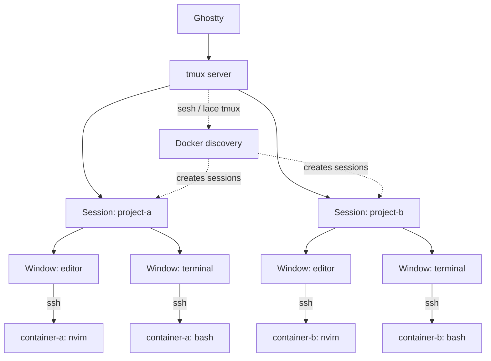

---
first_authored:
  by: "@claude-opus-4-6-20250605"
  at: 2026-03-21T10:41:00-07:00
task_list: terminal-management/zellij-migration
type: report
state: live
status: done
last_reviewed:
  status: accepted
  by: "@claude-opus-4-6-20250605"
  at: 2026-03-21T14:30:00-07:00
  round: 2
tags: [architecture, terminal_management, tmux, zellij, migration]
---

# Terminal Multiplexer Decision: tmux vs Zellij

> BLUF: tmux is the stronger choice for the lace workflow.
> Its copy mode is decisive: 42 vim motions with full visual selection vs zellij's 8 scroll-only actions.
> A "modern tmux" stack (tmux 3.6 + ghostty + sesh + tmux-floax + catppuccin + tmuxp + smart-splits) covers most of zellij's UX advantages while retaining the vim-native copy mode that is non-negotiable for this workflow.
> Migration effort is also lower: 3-5 weeks vs 4-6 weeks, with no Rust/WASM toolchain to learn.

## Context

This is a companion to the [Zellij Migration Feasibility Analysis](2026-03-21-zellij-migration-feasibility.md).
That report found zellij viable in many respects but identified copy mode as a severe, likely permanent gap (maintainer considers it "by design," issue #947 open since 2021).
This report compares tmux as the "classic" alternative, assessing what we gain and lose vs both zellij and the current wezterm setup.

---

## Head-to-Head: Weighted Decision Matrix

Weights reflect workflow priorities.
Copy mode is weighted highest (10) because it is used dozens of times daily with deep vim motions (f/F/t/T, W/B/E, counts, visual modes).

| Requirement | Weight | tmux | zellij | wezterm |
|-------------|--------|------|--------|---------|
| Copy mode (vim motions) | **10** | **10** | 1 | 6 |
| Named panes | 7 | 6 | **10** | 2 |
| Persistent sidecars | 6 | 6 | **7** | 3 |
| Sidebar tab list | 5 | 7 | **8** | 2 |
| Session persistence | **8** | 8 | **9** | 4 |
| Smart-splits neovim | **8** | **9** | 7 | 9 |
| Declarative layouts | 6 | 6 | **10** | 5 |
| Plugin ecosystem | 7 | **8** | 8 | 7 |
| SSH container access | **8** | 6 | 5 | **9** |
| Chezmoi dotfiles | 4 | **8** | 7 | 7 |
| **Weighted Total** | **69** | **521** | **474** | **385** |
| **Normalized** | | **7.6/10** | **6.9/10** | **5.6/10** |

The copy mode weight alone accounts for tmux's lead.

> NOTE(opus/terminal-management): Sensitivity analysis: at copy mode weight 7 instead of 10, tmux leads 491 vs zellij 471, a margin of only 20 points.
> The recommendation is robust but not overwhelming: copy mode is genuinely the decisive factor, not a comfortable margin across all dimensions.

---

## Copy Mode: The Deciding Factor

### tmux vi-copy: Full Inventory

tmux supports approximately **42 distinct vim motions** in `copy-mode-vi`:

**Movement**: h/j/k/l, 0/$, ^, w/b/e, W/B/E, f/F/t/T, ;/,, {/}, %, H/M/L, gg/G
**Scrolling**: Ctrl+f/b/d/u/e/y, z (center cursor)
**Search**: /pattern, ?pattern, n, N
**Selection**: Space (begin), V (line), v (rectangle toggle), o (swap end)
**Actions**: Enter/y (yank), A (append yank), q (cancel)
**Count prefix**: all motions accept numeric prefixes (5j, 10w)
**Marks**: X (set), M-x (jump)

### What Zellij Offers Instead

~8 scroll actions: j/k (line scroll), h/l (page scroll), d/u (half-page), Ctrl+f/b (full page), s (search), e (EditScrollback).
No cursor, no selection, no yank, no word motions, no character-find.

### What WezTerm Offers

~20 motions: h/j/k/l, w/b/e, 0/$, gg/G, H/M/L, v/V/Ctrl+v, y.
Missing: f/F/t/T, W/B/E, counts, marks, {/}.

### Assessment

For a workflow that relies on instinctive vim motions like `fC` (find next C), `B` (back WORD), and `5j` (5 lines down), only tmux provides full parity.
The gap is not incremental: zellij fundamentally lacks a cursor in scroll mode.

---

## What You Lose Going to tmux (vs Zellij)

These are real losses, not dismissible:

### Named Panes Are Second-Class

tmux panes support titles (`select-pane -T "name"`) but display them only in pane borders via `pane-border-format`.
Zellij shows pane names in prominent frames, always visible.
Mitigation: enable `pane-border-status` and configure `pane-border-format` with `#{pane_title}`.
Not as elegant but functional.

### No Floating/Pinned Panes (Partial Mitigation)

tmux popups (`display-popup`, 3.2+) are temporary command runners, not persistent panes.
`tmux-floax` bridges this with a toggle-able floating scratchpad backed by a persistent session.
Limitations: single floating pane at a time, no pinning, coordinates reset on toggle.
Zellij supports multiple simultaneous floating panes, each pinnable.

### No Stacked Panes

Zellij's stacked panes (multiple panes layered, inactive ones collapsed to title bars) have no tmux equivalent.
This is a genuine ergonomic loss for monitoring multiple related processes.

### No Declarative Layouts (External Tools Required)

tmux has no native layout files.
tmuxinator (YAML, Ruby) and tmuxp (YAML/JSON, Python) fill this gap but are external tools generating imperative tmux commands.
Zellij's KDL layouts are first-class with templates, swap layouts, and CWD composition.

### Configuration Syntax

tmux.conf is notoriously arcane: comma-separated style attributes, `if-shell` conditionals, `#{}` format strings with a non-obvious expression language.
Zellij's KDL is more readable and structured.
Mitigation: well-organized tmux.conf with comments, chezmoi templates for per-machine variations.

### No Contextual Keybinding Hints

Zellij's status bar shows available keys for the current mode.
tmux shows nothing by default.
Mitigation: custom status bar segments, but this requires manual maintenance.

### No Built-in Web Client

Zellij 0.43.0 has browser-based session access.
tmux has no equivalent (tmate, a tmux fork enabling session sharing via SSH, exists but is aging).

---

## What You Gain Going to tmux (vs Zellij and WezTerm)

### Unmatched Copy Mode

Already covered above, but worth restating: this is the single feature that makes tmux the right choice.

### Deep Scriptability

tmux's command language provides 100+ commands, format strings with ~50 variables, hooks for event-driven automation, `run-shell` for calling external scripts, and `control mode` for machine-readable I/O.
`libtmux` (Python) wraps all operations with a typed API.
This is more powerful than zellij's WASM plugin system for scripted automation and more accessible than learning Rust.

### Mature Ecosystem

15+ years of community plugins via TPM.
Every conceivable workflow has a plugin or documented pattern.
Stack Overflow, blog posts, and forum answers cover virtually every configuration question.

### Universal Availability

tmux ships with or is trivially installable on every Linux distribution and macOS.
No binary distribution concerns, no WASM runtimes, no AppImage/Flatpak questions.

### Smart-Splits: Most Reliable Integration

tmux's `@pane-is-vim` user option provides the most reliable neovim detection.
Both tmux and wezterm use explicit signals; zellij relies on process name heuristics.

### Simpler Migration from WezTerm

No Rust toolchain to learn.
Discovery plugin can be built in TypeScript/shell using existing lace CLI infrastructure.
Devcontainer feature simplifies (remove wezterm-mux-server, keep sshd).
Estimated 3-5 weeks vs 4-6 weeks for zellij.

---

## The "Modern tmux" Stack (2026)

A fully modernized tmux setup that closes most of the gap with zellij's UX:

### Core

- **tmux 3.6**: popup windows, pane scrollbars, SIXEL images, extended keys, Theme Mode 2031 (structured dark/light theme reporting)
- **Ghostty** (host terminal): GPU-accelerated, platform-native, excellent font rendering, kitty keyboard protocol
- **TPM**: plugin manager

### Plugins

| Plugin | Purpose | Replaces |
|--------|---------|----------|
| tmux-resurrect + continuum | Session persistence | resurrect.wezterm |
| tmux-floax | Floating scratchpad pane | Partial: zellij floating panes |
| sesh | Session-per-project management | lace.wezterm project picker |
| catppuccin/tmux | Modern theme with status modules | wezterm Slate theme |
| tmux-thumbs | Vimium-style hint copy (URLs, paths) | Complement to copy mode |
| tmuxp | Per-project layout YAML | wezterm Lua config |
| smart-splits.nvim | Neovim bidirectional navigation | Same (tmux backend) |
| tmux-autoreload | Config live reload | wezterm hot-reload |

### Copy Mode Enhancement

tmux-thumbs and extrakto complement (not replace) copy mode:
- **tmux-thumbs**: press a key, visible URLs/paths/hashes get letter hints, press hint to copy.
  Instant grabbing of specific patterns.
- **extrakto**: fzf over pane content for fuzzy text selection.

Combined with native copy-mode-vi, this covers every text selection scenario.

### Sidebar Tabs

**tabby** (tmux plugin, not the tabby terminal emulator) provides a vertical sidebar window list with grouping, mouse support, and daemon architecture.
Alternative: custom `pane-border-format` + `pane-border-status top/bottom`.

---

## Integration Architecture for Lace with tmux

### Recommended Approach

Session-per-project with programmatic tmux commands, mirroring the zellij Option C architecture:



### Discovery Plugin Rewrite

The current lace.wezterm plugin (705 lines of Lua) must be replaced regardless of which multiplexer is chosen.
With tmux, the rewrite is simpler:

**Option 1 (Recommended): lace CLI subcommand**
Add `lace tmux-connect <project>` to the existing TypeScript CLI.
It queries Docker labels (reusing existing discovery logic), generates tmux commands, and creates a session with SSH panes.
Bind to a tmux popup picker: `bind T display-popup -E "lace tmux-pick"`.

**Option 2: tmuxp workspace generation**
`lace tmuxp-gen <project>` generates a YAML workspace file, launched via `tmuxp load`.

**Option 3: sesh integration**
Configure sesh to use `lace status` for project discovery, with per-project `startup_command` calling `lace up`.

All three options reuse existing TypeScript/Node.js infrastructure.
No new language (Rust) required.

### Devcontainer Feature

The wezterm-server devcontainer feature simplifies to:
- Keep: sshd feature with key-based auth
- Remove: wezterm-mux-server binary, server-side config, mux entrypoint
- Add: SSH `ControlMaster`/`ControlPath` config in host chezmoi for connection multiplexing

### Effort Estimate

| Component | Effort | Notes |
|-----------|--------|-------|
| tmux.conf (theme, keys, options) | S (2-3 days) | Arcane syntax but well-documented |
| TPM + plugins | S (1 day) | Standard installation |
| smart-splits tmux config | S (1 day) | Well-documented |
| tmuxp project layouts | S (2-3 days) | Per-project YAML |
| sesh / session management | S (1 day) | Install + keybinding |
| lace CLI tmux integration | M (1-2 weeks) | TypeScript, reuses existing discovery |
| Devcontainer feature simplification | S (2-3 days) | Remove wezterm-server |
| Ghostty setup | S (1 day) | Install, configure fonts/theme |
| chezmoi integration | S (1 day) | Template tmux.conf |
| **Total** | **3-5 weeks** | Some parallelism assumed. vs 4-6 weeks for zellij |

---

## Hybrid Consideration: EditScrollback for tmux Too

Inspired by zellij's approach, a tmux keybinding can open scrollback in neovim:

```bash
bind-key e run-shell "tmux capture-pane -pS -32768 > /tmp/tmux-scrollback.txt && tmux new-window 'nvim /tmp/tmux-scrollback.txt'"
```

This gives the best of both worlds: tmux's native copy mode for quick selections, and full neovim for complex text extraction.
This pattern works identically in both tmux and zellij, but tmux doesn't *need* it as a workaround: it's a bonus.

---

## What Zellij Wins on (Honestly)

These are areas where zellij is genuinely better, not just different:

1. **Named panes**: first-class, prominent, ergonomic. tmux's pane titles are an afterthought.
2. **Declarative layouts**: KDL is purpose-built for workspace templating. tmuxp/tmuxinator are bolted on.
3. **Stacked panes**: unique feature, no tmux equivalent.
4. **Built-in resurrection**: zero-config vs two plugins.
5. **Keybinding hints**: self-documenting UI vs memorization.
6. **Plugin sandboxing**: WASM permissions vs full system access.
7. **Session UX**: `zellij -s name -l layout` in one command vs multi-step scripts.

If copy mode were fixed, zellij would be the stronger choice.
The maintainer's position makes that unlikely.

---

## Recommendations

### 1. Go with tmux

The copy mode gap is disqualifying for zellij in this workflow.
tmux's modern plugin ecosystem closes most of zellij's UX advantages.
Migration effort is lower and uses familiar tooling (TypeScript, shell, YAML).

### 2. Adopt the Modern tmux Stack

Install alongside wezterm for experimentation:
- tmux 3.6 + TPM
- ghostty as host terminal
- sesh for session management
- catppuccin for theme
- tmux-floax for floating scratchpad
- smart-splits.nvim (switch backend from wezterm to tmux)
- tmuxp for project layouts

### 3. Build lace tmux Integration in Phases

1. **Phase 0**: manual tmux usage alongside wezterm (1 week)
2. **Phase 1**: port keybindings, theme, smart-splits, session management (1 week)
3. **Phase 2**: `lace tmux-connect` CLI subcommand for project sessions (1-2 weeks)
4. **Phase 3**: simplify devcontainer feature, deprecate wezterm-mux-server (3-5 days)
5. **Phase 4**: deprecate wezterm entirely

### 4. Revisit Zellij Periodically

Check zellij release notes quarterly, specifically for progress on issue #947 (keyboard text selection).
If keyboard text selection is ever added, zellij becomes the clear winner.
The KDL config and WASM plugin system are genuinely better foundations for the long term.
