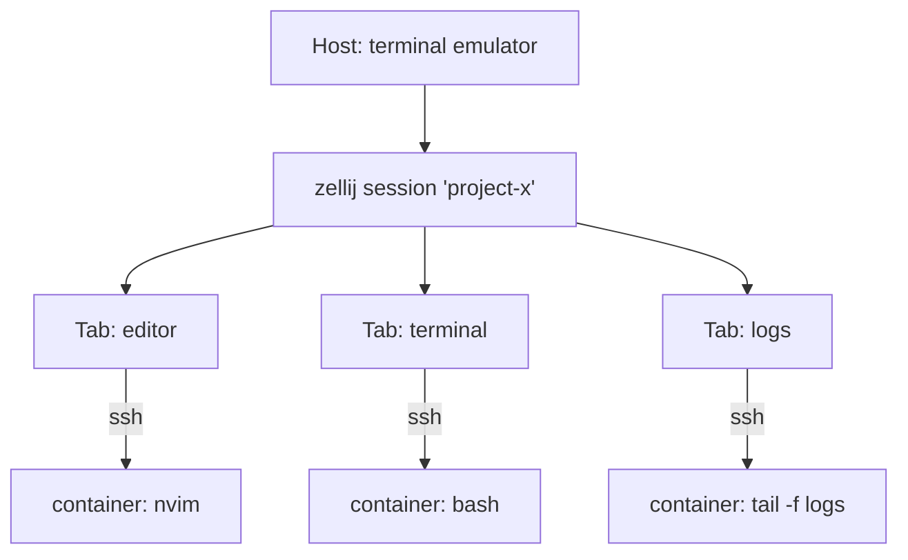
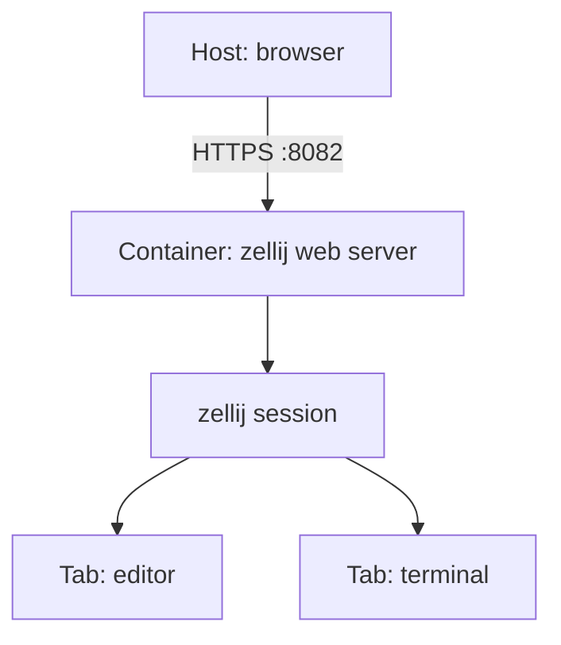
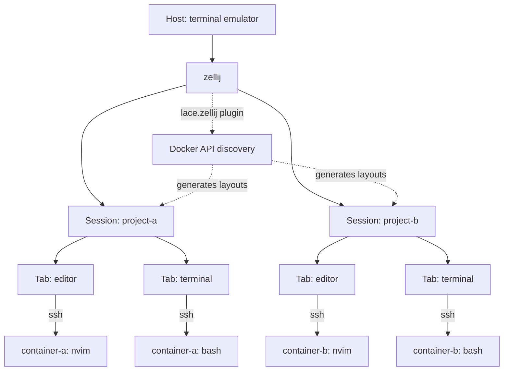

---
first_authored:
  by: "@claude-opus-4-6-20250605"
  at: 2026-03-21T09:31:00-07:00
task_list: terminal-management/zellij-migration
type: report
state: live
status: done
last_reviewed:
  status: accepted
  by: "@claude-opus-4-6-20250605"
  at: 2026-03-21T11:30:00-07:00
  round: 2
tags: [architecture, terminal_management, zellij, migration]
---

# Zellij Migration Feasibility Analysis

> BLUF: Zellij is a viable and in many ways superior replacement for wezterm's multiplexing layer, with strong native session resurrection, named panes, declarative layouts, and a WASM plugin system.
> The migration's largest cost is rewriting the discovery plugin in Rust/WASM (estimated 2-4 weeks, medium-high effort).
> The largest risk is zellij's severely limited copy mode: it lacks keyboard-driven text selection entirely, with no visual mode, no vim motions beyond basic scrolling, and no yank.
> The recommended architecture shifts from SSH-domain/mux-server to session-per-project with dynamically generated KDL layouts, with a separate terminal emulator (ghostty, kitty, or wezterm-as-emulator-only) on the host.

## Context / Background

The current lace terminal management stack uses wezterm with a three-layer integration:
1. Host-side Lua config with smart-splits, resurrect.wezterm, and a custom theme.
2. A devcontainer feature installing wezterm-mux-server with SSH access (ports 22425-22499).
3. The lace.wezterm discovery plugin (705 lines of Lua) providing Docker-based project discovery, SSH domains, and a project picker.

Wezterm has shown specific pain points: font rendering inconsistencies across GPU backends, flickering during rapid output, tab bar customization constraints that make sidebar-style tabs impractical, and occasional crashes in the mux server layer that disrupt container sessions.

Several zellij fundamentals align better with the lace vision: named panes as first-class citizens, persistent sidecar pane patterns, sidebar-style tabs, and declarative layout templating.

> NOTE(opus/zellij-migration): Zellij is a multiplexer only, not a terminal emulator.
> The host still needs a terminal emulator.
> See the "Host Terminal Emulator" section under Part 3 for the analysis of this architectural question.

This report covers three research areas:
1. Migration path and feature parity
2. Copy mode / vim-like scroll support
3. API surface and lace integration architecture

---

## Part 1: Migration Path and Feature Parity

### Session and Multiplexing Model

Zellij uses a client-server architecture where sessions are first-class: named, detachable, independently manageable.
This replaces wezterm's Unix domain mux model.

Key operations:
- `zellij -s <name>`: create named session
- `zellij attach <name>`: reattach (or `--create` to create if missing)
- `zellij list-sessions`: list active and exited sessions
- Multiple clients can attach simultaneously with independent cursors (multiplayer mode)

Session resurrection is **built-in** (serialized automatically, configurable interval).
This entirely replaces `resurrect.wezterm`.
Resurrected commands show a safety banner ("Press ENTER to run...") rather than auto-executing.

For SSH-command panes (as in the recommended Option C architecture), resurrection serializes the `ssh` command and arguments.
On resurrection, the SSH connection is re-established when the user presses ENTER.
This is functionally correct but introduces a manual reconnection step per pane after each host reboot.
The `--force-run-commands` flag can bypass this, auto-reconnecting all SSH panes, though this carries risk if container state has changed.

### Pane and Tab Model

Zellij's pane model is richer than both wezterm's and tmux's:

- **Named panes**: first-class, displayed in frames, settable at creation (`--name`), in layouts, or at runtime.
User-set names persist even when the running command changes.
- **Floating panes**: toggle all with `Alt+F`, pin individual panes to stay always-on-top (`Ctrl+P` then `I`).
Floating pane coordinates are configurable in layouts.
- **Stacked panes**: multiple panes layered in the same space, inactive panes collapse to a single title line.
Navigate within stacks with `Alt+Arrow/hjkl`.
- **Bulk operations** (v0.43+): select multiple panes, stack together, break to new tab, float.

### Layout System (KDL)

Zellij uses declarative KDL layouts, a significant ergonomic improvement over wezterm's imperative Lua config for workspace templating.

Key capabilities:
- Per-pane commands with `args`, `cwd`, `close_on_exit`, `start_suspended`
- Plugin panes with arbitrary config
- CWD composition: pane cwd inherits from tab, which inherits from layout
- Templates: `pane_template`, `tab_template`, `default_tab_template`
- Swap layouts: auto-rearrange when pane count changes (`min_panes`/`max_panes` constraints)

Per-project layouts can live in `~/.config/zellij/layouts/` or alongside the project, launched with `zellij -l <layout>`.

### Keybinding Migration

Zellij organizes keybindings into 13 modal modes (normal, locked, pane, tab, resize, move, scroll, search, session, tmux, etc.).

Two presets are available:
- **Default**: modes accessible directly from normal mode (`Ctrl+P` for pane mode, etc.).
Risk: collisions with terminal apps.
- **Unlock-first** (v0.41+): `Ctrl+G` unlocks the interface, then single-character mode selectors.
This is the closest to wezterm's `Alt+Z` leader pattern.

Mapping current wezterm keybindings:

| Wezterm | Purpose | Zellij Equivalent |
|---------|---------|-------------------|
| `Ctrl+H/J/K/L` | Pane navigation | `Alt+H/J/K/L` (default) or smart-splits |
| `Ctrl+Alt+H/J/K/L` | Pane resizing | Resize mode (`Ctrl+N` then `H/J/K/L`) |
| `Alt+H/J/K/L` | Create splits | Pane mode (`Ctrl+P` then `D/N`) |
| `Alt+N/P` | Tab cycling | `Alt+N/P` or tab mode |
| `Alt+Z` (leader) | Session commands | `Ctrl+G` (unlock-first) |
| `Alt+C` | Copy mode | `Ctrl+S` (scroll mode) |

### Smart-Splits / Neovim Integration

`smart-splits.nvim` supports zellij natively.
The detection mechanism differs: wezterm uses pane user variables (`IS_NVIM`), zellij uses process name inspection via the plugin API.

Recommended stack: `zellij-autolock` + `smart-splits.nvim` + unlock-first preset.
- `zellij-autolock`: auto-switches to Locked mode when neovim is focused (no keybinding collisions)
- `smart-splits.nvim`: provides cross-boundary navigation using zellij CLI

> NOTE(opus/zellij-migration): Zellij has no pane user variable system.
> Detection relies on process name matching, which is slightly less reliable than wezterm's explicit `IS_NVIM` signal.

### Sidebar Tabs

The `zellij-vertical-tabs` community plugin provides sidebar-style tabs with configurable width, custom formatting, mouse support, and auto-scrolling.
This is significantly easier than achieving sidebar tabs in wezterm, where tab bar positioning is limited to top/bottom.

> NOTE(opus/zellij-migration): Community plugin maturity varies.
> `zellij-autolock` and `zjstatus` are actively maintained with recent releases (2025-2026).
> `zellij-vertical-tabs` has fewer contributors but targets a stable API surface.
> `zellij-sessionizer` is actively maintained.
> Plugin maturity should be verified before committing to dependencies.

Layout example for left-side vertical tabs:
```kdl
layout {
    pane split_direction="vertical" {
        pane size=18 borderless=true {
            plugin location="file:~/.config/zellij/plugins/zellij-vertical-tabs.wasm"
        }
        pane
    }
}
```

### Persistent Sidecar Panes

Zellij does not have global panes that persist across all tabs.
Floating panes are per-tab.

Workaround patterns:
- **`default_tab_template`**: define a sidecar pane in every tab template, ensuring every new tab gets one (each is an independent process instance)
- **Pinned floating panes**: within a single tab, stays always-on-top while working in tiled panes
- **Plugin-based sidecar**: a WASM plugin persists in memory across tab switches via `Visible` events

### Feature Gap Analysis

**Gains over wezterm multiplexing:**
1. Built-in session resurrection (replaces resurrect.wezterm)
2. Named panes as first-class feature
3. Floating + pinned + stacked panes
4. Swap layouts (responsive layout switching)
5. Web client (browser-based session access, v0.43.0)
6. Multiplayer (shared sessions with per-user cursors)
7. Sidebar tabs via plugin
8. Status bar with contextual keybinding hints

**Losses or degradations:**
1. Copy mode (severe regression: see Part 2)
2. Lua scripting flexibility (KDL is declarative, less dynamic)
3. Docker discovery plugin must be rewritten in Rust/WASM
4. No ExecDomains equivalent
5. No pane user variables
6. Config symlink live reload issue (relevant if chezmoi uses symlinks)
7. Separate terminal emulator required (zellij is multiplexer only)

---

## Part 2: Copy Mode and Vim-Like Scroll Support

> WARN(opus/zellij-migration): This is the single largest friction point.
> Zellij's scroll mode supports approximately 8 actions vs tmux's 40+ vim motions.
> There is no keyboard-driven text selection at all.

### What Zellij Ships Out of Box

Scroll mode (`Ctrl+S`) provides:

| Key | Action |
|-----|--------|
| `j`/`k` | Scroll up/down one line |
| `h`/`l` | Page scroll (not character movement) |
| `d`/`u` | Half-page scroll |
| `Ctrl+f`/`Ctrl+b` | Full page scroll |
| `s` | Enter search mode |
| `e` | Open scrollback in `$EDITOR` (EditScrollback) |

That is the **complete** set.
There is no `gg`/`G`, no `0`/`$`, no word motions, no character motions, no counts, no text selection, no visual mode, no yank.

> NOTE(opus/zellij-migration): `h` and `l` are bound to page scroll, not character movement.
> There is no cursor in scroll mode: you scroll a viewport, not a cursor within text.

### Search Mode

Entered from scroll mode by pressing `s`, then typing a query and pressing Enter.
- `n`/`p` navigate between matches (no `N` for reverse: `p` goes upward instead)
- `c` toggles case sensitivity, `w` toggles wrap, `o` toggles whole-word
- Search matches cannot start a selection: there is no integration between search and text selection

### Selection and Yanking: The Critical Gap

- **Mouse selection**: click-and-drag with automatic copy-on-select via OSC 52
- **Keyboard selection**: does not exist.
No `v`, no `V`, no `Ctrl+V`, no `y`

The official workaround is **EditScrollback** (`Ctrl+S, e`): dumps scrollback to a temp file and opens in `$EDITOR`.
If using neovim, you get full vim motions.
Limitations: requires a configured editor, opens in a new pane (context switch), clipboard integration depends on editor config, and has known bugs (freezing on SIGSTOP, blank lines).

### Detailed Motion Comparison

| Vim Motion | tmux vi-copy | wezterm copy | zellij scroll |
|------------|-------------|--------------|---------------|
| h/j/k/l (character) | Yes | Yes | j/k only (scroll, no cursor) |
| w/b/e (word) | Yes | Yes | No |
| W/B/E (WORD) | Yes | No | No |
| f/F/t/T (char find) | Yes | No | No |
| 0/$/* (line nav) | Yes | Yes | No |
| gg/G (top/bottom) | Yes | Yes | No |
| H/M/L (viewport) | Yes | Yes | No |
| {/} (paragraph) | Yes | No | No |
| Ctrl+f/b/d/u (scroll) | Yes | Yes | Yes |
| /pattern, ?pattern | Yes | Separate mode | Separate mode (`s`) |
| n/N (search nav) | Yes | Yes | n/p (no N) |
| v/V/Ctrl+v (visual) | Yes | Yes | **No** |
| y (yank) | Yes | Yes | **No** |
| Count prefix (5j) | Yes | No | No |
| Marks (m/') | Yes | No | No |

**Motion count**: tmux ~40+, wezterm ~20, zellij ~8.

### Plugin Extensibility for Copy Mode

The WASM plugin API has building blocks:
- `intercept_key_presses()`: capture all user input
- `get_pane_scrollback(pane_id)`: retrieve scrollback buffer
- `copy_to_clipboard(text)`: copy to system clipboard
- `set_pane_regex_highlights()`: apply visual highlighting

A custom copy mode plugin is theoretically possible but architecturally awkward: no cursor overlay capability, no character-level positioning in another pane, scrollback-to-screen-position mapping is non-trivial.
No community plugins exist for this use case.

### Maintainer Position

GitHub issue #947 (60+ upvotes, open since 2021) requests keyboard text selection.
The maintainer's position: delegate to `$EDITOR` via `EditScrollback`.
This is a conscious design choice, not an oversight.
Keyboard-driven text selection is unlikely to be added to zellij core.

### Assessment

For a user who relies on tmux vi-copy mode, zellij's scroll mode is a severe regression.
The `EditScrollback` workaround is functional but not equivalent: it requires a context switch to an editor pane.

The plugin API has raw primitives but building a full vim-like copy mode would be a substantial engineering project that no one has attempted.

---

## Part 3: API Surface and Lace Integration Architecture

### CLI and IPC Surface

Zellij provides extensive CLI-driven IPC:

**`zellij action`** (40+ subcommands): pane creation/navigation/manipulation, tab management, scrolling, content dump (`dump-screen`, `dump-layout`), session switching, plugin launching.

**`zellij run`**: run commands in new panes (tiled, floating, in-place, with cwd, start-suspended).

**`zellij pipe`**: unidirectional CLI-to-plugin communication.
Auto-launches destination plugin.
Supports backpressure and bidirectional response via `cli_pipe_output()`.

**Environment variables**: `ZELLIJ` (set to `0` inside sessions), `ZELLIJ_SESSION_NAME`, socket/config dir overrides.

### WASM Plugin System

- **Runtime**: wasmi (pure Rust interpreter, not JIT)
- **Target**: `wasm32-wasi`
- **Primary language**: Rust via `zellij-tile` crate
- **200+ API functions** across: session management, layout operations, pane creation/queries, plugin communication, background execution (`run_command`, `web_request`), UI rendering
- **30+ subscribable events**: state (PaneUpdate, TabUpdate, SessionUpdate), input (Key, Mouse, InterceptedKeyPress), lifecycle (CommandPaneOpened/Exited), timers, filesystem, web
- **10 permission types**: ReadApplicationState, ChangeApplicationState, RunCommands, WriteToStdin, Reconfigure, InterceptInput, etc.

### Plugin Filesystem

Three paths mapped into the WASI sandbox:
- `/host`: CWD of last focused terminal
- `/data`: plugin-specific persistent folder (deleted on unload)
- `/tmp`: system temp

> WARN(opus/zellij-migration): `/data` is deleted on plugin unload.
> Open issue #4776 requests persistent cross-session plugin storage.
> For the lace.zellij plugin, Docker discovery results cached in `/data` would be lost on every unload.
> Workaround: cache to a known filesystem path outside the WASI sandbox (requires `FullHdAccess` permission) or re-query Docker on each plugin load (acceptable if queries are fast).

### Key Community Plugins

| Plugin | Relevance |
|--------|-----------|
| zellij-sessionizer | Project discovery via directory scanning, fuzzy search, session creation with layout |
| zellij-autolock | Auto-lock mode when nvim is focused (IS_NVIM equivalent) |
| zjstatus | Configurable status bar demonstrating deep state access |
| zj-docker | Docker container management from within zellij |
| zellij-vertical-tabs | Sidebar-style tabs |
| vim-zellij-navigator | Neovim/zellij pane navigation |

### Host Terminal Emulator

Zellij is a multiplexer only, not a terminal emulator.
The current stack uses wezterm as both terminal emulator and multiplexer.
If zellij replaces the multiplexer role, the host still needs a terminal emulator.

Options:
- **Wezterm as emulator only**: continue using wezterm purely for rendering and font handling, with all multiplexing delegated to zellij. Minimal migration effort for the emulator layer, but carries forward any rendering issues that motivated the migration.
- **Ghostty**: modern GPU-accelerated terminal with excellent font rendering. Native platform integration on macOS and Linux. Active development, growing community. No built-in multiplexing (expects an external multiplexer like zellij).
- **Kitty**: mature, GPU-accelerated, supports the kitty keyboard protocol (which zellij and neovim both leverage for modifier key detection). Well-established ecosystem.
- **Alacritty**: minimal, fast, no frills. Explicitly designed to be used with a multiplexer.

The choice of host terminal emulator is orthogonal to the zellij migration: any of these work.
The recommendation is to evaluate ghostty or kitty during Phase 0 alongside zellij experimentation, since both pair well with zellij and address wezterm's rendering pain points.

### Recommended Integration Architecture

#### Option A: Zellij-on-Host with SSH Panes (Simplest)

Run zellij on the host.
Panes SSH into containers.



- Generate KDL layouts per project with `command "ssh"` panes
- Project discovery via WASM plugin querying Docker labels
- Session switching via `switch_session_with_layout()`

Pros: simple, no zellij inside containers, host-side persistence.
Cons: each pane is a separate SSH connection, no container-side multiplexing.

**Effort**: Small (1-2 days for config, 1-2 weeks for plugin).

#### Option B: Zellij-in-Container with Web Client

Run zellij inside each container.
Access via the built-in web client (v0.43.0).



- Devcontainer feature installs zellij + starts web server
- Per-project `.zellij/layout.kdl` in the repo
- No SSH needed: HTTP/HTTPS access

Pros: full zellij features inside container, web access from anywhere.
Cons: browser-based (not native terminal), web client is new (v0.43.0), port mapping required.

**Effort**: Medium (1 week for devcontainer feature, layout templates).
Web client maturity is the primary risk.

#### Option C: Session-per-Project with Generated Layouts (Recommended)

This is the most zellij-idiomatic approach and the recommended starting point.



Implementation:
- **lace.zellij WASM plugin**: replaces lace.wezterm.
Queries Docker for container labels via `run_command()`, builds project list, provides fuzzy-search picker UI, calls `switch_session_with_layout()` with dynamically generated KDL.
- **Session-per-project**: each project gets its own zellij session.
Built-in resurrection handles persistence.
- **No wezterm-mux-server needed**: SSH is used only for command execution, not mux protocol.
- **No port range allocation**: single SSH port per container (from sshd feature).
- **SSH connection multiplexing**: use `ControlMaster`/`ControlPath`/`ControlPersist` in SSH config to share a single TCP connection across all panes connecting to the same container, avoiding per-pane connection overhead.

**Effort**: Medium-high (2-4 weeks total).
The lace.zellij WASM plugin is the largest component: porting 705 lines of Lua to Rust targeting wasm32-wasi.
This involves learning the `zellij-tile` crate API and Rust WASM toolchain, which is a meaningful barrier for a project that has been Lua/TypeScript-centric.
The Docker discovery logic itself is straightforward to port; the complexity is in the UI (fuzzy picker), layout generation, and the Rust learning curve.

```kdl
// Example generated layout for project "my-app"
layout {
    cwd "/"
    default_tab_template {
        pane size=1 borderless=true {
            plugin location="zellij:tab-bar"
        }
        children
        pane size=2 borderless=true {
            plugin location="zellij:status-bar"
        }
    }
    tab name="editor" focus=true {
        pane command="ssh" name="nvim" {
            args "-t" "container-name" "cd /workspace && nvim"
        }
    }
    tab name="terminal" {
        pane command="ssh" {
            args "-t" "container-name" "cd /workspace && bash"
        }
    }
}
```

### Pitfalls and Limitations

- **No pane user variables**: detection of neovim relies on process name matching, not explicit signals.
- **No SSH domain concept**: zellij has no built-in notion of remote domains.
Remote access means SSH commands in panes.
- **Plugin storage not persistent across sessions**: `/data` deleted on unload.
- **Nested zellij sessions**: UI corruption issues, `ZELLIJ` env var prevents accidental nesting.
- **wasmi interpreter**: slower than native code for compute-heavy plugins, adequate for UI.
- **No devcontainer ecosystem**: lace would be the first zellij devcontainer feature.

### Could a Zellij Plugin Replace lace.wezterm Entirely?

Yes, with caveats.
A single WASM plugin could: query Docker via `run_command`, build project lists, present a fuzzy picker UI, create/switch sessions with generated layouts, handle tab title formatting.

What it cannot do: establish SSH domains (no equivalent), set user variables on panes, modify terminal emulator behavior.

The architectural shift: instead of configuring the terminal emulator to transparently route connections, the plugin creates sessions with explicit SSH commands in panes.

---

## Recommendations

### 1. Proceed with Migration Planning, but Prototype Copy Mode Workaround First

The copy mode gap is the single largest risk.
Before committing, prototype the `EditScrollback` workflow to assess whether it is acceptable for daily use.
Consider whether investing in a custom copy mode WASM plugin is justified.

### 2. Adopt Option C Architecture (Session-per-Project)

This is the most zellij-idiomatic approach and eliminates the wezterm-mux-server complexity.
Start with a proof-of-concept lace.zellij WASM plugin that discovers containers and generates layouts.

### 3. Effort Comparison

| Component | Effort | Notes |
|-----------|--------|-------|
| Config + theme (KDL) | S (1-2 days) | Mechanical port of colors and keybindings |
| Smart-splits + autolock | S (1 day) | Install community plugins, configure |
| Per-project KDL layouts | S (2-3 days) | Declarative, can template from existing |
| Devcontainer feature | M (3-5 days) | Simpler than wezterm: single binary, auto-attach |
| lace.zellij WASM plugin | L (2-4 weeks) | Largest item: Lua-to-Rust port, new toolchain |
| Host terminal emulator eval | S (1-2 days) | Try ghostty/kitty alongside zellij |
| Copy mode prototype | S (1-2 days) | Test EditScrollback workflow viability |

Total estimated effort: 4-6 weeks including the plugin rewrite.
Without the plugin (using manual session creation), a functional zellij setup is achievable in 1-2 weeks.

### 4. Phased Migration

1. **Phase 0**: install zellij alongside wezterm for experimentation. Evaluate host terminal emulators (ghostty, kitty). Prototype EditScrollback copy workflow.
2. **Phase 1**: port theme and keybindings to KDL, set up smart-splits + zellij-autolock
3. **Phase 2**: create per-project KDL layouts, install zellij-vertical-tabs for sidebar tabs
4. **Phase 3**: create zellij devcontainer feature (single binary install, auto-attach shell profile)
5. **Phase 4**: port discovery plugin to Rust/WASM (largest effort, can be deferred if manual session creation is acceptable)
6. **Phase 5**: deprecate wezterm multiplexing layer

### 5. Investigate Areas

- SSH-pane layout generation: does per-pane SSH connection cause noticeable latency? Test with `ControlMaster`/`ControlPath` SSH multiplexing.
- Web client maturity inside devcontainers (v0.43.0): is browser-based terminal acceptable?
- vim-zellij-navigator reliability for process-name detection vs wezterm's user variable approach
- Session resurrection behavior with SSH-command panes (re-establishment latency, auto-reconnect safety)
- Rust/WASM toolchain: evaluate developer experience for plugin development. Consider whether `zellij-sessionizer` can be forked/adapted rather than building from scratch.
