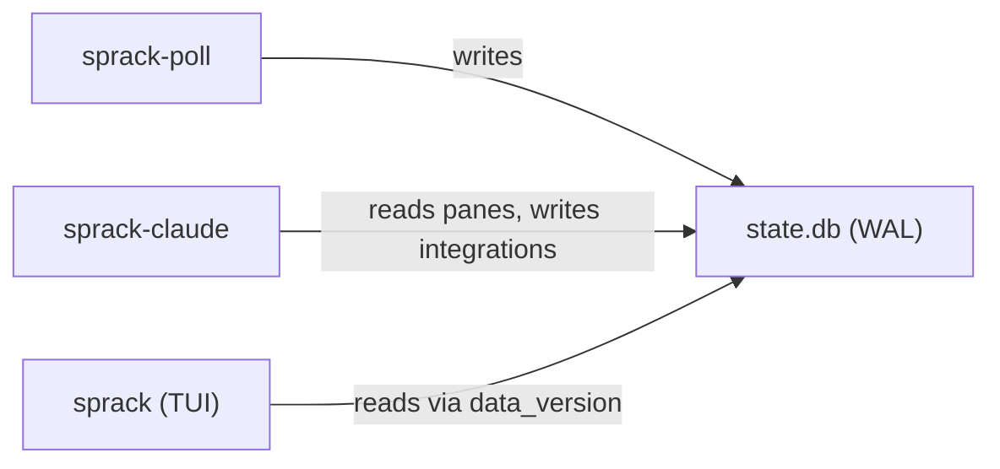

---
first_authored:
  by: "@claude-opus-4-6-20250605"
  at: 2026-03-23T00:15:00-07:00
task_list: terminal-management/sprack-tui
type: report
state: live
status: done
tags: [sprack, implementation, executive_summary, rust, sqlite, tui]
---

# Sprack Implementation: Executive Summary

> BLUF: All four sprack crates are implemented, tested (76 unit/integration tests), and clean (zero clippy warnings, rustfmt-compliant).
> The TUI prototype renders a live tmux tree from SQLite, navigates with keyboard and mouse, and self-filters its own pane.
> Three deviations from the original specs required resolution during implementation: tmux delimiter incompatibility, ratatui version pinning, and a nonexistent catppuccin crate version.

## Deliverables

| Crate | Role | Tests | Lines (approx) |
|-------|------|-------|-----------------|
| sprack-db | Shared SQLite library | 14 | ~600 |
| sprack-poll | tmux state poller daemon | 19 | ~700 |
| sprack | TUI binary | 23 | ~900 |
| sprack-claude | Claude Code summarizer daemon | 20 | ~800 |

All crates compile, pass `cargo clippy --workspace` with zero warnings, and pass `cargo fmt --all -- --check`.

## Architecture Verification

The three-process architecture works as designed:

- sprack-poll queries tmux via `list-panes -a -F`, parses the output, and writes full state replacement to SQLite in a single transaction.
- The TUI polls `PRAGMA data_version` at 50ms intervals and rebuilds its tree only when the DB changes.
- sprack-claude walks `/proc` to find Claude Code processes, reads JSONL session files, and writes structured status to `process_integrations`.
- WAL mode enables concurrent reads and writes without blocking.

## Manual Verification Results

- sprack-poll: populates DB with live tmux state (2 sessions, 3 panes confirmed).
- sprack-poll: writes heartbeat even when tmux server is absent.
- sprack TUI: renders tree with correct hierarchy (HostGroup > Session > Window > Pane).
- sprack TUI: keyboard navigation (j/k/h/l/Space) works correctly.
- sprack TUI: self-filtering excludes the TUI's own pane from the tree.
- sprack TUI: status bar shows poller health and keybind hints.
- sprack TUI: detail panel appears in Wide layout tier.
- sprack-claude: binary builds; /proc-based resolution and JSONL parsing verified via unit tests only (no live Claude Code instance available).

## Deviations from Specs

### 1. tmux Delimiter: `\x1f` to `||`

The spec specified ASCII unit separator (`\x1f`) as the field delimiter in tmux format strings.
tmux 3.3a (the version in the devcontainer) converts non-printable characters to underscores in format output.
This caused all pane lines to be unparseable.

Resolution: switched to `||` (double pipe) as the delimiter.
This is printable and extremely unlikely to appear in session names, window names, paths, or pane titles.

> WARN(opus/sprack-impl): tmux 3.4+ may handle `\x1f` correctly.
> If the devcontainer's tmux version is upgraded, the delimiter could be reverted, but `||` works reliably across versions.

### 2. ratatui Version: 0.29 to 0.28

The workspace Cargo.toml specified ratatui 0.29.
tui-tree-widget v0.22 depends on ratatui 0.28.
Having both versions in the dependency tree causes type incompatibility (e.g., `ratatui::layout::Rect` from 0.28 is a different type than from 0.29).

Resolution: downgraded ratatui to 0.28 across the workspace.
tui-tree-widget is the constraining dependency.

### 3. catppuccin Version: v3 to v2

The workspace specified catppuccin v3, which does not exist on crates.io.
The latest published version is v2.

Resolution: used catppuccin v2 and added a `colors.rs` bridge module to convert catppuccin colors to ratatui `Color::Rgb` via RGB components, since catppuccin v2's `From<Color>` impl targets `ratatui-core` v0.1, not the `ratatui` v0.28 `Color` type.

## Forward-Looking Concerns

### Timestamp Quality

Both sprack-db and sprack-poll use a makeshift timestamp format (`1970-01-01T00:00:00Z+Ns` where N is seconds since epoch).
This avoids adding a datetime dependency but is not valid ISO 8601 and will be confusing in `sqlite3` debugging sessions.
Adding the `time` crate (lightweight, no-std compatible) would produce proper `2026-03-23T00:15:00Z` timestamps.

### tui-tree-widget Version Pinning

tui-tree-widget v0.22 constrains the entire workspace to ratatui 0.28.
ratatui 0.29 has been out for months and 0.30 is likely soon.
Upgrading tui-tree-widget to a version compatible with ratatui 0.29+ would unblock ratatui improvements (better mouse handling, new widget APIs).

### sprack-claude: No Live Validation

sprack-claude's `/proc` walking, session file discovery, and JSONL parsing are covered by 20 unit tests, but have not been validated against a running Claude Code instance.
The JSONL entry format is reverse-engineered from the spec; field names or structure may have drifted.
First integration test with a live Claude session is the highest-priority follow-up.

### tmux Hook Installation

sprack-poll supports SIGUSR1 for immediate poll cycles, but the tmux hooks that send the signal are not auto-installed.
Users must manually add `set-hook -g after-new-session "run-shell 'pkill -USR1 sprack-poll ...'"` lines to their tmux.conf.
A `sprack setup` command that configures these hooks would improve the out-of-box experience.

### Detail Panel: Rich Rendering

The TUI's detail panel currently shows raw integration data.
When sprack-claude writes structured `ClaudeSummary` JSON, the detail panel should parse and render it with width-adaptive formatting (compact icons, standard badges, full detail with token counts).
This rendering logic exists in the spec mockups but is not yet implemented in the TUI's `render_detail_panel`.

### macOS Support

sprack-claude's `/proc` filesystem walker is Linux-specific.
macOS support requires `libproc`/`sysctl` for process tree walking.
The abstraction boundary is clean (a `ProcessResolver` trait), but the macOS implementation is not written.

### Daemon Auto-Start: sprack-claude

The TUI's daemon launcher (`daemon.rs`) starts sprack-poll automatically but does not yet auto-start sprack-claude.
The spec mentions a config file (`~/.config/sprack/config.toml`) for summarizer configuration; this is not implemented.

## Related Documents

| Document | Relationship |
|----------|-------------|
| [sprack-db proposal](../proposals/2026-03-21-sprack-db.md) | Spec: schema, types, query helpers |
| [sprack-poll proposal](../proposals/2026-03-21-sprack-poll.md) | Spec: poller daemon |
| [sprack TUI proposal](../proposals/2026-03-21-sprack-tui-component.md) | Spec: TUI binary |
| [sprack-claude proposal](../proposals/2026-03-21-sprack-claude.md) | Spec: Claude Code summarizer |
| [Rust style guide](2026-03-21-sprack-rust-style-guide.md) | Conventions followed |
| [Design overview](2026-03-21-sprack-design-overview.md) | Architecture context |
