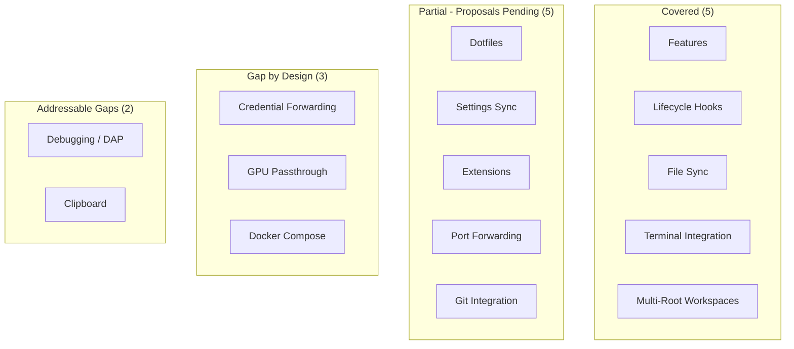

---
first_authored:
  by: "@claude-opus-4-6"
  at: 2026-03-24T19:00:00-07:00
task_list: lace/gap-analysis
type: report
state: live
status: review_ready
tags: [lace, devcontainer, vscode, gap_analysis, developer_experience]
---

# Lace vs VS Code Dev Containers: Developer Experience Gap Analysis

> BLUF(opus/gap-analysis): Lace covers roughly 60% of the developer experience that VS Code Dev Containers provides out of the box, with strong parity in terminal integration (where lace is arguably superior), port allocation, feature support, and lifecycle hooks.
> The largest gaps are credential forwarding (by design), settings sync, integrated debugging, and clipboard sharing.
> Of 15 VS Code capabilities assessed, 5 are fully covered, 5 are partially covered (with proposals addressing most), 3 are gaps by architectural choice, and 2 are real gaps that could be addressed.
> The terminal-native approach delivers genuine advantages in copy mode, session persistence, and multiplexing that VS Code cannot match.

## Context / Background

Lace is a devcontainer preprocessor that generates standard `devcontainer.json` files for terminal-native development workflows: SSH access via wezterm, tmux for multiplexing, direct SSH.
It explicitly operates outside VS Code.

VS Code Dev Containers is the reference implementation of the devcontainer spec, providing a deeply integrated development experience through the VS Code editor.
It automatically handles credential forwarding, settings sync, extension management, and many other conveniences that terminal-native workflows must address individually.

This report evaluates each major VS Code Dev Containers capability, assesses lace's current coverage, and classifies gaps by their nature and priority.

## Assessment Framework

Each capability is classified as:

- **Covered**: lace provides equivalent or superior functionality.
- **Partial**: lace provides some functionality, with pending proposals addressing the rest.
- **Gap (by design)**: lace intentionally does not provide this, due to its security model or architectural choices.
- **Gap (addressable)**: a real gap that could be closed with new work.

Priority is rated by impact on daily developer experience for the target audience: terminal-comfortable developers who expect certain conveniences.

## Capability Assessment

### 1. Credential Forwarding

**VS Code**: automatically forwards the host's git credential helper, SSH agent, and (with setup) GPG keys into the container.
This enables `git push`, `gh` CLI, and signed commits from inside the container with zero configuration.

**Lace**: intentionally blocks all credential forwarding.
The `lace-fundamentals` feature (in review) actively disables SSH agent forwarding (`AllowAgentForwarding no`).
The user-level config proposal (accepted) injects git identity via environment variables (`GIT_AUTHOR_NAME`, `GIT_AUTHOR_EMAIL`) while explicitly avoiding `.gitconfig` mounting to prevent credential helper leakage.

**Classification**: Gap (by design).
Lace's security boundary is "read the repo, commit locally, never push."
Containers run untrusted code (AI-generated tool calls, npm postinstall scripts) and must not hold credentials that could modify upstream repositories.
Pushing is an explicit host-side operation after review.

**Impact**: High for developers who push frequently from their editor.
Low for the target audience, who already review and push from the host.

### 2. Dotfiles

**VS Code**: the `dotfiles.repository` user setting clones a git repo into the container and runs an install script.
This is IDE-specific (not in the devcontainer spec).

**Lace**: the `repoMounts` system in `devcontainer.json` mounts external repos into the container.
The `lace-fundamentals` feature (in review) integrates chezmoi: it runs `chezmoi apply` from a mounted dotfiles repo via a `postCreateCommand` lifecycle hook.
The user-level config proposal (accepted) allows declaring universal features like neovim and nushell that apply to every container.

**Classification**: Partial, with proposals addressing the remainder.
The `lace-fundamentals` feature provides chezmoi integration.
The gap: no automatic dotfiles repo cloning from a user-level setting: the user must declare the dotfiles repo in each project's `repoMounts` or (once `user.json` exists) in user-level config.

**Impact**: Medium.
Chezmoi integration is superior to VS Code's "clone and run" approach once configured, but initial setup requires more steps.

### 3. Settings Sync

**VS Code**: synchronizes editor settings, keybindings, UI state, and extensions across machines and into containers.

**Lace**: no equivalent.
Terminal tool configuration (neovim, nushell, tmux) is managed by chezmoi dotfiles, which serves the same purpose but requires explicit setup.
The user-level config proposal (accepted) adds `containerEnv` and `defaultShell` preferences that apply universally.

**Classification**: Partial.
Chezmoi-managed dotfiles are the terminal-native equivalent of settings sync, and are arguably more powerful (templating, platform branching, version control).
The gap is that this requires the user to set up chezmoi, while VS Code settings sync is zero-config after initial sign-in.

**Impact**: Medium for onboarding.
Low for established users who already manage dotfiles.

### 4. Extensions (Editor Plugins)

**VS Code**: automatically installs extensions inside the container based on `devcontainer.json` declarations and user settings.

**Lace**: the user-level config proposal (accepted) supports universal `features` that install tools (neovim, nushell, language servers) into every container via prebuild.
Neovim plugin management is handled by the plugin manager declared in the chezmoi-managed neovim config (e.g., lazy.nvim).

**Classification**: Covered, through a different mechanism.
Devcontainer features install container-level tools.
Neovim's plugin ecosystem handles editor extensions.
The lifecycle is different (features at build time, neovim plugins at first launch), but the result is equivalent.

**Impact**: Low.
Neovim's plugin management is mature and well-understood by the target audience.

### 5. Port Forwarding

**VS Code**: automatically detects listening ports inside the container and offers to forward them, with a UI for managing forwarded ports, labels, and protocols.

**Lace**: provides deterministic port allocation from a dedicated range (22425-22499) via `${lace.port()}` templates in `devcontainer.json`.
Ports are declared in feature metadata with labels, auto-forward behavior, and protocol hints.
The `lace status` command shows active port allocations.
There is no automatic port detection for undeclared ports.

**Classification**: Partial.
Declared ports (SSH, dev servers) are handled well, with stable allocation that survives container rebuilds.
The gap: no automatic detection of ad-hoc ports (e.g., a random `npx serve` on port 3000).
Developers must manually SSH-tunnel or declare ports in advance.

**Impact**: Medium.
Declared-port workflows are solid.
Ad-hoc port forwarding requires `ssh -L` commands, which the target audience is comfortable with but which adds friction compared to VS Code's automatic detection.

### 6. Terminal Integration

**VS Code**: provides an integrated terminal panel with shell selection, profiles, and split panes, all running inside the container.

**Lace**: provides SSH access via wezterm (host terminal) into tmux (container multiplexer).
`lace-into` connects to containers, creating tmux sessions with workspace-folder awareness.
Sprack provides a persistent tree-style tmux session browser.
Tmux delivers full vim copy mode (42 motions vs VS Code terminal's limited selection), session persistence across disconnects, and sophisticated pane management.

**Classification**: Covered, and superior in several dimensions.
Tmux's copy mode, session persistence, and multiplexing capabilities exceed VS Code's integrated terminal.
The tradeoff: initial setup complexity (SSH keys, tmux config, wezterm domains) vs VS Code's zero-config terminal.

**Impact**: This is lace's strongest differentiator.
The target audience explicitly prefers this approach.

### 7. Git Integration

**VS Code**: provides a built-in source control panel with staging, diffing, merge conflict resolution, and inline blame, all credential-forwarded for push/pull.

**Lace**: git is available at the CLI.
The `lace-fundamentals` feature (in review) configures git commit identity.
Diffing is handled by git-delta (installed in the Dockerfile).
Merge tools, staging, and blame are available through neovim plugins (fugitive, gitsigns) or CLI tools.
No push capability by design (see Credential Forwarding above).

**Classification**: Partial.
Commit identity is addressed.
CLI git + neovim plugins provide equivalent functionality for everything except push.
The push gap is by design.

**Impact**: Low for the target audience.
Terminal git workflows with good diff tools (delta, fugitive) are preferred by many developers.

### 8. Dev Container Features

**VS Code**: supports the full devcontainer feature ecosystem (OCI-published features from `ghcr.io` and other registries).

**Lace**: full support.
`fetchAllFeatureMetadata()` fetches OCI metadata, validates options and ports.
Lace extends the feature system with `customizations.lace` metadata (port declarations, mount declarations) that the standard spec does not provide.
Prebuild features are baked into cached images for fast rebuilds.
The user-level config proposal (accepted) adds universal user features.

**Classification**: Covered, with extensions.
Lace's feature metadata system (ports, mounts) goes beyond the standard spec.

**Impact**: None.
Full parity plus enhancements.

### 9. Lifecycle Hooks

**VS Code**: supports `postCreateCommand`, `postStartCommand`, `postAttachCommand`, `initializeCommand`, `onCreateCommand`, and `updateContentCommand`.

**Lace**: passes through all lifecycle hooks to the generated `devcontainer.json`, which `devcontainer up` (the underlying CLI) executes.
Lace auto-generates `postCreateCommand` for workspace layout (e.g., `git config --global --add safe.directory '*'`).
The `lace-fundamentals` feature (in review) adds chezmoi apply as a `postCreateCommand`.

**Classification**: Covered.
Lace does not intercept or limit lifecycle hooks: they are passed through to the devcontainer CLI.

**Impact**: None.
Full parity.

### 10. Multi-Root Workspaces

**VS Code**: supports opening multiple folders in one window, each potentially from a different source.

**Lace**: supports bare-repo worktree layouts natively via `customizations.lace.workspace.layout: "bare-worktree"`.
This mounts the entire bare repo and all worktrees into the container.
`repoMounts` supports mounting additional external repos.
Tmux sessions provide multi-project navigation within a single terminal context.

**Classification**: Covered, through a different mechanism.
Worktree support is first-class.
Multiple repos are handled by `repoMounts` + tmux sessions rather than a single editor window.

**Impact**: Low.
The tmux session-per-project model is natural for terminal workflows.

### 11. Debugging

**VS Code**: provides an integrated debugger with container awareness: breakpoints, variable inspection, call stacks, debug console, launch configurations.

**Lace**: no integrated debugger.
Debugging uses CLI tools: `node --inspect`, `gdb`, `lldb`, language-specific debuggers.
Neovim's DAP (Debug Adapter Protocol) plugin provides a TUI debugging experience, but setup is manual.

**Classification**: Gap (addressable).
Neovim DAP exists but is not preconfigured by lace.
A `lace-fundamentals` enhancement or a dedicated feature could install and configure DAP adapters.

**Impact**: Medium.
Debugging is a common workflow.
The target audience often uses `console.log`/`println!` debugging, but a preconfigured DAP setup would meaningfully improve the experience.

### 12. File Sync / Watch

**VS Code**: manages filesystem events and file synchronization between host and container transparently.

**Lace**: uses Docker bind mounts (`consistency=delegated`), which provide direct filesystem access with no sync layer.
Changes on the host are immediately visible in the container and vice versa.
Filesystem watch events (inotify) work natively through bind mounts.

**Classification**: Covered.
Bind mounts are simpler and more reliable than VS Code's sync mechanism, which has known issues with large repos.

**Impact**: None.
Bind mounts provide better performance than sync-based approaches.

### 13. Clipboard

**VS Code**: shares the host clipboard with the container automatically (copy/paste between editor and host).

**Lace**: clipboard sharing depends on the terminal emulator and tmux configuration.
Wezterm supports OSC 52 (terminal clipboard protocol), and tmux can be configured to use it.
The legacy tmux config includes copy-pipe integration.
This works but requires correct terminal + tmux configuration.

**Classification**: Gap (addressable).
OSC 52 clipboard integration works when configured, but is not set up automatically by lace.
The `lace-fundamentals` feature could configure tmux clipboard integration as part of the baseline.

**Impact**: Medium.
Clipboard sharing is a frequent action.
When it works (correct tmux + wezterm config), it is seamless.
When misconfigured, it is a significant pain point.

### 14. GPU Passthrough

**VS Code**: supports NVIDIA Container Toolkit integration for GPU workloads via `--gpus` in `devcontainer.json`.

**Lace**: no special handling.
GPU passthrough can be configured via standard `runArgs` in `devcontainer.json`, which lace passes through to `devcontainer up`.

**Classification**: Gap (by design).
Lace does not add or remove GPU support: the standard devcontainer spec handles it.
This is not a gap in practice since the configuration is straightforward.

**Impact**: Low.
Relevant only for ML/GPU workloads.
Standard `devcontainer.json` configuration works without lace involvement.

### 15. Docker Compose

**VS Code**: supports multi-container orchestration via `docker-compose.yml` integration, service linking, and multi-service debugging.

**Lace**: no Docker Compose support.
Lace generates a single `devcontainer.json` for a single container.
Multi-container setups must use standard Docker Compose outside of lace.

**Classification**: Gap (by design).
Lace's design centers on single-container devcontainers.
Multi-container orchestration is a different problem domain.

**Impact**: Low for most workflows.
Medium for microservice-heavy projects.

## Gap Summary

## Priority-Ordered Gap List

Gaps ranked by impact on daily developer experience, excluding those that are by-design architectural choices.

| Priority | Capability | Status | Addressable By |
|----------|-----------|--------|---------------|
| 1 | Clipboard sharing | Gap | Configure OSC 52 in `lace-fundamentals` tmux setup or dotfiles |
| 2 | Ad-hoc port forwarding | Partial | Port detection daemon or `lace forward` command |
| 3 | Debugging (DAP) | Gap | Neovim DAP preconfiguration in dotfiles or a lace feature |
| 4 | Dotfiles auto-clone | Partial | User-level `repoMounts` in `user.json` (proposal accepted) |
| 5 | Zero-config onboarding | Partial | `lace user init` command (open question in user config proposal) |

## Where Lace is Superior

Honest assessment of areas where lace's terminal-native approach provides a better experience than VS Code:

1. **Copy mode**: tmux provides 42 vim motions for text selection and copying.
   VS Code's terminal selection is mouse-only or limited keyboard selection.
2. **Session persistence**: tmux sessions survive SSH disconnects, network interruptions, and terminal crashes.
   VS Code terminal state is lost on disconnect.
3. **Multiplexing**: tmux panes, windows, and sessions provide sophisticated workspace organization.
   VS Code's terminal panel is comparatively limited.
4. **Port stability**: lace's deterministic port allocation (22425-22499) means SSH configs and bookmarks survive container rebuilds.
   VS Code uses ephemeral port mapping.
5. **Security boundary**: lace's "commit locally, push from host" model prevents container compromise from affecting upstream repos.
   VS Code's credential forwarding exposes push credentials to the container.
6. **Prebuild caching**: lace's prebuild system bakes features into cached images, reducing container start time.
   VS Code installs features on each container creation.
7. **Mount system**: lace's declarative mount system with template variables, namespace validation, and conflict detection is more robust than VS Code's manual mount configuration.

## Recommendations

1. **Clipboard (priority 1)**: add OSC 52 clipboard configuration to the `lace-fundamentals` feature or the dotfiles tmux config.
   This is a small change with high daily-use impact.
2. **Ad-hoc port forwarding (priority 2)**: consider a `lace forward` command that wraps `ssh -L` with port auto-detection, or a lightweight port scanner that checks common development ports.
   This does not need to match VS Code's automatic detection: a deliberate command is acceptable for the target audience.
3. **Debugging (priority 3)**: include neovim DAP configuration in the dotfiles or as a lace feature.
   Preconfigure adapters for common languages (TypeScript/Node, Rust, Python).
   This is a dotfiles concern more than a lace concern.
4. **Dotfiles auto-clone (priority 4)**: the accepted user-level config proposal should include a mechanism for declaring a dotfiles `repoMount` at the user level, so every project gets the user's dotfiles without per-project configuration.
5. **Onboarding (priority 5)**: implement `lace user init` to generate a starter `user.json` with common defaults.
   The gap between "install lace" and "have a working container" is wider than VS Code's, and this would narrow it.
