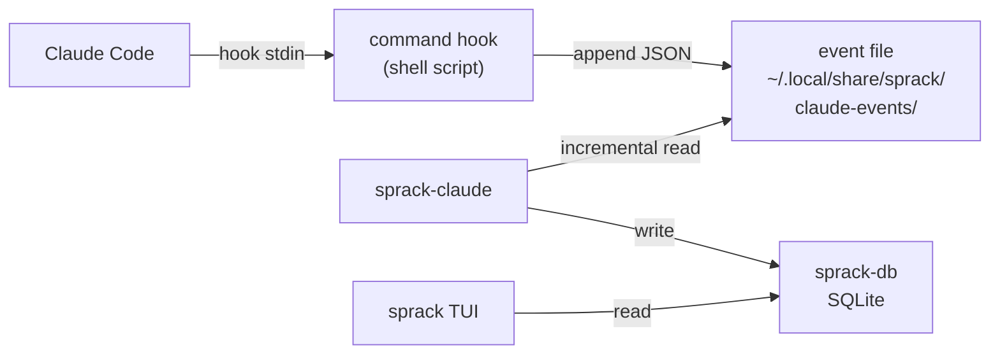
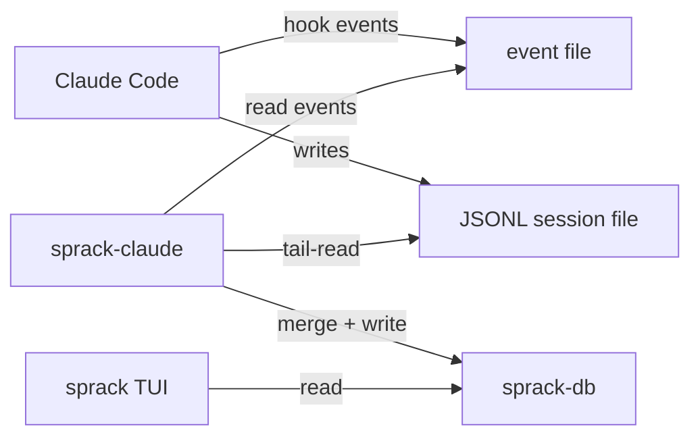

---
first_authored:
  by: "@claude-opus-4-6"
  at: 2026-03-24T19:30:00-07:00
task_list: terminal-management/sprack-claude-plugin
type: report
state: live
status: review_ready
tags: [sprack, claude_code, mcp, hooks, architecture, plugin]
---

# sprack Claude Code Plugin Analysis

> BLUF: A Claude Code hook-based event stream is the recommended approach for bridging session data to sprack.
> Hooks provide the highest-value data (task list progress, session purpose, per-tool-call events) with the lowest integration complexity: a single `PostToolUse` command hook appends structured JSON to a known file path, and sprack-claude reads it alongside the existing JSONL tail-reader.
> An MCP server is architecturally viable but solves the wrong problem: MCP servers expose data *to Claude*, not *from Claude* to external consumers.
> The JSONL reverse-engineering approach works for basic status but cannot provide task list state or semantic summaries, and its session file discovery depends on a fragile `/proc`-based resolution chain.
> The recommended path is a hybrid: hooks for rich metadata push, JSONL tail-reading for real-time activity state (thinking/tool_use/idle), with hooks gradually subsuming JSONL as the primary data source.

## Claude Code Extensibility Mechanisms

### Hooks

Claude Code supports 22 lifecycle hook events with four handler types (command, HTTP, prompt, agent).
Hooks are configured in `.claude/settings.json`, `.claude/settings.local.json`, `~/.claude/settings.json`, or plugin `hooks/hooks.json`.

The events most relevant to sprack data bridging:

| Event | Fires When | Key Input Data | Decision Power |
|-------|-----------|----------------|----------------|
| `SessionStart` | Session begins, resumes, clears, compacts | `session_id`, `cwd`, `model`, `transcript_path` | Can inject context |
| `PreToolUse` | Before each tool execution | `tool_name`, `tool_input`, `tool_use_id` | Can modify/block |
| `PostToolUse` | After each tool completes | `tool_name`, `tool_input`, `tool_response`, `tool_use_id` | Can inject context |
| `SubagentStart` | Subagent spawned | `agent_id`, `agent_type` | Observability only |
| `SubagentStop` | Subagent finishes | `agent_id`, `agent_type`, `last_assistant_message` | Can block completion |
| `Stop` | Main agent finishes responding | `last_assistant_message` | Can block stop |
| `TaskCompleted` | Task marked complete | `task_id`, `task_subject`, `task_description` | Can block completion |
| `SessionEnd` | Session terminates | `reason` | Cleanup only |
| `PostCompact` | After context compaction | `compact_summary` | Observability only |

All hook events receive common fields: `session_id`, `transcript_path`, `cwd`, `permission_mode`.

Command hooks receive the event JSON on stdin and return results via stdout/exit code.
They execute as subprocesses of the Claude Code process, inheriting its filesystem access and environment.
Timeout is configurable per hook (default varies by event; `SessionEnd` defaults to 1.5 seconds).

> NOTE(opus/sprack-claude-plugin): The `TaskCompleted` hook is particularly valuable: it fires with `task_id`, `task_subject`, and `task_description` whenever Claude marks a task done.
> Combined with `PostToolUse` matched on `TaskCreate` and `TaskUpdate` tool calls, hooks can capture the full task list lifecycle.

### MCP Servers

MCP servers run as subprocesses of Claude Code, communicating via stdio, HTTP, or SSE transport.
They expose tools, resources, and prompts that Claude can invoke during a session.

Configuration is via `claude mcp add` CLI or direct JSON in settings files.
Scoping: `user` (all projects), `project` (shared via `.mcp.json`), or `local` (gitignored).

Lifecycle: an MCP server starts when Claude Code starts a session and stops when the session ends.
The server process has full filesystem access within the container.
It can read and write files, including sprack-db's SQLite database.

The critical architectural mismatch: MCP servers expose capabilities *to Claude* (tools Claude can call, resources Claude can read).
They do not push data *from Claude* to external systems.
An MCP server cannot observe Claude's internal state (context usage, current thinking, tool calls in progress) unless Claude explicitly calls a tool the server exposes.

An MCP server *could* work as a data bridge if Claude were instructed (via CLAUDE.md or skill) to call a `report_status` tool periodically.
This is fragile: it depends on Claude remembering to call the tool, it consumes output tokens, and it interrupts the agent's workflow.

> WARN(opus/sprack-claude-plugin): MCP servers are pull-based from Claude's perspective: Claude calls the server's tools.
> There is no mechanism for an MCP server to observe Claude's behavior passively.
> Any "push" behavior requires Claude to actively call an MCP tool, which is unreliable and wasteful.

### Custom Slash Commands / Skills

Skills are prompt-based instructions stored in `.claude/skills/<name>/SKILL.md` or `.claude/commands/<name>.md`.
They can run inline or in a forked subagent context.

Skills cannot passively observe session state.
They execute when invoked (by the user or by Claude) and receive the conversation context at invocation time.
A skill could write a status snapshot to a file when invoked, but it has the same problem as MCP: it requires active invocation rather than passive observation.

Skills are useful as a complement: a `/sprack-status` skill could dump a rich snapshot on demand.
They are not suitable as the primary data bridge.

### The JSONL Session File Format

The JSONL session file is an implementation detail of Claude Code, not a documented API.
The format has been stable across observed versions, but there is no stability guarantee.
Changes to the JSONL schema would silently break sprack-claude's parsing.

The JSONL file contains all conversation entries: user messages, assistant responses (with model, usage, content blocks), tool calls (with full input/output), progress events, system entries, and sidechain (subagent) markers.

What the JSONL provides:
- Activity state (thinking/tool_use/idle): derivable from `stop_reason` on the last assistant entry.
- Context usage: derivable from `usage` blocks on assistant entries.
- Model name: present on assistant entries.
- Last tool used: present in content blocks on assistant entries.
- Subagent count: derivable from `agent_progress` entries.
- Custom title: present as a `custom-title` entry type.

What the JSONL does not easily provide:
- Task list state: `TaskCreate` and `TaskUpdate` appear as `tool_use`/`tool_result` pairs, but extracting the structured task list requires parsing tool call content (JSON within JSON), tracking create/update/complete transitions across the entire session, and handling task IDs.
- Session purpose summary: requires reading the full conversation and performing semantic extraction. The JSONL has no summary field.
- Compaction summary: after `/compact`, a `PostCompact` entry may contain a summary, but this is not always present and the format varies.

### Session File Discovery Fragility

The current resolution chain in `proc_walk.rs` and `session.rs`:

1. Walk `/proc/<pane_pid>/children` to find a process whose cmdline contains "claude".
2. Read `/proc/<claude_pid>/cwd` to get the project path.
3. Encode the path (replace `/` with `-`) to derive the session directory name.
4. Look up `~/.claude/projects/<encoded-path>/sessions-index.json` for the active session file.

This chain has two fragilities:
- **`/proc/children` availability**: The current container kernel exposes children at `/proc/<pid>/task/<tid>/children`, not `/proc/<pid>/children`. This is a known bug (documented in the container boundary analysis).
- **Path encoding dependency**: If the devcontainer `workspaceFolder` changes (e.g., from `/workspaces/lace/main` to `/workspace`), the encoded path changes, and the resolution chain points to a different (possibly nonexistent) session directory. The encoding scheme is an undocumented implementation detail of Claude Code.

> NOTE(opus/sprack-claude-plugin): A hook-based approach sidesteps both fragilities entirely.
> The hook knows its own `session_id` and `transcript_path`: it does not need to discover the session file through `/proc` walking or path encoding.

## Data Comparison: Plugin vs JSONL

| Data Point | JSONL Tail-Read | Hook-Based | MCP Server |
|-----------|----------------|------------|------------|
| Activity state (thinking/tool_use/idle) | Direct: `stop_reason` on last entry | Indirect: infer from `PostToolUse`/`Stop` events | Not available passively |
| Context usage (%) | Direct: `usage` on assistant entries | Not in hook input data | Not available |
| Model name | Direct: `message.model` | Available in `SessionStart` only | Not available |
| Subagent count | Derivable from `agent_progress` entries | Direct: `SubagentStart`/`SubagentStop` events | Not available |
| Last tool used | Direct: content blocks on assistant entry | Direct: `PostToolUse` `tool_name` | Not available |
| Task list state | Requires parsing tool_use content for TaskCreate/TaskUpdate calls | Direct: `TaskCompleted` event has `task_id`, `task_subject`, `task_description`; `PostToolUse` on TaskCreate/TaskUpdate has full tool response | Requires Claude to call a reporting tool |
| Session purpose/summary | Not available (no summary field) | Available via `PostCompact` `compact_summary` or `Stop` `last_assistant_message` | Requires Claude to call a reporting tool |
| Custom title | Available as entry type | Not in hook input data | Not available |
| Session start/end lifecycle | Derivable from file existence/modification | Direct: `SessionStart`, `SessionEnd` events | Server lifecycle mirrors session |
| Workspace path | Must derive via `/proc/cwd` | Direct: `cwd` field on all hook events | Not available |

Key observations:
- Hooks provide **task list state** and **session purpose** that JSONL cannot easily provide.
- JSONL provides **context usage** and **model name** that hooks do not carry.
- Hooks provide `session_id` and `cwd` directly, eliminating the `/proc` resolution chain.
- Neither approach alone covers all desired data points.

## Architecture Options

### Option A: Hook-Based Event Stream

A command hook on `PostToolUse` (and optionally `SessionStart`, `SubagentStart`, `SubagentStop`, `TaskCompleted`, `Stop`, `SessionEnd`) appends structured JSON events to a known file path (e.g., `~/.local/share/sprack/claude-events/<session_id>.jsonl`).

sprack-claude reads this event file using its existing incremental-read infrastructure.



The hook script is minimal: read stdin, extract relevant fields, append a JSON line to the event file.
Example:

```bash
#!/bin/bash
# PostToolUse hook - append event to sprack event file
EVENT_DIR="$HOME/.local/share/sprack/claude-events"
mkdir -p "$EVENT_DIR"
cat | jq -c '{
  ts: now | todate,
  event: .hook_event_name,
  session_id: .session_id,
  cwd: .cwd,
  tool: .tool_name,
  tool_input: .tool_input
}' >> "$EVENT_DIR/$(cat | jq -r .session_id).jsonl"
```

> NOTE(opus/sprack-claude-plugin): The hook script must be fast (default timeout applies per event).
> File append is O(1) and does not block Claude's agentic loop.
> The `jq` extraction adds ~5ms per invocation.

**Advantages:**
- Passive observation: no changes to Claude's behavior or prompts.
- Direct access to task lifecycle events (`TaskCompleted`, `PostToolUse` on TaskCreate/TaskUpdate).
- `session_id` and `cwd` provided directly: eliminates `/proc` walk and path encoding fragility.
- Event file path is under sprack's control: no dependency on Claude Code's internal file layout.
- Works with the existing sprack-claude incremental-read infrastructure.

**Disadvantages:**
- Does not provide context usage or model name (these are not in hook input data).
- Requires hook configuration in `.claude/settings.json` or `.claude/settings.local.json`.
- Hook execution adds latency to each tool call (typically <10ms for a file append).
- Hook errors (script crash, disk full) are non-fatal to Claude Code but lose data silently.

### Option B: MCP Server as Data Bridge

An MCP server exposes a `report_status` tool that Claude calls periodically.
The server writes the reported data to sprack-db or a shared file.

**Advantages:**
- Can capture any data Claude has access to, including task list state and semantic summaries.
- Server lifecycle matches session lifecycle: starts and stops with Claude Code.
- Server has full filesystem access.

**Disadvantages:**
- Requires Claude to actively call the tool, consuming output tokens and potentially interrupting workflow.
- Unreliable: Claude may forget to call the tool, especially during complex multi-step tasks.
- Requires CLAUDE.md instructions ("always call report_status after completing a task"), which are fragile.
- Cannot passively observe activity state transitions (thinking/tool_use/idle).
- Adds complexity: MCP server implementation, protocol handling, tool registration.

### Option C: Hybrid (Hooks + JSONL)

Use hooks for rich metadata (task list, session lifecycle, subagent tracking) and JSONL tail-reading for real-time activity state (thinking/tool_use/idle, context usage, model name).

sprack-claude merges data from both sources:
- The event file provides task progress, subagent start/stop, session identity, and workspace path.
- The JSONL tail-reader provides activity state, context percent, model, and last tool.



**Advantages:**
- Covers all desired data points: hooks provide what JSONL cannot, JSONL provides what hooks cannot.
- Graceful degradation: if hooks are not configured, sprack-claude falls back to JSONL-only (current behavior). If JSONL changes format, hooks still provide task and lifecycle data.
- Incremental adoption: hooks can be added without removing the JSONL reader.
- Session file discovery via hooks (`session_id` + `cwd`) can replace the `/proc` walk, fixing the workspace path fragility.

**Disadvantages:**
- Two data sources to maintain and reconcile.
- The JSONL reader remains coupled to an undocumented format.
- Complexity of merging event streams with different update frequencies.

### Option D: Status Quo (JSONL Only)

Keep the current JSONL reverse-engineering approach.
Accept the limitations: no task list, no summary, fragile session discovery.

**Advantages:**
- No new dependencies or configuration.
- Already implemented and tested.

**Disadvantages:**
- Cannot provide task list progress or session purpose summary.
- Session file discovery depends on `/proc` walk and path encoding, both fragile.
- JSONL format is undocumented and could change.
- Limits the sprack Claude widget to basic status (state, model, context %, last tool, subagent count).

## Recommendation

**Option C (hybrid) is the recommended approach**, with hooks as the primary investment and JSONL as the fallback.

### Rationale

1. **Hooks solve the workspace path fragility.** The `cwd` and `session_id` fields in hook input data directly provide the information that the `/proc` walk and path encoding chain derive indirectly. With hooks, sprack-claude can associate a session with a pane without walking the process tree. The `/proc` walk can be retained as a fallback for when hooks are not configured.

2. **Hooks enable the rich dashboard the user wants.** Task list progress (`TaskCompleted`, `PostToolUse` on TaskCreate/TaskUpdate) and session purpose (derivable from `PostCompact.compact_summary` or `Stop.last_assistant_message`) are available only through hooks. JSONL requires full-conversation semantic parsing for summaries and complex tool-call-content parsing for task lists.

3. **JSONL remains valuable for real-time state.** Activity state (thinking/tool_use/idle) changes multiple times per second during active generation. The JSONL tail-reader captures this with 2-second polling granularity. Hooks fire only on discrete events (tool calls, agent start/stop), not on the continuous thinking/generating state. Context usage and model name are also JSONL-only data points.

4. **The hybrid approach degrades gracefully.** Users who do not configure hooks get the current JSONL-only behavior. Users who add the hook configuration get the full rich dashboard. This makes adoption incremental and non-breaking.

5. **Hooks are a documented, supported API surface.** Unlike the JSONL format, hooks are a first-class Claude Code feature with documented schemas, versioned configuration, and explicit lifecycle guarantees. Building on hooks is more defensible than building on JSONL reverse-engineering.

### Risks

- **Hook API stability.** Claude Code's hook system is actively evolving (22 events as of March 2026). Event schemas could change across versions. The mitigation: use lenient deserialization (`serde(default)`) and treat hook data as supplemental rather than required.
- **Hook configuration burden.** Users must add hook entries to their Claude Code settings. Mitigation: provide a `claude mcp add`-style setup command or a `.claude/settings.local.json` template. A lace devcontainer feature could auto-configure the hooks.
- **Dual data source complexity.** Merging JSONL and hook data requires reconciliation logic (e.g., matching hook `session_id` to JSONL session files). Mitigation: the hook event file is keyed by `session_id`, and the JSONL reader already resolves to a specific session file. Merging happens at the `ClaudeSummary` level: JSONL provides base fields, hooks augment with task/lifecycle data.
- **Hook execution latency.** Each tool call fires `PostToolUse`, adding hook execution time. For a file-append hook, this is <10ms. For complex processing, timeouts protect Claude Code. Mitigation: keep the hook script minimal (append only, no processing).

### Implementation Sketch

**Phase 1: Hook event writer.**
Create a shell script (or small Rust binary) that reads hook stdin and appends a structured event to `~/.local/share/sprack/claude-events/<session_id>.jsonl`.
Configure hooks in `.claude/settings.local.json` for `PostToolUse`, `SessionStart`, `SessionEnd`, `SubagentStart`, `SubagentStop`, `TaskCompleted`, and `PostCompact`.

**Phase 2: sprack-claude event reader.**
Add an event file reader to sprack-claude alongside the JSONL reader.
On each poll cycle, read new events from the event file and merge into the `ClaudeSummary`.
Extend `ClaudeSummary` with new fields: `tasks` (list of task subjects with status), `session_summary` (from compact), `session_purpose` (derived from first user message or custom title).

**Phase 3: Session discovery via hooks.**
When a `SessionStart` event is received, record the `session_id` to pane mapping directly (using `cwd` to match against tmux pane `current_path`).
This bypasses the `/proc` walk for hook-configured sessions.
Retain the `/proc` walk as fallback.

**Phase 4: Rich TUI widget.**
Extend the sprack TUI to render multi-line Claude status displays using the enriched `ClaudeSummary`.
Show task list progress, subagent status, context trends, and session purpose.

## Related Documents

| Document | Relationship |
|----------|-------------|
| [sprack-claude proposal](../proposals/2026-03-21-sprack-claude.md) | Current architecture being augmented |
| [Container boundary analysis](2026-03-24-sprack-claude-container-boundary-analysis.md) | Deployment constraints for all-in-container architecture |
| [Inline summaries proposal](../proposals/2026-03-24-sprack-inline-summaries.md) | TUI rendering that consumes the enriched data |
| [Workspace system context RFP](../proposals/2026-03-24-workspace-system-context.md) | Related: hooks could also provide workspace context |

## Sources

- [Claude Code Hooks Reference](https://code.claude.com/docs/en/hooks)
- [Claude Code MCP Documentation](https://code.claude.com/docs/en/mcp)
- [Claude Code Skills Documentation](https://code.claude.com/docs/en/slash-commands)
