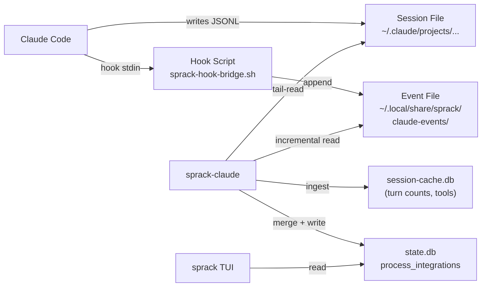

---
first_authored:
  by: "@claude-opus-4-6-20250725"
  at: 2026-03-25T20:17:00-07:00
task_list: sprack/claude-state-rearchitecture
type: report
state: live
status: review_ready
tags: [sprack, claude_code, architecture, investigation]
---

# Sprack Claude State Collection: Rearchitecture Analysis

> BLUF: sprack-claude's dual-source architecture (JSONL file inspection + hook event bridge) is fundamentally sound in its design rationale, but the implementation has accumulated complexity that produces real bugs: turn count inflation, task display inconsistency, session name resolution divergence, and stale task persistence.
> A hooks-only approach is not viable because hooks cannot provide real-time activity state (thinking/tool_use/idle) or context window usage.
> A JSONL-only approach is not viable because JSONL cannot provide task list state or session purpose summaries.
> The recommended path is to stabilize the current hybrid approach with targeted fixes, while progressively shifting session discovery to be hook-primary (eliminating `/proc` walk and bind-mount resolution for hook-enabled sessions).
> A deeper rearchitecture (MCP server, tmux status line scraping, or Claude Code upstream API) is not justified by the current bug profile.

## Context / Background

sprack-claude is a polling daemon that monitors Claude Code sessions running in tmux panes.
It collects state through two mechanisms:

1. **Direct file inspection**: reads Claude Code's JSONL session files from `~/.claude/projects/`, parses entries, maintains a session cache DB (`session-cache.db`) for aggregated metrics (turn counts, tool usage, context trends).
2. **Hook event bridge**: a shell script hook (`sprack-hook-bridge.sh`) deployed via `~/.claude/settings.local.json` writes per-session JSONL event files to `~/.local/share/sprack/claude-events/`. Events include `SessionStart`, `PostToolUse` (filtered to TaskCreate/TaskUpdate), `TaskCompleted`, `SubagentStart/Stop`, `PostCompact`, and `SessionEnd`.

The merged `ClaudeSummary` struct synthesizes data from both sources into a single JSON blob written to the `process_integrations` table in `state.db`, consumed by the TUI.

Managing two data sources has produced several bugs documented in the troubleshooting memory:

- **Turn count inflation**: re-ingesting the JSONL tail on daemon restart double-counts entries. The `ingestion_state` table with byte-offset tracking was added to fix this, but the fix requires the `ingest_new_entries_at` path to be called with the correct offset.
- **Task display inconsistency**: tool counts from the session cache (JSONL-derived) vs actual task state from hook events (hook-derived) can show different views of progress.
- **Session name resolution differences**: `customTitle` from `sessions-index.json` (file-based) vs `cwd` from hook events vs `slug` from JSONL entries can produce different display names.
- **Stale completed tasks**: `merge_hook_events` replays all cached hook events on every poll cycle. Tasks marked `Completed` in prior turns persist in the display because the accumulated `cached_hook_events` vector is never pruned.
- **Same-project session deduplication**: multiple Claude instances in the same project directory resolve to the same JSONL file (selected by mtime), showing identical summaries. The hook bridge provides `session_id` that could differentiate them, but the wiring is incomplete.

This report assesses whether a deeper rearchitecture is warranted, or whether targeted stabilization of the current approach is the better path.

## Key Findings

### 1. The dual-source design is not accidental complexity

The [plugin analysis report](../reports/2026-03-24-sprack-claude-code-plugin-analysis.md) evaluated four options (hooks-only, MCP server, hybrid hooks+JSONL, JSONL-only) and recommended hybrid for a clear reason: **neither source alone covers all desired data points**.

| Data Point | JSONL | Hooks |
|-----------|-------|-------|
| Activity state (thinking/tool_use/idle) | Direct | Not available in real-time |
| Context usage (%) | Direct | Not in hook input data |
| Model name | Direct | SessionStart only |
| Task list state | Requires complex parsing | Direct |
| Session purpose/summary | Not available | Direct via PostCompact |
| Workspace path | Must derive via /proc | Direct on all events |
| Custom title | Available | Not in hook input data |

This table has not changed since the analysis was written.
No new Claude Code extensibility mechanism has emerged that collapses both columns into one.

### 2. The bugs are reconciliation bugs, not architectural bugs

All five documented bugs stem from the same pattern: two data sources with overlapping but inconsistent coverage, and imperfect reconciliation logic in `main.rs`.

- Turn count inflation: the session cache's `ingestion_state` byte-offset tracking is the correct fix. The bug is that `tail_read` on initial read re-covers bytes already in the cache. This is a one-line fix (seed `file_position` from cached offset).
- Task display inconsistency: the `ClaudeSummary` has both `tool_counts` (from session cache/JSONL) and `tasks` (from hook events). These are different data: tool_counts is cumulative tool call frequency, tasks is the Claude task list. The inconsistency is a TUI presentation issue, not a data model issue.
- Session name resolution: three sources (`customTitle`, hook `cwd`, JSONL `slug`) serve different purposes. The priority order (customTitle > slug > cwd) is correct but the fallback chain has edge cases when customTitle is absent and slug arrives after the first poll cycle.
- Stale completed tasks: `cached_hook_events` grows monotonically. Fix: prune completed tasks after a `SessionEnd` event, or filter completed tasks from the display at render time.
- Same-project deduplication: already has the correct solution path (use `hook_session_id` to differentiate). The `SessionStart` hook carries `transcript_path` which pins a pane to a specific JSONL file.

None of these require rearchitecting the data collection approach.

### 3. Alternative approaches assessed

#### 3a. Hooks-only (eliminate JSONL reading)

Hooks fire on discrete events, not on continuous state transitions.
Between tool calls, Claude Code may be thinking for 30+ seconds.
The JSONL file reflects this via the last assistant entry's `stop_reason: null` (thinking), which the tail-reader catches on the next 2-second poll.
Hooks have no equivalent: there is no `ThinkingStart` or `GeneratingStart` hook event.

Additionally, context window usage (`input_tokens + cache_read + cache_creation`) is only available on assistant entries in the JSONL file.
Hooks do not carry token usage data.

A hooks-only approach would lose: activity state transitions (the primary TUI indicator), context usage percentage, context trend (rising/falling/stable), and the model name on every turn.
These are the most-viewed pieces of data in the TUI.

**Verdict: not viable without upstream Claude Code changes.**

#### 3b. JSONL-only (eliminate hooks)

The JSONL file contains `TaskCreate`/`TaskUpdate` as tool_use/tool_result pairs, but extracting structured task state requires:
- Parsing tool call content (JSON within JSON in content blocks).
- Tracking create/update/complete transitions across the full session.
- Correlating task IDs across tool_use and tool_result pairs.
- Handling compact summary re-statements that duplicate earlier task operations.

This is doable but fragile: the internal tool names and response shapes are undocumented.
The hook bridge already solved this problem by capturing structured task lifecycle events directly from Claude Code's hook system.

Session purpose summaries are not available from JSONL at all.
The `PostCompact` hook carries `compact_summary`, a natural-language description of the session's work.
No JSONL entry contains an equivalent field.

**Verdict: loses task list and session purpose. The incremental session cache already does the best possible JSONL-only extraction for turn counts and tool usage.**

#### 3c. Claude Code MCP server approach

The [plugin analysis report](../reports/2026-03-24-sprack-claude-code-plugin-analysis.md) evaluated this and rejected it:

> MCP servers expose capabilities *to Claude* (tools Claude can call, resources Claude can read). They do not push data *from Claude* to external systems. An MCP server cannot observe Claude's internal state unless Claude explicitly calls a tool the server exposes.

An MCP server that Claude calls to `report_status` is:
- Unreliable (Claude may forget).
- Wasteful (consumes output tokens on every call).
- Intrusive (interrupts the agent's workflow to call a reporting tool).
- No better than hooks for real-time state (thinking/idle transitions happen between tool calls).

**Verdict: architecturally mismatched. MCP servers are pull-based from Claude's perspective.**

#### 3d. Watching Claude Code's tmux status line output

The original sprack-claude proposal mentions a `@claude_status` tmux user option as a future consideration:

> If Claude Code sets a tmux user option (e.g., `@claude_status`) with its current state, sprack-claude becomes trivial: read the option from the sessions or panes table.

Claude Code does not set any tmux user options.
This would require an upstream feature request.
Even if adopted, the status line typically shows a narrow summary (model, thinking/idle) without task lists, context percentages, or tool usage history.

**Verdict: not available without upstream changes, and likely insufficient in data richness.**

#### 3e. Claude Code upstream status API / socket

Claude Code does not expose a status API, Unix socket, or structured output endpoint for external consumers.
The `claude` CLI has subcommands (`claude api-key`, `claude config`, etc.) but no `claude status` or `claude session-info` command.

There is no known development toward such an API.
Building on this hypothetical would be betting on an unannounced feature.

**Verdict: does not exist.**

### 4. The hook bridge is working and addresses the core fragilities

The hook bridge is deployed and functional (`packages/sprack/hooks/sprack-hook-bridge.sh`).
The `events.rs` module reads event files incrementally, and `merge_hook_events` synthesizes task list, session summary, and session purpose into `ClaudeSummary`.

The `SessionStart` hook event carries `transcript_path`, which is the exact JSONL session file path.
The `main.rs` code at lines 254-303 already handles this: when a `SessionStart` event provides a `transcript_path` that differs from the current `session_file`, it switches to the correct file and re-reads.
This is the mechanism that eliminates `/proc` walk fragility for hook-enabled sessions.

The resolver code has two explicit TODO comments flagging the bind-mount resolution as a fallback to be removed once hooks are fully wired:

```
// TODO(opus/sprack-hooks): Remove this bind-mount resolution fallback
// once hook event bridge is implemented.
```

### 5. Existing related RFPs and proposals

Three existing documents are directly relevant:

1. **[RFP: Claude Code SQLite Mirror](../proposals/2026-03-24-claude-code-sqlite-mirror.md)** (`status: request_for_proposal`): proposes full-fidelity JSONL ingestion into SQLite. The incremental session cache is the lightweight precursor. The full mirror would simplify sprack-claude further by moving all JSONL parsing into a shared daemon, but it is a large undertaking and not necessary for the current bug fixes.

2. **[RFP: Decouple Sprack from Lace-Specific Details](../proposals/2026-03-25-rfp-sprack-lace-decoupling.md)** (`status: request_for_proposal`): explores replacing lace-specific tmux metadata and bind-mount assumptions with pluggable discovery. Direction 2 ("Hook Event Bridge as Primary Data Source") is the most relevant: it proposes making hooks the authoritative source of session data, eliminating the `~/.claude/projects/` enumeration and `sessions-index.json` parsing. This aligns with the TODO comments in `resolver.rs`.

3. **[Sprack Hook Event Bridge](../proposals/2026-03-24-sprack-hook-event-bridge.md)** (`status: implementation_wip`): the implemented proposal. Its "Complementarity with JSONL Tail-Reading" section explicitly documents why both sources are necessary and defines the merge contract.

No existing RFP specifically proposes "consolidate to a single data source."
The lace-decoupling RFP comes closest, but its scope is broader (container detection, tmux metadata, bind mounts) and its Direction 2 acknowledges that hooks alone cannot replace JSONL for activity state.

## Architecture Assessment

### Current data flow



Three databases, two file-based data sources, one merge point in `process_claude_pane`.
The complexity is real, but each component exists for a specific reason:

- `state.db`: shared between sprack-poll, sprack-claude, and the TUI. Fast reads, small data. Cannot be bloated with session history.
- `session-cache.db`: persistent across restarts, avoids re-parsing JSONL. Stores only aggregated counters, not message content.
- Event files: per-session JSONL written by the hook bridge. Read incrementally by sprack-claude.

### Strengths of the current approach

1. **Works without any Claude Code changes.** The JSONL reader reverse-engineers publicly visible files. The hook bridge uses the documented hooks API. No upstream cooperation required.
2. **Graceful degradation.** Without hooks, sprack-claude falls back to JSONL-only mode (the original behavior). This makes adoption incremental.
3. **Data complementarity is well-documented.** The hook event bridge proposal includes a detailed table of which data comes from which source. The merge logic is explicit.
4. **Test coverage is thorough.** Session file discovery, event parsing, summary building, and cache ingestion all have unit tests with mock filesystems and in-memory databases.
5. **The hook bridge is intentionally minimal.** The shell script is 91 lines, does one thing (extract and append), and completes in under 25ms. It adds negligible latency to Claude Code's tool call loop.

### Weaknesses and complexity costs

1. **Session state is reconstructed from scratch each poll cycle.** `build_summary` re-derives state from the JSONL tail, then `merge_hook_events` overlays task/summary data from the accumulated event vector. There is no persistent "current session state" object that is updated incrementally.
2. **The cached_hook_events vector grows monotonically.** All events from session start are replayed on every merge. For long sessions with many task operations, this produces stale completed tasks in the display and growing memory usage.
3. **Session file switching (hook transcript_path override) re-reads from scratch.** When a `SessionStart` event provides a different `transcript_path`, the code resets `file_position` to 0 and re-reads the entire tail. This can re-ingest entries already in the session cache if the byte-offset deduplication does not catch the re-read.
4. **Three different name resolution paths.** `customTitle` from `sessions-index.json`, `slug` from JSONL entries, and `cwd` from hook events. The priority logic works but the fallback chain is spread across `process_claude_pane` (lines 233-237), `build_summary` (line 288), and `merge_hook_events` (lines 267-271).

## Recommendations

### 1. Stabilize, do not rearchitect

The current bug profile does not justify a rearchitecture.
Every documented bug has a targeted fix within the existing architecture:

| Bug | Fix | Scope |
|-----|-----|-------|
| Turn count inflation | Seed `file_position` from `ingestion_state.byte_offset` on cache hit | `main.rs`, 5-10 lines |
| Stale completed tasks | Prune `cached_hook_events` on `SessionEnd`, or filter completed tasks >N minutes old | `main.rs` or `events.rs`, 10-15 lines |
| Session name fallback | Consolidate name resolution into a single function with explicit priority chain | `status.rs`, new function, 15-20 lines |
| Same-project dedup | Use `hook_session_id` to differentiate instances; already partially wired | `main.rs`, extend existing logic |
| Task vs tool_counts display | TUI-side fix: render `tasks` and `tool_counts` as distinct widgets with clear labels | TUI code, not sprack-claude |

Total estimated effort for all five fixes: 1-2 sessions.
A rearchitecture would take 5-10 sessions and risk introducing new bugs.

### 2. Make hooks the primary session discovery path

The TODO comments in `resolver.rs` are correct: the bind-mount resolution fallback should be gated behind a "hooks not available" check.
When `hook_transcript_path` is set, the `SessionFileState.session_file` should be authoritative and the `/proc` walk + `sessions-index.json` path should not execute.

This is an incremental change, not a rearchitecture.
It reduces the fragility surface for hook-enabled sessions while preserving the fallback for environments without hooks.

### 3. Add a `SessionState` object to replace per-cycle reconstruction

The current pattern of rebuilding `ClaudeSummary` from scratch each cycle and then overlaying hook data is the root of most reconciliation bugs.
Introducing a persistent `SessionState` struct that is updated incrementally (new JSONL entries update activity state and context; new hook events update tasks and summary) would simplify the merge logic and eliminate stale-data bugs.

This is a moderate refactor (not a rearchitecture) and could be done after the targeted fixes.

### 4. Defer the full SQLite mirror

The [Claude Code SQLite Mirror RFP](../proposals/2026-03-24-claude-code-sqlite-mirror.md) is architecturally interesting but solves a different problem (analytics, search, cost tracking, session replay).
It would not simplify the real-time status pipeline that sprack-claude serves.
The incremental session cache already provides the aggregated data sprack-claude needs.

### 5. Watch for upstream Claude Code status exposure

If Claude Code ever exposes a status API, Unix socket, or tmux user option, sprack-claude could simplify dramatically.
This is worth monitoring but not worth betting on.

## Cross-References

| Document | Relationship |
|----------|-------------|
| [Plugin analysis report](../reports/2026-03-24-sprack-claude-code-plugin-analysis.md) | Evaluated extensibility options; recommended hybrid |
| [Hook event bridge proposal](../proposals/2026-03-24-sprack-hook-event-bridge.md) | Defines the hook data source; `status: implementation_wip` |
| [Incremental session cache](../proposals/2026-03-24-sprack-claude-incremental-session-cache.md) | Defines the JSONL ingestion cache; `status: wip` |
| [RFP: Claude Code SQLite Mirror](../proposals/2026-03-24-claude-code-sqlite-mirror.md) | Full-fidelity mirror; deferred |
| [RFP: Lace decoupling](../proposals/2026-03-25-rfp-sprack-lace-decoupling.md) | Broader decoupling from lace internals |
| [Sprack troubleshooting memory](project_sprack_troubleshooting.md) | Documents the three critical bugs fixed 2026-03-25 |
| [sprack-claude proposal](../proposals/2026-03-21-sprack-claude.md) | Original architecture design |
