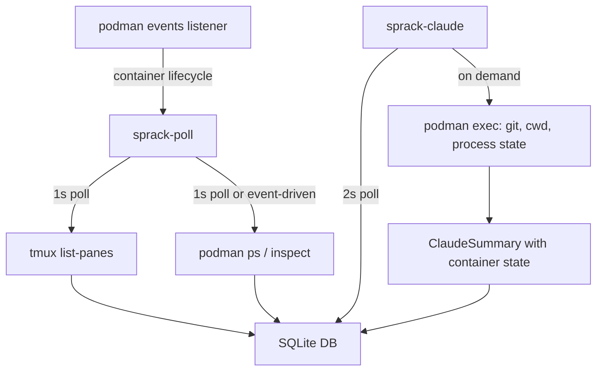

---
first_authored:
  by: "@claude-opus-4-6-20250725"
  at: 2026-03-26T12:00:00-07:00
task_list: sprack/podman-state-sharing
type: report
state: archived
status: done
tags: [sprack, podman, container, architecture, analysis]
---

# Podman Direct Exec as a State-Sharing Mechanism for Sprack

> BLUF: Replacing SSH-based container interaction with podman direct exec (`podman exec`, `podman inspect`, `podman top`, `podman events`) would eliminate three of the four coupling layers identified in the lace decoupling RFP, provide reliable process-to-container mapping without PID namespace traversal, and enable container-side git context that is currently blocked.
> The approach requires the host to have the container runtime CLI available and the ability to map tmux panes to container IDs, but both are already achievable with existing lace-discover infrastructure.
> The main risk is coupling sprack to a specific container runtime (podman/docker), which the decoupling RFP explicitly aims to avoid: a `ContainerBackend` trait boundary would mitigate this.

## Context / Background

Sprack is a tmux status bar and information display tool in `packages/sprack`.
It needs container-side information: working directories, git state, process info, Claude Code session data.
Getting this information reliably through the current SSH+tmux+bind-mount layers has been a persistent source of fragility.

Three RFPs document the specific pain points:
- `cdocs/proposals/2026-03-25-rfp-sprack-lace-decoupling.md`: four coupling layers between sprack and lace internals.
- `cdocs/proposals/2026-03-25-rfp-stale-tmux-lace-metadata.md`: stale `@lace_port` and incomplete `@lace_workspace` after container rebuilds.
- `cdocs/proposals/2026-03-25-rfp-sprack-git-context-iteration.md`: container panes produce no git context because resolution is PID-keyed and local-only.

The current architecture requires the host to reach into containers indirectly: through tmux session options (`@lace_port`, `@lace_user`, `@lace_workspace`), the `~/.claude` bind mount, and SSH probes.
This report analyzes whether podman's direct APIs and CLI could provide a more straightforward path.

## Key Findings

- **The core architectural problem is indirection**: sprack on the host cannot see container-internal state directly.
  It relies on three intermediate layers (tmux metadata, bind mounts, SSH) that each introduce their own failure modes.
  Podman exec bypasses all three by executing queries directly in the container's namespace.

- **`podman exec` provides the exact information sprack needs**: working directory (`readlink /proc/1/cwd` or `pwd`), process listing (`ps aux`), git state (`git rev-parse --short HEAD`, `git branch`), and file reads.
  A single `podman exec <container> sh -c 'commands'` call can return all state sprack needs for a pane in one round-trip.

- **`podman inspect` solves the stale metadata problem**: container state (running/stopped/restarted), port mappings, workspace paths, and mount configurations are all available from `podman inspect` without requiring tmux option synchronization.
  Port staleness after rebuild becomes a non-issue because the source of truth shifts from tmux metadata to the container runtime.

- **`podman events` enables reactive state updates**: instead of polling tmux options and hoping they are fresh, sprack could subscribe to container lifecycle events (start, stop, die, restart) via `podman events --filter type=container --format json`.
  This would provide sub-second awareness of container state changes.

- **`podman top` gives process visibility without PID namespace traversal**: `podman top <container> -ef` lists all processes inside the container with their PIDs, commands, and working directories.
  This eliminates the `/proc` walking that fails across PID namespace boundaries.

- **Container-to-pane mapping is the key prerequisite**: the main challenge is mapping a tmux pane to the correct container.
  The current approach uses `@lace_port` as the bridge.
  With podman, the mapping could use the `lace.project_name` label (already set by lace) or the container ID.

## Current State: How Sprack Gathers Container-Side Info

### sprack-poll (tmux state)

`sprack-poll` queries tmux via `tmux list-panes -a -F` every 1 second (`packages/sprack/crates/sprack-poll/src/tmux.rs`).
For each session, it reads lace metadata via `tmux show-options -qvt $session @lace_port/user/workspace`.
This metadata is written by `lace-into` at connection time and never refreshed.

Failure modes:
- `@lace_port` becomes stale after container rebuild (port changes, session persists).
- `@lace_workspace` is sometimes empty while `@lace_port` is set (race condition in `lace-into`).
- Metadata is write-once: no mechanism to detect or correct staleness.

### sprack-claude (Claude Code session resolution)

`sprack-claude` (`packages/sprack/crates/sprack-claude/src/resolver.rs`) uses two resolution strategies:

**Local panes** (`LocalResolver`): Walks `/proc` from the pane's shell PID to find a child process whose cmdline contains "claude", reads its cwd, encodes the path, and looks up `~/.claude/projects/<encoded>/`.
This works only within the same PID namespace.

**Container panes** (`LaceContainerResolver`): Reads `@lace_workspace` from the session's tmux options, encodes it as a prefix, enumerates directories in `~/.claude/projects/` matching that prefix, and selects the one with the most recently modified `.jsonl` file.
This depends on:
1. `@lace_workspace` being set and correct.
2. The `~/.claude` directory being bind-mounted between host and container.
3. Claude Code's internal path encoding scheme (`/` replaced with `-`).
4. Claude Code's `sessions-index.json` and `.jsonl` file layout.

Failure modes:
- Missing `@lace_workspace` causes silent resolution failure (`resolver.rs` line 138: `self.session.lace_workspace.as_deref()?`).
- Path encoding is not bijective (`/workspaces/lace-main` and `/workspaces/lace/main` both encode to `-workspaces-lace-main`).
- Prefix matching selects the wrong worktree when multiple are active with similar mtimes.
- `sessions-index.json` `fullPath` entries use container-internal absolute paths that do not resolve on the host.
- 5-minute recency threshold (`CONTAINER_RECENCY_THRESHOLD`) can miss sessions during idle periods.

### Git context (disabled for containers)

Git context resolution (`packages/sprack/crates/sprack-claude/src/git.rs`) reads `.git/HEAD` and ref files directly from the filesystem.
It is gated on `CacheKey::Pid(_)` (`main.rs` line 335), so container panes produce no git context at all.

The git context RFP (`2026-03-25-rfp-sprack-git-context-iteration.md`) explicitly states: "Container panes use `CacheKey::ContainerSession` and are skipped by the git resolver entirely."
The blocker is that sprack-claude runs on the host and the container-internal workspace path cannot be used directly for git operations.

### Non-Claude SSH panes

For container panes not running Claude Code, sprack shows only "ssh" as the process name.
The SSH integration RFP (`2026-03-24-sprack-ssh-integration.md`) proposes a `sprack-ssh` daemon, but it has not been implemented.
Its Option D already mentions podman as a data source: "podman inspect gives the merged filesystem root; avoid SSH overhead but couples to the container runtime."

## Podman Capabilities for State Sharing

### `podman exec`: Direct command execution

`podman exec <container> <command>` runs a command inside the container's namespace with access to its filesystem, process table, and network.
No SSH, no key management, no port mapping required.

What sprack needs and how podman exec provides it:

| Need | Current approach | Podman exec equivalent |
|------|-----------------|----------------------|
| Claude process cwd | `/proc` walk from host (fails across PID namespace) | `podman exec <c> readlink /proc/$(pgrep -n claude)/cwd` |
| Active foreground command | tmux reports "ssh" (opaque) | `podman exec <c> ps -o comm= -p $(cat /proc/<shell_pid>/task/*/children)` |
| Container working directory | `@lace_workspace` tmux option (stale-prone) | `podman exec <c> pwd` or `podman inspect` env var |
| Git branch/commit | Disabled for containers | `podman exec -w <workspace> <c> git rev-parse --abbrev-ref HEAD` |
| Git dirty state | Not implemented | `podman exec -w <workspace> <c> git status --porcelain` |
| Session file listing | Bind mount + prefix matching + mtime heuristic | `podman exec <c> ls -t ~/.claude/projects/<path>/*.jsonl` |

Latency: `podman exec` to a local container is ~20-50ms, comparable to the bind-mount filesystem reads and faster than an SSH round-trip (~50-100ms).

### `podman inspect`: Container metadata

`podman inspect <container>` returns comprehensive JSON metadata including:

- **State**: `State.Status` (running/exited/paused), `State.StartedAt`, `State.Pid` (init PID in host namespace).
- **Mounts**: full bind mount table with source and destination paths.
- **Environment**: `Config.Env` including `CONTAINER_WORKSPACE_FOLDER`.
- **Labels**: `lace.project_name`, `devcontainer.local_folder`, `devcontainer.metadata`.
- **Ports**: `NetworkSettings.Ports` with host/container port mappings.

This is already used by `lace-discover` and `lace-inspect`.
The crucial difference from tmux metadata: `podman inspect` always reflects the current container state, not a cached snapshot from connection time.

### `podman top`: Process table without PID namespace traversal

`podman top <container> -ef` returns a process listing equivalent to `ps -ef` inside the container.
The output includes PID, PPID, CMD, and (with appropriate format flags) the current working directory.

This eliminates the need for `/proc` walking across PID namespace boundaries: the container runtime has access to the namespace and exposes the information directly.

### `podman events`: Reactive lifecycle awareness

`podman events --filter type=container --format json` streams container lifecycle events as they occur:
- `start`, `stop`, `die`, `restart`: detect container state transitions.
- `attach`, `exec`: detect when processes connect to containers.

sprack-poll could subscribe to this stream instead of (or in addition to) polling tmux options.
When a container restarts, the event provides the new container ID immediately.
This would replace the "stale metadata" problem entirely: the source of truth is the event stream, not a cached tmux option.

## Process-to-Container Mapping

The fundamental question: given a tmux pane, how does sprack determine which container (if any) it belongs to?

### Current approach: tmux session options

`lace-into` writes `@lace_port`, `@lace_user`, `@lace_workspace` to the tmux session.
`sprack-poll` reads these per session.
`sprack-claude` uses `lace_port.is_some()` as the signal that a session is container-connected.

Problems: metadata is stale after rebuild, workspace can be missing, no way to detect or refresh.

### Podman approach: container labels + process ancestry

Two complementary strategies:

**Strategy A: Label-based discovery.**
`lace-discover` already queries `docker ps --filter "label=lace.project_name"` to find running containers.
The project name maps to the tmux session name (set by `lace-into`).
sprack-poll could call `podman ps --filter label=lace.project_name --format json` alongside its tmux query to build a session-name-to-container-ID map.
No tmux metadata required.

**Strategy B: PID ancestry.**
`podman inspect --format '{{.State.Pid}}' <container>` returns the container's init PID in the host namespace.
When a tmux pane runs `ssh` into a container, the SSH client process on the host connects to a port that maps to the container's sshd.
The pane PID's process tree (visible in host `/proc`) includes the SSH client.
The SSH client's target port maps to a container via `podman port` or `podman inspect`.

Strategy A is simpler and more reliable.
It requires that the container has a `lace.project_name` label matching the tmux session name, which is already the case.

### Mapping table: session name to container ID

At each poll cycle, sprack-poll could build:

```
tmux session "lace" -> @lace_port 22427
podman container "abc123" -> label lace.project_name=lace, port 22427->2222
=> session "lace" maps to container "abc123"
```

The port is an additional cross-check, but the label-based name match is sufficient.
If the container is rebuilt, `podman ps` returns the new container ID with the same label.
No tmux option refresh needed.

## Impact on Specific Sprack Pain Points

### Pain point 1: Stale `@lace_port` after container rebuild

**Current**: `lace-into` sets port once; rebuild changes it; tmux retains old value; all splits fail.
**With podman**: Port is read from `podman inspect` on each poll cycle. Always current. tmux options become advisory, not authoritative.

### Pain point 2: Missing `@lace_workspace`

**Current**: `@lace_workspace` empty causes silent resolution failure in `find_candidate_panes` and `resolve_container_pane`.
**With podman**: Workspace is read from `CONTAINER_WORKSPACE_FOLDER` env var via `podman inspect`. Alternatively, `podman exec <c> pwd` gives the current working directory. No tmux metadata dependency.

### Pain point 3: No git context for container panes

**Current**: Git resolution requires host-side filesystem access to `.git`. Container panes are skipped.
**With podman**: `podman exec -w <workspace> <c> git rev-parse --abbrev-ref HEAD` and `podman exec -w <workspace> <c> git rev-parse --short HEAD` provide branch and commit directly from inside the container. No filesystem path translation needed.

### Pain point 4: Opaque SSH panes ("ssh" as process name)

**Current**: Non-Claude container panes show only "ssh". The SSH integration RFP proposes a separate daemon.
**With podman**: `podman top <c> -ef` or `podman exec <c> ps -eo pid,comm,cwd --no-headers` returns all processes. The foreground process of the shell associated with the SSH session can be identified by PID ancestry or by matching the tmux pane PID to the SSH session.

### Pain point 5: `~/.claude` bind mount and path encoding fragility

**Current**: Session file discovery depends on the bind mount being present, the path encoding matching Claude Code's internal scheme, and mtime heuristics selecting the right directory.
**With podman**: `podman exec <c> ls -t ~/.claude/projects/$(readlink /proc/$(pgrep -n claude)/cwd | tr '/' '-')/*.jsonl | head -1` discovers the session file from inside the container where all paths are native. The host can then read the file via the bind mount using the path returned by exec. Alternatively, `podman exec` can read the file content directly if the bind mount is not present.

## Real-Time State Awareness

### Current: 1-second poll of tmux options

sprack-poll queries tmux every 1 second.
tmux options are static (set once by `lace-into`).
Container lifecycle changes (restart, stop) are invisible until something fails.

### With podman events: sub-second reactive awareness

A background thread or process subscribes to `podman events --filter type=container --format json`.
When a container stops, sprack immediately marks all panes associated with that container as disconnected.
When a container starts (or restarts), sprack re-discovers it via labels and updates the pane mapping.

This is strictly superior to the current approach for container lifecycle awareness.
The tmux poll remains useful for pane-level state (active pane, current command, pane dimensions) which podman cannot provide.

### Hybrid architecture



tmux provides pane layout and interaction state.
podman provides container and process state.
Neither depends on the other for correctness.

## Architecture: `ContainerBackend` Trait

The lace decoupling RFP (Direction 3) proposes a plugin/adapter pattern:

```rust
trait ContainerBackend {
    fn detect_container_sessions(&self) -> Vec<ContainerSession>;
    fn resolve_working_directory(&self, session: &ContainerSession) -> Option<PathBuf>;
    fn query_process_state(&self, session: &ContainerSession) -> Option<ProcessState>;
    fn query_git_state(&self, session: &ContainerSession, workdir: &Path) -> Option<GitState>;
    fn is_container_running(&self, session: &ContainerSession) -> bool;
}
```

A `PodmanBackend` implementation calls `podman ps`, `podman exec`, `podman inspect`.
A future `DockerBackend` would be nearly identical (Docker and Podman CLIs are highly compatible).
The trait boundary insulates sprack from runtime-specific details.

## Performance Analysis

| Operation | Current approach | Podman approach | Delta |
|-----------|-----------------|-----------------|-------|
| Container detection | tmux show-options per session (~5ms/session) | podman ps --format json (~30ms total) | Comparable for 1-3 containers; podman scales better for many |
| Session file discovery | readdir + mtime sort (~1-2ms) | podman exec + ls (~30-50ms) | Slower, but more reliable |
| Git state | Disabled for containers | podman exec + git rev-parse (~30-50ms) | New capability, not a regression |
| Process state | N/A (shows "ssh") | podman top or podman exec + ps (~30-50ms) | New capability |
| Lifecycle detection | Poll-only (1s latency) | Event-driven (sub-second) | Faster |

The per-operation cost of podman exec (~30-50ms) is higher than local filesystem reads (~1-2ms), but the 2-second poll interval in sprack-claude provides ample budget.
With 3 containers and 3 operations per container, the total podman overhead is ~270-450ms per cycle, well within the 2-second budget.

Mitigation for performance: batch multiple queries into a single `podman exec <c> sh -c 'cmd1 && cmd2 && cmd3'` call, reducing the overhead to one exec per container per cycle.

## Risks and Mitigations

### Risk: Coupling to a specific container runtime

Podman and Docker CLIs are compatible for the subset sprack needs (`ps`, `inspect`, `exec`, `top`, `events`).
The `ContainerBackend` trait provides a clean abstraction boundary.
If a user runs Docker instead of Podman, a `DockerBackend` implementation would be trivially different.

### Risk: Container runtime not available on host

sprack currently runs inside containers (the container boundary analysis report recommends this).
If sprack moves to the host, the container CLI must be available there.
On the user's system (Fedora with Podman as default), this is already the case.
For other environments, graceful degradation: if `podman` is not found, fall back to the current tmux+bind-mount approach.

### Risk: Performance overhead of podman exec

Each `podman exec` call has ~20-50ms overhead.
For a small number of containers (1-5), this is negligible within the 2-second poll budget.
For larger deployments, batching queries into single exec calls and caching results across cycles mitigates the cost.

### Risk: Security model differences

`podman exec` requires the calling user to have access to the container (owner or via group).
With rootless Podman, the user who created the container can exec into it without privilege escalation.
This matches the current security model where the user SSH-connects to their own containers.
No new privilege is required.

### Risk: Architectural split: sprack host-side vs container-side

The container boundary analysis report (`2026-03-24-sprack-claude-container-boundary-analysis.md`) concluded that all sprack components should run inside the container.
Podman exec is a host-side-to-container query mechanism.
If sprack runs inside the container, it does not need podman exec for its own container, but may need it for cross-container awareness (e.g., "which other containers have active Claude sessions?").

The more interesting application: sprack running on the host with podman exec as its primary data source for container state.
This would reverse the container boundary analysis conclusion, making host-side sprack viable by eliminating the PID namespace and path encoding barriers that originally ruled it out.

## Comparison With Current RFP Directions

The lace decoupling RFP proposes five directions.
Here is how podman exec relates to each:

| Direction | Description | Podman exec relationship |
|-----------|-------------|-------------------------|
| 1. Container-side agent | Lightweight process inside container writes integration data | Podman exec eliminates the need: the host can query directly |
| 2. Hook event bridge | Claude Code hooks provide session data | Complementary: hooks provide Claude-specific data; podman provides general container state |
| 3. Plugin/adapter pattern | `ContainerBackend` trait | Podman becomes one implementation behind this trait |
| 4. Discovery file | Orchestrator writes JSON config files | Podman inspect provides the same data dynamically |
| 5. Hybrid (hooks + trait) | Combine 2 and 3 | Podman exec is the implementation behind the trait in this hybrid |

Podman exec most directly implements Direction 3 while making Directions 1 and 4 unnecessary.
Direction 2 (hook event bridge) remains valuable for Claude Code-specific data (session events, task lists, compact summaries) that podman exec cannot provide.

## Recommendations

1. **Prototype a `PodmanContainerBackend`** that implements container detection via `podman ps --filter label=lace.project_name --format json` and state queries via `podman exec`.
   Start with git context (the most impactful unblocked capability) and process state enrichment.

2. **Define the `ContainerBackend` trait** as specified in the decoupling RFP Direction 3.
   The trait should be narrow: detect containers, query working directory, query git state, query process state.
   Podman is the first implementation; the trait boundary protects against runtime coupling.

3. **Replace tmux metadata as authority for container state**.
   `@lace_port` and `@lace_workspace` should become advisory or cached hints, not the source of truth.
   The authoritative source should be `podman inspect` / `podman ps`, which always reflects the current state.
   This eliminates the stale metadata problem at its root.

4. **Evaluate a `podman events` listener** for reactive lifecycle awareness.
   A background thread in sprack-poll subscribing to container events would provide immediate notification of container starts, stops, and restarts.
   This is a strict improvement over the current poll-only model for container state.

5. **Keep the hook event bridge for Claude-specific data**.
   Podman exec can query general container state (processes, git, filesystem) but cannot provide Claude Code-specific information (session events, task lists, context usage, compact summaries).
   The hook event bridge remains the right approach for that data.
   The two mechanisms are complementary, not competing.

6. **Re-evaluate the "all-in-container" architecture constraint**.
   The container boundary analysis concluded host-side sprack was unworkable due to PID namespace and path encoding barriers.
   Podman exec eliminates both barriers.
   A host-side sprack with podman exec as its container data source may be architecturally simpler than the current all-in-container deployment, especially for cross-container awareness.
