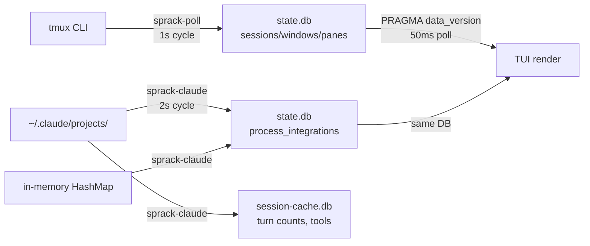

---
first_authored:
  by: "@claude-opus-4-6-20260326"
  at: 2026-03-26T18:00:00-07:00
task_list: sprack/tui-verification
type: report
state: live
status: wip
tags: [investigation, sprack, verification, analysis]
---

# Sprack TUI Verification Gap Analysis

> BLUF: Agents cannot reliably verify sprack TUI output because the data pipeline has three independent layers (state.db, session-cache.db, in-memory session_cache HashMap) with different lifecycles and no single queryable endpoint that mirrors what the TUI renders.
> The `--dump-rendered-tree` flag already exists and is the strongest verification tool available, but it was not used during the session.
> The core problem is architectural: sprack-claude's in-memory cache is the authoritative source for integration data, but it is not queryable from outside the process.

## Context / Background

During a 40+ commit session implementing podman migration and sprack decoupling, agents repeatedly reported "verified" for sprack container integration while the TUI showed incorrect state.
Three distinct failure modes occurred:

1. Agent verified individual components (mount, env var, hook bridge). TUI showed `[error]`.
2. Agent verified via `state.db` SQL queries. TUI showed the session disappeared.
3. Agent verified via `state.db` and found data. TUI showed `cuddly-wobbling-shannon [idle]`, a stale session from an agent's own debugging, not the user's active Claude session.

## Key Findings

### The Data Pipeline

The sprack TUI rendering pipeline has four stages, each with distinct data sources and refresh characteristics:



1. **sprack-poll** (1s cycle): queries `tmux list-panes`, writes sessions/windows/panes to `state.db`.
2. **sprack-claude** (2s cycle): reads `state.db` panes, resolves JSONL session files, writes `process_integrations` to `state.db` and enrichment data to `session-cache.db`.
3. **TUI** (50ms poll): checks `PRAGMA data_version` on `state.db`, reads full snapshot on change, rebuilds tree.

### Finding 1: state.db Queries Are Necessary but Not Sufficient

Querying `state.db` directly (via `sqlite3`) tells you what data has been written to the `process_integrations` table.
This is necessary for debugging but is not what the TUI renders.
The TUI reads the *full snapshot* (sessions + windows + panes + integrations) and applies tree-building logic that groups by host, filters the TUI's own pane, and formats labels.

An integration row can exist in `state.db` for a pane_id that no longer maps to any session (the integration persists until the next sprack-claude cycle cleans it via `clean_stale_integrations`).
Conversely, a pane can exist in the snapshot without any integration if sprack-claude hasn't completed its resolution cycle yet.

### Finding 2: sprack-claude's In-Memory Cache Is the Blind Spot

The `session_cache: HashMap<String, SessionFileState>` in sprack-claude's main loop is the authoritative source for which session file is associated with which pane.
This cache is:

- Not persisted to disk (only `session-cache.db` stores enrichment data, not the pane-to-session mapping).
- Not queryable from outside the process.
- Subject to its own validity logic (`is_session_cache_valid`) that checks PID existence for local panes and mtime freshness (60s `CONTAINER_SESSION_MAX_AGE`) for container panes.

When an agent queries `state.db` and sees integration data, they are seeing the *last write* from sprack-claude.
If the daemon's in-memory cache has already invalidated that session (e.g., PID gone, file stale), the next cycle will either update or delete the integration row.
But until that cycle completes, `state.db` contains stale data.

### Finding 3: Container Session Resolution Is a Multi-Tier Heuristic

For container panes, `resolve_container_pane` uses a four-tier strategy:

1. Hook event files (transcript_path from SessionStart).
2. Project directory encoded from container workspace path.
3. Project directory encoded from host CWD (bind-mount path leakage).
4. Walk up parent directories of host CWD.

The resolver picks the session file with the most recent mtime.
During a debugging session, an agent's own Claude session can write a more recent JSONL file to the same `~/.claude/projects/` directory, and the resolver will select it instead of the user's session.
This is the `cuddly-wobbling-shannon` problem: the agent's session was the most recently modified file in the project directory.

### Finding 4: --dump-rendered-tree Already Exists

The sprack TUI binary has `--dump-rendered-tree` which renders a single frame to stdout using a `TestBackend` and exits.
It reads the same `state.db`, applies the same tree-building logic, and produces the same text output as the interactive TUI.
This is the closest thing to a "verification endpoint" and was not used during the session.

Usage: `sprack --dump-rendered-tree [--cols N] [--rows N]`

### Finding 5: session-cache.db Is Independent From TUI Rendering

`session-cache.db` stores enrichment data (turn counts, tool usage, context history) and is read by sprack-claude to populate optional fields on `ClaudeSummary`.
The TUI does not read `session-cache.db` directly; it only sees the enrichment data as serialized JSON within the `process_integrations.summary` column of `state.db`.

Querying `session-cache.db` can confirm that sessions were ingested, but it does not tell you whether the TUI will show them.
A session can be present in `session-cache.db` but absent from TUI if:
- The pane no longer exists in `state.db`.
- sprack-claude's resolver no longer matches that session to any active pane.
- The integration row was cleaned by `clean_stale_integrations`.

### Finding 6: Stale Session Lifecycle

When a Claude session ends:

- **Local panes**: `is_session_cache_valid` checks `/proc/<pid>`. If the PID is gone, the cache entry is invalidated on the next cycle. The `clean_stale_integrations` function deletes the `process_integrations` row when the pane is no longer in the candidate set.
- **Container panes**: `is_session_cache_valid` checks the session file's mtime. If older than 60 seconds (`CONTAINER_SESSION_MAX_AGE`), the cache entry is invalidated. A new resolution attempt follows.

There is no TTL on integration rows in `state.db`.
Rows persist until `clean_stale_integrations` removes them, which only happens when the pane_id is no longer in `active_pane_ids` for the current cycle.
If the pane still exists (tmux session still running) but Claude has exited, the next cycle writes an error integration ("no session file found") rather than deleting the row.

### Finding 7: The Snapshot Test Infrastructure Is Comprehensive

The `test_render.rs` module demonstrates the full DB-to-render pipeline in tests.
It writes synthetic data to an in-memory `state.db`, calls `refresh_from_db`, renders via `TestBackend`, and compares with insta snapshots.
This same pattern could be used by agents to verify state.

## The "cuddly-wobbling-shannon" Mystery

The name `cuddly-wobbling-shannon` is a Claude Code auto-generated session slug.
These are written in JSONL entries as the `slug` field and displayed by the TUI as the session name (when no `customTitle` is set via `/rename`).

During the debugging session, an agent launched Claude Code instances inside the lace container to test the integration.
These instances wrote JSONL session files to `~/.claude/projects/<encoded-path>/`.
The resolver uses `find_best_project_session`, which picks the session file with the most recent mtime across multiple candidate directory encodings (container workspace, host CWD, parent directories).

The agent's debugging session wrote the most recently modified JSONL file, so the resolver selected it.
The slug from that file (`cuddly-wobbling-shannon`) appeared in the TUI.
When the agent's session ended, the file's mtime stopped updating, but the 60-second `CONTAINER_SESSION_MAX_AGE` window kept it "valid" temporarily.
After 60 seconds, the cache invalidated, but re-resolution found the same file (still the most recent) and re-selected it.
Eventually the integration would have shown "error" once the session file became truly stale relative to newer files.

## Recommendations

### 1. Use `--dump-rendered-tree` for Agent Verification (Immediate)

This already exists and should be the primary verification method.
Agents should run:

```sh
sprack --dump-rendered-tree --cols 120 --rows 40
```

This renders the exact same tree the user sees, minus the detail panel and status bar.
The output can be diffed, grepped, or pattern-matched to verify session names, states, and integration status.

### 2. Add `--dump-state` for Structured Verification (Short-Term)

A `--dump-state` flag that outputs the raw `DbSnapshot` + parsed `ClaudeSummary` as JSON would give agents a structured, queryable representation of TUI state.
This is more useful than raw SQL queries because it applies the same filtering and grouping logic as the TUI.

Suggested output structure:

```json
{
  "host_groups": [
    {
      "name": "local",
      "sessions": [
        {
          "name": "dev",
          "panes": [
            {
              "pane_id": "%0",
              "command": "claude",
              "integration": {
                "kind": "claude_code",
                "status": "thinking",
                "session_name": "cuddly-wobbling-shannon",
                "context_percent": 45
              }
            }
          ]
        }
      ]
    }
  ]
}
```

### 3. Expose sprack-claude's Resolver State (Medium-Term)

The in-memory `session_cache` HashMap is the blind spot.
Options:
- Write resolver state to a separate SQLite table or a JSON file on each cycle.
- Add a `--status` flag to sprack-claude that dumps the current cache state and exits.
- Use a Unix socket for IPC (complex, likely overkill).

The simplest approach: write `resolver_state` rows to `state.db` alongside `process_integrations`, containing the session file path, cache key type (PID or ContainerSession), and validity status.

### 4. Require `--dump-rendered-tree` in Verification Checklists

For any agent working on sprack integration, the verification protocol should be:

1. `sqlite3 state.db "SELECT * FROM process_integrations"` to check raw data.
2. `sprack --dump-rendered-tree --cols 120` to check rendered output.
3. Compare rendered output against expected session names and states.

Step 2 is the critical one that was missing in all three failed verification attempts.

### 5. Snapshot Testing for Container Integration Scenarios

The existing `test_render.rs` infrastructure supports this directly.
Add test cases that simulate:
- Container session with valid integration.
- Container session with stale integration (mtime > 60s).
- Multiple sessions competing for the same project directory (the `cuddly-wobbling-shannon` scenario).
- Integration cleanup when a session is removed.

### 6. Consider Container Session Deduplication

The `find_best_project_session` function picks the most recent mtime, but it has no way to distinguish between "the user's active session" and "an agent's debugging session" in the same project directory.
Options to explore:
- Use the `session_id` field from JSONL entries to correlate with hook events.
- Prefer sessions with recent *writes* (appended data) over sessions with recent *reads* (touched mtime).
- Use the PID namespace or container context to disambiguate sessions from different origins.

This is the hardest problem and likely needs a design proposal rather than a quick fix.
