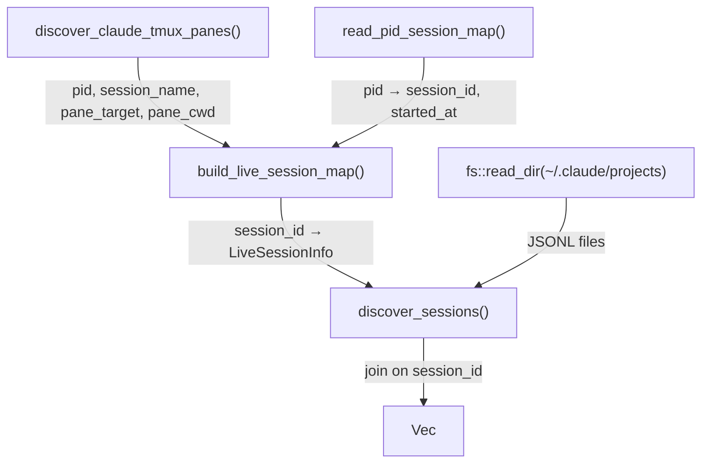

---
first_authored:
  by: "@claude-opus-4-6-20250625"
  at: 2026-03-28T09:55:00-07:00
task_list: sprack/recon-evaluation
type: report
state: live
status: wip
tags: [architecture, sprack, tooling_evaluation, podman]
---

# Minimum Viable PR to Recon for Podman Container Monitoring

> BLUF: A minimal PR to gavraz/recon enabling cross-container Claude monitoring requires changes to four functions across two files (~80-120 lines added), introducing a `RECON_CLAUDE_HOMES` environment variable for multi-root `~/.claude` discovery and a `RECON_PID_CMD` hook for container PID translation.
> However, recon's CONTRIBUTING.md explicitly states "This project does not accept Pull Requests" and directs contributors to open Issues instead.
> The practical path is an Issue proposing the design, with a reference fork demonstrating the implementation.

## Contribution Policy Constraint

Recon's `CONTRIBUTING.md` reads in its entirety:

> This project does not accept Pull Requests. Please open an Issue to discuss ideas instead.

The README reinforces this:

> Due to the sensitive nature of reconnaissance and session tracking, I prefer to maintain full control over the codebase to ensure security and auditability.

This means any external PR will be rejected on policy grounds regardless of quality.
The viable strategy is: open an Issue with a detailed design, maintain a fork with the implementation, and let the maintainer reimplement if interested.

## Recon's Discovery Pipeline

Understanding the exact code paths is necessary to scope the change.
The pipeline lives in `src/session.rs` and executes in `discover_sessions()`:

Four functions contain hardcoded `dirs::home_dir()` assumptions:

1. **`discover_sessions()`** (line 100): `dirs::home_dir().join(".claude").join("projects")` - JSONL scan root.
2. **`read_pid_session_map()`** (line 1135): `dirs::home_dir().join(".claude").join("sessions")` - PID-to-session mapping.
3. **`discover_claude_tmux_panes()`** (line 1192): `dirs::home_dir().join(".claude").join("sessions")` - child PID validation.
4. **`find_claude_child_pid()`** (line 1247): `dirs::home_dir().join(".claude").join("sessions")` - child PID file check.

Additionally, `find_jsonl_by_session_id()`, `find_session_cwd()`, and `find_clear_successor()` use `dirs::home_dir()` for project directory resolution.

## The Four Blockers

### 1. Single `~/.claude` Root

Every discovery function hardcodes `dirs::home_dir().join(".claude")`.
Container Claude instances write their session files and JSONL logs inside the container's home directory, not the host's.

### 2. PID Namespace Mismatch

`discover_claude_tmux_panes()` reads `#{pane_pid}` from tmux, then checks if `~/.claude/sessions/{pid}.json` exists.
With `podman exec`-based entry, the tmux pane's PID is the host-side `podman exec` process.
The actual Claude process runs inside the container with a different PID, and its `{PID}.json` is written inside the container's `~/.claude/sessions/`.

`find_claude_child_pid()` uses `pgrep -P <parent_pid>` to find Claude child processes.
This works on the host when Claude runs directly, but `podman exec`'s child tree from the host perspective terminates at the container boundary: `pgrep` on the host cannot see processes inside the PID namespace.

### 3. Path Encoding Divergence

Claude encodes CWD into project directory names: `/home/mjr/code/weft/lace` becomes `-home-mjr-code-weft-lace`.
Inside a container, the CWD is `/workspaces/lace`, producing `-workspaces-lace`.
Recon's `decode_project_path()` and `encode_project_path()` operate on whatever path the JSONL files contain, so this is only a display/git-resolution issue if the container `~/.claude` is made visible.

### 4. tmux Pane Command Detection

`discover_claude_tmux_panes()` checks `#{pane_current_command}` for `claude`, `node`, or a version number.
With `podman exec`, the pane command is `podman` (or `conmon`), which fails the `is_claude` check entirely.
The function also checks for shell processes (`bash`, `sh`, `zsh`) with Claude children, but again `podman exec` does not match these patterns.

## Minimum Viable Change Design

### Approach: Environment Variables

Recon has zero configuration today: no config file, no env vars (other than `TMUX`), no CLI flags for the dashboard.
The lightest-weight extension mechanism that fits the project's style is environment variables.

A config file would be more powerful but is a larger design surface.
CLI flags only work for the initial invocation, not for the polling loop.
Environment variables are the smallest viable change that an external consumer can set without modifying recon's code on every run.

### Proposed Variables

**`RECON_CLAUDE_HOMES`**: Colon-separated list of additional `~/.claude` directories to scan.

Example: `RECON_CLAUDE_HOMES=/mnt/containers/lace-claude:/mnt/containers/dotfiles-claude`

This tells recon to scan multiple roots for `sessions/{PID}.json` and `projects/*/*.jsonl`, in addition to the default `~/.claude`.

**`RECON_PID_MAP_CMD`**: Optional shell command that maps a host PID to a container PID and claude home path.

Example: `RECON_PID_MAP_CMD="lace-pid-resolve"`, where `lace-pid-resolve <host_pid>` outputs `<container_pid> <claude_home_path>` or exits non-zero if the PID is not a container process.

> NOTE(opus/sprack/recon-evaluation): `RECON_PID_MAP_CMD` is the most controversial part of the design.
> It introduces a shell-out per unresolved PID per poll cycle (every 2 seconds).
> A simpler but less general alternative: scan all `RECON_CLAUDE_HOMES` sessions directories unconditionally and match by session-id rather than PID.
> This sidesteps PID resolution entirely at the cost of not discovering brand-new sessions (before JSONL exists).

### Simpler Alternative: Session-File Scan Without PID Resolution

A lighter design avoids PID mapping entirely:

1. Scan `sessions/{PID}.json` from all configured claude homes.
2. For each `{PID}.json`, extract the `sessionId` and `startedAt`.
3. Match these session IDs against JSONL files across all claude home roots.
4. For tmux association, keep the existing host-side tmux scan but add `podman` to the `is_claude` command check.
5. Accept that brand-new container sessions (no JSONL yet) may briefly show without tmux association.

This approach has a gap: the PID in `{PID}.json` inside the container is the container-local PID, which does not match `#{pane_pid}` from tmux.
The join key between tmux panes and session files breaks.

A workaround: when `#{pane_current_command}` is `podman`, use `podman inspect` or the lace metadata to resolve which container the pane connects to, then read that container's session files.
This is still a shell-out, but it is per-podman-pane rather than per-PID.

### Recommended Design: Multi-Root with Pane-to-Container Mapping

The most practical minimum PR:

1. **`RECON_CLAUDE_HOMES`** for multi-root scanning of sessions and projects directories.
2. **Extend `is_claude` check** to include `podman` and `conmon` as pane commands.
3. **`RECON_CONTAINER_CMD`** (optional): a command that takes a tmux pane target and returns the claude home path for that container, or empty if not a container pane.
   Default: unset (single-host mode, current behavior).
   Example implementation for lace: reads lace metadata to map pane -> container -> bind-mounted claude home.

## Files Touched and Estimated Diff

### `src/session.rs` (~80-100 lines changed/added)

**`claude_home_dirs()` (new function, ~15 lines):**
Returns a `Vec<PathBuf>` containing `dirs::home_dir().join(".claude")` plus any paths from `RECON_CLAUDE_HOMES`.

**`discover_sessions()` (~10 lines changed):**
Replace single `claude_dir` with iteration over `claude_home_dirs()` for the project scan loop.

**`read_pid_session_map()` (~10 lines changed):**
Iterate over all claude home dirs for session file scanning.

**`discover_claude_tmux_panes()` (~15 lines changed):**
Add `podman` and `conmon` to the `is_claude` command check.
When the command is `podman`, optionally invoke `RECON_CONTAINER_CMD` to resolve the container's claude home and translate the PID.

**`find_claude_child_pid()` (~5 lines changed):**
Search session dirs from all claude homes, not just the default.

**`find_jsonl_by_session_id()`, `find_clear_successor()`, `find_session_cwd()` (~15 lines changed):**
Replace `dirs::home_dir()` with `claude_home_dirs()` iteration.

### `src/history.rs` (~10 lines changed)

**`find_resumable_sessions()`:**
Replace single `home.join(".claude").join("projects")` with `claude_home_dirs()` iteration.
This function also uses `dirs::home_dir()` directly.

### `src/park.rs` (no changes needed)

Park/unpark operates on live tmux sessions via recon's session data.
It does not directly read `~/.claude`; it consumes the already-resolved `Session` structs.

### Total Estimate

- 2 files modified: `session.rs`, `history.rs`
- 1 new function: `claude_home_dirs()` (~15 lines)
- ~8 existing functions modified (~65-85 lines changed)
- ~80-120 net lines added

## Maintainer Acceptance Likelihood

**Low, for policy reasons.**
The CONTRIBUTING.md is unambiguous: no PRs accepted.
The maintainer will implement the feature themselves if they like the idea.

**Medium-high on technical merit.**
The design is conservative:
- Environment variables match the project's zero-config philosophy (opt-in only).
- No new dependencies.
- No breaking changes to existing behavior (all new behavior is gated on env vars being set).
- The `claude_home_dirs()` abstraction is a clean refactor that reduces code duplication across 8+ functions.
- The change enables a legitimate use case (container monitoring) without overcomplicating the architecture.

**Risks to acceptance:**
- The `RECON_CONTAINER_CMD` shell-out pattern may be seen as too complex or a security concern (arbitrary command execution in a "reconnaissance" tool).
- The maintainer may prefer a config file approach over environment variables, which would be a larger design discussion.
- The container use case may be outside the project's intended scope.

## Recommendation for Lace

1. **Open a GitHub Issue** describing the use case (monitoring Claude sessions across podman containers from a host dashboard) and the proposed env-var design.
2. **Maintain a fork** with the implementation for immediate use in lace.
   The fork diff is small enough (~100 lines) to carry indefinitely with low merge-conflict risk.
3. **Implement `lace-pid-resolve`** as a companion script that uses lace's container metadata to map host PIDs to container claude homes.
   This script serves as the `RECON_CONTAINER_CMD` implementation.
4. **Add bind mounts** for container `~/.claude` directories to host-visible paths.
   This is already consistent with lace's approach to SSH keys and dotfiles.

> WARN(opus/sprack/recon-evaluation): The fork strategy has a maintenance cost.
> Recon is actively developed (v0.4.3, frequent commits) and the session discovery code changes regularly.
> Carrying a fork of `session.rs` across upstream updates will require periodic rebasing.
> If the maintainer is unresponsive to the Issue, consider whether the fork cost exceeds the benefit over the `podman exec recon json` aggregation approach described in the feasibility report.
