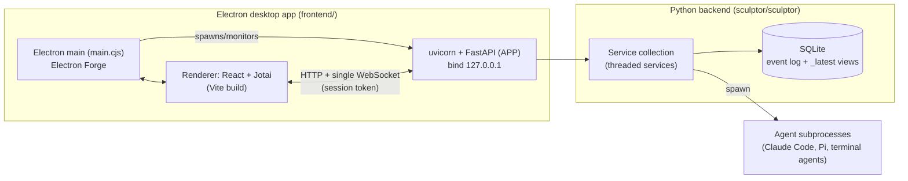

---
first_authored:
  by: '@claude-opus-4-8'
  at: 2026-07-11T17:00:00.000Z
task_list: sculptor-assessment/architecture
type: report
state: live
status: wip
tags:
  - investigation
  - architecture
  - sculptor
guid: pMN-FoaWr4lul
---

# Sculptor Architecture and Tech Stack

> BLUF: Sculptor is a local-first desktop app (Electron shell + a large Python/FastAPI backend + a React/Jotai renderer) that runs coding agents in parallel over isolated git worktrees.
> The backend is the heavyweight core: ~134k LOC of Python organized as a set of thread-based, dependency-injected "services" over a SQLite event-log database, streaming derived UI state to the frontend over a single WebSocket.
> It is MIT-licensed but only nominally open source: contributions are gated, it is explicitly an experimental local-only beta, and the codebase is tightly coupled around its own service/environment/agent abstractions.
> For lace, the reusable surface is narrow: the container-backend and environment-provider concepts overlap with lace's domain, but they are deeply entangled with Sculptor's service graph and cannot be lifted out cleanly.
> The single biggest adoption risk is that Sculptor is architected as a monolithic, self-contained product with a "local trust boundary" security posture, not as a library or an orchestration layer you compose with.

## Scope

This report covers architecture and tech stack only.
Parallelism, container isolation details, and agent-harness integration are covered by sibling reports.

## 1. Overall Architecture

### Process model

Sculptor is three cooperating processes, not a monolith and not a classic Electron two-process app:

- The Electron main process spawns the Python backend as a child process, reads the backend URL from its stdout, and connects the renderer to it (`container/recipes/docker/README.md:6`; `docs/development/desktop_app.md`).
  The backend can also be a user-provided "Custom Backend Command" (the Docker recipe exploits this to run the backend in a container while the UI stays local).
- The backend is a standalone FastAPI app served by uvicorn, bound to `127.0.0.1` only (`sculptor/sculptor/cli/app.py:145-147`).
  It is launched via a typer CLI whose entry point is `sculptor.cli.main` (`cli/main.py`), which does stdlib-only bootstrap before paying for heavy imports, and can also dispatch a `--pty-helper` subprocess mode.
- The frontend can also run as a plain web app in a browser (`pnpm dev` serves Vite on `127.0.0.1`); Electron is one of two launch modes the integration tests exercise (`offload.toml` = browser, `offload-electron.toml` = Electron over CDP).

The renderer never talks to the OS or agents directly: everything goes through the backend HTTP/WebSocket API.
This is a backend-for-frontend design (`docs/development/frontend_details.md:17-19`): UI-relevant state is *derived on the backend* (`web/derived.py`) and shipped as shaped view models, so the frontend consumes `CodingAgentTaskView`/`TaskUpdate` objects rather than raw domain records.

### Frontend/backend communication

- **One WebSocket per session** carries most state: a full snapshot on connect, then deltas (`web/streams.py`; `frontend/src/common/state/hooks/useUnifiedStream.ts`, `taskDetailReducers.ts`).
- **HTTP endpoints** for mutations/uploads; a generated OpenAPI client (HeyAPI) is used from the frontend (`docs/development/frontend_details.md:36-42`).
- **Request tracking**: every mutating API call gets a `requestID` that the backend echoes back in the WebSocket update, so the client resolves the call only after the corresponding state has streamed through (`requestStore.ts`, `apiClient.ts`).
  This is a deliberate consistency mechanism to avoid optimistic-update drift.
- A per-session token gates the loopback API against browser-based CSRF-style access (`SECURITY.md`; `web/auth.py`).

## 2. Backend Stack

- **Framework**: FastAPI + uvicorn, pydantic v2 everywhere, typer for the CLI (`sculptor/pyproject.toml`).
  Python is pinned to **3.14** (`.python-version`, `requires-python = ">=3.14"`), which is aggressive and will constrain any environment embedding it.
- **Async model is mostly threads, not asyncio.**
  FastAPI's request handlers are async (51 `await`/`async def` in `web/app.py`), but the service layer is thread-based: only 8 `async def` exist in the entire `sculptor/` package, while services use `ObservableThread`, `Queue`, and a custom `ConcurrencyGroup` abstraction (`foundation/concurrency_group.py`, `foundation/thread_utils.py`).
  Each running task gets a `ThreadRunner` backed by an `ObservableThread` (`services/task_service/threaded_implementation.py`).
  The concurrency story is "structured threads with crash-on-irrecoverable-exception", not an async event loop.
- **Service architecture**: a `CompleteServiceCollection` composes the services and starts them in dependency order via nested context managers (`service_collections/service_collection.py:20-36`).
  Services are pydantic models with an abstract API + one or more implementations (interface/impl split is consistent across the codebase, e.g. `task_service/api.py` + `threaded_implementation.py` + `concurrent_implementation.py`).
  The core services: `data_model_service` (DB), `dependency_management_service`, `project_service`, `workspace_service` (owns the `EnvironmentManager`), `git_repo_service`, `task_service` (agent lifecycle), plus `pr_polling_service`, `ci_babysitter_service`, `btw_service`, and `pi_login_service`.
- **Environments abstraction**: `interfaces/environments/base.py` defines an abstract `Environment` with capability properties (`supports_terminal`, `get_user_home_directory`, ...).
  The only in-tree implementation is `LocalEnvironment` via `DefaultEnvironmentManager` (`services/workspace_service/environment_manager/default_implementation.py`), which works directly in the user's repo using git worktrees/clones (`WorkspaceInitializationStrategy`).
  The Docker/remote "container backend" is real but lives *outside* the environment-provider tree: it is a separate deployment recipe where the whole backend runs in a container (`container/recipes/docker/`), plus a stale `services/environment_service/providers/docker/` reference in package-data that has no corresponding source directory.
  So "containers" in Sculptor means "run the backend in a container", not "a Docker environment provider plugged into the manager".

### Data model and persistence

- **SQLite**, with an unusual dual representation: every table is stored both as an **immutable event log** (`${table}`) and a **materialized latest-state view** (`${table}_latest`), implemented in `database/automanaged.py` (`docs/development/database.md`; `database/README.md`).
- Schema is defined by `DatabaseModel` subclasses in `database/models.py`; non-`DatabaseModel` pydantic classes are stored as JSON columns ("dispatched json" approach for `Task`/`SavedAgentMessage`).
- **Alembic** migrations run automatically at startup for local instances.
  There are two migration classes: SQL-schema and *JSON-schema* migrations (for evolving pydantic models inside JSON columns), each guarded by tests (`test_there_are_no_missing_*_migrations`, `frozen_pydantic_schemas.json`, mandatory per-migration test fixtures).
  This is a mature, well-guarded persistence layer, but the machinery is bespoke and heavy.
- **State/event system**: state models live in `state/` (`chat_state.py`, `claude_state.py`, `workflow_state.py`); agent interaction is entirely message-passing (`state/messages.py`, `interfaces/agents/agent.py`) with versioned interfaces (`interfaces/README.md`).

## 3. Frontend Stack

- **React + TypeScript**, built with **Vite**; packaged with **Electron Forge** (`docs/development/frontend_details.md`).
- **State management is Jotai** (atoms), not Redux/Zustand, with a strict "state ownership" discipline: one written store per server fact, optimistic writes must have a real failure path because the WebSocket only heals *successful* mutations (`CLAUDE.md:76`; `docs/development/style/frontend.md`; `src/common/state/mutations/`).
  There is an active "state-ownership burndown" (`docs/development/state-ownership-burndown.md`) and a ratchet (`no-fire-and-forget-api-catch`) enforcing it, indicating this was historically a pain point still being paid down.
- **UI**: Radix UI Themes + Radix primitives, SCSS Modules, design tokens enforced by a custom stylelint plugin (`no-hardcoded-values`).
  Rich editor via TipTap; diffs via `@pierre/diffs`; virtualization via TanStack Virtual; TanStack Query is present but the WebSocket carries most state.
- **Rendering agent sessions/tabs**: components read derived view models from global Jotai state via hooks; `useUnifiedStream` applies the snapshot+delta reducers (`taskDetailReducers.ts`) so most components have "no fetching, no useEffect coordination" (`frontend_details.md:17`).
- Frontend is ~144k LOC of TS/TSX with 246 test files, plus Storybook.

## 4. Distribution and Deployment

- **Desktop packaging** via Electron Forge (`just app` builds a `.dmg`; `just pkg` packages only; notarization/signing for macOS).
  Downloads are offered for macOS (Apple Silicon) and Linux (`README.md`).
- The Python backend is shipped as a **PyInstaller-style single binary** (`sculptor_backend`); in the bundle `sys.executable` is that binary, and the pty helper is spawned by re-entering the same binary with `--pty-helper` (`cli/main.py:6-14`).
  A `sculpt` CLI binary ships alongside it.
- **"offload"** is Imbue's internal distributed CI test runner, not a product runtime feature.
  It executes the Playwright/Chromium integration suite on **Modal** sandboxes with checkpoint-based image caching keyed on git notes (`offload.toml`, `offload-electron.toml`, `offload-unit.toml`, `offload-perf.toml`; `max_parallel = 200`).
  `offload-history.jsonl` (370 KB) is recorded run history.
- **"openhost"** is a separate self-hosting deployment target: an OpenHost app manifest (`openhost.toml`) plus `openhost.Dockerfile` + `openhost-run.sh` + `openhost-nginx.conf` that run the whole backend in a rootless-podman container behind OpenHost SSO, exposing an nginx front for mobile live-preview of dev servers.
  This is Imbue's own hosting substrate, explicitly experimental, and layered on top of the same container recipe.
- **`depot.json`** (`{"id":"fsjzltqvxq"}`) is a [Depot](https://depot.dev) project id: remote/cached Docker image builds used by CI. It is build infrastructure, not app config.

Net: distribution is oriented around "a desktop app that bundles its own backend binary", with two experimental server-side deployment paths (Docker recipe, OpenHost) bolted on via the custom-backend-command seam.

## 5. Codebase Health and Maturity

Maturity signals are strong for engineering rigor but weak for external adoption:

- **Scale**: ~134k LOC Python + ~144k LOC TS/TSX, 1718 commits, 4 dominant authors (Maciek, Saeed, Danver, bryden) plus minor contributors and some `Claude`-authored commits.
  This is a small-team internal product, not a broad community project.
- **Tests**: 483 Python `*_test.py`/`test_*.py` files, 313 integration test files (Playwright, run in both browser and Electron modes), 246 frontend test files.
  Colocated unit tests are the norm.
- **Type checking**: migrated from Pyre to **pyrefly** (`pyrefly.toml`); frontend uses `tsc --noEmit`.
  Notably, `pyrefly` checks against `python_version = "3.11"` while the runtime is 3.14, and the frontend and test trees are excluded from type checking.
- **Ratchets**: a bespoke-then-externalized "ratchets" system (`ratchets.toml`, `ratchet-counts.toml`, schema v2, 49 curated rules) enforces monotonically-decreasing violation budgets for both Python and TypeScript.
  This is a serious code-health investment (e.g. `no-fire-and-forget-api-catch`, `no-direct-harness-capability-read`).
- **Linting/formatting**: ruff (pinned), a custom stylelint design-tokens plugin, `just format`/`just check`/`just test-unit` as the commit gate.
- **Observability**: Sentry, PostHog, viztracer-based combined backend+frontend+Electron tracing (`docs/development/tracing.md`, `posthog.md`).
- **License**: **MIT** (`LICENSE.md`, Imbue Inc. 2026).
  But it is open source in name more than practice: `CONTRIBUTING.md` gates all PRs (maintainers must reply `lgtm` to clear a contributor; uncleared PRs auto-close), `README.md` states outright "it's not truly open source until the community is involved," and `SECURITY.md` declares it "experimental and expected to be run locally only."
  The threat model is explicitly *not* built for multi-tenant or networked deployment: the loopback interface is the trust boundary, opening a repo runs its code, and adding a plugin/extension runs code with full UI privileges.

## 6. Extensibility Surface

Three distinct extension mechanisms exist, all local-code-trust:

- **Frontend extensions** (`docs/help/extensions.md`; `frontend/extensions/`): runtime-loaded JS ES modules that add panels, workspace widgets, home views, overlays, and settings UI.
  No build step, hot-loadable from a folder or a URL, isolated behind React error boundaries, managed in Settings and via `sculpt extension` CLI.
  They run with full renderer privileges (a stated security caveat).
- **`sculptor-plugin`** (`sculptor/sculptor-plugin/`): a `.claude-plugin` bundle of skills shipped with Sculptor (`build-sculptor-extension`, `sculpt-cli`, `help`) — this is the Claude Code plugin surface, not an app-extension API.
- **`sculptor-workflow`** and **`sculptor-experimental`**: additional bundled skill sets (`/sculptor-workflow:fix-bug`, etc.) that drive agentic workflows.
- **`sculpt` CLI** (`tools/sculpt/`): a first-class API client (generated Python client from the OpenAPI spec) that agents shell out to; it is how in-workspace agents manipulate the live UI (e.g. `sculpt extension load`).

The extensibility model is genuinely rich *for adding UI and agent workflows inside Sculptor*, but there is no plugin surface for swapping the environment/execution backend, the container strategy, or the persistence layer.
Extensibility is additive at the edges, not compositional at the core.

## Assessment for lace

- **Coupling / reusability**: high coupling, low independent reusability.
  The pieces most relevant to lace (environments, workspaces, container execution) are internal implementation details of `workspace_service` behind abstract interfaces that assume Sculptor's service graph, DB, and message system.
  The `Environment` interface is clean in principle but has exactly one implementation (`LocalEnvironment`) and no dependency-inversion boundary you could target without pulling in `foundation`, `data_model_service`, and `ConcurrencyGroup`.
  You would adopt Sculptor whole or not at all.
- **Production readiness**: high internal engineering maturity (migrations, ratchets, tracing, dual-mode integration tests) but explicitly experimental and local-only by design; not hardened for the networked/multi-user posture a devcontainer orchestrator often implies.
- **Biggest architectural risk**: Sculptor is a self-contained desktop product with a bundled Python backend and a loopback-only trust model, versioned and released as one artifact.
  Integrating with it means treating it as an opaque app you launch and talk to over its WebSocket API (feasible, since the custom-backend-command seam and `sculpt` CLI exist), while *replacing lace with it* would mean inheriting the entire Python/Electron/SQLite stack, the 3.14 pin, and the local-only security model — a large surface area with no supported embedding or library mode.
</content>
