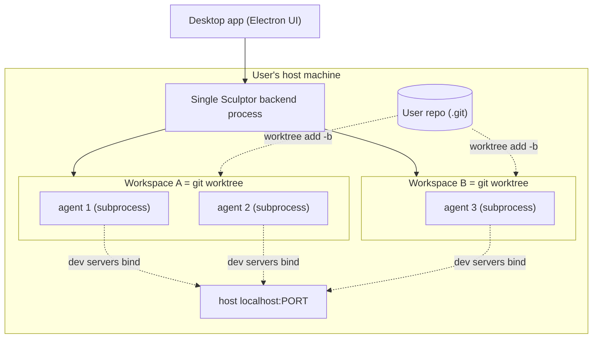

---
first_authored:
  by: '@claude-opus-4-8'
  at: 2026-07-11T17:00:00.000Z
task_list: sculptor-assessment/parallelism-containers
type: report
state: live
status: wip
tags:
  - investigation
  - architecture
  - containers
  - sculptor
guid: pCMFXRFGo1ugf
---

# Sculptor: Parallelism and Container/Environment Isolation

> BLUF: Sculptor and lace solve the "parallel agentic coding" problem with opposite isolation philosophies.
> Sculptor's isolation unit is a **git worktree on the host**, not a container: agents run as **local subprocesses** on the user's machine, sharing one Python backend process.
> Imbue explicitly **abandoned per-agent Docker containers** (see `docs/history.md`) because isolation cost them flexibility and confused users.
> Containers exist in Sculptor only as an optional wrapper around the *entire* app (the experimental "container backend"), never per-workspace.
> There is **no devcontainer.json support, no per-workspace image, no prebuild cache, and no automatic host/container port allocation** in the sense lace provides.
> Sculptor is **fully local and self-hostable** for the core loop (the only hard external dependency is the Claude/agent API and, for PRs, GitHub).
> Its heavy-parallelism story is unbounded thread-per-task on a single host, which scales by host RAM/CPU rather than by any scheduler.
> For lace's purposes Sculptor is **not a container-isolation peer**: it is a UI-and-orchestration layer that deliberately does the *opposite* of lace's core value proposition.

## 1. The workspace model

A workspace is "an isolated working copy of one repository, on its own branch" (`docs/help/workspaces.md:3`).
The default and recommended mode is a **git worktree**, created by literal `git worktree add -b <branch> <dest> <base>` against the user's repo (`environment_manager/environments/worktree_strategy.py:47`).
The worktree shares the user's `.git` via a gitfile pointer, so the new branch appears directly in the user's local git state with no separate remote to sync.

Three initialization strategies exist (`database/workspace_enums.py` -> `WorkspaceInitializationStrategy`):

- **WORKTREE** (default): shared `.git`, separate working directory, new branch.
- **CLONE** (experimental): a full separate clone with mirrored remotes; changes come back by explicit push/pull.
- **IN_PLACE** (experimental): the agent edits the user's original repository directly, no copy.

Workspaces live under `~/.sculptor/workspaces/<internal-id>/code/` (`workspaces.md:76`).
The `EnvironmentManager` docstring is explicit that this is not a container model: "Environments are created directly from project paths - no image concept needed since we work directly in the user's repository" (`environment_manager/api.py:19`).

The `Environment` interface itself confirms this: "In practice, an `Environment` is the user's local working tree: agents run directly on the host machine and operate on files in the workspace's working directory" (`interfaces/environments/README.md`).
The concrete implementation is `LocalAgentExecutionEnvironment` / `local_environment.py`.
There is no `DockerEnvironment` or `RemoteEnvironment` class in the tree.

### Merge-back to main

Merge-back is ordinary git, surfaced through the UI:

- **Changes panel** (`docs/help/changes.md`): shows the cumulative uncommitted diff; nothing commits until the user clicks Commit, which asks the agent to write a message and commits on the workspace branch. Committing does **not** push.
- **Pull Requests** (`docs/help/pull_requests.md`): Create PR pushes the branch and opens a GitHub PR via the `gh` CLI against a configurable target branch.

Because the default worktree branch already lives in the user's `.git`, the user can also just check it out or merge it locally with no remote round-trip.
This is the same primitive lace uses for parallel dev (worktrees), but Sculptor stops there: the worktree *is* the isolation boundary, with no container layered on top.

## 2. Container / environment isolation

The decisive document is `docs/history.md`, "Why did we move away from running each agent in a Docker container?":

- Isolation cost flexibility: they found it powerful to let agents inspect each other's work, and per-agent isolation blocked that.
- Most users found the isolation confusing and harder to use.
- They judged it "easier and equivalent" to run the *entire application* in a container or VM rather than each agent.
- They regretted depending on Docker Desktop on macOS for performance-critical sandboxing.

So containers in Sculptor are opt-in and app-wide, not per-workspace.

### The experimental "container backend"

`docs/help/experimental/container_backend.md` describes a **custom backend command**: the desktop app can spawn a user-provided shell command instead of its built-in backend.
The command prints a URL to stdout; the app connects to it.
The shipped recipe (`container/recipes/docker/`) builds one image containing git, the Claude CLI, and runtime deps, auto-downloads the Sculptor backend binary (~100 MB, cached), and runs the *whole backend* in that one container.
All workspaces/agents then live inside that single container as subprocesses.
This is "run the app in a box," architecturally identical to running lace's whole toolchain in one devcontainer, not "a box per agent."

Note the `.devcontainer/Dockerfile` at repo root is unrelated to workspace isolation: it is the Modal sandbox image for Sculptor's own CI test-offload (`offload.toml` `provider.type = "modal"`).
There is no consumption of a user project's `devcontainer.json` anywhere.

### Provisioning and caching

Per-workspace "provisioning" is just git plus an optional **setup command** (e.g. `npm install`) run when a workspace is created, from `Settings > Repositories` (`workspaces.md:66`, `workspace_service/setup_command_runner.py`).
Environment variables load from `~/.sculptor/.env` (all repos) and per-repo `.sculptor/.env`.

There is **no analogue to lace prebuilds**: no cached base image per project, no layer reuse for workspace creation.
Workspace creation is fast precisely because it is a worktree + a shell command, not an image build.
The only image caching in the repo is for the app-wide container recipe (Docker layer cache + cached backend binary) and for CI offload (checkpoint images via git notes, `offload.toml [checkpoint]`).

### Ports

In the default local model there is **no port allocation at all**: dev servers the agent starts bind to `localhost` on the host directly (`docs/help/terminal.md:18`), and the user reaches them at `localhost:<port>` like any local process.
There is no host/container mapping to allocate because there is no container.
Contrast with lace's deliberate symmetric host/container allocation in 22425-22499: Sculptor has no equivalent because it does not virtualize the network.

## 3. Parallelism at scale

Parallelism is **thread-per-task inside one backend process**.
`ConcurrentTaskService` runs a single spawner thread that scans the data model for new tasks and starts a `Runner` (a `Thread`) per task (`task_service/concurrent_implementation.py:89-123`, `threaded_implementation.py:30`).
Each agent task thread in turn spawns the actual agent as a **subprocess** (the Claude/Pi CLI) via `ConcurrencyGroup`.

Resource model and limits:

- The code comment at `concurrent_implementation.py:102` notes an optional cap on active runners but states the default: "If set to None, a run_task will be spawned for every task."
  No default numeric cap is configured in the backend: concurrency is effectively **unbounded**, gated only by host CPU/RAM.
- `MAX_QUEUED_TASKS_PER_BATCH = 100` (`concurrent_implementation.py:39`) bounds a scan batch, not concurrent execution.
- The only explicit resource sizing lives in the *self-hosted* manifest: `openhost.toml [resources]` requests `memory_mb = 4096`, `cpu_millicores = 4000` and comments "size it for the backend plus a few concurrent agents."
  "A few" is the operative scale hint.

Within a single workspace the user can also run **multiple agents that share one working copy** (`docs/help/agents.md`): one implements, another tests, on the *same files*.
This is intentional non-isolation and is the direct consequence of the history.md decision.
The tradeoff (agents editing the same file conflict) is documented as the user's problem to structure around.

Lifecycle management is git-worktree cleanup plus branch-deletion policy (never / delete_if_safe / always, `worktree_strategy.py:97`) and stale-environment cleanup on startup after a crash (`environment_manager/api.py:86`).
There is no cgroup, no per-agent memory/CPU quota, no OOM isolation: a runaway agent competes with all others and the UI for host resources.

## 4. Local vs remote / offload / openhost

Three distinct concepts, easily conflated by name:

- **Local (default)**: everything runs on the user's machine. The only hard external dependency is the agent model API (Claude Code / Pi). Git and `gh` are local CLIs. This is fully self-contained.
- **offload*.toml**: **CI test distribution**, not a workspace feature. `offload.toml`, `-unit`, `-perf`, `-electron` fan Sculptor's own test suite out to **Modal** cloud sandboxes (`provider.type = "modal"`, `max_parallel = 32`-`200`). It has nothing to do with running user agents; it is how Imbue runs its own tests. Irrelevant to the isolation question except as evidence they use Modal, not Docker-per-agent, for their own scale-out.
- **openhost*** (`openhost.toml`, `openhost.Dockerfile`, `openhost-run.sh`, `openhost-nginx.conf`, `openhost-agent/`): a **self-hosting deployment target**. It packages the from-source backend (no Electron shell, backend serves the bundled web UI) into one container that runs on Imbue's "OpenHost" PaaS under rootless podman, behind owner SSO, reachable at `https://sculptor.<zone>/`. Persistent state (DB, workspaces, Claude+gh auth) lives in a backed-up app-data volume so it survives rebuilds. This is "Sculptor as a hosted web app for one owner," still one container running all workspaces.

So: workspaces can effectively run on a remote host **only** by running the whole backend remotely (container backend over SSH, or OpenHost), not by scheduling individual workspaces onto a cloud fleet.
There is no per-workspace remote-execution scheduler.
The core product is **not** a cloud-service dependency: the desktop app plus local backend is the primary, fully-local mode.

## 5. Networking / preview

Local mode has no preview layer: dev servers are just host-local ports.

The preview machinery (`openhost-nginx.conf`, `openhost-preview-fallback.html`) exists **only in the containerized/hosted mode**, because that mode hides the host network behind one public port.
There, an in-container `nginx-light` owns the single public port 5050 and splits traffic:

- `/proxy/<port>/...` reverse-proxies to `127.0.0.1:<port>` for dev-server live preview, allow-listed to the **"preview band" 51000-59999** (`openhost-nginx.conf:104`).
- everything else proxies to the backend on loopback `:5051`.
- `/proxy/` with no port serves a switchboard page that scans the band and links to live previews; it doubles as the 502/503/504 error page (`openhost-preview-fallback.html`).

Defense-in-depth: upstream hard-pinned to loopback, port range allow-listed so a preview cannot target the backend, and the Sculptor session cookie stripped before reaching the dev server.
Full-stack (own-backend) previews on one origin are explicitly unsupported due to session-cookie collision.

This 51000-59999 "preview band" is the **closest analogue to lace's port allocation**, but it is a fixed allow-list range reverse-proxied by nginx inside one container, with the dev server expected to be **base-aware** (mounted under `/proxy/<port>/`, e.g. Vite `base=/proxy/<port>/`).
It is not symmetric host/container binding, not auto-allocated per workspace, and only exists in the hosted deployment, not the default local app.

## Comparison to lace

| Dimension | lace | Sculptor |
|---|---|---|
| Isolation unit | devcontainer per workspace | git worktree on host; agents = local subprocesses |
| Container per agent/workspace | yes | **no** (deliberately removed, see `history.md`) |
| devcontainer.json support | yes (core) | **none** |
| Prebuilt/cached images | yes (prebuilds) | none for workspaces; only app-wide recipe + CI checkpoints |
| Port allocation | auto, symmetric host/container, 22425-22499 | local: none (host localhost); hosted: nginx `/proxy/<port>/` band 51000-59999, base-aware |
| Backend | podman/docker | host process; optional single app-wide container (podman/docker) |
| Parallelism cap | per-container resources | unbounded threads on one host, gated by host RAM/CPU |
| Cross-agent visibility | isolated | intentionally shared (a feature) |
| Remote/cloud | container backends | whole-app remote only (container backend / OpenHost); no per-workspace scheduler |

> NOTE(claude-opus-4-8/sculptor-assessment): The two systems are not competitors at the same layer.
> lace is an isolation/provisioning substrate.
> Sculptor is an agent-orchestration UI that chose weak (worktree-only) isolation on purpose.
> A plausible integration is orthogonal composition: run Sculptor's backend *inside* a lace devcontainer via the custom-backend-command hook, letting lace supply the container/port/prebuild isolation Sculptor omits, while Sculptor supplies the multi-agent UI.
> That works precisely because Sculptor's container backend expects exactly one box for the whole app, which is what a lace devcontainer is.
