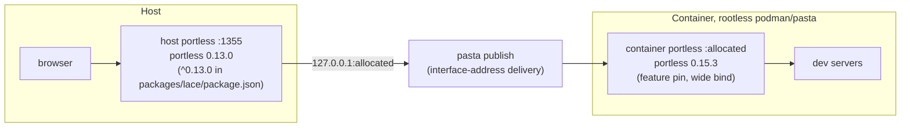
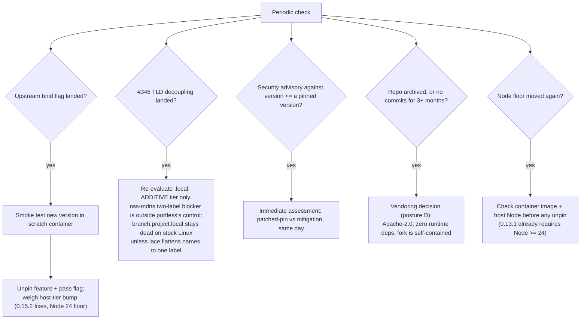

---
first_authored:
  by: "@claude-fable-5"
  at: 2026-07-19T08:37:09-07:00
task_list: portless/ingress-durability
type: report
state: live
status: review_ready
tags: [portless, upstream, watchlist, dev-infra]
---

# Portless Upstream Watchlist

> BLUF: Lace runs a third-party, pre-1.0, fast-moving Vercel Labs package at two pinned versions, and upstream has already shipped one ingress-breaking behavior change in a patch release (0.15.4 loopback bind, one day of broken host ingress).
> This report is the standing tracker: the topology and versions we hold, the specific upstream issues/PRs whose state changes our posture, the decision triggers for acting on them, and a 5-minute periodic check ritual.
> All upstream states below were fetched fresh on 2026-07-19; latest release remains 0.15.4 (2026-07-16), repo not archived, last commit 2026-07-16.
> Deep analysis lives in the [upstream evolution report](2026-07-18-upstream-portless-evolution-and-lan-mode-assessment.md); the accepted posture lives in the [pin proposal](../proposals/2026-07-18-portless-feature-version-pin-and-ingress-durability.md).

## Why We Care: Standing Exposure

Two tiers, two versions, both load-bearing for every worktree dev URL:

The exposure is structural, not incidental:

- Upstream ships behavior changes in patch releases: 0.15.4 changed the proxy bind from all-interfaces to loopback-only, which broke pasta-delivered host ingress for a day. Pre-1.0 versioning is an accurate self-description.
- The container tier pin (0.15.3, feature 1.0.1) is the whole outage fix; the host tier still runs 0.13.0 and forgoes 0.15.x fixes.
- The unpin path depends on upstream accepting an opt-in bind control that does not exist yet.

Background, cited rather than restated: the [upstream evolution report](2026-07-18-upstream-portless-evolution-and-lan-mode-assessment.md) (loopback rationale, release ledger, LAN/`.local` not-viable verdict), the [pin proposal](../proposals/2026-07-18-portless-feature-version-pin-and-ingress-durability.md) (phases 2-6 outstanding), and the deferred [tailnet ingress RFP](../proposals/2026-07-19-rfp-tailnet-dev-ingress.md).

## Watchlist

States verified 2026-07-19.

| Item | What it is | Why lace cares | Action trigger |
| --- | --- | --- | --- |
| [PR #361](https://github.com/vercel-labs/portless/pull/361) (merged 2026-07-16) | "Bind proxy to loopback by default": the 0.15.4 change, proactive hardening with no linked issue or advisory. | The reason the pin exists. Its "preserve explicit LAN exposure" framing is the argument-shape for our bind-flag request. | Context only. Watch for a revert or follow-up bind option referencing it. |
| Bind-flag request (ours, NOT YET FILED) | Opt-in `--bind <addr>` / `PORTLESS_BIND` decoupled from LAN/mDNS. Draft ready in the weftwise handback report appendix (`cdocs/reports/2026-07-19-portless-pin-handback.md` in weftwise), awaiting maintainer go-ahead. | The only clean unpin path (pin proposal phase 5). | File it. Once landed upstream: smoke test, unpin, pass the flag. |
| [#346](https://github.com/vercel-labs/portless/issues/346) (open) + [PR #348](https://github.com/vercel-labs/portless/pull/348) (open, last activity 2026-07-07) | LAN mode force-replaces all TLDs with `.local`; #348 makes `--lan` additive (keep custom TLDs, add `.local`). | The named re-evaluation trigger for `.local`/LAN mode: while TLD coupling stands, LAN mode is a migration off `.localhost`, not an addition. | #348 (or equivalent) merges: re-evaluate `.local` per the trigger below. Note the nss-mdns caveat: partial re-open only. |
| [PR #365](https://github.com/vercel-labs/portless/pull/365) (open, marked ready-for-review 2026-07-18) | Multi-segment custom TLDs: `--tld` / `PORTLESS_TLD` accepting dotted values like `dev.example.com` (fixes [#260](https://github.com/vercel-labs/portless/issues/260)). | Directly enables the [tailnet RFP](../proposals/2026-07-19-rfp-tailnet-dev-ingress.md)'s `*.dev.internal` split-DNS shape, which needs the host tier to serve a multi-segment TLD. | Merges: the tailnet RFP's TLD prerequisite is satisfied; note it there. |
| [#314](https://github.com/vercel-labs/portless/issues/314) (open, no maintainer response, no linked PRs) | `portless run-docker`: run containers with docker/podman behind portless routing. | The roadmap-divergence bellwether: upstream taking container ingress seriously would change our whole posture (and gives our bind-flag request a thread to plug into). | Maintainer engagement or a PR appears: reassess whether upstream will own the container story lace currently self-solves. |
| [#320](https://github.com/vercel-labs/portless/issues/320) (closed, fixed in 0.15.2) | Proxy dialed upstreams via hardcoded 127.0.0.1, so dev servers binding `::1` only (Vite on Node 17+ defaults) got 502s. | The concrete cost of the host tier staying on 0.13.0: this fix is forgone until unpin. | None; it is the standing unpin incentive. Weight it when the bind flag lands. |
| [#364](https://github.com/vercel-labs/portless/issues/364) (open, updated 2026-07-16) | Automatic hosts sync fails silently when `/etc/hosts` is not writable. | Signal on upstream's DNS/hosts-file handling and silent-failure habits; lace's diagnosability posture (doctor canary) exists because of exactly this failure style. | Context only. Cite if arguing for louder failure modes upstream. |
| [#330](https://github.com/vercel-labs/portless/issues/330) (open, updated 2026-07-03) | macOS: proxy forces sudo for ports below 1024 even where unprivileged bind succeeds. | Touches the deferred `:80`/HTTPS host-tier roadmap ([decisions D2/D6/D12](2026-05-13-weftwise-parallel-dev-decisions.md)): low-port ergonomics upstream affect that path's viability. | Revisit if the `:80` roadmap item is picked up. |

Not on the list because nothing new was found: the recently-updated issue list (fetched 2026-07-19, sorted by update) shows no new bind-address, container, or breaking-change items beyond the rows above; the newest activity repo-wide is the 0.15.4 release itself.

## Decision Triggers

The `.local` trigger deserves its own emphasis: #346 landing removes only the TLD-coupling blocker.
The glibc-side blocker (nss-mdns `mdns4_minimal` rejects names with more than two labels; Fedora ships the minimal variant that ignores `/etc/mdns.allow`) is outside portless's control entirely.
`branch.project.local` remains unresolvable on stock Linux hosts regardless of what upstream ships, unless lace flattens hostnames to a single label.
Evidence: the live spike in the [upstream evolution report](2026-07-18-upstream-portless-evolution-and-lan-mode-assessment.md), section 3.

## Standing Concerns

- **Patch releases carry behavior changes.** Pin exactly, never ranges. 0.15.4 is the precedent; the feature default and any future pin values stay exact versions with the reason documented beside them.
- **Dual-version split between tiers.** Host 0.13.0 vs container 0.15.3 means the two tiers have different bind behavior, different flag surfaces, and different bug sets. Tolerable now; converge deliberately (both tiers, one tested version) in a future round rather than letting the gap grow by default.
- **Experimental-namespace abandonment risk.** vercel-labs projects can be archived or absorbed without notice and portless has no stability commitment. Current health is good: 10.2k stars, 329 forks, near-daily commits through 2026-07-16, not archived (verified 2026-07-19). Mitigants if it dies: Apache-2.0, zero runtime dependencies, narrow lace exposure (spawn CLI, read routes, one bind behavior).
- **The pin's cost ledger.** Fixes forgone while pinned: IPv6-only upstream dial ([#320](https://github.com/vercel-labs/portless/issues/320), host tier), worktree hostname collision handling (0.15.2), `portless doctor` (0.15.0), multi-TLD serving (0.15.1). The ledger is the standing incentive to pursue the bind flag rather than settle in.

## Check Cadence

Lightweight ritual, not automation: on each lace dev round, or monthly if no round happens, roughly 5 minutes.

1. Open the [releases page](https://github.com/vercel-labs/portless/releases): anything newer than 0.15.4? Scan the [CHANGELOG](https://github.com/vercel-labs/portless/blob/main/CHANGELOG.md) entry for bind, TLD, state-dir, or Node-floor changes.
2. Check the open watchlist rows above (four links: our request once filed, #346/#348, #365, #314) for state changes.
3. Glance at the repo's [security advisories](https://github.com/vercel-labs/portless/security/advisories) page (empty as of 2026-07-19) and archived status.
4. Any trigger from the flowchart fires: act per its branch; otherwise update this report's "verified" dates only if something moved.

A scheduled agent is deliberately not proposed: the check is cheap, the triggers are rare, and a human-in-the-loop read of upstream intent (for example, how maintainers respond to the bind-flag request) is most of the value.
Revisit if the maintainer wants a cron-driven version.

## Cross-References

- [Upstream evolution and LAN mode assessment](2026-07-18-upstream-portless-evolution-and-lan-mode-assessment.md): the deep dive behind every verdict cited here.
- [Pin proposal](../proposals/2026-07-18-portless-feature-version-pin-and-ingress-durability.md): accepted posture; phases 2-6 outstanding, phase 5 is the bind-flag filing.
- [Tailnet ingress RFP](../proposals/2026-07-19-rfp-tailnet-dev-ingress.md): deferred direction that PR #365 would unblock on the TLD front.
- Weftwise handback report (`cdocs/reports/2026-07-19-portless-pin-handback.md` in the weftwise repo): rebuild-then-cleanup sequence and the drafted upstream issue text.
