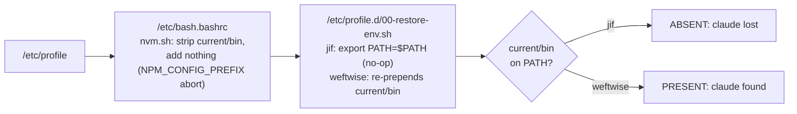

---
first_authored:
  by: "@claude-opus-4-8"
  at: 2026-07-31T12:20:00-07:00
task_list: devcontainer/restore-env
type: report
state: live
status: review_ready
tags: [devcontainer, features, node, nvm, path, lace-into, incident, dev-infra]
---

# Degenerate `00-restore-env.sh` Drops `claude` From `lace-into` Shells On Non-Node Bases

> BLUF: On a non-node base image (jif runs `ghcr.io/cirruslabs/flutter:3.44.0`, node supplied by nvm via the node feature that `claude-code` `dependsOn`), the `claude` binary is absent from the PATH of a `lace-into` shell, while the identical stack on a node base (`weftwise`, `node:24-bookworm`) is fine.
> Two independent failure modes combine: (1) jif's Dockerfile sets `ENV NPM_CONFIG_PREFIX=/usr/local/share/npm-global`, so the interactive nvm hook in `/etc/bash.bashrc` aborts activation and strips `/usr/local/share/nvm/current/bin` from PATH, adding nothing back; (2) the node feature's `/etc/profile.d/00-restore-env.sh` generator collapses to the no-op `export PATH=$PATH` (18 bytes) instead of the correct `export PATH=/usr/local/share/nvm/current/bin:...:$PATH` (84 bytes on weftwise), so the file that would repair the strip does nothing.
> Factor (1) is the primary trigger, proven independent of factor (2) by one-variable isolation (see below); jif hit both, weftwise neither.
> Factor (1) is a self-inflicted jif Dockerfile choice, not a base-image or feature default, and generalizes to a lace-wide gotcha: any project that sets `ENV NPM_CONFIG_PREFIX` globally on an nvm-provisioned base silently breaks nvm auto-activation in interactive login shells.
> The generator is the upstream **node feature** `install.sh` (not the devcontainer CLI's `userEnvProbe`, which the original hypothesis named); the CLI's own env-restore is a separate `/etc/profile` sed patch.
> jif carries a local Dockerfile workaround (`/etc/profile.d/99-lace-path.sh`); the durable fix belongs in lace: ship a base-agnostic login-PATH fixup in `lace-fundamentals` (recommended), restoring `/usr/local/share/nvm/current/bin` after the nvm hook.
> All findings below were verified live against the running `jif` and `weftwise` podman containers on 2026-07-31.

## Symptom

`lace-into` enters a container as an interactive login bash: `podman exec -it <c> --user <u> /bin/bash -l` (see [`bin/lace-into`](../../bin/lace-into) `build_exec_cmd`, no command argument plus `-it` makes it interactive).
In that shell on jif, `claude` (installed under nvm's dir) is not on PATH.
`flutter` survives because it lives at `/sdks/flutter/bin`, outside nvm's control; only nvm-managed binaries are lost.

## Reproduction

The interactive flag `-i` is the discriminator:

```sh
podman exec jif /bin/bash -lic 'which claude'   # -> nothing (nvm hook stripped the bin)
podman exec jif /bin/bash  -lc 'which claude'   # -> /usr/local/share/nvm/current/bin/claude
```

Non-interactive login (`-lc`) does not source `/etc/bash.bashrc`, so nothing strips the nvm bin that the base image ENV already carries.
Interactive login (`-lic`, and `lace-into`) does source it, and the strip is not repaired.

The generated restore files differ:

```sh
podman exec jif      cat /etc/profile.d/00-restore-env.sh
# export PATH=$PATH                              (18 bytes, no-op)
podman exec weftwise cat /etc/profile.d/00-restore-env.sh
# export PATH=/usr/local/share/nvm/current/bin:/usr/local/share/nvm/current/bin:$PATH   (84 bytes)
```

Both containers share the configuration that should make them behave identically: nvm default alias `lts/*`, `NVM_SYMLINK_CURRENT=true`, `NVM_DIR=/usr/local/share/nvm`, and `claude` installed under `/usr/local/share/nvm/current/bin`.
jif has node `v24.18.1`, weftwise `v24.18.0`; both resolve `lts/*` when nvm is allowed to run.

## Mechanism

### The generator is the node feature, not the CLI

The devcontainer CLI (`@devcontainers/cli` 0.87.0) never writes to `/etc/profile.d` (zero occurrences of `profile.d` in `devContainersSpecCLI.js`).
Its env-restore logic is a distinct `/etc/profile` sed patch guarded by `allowSystemConfigChange`:

```sh
sed -i -E 's/((^|\s)PATH=)([^\$]*)$/\1${PATH:-\3}/g' /etc/profile
```

`/etc/profile.d/00-restore-env.sh` is written by the upstream **node feature** `install.sh` (observed in-container at `/tmp/dev-container-features/node_1/install.sh`):

```sh
# Ensure that login shells get the correct path if the user updated the PATH using ENV.
rm -f /etc/profile.d/00-restore-env.sh
echo "export PATH=${PATH//$(sh -lc 'echo $PATH')/\$PATH}" > /etc/profile.d/00-restore-env.sh
chmod +x /etc/profile.d/00-restore-env.sh
```

### Why the delta collapses on the flutter base

The value is a bash string substitution: take the install-time `$PATH`, replace every occurrence of the login-`sh` PATH (`$(sh -lc 'echo $PATH')`) with the literal `$PATH`.
The intent: `install-time PATH` = `login-sh PATH` + the extra segments the feature/ENV prepended, so the substitution yields `extra-segments` + `$PATH`, letting login shells re-add the extra segments on top of whatever base PATH they compute.

The result degenerates to exactly `export PATH=$PATH` when the login-`sh` PATH equals the install-time `$PATH` in full: the whole string is one match, replaced wholesale by `$PATH`.
That is the flutter-base case.
A login `sh` there reproduces the complete nvm-inclusive PATH (the subshell inherits the install process PATH, and the flutter base's login init does not reset it), so subshell PATH == process PATH and the delta is empty.
On the bare node base the login `sh` yields a PATH that still lacks the nvm prefix as a distinct leading segment, so only the base tail matches and the `/usr/local/share/nvm/current/bin` prefix survives as a non-empty, correct delta.

> NOTE(opus/devcontainer/restore-env): The generator and the collapse condition are confirmed by code inspection and by the persisted artifacts (jif 18 B degenerate, weftwise 84 B correct).
> The precise build-time reason the two PATHs coincided on the flutter base is inferred, not re-run live: container state has drifted since build (profile.d and shell init now mutate PATH), so re-invoking the one-liner today does not reproduce the exact build-time output.
> The load-bearing claim - the file is degenerate on jif and correct on weftwise - rests on the artifacts, not on a live re-run.

### Primary trigger: `NPM_CONFIG_PREFIX` breaks nvm auto-activation

nvm documents an incompatibility with `$npm_config_prefix`: when `NPM_CONFIG_PREFIX` is set, nvm refuses to auto-activate a version and strips its bin from PATH.
jif's Dockerfile sets it globally:

```dockerfile
# User-writable npm global dir (claude-code and other CLIs install here).
RUN mkdir -p /usr/local/share/npm-global && chown -R ${USERNAME}:${USERNAME} /usr/local/share
```

and the accompanying `ENV NPM_CONFIG_PREFIX=/usr/local/share/npm-global`.
This is a well-intentioned attempt at a user-writable global-npm prefix that backfired by poisoning the nvm hook.
It is authored by jif (the flutter-base rebuild), not set by the base image or any feature.

One-variable isolation on jif confirms this is the primary trigger, independent of the degenerate restore file (tested with no `99-lace-path.sh` present):

| `NPM_CONFIG_PREFIX` | `99-` fixup | interactive `which claude` |
| --- | --- | --- |
| unset | absent | resolves via `versions/node/v24.18.1/bin` (nvm auto-activates) |
| set | absent | not found (nvm strips its bin, activates nothing) |

The two failure modes are therefore orthogonal: the `NPM_CONFIG_PREFIX` strip alone breaks interactive login even if the restore file were correct in a scenario where the base ENV did not carry the nvm bin, and the degenerate restore file alone fails to repair the strip.
jif triggers both; weftwise (no `NPM_CONFIG_PREFIX`, correct restore file) triggers neither.

> WARN(opus/devcontainer/restore-env): This is a lace-wide gotcha, not a jif quirk.
> Any lace project that sets `ENV NPM_CONFIG_PREFIX` globally on an nvm-provisioned base (the standard node feature) silently breaks nvm auto-activation in interactive login shells - `claude` and any nvm-managed binary vanish from `lace-into`.
> Good candidate for a lace-docs warning or a devcontainer lint check.

### How the interactive nvm hook strips and does not restore

`/etc/bash.bashrc` on both bases ends with the standard nvm hook:

```sh
export NVM_DIR="/usr/local/share/nvm"
[ -s "$NVM_DIR/nvm.sh" ] && . "$NVM_DIR/nvm.sh"
```

Sourcing `nvm.sh` strips the pre-existing `$NVM_DIR/current/bin` entry, then re-adds a versioned bin only if it can activate a version.
On jif it cannot, for the reason above: `NPM_CONFIG_PREFIX` is set (`nvm is not compatible with the "NPM_CONFIG_PREFIX" environment variable`), so nvm aborts activation and adds nothing.
weftwise has `NPM_CONFIG_PREFIX` empty, so nvm activates `lts/*` and prepends the versioned bin.

Confirmed empirically on jif:

```sh
# NPM_CONFIG_PREFIX set (default): sourcing nvm.sh strips current/bin, adds nothing
before: PRESENT  ->  after-source: ABSENT
# NPM_CONFIG_PREFIX unset: nvm activates v24.18.1, claude resolves via the versioned bin
claude -> /usr/local/share/nvm/versions/node/v24.18.1/bin/claude
```

### Sourcing order makes the degenerate restore file the proximate cause

`/etc/profile` sources `/etc/bash.bashrc` (the nvm strip) **first**, then loops `/etc/profile.d/*.sh` **after**:



Because profile.d runs after the strip, a correct `00-restore-env.sh` re-prepends `current/bin` and masks the whole problem - which is exactly what happens on weftwise (double safety: nvm also adds the versioned bin).
On jif both safety nets fail together: nvm adds nothing (the `NPM_CONFIG_PREFIX` strip), and the degenerate restore file repairs nothing.
The two factors are independent, not one chain: the `NPM_CONFIG_PREFIX` strip is a jif Dockerfile choice, while the degenerate restore file stems from the flutter base's login-`sh` PATH already carrying the nvm prefix.
Either alone can break a `lace-into` shell; jif carries both.

## Affected Projects

Two overlapping populations are at risk:
- **Any lace project that sets `ENV NPM_CONFIG_PREFIX` on an nvm-provisioned base** (factor 1). This is base-independent: it would break even a node base. jif is the current instance; it is a self-inflicted Dockerfile setting, not a property of the flutter image.
- **Any lace project on a non-node base image** whose login-`sh` PATH already carries the nvm prefix (factor 2, the degenerate restore file). Node-based projects are immune to this one.

- jif (`ghcr.io/cirruslabs/flutter:3.44.0`): affected, both factors present.
- weftwise (`node:24-bookworm`): not affected (no `NPM_CONFIG_PREFIX`, correct restore file).

Factor 1 is the more insidious of the two because it is invisible to reasoning about the base image: a project author sets `NPM_CONFIG_PREFIX` to get a writable global-npm dir and silently poisons nvm's interactive auto-activation, dropping every nvm-managed binary (including `claude`) from `lace-into`.

## jif-Local Workaround (Cross-Reference, Do Not Re-Implement)

jif already patches this at the project level in [`.devcontainer/Dockerfile`](../../../jif/main/.devcontainer/Dockerfile) (a root `RUN` before `USER`):

```dockerfile
RUN printf '%s\n' 'export PATH="/usr/local/share/nvm/current/bin:/sdks/flutter/bin:/sdks/flutter/bin/cache/dart-sdk/bin:$PATH"' > /etc/profile.d/99-lace-path.sh && \
    chmod 0644 /etc/profile.d/99-lace-path.sh
```

The `99-` prefix runs last in the profile.d loop, after both the nvm strip and the no-op `00-restore-env.sh`, so it wins deterministically.
Verified live: with `99-lace-path.sh` present, `podman exec jif /bin/bash -lic 'which claude'` resolves to `/usr/local/share/nvm/current/bin/claude`, while `00-restore-env.sh` remains 18 bytes degenerate.
This is per-project boilerplate that every non-node lace project would otherwise have to duplicate, and it hard-codes flutter-specific SDK bins.

## Remediation Options

### (a) `lace-fundamentals` ships a base-agnostic login-PATH fixup - RECOMMENDED

Add a step to the `lace-fundamentals` feature (`devcontainers/features/src/lace-fundamentals`, install.sh runs as root, already has a `steps/` structure) that writes a `99-lace-path.sh` restoring `/usr/local/share/nvm/current/bin` last in login-shell init.
- Pro: under lace's control, applies to every lace project regardless of base, deterministic via `99-` ordering, idempotent, and repairs the symptom whether the cause is the `NPM_CONFIG_PREFIX` abort, the degenerate restore file, or both.
- Pro: scope to `/usr/local/share/nvm/current/bin` alone - that is the base-agnostic path where the lace-critical `claude` binary lives. Base-specific SDK bins (flutter, dart) stay the base's or project's concern.
- Con: a second profile.d PATH prepend on node bases where it is redundant (harmless: it only re-prepends an already-present entry).
- Con: only fixes login shells; non-login non-interactive execs still rely on base ENV (they already work).

### (b) Stop setting `NPM_CONFIG_PREFIX` (fixes the primary trigger)

`NPM_CONFIG_PREFIX` is set by jif's own Dockerfile (line 35, "User-writable npm global dir (claude-code and other CLIs install here)"), not by the base image or any feature.
It is a self-inflicted setting that poisons nvm's auto-activation.
With it unset, nvm activates `lts/*` and adds the versioned bin, so `claude` is reachable even after the strip (confirmed live on jif, no `99-` fixup needed).
- Pro: removes the primary trigger at its source; no extra profile.d file; makes nvm behave as designed.
- Pro: the intent (a writable dir for global CLI installs) is better served by pointing npm's global prefix at nvm's own already-writable versioned dir, or by installing such CLIs via nvm rather than a separate prefix.
- Con: project-local, so it does not protect other lace projects that repeat the same `NPM_CONFIG_PREFIX` pattern - that argues for pairing with (a) and a lint/docs warning.
- Con: orthogonal to factor (2); leaves the degenerate restore file in place (benign once nvm activates, but the latent defect remains on non-node bases).

### (c) Patch the node feature / CLI restore-env generator upstream

Fix the node feature so the restore-env delta is computed correctly on non-node bases (e.g. diff against a PATH captured before the nvm prepend rather than a login-`sh` that already carries it).
- Pro: highest leverage, fixes the defect at its source for everyone.
- Con: lace does not own the upstream node feature; requires a fork/patch or an accepted upstream PR, slow, and still would not address factor 1 (the `NPM_CONFIG_PREFIX` strip).

## Recommendation

Pair **(a)** and **(b)**, addressing the two independent factors:
- **(b)** removes the primary trigger in jif today (drop `NPM_CONFIG_PREFIX`, or repoint it at an already-writable nvm dir) - the cleanest root-cause fix.
- **(a)** provides the durable, base-agnostic safety net in `lace-fundamentals` (scoped to `/usr/local/share/nvm/current/bin`), so future non-node projects are covered and jif can retire its per-project `99-lace-path.sh` boilerplate.

Add a lace-docs or devcontainer lint warning against setting `ENV NPM_CONFIG_PREFIX` on an nvm-provisioned base, since factor 1 is invisible to base-image reasoning and will recur.
File **(c)** upstream as a defect report but do not block on it.

> TODO(opus/devcontainer/restore-env): Once (a) lands in `lace-fundamentals`, jif can drop the `99-lace-path.sh` `RUN` from its Dockerfile and rely on the feature.
